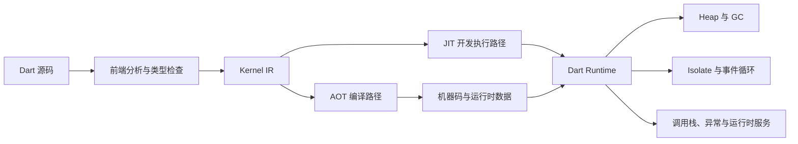
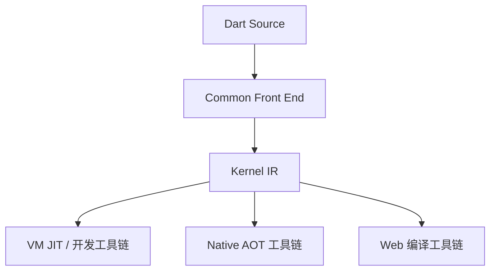
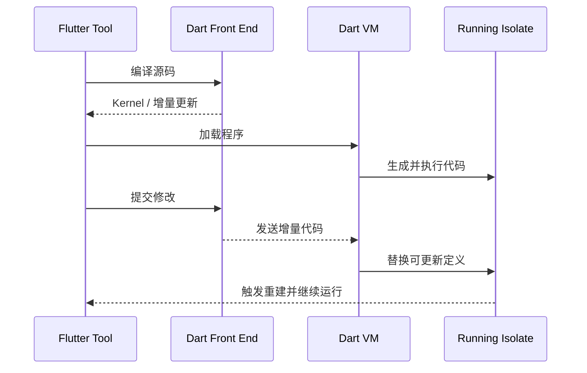
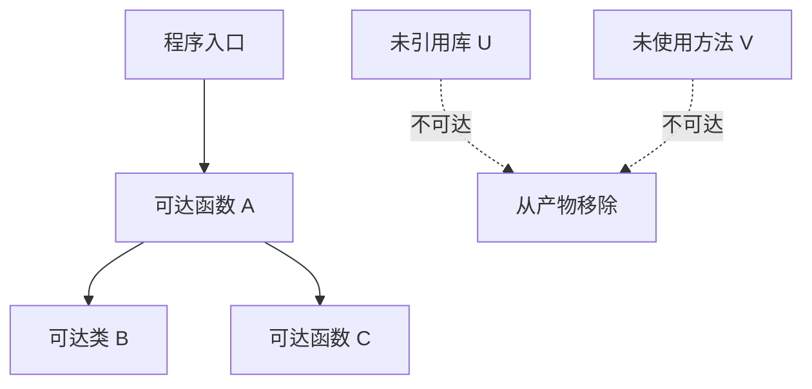
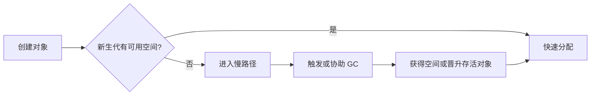
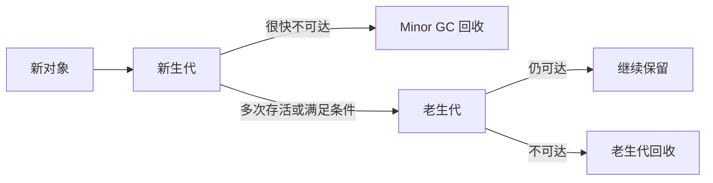
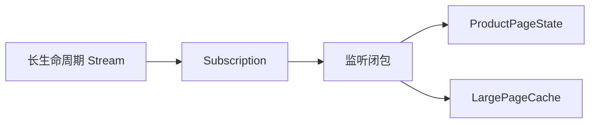
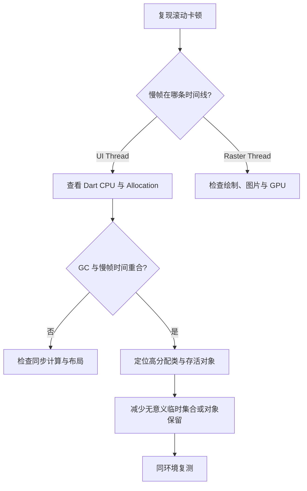

# Dart 运行时详解：从 Kernel IR、JIT/AOT 到对象分配与垃圾回收

> Dart 运行时不是一句“Debug 用 JIT、Release 用 AOT”就能概括。编译模式决定代码如何产生，运行时负责对象、调用与垃圾回收，而 Flutter 的构建模式又在这些能力之上做了工程取舍。

---

## 一、本文解决什么问题

开发 Flutter 应用时，经常遇到看似独立的问题：

- 为什么 Debug 启动和运行较慢，却能热重载？
- 为什么 Release 包不能使用热重载？
- Profile 与 Release 到底有什么区别？
- `const`、短生命周期对象和闭包会怎样影响内存？
- 内存持续上涨是否一定发生了泄漏？
- 为什么同一份 Dart 代码在移动端和 Web 上不能套用相同的运行时结论？

这些问题都与“代码如何进入运行时、对象如何存活、不同平台如何编译”有关。

本文主要讨论 Dart 原生平台上的 Dart VM，以及 Flutter 在 Android、iOS 和 Desktop 上的常见执行路径。Flutter Web 通常编译为 JavaScript 或 WebAssembly，不运行原生 Dart VM；具体后端、默认选择和支持范围会随 Flutter/Dart 版本演进，应以目标 SDK 的官方构建文档和产物为准。

### 核心结论

1. Dart VM 是一组执行与运行时能力，不等于 JIT；它可以支持 JIT、AOT 产物加载、对象管理、垃圾回收和调试服务等不同组合。
2. Kernel IR 是 Dart 前端使用的中间表示之一，不是 CPU 可直接执行的机器码，也不是所有最终产物的统一运行格式。
3. JIT 适合开发期快速迭代与动态代码更新，AOT 适合可预测启动和生产部署；二者是工程取舍，不是简单的“一个快、一个慢”。
4. Flutter 的 Debug、Profile、Release 不只改变一个编译开关，还改变断言、服务扩展、优化和调试能力。
5. 热重载更新代码并尽量保留 Isolate 与对象状态；热重启重建 Dart 执行状态，但通常不等于重新启动宿主进程。
6. Tree Shaking 基于静态可达性删除不可达代码，动态行为、入口标记和平台注册会影响它的边界。
7. Dart VM 的分代回收利用“大多数对象生命周期短”的经验规律，但具体回收器、阈值和对象布局属于版本相关实现。
8. 闭包会延长被捕获对象的可达生命周期；是否形成泄漏取决于闭包自身被谁长期持有。

---

## 二、先建立运行时全景

从 Dart 源码到 Flutter 应用执行，可以先建立一个简化模型：



这张图是概念模型，不是所有平台和 SDK 版本的逐函数调用链。关键关系是：

- 前端理解 Dart 语法和类型，并生成后续阶段可消费的表示；
- JIT 或 AOT 决定可执行代码何时以及如何产生；
- 运行时在执行期间管理 Isolate、对象、调用、异常和垃圾回收；
- Flutter Framework 是运行在 Dart 执行环境中的框架，Engine 和 Embedder 还承担渲染、平台接入等职责。

### 2.1 Dart VM 不等于操作系统虚拟机

Dart VM 是语言运行时实现。它不模拟一台完整计算机，也不意味着所有 Dart 程序总以字节码解释执行。

在不同模式下，它可能参与：

- 加载中间表示或 AOT 产物；
- 生成或执行机器码；
- 管理 Isolate 及其消息通信；
- 管理 Heap、对象分配和垃圾回收；
- 提供异常、StackTrace 和运行时类型支持；
- 暴露调试、性能分析和 Service Protocol 能力。

因此，“用了 AOT 就没有运行时”是错误的。AOT 消除了生产环境中的即时编译需求，但对象模型、垃圾回收、Isolate 调度协作和异常处理仍需要运行时支持。

### 2.2 Dart Isolate 与操作系统线程

Isolate 是 Dart 暴露的并发隔离抽象：每个 Isolate 有独立的 Dart 执行状态，通常也有独立 Heap 和事件循环，通过消息通信协作。

它不等同于“固定绑定一个操作系统线程”。Dart VM 如何把 Isolate 的执行安排到系统线程，是运行时实现与平台策略；应用代码不应依赖某个 Isolate 永久占有某条线程。对于 FFI、平台线程亲和性等场景，需要依据对应 API 的公开契约单独判断。

---

## 三、Kernel IR 是什么

Kernel IR（Intermediate Representation，中间表示）是 Dart 前端与后续编译、运行工具之间使用的一种程序表示。它已经比源码更接近编译器理解的结构，但仍不是特定 CPU 的最终机器码。

### 3.1 为什么需要中间表示

如果每个后端都直接重复处理 Dart 源码，会重复承担解析、名称解析和部分语义分析工作。通过中间表示，前端和后端可以解耦：



Kernel IR 带来的价值包括：

- 前端语义处理可被不同后端复用；
- 增量编译可以围绕变化部分生成更新结果；
- 工具可以在统一程序表示上继续转换；
- 后端专注于目标平台代码生成与优化。

### 3.2 Kernel IR 不是什么

需要避免三种误解：

1. 它不是 Java `.class` 文件的简单对应物，两套生态的装载和执行模型不同。
2. 它不是 CPU 能直接执行的机器码，仍需后端处理。
3. 它不是承诺长期稳定的应用级序列化协议，工程代码不应自行依赖其内部结构。

Kernel 格式、编译阶段和优化细节属于 SDK 工具链实现。分析特定版本源码时，应记录 Dart SDK 版本或提交范围，不能把当前内部类名当作稳定 API。

---

## 四、JIT：为开发反馈速度服务

JIT（Just-In-Time，即时编译）表示可执行代码在程序运行期间生成。Dart VM 的开发执行路径可以装载增量编译结果，并在运行期间生成机器码，因此适合交互式开发。

### 4.1 简化执行过程



开发模式更重视：

- 修改后快速得到反馈；
- 支持断点、单步和服务扩展；
- 保留断言与丰富诊断；
- 支持热重载所需的动态更新。

### 4.2 JIT 不保证每段代码都“先解释再编译”

“JIT 一定先解释字节码，热点后再编译”是其他运行时中常见的介绍方式，但不能不加版本限定地套到 Dart VM。Dart VM 的具体执行层级、优化策略、热点阈值和去优化机制会演进。

稳定的工程结论是：开发期代码可以在运行时生成与替换，运行特征和优化程度不等同于 AOT 生产产物。因此不能用 Debug 模式帧耗时作为发布性能结论。

### 4.3 JIT 的代价

- 运行期间需要支持编译和动态更新，运行时能力更重；
- 开发诊断和断言会增加开销；
- 初始代码与后续优化状态可能不同；
- 性能抖动不适合作为最终用户体验基准；
- 某些平台的安全策略不允许在运行时生成可执行代码。

iOS 对动态生成并执行代码有严格平台限制，这是 Flutter 在真机生产部署中采用 AOT 的重要背景之一。具体开发部署方式由 Flutter 工具链和当前平台政策决定。

---

## 五、AOT：在运行前生成目标代码

AOT（Ahead-Of-Time，预先编译）在应用运行前生成目标平台代码与相关运行时数据。Flutter 原生平台的 Profile 和 Release 构建通常使用 AOT 路径。

### 5.1 AOT 的主要收益

- 运行时不需要为业务代码执行即时编译；
- 启动与稳态性能通常更可预测；
- 编译器可以基于整个可见程序进行优化和 Tree Shaking；
- 产物适合应用商店和生产部署约束；
- 减少生产环境所需的动态编译能力。

### 5.2 AOT 的代价

- 失去热重载依赖的动态代码替换能力；
- 构建耗时高于增量开发编译；
- 静态产物需要携带所需机器码，包体受代码规模影响；
- 运行时实际类型分布等信息在编译时未必完全可知；
- 调试与服务扩展能力受到构建模式限制。

### 5.3 JIT 与 AOT 不能只比较“谁更快”

| 维度 | JIT 开发路径 | AOT 生产路径 |
|---|---|---|
| 代码生成时机 | 运行期间 | 运行之前 |
| 热重载 | 支持所需动态更新能力 | 不支持 |
| 构建反馈 | 增量迭代更快 | 完整构建更重 |
| 诊断能力 | 丰富 | Profile 有限，Release 最少 |
| 性能测量用途 | 不适合作为发布结论 | Profile/Release 更接近生产 |
| Tree Shaking | 不是开发期首要目标 | 生产构建的重要优化 |

JIT 可以利用运行期信息，AOT 可以进行全程序静态优化。哪种路径在某个微基准上更快，取决于代码、运行阶段、SDK 版本和硬件，不能仅凭编译模式下绝对结论。

---

## 六、Debug、Profile、Release 到底差在哪里

Flutter 构建模式是工具链对编译、诊断和优化能力的组合。以下结论主要面向 Flutter 原生应用；Web 的构建和性能工具存在差异。

| 能力 | Debug | Profile | Release |
|---|---|---|---|
| 主要用途 | 功能开发与调试 | 性能分析 | 用户发布 |
| 原生 Dart 编译 | 开发期 JIT 路径 | 通常 AOT | AOT |
| 热重载 | 支持 | 不支持 | 不支持 |
| `assert` | 启用 | 通常禁用 | 禁用 |
| 调试与 Service 扩展 | 最完整 | 保留性能分析所需部分 | 大幅关闭 |
| 编译优化 | 非生产优化配置 | 接近 Release | 生产优化 |
| 性能代表性 | 低 | 高，适合分析 | 最终用户产物 |

“Profile 等于 Release 加 DevTools”是便于记忆但不够严谨的说法。Profile 会保留性能采集所需能力，因此本身也可能引入少量观测开销；最终发布前仍应在 Release 模式完成关键路径验证。

### 6.1 正确的性能测量方式

1. 使用 Profile 或 Release 模式。
2. 在目标档位的真实设备上运行，避免只用模拟器。
3. 明确屏幕刷新率：60 Hz 一帧约 16.67 ms，120 Hz 一帧约 8.33 ms。
4. 使用 DevTools Performance、CPU Profiler、Memory 和应用级 Trace 观察证据。
5. 区分冷启动、预热后稳态、页面首次进入和重复操作。
6. 重复相同场景，记录 SDK、设备、系统版本、构建参数和数据规模。
7. 优化后用同一环境复测，不用主观流畅度替代数据。

```bash
flutter run --profile
flutter run --release
flutter build apk --analyze-size
```

不同平台支持的命令参数可能不同，执行前应以当前 `flutter help` 和官方文档为准。

---

## 七、热重载为什么能保留页面状态

热重载的核心不是“重新运行整个应用”，而是把增量代码更新加载到正在运行的 Dart 环境中，然后由 Flutter Framework 触发界面树重建。


页面状态能够保留，是因为运行中的 Isolate 和既有对象没有整体销毁。Widget 配置会重新创建和比较，已有 Element/State 是否复用仍遵循 Flutter 的类型、位置和 Key 匹配规则。

### 7.1 热重载不会自动重跑所有初始化

```dart
final apiBaseUrl = loadApiBaseUrl();

class CheckoutState extends State<CheckoutPage> {
  @override
  void initState() {
    super.initState();
    controller.load();
  }
}
```

修改顶层初始化表达式或 `initState` 后，热重载通常不会重新创建已经存在的对象，也不会自动再次调用现有 State 的 `initState`。需要重新执行初始化时，应根据变化选择热重启或完整重启，而不是误判新代码没有生效。

### 7.2 热重载存在结构性限制

某些代码形状变化无法安全地应用到既有对象，例如部分泛型形状、枚举或原生侧注册变化。具体限制会随 SDK 演进，Flutter Tool 会在无法应用时报告拒绝原因。

常见处理原则：

- 方法体、Widget `build` 和多数普通字段逻辑修改优先热重载；
- Dart 全局初始化或对象图需要重建时使用热重启；
- Android/iOS 原生代码、插件注册、Manifest、Info.plist 或构建配置变化通常需要完整重启甚至重新构建。

### 7.3 `reassemble` 不是业务生命周期回调

`reassemble` 主要服务开发期热重载。它可能被多次调用，且 Release 中不能依赖它执行关键业务逻辑。若资源需要稳定初始化与释放，应使用正常生命周期和显式资源所有权。

---

## 八、热重启与完整重启

三者的边界可以这样理解：

| 操作 | Dart 代码更新 | 保留 Dart 对象状态 | 重启宿主应用进程 | 原生改动生效 |
|---|---|---|---|---|
| 热重载 | 是 | 尽量保留 | 否 | 通常否 |
| 热重启 | 是 | 否 | 通常否 | 通常否 |
| 完整重启 | 是 | 否 | 是 | 重新构建后生效 |

热重启会重建 Dart 执行状态并重新运行应用入口，因此内存中的单例、页面栈和 State 会丢失。但宿主进程及某些原生状态是否完全重建，不能等同于“杀进程再启动”。

调试生命周期问题时，要明确使用了哪种操作。例如只做热重启无法验证应用进程冷启动、原生 SDK 初始化或系统恢复场景。

---

## 九、Tree Shaking 如何减少产物代码

Tree Shaking 通过静态分析从入口出发计算可达程序，删除确认不可达的代码。它主要作用于生产编译产物，不是运行时定期清理代码。



### 9.1 Tree Shaking 的边界

编译器必须保守地保留可能被调用的代码。以下因素会影响可达性判断：

- 反射或动态调用；
- FFI 从原生侧查找的 Dart 入口；
- 后台回调、插件回调等非普通 Dart 调用入口；
- 代码生成产生的注册表；
- 资源清单和原生依赖，它们不一定属于 Dart 代码 Tree Shaking 范围。

某些入口需要使用 SDK 提供的入口保留标记，例如原生侧回调可能需要 `@pragma('vm:entry-point')`。`pragma` 名称和语义属于工具链契约的一部分，使用前应核对当前 Dart/Flutter 官方文档，不应到处添加以“防止误删”，否则会扩大保留范围。

### 9.2 不要用源码行数推断包体

评估包体应分析实际构建产物：

```bash
flutter build apk --release --analyze-size
flutter build appbundle --release --analyze-size
```

需要区分：

- Dart AOT 代码；
- Flutter Engine 与原生库；
- 图片、字体和其他资源；
- 多 ABI 合并包与单 ABI 下载体积；
- 调试符号是否被分离；
- 商店压缩前后大小。

只有先确认占比，才能判断优化 Dart 依赖、压缩资源还是拆分原生库。

---

## 十、对象如何分配

执行下面的代码时，Dart 需要为运行时对象提供存储：

```dart
final order = Order(
  id: 'order-1',
  items: List<OrderItem>.of(sourceItems),
);
```

从语言层面只能确定对象的可观察语义，不能仅凭源码断言每个值一定在 Heap 上独立分配。编译器可能进行内联、逃逸相关优化、常量复用或表示优化，只要不改变公开语义。

### 10.1 常见的 VM 实现思路

在 Dart VM 的分代 Heap 中，新对象通常进入面向短生命周期对象的区域。快速路径可能通过指针递增完成分配；空间不足时进入慢路径并可能触发垃圾回收。



这是常见实现模型，不是 Dart 语言规范保证。对象头大小、对齐、压缩指针、TLAB 风格分配区、晋升阈值等细节与 SDK 版本、架构和构建配置有关。

### 10.2 短命对象不等于零成本

新生代分配通常很快，但对象仍可能带来：

- 初始化与字段写入；
- 更高的分配速率；
- 更频繁的 Minor GC；
- GC 扫描与复制存活对象的成本；
- 缓存局部性变化；
- 在高频帧路径上形成抖动。

不要因为“GC 会回收”就在 `build`、动画回调或列表滚动中无条件创建大型临时集合。也不要凭代码观感进行对象池优化；对象池会增加生命周期、重置状态和并发安全复杂度，且可能让本来短命的对象长期存活。

### 10.3 `const` 的意义与边界

```dart
const padding = EdgeInsets.symmetric(horizontal: 16);
```

常量表达式允许实现复用规范化的常量对象，并能减少某些重复实例创建。在 Flutter 中合理使用 `const` Widget 还可向框架表达配置实例不变。

但 `const` 不是通用性能开关：

- 它不能消除所有 Widget 树遍历；
- 它不能修复昂贵布局、绘制或图片解码；
- 是否改善帧耗时必须通过 Profile 数据验证；
- 不应为了增加 `const` 而破坏可读性或错误地静态化动态数据。

---

## 十一、分代垃圾回收

垃圾回收器从根对象出发判断可达性。无法从根集合到达的对象，才具备被回收的条件。

典型根可能包括：

- 当前执行栈和寄存器中的引用；
- 静态或全局可达对象；
- 活跃 Port、Timer、订阅与回调持有的对象；
- 运行时内部维护的引用。

### 11.1 为什么要分代

很多应用符合弱分代假说：大多数新对象很快失去引用，少数对象长期存活。分代 GC 据此把不同年龄对象区别处理：



新生代回收通常可以聚焦较小区域，快速处理大量短命对象。长期存活对象进入老生代后，由适合较大对象集合的策略回收。

### 11.2 Minor GC 与老生代 GC

工程上可这样理解：

- Minor GC：重点处理新生代，频率可能较高，单次通常较短；
- 老生代 GC：涉及长期存活对象，单次成本和触发条件更复杂；
- 写屏障与 remembered set：帮助 GC 追踪老对象指向新对象的引用，避免每次扫描全部老生代。

Dart VM 具体采用并发、并行、标记、清扫或压缩策略的组合会随版本和场景变化。不要把某篇旧源码分析中的 collector 名称、线程数量或停顿阶段当作永久结论。

### 11.3 Stop-The-World 不等于整个应用长时间冻结

某些 GC 阶段需要暂停相关 Isolate 的 Dart 代码以获得一致视图，常被称为 Stop-The-World。现代运行时也会把部分工作并行或并发执行，以控制暂停时间。

实际用户是否感知卡顿取决于：

- 暂停发生在哪个 Isolate；
- 暂停持续时间与屏幕帧预算；
- 当时是否处于动画或输入关键路径；
- 对象存活比例、Heap 大小和分配速率；
- 设备性能和 SDK 版本。

不能只看到一次 GC 日志就断言它造成掉帧，必须把 GC 事件与 Timeline、UI/Raster 帧耗时按时间关联。

---

## 十二、内存上涨不一定是泄漏

GC 管理的是对象可达性，不保证内存曲线立即回到启动值。Heap 可能保留已申请空间以供后续复用，缓存也可能按设计增长。

需要区分：

| 现象 | 可能原因 | 验证方式 |
|---|---|---|
| 操作后上涨，GC 后明显下降 | 大量临时对象 | 观察分配速率与 GC 前后 Heap |
| 多轮相同操作后平台化 | 缓存预热或 Heap 扩容 | 重复稳定场景，观察是否达到稳态 |
| 每轮操作后基线持续上涨 | 对象被意外持有 | Heap Snapshot、Diff、Retaining Path |
| Dart Heap 稳定但进程内存上涨 | 图片、GPU、原生库或插件资源 | 结合平台内存工具和 Flutter Memory |

### 12.1 推荐诊断流程

1. 在 Profile 模式和目标设备复现稳定操作序列。
2. 记录操作前、操作后和等待回收后的 Heap Snapshot。
3. 对多轮快照做 Diff，定位持续增长的类。
4. 查看对象 Retaining Path，找到从 GC Root 到目标对象的引用链。
5. 检查 Timer、StreamSubscription、ChangeNotifier、Port、闭包和全局缓存。
6. 修复所有权或释放逻辑后，使用同一脚本复测。
7. 若 Dart Heap 不增长，继续检查图片、Engine、FFI 和平台插件资源。

强制 GC 只能辅助实验，不能成为业务逻辑，也不能替代对 Retaining Path 的分析。

---

## 十三、闭包捕获如何延长对象生命周期

闭包不仅包含函数代码，还需要保存其使用的外部变量环境。只要闭包仍可达，被捕获的对象也可能继续可达。

### 13.1 一个典型错误

```dart
class ProductPageState extends State<ProductPage> {
  StreamSubscription<ProductEvent>? _subscription;

  @override
  void initState() {
    super.initState();
    final pageCache = LargePageCache();

    _subscription = productEvents.listen((event) {
      pageCache.apply(event);
      if (!mounted) return;
      setState(() {});
    });
  }

  // 错误：没有取消订阅
}
```

引用链可能是：



即使页面从导航栈移除，只要订阅仍被事件源持有，闭包、State 和缓存都可能无法回收。

### 13.2 正确释放资源

```dart
class ProductPageState extends State<ProductPage> {
  StreamSubscription<ProductEvent>? _subscription;
  final LargePageCache _pageCache = LargePageCache();

  @override
  void initState() {
    super.initState();
    _subscription = productEvents.listen(
      _onProductEvent,
      onError: _onProductError,
    );
  }

  void _onProductEvent(ProductEvent event) {
    _pageCache.apply(event);
    if (!mounted) return;
    setState(() {});
  }

  void _onProductError(Object error, StackTrace stackTrace) {
    logger.error('product event failed', error, stackTrace);
  }

  @override
  void dispose() {
    _subscription?.cancel();
    _subscription = null;
    _pageCache.dispose();
    super.dispose();
  }
}
```

这里关键不是把匿名闭包改成具名方法，而是取消长生命周期事件源对回调的持有，并释放缓存。具名方法主要提高所有权可读性。

### 13.3 捕获变量而不是值的工程影响

闭包通常捕获变量环境。异步循环中若变量在后续变化，应显式创建本次操作需要的不可变值，避免结果写错目标：

```dart
for (final product in products) {
  final productId = product.id;
  unawaited(repository.load(productId).then((detail) {
    cache[productId] = detail;
  }));
}
```

现代 Dart 对常见循环变量有明确语义，但真实代码还可能捕获可变字段、Controller 或大型上下文对象。工程上应最小化捕获范围，并为异步结果增加取消或版本校验。

### 13.4 `BuildContext` 捕获边界

```dart
Future<void> save() async {
  await repository.save();
  if (!context.mounted) return;
  Navigator.of(context).pop();
}
```

`mounted` 检查解决的是异步完成后能否安全使用 Context，不会主动取消工作，也不会自动解除其他对象持有的闭包。若 Future 被全局队列长期保存，仍需检查队列所有权和取消策略。

---

## 十四、常见误区

### 14.1 “Debug 卡顿说明 Release 也卡”

Debug 包含断言、诊断、JIT 开发路径和框架调试检查，不能代表生产性能。应在 Profile 的真实设备上定位，再用 Release 验证。

### 14.2 “AOT 后不再需要 Dart VM”

AOT 只是提前产生代码。对象、GC、Isolate 和异常仍需运行时支持，更准确的说法是生产环境不需要 JIT 编译业务代码。

### 14.3 “热重载会重新执行 `main` 和 `initState`”

热重载尽量保留对象状态，通常不会重新运行 `main` 或既有 State 的 `initState`。需要重建 Dart 状态时使用热重启。

### 14.4 “用了 `const` 就不会 Rebuild”

`const` 允许复用常量实例，但父级构建和框架遍历仍可能发生。Rebuild、Relayout、Repaint、Composite 与 Raster 是不同阶段，必须用工具定位真实瓶颈。

### 14.5 “GC 后内存必须回到原值”

不可达对象可以被回收，不代表运行时立刻把全部已申请内存归还操作系统。应观察多轮操作后的稳态、Heap Diff 和引用链。

### 14.6 “闭包一定导致内存泄漏”

闭包本身不是泄漏。只有闭包被长生命周期对象持有，并捕获了本应释放的对象时，才会造成非预期保留。

### 14.7 “所有 Dart 平台都运行 Dart VM”

Flutter Web 通常使用 JavaScript 或 WebAssembly 相关编译后端，内存管理和性能特征受浏览器运行时影响。原生 VM 的 GC 和 JIT/AOT 细节不能直接套到 Web。

### 14.8 “对象分配快，所以无需关注分配”

单次快速分配不代表无限吞吐免费。高分配率会增加初始化、GC 和内存带宽成本，尤其可能影响高刷新率设备的帧预算。

---

## 十五、工程实践：定位一次滚动内存抖动

假设商品瀑布流在快速滚动时周期性掉帧，同时 Memory 图表呈锯齿上涨与下降。

### 15.1 建立假设前先测量

测试环境应记录：

- Flutter 与 Dart SDK 版本；
- Profile 模式；
- 目标设备、系统版本和屏幕刷新率；
- 商品数量、图片规格和滚动脚本；
- UI、Raster 帧耗时，GC 时间点和分配速率。

### 15.2 分层排查



例如发现每次 `build` 都执行：

```dart
final visibleProducts = products
    .where((item) => item.isVisible)
    .map(ProductViewData.fromEntity)
    .toList();
```

不能立刻断言链式调用是根因。应先在 CPU Profile 和 Allocation 中确认它的调用频率、耗时与分配量。如果过滤结果只随 `products` 或筛选条件变化，可以把派生计算移到状态更新边界并缓存不可变结果：

```dart
void updateProducts(List<Product> products) {
  final next = products
      .where((item) => item.isVisible)
      .map(ProductViewData.fromEntity)
      .toList(growable: false);

  state = state.copyWith(visibleProducts: next);
}
```

这项优化的收益必须通过相同滚动脚本验证。同时还要检查图片解码和 Raster 时间，避免把相关出现的 GC 误判为唯一因果。

---

## 十六、如何阅读 Dart VM 源码而不过度推断

运行时文章很容易把某个版本的内部实现写成永久事实。源码分析应遵守以下边界：

1. 记录 Dart SDK tag、commit 和目标架构。
2. 从稳定入口或可观测行为出发，再追踪关键调用链。
3. 区分语言规范、工具链契约、VM 内部实现和实验配置。
4. 不凭类名推断完整行为，结合调用方、分支条件和测试。
5. 用最小可复现实验验证源码理解。
6. 性能数据注明模式、设备、样本规模和预热条件。
7. 升级 SDK 后重新验证，不沿用旧 collector、阈值或线程结论。

例如“新对象通常在新生代快速分配”是有工程价值的一般模型；“所有对象固定占用多少字节、存活几次必然晋升”则需要针对当前 SDK、架构与对象类型从源码或测量验证。

---

## 十七、总结

Dart 运行时需要建立两条知识主线。

第一条是代码执行链路：

- Dart 前端把源码转换为后续工具可消费的 Kernel IR；
- Debug 倾向 JIT 开发路径，以动态更新和诊断换取迭代效率；
- Profile 与 Release 在原生平台通常使用 AOT，以生产优化换取可预测执行；
- 热重载保留运行状态并更新代码，热重启重建 Dart 状态，完整重启才覆盖宿主进程和原生改动；
- Tree Shaking 在生产编译中移除静态不可达代码。

第二条是对象生命周期：

- 新对象通常在适合短命对象的区域快速分配；
- 分代 GC 根据可达性回收对象，并将长期存活对象区别管理；
- Heap 上涨、GC 和泄漏是相关但不同的问题；
- 闭包、订阅、Timer、Port 与缓存都可能延长对象可达时间；
- 最终结论必须通过 Profile、Timeline、Heap Diff 和 Retaining Path 验证。

最重要的边界是：Dart 语言语义相对稳定，Dart VM 内部实现持续演进，Flutter Web 又有不同执行后端。回答运行时问题时，必须先说明平台、构建模式与 SDK 版本范围。

---

## 问答复盘

### Q1：Dart VM 和 JIT 是同一个概念吗？

**答：** 不是。JIT 是代码生成时机，Dart VM 是更完整的执行与运行时实现。AOT 产物运行时仍需要对象模型、GC、Isolate 和异常等能力。

### Q2：Kernel IR 能直接被 CPU 执行吗？

**答：** 不能。Kernel IR 是前端与后端之间的中间表示，仍需由对应编译或执行后端转换和处理。

### Q3：为什么不能在 Debug 模式得出发布性能结论？

**答：** Debug 使用开发期编译路径，并启用断言、诊断和调试检查，执行特征与生产 AOT 产物不同。应在 Profile 真实设备上分析，并用 Release 验证关键结论。

### Q4：热重载、热重启和完整重启最关键的区别是什么？

**答：** 热重载尽量保留 Dart 对象状态，热重启重建 Dart 执行状态，完整重启还会重启宿主应用并使重新构建的原生改动生效。

### Q5：添加 `const` 是否能保证 Widget 不再 Rebuild？

**答：** 不能。`const` 可复用常量实例并帮助框架识别相同配置，但父级构建和树遍历仍可能发生，也不直接消除 Relayout、Repaint 或 Raster 成本。

### Q6：GC 后 Dart Heap 没有回到初始值，能否判定泄漏？

**答：** 不能。运行时可能保留 Heap 容量，缓存也可能按设计驻留。应重复场景观察基线是否持续上涨，并用 Heap Diff 与 Retaining Path 找到意外引用链。

### Q7：闭包捕获 `BuildContext` 就一定泄漏吗？

**答：** 不一定。关键是闭包是否被比页面更长生命周期的对象持有。异步后还要用 `context.mounted` 保证调用安全，但释放订阅和取消工作需要单独处理。

### Q8：一次滚动慢帧旁边正好出现 GC，能否断定 GC 是根因？

**答：** 不能只凭时间接近下结论。需要对齐 Timeline，检查暂停是否覆盖慢帧，再结合 UI/Raster 耗时、CPU Profile、分配速率和对象存活比例验证因果关系。

### Q9：原生 Flutter 与 Flutter Web 可以共用同一套 Dart VM 调优结论吗？

**答：** 不可以直接共用。Web 产物通常运行在 JavaScript 或 WebAssembly 与浏览器环境中，应使用对应浏览器和 Flutter Web 工具分析，不能套用原生 VM 的 Heap 与 GC 实现细节。

---

## 延伸知识

- Isolate：独立 Heap、事件循环、消息复制与 `TransferableTypedData`。
- Dart 异步模型：Event Queue、Microtask Queue 与 Future 调度。
- Flutter 帧流水线：Build、Layout、Paint、Composite 与 Raster。
- DevTools：CPU Sampling、Timeline、Allocation Profile 与 Heap Snapshot。
- AOT 产物分析：符号拆分、混淆、包体组成和崩溃符号化。
- Flutter Web：JavaScript 与 WebAssembly 后端的执行和性能差异。
