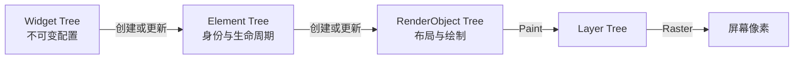
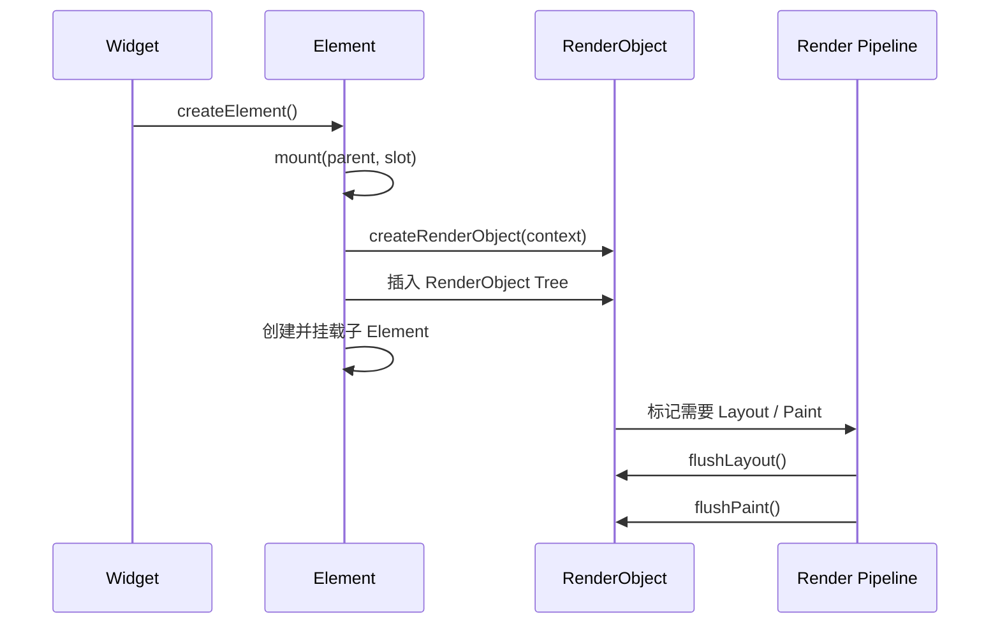
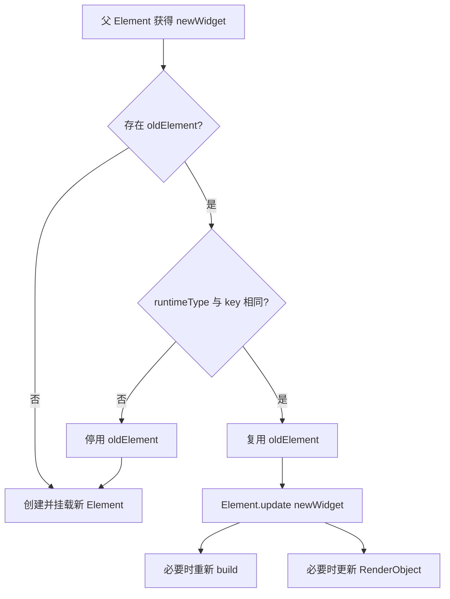
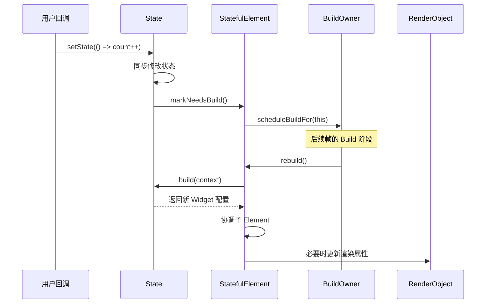
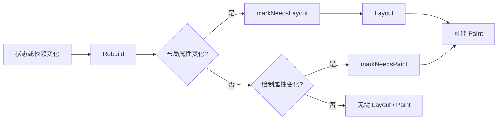
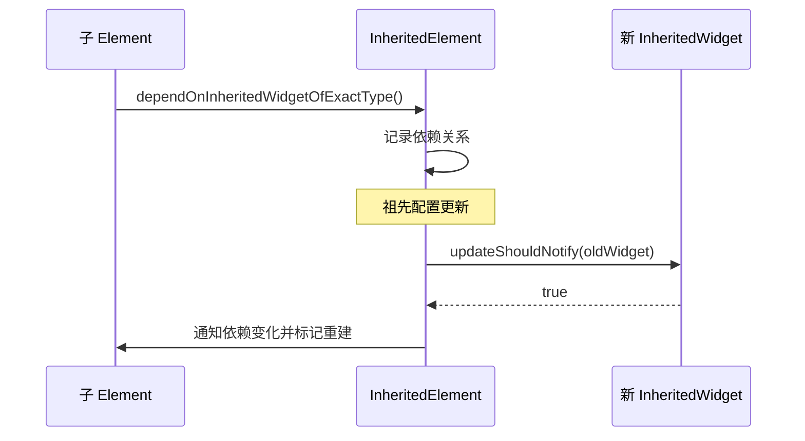

# Flutter 三棵树协作机制：从 Widget 配置到屏幕像素

> 本文聚焦 Flutter Framework 中的 Widget、Element、RenderObject 三棵树，解释它们如何完成首次挂载、状态更新、节点复用、布局与绘制。

---

## 一、问题：`build()` 返回的 Widget 如何变成界面

下面是一段普通的 Flutter 代码：

```dart
class CounterPage extends StatefulWidget {
  const CounterPage({super.key});

  @override
  State<CounterPage> createState() => _CounterPageState();
}

class _CounterPageState extends State<CounterPage> {
  int count = 0;

  @override
  Widget build(BuildContext context) {
    return Column(
      children: [
        Text('Count: $count'),
        FilledButton(
          onPressed: () => setState(() => count++),
          child: const Text('Increment'),
        ),
      ],
    );
  }
}
```

点击按钮后，`count` 改变，`build()` 再次执行，界面随之更新。这个过程容易产生三个误解：

1. Widget 就是屏幕上的真实控件。
2. 每次 `build()` 都会销毁并重建整个界面。
3. Widget 重建后一定会重新布局和绘制。

这三个结论都不准确。Flutter 将配置、树中身份和实际渲染拆分给了三套对象：



先记住核心结论：

> Widget 是配置，Element 是树中的长期身份，RenderObject 是布局与绘制的执行者。Widget 可以频繁创建，而 Element 和 RenderObject 会在满足条件时被复用。

---

## 二、为什么需要三棵树

如果一个 UI 对象同时保存配置、可变状态、父子关系、依赖、布局结果和绘制缓存，它会非常复杂。Flutter 通过职责分离降低声明式 UI 的更新成本。

| 对象 | 核心职责 | 是否可变 | 生命周期 |
|---|---|:---:|---|
| Widget | 描述某一时刻的 UI 配置 | 否 | 短，可频繁创建 |
| Element | 保存节点身份、挂载关系、依赖与生命周期 | 是 | 通常较长 |
| RenderObject | 执行布局、绘制、命中测试与语义构建 | 是 | 通常较长 |

三棵树并不严格一一对应：

- 每个 Widget 都会对应一个 Element。
- 只有 `RenderObjectWidget` 才负责创建或更新 RenderObject。
- `StatelessWidget` 和 `StatefulWidget` 通常通过 `build()` 组合其他 Widget，本身不直接创建 RenderObject。

---

## 三、Widget Tree：当前界面的配置快照

Widget 保存开发者声明的配置。例如，`Text` 保存文字和样式，`Padding` 保存内边距，但它们不是最终执行文字测量或布局计算的对象。

Widget 的关键特征是：

- 字段通常为 `final`，对象不可变。
- 创建成本相对较低。
- 可以在每次 `build()` 中重新创建。
- 描述“当前状态下界面应该是什么样”。

不可变性让框架可以用“新配置替换旧配置”的方式更新界面，不需要追踪同一个配置对象内部发生过哪些修改。

从三棵树协作角度，Widget 可分为三类：

| 类型 | 作用 | 示例 |
|---|---|---|
| Component Widget | 通过 `build()` 组合其他 Widget | StatelessWidget、StatefulWidget |
| Proxy Widget | 向子树传递配置或依赖 | InheritedWidget |
| RenderObjectWidget | 创建和更新 RenderObject | Padding、Flex 对应的底层 Widget 类型 |

其中，`RenderObjectWidget` 是配置世界进入渲染世界的桥梁。

---

## 四、Element Tree：三棵树协作的核心

### 4.1 Element 保存节点身份

Widget 可以频繁替换，框架仍需要稳定保存：

- 节点在树中的位置。
- 旧 Widget 与新 Widget 是否代表同一节点。
- StatefulWidget 对应的 State。
- 节点依赖的 InheritedWidget。
- 节点关联的 RenderObject。

这些信息由 Element 保存。Element 可以理解为：

> Widget 在当前界面树中的一次具体实例化，以及框架管理该节点的长期句柄。

常见对应关系如下：

| Widget | Element |
|---|---|
| StatelessWidget | StatelessElement |
| StatefulWidget | StatefulElement |
| InheritedWidget | InheritedElement |
| RenderObjectWidget | 对应的 RenderObjectElement 子类 |

### 4.2 BuildContext 为什么与 Element 有关

`BuildContext` 是一个抽象接口，Element 实现了该接口。因此，传入 `build()` 的 Context 本质上是当前 Element 对外暴露的树位置。

这解释了以下行为：

- `Theme.of(context)` 从当前位置向上查找主题。
- `Navigator.of(context)` 查找当前节点祖先中的 Navigator。
- 不同层级的 Context 可能得到不同查找结果。
- Element 卸载后，原 Context 不应继续使用。

### 4.3 State 保存在哪里

StatefulWidget 仍然是不可变配置，可变 State 由 StatefulElement 持有：

```text
StatefulWidget   新配置，可被替换
       ↓
StatefulElement  稳定身份，持有 State
       ↓
State            可变的 UI 或业务状态
```

只要 StatefulElement 被复用，State 就能保留。父组件重新创建一个 StatefulWidget 对象，并不意味着 State 一定被销毁。

---

## 五、RenderObject Tree：布局与绘制的执行者

RenderObject 负责：

- 接收父节点约束。
- 计算自身尺寸。
- 布局和定位子节点。
- 记录绘制指令。
- 参与命中测试。
- 生成可访问性语义信息。

例如，Widget 只声明“内边距为 16”，真正根据父约束计算尺寸的是对应 RenderObject。

Flutter 中有两套重要布局协议：

| 协议 | 典型对象 | 场景 |
|---|---|---|
| RenderBox | Row、Column、Padding、Text | 普通二维盒模型布局 |
| RenderSliver | SliverList、SliverGrid | 基于滚动窗口的惰性布局 |

RenderObject 会保存布局结果、父子渲染关系和绘制相关状态，因此框架会尽量更新并复用它，而不是跟随 Widget 一起频繁重建。

---

## 六、首次挂载：三棵树如何建立

以下面的 Widget 为例：

```dart
Padding(
  padding: const EdgeInsets.all(16),
  child: ColoredBox(
    color: Colors.blue,
    child: const SizedBox(width: 100, height: 60),
  ),
)
```

首次挂载的大致过程如下：



过程可概括为：

1. Widget 创建对应 Element。
2. Element 挂载到 Element Tree。
3. 遇到 RenderObjectWidget 时，Element 调用 `createRenderObject()`。
4. RenderObject 被插入正确的渲染位置。
5. Component Element 通过 `build()` 继续展开子 Widget。
6. 渲染管线完成 Layout、Paint 和合成。

`StatelessWidget` 与 `StatefulWidget` 不直接创建 RenderObject，它们会持续向下展开，直到遇到 RenderObjectWidget。

---

## 七、更新复用：新 Widget 如何协调旧节点

### 7.1 Widget.canUpdate

父 Element 得到一个新子 Widget 后，需要判断它能否更新旧 Element。核心条件可以概括为：

```dart
static bool canUpdate(Widget oldWidget, Widget newWidget) {
  return oldWidget.runtimeType == newWidget.runtimeType &&
      oldWidget.key == newWidget.key;
}
```

- 类型和 Key 都相同：认为新旧 Widget 表示同一逻辑节点，复用 Element。
- 类型或 Key 不同：旧 Element 不能直接更新，需要创建新的 Element。

比较的不是两个 Widget 的全部字段是否相等。

### 7.2 更新流程



复用后，Element 将其 `widget` 引用更新为新配置：

- StatelessElement 重新执行 `build()`。
- StatefulElement 更新 `state.widget`，执行 `didUpdateWidget()`，再执行 `build()`。
- RenderObjectElement 调用 `updateRenderObject()` 更新已有 RenderObject。

### 7.3 RenderObject 属性更新示例

下面是一个简化的 RenderObjectWidget：

```dart
class Gap extends SingleChildRenderObjectWidget {
  const Gap({
    required this.distance,
    super.child,
    super.key,
  });

  final double distance;

  @override
  RenderGap createRenderObject(BuildContext context) {
    return RenderGap(distance: distance);
  }

  @override
  void updateRenderObject(BuildContext context, RenderGap renderObject) {
    renderObject.distance = distance;
  }
}

class RenderGap extends RenderProxyBox {
  RenderGap({required double distance}) : _distance = distance;

  double _distance;

  set distance(double value) {
    if (_distance == value) return;
    _distance = value;
    markNeedsLayout();
  }

  @override
  void performLayout() {
    child?.layout(constraints, parentUsesSize: true);
    final childSize = child?.size ?? Size.zero;
    size = constraints.constrain(
      Size(childSize.width, childSize.height + _distance),
    );
  }
}
```

当 `distance` 变化时：

1. 新 Gap Widget 被创建。
2. 类型与 Key 匹配，原 Element 被复用。
3. Element 调用 `updateRenderObject()`。
4. 已有 RenderGap 的 Setter 接收新值。
5. 值真正变化后调用 `markNeedsLayout()`。

这里没有创建新的 RenderGap，说明 Widget 重建与 RenderObject 重建是两件不同的事。

---

## 八、`setState` 如何驱动三棵树更新

`setState()` 不会直接执行布局或绘制。它主要完成两件事：

1. 同步执行状态修改回调。
2. 将对应 StatefulElement 标记为需要重新构建。



`setState` 回调需要保持同步。下面的写法不正确：

```dart
// 错误：状态更新边界变得不明确
setState(() async {
  count = await repository.loadCount();
});
```

应先等待异步结果，再同步提交状态：

```dart
Future<void> reload() async {
  final newCount = await repository.loadCount();
  if (!mounted) return;

  setState(() {
    count = newCount;
  });
}
```

`mounted` 只能证明 Element 仍在树中。如果请求可能并发，还需要取消旧请求或校验请求代次，防止旧结果覆盖新状态。

---

## 九、Rebuild 不等于 Relayout 和 Repaint



### 9.1 Rebuild

发生在 Element Tree。框架调用 `build()` 获取新 Widget 配置，并协调子 Element。

### 9.2 Relayout

发生在 RenderObject Tree。尺寸或约束相关属性变化时，RenderObject 调用 `markNeedsLayout()`。

常见触发包括 Padding、宽高、Flex 参数和字体尺寸变化。

### 9.3 Repaint

发生在 RenderObject Tree。绘制内容变化但不一定影响尺寸时，RenderObject 调用 `markNeedsPaint()`，例如背景颜色或装饰变化。

RenderObject 的 Setter 通常先比较新旧值：

```dart
set color(Color value) {
  if (_color == value) return;
  _color = value;
  markNeedsPaint();
}
```

如果有效属性没有改变，更新可以止步于 Build 阶段。

---

## 十、Key 如何决定 State 是否保留

没有 Key 时，同层节点主要按位置和类型匹配：

```dart
Column(
  children: users
      .map((user) => UserCard(user: user))
      .toList(),
)
```

如果列表调换顺序，同一位置的新旧 Widget 类型仍然相同。框架可能复用该位置原来的 Element 和 State，导致状态跟随位置，而不是跟随用户。

应使用稳定业务 Key：

```dart
Column(
  children: users
      .map(
        (user) => UserCard(
          key: ValueKey(user.id),
          user: user,
        ),
      )
      .toList(),
)
```

此时 Element 可以根据 `user.id` 识别节点身份，让 State 跟随业务对象移动。

不要在 `build()` 中随意创建 `UniqueKey()`：它每次都是新身份，会主动破坏 Element 和 State 复用。

`GlobalKey` 支持跨父节点移动时保留同一 Element 和 State，但需要维护全局唯一性，还可能引发子树迁移和依赖重建。普通列表身份应优先使用 ValueKey 等 LocalKey。

---

## 十一、InheritedWidget 如何利用 Element 传播依赖

Theme、MediaQuery、Provider 等能力依赖 Element Tree 中的祖先查找和依赖注册。

当子节点调用：

```dart
final theme = Theme.of(context);
```

其过程可以概括为：



- InheritedWidget 保存最新配置和通知判断规则。
- InheritedElement 保存树中身份和依赖者。
- 依赖者收到通知后重新 Build。

因此，真正维护依赖关系的是 Element，而不是短生命周期的 Widget。

---

## 十二、性能问题应该定位到哪一层

| 问题 | 主要层次 | 常见方向 |
|---|---|---|
| Build 频繁 | Element / Widget | 缩小监听范围、状态下沉、Selector |
| Build 单次耗时高 | Widget 构建逻辑 | 移除同步重计算、复用稳定输入 |
| Layout 耗时高 | RenderObject | 避免 Intrinsic、多次测量和复杂约束传播 |
| Paint 耗时高 | RenderObject | 简化裁剪、阴影、透明和滤镜 |
| Raster 耗时高 | Engine / GPU | 检查图片解码、Shader、saveLayer |

三个常见优化手段作用于不同层次：

- `const` 主要帮助稳定 Widget 配置，不能直接解决昂贵 Layout 或 Raster。
- Widget 拆分只有形成合理的状态和更新边界时，才可能减少 Build 工作。
- `RepaintBoundary` 隔离的是 Paint，不减少 Widget Build；过多边界还会增加 Layer 和合成成本。

性能优化应在目标设备的 Profile 模式中使用 DevTools 验证，不能仅根据 Widget 名称或经验判断。

---

## 十三、源码阅读入口

以下符号可以串起三棵树的主要调用链。它们属于 Flutter Framework 内部实现，具体细节可能随 SDK 版本变化，阅读时应锁定版本。

| 主题 | 重点符号 |
|---|---|
| Widget 匹配 | `Widget.canUpdate` |
| 子节点协调 | `Element.updateChild` |
| Build 调度 | `Element.markNeedsBuild`、`BuildOwner.scheduleBuildFor` |
| Component 重建 | `ComponentElement.performRebuild` |
| RenderObject 创建与更新 | `createRenderObject`、`updateRenderObject` |
| 布局和绘制脏标记 | `markNeedsLayout`、`markNeedsPaint` |
| 渲染流水线 | `PipelineOwner.flushLayout`、`flushPaint` |

推荐先追踪下面的主链路：

```text
State.setState
  → Element.markNeedsBuild
  → BuildOwner.scheduleBuildFor
  → Element.rebuild
  → ComponentElement.performRebuild
  → Element.updateChild
  → Widget.canUpdate
  → Element.update 或创建新 Element
```

---

## 十四、总结

理解 Flutter 三棵树，可以归纳为以下几点：

1. Widget 是不可变配置，用于描述当前 UI。
2. Element 保存节点身份、挂载关系、依赖和生命周期。
3. StatefulWidget 的 State 由 StatefulElement 持有。
4. RenderObject 负责布局、绘制、命中测试和语义。
5. RenderObjectWidget 是配置与渲染之间的桥梁。
6. 新旧 Widget 的类型与 Key 相同，Element 通常可以复用。
7. Rebuild、Relayout、Repaint 是不同阶段。
8. 性能分析必须先确定问题位于哪棵树和哪个流水线阶段。

一句话概括三棵树的协作关系：

> Widget 持续提供新的界面配置，Element 将新配置与现有节点身份协调起来，RenderObject 根据真正变化的渲染属性完成布局和绘制。

---

## 十五、问答复盘

### Q1：Widget、Element、RenderObject 分别解决什么问题？

**答：** Widget 描述不可变配置，Element 保存节点身份、状态与依赖，RenderObject 执行布局和绘制。三者分离让声明式配置可以频繁变化，同时复用成本较高的底层对象。

### Q2：为什么每次 `build()` 创建新 Widget，不会导致整个界面重建？

**答：** Element 会协调新旧 Widget。只要 `runtimeType` 和 Key 相同，原 Element 通常会被复用，并用新 Widget 更新配置；关联的 RenderObject 也可以继续复用。

### Q3：State 为什么不会随新的 StatefulWidget 一起丢失？

**答：** State 由 StatefulElement 持有，不由 StatefulWidget 持有。只要 Element 被复用，State 就会保留，并让其 `widget` 引用指向新的配置。

### Q4：调用 `setState()` 后是否会立即执行 `build()`？

**答：** 不会。`setState()` 同步修改状态并将对应 Element 标记为 Dirty，框架通常在后续帧的 Build 阶段统一处理重建。

### Q5：Rebuild 一定会触发 Layout 和 Paint 吗？

**答：** 不一定。只有 RenderObject 的布局属性变化才需要 Layout，绘制属性变化才需要 Paint。如果有效渲染属性没有变化，更新可以止步于 Build。

### Q6：列表重排时为什么需要 ValueKey？

**答：** 没有 Key 时，同层节点主要按位置和类型匹配，State 可能跟随位置。ValueKey 用稳定业务 ID 标识节点，使 Element 和 State 跟随对应数据移动。

### Q7：`const`、Widget 拆分和 RepaintBoundary 优化的是同一阶段吗？

**答：** 不是。`const` 主要稳定 Widget 配置，合理拆分可以形成更小的 Build 边界，RepaintBoundary 隔离 Paint。三者不能互相替代，也都不是无条件优化。

### Q8：页面出现卡顿时，如何利用三棵树模型定位？

**答：** 先在 Profile 模式查看 UI 与 Raster 帧耗时，再判断瓶颈属于 Build、Layout、Paint 还是 Raster。随后检查对应层次，而不是直接添加 `const` 或 RepaintBoundary。
