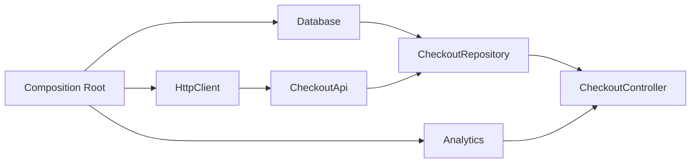
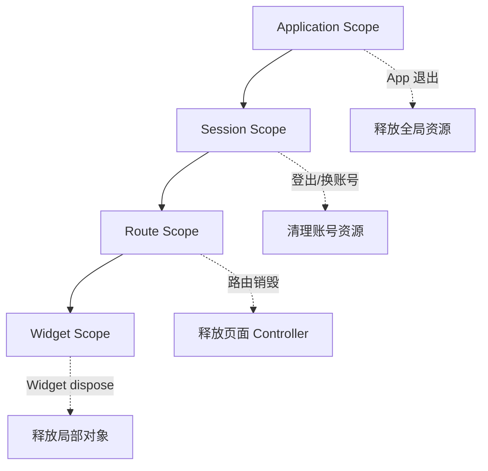
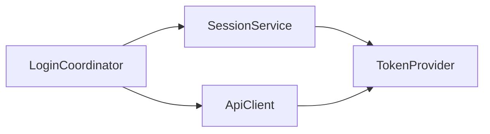
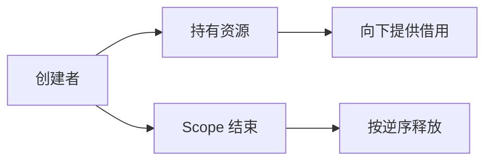
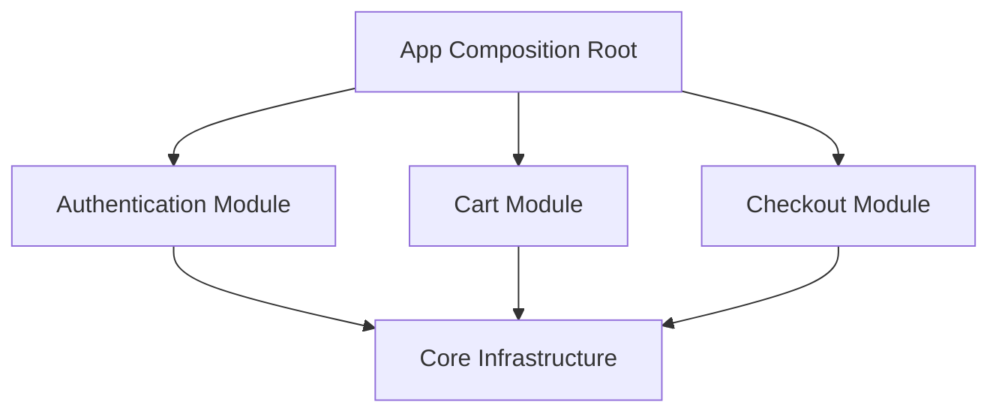

# Flutter 依赖注入：对象组装、生命周期与可测试性

> 依赖注入的核心不是“自动创建对象”，而是把依赖关系显式化，并将对象的创建、配置和销毁从业务逻辑中移到统一的组装边界。

---

## 一、从一个难以测试的对象开始

下面的 CheckoutController 在内部直接创建所有依赖：

```dart
class CheckoutController {
  CheckoutController()
      : repository = CheckoutRepository(
          api: CheckoutApi(HttpClient()),
          database: AppDatabase.open(),
        ),
        analytics = AnalyticsService();

  final CheckoutRepository repository;
  final AnalyticsService analytics;

  Future<void> submitOrder() async {
    final order = await repository.submit();
    await analytics.trackOrderSubmitted(order.id);
  }
}
```

这段代码可以运行，但存在明显问题：

- Controller 同时负责业务流程和对象组装。
- 测试无法轻易替换网络、数据库和埋点。
- HttpClient、Database 的生命周期不清晰。
- 环境配置被隐藏在对象内部。
- 依赖图只能通过逐层阅读源码发现。
- 多个 Controller 可能重复创建昂贵资源。

依赖注入将对象关系改为：



Controller 只声明需要什么，不负责决定依赖如何创建。

---

## 二、依赖注入是什么

依赖注入是控制反转的一种实现方式：对象需要的依赖由外部提供，而不是在对象内部创建或从全局位置主动查找。

```dart
class CheckoutController {
  CheckoutController({
    required this.repository,
    required this.analytics,
  });

  final CheckoutRepository repository;
  final Analytics analytics;

  Future<void> submitOrder() async {
    final order = await repository.submit();
    await analytics.trackOrderSubmitted(order.id);
  }
}
```

它带来三个直接变化：

1. 依赖出现在构造函数中，关系显式可见。
2. 调用方负责对象组装。
3. 测试可以传入 Fake 或 Mock。

### DI 不等于使用 DI 容器

手动构造对象也是依赖注入：

```dart
final controller = CheckoutController(
  repository: repository,
  analytics: analytics,
);
```

Provider、Riverpod、get_it 或代码生成工具只是帮助管理依赖图和生命周期。工具不是依赖注入本身。

---

## 三、区分 DIP、IoC、DI 与 Service Locator

| 概念 | 含义 |
|---|---|
| Dependency Inversion Principle | 高层策略不依赖低层细节，二者依赖稳定抽象 |
| Inversion of Control | 对象创建或流程控制从对象内部转移到外部机制 |
| Dependency Injection | 外部把依赖提供给对象 |
| Service Locator | 对象主动向全局注册表查询依赖 |

### 3.1 依赖倒置

Controller 不直接依赖具体 Repository 实现：

```dart
abstract interface class CheckoutRepository {
  Future<Order> submit();
}

final class RemoteCheckoutRepository implements CheckoutRepository {
  RemoteCheckoutRepository(this.api);

  final CheckoutApi api;

  @override
  Future<Order> submit() => api.submitOrder();
}
```

抽象应服务于真实变化边界。不是每个类都必须创建接口；纯内部、稳定且没有替换需求的对象可以直接依赖具体类型。

### 3.2 Service Locator

```dart
class CheckoutController {
  final repository = locator.get<CheckoutRepository>();
}
```

这种方式使用方便，但依赖没有体现在构造函数中：

- 对象可以在任意位置查询任意服务。
- 测试必须先配置全局容器。
- 依赖缺失在运行时才暴露。
- 生命周期和所有权容易模糊。

Service Locator 并非绝对禁止。它可以在应用 Composition Root、框架入口或旧项目迁移层使用，但不应扩散到领域和业务对象内部。

---

## 四、三种注入方式

### 4.1 构造函数注入

```dart
class ProfileController {
  ProfileController(this.repository, this.monitor);

  final ProfileRepository repository;
  final Monitor monitor;
}
```

优点：

- 依赖显式。
- 对象创建后立即处于有效状态。
- 字段可以是 `final`。
- 测试简单。
- 缺失依赖在编译期或构造时暴露。

构造函数注入应是默认选择。

### 4.2 Setter 或属性注入

```dart
class LegacyController {
  late Analytics analytics;
}
```

适合：

- 框架负责创建对象，无法控制构造函数。
- 可选依赖。
- 旧代码渐进迁移。

风险：对象可能在依赖设置前被使用，或被运行时替换成不一致状态。

### 4.3 方法参数注入

```dart
Future<Receipt> submitOrder({
  required CheckoutCommand command,
  required Clock clock,
}) {
  // clock 只服务于本次操作
}
```

适合只在单次操作中需要、不是对象长期协作者的依赖。不要把稳定协作者反复通过每个方法传递。

---

## 五、Composition Root

Composition Root 是应用集中组装对象图的位置。Flutter 项目中通常位于：

- `main()` 附近。
- App Bootstrap。
- 模块入口。
- 路由页面 Builder。

```dart
final class AppDependencies {
  AppDependencies._({
    required this.httpClient,
    required this.database,
    required this.analytics,
  });

  final HttpClient httpClient;
  final AppDatabase database;
  final Analytics analytics;

  static Future<AppDependencies> create() async {
    final database = await AppDatabase.open();
    final httpClient = HttpClient();
    final analytics = AnalyticsService();

    return AppDependencies._(
      httpClient: httpClient,
      database: database,
      analytics: analytics,
    );
  }

  Future<void> dispose() async {
    httpClient.close();
    await database.close();
    await analytics.flush();
  }
}
```

业务模块在此基础上继续组装：

```dart
CheckoutController createCheckoutController(AppDependencies app) {
  final api = CheckoutApi(app.httpClient);
  final repository = RemoteCheckoutRepository(api);

  return CheckoutController(
    repository: repository,
    analytics: app.analytics,
  );
}
```

### Composition Root 的边界

它可以知道具体实现，但业务对象不应反向依赖 AppDependencies。下面的写法会把 Service Locator 伪装成依赖对象：

```dart
// 不推荐：Controller 可以访问整个应用容器
CheckoutController(AppDependencies dependencies);
```

应只传入 Controller 真正需要的依赖。

---

## 六、对象生命周期与 Scope

依赖注入最容易被忽略的部分不是“如何获取对象”，而是“对象应该活多久、由谁销毁”。



### 6.1 Application Scope

生命周期通常与进程一致：

- HTTP Client。
- 数据库连接。
- 监控和日志基础设施。
- 应用配置。
- 平台服务封装。

全局对象不等于全局可变状态。对象可以长生命周期，但仍应限制其公开能力。

### 6.2 Session Scope

生命周期跟随当前用户会话：

- Session Repository。
- 用户缓存。
- 账号级数据库或命名空间。
- 用户 Feature Flag。
- WebSocket 连接。

登出或账号切换时必须整体销毁并重建，避免旧账号数据进入新会话。

### 6.3 Route Scope

生命周期跟随页面或业务流程：

- Page Controller、BLoC、Notifier。
- 表单状态。
- 页面级订阅。
- 分页状态和临时缓存。

路由弹出后应释放。将页面 Controller 注册成 Singleton 是常见泄漏和状态污染来源。

### 6.4 Factory、Singleton 与 Lazy Singleton

| 类型 | 行为 | 适用场景 |
|---|---|---|
| Factory | 每次请求创建新实例 | 短生命周期、包含独立可变状态 |
| Singleton | 立即创建并全局复用 | 必须启动即用的基础设施 |
| Lazy Singleton | 首次使用时创建 | 昂贵且不一定使用的全局能力 |
| Scoped | 在指定边界内复用 | 会话、路由或业务流程 |

选型基于所有权和状态隔离，不基于“创建对象是否麻烦”。

---

## 七、Flutter Widget Tree 中的注入

Flutter 的 Widget Tree 天然提供层级 Scope。Provider 等方案通常建立在 InheritedWidget 的依赖传播机制上。

```dart
class CheckoutRoute extends StatelessWidget {
  const CheckoutRoute({super.key});

  @override
  Widget build(BuildContext context) {
    return Provider<CheckoutController>(
      create: (context) => createCheckoutController(
        context.read<AppDependencies>(),
      ),
      dispose: (_, controller) => controller.dispose(),
      child: const CheckoutPage(),
    );
  }
}
```

这建立了一个 Route Scope：

- 进入路由时创建 Controller。
- 子树可读取 Controller。
- 路由销毁时释放 Controller。

### `read` 与监听更新

依赖注入和状态监听是两个不同问题：

- 注入解决对象从哪里来、活多久。
- 状态管理解决对象变化后谁需要更新。

一个 Repository 通常只需读取，不应该因为内部变化让整个 Widget 子树重建。不要把所有依赖都设计成可监听状态。

### BuildContext 边界

通过 Context 获取依赖意味着对象只能在对应子树中使用。优点是 Scope 明确，缺点是纯 Dart 对象不应为了查找依赖而持有 BuildContext。

正确方式是 Widget 在边界读取依赖，再通过构造函数传给业务对象。

---

## 八、异步初始化

数据库、远端配置和加密存储可能需要异步初始化。常见策略有三种。

### 8.1 启动前初始化

```dart
Future<void> main() async {
  WidgetsFlutterBinding.ensureInitialized();

  final dependencies = await AppDependencies.create();
  runApp(App(dependencies: dependencies));
}
```

优点是 App 启动后依赖完整；缺点是所有初始化都会阻塞首帧。

只应在首屏前初始化真正必要的能力。

### 8.2 初始化状态驱动 UI

```dart
sealed class BootstrapState {
  const BootstrapState();
}

final class Bootstrapping extends BootstrapState {
  const Bootstrapping();
}

final class BootstrapReady extends BootstrapState {
  const BootstrapReady(this.dependencies);
  final AppDependencies dependencies;
}

final class BootstrapFailed extends BootstrapState {
  const BootstrapFailed(this.canRetry);
  final bool canRetry;
}
```

应用先展示受控启动界面，初始化完成后进入主界面。适合需要错误重试和升级迁移的依赖。

### 8.3 延迟初始化

非首屏能力在首次使用时创建。例如地图 SDK、视频处理器和低频功能数据库。

延迟初始化需要处理：

- 多个调用方并发触发时只初始化一次。
- 初始化失败是否允许重试。
- 初始化 Future 是否会永久缓存失败。
- 何时释放。

---

## 九、循环依赖

循环依赖示例：

```text
SessionService → UserRepository → ApiClient → SessionService
```

循环依赖会导致：

- 对象无法按顺序构造。
- 通过 `late` 或全局 Locator 延迟暴露运行时错误。
- 模块职责混乱。
- 测试难以隔离。

解决方法：

1. 拆分更小契约，例如 ApiClient 只依赖 TokenProvider。
2. 将跨对象流程提升到 Coordinator。
3. 使用领域事件表达已发生事实。
4. 重新检查模块边界和职责。



不要通过让对象持有整个 DI 容器来“解决”循环依赖，这只会隐藏问题。

---

## 十、依赖注入与测试

构造函数注入让测试可以直接提供 Fake：

```dart
final class FakeCheckoutRepository implements CheckoutRepository {
  FakeCheckoutRepository(this.result);

  final CheckoutResult result;

  @override
  Future<CheckoutResult> submit() async => result;
}
```

```dart
test('tracks the submitted order when checkout completes', () async {
  final repository = FakeCheckoutRepository(
    const CheckoutSucceeded('order-1'),
  );
  final analytics = FakeAnalytics();
  final controller = CheckoutController(
    repository: repository,
    analytics: analytics,
  );

  await controller.submitOrder();

  expect(analytics.submittedOrderIds, ['order-1']);
});
```

### 测试替身选择

| 类型 | 作用 |
|---|---|
| Stub | 返回预设数据 |
| Fake | 提供简化但可运行的实现 |
| Mock | 记录并验证交互 |

优先测试对象输出和状态。只有交互本身属于契约时，才验证某方法调用次数。

### 避免全局容器污染

如果测试使用全局 Locator：

- 每个测试前后重置注册。
- 禁止并行测试共享可变容器。
- 为 Scope 提供明确创建和销毁 API。
- 失败测试也必须执行清理。

构造函数注入通常不需要这些全局清理。

---

## 十一、常见工具如何选择

工具选择应基于依赖图、Scope 和团队约束，而不是流行度。

| 方案 | 特征 | 适用场景 |
|---|---|---|
| 手动注入 | 显式、无额外框架 | 小中型项目、核心领域对象 |
| Provider | 依托 Widget Tree 管理 Scope | 页面和子树依赖 |
| Riverpod | 独立容器、可组合生命周期和 Override | 复杂依赖图、测试和状态组合 |
| get_it | 全局注册和快速查询 | Composition Root、旧项目迁移、非 Widget 入口 |
| injectable 等生成方案 | 自动生成注册代码 | 大型图谱、团队已有生成规范 |

### Provider

优点是 Scope 与 Widget 生命周期自然一致。风险是纯业务对象主动依赖 Context，或 Provider 层级过深而缺少模块边界。

### Riverpod

依赖可以在 ProviderContainer 中组合和 Override，生命周期能力丰富。需要治理 Provider 粒度，避免所有函数都包装为 Provider。

### get_it

访问方便且不依赖 Context，但容易演变为任意位置查询全局服务。推荐限制查询发生在组装层，业务对象继续使用构造函数注入。

### 代码生成

减少手写注册代码，但会增加生成、调试和构建成本。生成工具无法判断模块边界是否合理，也无法自动修复循环职责。

---

## 十二、所有权与释放

资源对象必须有唯一、明确的 Owner。



### 规则

- 创建对象的一方通常负责销毁。
- 借用依赖的一方不应擅自关闭共享资源。
- Scope 销毁时按依赖图逆序释放。
- Dispose 应尽量幂等。
- 异步 Dispose 应有超时和错误记录。

例如 Repository 借用了全局 HttpClient，不应在自身 Dispose 中关闭它；AppDependencies 才是 HttpClient 的 Owner。

### 常见泄漏

- 页面 Controller 注册成 Singleton。
- Provider 使用 `.value` 错误接管对象所有权。
- Stream、Timer 和 Observer 没有在 Scope 结束时释放。
- Session Scope 登出后仍被全局对象引用。
- Lazy Singleton 持有大缓存且永不清理。

---

## 十三、模块化项目中的依赖注入

每个模块可以公开最小模块入口：

```dart
final class CheckoutModule {
  CheckoutModule({
    required CheckoutRepository repository,
    required Analytics analytics,
  })  : _repository = repository,
        _analytics = analytics;

  final CheckoutRepository _repository;
  final Analytics _analytics;

  CheckoutController createController() {
    return CheckoutController(
      repository: _repository,
      analytics: _analytics,
    );
  }
}
```

App 只组装模块公开契约，不访问 `lib/src` 内部实现。

模块依赖应形成有向无环图：



如果模块之间需要复杂流程，由 App/Application Coordinator 注入各模块契约完成编排，而不是两个模块互相查询对方容器。

---

## 十四、渐进迁移

旧项目常有大量 `Singleton.instance` 和全局 Locator。无需一次性重写。

迁移步骤：

1. 选择一个新功能或高频测试对象。
2. 把其隐藏依赖提取到构造函数。
3. 在现有入口从 Locator 读取依赖并注入。
4. 为该对象补充 Fake 和 Unit Test。
5. 逐步把查询 Locator 的位置向 App 组装层移动。
6. 明确对象 Scope 和释放责任。
7. 使用静态检查禁止新业务代码直接访问全局容器。

迁移中可以暂时保留 Adapter：

```dart
CheckoutController createLegacyCheckoutController() {
  return CheckoutController(
    repository: locator.get<CheckoutRepository>(),
    analytics: locator.get<Analytics>(),
  );
}
```

Locator 被限制在一个工厂函数中，CheckoutController 本身保持纯净，后续更容易替换组装方式。

---

## 十五、常见误区

### 误区一：依赖注入就是全局容器

构造函数手动传参就是最直接的依赖注入。全局容器只是可选工具。

### 误区二：所有依赖都应该是 Singleton

Singleton 会共享状态并延长生命周期。页面状态、表单和业务流程对象通常应使用 Route Scope 或 Factory。

### 误区三：为了测试，每个类都应该有接口

测试可以直接注入具体纯 Dart 对象。接口应服务于变化边界和替换需求，而不是机械增加抽象。

### 误区四：Provider 同时等于依赖注入和状态管理

Provider 可以承担两种角色，但对象注入和状态监听仍是不同问题。不是每个依赖变化都需要重建 Widget。

### 误区五：DI 容器可以自动解决循环依赖

容器最多延迟错误或使用代理绕过构造顺序，无法修复职责和边界上的循环。

### 误区六：对象能被取到就说明生命周期正确

依赖可用不代表所有权正确。谁创建、何时共享、谁销毁，是依赖注入设计的核心部分。

---

## 十六、落地清单

### 依赖关系

- [ ] 业务对象优先使用构造函数注入。
- [ ] 依赖在类型签名中可见。
- [ ] 抽象只放在变化边界和跨模块契约处。
- [ ] 业务对象不持有整个容器或 AppDependencies。
- [ ] 依赖图不存在循环。

### 生命周期

- [ ] 区分 Application、Session、Route 和 Widget Scope。
- [ ] 页面状态不注册为全局 Singleton。
- [ ] 创建者和销毁者明确。
- [ ] Session 在登出或换账号时整体重建。
- [ ] 异步初始化和释放具有失败处理。

### 工程

- [ ] Composition Root 集中在应用或模块入口。
- [ ] Unit Test 可直接注入 Fake。
- [ ] 全局 Locator 查询限制在组装边界。
- [ ] DI 工具不泄漏到领域对象。
- [ ] 旧项目采用渐进迁移而非一次性重写。

---

## 十七、总结

Flutter 依赖注入可以归纳为六个关键点：

1. **显式依赖**：对象通过构造函数声明所需协作者。
2. **集中组装**：Composition Root 决定具体实现和配置。
3. **作用域**：依赖按 Application、Session、Route 等生命周期管理。
4. **所有权**：创建者负责在 Scope 结束时释放资源。
5. **可测试性**：测试直接注入 Fake，不依赖全局环境。
6. **工具克制**：容器和代码生成帮助管理对象图，但不能代替边界设计。

依赖注入的最终目标不是消除 `new`，而是：

> 让对象只负责业务职责，让依赖的选择、创建和销毁回到明确、可测试、可治理的组装边界。

---

## 十八、问答复盘

### Q1：依赖注入与依赖倒置有什么区别？

**答：** 依赖倒置是高层策略依赖抽象的设计原则；依赖注入是由外部提供依赖的组装方式。二者经常一起使用，但不是同一概念。

### Q2：为什么构造函数注入通常优于 Service Locator？

**答：** 构造函数会显式列出依赖，使对象创建后立即有效，也更容易测试。Service Locator 隐藏依赖，并把缺失注册推迟到运行时。

### Q3：什么时候适合使用 Singleton？

**答：** 适合进程级共享、无页面状态且创建成本较高的基础设施，例如 HttpClient 或数据库连接。页面 Controller 通常不适合。

### Q4：为什么 Session Scope 不能简单做成全局 Singleton？

**答：** 会话需要在登出和账号切换时整体销毁。永久 Singleton 容易保留旧用户缓存、连接和状态，造成数据串号。

### Q5：Provider 中读取依赖与监听状态有什么区别？

**答：** 读取只获得对象，监听会注册依赖并在值变化时重建 Widget。Repository 等稳定协作者通常只需读取。

### Q6：异步依赖是否都应该在 `main()` 中初始化？

**答：** 不应该。首屏必需依赖可以提前初始化，其他能力应通过启动状态或延迟初始化，避免无关工作阻塞首帧。

### Q7：如何解决 DI 中的循环依赖？

**答：** 拆分更小契约、把流程提升到 Coordinator，或重新划分职责。不要通过 `late` 或把整个容器注入对象来隐藏循环。

### Q8：如何判断 DI 设计是否合理？

**答：** 观察依赖是否显式、Scope 是否匹配、所有权是否清晰、测试能否直接替换依赖，以及业务对象是否脱离容器独立运行。
