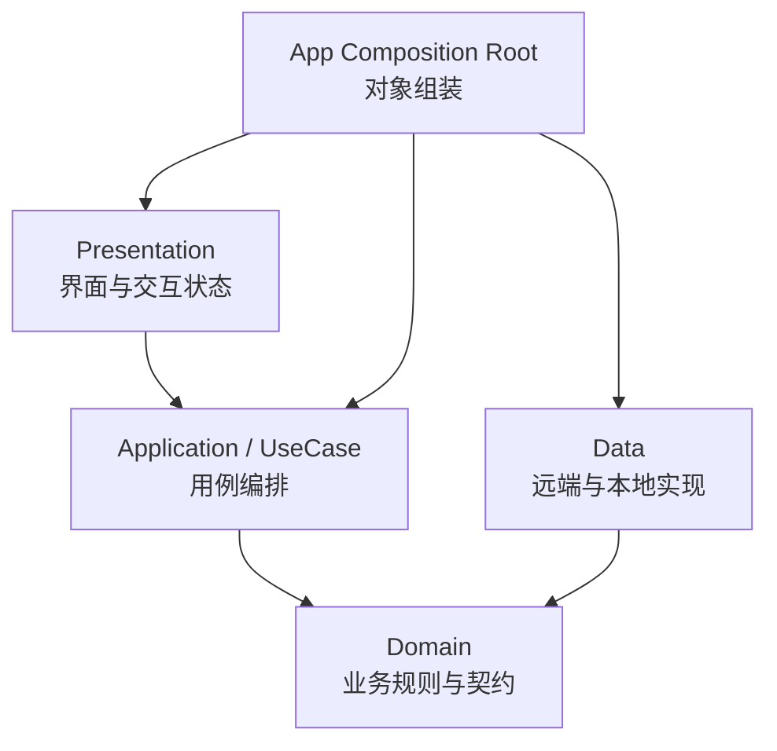
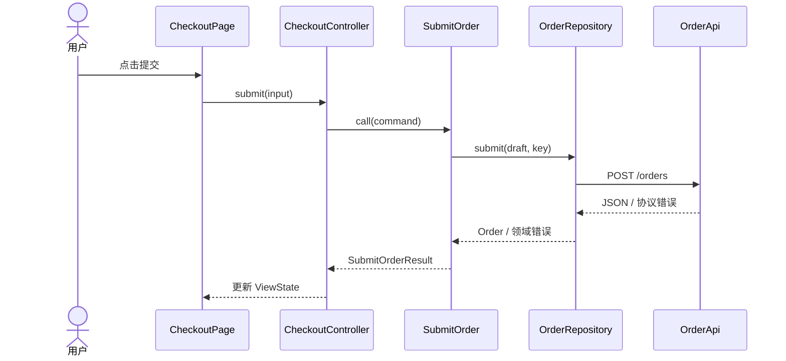
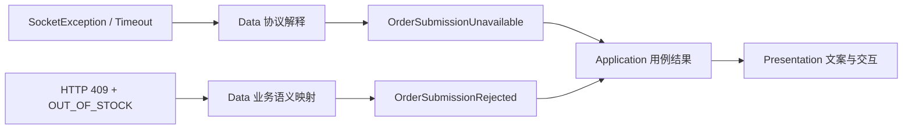

# Flutter 分层架构：从页面堆叠到可演进的业务边界

> 分层架构的价值不在于把代码放进四个目录，而在于隔离变化：界面变化不应改写业务规则，接口字段变化不应渗透到页面，基础设施可以替换，核心业务仍可独立验证。

---

## 一、为什么 Flutter 项目需要分层

一个功能刚开始时，把请求、JSON 解析、状态更新和页面跳转都写在 Widget 中，往往最快：

```dart
Future<void> submitOrder() async {
  setState(() => isLoading = true);
  try {
    final response = await httpClient.post(
      '/orders',
      body: {'skuId': skuId, 'quantity': quantity},
    );
    final orderId = response.data['order_id'] as String;
    if (!mounted) return;
    Navigator.of(context).pushNamed('/orders/$orderId');
  } catch (error) {
    if (!mounted) return;
    showDialog<void>(
      context: context,
      builder: (_) => const Text('提交失败'),
    );
  } finally {
    if (mounted) setState(() => isLoading = false);
  }
}
```

它的问题不是代码位于 Widget，而是一个方法同时知道：

- HTTP 路径和服务端字段；
- 订单创建的业务输入；
- 加载状态和错误文案；
- 页面生命周期与导航；
- 底层异常如何解释。

当业务加入库存校验、优惠策略、离线草稿、重复提交防护和多端接口差异后，这些变化会在同一处相互干扰。测试一个订单规则，也被迫构造 Widget、路由和网络环境。

分层就是把不同原因引起的变化放到不同边界内。

### 核心结论

1. 层首先是职责和依赖规则，其次才是目录。
2. 依赖应从易变的外层指向稳定的内层；核心业务不应导入 Flutter、HTTP 或数据库实现。
3. Application 负责编排一次用例，Domain 负责表达业务规则，二者不能仅凭目录名区分。
4. Repository 是面向业务的数据访问契约，不是所有 API 的机械包装。
5. DTO、Entity、ViewData 分别服务外部协议、业务语义和界面展示，不应强求一个模型贯穿全链路。
6. 分层有成本，应依据业务复杂度、变化频率和测试需求裁剪。

---

## 二、四层分别解决什么问题

常见的 Flutter 业务模块可以划分为四层：



图中 `Presentation -> Application -> Domain` 是业务调用的主要方向。`Data -> Domain` 表示 Data 实现 Domain 所声明的 Repository 契约。最外层的 Composition Root 了解具体类型并完成组装，但业务对象不反向依赖组装代码。

### 2.1 Presentation：把用户意图转换为用例输入

Presentation 包含：

- Widget、页面和路由参数；
- Controller、Notifier、Bloc 等界面状态持有者；
- 加载、空数据、错误、成功等展示状态；
- 表单输入的即时校验与格式化；
- 导航、弹窗、Toast 等一次性界面效果。

它应知道“用户点击了提交”和“当前显示什么”，但不应知道订单接口路径、数据库表名或重试协议。

```dart
sealed class CheckoutViewState {
  const CheckoutViewState();
}

final class CheckoutEditing extends CheckoutViewState {
  const CheckoutEditing();
}

final class CheckoutSubmitting extends CheckoutViewState {
  const CheckoutSubmitting();
}

final class CheckoutFailed extends CheckoutViewState {
  const CheckoutFailed(this.message, {required this.canRetry});

  final String message;
  final bool canRetry;
}

final class CheckoutSucceeded extends CheckoutViewState {
  const CheckoutSucceeded(this.orderId);

  final String orderId;
}
```

`CheckoutViewState` 是为渲染服务的 ViewData。它可以包含本地化后的文案、颜色语义或是否显示重试按钮，但不应被 Repository 返回。

### 2.2 Application / UseCase：编排一次业务目标

Application 层回答“为了完成这次用户目标，需要按什么顺序调用哪些能力”。典型职责包括：

- 定义用例输入和输出；
- 调用一个或多个 Repository 或领域服务；
- 控制流程顺序、幂等键、事务边界或取消检查；
- 执行授权检查和跨对象协作；
- 将底层可预期失败转换成用例层结果。

```dart
final class SubmitOrder {
  SubmitOrder({
    required OrderRepository orderRepository,
    required InventoryRepository inventoryRepository,
    required IdGenerator idGenerator,
  })  : _orderRepository = orderRepository,
        _inventoryRepository = inventoryRepository,
        _idGenerator = idGenerator;

  final OrderRepository _orderRepository;
  final InventoryRepository _inventoryRepository;
  final IdGenerator _idGenerator;

  Future<SubmitOrderResult> call(SubmitOrderCommand command) async {
    final draft = OrderDraft.create(
      skuId: command.skuId,
      quantity: command.quantity,
    );

    final available = await _inventoryRepository.isAvailable(
      draft.skuId,
      draft.quantity,
    );
    if (!available) return const SubmitOrderOutOfStock();

    try {
      final order = await _orderRepository.submit(
        draft,
        idempotencyKey: _idGenerator.next(),
      );
      return SubmitOrderSuccess(order.id);
    } on OrderSubmissionRejected catch (error) {
      return SubmitOrderRejected(error.reason);
    }
  }
}
```

这里的用例负责“创建草稿 -> 检查库存 -> 携带幂等键提交”的流程。数量是否合法由 `OrderDraft` 自己保证，HTTP 请求则由 Data 层处理。

> 用例不是为了给每个 Repository 方法再包一层同名方法。没有编排、权限、事务或语义转换价值时，这层可以保持很薄，甚至暂时省略独立的 UseCase 类。

### 2.3 Domain：表达不依赖界面的业务规则

Domain 包含相对稳定的业务概念：

- Entity（实体）和值对象；
- 聚合边界和不变量；
- 领域服务；
- 领域错误；
- 核心业务所需要的 Repository 等能力契约。

```dart
final class OrderDraft {
  OrderDraft._({required this.skuId, required this.quantity});

  factory OrderDraft.create({
    required String skuId,
    required int quantity,
  }) {
    if (skuId.trim().isEmpty) {
      throw const InvalidOrderDraft('商品标识不能为空');
    }
    if (quantity < 1 || quantity > 99) {
      throw const InvalidOrderDraft('购买数量必须在 1 到 99 之间');
    }
    return OrderDraft._(skuId: skuId, quantity: quantity);
  }

  final String skuId;
  final int quantity;
}

abstract interface class OrderRepository {
  Future<Order> submit(
    OrderDraft draft, {
    required String idempotencyKey,
  });
}
```

Domain 不应依赖：

- `BuildContext`、Widget 或状态管理框架；
- Dio、HTTP Response 或数据库 Row；
- JSON 注解和服务端字段；
- 面向具体页面的文案。

并非所有应用都需要丰富的领域模型。内容展示类应用可能以读取和映射数据为主，Domain 很薄是合理结果，不应人为制造实体和领域服务。

### 2.4 Data：实现外部数据访问细节

Data 层负责：

- REST、GraphQL、WebSocket 等远端数据源；
- SQLite、文件、Key-Value 等本地数据源；
- DTO 的序列化与反序列化；
- 缓存、数据合并和同步策略；
- Repository 的具体实现；
- 协议错误到业务可理解错误的转换。

```dart
final class RemoteOrderRepository implements OrderRepository {
  RemoteOrderRepository(this._api);

  final OrderApi _api;

  @override
  Future<Order> submit(
    OrderDraft draft, {
    required String idempotencyKey,
  }) async {
    try {
      final response = await _api.createOrder(
        CreateOrderRequestDto(
          skuId: draft.skuId,
          quantity: draft.quantity,
          idempotencyKey: idempotencyKey,
        ),
      );
      return response.toEntity();
    } on ApiException catch (error, stackTrace) {
      Error.throwWithStackTrace(_mapApiError(error), stackTrace);
    }
  }
}
```

Data 可以依赖具体网络库，但这种依赖应停在 Data 边界。切换 HTTP 客户端可能改动 API 和 Repository 实现，不应迫使 UseCase 与页面一起修改。

---

## 三、调用方向与依赖方向不是一回事

订单提交时，运行时调用大致如下：



运行时调用从内层接口进入外层实现是正常的。源码依赖却仍然可以指向内层：

- Domain 声明 `OrderRepository`；
- Data 导入 Domain 并实现它；
- Application 只依赖 `OrderRepository` 抽象；
- Composition Root 把 `RemoteOrderRepository` 注入 `SubmitOrder`。

这就是 Dependency Inversion Principle（依赖倒置原则）的实际作用：高层业务策略和低层实现都依赖业务抽象，低层细节不能决定核心代码的形状。

### Repository 接口到底放在哪里

不要机械遵守“接口必须与实现同目录”或“所有接口必须放 Domain”。更可靠的判断是：谁定义并拥有这份契约？

- 契约以领域实体和业务语义表达，且是核心规则所需，通常由 Domain 拥有。
- 契约只服务某个应用编排，例如上传进度或页面级查询投影，可以由 Application 拥有。
- 纯基础设施接口且没有业务含义，可以位于基础设施模块的稳定公共层。

接口应面向调用者需求设计，而不是照抄远端 API。

```dart
// 不佳：HTTP 细节泄漏到业务契约
abstract interface class OrderRepository {
  Future<HttpResponse<Map<String, dynamic>>> postOrder(
    Map<String, dynamic> body,
  );
}

// 更合理：使用业务输入、输出和语言
abstract interface class OrderRepository {
  Future<Order> submit(
    OrderDraft draft, {
    required String idempotencyKey,
  });
}
```

---

## 四、DTO、Entity 与 ViewData 为什么要分开

三类模型面向不同变化源：

| 模型 | 服务对象 | 典型内容 | 主要变化原因 |
|---|---|---|---|
| DTO | 外部协议 | JSON 字段、可空兼容、版本字段 | 后端或存储协议变化 |
| Entity / Value Object | 业务规则 | 标识、状态、不变量、领域行为 | 业务规则变化 |
| ViewData / ViewState | 界面渲染 | 格式化文本、按钮状态、展示分组 | 交互或视觉变化 |

### 4.1 DTO 容忍协议现实

```dart
final class OrderResponseDto {
  const OrderResponseDto({
    required this.id,
    required this.status,
    required this.totalInCents,
  });

  factory OrderResponseDto.fromJson(Map<String, Object?> json) {
    return OrderResponseDto(
      id: json['order_id'] as String,
      status: json['status'] as String,
      totalInCents: json['total_in_cents'] as int,
    );
  }

  final String id;
  final String status;
  final int totalInCents;
}
```

DTO 可以忠实反映 snake_case 字段、历史兼容值和可空数据，但这些妥协不应污染领域对象。

### 4.2 Mapper 建立防腐边界

```dart
extension OrderResponseMapper on OrderResponseDto {
  Order toEntity() {
    return Order(
      id: OrderId(id),
      status: switch (status) {
        'pending' => OrderStatus.pending,
        'paid' => OrderStatus.paid,
        'cancelled' => OrderStatus.cancelled,
        _ => throw UnsupportedOrderStatus(status),
      },
      total: Money.cents(totalInCents),
    );
  }
}
```

Mapper 不只是字段复制。它负责：

- 命名和类型转换；
- 单位转换，例如分到 `Money`；
- 协议枚举到领域枚举的穷举映射；
- 缺失字段的兼容策略；
- 在边界处拒绝无法解释的数据。

如果映射只是两三个完全相同字段，额外模型的收益可能低于维护成本。模型是否拆分，应看协议与业务是否有独立演进的可能，而不是追求层数完整。

### 4.3 ViewData 只承载展示决策

```dart
final class OrderSummaryViewData {
  const OrderSummaryViewData({
    required this.orderNumber,
    required this.statusText,
    required this.formattedTotal,
  });

  final String orderNumber;
  final String statusText;
  final String formattedTotal;
}
```

金额格式化通常依赖 Locale，状态文案依赖本地化资源，因此应在 Presentation 边界完成，而不是让 Domain 返回“¥ 99.00”或“已支付”。

---

## 五、状态更新与生命周期

分层不会自动解决异步竞态。Presentation 仍需处理重复点击、页面销毁和较早请求覆盖较新结果。

```dart
final class CheckoutController extends ChangeNotifier {
  CheckoutController(this._submitOrder);

  final SubmitOrder _submitOrder;
  CheckoutViewState _state = const CheckoutEditing();
  int _requestVersion = 0;
  bool _disposed = false;

  CheckoutViewState get state => _state;

  Future<void> submit({required String skuId, required int quantity}) async {
    if (_state is CheckoutSubmitting) return;

    final requestVersion = ++_requestVersion;
    _emit(const CheckoutSubmitting());

    try {
      final result = await _submitOrder(
        SubmitOrderCommand(skuId: skuId, quantity: quantity),
      );
      if (_disposed || requestVersion != _requestVersion) return;
      _emit(_toViewState(result));
    } on InvalidOrderDraft catch (error) {
      if (_disposed || requestVersion != _requestVersion) return;
      _emit(CheckoutFailed(error.message, canRetry: false));
    } catch (error, stackTrace) {
      if (_disposed || requestVersion != _requestVersion) return;
      reportUnexpectedError(error, stackTrace);
      _emit(const CheckoutFailed('暂时无法提交，请稍后重试', canRetry: true));
    }
  }

  void _emit(CheckoutViewState next) {
    if (_disposed) return;
    _state = next;
    notifyListeners();
  }

  @override
  void dispose() {
    _disposed = true;
    _requestVersion++;
    super.dispose();
  }
}
```

这个示例使用版本号忽略过期结果，但不会取消底层请求。若操作成本较高，Repository 和网络客户端还应接受可传播的取消信号。不同状态管理框架的 API 不同，原则相同：

- 资源由创建或明确接管它的对象释放；
- 页面销毁后不再发布状态；
- “忽略结果”和“取消工作”是两个概念；
- 提交类操作还需服务端幂等，禁用按钮不能替代幂等保证。

Widget 消费状态时仍要检查自身生命周期。例如 `await` 之后使用 `BuildContext`，应检查 `context.mounted`；订阅、Controller 和 Stream 应在对应生命周期中释放。

---

## 六、错误边界如何设计

错误不应以一个 `Exception` 原样穿透所有层，也不应在每层 catch 后丢失信息。



### 各层的错误职责

- Data：识别超时、断网、HTTP 状态、服务端错误码和坏数据。
- Domain：表达违反业务规则或业务动作被拒绝的原因。
- Application：决定错误是否重试、降级、补偿，或转换成封闭的用例结果。
- Presentation：决定展示文案、重试按钮、字段提示或页面跳转。

```dart
Exception _mapApiError(ApiException error) {
  if (error.code == 'OUT_OF_STOCK') {
    return const OrderSubmissionRejected(OrderRejectionReason.outOfStock);
  }
  if (error.isTimeout || error.isNetworkUnavailable) {
    return const OrderSubmissionUnavailable();
  }
  return UnexpectedOrderDataSourceFailure(cause: error);
}
```

错误转换应保留原始异常和 StackTrace 供日志、Trace 与崩溃分析使用；面向用户的对象则不应泄漏 URL、Token、服务端响应或内部堆栈。

### 不要滥用 catch

只有当前边界能够增加语义、执行恢复或补充可观测信息时才捕获错误。下面的代码会破坏诊断：

```dart
// 错误：吞掉原始类型、上下文与堆栈
try {
  return await api.createOrder(request);
} catch (_) {
  throw Exception('请求失败');
}
```

对于不可预期的编程错误，通常应记录完整上下文并让统一错误边界处理，而不是伪装成可重试的网络错误。

---

## 七、缓存与一致性属于哪一层

“使用 SQLite”是 Data 细节，“商品列表允许展示 10 分钟旧数据”则是产品或业务策略。缓存实现常在 Data，缓存策略的关键约束不能被埋在实现中无人知晓。

```dart
final class CachedProductRepository implements ProductRepository {
  CachedProductRepository(this._remote, this._local, this._clock);

  final ProductRemoteDataSource _remote;
  final ProductLocalDataSource _local;
  final Clock _clock;

  @override
  Future<ProductCatalog> loadCatalog() async {
    final cached = await _local.readCatalog();
    if (cached != null &&
        _clock.now().difference(cached.savedAt) < const Duration(minutes: 10)) {
      return cached.dto.toEntity();
    }

    try {
      final remote = await _remote.fetchCatalog();
      await _local.saveCatalog(remote, savedAt: _clock.now());
      return remote.toEntity();
    } on NetworkUnavailable {
      if (cached != null) return cached.dto.toEntity();
      rethrow;
    }
  }
}
```

真实项目还要明确：

- 缓存新鲜度由谁定义；
- 写入是 write-through、write-back 还是 cache-aside；
- 并发请求是否合并；
- 本地写入失败是否影响主流程；
- 用户切换后如何隔离缓存；
- 敏感数据是否允许落盘以及如何加密；
- 离线修改如何解决冲突。

Repository 可以封装数据来源选择，但不能用“封装”掩盖没有定义的一致性策略。

---

## 八、目录组织与对象组装

建议先按业务功能聚合，再在功能内部按职责分层：

```text
lib/
├── app/
│   ├── app.dart
│   └── dependencies.dart
├── features/
│   └── checkout/
│       ├── presentation/
│       │   ├── checkout_page.dart
│       │   └── checkout_controller.dart
│       ├── application/
│       │   └── submit_order.dart
│       ├── domain/
│       │   ├── order.dart
│       │   ├── order_repository.dart
│       │   └── order_failure.dart
│       └── data/
│           ├── order_api.dart
│           ├── order_dto.dart
│           └── remote_order_repository.dart
└── shared/
    ├── networking/
    └── observability/
```

这种 Feature First + Layer Inside 的结构让修改一个业务时大部分工作停留在同一功能目录，也避免所有 Repository、Model 和 Page 堆在全局技术目录。

具体实现应在应用的 Composition Root 组装：

```dart
CheckoutController buildCheckoutController(AppDependencies dependencies) {
  final repository = RemoteOrderRepository(dependencies.orderApi);
  final submitOrder = SubmitOrder(
    orderRepository: repository,
    inventoryRepository: dependencies.inventoryRepository,
    idGenerator: dependencies.idGenerator,
  );
  return CheckoutController(submitOrder);
}
```

Provider、Riverpod、get_it 或其他容器都可以承担组装工作。关键不是工具，而是：

- 业务类通过构造函数显式声明依赖；
- 具体实现只在组装边界出现；
- 对象 Scope 与页面、会话或应用生命周期匹配；
- 创建资源的一方明确负责关闭资源。

---

## 九、常见误区与修复方式

### 9.1 把目录当作边界

如果 `presentation/` 可以随意导入 `data/`，四个目录并没有建立架构约束。

修复方式是明确允许的依赖方向，并使用 Package 边界、Lint、依赖检查脚本和 Code Review 持续验证。

### 9.2 一个模型贯穿所有层

直接把带 JSON 注解的 DTO 传给 Widget，会让后端字段、可空策略和页面展示绑定在一起。

协议稳定、模型简单时可以有意识地复用；一旦两侧变化原因不同，就应在边界处映射。

### 9.3 Repository 退化为 API 方法集合

`get`、`post`、`put` 风格接口没有表达业务，也把协议细节泄漏给调用者。Repository 应围绕聚合或业务能力提供操作，并封装数据来源策略。

### 9.4 每个类都创建接口

依赖倒置不是“类数量乘二”。只有存在稳定边界、多个实现、测试替身或变化隔离价值时才需要抽象。内部 Mapper 通常可以直接依赖具体类型。

### 9.5 UseCase 只做一行转发

为每个 Repository 方法创建同名 UseCase 会增加导航成本。若用例没有编排和业务语义，可先由 Controller 依赖清晰的 Repository 契约，复杂度增长后再提取。

### 9.6 Domain 依赖 Flutter

在 Entity 中保存 `Color`、`BuildContext`、本地化字符串，会导致核心规则难以脱离 UI 测试。Domain 应表达颜色状态或业务枚举，由 Presentation 决定具体视觉。

### 9.7 把所有失败都包装为 Result

预期内的业务分支适合封闭结果类型；编程错误、违反内部不变量等不可恢复错误不应一律伪装成普通失败，否则监控难以发现缺陷。

### 9.8 分层等于多 Package

分层解决模块内部职责，Package 解决更强的可见性、构建和团队边界。小项目可以在一个 Package 中保持分层；大型项目也可能在每个业务 Package 内部分层。两者不能互相替代。

---

## 十、如何测试每一层

测试应围绕边界行为，而不是追求每层都有相同数量的测试。

### 10.1 Domain 单元测试

领域规则应快速、确定且不依赖 Flutter Binding：

```dart
test('订单数量超过上限时拒绝创建草稿', () {
  expect(
    () => OrderDraft.create(skuId: 'sku-1', quantity: 100),
    throwsA(isA<InvalidOrderDraft>()),
  );
});
```

重点覆盖不变量、边界值、状态转换和金额计算。

### 10.2 Application 单元测试

使用 Fake Repository 验证编排、短路分支和错误映射：

```dart
test('库存不足时不提交订单', () async {
  final orders = FakeOrderRepository();
  final useCase = SubmitOrder(
    orderRepository: orders,
    inventoryRepository: FakeInventoryRepository(available: false),
    idGenerator: FixedIdGenerator('request-1'),
  );

  final result = await useCase(
    const SubmitOrderCommand(skuId: 'sku-1', quantity: 2),
  );

  expect(result, isA<SubmitOrderOutOfStock>());
  expect(orders.submitCount, 0);
});
```

这里更适合手写 Fake，因为测试关心状态和调用结果，而不是对每次内部调用做脆弱的交互断言。

### 10.3 Data 契约测试

Data 测试验证：

- JSON 缺失、未知枚举和类型异常；
- 请求字段、认证头和幂等键；
- HTTP 错误码到领域错误的映射；
- 缓存命中、过期和回退行为；
- 数据库迁移与序列化兼容。

可使用 Mock Server、内存数据库或录制的脱敏响应，但测试数据必须覆盖真实协议边界。

### 10.4 Presentation 测试

Controller 测试关注状态序列和异步竞态；Widget 测试关注用户操作、渲染与导航：

```text
editing -> submitting -> succeeded
editing -> submitting -> failed(canRetry: true)
```

最后用少量集成测试贯穿真实组装，防止“每层单测都通过，但依赖注册或序列化连接错误”。

---

## 十一、如何验证架构是否真的有效

架构不能只靠目录截图验收。可以观察以下信号：

1. 修改服务端字段时，改动是否主要停留在 DTO、Mapper 和 Data 测试。
2. 修改页面布局时，是否无需改动 Domain 和 Repository。
3. 核心业务规则能否在纯 Dart 测试中运行。
4. 网络实现能否通过组装替换，而不修改 UseCase。
5. 新成员能否从依赖方向判断代码应该放在哪里。
6. 跨层导入违规能否在 CI 中被发现。

可在 CI 中加入：

- `dart analyze` 与测试；
- 禁止 Presentation 导入 Data 内部实现的规则；
- 禁止 Domain 导入 Flutter、网络和数据库包的规则；
- Package 依赖环检查；
- 公共 API 与 `lib/src/` 越界导入检查。

不要用“文件数量更多”证明架构成熟。更有意义的结果是改动影响范围可预测、测试隔离更容易、错误语义更清楚。

---

## 十二、架构裁剪：不是所有功能都需要四层

分层会增加模型、Mapper、接口、组装和跨文件导航成本。应按照复杂度逐步引入。

### 12.1 简单展示页面

适合：Presentation + Data Service。

页面只读取一个稳定接口，没有业务规则、缓存和多数据源时，可由 Controller 直接依赖一个面向功能的 Service。仍应避免 Widget 直接解析 JSON。

### 12.2 中等复杂业务

适合：Presentation + Repository + Data。

当存在缓存、多数据源、错误映射或测试替换需求时，引入 Repository。若业务规则简单，Entity 可以只是稳定的业务数据结构。

### 12.3 复杂核心业务

适合：Presentation + Application + Domain + Data。

当存在多个对象协作、业务不变量、事务、权限、离线同步或复杂状态转换时，完整分层通常能够回收成本。

### 裁剪判断表

| 问题 | 若答案为“是”，倾向引入 |
|---|---|
| 数据来自远端、本地等多个来源吗 | Repository |
| 外部协议与业务模型独立变化吗 | DTO + Mapper + Entity |
| 一个用户目标需要编排多个能力吗 | Application / UseCase |
| 业务规则需要脱离 UI 独立验证吗 | Domain |
| 页面需要专门的格式化和交互状态吗 | ViewData / ViewState |
| 存在明确替换点或测试边界吗 | 抽象接口 |

> 架构裁剪不是放弃边界，而是保留当前真正有价值的边界。随着变化出现，可以渐进提取，不必一次性搭建所有层。

---

## 十三、落地步骤

对已有 Flutter 项目，不建议一次性重写。可以按一条高变化业务链路渐进迁移：

1. 选取一个痛点明确的功能，例如订单提交，而非从公共工具目录开始。
2. 写出该用例的输入、输出、业务失败和外部依赖。
3. 从 Widget 中提取页面状态与 Controller，先隔离 UI 生命周期。
4. 把 JSON、HTTP 和数据库细节收敛到 Data 边界。
5. 由调用者语言定义 Repository 契约，不照搬 API。
6. 将可独立成立的不变量放入 Entity 或值对象。
7. 当流程包含多步编排时提取 UseCase。
8. 在 Composition Root 组装具体实现和生命周期。
9. 分别补齐业务规则、协议映射、状态流和集成测试。
10. 用静态检查守住依赖方向，再迁移下一条链路。

每一步都应保持可运行、可测试，避免长期存在一套“新架构”和一套无法发布的半成品。

---

## 十四、总结

Flutter 分层架构真正需要记住的是：

- Presentation 管理交互和展示状态，不承担协议与业务规则。
- Application 编排一次业务目标，但不必为简单转发强建一层。
- Domain 表达稳定业务语义和不变量，不依赖 Flutter 与基础设施。
- Data 处理协议、存储、缓存和 Repository 实现，并在边界处完成映射。
- 运行时调用可以跨越抽象进入具体实现，源码依赖仍应指向稳定契约。
- DTO、Entity、ViewData 是否拆分取决于变化原因是否不同。
- 错误只在能够增加语义或恢复的边界转换，同时保留诊断上下文。
- 架构必须可裁剪、可测试、可检查；目录齐全不是目标，隔离变化才是。

---

## 问答复盘

### Q1：分层架构和把代码放进 `presentation/domain/data` 目录有什么区别？

**答：** 目录只是组织形式，分层的关键是职责与依赖约束。如果 Presentation 仍直接导入 Data 实现，目录再完整也没有隔离变化。

### Q2：Application 与 Domain 最容易混淆，如何判断？

**答：** Application 编排“这次用例如何完成”，Domain 保证“业务对象始终满足什么规则”。提交订单的步骤属于 Application，订单数量范围等不变量属于 Domain。

### Q3：Repository 接口必须放在 Domain 吗？

**答：** 不必须。接口应由契约的调用者和语义所有者持有。领域能力通常放 Domain，只服务应用编排的查询或进度接口也可以放 Application。

### Q4：DTO、Entity 和 ViewData 能否复用同一个类？

**答：** 可以，但应是有意识的裁剪。若协议字段、业务规则和展示格式有不同变化原因，复用会制造耦合，此时应拆分并通过 Mapper 转换。

### Q5：为什么 Data 实现 Domain 的接口不算反向依赖？

**答：** 运行时是 UseCase 调用 Data 实例，源码层面却是 Data 导入并实现 Domain 契约，Domain 不认识 Data。高层策略没有依赖低层具体实现，这正是依赖倒置。

### Q6：每个 Repository 方法都需要一个 UseCase 吗？

**答：** 不需要。只有当独立用例能承载编排、权限、事务、重试、审计或稳定业务语义时才有明显价值。一行转发通常只是增加样板代码。

### Q7：网络错误应该在哪一层转换成用户文案？

**答：** Data 先把网络与协议错误转成业务可理解的失败，Application 决定流程结果，Presentation 再根据 Locale 和交互上下文生成用户文案。Data 不应直接返回 Toast 文本。

### Q8：用户连续点击两次提交，仅在按钮加载时禁用就足够吗？

**答：** 不足够。客户端要防重复触发并处理过期异步结果，底层应尽可能支持取消；涉及订单、支付等写操作时，还需要服务端幂等键保证最终效果不会重复。

### Q9：如何判断分层带来了收益，而不是只增加文件？

**答：** 看变化是否被限制在可预测范围、业务能否脱离 UI 测试、外部实现能否替换、错误语义是否清楚，以及依赖违规能否自动发现。文件数量不是有效指标。

---

## 延伸知识

- 模块化：业务边界、公共 API 与跨模块依赖治理。
- 依赖注入：Composition Root、对象 Scope 和资源所有权。
- 单向数据流：用户意图、状态转换和界面渲染的可预测性。
- 领域驱动设计：实体、值对象、聚合与限界上下文。
- 离线优先：本地事实源、同步队列、冲突解决和一致性模型。
- 可观测性：跨层 Trace、结构化错误和敏感信息脱敏。
