# Flutter 原生视图与混合工程：Platform View、Texture 与 Add-to-App

> 把原生 View 嵌入 Flutter，与把 Flutter 嵌入原生 App，是方向相反的两类集成。前者重点解决渲染合成、手势和焦点，后者重点解决 Engine、路由、生命周期与发布边界。

---

## 一、本文解决什么问题

真实项目中常见两个需求：

1. Flutter 页面需要嵌入地图、WebView、播放器或厂商原生控件。
2. 已有 Android/iOS App 希望只将部分业务迁移到 Flutter。

两者经常被统称为“混合开发”，但底层关系并不相同：

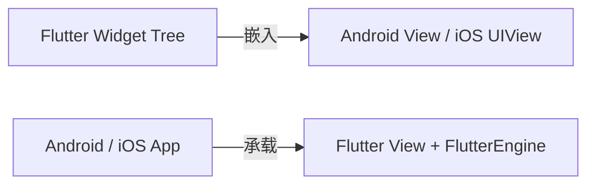

第一条链路是 Platform View：原生控件进入 Flutter 页面。第二条链路是 Add-to-App：Flutter 运行时和页面进入原生宿主。

如果边界没有分清，容易出现：

- 用 Platform View 展示本可直接用 Texture 的视频画面；
- 在滚动列表创建大量 WebView，导致合成和内存压力；
- Flutter 与原生滚动容器竞争手势；
- 输入框获得焦点后键盘无法正确收起；
- 缓存 Engine 仍反复使用 `initialRoute` 导航；
- 原生页面退出后销毁共享 Engine，影响其他 Flutter 页面；
- 多 Engine 下插件使用静态单例，消息和资源串到错误实例；
- 只测首次打开，不测前后台、旋转、快速进出和进程恢复。

### 核心结论

1. Platform View 保留完整原生 View 语义，代价是跨渲染体系合成、输入、无障碍和生命周期复杂度。
2. Texture 主要向 Flutter 提供可合成的像素内容，不等同于完整原生 View；视频和相机预览常适合 Texture，复杂原生交互控件通常需要 Platform View。
3. Android 的 Hybrid Composition、Texture Layer Hybrid Composition 和 Virtual Display 存在版本与控件差异，不能依据旧文章固定选择。
4. `AndroidView`/`UiKitView` 是 Widget 层入口，真正的原生实例由平台注册工厂创建，并由 Platform View 生命周期管理。
5. Platform View 的手势要同时经过 Flutter 手势竞技场和原生事件系统；焦点、键盘、返回手势和无障碍必须专项测试。
6. Add-to-App 中 Engine 是有状态、昂贵且有明确所有权的运行时容器，不是普通页面对象。
7. `FlutterEngineGroup` 降低多 Engine 的部分增量成本，但每个 Engine 仍有独立 Isolate、状态和插件绑定。
8. Engine 预热用内存与生命周期复杂度换取首屏时间，必须以目标设备数据决定。
9. 原生负责全局路由还是 Flutter 负责业务域内路由，应形成单一所有者和版本化协议。
10. Platform View 与 Add-to-App 的性能结论必须在当前 Flutter SDK、目标系统和真机上验证。

---

## 二、四个容易混淆的概念

| 概念 | 宿主 | 被嵌入对象 | 主要用途 |
|---|---|---|---|
| Platform View | Flutter 页面 | Android `View` / iOS `UIView` | 地图、WebView、原生输入控件 |
| Texture | Flutter Scene | 外部生产的像素帧 | 视频、相机、实时画面 |
| Add-to-App | 原生应用 | Flutter View + Engine | 渐进迁移原生业务 |
| Platform Channel/Pigeon | Dart 或原生 | 消息协议 | 跨边界调用与事件通信 |

Platform Channel 只传输消息，不负责显示原生视图。Platform View 能显示原生控件，但复杂业务命令仍常通过 Channel 或 Pigeon 传递。Texture 能显示像素，却通常没有原生控件树、焦点和无障碍语义。

### 2.1 Platform View 不在普通 Flutter RenderObject 体系内绘制

Flutter Widget 会创建 Element 和 RenderObject，最终形成 Layer Tree。原生 View 由 Android/iOS 自己的视图和渲染系统管理。Platform View 必须在合成阶段把两套结果组合起来。

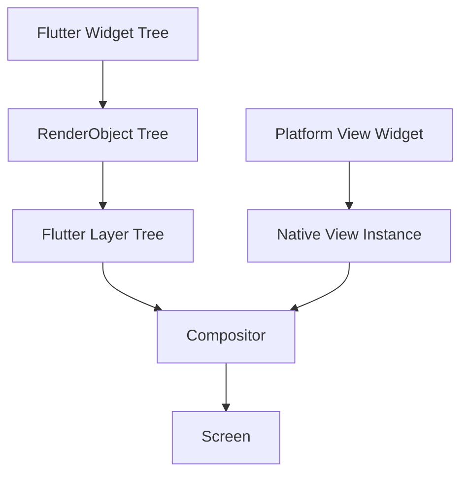

因此原生 View 不是简单“被 Flutter 画进 Canvas”。不同平台、合成路径和控件能力会决定它如何进入最终画面。

### 2.2 Texture 只有内容，没有完整控件行为

Texture 可把播放器、相机或其他生产者生成的帧交给 Flutter 合成：

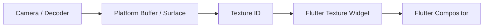

Flutter 可以对 Texture Widget 做布局、变换和遮盖，控制命令通过插件接口发送。但像素流本身通常不提供原生子控件的 Hit Test、文本选择、焦点和无障碍节点。

---

## 三、Platform View 的创建调用链

以 Android 为例，Dart 侧声明视图类型，原生插件注册同名工厂；Framework 请求创建时，工厂产生原生 View。

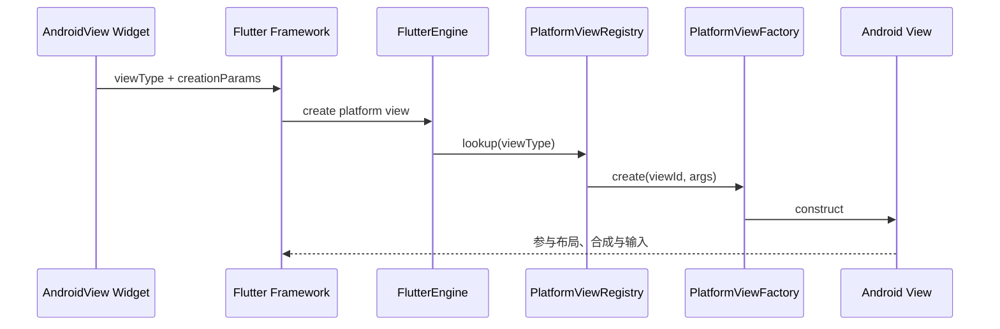

iOS 的职责关系相似：Dart 使用 `UiKitView`，插件通过 `FlutterPlatformViewFactory` 创建实现 `FlutterPlatformView` 的包装对象，内部提供 `UIView`。

具体 Engine 类名、消息路径和默认合成策略属于版本相关实现。源码分析应标注 Flutter SDK 版本与平台。

---

## 四、AndroidView：从 Dart 到 Android View

### 4.1 Dart 侧声明

```dart
class NativeMapView extends StatelessWidget {
  const NativeMapView({
    super.key,
    required this.initialLatitude,
    required this.initialLongitude,
  });

  final double initialLatitude;
  final double initialLongitude;

  @override
  Widget build(BuildContext context) {
    return AndroidView(
      viewType: 'com.example/native-map',
      creationParams: <String, Object?>{
        'latitude': initialLatitude,
        'longitude': initialLongitude,
      },
      creationParamsCodec: const StandardMessageCodec(),
      onPlatformViewCreated: (viewId) {
        logger.info('native map created', fields: {'viewId': viewId});
      },
    );
  }
}
```

`creationParams` 适合初始化所需的小型可序列化参数，不适合持续传输高频位置点、视频帧或大型对象。后续命令应通过以 `viewId` 隔离的类型安全接口或 Channel 传递。

### 4.2 Android 工厂与实例

```kotlin
class NativeMapFactory(
    private val messenger: BinaryMessenger
) : PlatformViewFactory(StandardMessageCodec.INSTANCE) {

    override fun create(
        context: Context,
        viewId: Int,
        args: Any?
    ): PlatformView {
        val params = args as? Map<*, *> ?: emptyMap<Any, Any>()
        return NativeMapPlatformView(context, messenger, viewId, params)
    }
}

class NativeMapPlatformView(
    context: Context,
    messenger: BinaryMessenger,
    viewId: Int,
    params: Map<*, *>
) : PlatformView {
    private val mapView = MapView(context)
    private val channel = MethodChannel(
        messenger,
        "com.example/native-map/$viewId"
    )

    init {
        channel.setMethodCallHandler { call, result ->
            when (call.method) {
                "moveCamera" -> {
                    // 校验参数后更新地图。
                    result.success(null)
                }
                else -> result.notImplemented()
            }
        }
    }

    override fun getView(): View = mapView

    override fun dispose() {
        channel.setMethodCallHandler(null)
        mapView.onDestroy()
    }
}
```

注册通常发生在插件附着 Engine 时：

```kotlin
binding.platformViewRegistry.registerViewFactory(
    "com.example/native-map",
    NativeMapFactory(binding.binaryMessenger)
)
```

示例中的 `MapView` 生命周期方法以具体地图 SDK 为准。生产实现还需处理宿主 Activity 生命周期、权限、前后台、低内存、错误回调和多 Engine；不能机械照搬 `onDestroy()` 一行。

### 4.3 每个实例必须隔离

`viewId` 用于区分同一种 Platform View 的多个实例。Channel 名、回调、播放器、地图控制器和资源所有权都应按实例隔离。

使用进程静态 `currentMapView` 会在列表、多窗口或多 Engine 下串实例。只有真正进程级的 SDK 资源可以共享，并且需要独立仲裁层管理引用计数和线程安全。

---

## 五、UiKitView：嵌入 iOS UIView

### 5.1 Dart 侧

```dart
class NativeReaderView extends StatelessWidget {
  const NativeReaderView({super.key, required this.documentId});

  final String documentId;

  @override
  Widget build(BuildContext context) {
    return UiKitView(
      viewType: 'com.example/native-reader',
      creationParams: {'documentId': documentId},
      creationParamsCodec: const StandardMessageCodec(),
    );
  }
}
```

### 5.2 iOS 工厂

```swift
final class NativeReaderFactory: NSObject, FlutterPlatformViewFactory {
    private let messenger: FlutterBinaryMessenger

    init(messenger: FlutterBinaryMessenger) {
        self.messenger = messenger
        super.init()
    }

    func create(
        withFrame frame: CGRect,
        viewIdentifier viewId: Int64,
        arguments args: Any?
    ) -> FlutterPlatformView {
        NativeReaderPlatformView(
            frame: frame,
            viewId: viewId,
            arguments: args,
            messenger: messenger
        )
    }

    func createArgsCodec() -> FlutterMessageCodec & NSObjectProtocol {
        FlutterStandardMessageCodec.sharedInstance()
    }
}

final class NativeReaderPlatformView: NSObject, FlutterPlatformView {
    private let readerView: ReaderView
    private let channel: FlutterMethodChannel

    init(
        frame: CGRect,
        viewId: Int64,
        arguments: Any?,
        messenger: FlutterBinaryMessenger
    ) {
        readerView = ReaderView(frame: frame)
        channel = FlutterMethodChannel(
            name: "com.example/native-reader/\(viewId)",
            binaryMessenger: messenger
        )
        super.init()
        channel.setMethodCallHandler { [weak self] call, result in
            guard let self else {
                result(FlutterError(
                    code: "view_disposed",
                    message: "Native reader has been disposed",
                    details: nil
                ))
                return
            }
            // 处理方法并保证 result 只完成一次。
            _ = self.readerView
            result(FlutterMethodNotImplemented)
        }
    }

    func view() -> UIView { readerView }

    deinit {
        channel.setMethodCallHandler(nil)
        readerView.stop()
    }
}
```

实际注册 API 与插件模板会随 Flutter 版本变化，应以当前 iOS embedding 文档为准。闭包应避免强引用环；原生观察者、通知、Delegate 和资源必须在实例结束时解除。

---

## 六、Android 三类合成路径

Android Platform View 经历过多种实现路径。名称相似，且 Flutter 版本、Android API、View 类型和 Widget 入口会影响实际选择。

### 6.1 Virtual Display

Virtual Display 路径把原生 View 放在虚拟显示环境中，将输出作为 Texture 参与 Flutter 合成。

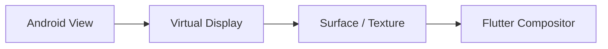

优点通常是 Flutter 侧合成和变换较自然。代价可能包括：

- 原生 View 不在宿主真实视图层级；
- 文本输入、无障碍、Surface 子视图和焦点存在兼容挑战；
- 额外 Buffer 与显示链路增加内存和延迟；
- 某些 SDK 假定真实 Window，行为异常。

它是历史上重要的实现路径，但不能假定当前所有 `AndroidView` 都使用它。

### 6.2 Hybrid Composition

Hybrid Composition 让原生 View 直接参与 Android 视图层级，与承载 Flutter 的 View 一起由系统组合。

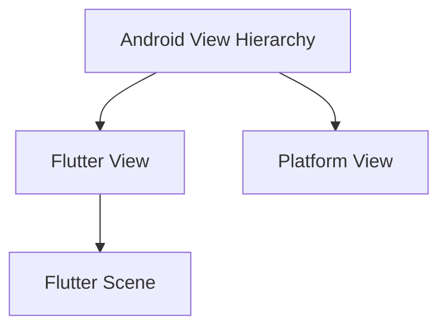

通常优势：

- 原生 View 兼容性、输入和无障碍更接近正常 Android 控件；
- 对依赖真实 View 层级或 Surface 的控件更友好。

可能代价：

- Flutter 与原生内容跨视图合成；
- 某些系统版本存在额外拷贝、同步或帧时序成本；
- Flutter 复杂变换、裁剪和 Shader 效果并非都能低成本作用于原生 View；
- 快速滚动和动画中更容易暴露合成抖动。

### 6.3 Texture Layer Hybrid Composition

Texture Layer Hybrid Composition 试图让原生 View 内容以 Texture Layer 进入 Flutter 合成，同时保留更多与原生 View 的协作能力。

它常能改善 Flutter 变换和合成性能，但不是对所有控件都等价：包含 `SurfaceView`、特殊窗口或依赖真实视图层级的 SDK 可能需要回退或存在限制。

> Android Platform View 的默认模式、最低 API、回退条件和性能实现持续演进。选型时必须查阅当前 Flutter SDK 文档、插件实现和目标控件源码，并在目标设备验证，不能依赖固定版本的绝对结论。

### 6.4 如何选择

| 判断维度 | 更关注 Texture 路径 | 更关注 Hybrid Composition |
|---|---|---|
| Flutter 侧复杂变换与动画 | 通常更有优势 | 需要专项验证 |
| 原生输入、无障碍兼容 | 需要专项验证 | 通常更接近原生 View |
| 控件包含 Surface | 可能受限或回退 | 常需重点评估 |
| 旧设备帧性能 | 真机测量 | 真机测量 |
| 滚动列表多实例 | 两者都应避免滥用 | 两者都应避免滥用 |

不存在对所有控件和设备都最优的模式。

---

## 七、iOS 合成边界

iOS Platform View 以 `UIView` 参与界面组合。它同样不属于 Flutter 普通绘制内容，因此需要关注：

- Flutter 与 UIKit 层级的前后遮挡；
- Clip、Opacity、Transform 等效果的支持与成本；
- UIKit 手势识别器和 Flutter Gesture Arena 的协调；
- First Responder、键盘与焦点；
- VoiceOver 无障碍顺序；
- 页面转场、旋转与多 Scene；
- 原生 View 截图、录屏和安全遮罩。

具体支持矩阵会随 Flutter 和 iOS 版本变化。涉及复杂裁剪、滤镜和连续动画时，应做最小原型验证，不要直到业务完成后才发现组合限制。

---

## 八、Platform View 与 Texture 如何选择

### 8.1 更适合 Platform View

- WebView，需要原生页面、文本选择、输入和无障碍；
- 交互复杂的地图；
- 厂商只提供原生 View 的业务 SDK；
- 原生广告、支付或身份认证控件；
- 必须复用成熟原生交互组件。

### 8.2 更适合 Texture

- 视频画面；
- 相机预览；
- 远程桌面或实时流；
- 外部渲染器产生的像素帧；
- 控制 UI 可以用 Flutter 重建的场景。

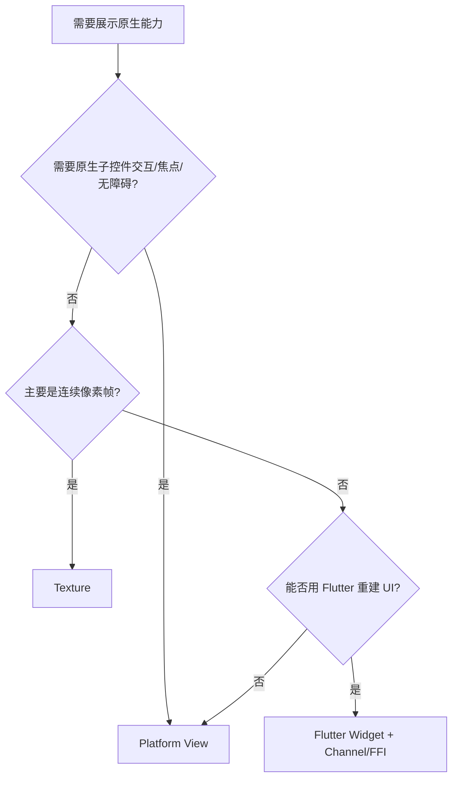

如果地图只需展示静态预览，可用服务端快照或 Flutter 绘制；如果需要缩放、标注、定位和原生 SDK 完整能力，Platform View 更合理。需求而非技术偏好决定边界。

---

## 九、手势：两个系统如何竞争同一指针

用户触摸 Platform View 区域时，Flutter 需要决定事件由 Flutter Gesture Recognizer 还是原生 View 处理。

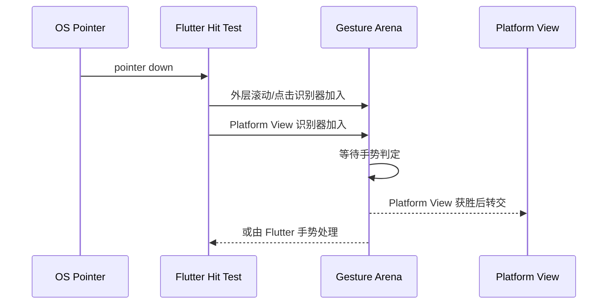

### 9.1 Dart 侧声明手势识别器

```dart
AndroidView(
  viewType: 'com.example/native-map',
  gestureRecognizers: <Factory<OneSequenceGestureRecognizer>>{
    Factory<PanGestureRecognizer>(() => PanGestureRecognizer()),
    Factory<ScaleGestureRecognizer>(() => ScaleGestureRecognizer()),
  },
)
```

声明的集合表示 Platform View 希望参与哪些 Flutter 手势竞技。具体行为还受外层 `Scrollable`、Recognizer 组合和平台实现影响。

### 9.2 常见冲突

- 地图纵向拖动 vs 外层 `ListView` 滚动；
- WebView 横向手势 vs iOS 系统返回；
- 视频滑动进度 vs PageView 翻页；
- 原生长按文本 vs Flutter LongPress；
- 双指缩放 vs 父级缩放容器。

处理原则：

1. 明确手势所有权，不让双方同时执行完整业务动作。
2. 优先遵循平台用户预期，例如系统返回手势。
3. 避免用全局 `AbsorbPointer` 长期屏蔽原生控件。
4. 对临界角度、手势取消、多指和快速切换做真机测试。
5. 无法稳定协调时，调整页面结构，例如地图进入独立页面。

---

## 十、焦点、键盘与文本输入

Platform View 内的原生输入控件可能成为 Android Focus View 或 iOS First Responder，而 Flutter 也维护 Focus Tree 和文本输入连接。

需要验证：

- 点击原生输入框能否正确弹出键盘；
- 点击 Flutter 输入框时原生输入是否失焦；
- 系统返回键先收键盘还是退出页面；
- 页面被覆盖、切后台或销毁时是否清理焦点；
- 输入法切换、硬件键盘和无障碍输入；
- 多个 Platform View 的焦点顺序。

不要只在 Flutter State 中保存 `isFocused` 作为事实源。焦点由系统和 Framework 共同维护，应监听实际焦点事件并把业务展示状态作为派生值。

---

## 十一、无障碍与语义

Flutter 使用 Semantics Tree，原生 View 使用平台无障碍节点。混合后要保证辅助技术看到一个合理的整体顺序。

专项检查包括：

- TalkBack/VoiceOver 能否进入和离开 Platform View；
- Flutter 与原生节点朗读顺序是否符合视觉顺序；
- 原生控件的 Label、Role、Value 和 Action 是否完整；
- Platform View 被遮挡或隐藏后是否仍被朗读；
- 字体缩放、高对比度和 Reduce Motion；
- 键盘与 Switch Control 导航。

Texture 没有自动产生原生控件语义。若使用 Texture 展示播放器，应由 Flutter 控制层提供播放、暂停、进度和描述等 Semantics。

---

## 十二、Platform View 生命周期与资源所有权

Platform View 同时跨越：

- Widget/Element 生命周期；
- 原生 View 生命周期；
- Activity/UIViewController 生命周期；
- FlutterEngine 生命周期；
- 相机、播放器、地图等 SDK 生命周期。

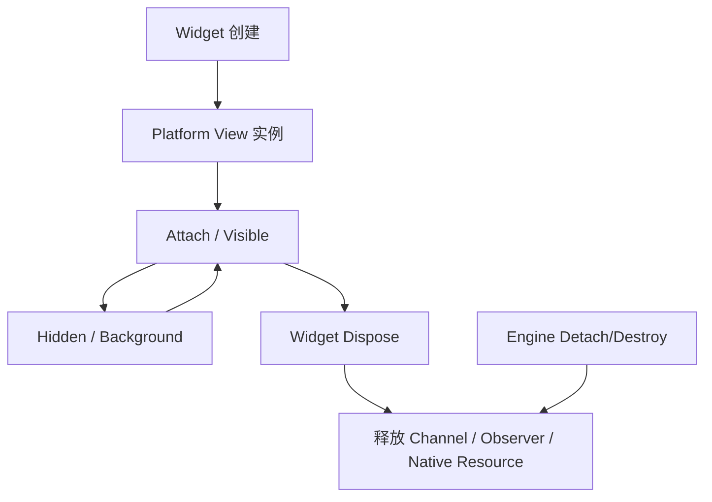

### 12.1 `dispose` 必须幂等

生产实现应清理：

- Method/Event Channel Handler；
- Activity/Scene 生命周期观察者；
- Map、WebView、播放器和相机；
- Timer、线程、Executor 和回调；
- 原生通知、Delegate 和 Listener；
- Texture/Surface；
- 对 Activity、UIViewController 和 Dart 回调的引用。

清理可能从 Widget 移除、Engine 销毁或错误恢复等不同路径触发，因此要允许重复调用，不访问已失效宿主。

### 12.2 页面不可见不一定销毁

Route 被覆盖、Tab 切换或应用进入后台时，Platform View 可能仍存活。地图定位、播放器、WebView JavaScript 和相机是否暂停，应由页面可见性、应用生命周期和产品需求共同决定。

---

## 十三、Platform View 性能成本

成本通常来自：

- Flutter 与原生视图的额外合成；
- Buffer、Texture 或像素拷贝；
- 原生 View 布局和绘制；
- Flutter 与平台线程同步；
- 手势和语义桥接；
- WebView/地图/播放器自身内存；
- 频繁创建销毁和纹理重新分配；
- 列表滚动中的实例数量。

### 13.1 不要在长列表无界创建 Platform View

几十个 WebView、地图或播放器即使离屏，也可能保留昂贵原生资源。优先考虑：

- 列表使用静态缩略图，点击后进入详情创建真实控件；
- 只有当前可见项目持有播放器；
- 使用受控实例池，但明确重置、账号隔离和释放；
- 避免因 `Key` 变化无意重建；
- 页面不可见时暂停高频资源；
- 对 WebView 和地图缓存设置上限。

实例池并非默认最优。复用错误可能泄漏 Cookie、页面状态或用户数据，且某些 SDK 不支持换宿主复用。

### 13.2 正确测量

在 Profile/Release、目标设备和实际刷新率下记录：

- UI Thread 和 Raster Thread 帧耗时；
- Android Main Thread / iOS Main Thread；
- Platform View 创建首帧时间；
- 快速滚动、缩放和页面转场慢帧；
- Dart Heap、Java/Kotlin Heap、Native/Graphics、iOS Allocations；
- Texture/Buffer 数量；
- 重复进出后的 GC 后内存基线；
- 输入延迟与掉触摸；
- 前后台恢复时间。

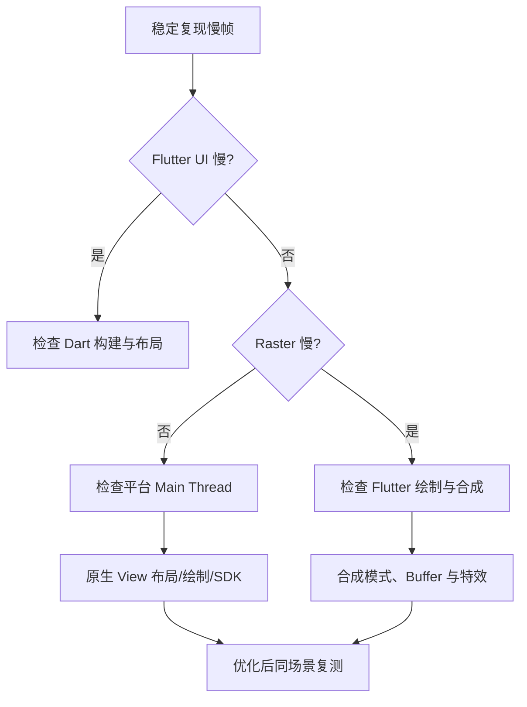

不能只看 Flutter Performance Overlay；Platform View 的原生工作还需 Android Perfetto/Profiler 或 iOS Instruments 观察。

---

## 十四、Add-to-App 的整体架构

Add-to-App 以原生 App 为宿主，将 Flutter 作为页面或业务模块嵌入：

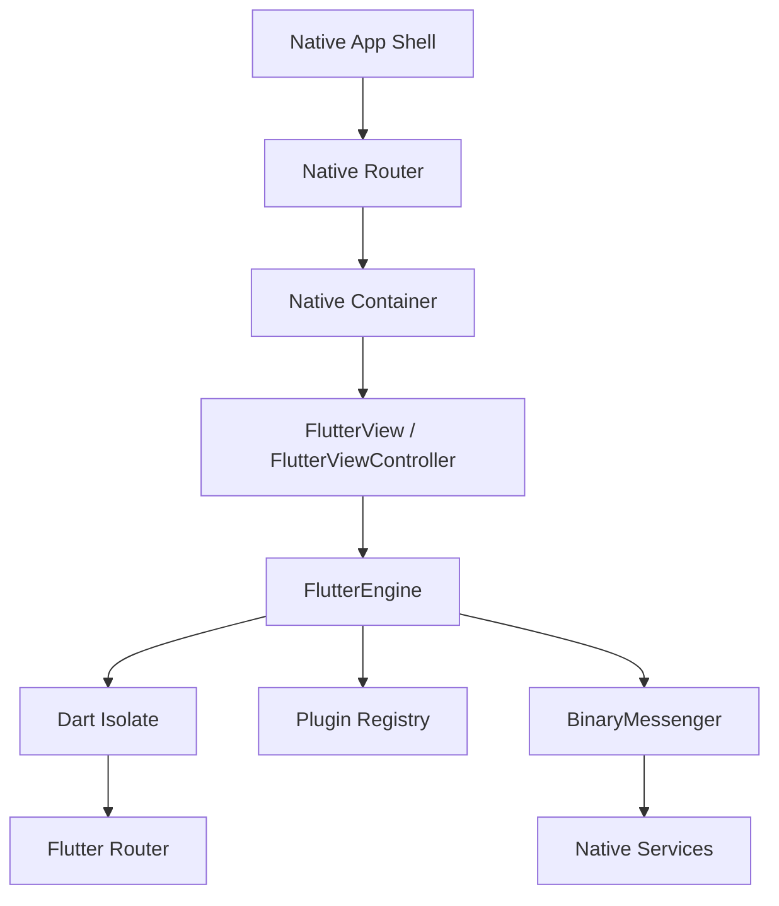

核心角色：

- 原生宿主：应用入口、全局导航、权限和发布壳；
- Flutter 容器：Android Activity/Fragment/View 或 iOS ViewController；
- Engine：Dart、渲染、插件和平台消息运行时；
- Flutter 模块：业务 UI、状态与业务逻辑；
- 协议层：路由、登录态、埋点和原生能力接口。

---

## 十五、FlutterEngine 是什么

`FlutterEngine` 是承载 Flutter 执行环境的核心对象，通常涉及：

- Dart Isolate 与入口执行；
- Renderer；
- BinaryMessenger；
- Platform Views Controller；
- Plugin Registry；
- 生命周期和系统通道。

Engine 有状态且有成本。创建、执行入口、注册插件、预热和销毁必须由统一所有者管理。

### 15.1 单 Engine

适合：

- Flutter 页面通常串行展示；
- 页面属于同一业务域并希望共享 Dart 状态；
- 希望控制内存与启动成本。

代价：

- 路由栈和会话状态必须在不同原生容器间正确重置；
- 通常不应把同一 Engine 同时附着到多个主要渲染 View；
- 插件和 Platform View 需要处理容器 detach/reattach；
- 页面所有者不能擅自销毁共享 Engine。

“一个 Engine 能否同时附着多个 View”受当前 embedding 能力约束。传统 Add-to-App 设计应按一个 Engine 对应一个活动渲染容器建模；多 View 能力必须依据目标 Flutter 版本专门验证。

### 15.2 多 Engine

适合：

- Flutter 容器需要同时显示；
- 业务状态必须强隔离；
- 多窗口或独立流程；
- 不同入口或插件配置。

代价：

- 每个 Engine 有独立 Isolate 和对象状态；
- 插件会按 Engine 注册，多实例兼容必须审计；
- 内存、线程、GPU 和平台资源增加；
- 跨 Engine 状态不能靠 Dart 单例共享；
- 进程级 SDK 需要原生仲裁。

---

## 十六、FlutterEngineGroup 的价值与边界

`FlutterEngineGroup` 用于创建多个共享部分底层资源的 Engine，降低后续 Engine 的部分增量成本。

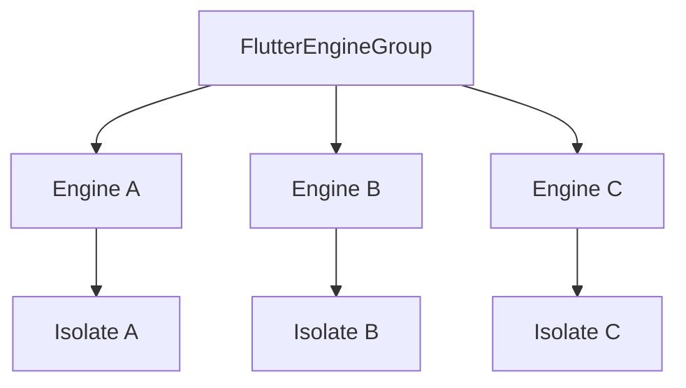

它不意味着：

- 多个 Engine 共享同一个 Dart Heap；
- Provider、Bloc 或全局变量自动同步；
- 插件只注册一次；
- Platform View 可以跨 Engine 复用；
- Engine 成本降为零。

每个 Engine 仍要管理入口、路由、消息、插件、生命周期和销毁。共享哪些资源以及增量收益属于 Flutter 版本与平台实现，应通过当前 SDK 文档和实测确认。

### 16.1 插件多 Engine 审计

重点检查：

- 是否使用静态 `BinaryMessenger` 或静态 EventSink；
- Channel 是否绑定正确 Engine；
- Activity/UIViewController 引用是否随容器更新；
- 原生 SDK 是否允许多实例；
- 回调能否路由到正确 Isolate；
- Engine 销毁是否误关闭进程级共享资源；
- Platform View Factory 是否按 Engine 注册。

---

## 十七、Engine 预热与缓存

冷创建链路通常包括 Engine 初始化、Dart 入口执行、插件注册、首帧构建和 Shader/资源准备。预热是在用户打开页面前完成其中一部分。

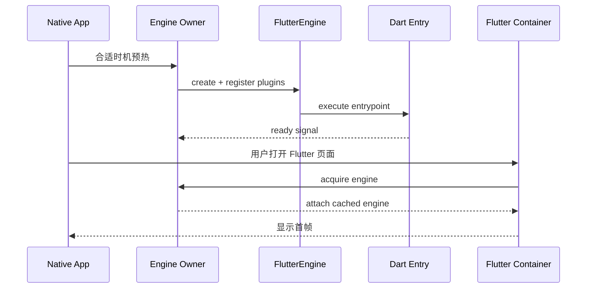

### 17.1 收益

- 缩短打开 Flutter 页时的 Engine 创建时间；
- Dart 可提前加载基础配置；
- 插件和通信通道提前就绪；
- 用户感知白屏减少。

### 17.2 成本

- Engine 长期占用内存、线程和图形资源；
- Dart 任务可能在用户从未进入 Flutter 时仍运行；
- 登录切换后缓存状态需要清理；
- 容器和 Engine 生命周期分离，所有权更复杂；
- 低端设备可能因预热增加启动与内存压力。

### 17.3 预热时机

可选时机包括：

- 原生首屏稳定后的空闲阶段；
- 用户进入 Flutter 页的高概率前置页面；
- 用户点击入口后先展示原生过渡，再异步准备；
- 按设备能力和远端开关启用。

不要在原生冷启动关键路径同步创建 Engine，然后声称优化了 Flutter 首屏，却拖慢整个 App 启动。

### 17.4 Ready 不等于 First Frame

需要分别记录：

- Engine 创建完成；
- Dart entrypoint 开始/完成关键初始化；
- Dart 侧路由 ready；
- 容器 attach；
- Flutter 第一帧提交；
- 用户可交互。

只有端到端指标才能证明预热收益。

---

## 十八、Engine 所有权与缓存池

共享 Engine 不应由任意 Activity/ViewController 销毁。建议使用进程级 Engine Owner：

```text
App Process
└── FlutterRuntimeManager
    ├── EngineRecord
    │   ├── engine
    │   ├── ownerScope
    │   ├── attachedContainer
    │   ├── sessionId
    │   └── state
    ├── acquire(routeRequest)
    ├── release(containerId)
    └── destroy(reason)
```

状态至少区分：

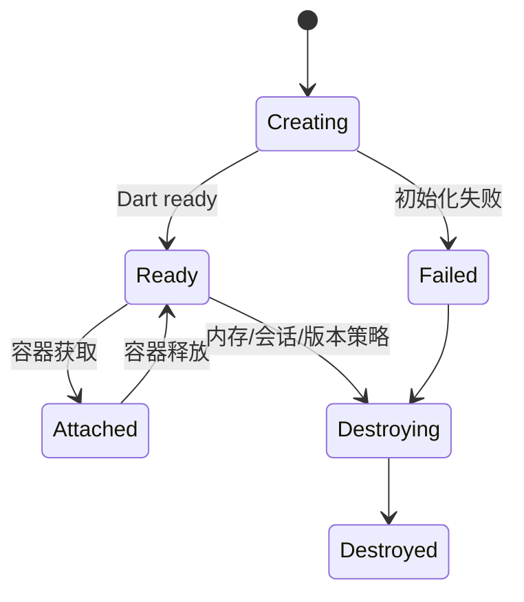

管理器需要处理：

- 重复 acquire；
- Engine 尚未 ready 时的路由排队；
- 容器异常退出；
- 登录态切换；
- 内存压力；
- Flutter 模块版本变化；
- 插件注册失败；
- Engine 崩溃或 Dart 初始化超时。

缓存必须有数量和淘汰策略，不能为了“秒开”无限保留 Engine。

---

## 十九、原生与 Flutter 路由协作

混合工程同时存在原生路由栈和 Flutter Navigator/Router。最重要的是定义所有权。

### 19.1 推荐边界

- 原生路由负责跨业务域和 Flutter 容器的打开/关闭；
- Flutter Router 负责一个 Flutter 业务域内部页面；
- Dart 不直接拼接原生类名；
- 原生不直接操作 Flutter 内部 Widget 路由细节；
- 双方通过版本化 Route Contract 通信。

```dart
final class NativeRouteRequest {
  const NativeRouteRequest({
    required this.requestId,
    required this.route,
    required this.arguments,
  });

  final String requestId;
  final String route;
  final Map<String, Object?> arguments;
}
```

契约应说明：

- Route 名和参数 Schema；
- 必填/可选字段及单位；
- 登录与权限前置条件；
- 结果和取消语义；
- 错误码；
- 最低宿主/Flutter 模块版本；
- 重复 requestId 的幂等处理。

### 19.2 `initialRoute` 的边界

`initialRoute` 适用于 Dart Isolate 启动前设置初始导航。一旦缓存 Engine 已执行入口，它不再是通用的后续跳转 API。

复用 Engine 时，应通过 Pigeon/Channel 发送路由请求，由 Dart Router 统一消费：

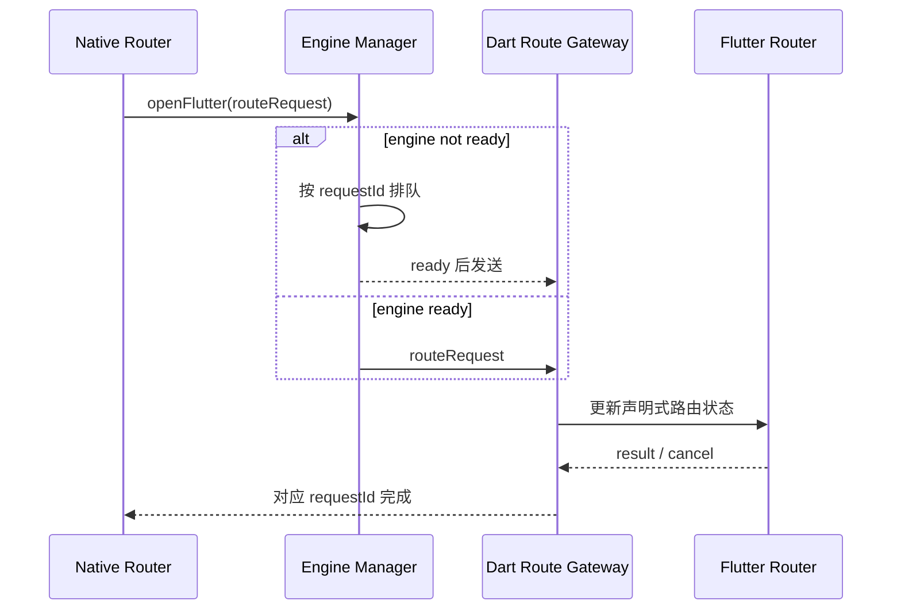

### 19.3 返回结果

每次打开请求使用唯一 `requestId`，结果只能完成一次。需要处理：

- 用户返回取消；
- 宿主容器被系统销毁；
- Engine 初始化失败；
- Dart 页面异常；
- 原生调用方已经离开；
- 同一请求重复送达。

不要用一个全局 `pendingResult`，它无法支持并发路由和多 Engine。

---

## 二十、生命周期：不要混成一个回调

混合工程至少有四层生命周期：

| 生命周期 | 结束意味着什么 | 不一定意味着什么 |
|---|---|---|
| 进程 | 所有内存状态消失 | 有机会执行清理回调 |
| Engine | Isolate、插件和渲染结束 | 原生 App 退出 |
| 容器 | Activity/ViewController 不再承载 | 缓存 Engine 被销毁 |
| Flutter Route/Widget | 页面退出并释放局部资源 | Engine 或容器结束 |

`AppLifecycleState` 也不等同于某个 Flutter Route 可见。原生页面覆盖 Flutter 容器、多窗口或缓存 Engine 时，需要额外定义容器和页面可见事件。

### 20.1 生命周期协议应幂等

```dart
sealed class HostVisibilityEvent {
  const HostVisibilityEvent(this.containerId);
  final String containerId;
}

final class HostBecameVisible extends HostVisibilityEvent {
  const HostBecameVisible(super.containerId);
}

final class HostBecameHidden extends HostVisibilityEvent {
  const HostBecameHidden(super.containerId);
}

final class HostWasDestroyed extends HostVisibilityEvent {
  const HostWasDestroyed(super.containerId);
}
```

Dart 侧只接受当前附着容器的事件，并对重复 visible/hidden 去重。播放器、定位和曝光还要结合 Flutter Route 是否当前可见。

### 20.2 插件的 Activity/UIViewController 引用

Engine 生命周期可能长于容器。Android 插件需要把 Engine 附着和 Activity 附着区分，使用当前 embedding 提供的 Activity-aware 生命周期；detach 时注销回调并清除引用。

iOS 侧也不应长期强引用已经消失的 ViewController。需要展示 UI 时，通过当前宿主提供者安全获取可见容器，并在主线程执行。

---

## 二十一、通信协议与线程

混合工程中的 Channel/Pigeon 是正式跨团队 API：

- 字段类型、Nullability 和单位明确；
- 错误码稳定且可映射；
- 新增字段优先可选；
- 破坏性变化升级版本；
- 生成代码与模块产物同步发布；
- 大消息、高频流和二进制数据避免走通用动态 Map；
- 回调只完成一次；
- Engine 销毁后不再向旧 Messenger 发消息。

平台 UI、Platform View 和多数 SDK 操作有主线程要求。Channel Handler 运行线程取决于平台 embedding 和 Task Queue 配置，不能凭经验假设；涉及 UI 时应显式切到平台主线程，重计算则放到适当后台执行器或 Isolate，并安全返回结果。

Pigeon 提供类型安全生成代码，但不能自动解决协议兼容、生命周期和线程问题。

---

## 二十二、Add-to-App 性能与稳定性

### 22.1 启动指标

- 点击原生入口到容器创建；
- Engine 获取/创建耗时；
- Dart ready；
- First Frame；
- 页面数据可见；
- 首次可交互；
- 冷 Engine、预热 Engine、复用 Engine 分组对比。

### 22.2 内存指标

- Dart Heap；
- Android Java/Kotlin Heap；
- iOS Allocations；
- Native/Graphics 内存；
- Engine 数量；
- Platform View、Texture、WebView 和播放器实例数；
- 页面退出与 GC 后基线；
- 多 Engine 增量内存。

### 22.3 稳定性场景

1. 冷启动直接进入 Flutter 深链。
2. 预热期间立即打开页面。
3. 连续快速打开/关闭 Flutter 容器。
4. Flutter 与原生页面交替跳转并返回结果。
5. 前后台、旋转、多窗口和低内存。
6. 登录切换与 Engine 缓存状态清理。
7. Channel 调用期间销毁容器或 Engine。
8. Platform View 滚动、输入时切后台。
9. 多 Engine 同时使用同一插件。
10. 进程终止后从原生路由恢复。

---

## 二十三、测试与验证

### 23.1 Platform View 测试

- Dart Widget 测试验证参数和 Controller 状态，但不能证明真实原生合成。
- Android Instrumentation / iOS UI Test 验证原生 View 创建、输入、焦点和销毁。
- 真机截图验证遮挡、Clip、Transform、键盘和系统手势。
- TalkBack/VoiceOver 人工与自动化辅助测试。
- 重复创建销毁后用 Profiler/Instruments 检查资源。

### 23.2 路由契约测试

```text
native route request
  -> capability/version validation
  -> Dart Router state
  -> user result/cancel
  -> matching requestId completes exactly once
```

覆盖未知 Route、缺失参数、旧宿主版本、Engine 未 ready、重复请求、调用方销毁和超时。

### 23.3 多 Engine 测试

- 两个 Engine 是否收到各自 Channel 消息；
- 插件静态状态是否串实例；
- 一个 Engine 销毁是否影响另一个；
- 进程级 SDK 是否正确引用计数；
- 两个 Platform View 是否释放各自资源；
- 登录态更新是否通过明确协议同步。

### 23.4 性能实验矩阵

| 变量 | 分组 |
|---|---|
| Engine | 冷创建 / 预热 / 复用 / EngineGroup |
| Platform View | 当前可用的不同合成路径 |
| 设备 | 低端 / 主流 / 高端 |
| 系统 | 最低支持版本 / 主流版本 / 最新版本 |
| 场景 | 静止 / 滚动 / 动画 / 输入 / 前后台 |

保持业务数据和操作脚本一致，至少多轮采样，报告中注明 Flutter/Dart SDK、设备、系统、构建模式和刷新率。

---

## 二十四、常见误区与修复

### 24.1 Platform View 就是一个普通 Widget

**问题：** 忽略原生视图层级、合成、输入和资源生命周期。

**修复：** 把它视为跨渲染系统边界，进行平台专项设计与测试。

### 24.2 视频必须使用 Platform View

**问题：** 只需要像素画面时引入完整原生 View 交互成本。

**修复：** 评估 Texture + Flutter 控制层，并为控制层补齐 Semantics。

### 24.3 固定认为某种 Android 合成模式永远最快

**问题：** 默认策略、回退条件、系统和控件实现会变化。

**修复：** 根据当前 SDK 与目标控件建立实验矩阵，真机测量。

### 24.4 列表每项创建 WebView/地图

**问题：** 原生实例、Buffer、线程和内存随列表增长。

**修复：** 列表展示快照或缩略内容，详情页按需创建并限制活跃实例。

### 24.5 用全局手势屏蔽解决冲突

**问题：** 破坏滚动、系统返回、输入和无障碍。

**修复：** 明确手势所有权，配置 Recognizer，并调整交互结构。

### 24.6 容器退出就销毁共享 Engine

**问题：** 其他页面或缓存状态被意外终止。

**修复：** Engine 由统一 Manager 拥有，容器只 acquire/release。

### 24.7 缓存 Engine 后仍修改 `initialRoute`

**问题：** Isolate 已启动，initial route 不会变成后续导航命令。

**修复：** 使用版本化路由协议，让 Dart Router 处理后续请求。

### 24.8 认为 EngineGroup 会共享 Dart 单例

**问题：** 每个 Engine 仍有独立 Isolate 和 Heap。

**修复：** 通过原生共享服务、数据库或消息协议显式同步。

### 24.9 插件静态保存 Activity 和 Messenger

**问题：** 容器重建、多 Engine 时泄漏或消息错投。

**修复：** 分离 Engine Scope 与 Activity Scope，detach 时清理引用。

### 24.10 只测 Flutter 帧率

**问题：** 原生主线程、View 布局、Buffer 和插件内存不可见。

**修复：** 联合 DevTools、Perfetto/Android Profiler 和 iOS Instruments。

---

## 二十五、架构选择建议

### 25.1 只需要原生能力，不需要原生 UI

优先使用插件 Channel/Pigeon 或 FFI，让 UI 保持 Flutter 实现。这样布局、手势、无障碍和测试更统一。

### 25.2 需要连续画面

优先评估 Texture，由 Flutter 实现控制层。确认像素格式、帧同步、旋转、生命周期和资源释放。

### 25.3 必须复用原生交互控件

使用 Platform View，但缩小面积、数量和动画复杂度，提前验证手势、焦点、无障碍和目标设备性能。

### 25.4 已有原生 App 渐进迁移

使用 Add-to-App，优先选择业务边界清晰、跨端收益高的模块。先定义路由、通信、Engine 所有权、发布和回滚，再扩展页面数量。

### 25.5 同时显示多个 Flutter 容器

先判断能否合并为一个 Flutter 区域。必须独立时评估多 Engine/EngineGroup，测量增量内存，并审计所有插件的多实例支持。

---

## 二十六、落地步骤

1. 明确方向：原生 View 进入 Flutter，还是 Flutter 进入原生宿主。
2. 对原生能力判断 Widget、Texture、Platform View 哪个边界最小。
3. 用最小原型验证目标控件的合成、手势、焦点、无障碍和截图。
4. 为 Platform View 定义实例 ID、参数、命令、错误和释放协议。
5. 在当前 SDK 和目标设备比较可用合成路径。
6. Add-to-App 先确定单 Engine、多 Engine 或 EngineGroup 的业务理由。
7. 建立 Engine Manager，明确预热、获取、释放、淘汰和会话清理。
8. 设计原生全局路由与 Flutter 域内路由的所有权。
9. 使用 Pigeon 或 Schema 管理跨端协议和版本兼容。
10. 审计插件的多 Engine、Activity/Scene 与线程安全。
11. 建立冷/热 Engine、Platform View、快速进出和进程恢复测试矩阵。
12. 用端到端首帧、帧耗时、内存和稳定性数据验收，并准备原生降级开关。

---

## 二十七、总结

Flutter 原生视图与混合工程真正需要记住的是：

- Platform View 是原生 View 与 Flutter Scene 的组合，不是普通 Flutter 绘制节点。
- `AndroidView` 和 `UiKitView` 负责声明，平台注册工厂负责创建并释放真实原生实例。
- Texture 更适合连续像素内容，但不自动提供原生控件的输入和无障碍语义。
- Android 多种合成路径各有兼容和性能取舍，默认行为与限制必须按当前 SDK 验证。
- 手势、焦点、键盘、无障碍和系统返回都是跨框架协作问题，必须真机专项测试。
- Platform View 数量、原生 SDK、Buffer 和频繁重建会共同影响帧性能和内存。
- Add-to-App 的核心不是打开 Flutter 页面，而是治理 Engine、路由、协议、生命周期和发布。
- 单 Engine 节省增量资源并共享 Dart 状态，多 Engine 提供隔离与并行容器，EngineGroup 只降低部分增量成本。
- Engine 预热需要用内存换首屏，容器不能擅自销毁共享 Engine。
- `initialRoute` 只服务启动阶段，复用 Engine 的后续导航应走版本化 Route Contract。
- 混合工程必须联合 Flutter 与原生性能工具验证，任何平台实现结论都应标注 SDK 和系统范围。

---

## 问答复盘

### Q1：Platform View 和 Texture 最本质的区别是什么？

**答：** Platform View 保留完整原生控件及其输入、焦点和无障碍语义；Texture 主要提供可由 Flutter 合成的像素帧，控制与语义通常需要另行实现。

### Q2：为什么 Platform View 不能当作普通 Widget 理解？

**答：** 它的内容由 Android/iOS 原生视图系统管理，不经过普通 Flutter RenderObject 绘制，需要额外解决跨体系合成、手势、焦点和生命周期。

### Q3：Android 的 Hybrid Composition 一定比 Virtual Display 快吗？

**答：** 不一定。兼容性、拷贝、视图层级、系统版本和控件类型都会影响结果，应按当前 Flutter SDK 和目标真机测量。

### Q4：地图放在 `ListView` 中滚动卡顿，应首先做什么？

**答：** 先在 Profile 真机上区分 Flutter UI、Raster 和原生主线程成本，再评估列表使用静态快照、减少活跃地图实例及调整合成路径，不能只凭经验切换模式。

### Q5：应用处于 `resumed` 是否说明 Platform View 所在页面可见？

**答：** 不说明。Route 可能被覆盖或 Tab 未选中。资源状态应组合应用、宿主容器、Route 和组件生命周期。

### Q6：FlutterEngineGroup 是否让多个 Engine 共享 Provider 状态？

**答：** 不会。每个 Engine 仍有独立 Isolate 和 Dart Heap，状态需要通过数据库、原生服务或显式消息协议同步。

### Q7：为什么缓存 Engine 后不能依赖 `initialRoute` 打开新页面？

**答：** `initialRoute` 在 Dart 入口启动前生效；缓存 Engine 的 Isolate 已运行，后续导航应通过 Channel/Pigeon 交给 Dart Router。

### Q8：容器页面关闭时是否应该立即销毁 Engine？

**答：** 取决于所有权。页面独占 Engine 可以销毁；共享或预热 Engine 应由统一 Manager 根据引用、内存和会话策略决定，容器只释放附着关系。

### Q9：如何验证 Platform View 没有内存泄漏？

**答：** 在真机重复创建、交互、前后台和销毁，联合 DevTools 与 Android/iOS 原生工具观察 GC 后基线，并检查原生 View、Channel、Observer、Texture 和 SDK 资源的持有链。

### Q10：混合工程中路由应由原生还是 Flutter 管理？

**答：** 通常由原生管理跨业务域和容器导航，Flutter 管理业务域内部路由。关键是单一所有者、版本化契约、请求 ID 和明确的结果/取消语义。

---

## 延伸知识

- Platform Channel：BinaryMessenger、Codec、线程与错误传播。
- Pigeon：类型安全 API、版本演进与生成代码治理。
- Flutter 混合开发技术详解：模块集成、发布链和线上治理。
- Flutter 应用生命周期：Engine、容器、Route 与 Widget 的状态边界。
- Flutter 性能优化：UI、Raster、GPU、内存与真机测量。
- 插件架构：Federated Plugin、多 Engine 与平台接口测试。
