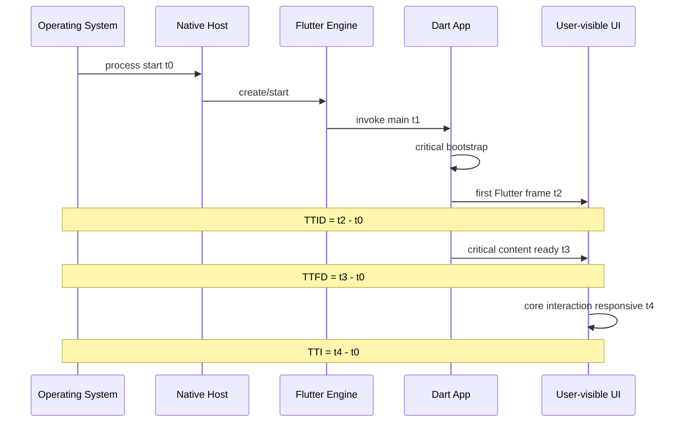
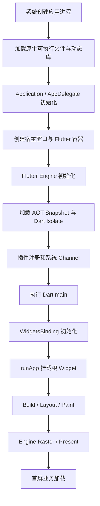
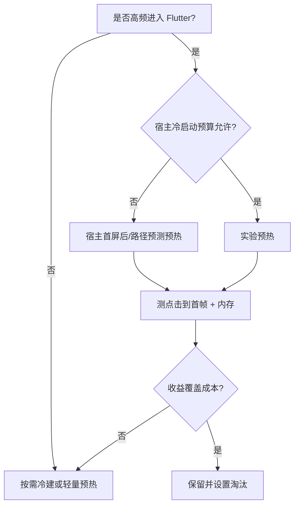
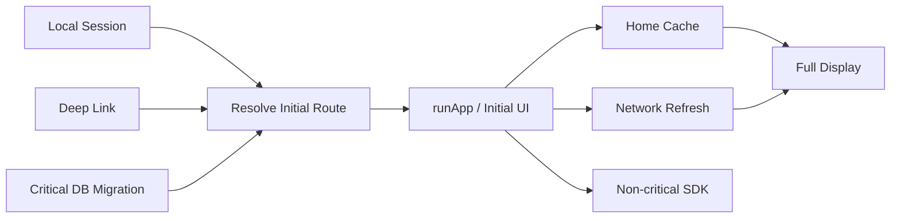
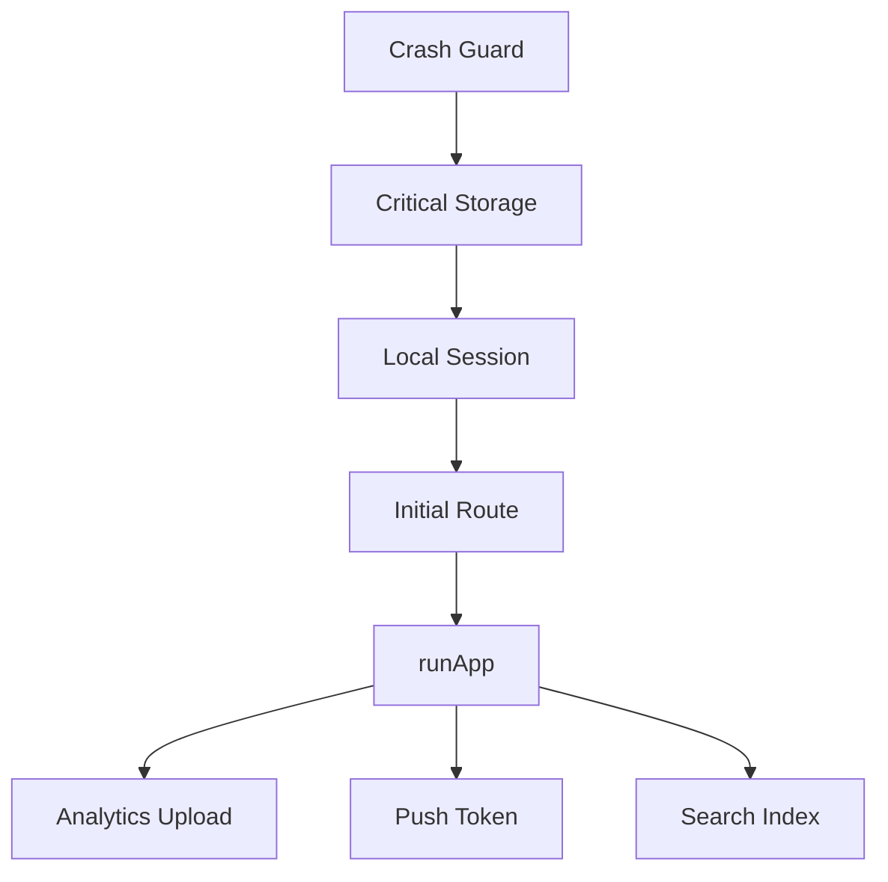
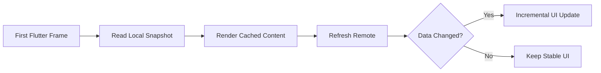
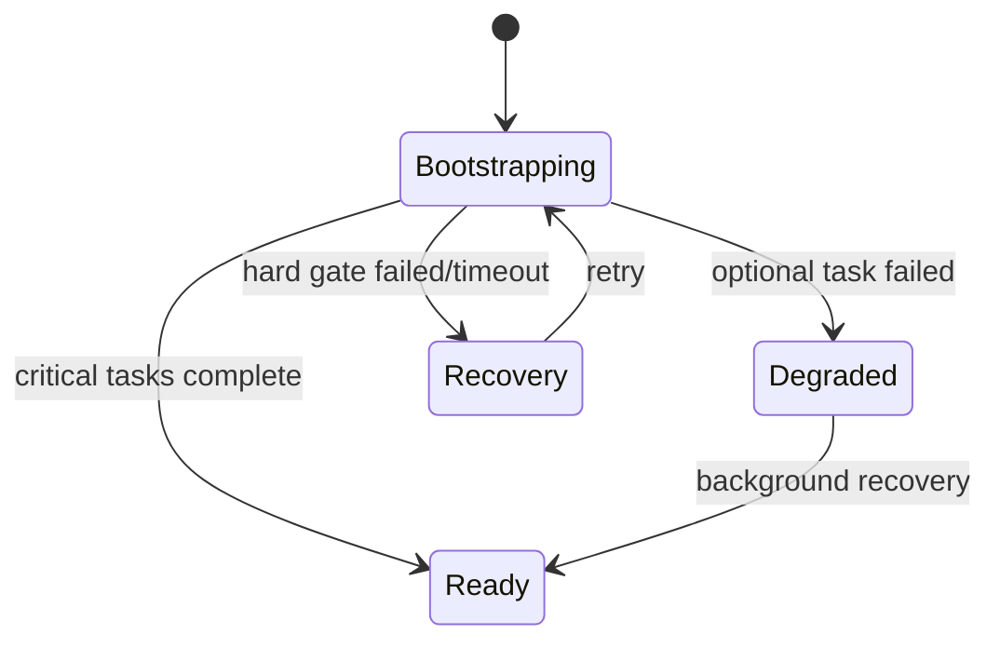

# Flutter 启动性能：从冷启动、TTID/TTFD 到首屏依赖治理

> 启动优化不是把所有初始化移到 `runApp` 之后，而是定义用户何时看到可信界面、何时可以完成核心操作，再用分阶段证据缩短关键路径。

---

## 一、为什么“启动用了 1.8 秒”信息不足

用户点击图标后，可能依次看到：

1. 系统或原生启动画面；
2. Flutter 第一帧骨架；
3. 本地缓存内容；
4. 登录态恢复后的首页；
5. 网络数据和核心按钮可用。

如果只记录“进程创建到 Flutter 第一帧 600 ms”，却让首页继续白屏 3 秒，指标很好看，体验仍然很差。反过来，如果为了等待所有接口而阻止第一帧，系统启动画面会停留过久，用户也无法感知进度。

启动性能首先需要回答：

- 测量从哪个时刻开始？
- 哪一帧算初始显示？
- 什么条件代表核心内容完整？
- 什么条件代表用户可以交互？
- 冷启动、已有进程恢复和页面热打开是否分开统计？
- 首屏因深链、登录态或实验分流不同，是否分别建模？

### 核心结论

1. 冷启动、温启动和热启动是平台与进程状态相关的不同路径，不能混合计算平均值。
2. TTID（Time to Initial Display）关注初始界面出现，TTFD（Time to Full Display）关注业务定义的完整内容；两者起终点必须由团队统一。
3. Flutter 第一帧不等于首屏业务 Ready，更不等于用户已经可以完成核心任务。
4. 启动关键路径通常跨越原生进程、Flutter Engine、插件注册、Dart 初始化、首帧构建和业务依赖。
5. 首帧前只保留显示正确界面所必需的同步工作，非关键 SDK、预取和缓存维护应延迟。
6. 并行初始化只能重叠真正独立的异步等待；同步 CPU 工作不会因 `Future.wait` 自动并行，还可能争抢 I/O 和连接。
7. `deferFirstFrame` 用于暂缓向 Engine 提交 Flutter 首帧，不会让初始化变快，误用会直接拉长 TTID 和启动画面停留。
8. 优化必须在 Profile/Release、目标真机上执行稳定多轮测试，并用线上分位数验证设备和用户分布。
9. 启动优化要同时守住正确性、稳定性、内存和第二帧流畅度，不能只追求一个首帧数字。

---

## 二、先统一启动类型

### 2.1 冷启动

冷启动通常表示应用进程不存在，操作系统需要创建进程，加载原生代码和资源，再初始化 Flutter Engine、Dart Isolate 与首屏。


它通常是成本最高、变量最多的路径，也是最需要分阶段治理的路径。

### 2.2 温启动

温启动通常表示进程还在，但承载页面、Activity、Scene 或部分 UI 状态需要重建。Flutter Engine 是否仍存活取决于应用架构和系统行为。

可能出现：

- Android 进程在、Activity 被重建；
- Add-to-App 宿主在、Flutter 容器重新附着缓存 Engine；
- iOS 进程/Scene 仍在，界面从非活动状态恢复；
- Dart 状态部分保留，业务缓存已存在。

“温启动”不是 Flutter 统一公开状态，应在测试和监控中明确具体前置条件。

### 2.3 热启动

热启动通常表示进程和主要运行时仍在，应用从后台或已有页面状态快速恢复。它不应与开发期的 Hot Reload/Hot Restart 混淆。

热启动仍可能变慢：

- 会话或数据过期后触发刷新；
- 系统回收相机、解码器等资源；
- 首屏 Route 需要重建；
- 大量 Resume 任务同时运行；
- Add-to-App Engine 已缓存但路由尚未 Ready。

### 2.4 Android 与 iOS 不能简单共用定义

Android 常按进程、Activity 与 Task 状态区分冷/温/热路径；iOS 的进程、Scene、系统预热和状态恢复模型不同。操作系统版本也会演进。

跨平台看板应使用统一业务名称，同时记录平台原始上下文：

```text
startup_kind = cold_process | warm_container | hot_resume | add_to_app_cold_engine | add_to_app_warm_engine
platform = android | ios
process_age_ms = ...
engine_reused = true | false
restored_state = true | false
```

不要把所有“用户打开首页”的样本放在同一个分布里。

---

## 三、TTID、TTFD 与可交互时间

### 3.1 TTID

TTID（Time to Initial Display）表示从统一启动起点到初始界面可见。对于 Flutter，可以把终点定义为第一帧非空、稳定、与目标 Route 相符的 Flutter 内容已经呈现。

需要避免：

- 把原生启动画面显示当成 Flutter TTID；
- 第一帧是透明、纯白或错误 Route 也算成功；
- 只使用 Framework “帧已构建”时间，而忽略真正呈现；
- 冷启动和缓存 Engine 混合统计。

### 3.2 TTFD

TTFD（Time to Full Display）表示关键业务内容达到团队定义的完整条件。它不是 Flutter 自动知道的通用时刻，需要业务显式标记。

首页的 TTFD 条件可能是：

- 登录态已判定；
- 顶部导航、核心入口和首屏列表可用；
- 首屏图片可以是占位，但关键文本和交互已就绪；
- 非首屏推荐、广告或埋点不阻塞。

深链到订单详情的 TTFD 条件则不同，不能复用首页定义。

### 3.3 Time to Interactive

首屏看起来完整，不代表交互可响应。建议另记 Time to Interactive（TTI）或业务可交互指标，例如：

- 用户点击核心按钮能被处理；
- 主 Isolate 没有持续长任务；
- 首屏路由和依赖已 Ready；
- 输入、滚动或返回没有被初始化遮挡。

### 3.4 推荐时间线



如果平台无法提供完全相同的 t0，应在数据定义中记录差异，不能伪装成绝对可比。

---

## 四、Flutter 冷启动完整链路

一个简化的纯 Flutter 原生平台启动链路：



这是一条职责级路径。插件注册顺序、AOT 数据装载、线程与 Engine 内部类名会随 Flutter、平台和构建模式变化，源码分析必须注明版本。

### 4.1 原生阶段

可能包含：

- 动态库、Framework 和资源装载；
- Android `Application`、`Activity` 或 iOS App/Scene Delegate；
- 第三方原生 SDK 自动初始化；
- Flutter 容器和 Engine 创建；
- 插件平台侧注册；
- 原生启动画面。

此阶段只看 Dart Timeline 是看不到的，需要 Perfetto、Android Macrobenchmark/Startup Timing、iOS Instruments 或平台 Signpost。

### 4.2 Engine 阶段

可能包含：

- Flutter 运行时和 Renderer 初始化；
- Dart VM/Isolate 环境准备；
- AOT 代码和数据映射；
- 字体、Asset 与平台通道基础设施；
- 插件 Registry 与 Platform View Controller；
- 首次图形上下文相关准备。

纯 Flutter App 通常由 embedding 管理这部分。Add-to-App 可选择冷建、预热、缓存或 EngineGroup，但每种方案有不同内存和所有权成本。

### 4.3 Dart 阶段

从 `main()` 到 `runApp()` 以及首帧前同步工作都位于关键路径：

```dart
Future<void> main() async {
  WidgetsFlutterBinding.ensureInitialized();

  final settings = await settingsStore.readCriticalSettings();
  final session = await sessionStore.readLocalSession();

  runApp(App(settings: settings, session: session));
}
```

如果两个读取并非首帧必需，或者可以让页面以可恢复骨架启动，它们就不应全部阻塞 `runApp`。

### 4.4 首帧阶段

`runApp` 只把根 Widget 附着到 Framework，不代表像素已经上屏。后续还要完成：

- Widget/Element 创建与 Build；
- RenderObject 布局；
- Paint 和 Layer Tree；
- Engine 合成与 Raster；
- 平台呈现。

复杂首屏 Widget、大图同步准备、昂贵布局和首帧 Platform View 都可能延迟实际呈现。

---

## 五、建立启动分段 Trace

优化之前先建立统一阶段：

```text
process_start
native_application_start
engine_create_start / end
dart_entry
critical_bootstrap_start / end
run_app
first_frame_built
first_frame_rasterized/presented
business_content_ready
interactive
```

### 5.1 Dart 自定义阶段

```dart
import 'dart:developer' as developer;

Future<T> traceStartupStep<T>(
  String name,
  Future<T> Function() operation,
) async {
  final task = developer.TimelineTask()..start(name);
  try {
    return await operation();
  } catch (error, stackTrace) {
    task.instant(
      'error',
      arguments: {'type': error.runtimeType.toString()},
    );
    Error.throwWithStackTrace(error, stackTrace);
  } finally {
    task.finish();
  }
}
```

不要把 Token、用户数据、完整 URL 或设备标识写入 Timeline/日志。

### 5.2 启动 Session

每次启动生成 Session ID，原生和 Dart 事件使用同一标识关联：

```text
startup_session_id
startup_kind
app_version / flutter_version
device_tier
route_kind
engine_reused
restoration_used
network_class
```

生产上应采样，并聚合 P50/P90/P95/P99，而不是上报所有高基数字段。

### 5.3 首帧回调的边界

Flutter 提供首帧相关回调和 Frame Timing 能力，但“Framework 已构建”“Engine 已 Raster”“平台已呈现”是不同终点。所选 API 的语义应以当前 Flutter SDK 文档和源码为准。

业务 TTFD 必须由页面自己上报，而且只能完成一次：

```dart
final class StartupMilestone {
  bool _fullDisplayReported = false;

  void reportFullDisplay({required String route}) {
    if (_fullDisplayReported) return;
    _fullDisplayReported = true;
    startupReporter.mark('full_display', fields: {'route': route});
  }
}
```

---

## 六、测量环境与方法

### 6.1 为什么不能用 Debug 模式

Debug 使用开发期 JIT 路径，启用断言、诊断和调试能力，启动特征与生产 AOT 构建不同。应：

- Profile：获取 Timeline 和性能分析；
- Release：验证最终用户产物和线上分布；
- 真机：模拟器不代表存储、CPU、GPU 和进程调度。

### 6.2 冷启动实验要真正冷

每轮测试需要明确：

- 进程是否已终止；
- 系统 Page Cache 是否保留；
- 应用数据是否清空；
- 登录态和业务缓存是否保留；
- 网络是否稳定；
- 设备温度、电量模式和后台负载；
- 测试前是否重启设备。

“杀进程”不等于清除系统文件缓存；清数据又会改变真实回访用户状态。建议建立多个可复现场景，而不是追求一个虚假的“绝对冷”。

### 6.3 工具组合

#### Flutter

```bash
flutter run --profile
flutter run --profile --trace-startup
```

具体参数、输出文件和可用平台可能随 Flutter 版本变化，执行前应查看当前 `flutter run --help`。

结合：

- DevTools Performance/Timeline；
- CPU Profiler；
- Frame Timing；
- 自定义 `TimelineTask`；
- Release 线上启动埋点。

#### Android

- Macrobenchmark 的 Startup 测量；
- Android Studio Profiler；
- Perfetto/System Trace；
- Baseline Profile 与应用启动优化工具；
- `adb shell am start -W` 作为有限参考，而非唯一指标。

平台提供的 Displayed/Fully Drawn 定义与 Flutter 业务里程碑需要对齐。Android API 和工具版本不同，应遵循当前官方文档。

#### iOS

- Instruments App Launch / Time Profiler；
- MetricKit 启动指标；
- `os_signpost` 分阶段；
- XCTest Performance Metrics；
- Organizer 中的线上启动数据。

iOS 系统预热和 Scene 行为会影响样本，必须记录测试条件。

### 6.4 样本与统计

至少报告：

- 样本数；
- P50、P90/P95、P99；
- 设备档位和系统版本；
- 冷/温/热启动比例；
- App/Flutter/插件版本；
- 首屏 Route；
- 异常值处理规则。

平均值会掩盖低端设备与长尾，不适合作为唯一发布门禁。

---

## 七、Engine 初始化如何优化

### 7.1 纯 Flutter App

Engine 由官方 embedding 管理，优化重点通常不是自行绕过初始化，而是：

- 保持 Flutter SDK 和平台构建工具在受支持版本；
- 避免原生 `Application`/AppDelegate 在 Engine 前做大量同步工作；
- 审计自动初始化的第三方 SDK；
- 减少不必要的动态库和原生依赖；
- 使用当前平台推荐的发布优化能力；
- 将首屏不需要的原生能力延迟。

### 7.2 Add-to-App

选择包括：

- 用户点击后冷创建 Engine；
- 原生首屏稳定后预热；
- 高概率入口前预热；
- 缓存单 Engine；
- 多容器使用多个 Engine 或 EngineGroup。



预热不能只看 Flutter 页首帧，还要观察宿主启动回归、内存、CPU、低命中浪费和账号状态清理。

### 7.3 Engine 不是越早创建越好

在原生冷启动关键路径立即预热 Flutter，可能与宿主首页争抢：

- CPU；
- 文件 I/O；
- 动态库加载；
- GPU/图形上下文；
- 网络连接；
- 内存和 GC。

优化一个局部页面不能损害全局启动体验。

---

## 八、插件初始化治理

插件成本可能来自两个方向：

1. 原生注册或 SDK 自动初始化；
2. Dart 首次调用插件时的配置、I/O 和 Channel 往返。

### 8.1 建立插件清单

| 插件/SDK | 原生自动初始化 | 首屏必需 | 可延迟 | 线程/进程要求 |
|---|---:|---:|---:|---|
| Secure Storage | 否/按实现 | 会话判断可能需要 | 部分 | 平台存储 |
| Analytics | 常见 | 通常否 | 是 | 事件先本地排队 |
| Crash Reporting | 常见 | 早期保护有价值 | 部分 | 需尽早但应轻量 |
| Push | 常见 | 通常否 | 是 | Token 可后取 |
| Database | 否 | 本地首屏可能需要 | 视页面 | Schema 迁移 |
| Camera/Media | 否 | 否 | 是 | 权限与设备资源 |

具体行为取决于插件和平台配置，必须从 Manifest、Info.plist、原生入口与插件源码验证。

### 8.2 自动初始化的隐形成本

某些 Android ContentProvider、Startup Initializer 或 iOS SDK Hook 会在 Dart `main` 之前运行。Dart 中“没有调用它”不代表它没有进入启动路径。

治理方式：

- 使用平台 Trace 找到真实耗时；
- 对支持关闭自动初始化的 SDK 改为显式时机；
- 保证错误捕获与降级；
- 不修改第三方初始化顺序而缺少回归测试；
- 记录隐私同意前哪些 SDK 可以启动。

### 8.3 插件注册与业务初始化分离

插件被注册到 Engine，不代表必须立即建立数据库、请求网络或创建重型原生对象。插件 Handler 应轻量，昂贵能力按首次业务需要惰性创建。

多 Engine 下每个 Engine 可能重复注册插件；进程级 SDK 需要原生仲裁层，不能让每个实例重复全局初始化。

---

## 九、Dart 初始化治理

### 9.1 `main()` 中常见阻塞项

- 读取 SharedPreferences/数据库；
- 初始化 DI Container；
- 加载远端配置；
- 获取设备信息；
- 初始化日志、监控和埋点；
- 读取 Token 并刷新会话；
- 加载 Locale/主题；
- JSON 解析和代码生成注册表；
- 扫描文件、迁移缓存；
- 同步 CPU 计算。

先问：第一帧显示正确内容真的需要它吗？

### 9.2 顶层初始化和单例构造

```dart
final expensiveRegistry = buildLargeRegistry();
```

顶层变量在首次访问或库初始化语义下可能进入启动路径，且调用点不明显。重型对象应显式创建、测量并按 Scope 管理，而不是藏在全局变量和 Service Locator 中。

### 9.3 同步 CPU 工作

JSON 解析、解压、加密、规则编译等同步工作会阻塞主 Isolate。处理方式：

- 缩小首屏数据；
- 使用更适合的存储与增量读取；
- 延迟到首帧后；
- 对足够重且可传输的纯计算评估 `Isolate.run`；
- 考虑 Isolate 启动和消息传输成本。

小任务移到 Isolate 可能更慢，必须测量。

### 9.4 `ensureInitialized` 的职责

`WidgetsFlutterBinding.ensureInitialized()` 确保 Widget Binding 可用，适合在 `runApp` 前调用需要 Binding 的插件或 Framework API。它不是“完成 Flutter 全部初始化”的性能魔法，也不会自动并行后续任务。

---

## 十、首屏依赖：建立最小可显示集合

可以把初始化任务分为四类：

| 类别 | 定义 | 示例 |
|---|---|---|
| Hard Gate | 不完成无法安全决定首屏 | 数据库关键迁移、最低配置 |
| Route Gate | 只影响首屏路由 | 本地会话、深链解析 |
| Content Dependency | 影响首屏内容，可渐进展示 | 首页缓存、远端 Feed |
| Non-critical | 不影响首屏正确性 | 埋点上传、预取、非必要 SDK |

### 10.1 启动依赖图



不要把无依赖的任务人为串行，也不要把所有任务都放入 Hard Gate。

### 10.2 登录态首屏

常见策略：

- 本地没有凭据：直接登录页；
- 本地有会话：进入受控启动/首页骨架，同时后台验证；
- 会话明确失效：清理 Session 并登录；
- 网络不可用：根据安全和产品策略使用离线态；
- 深链需要鉴权：保存目标，完成登录后恢复。

不能为了 TTID 永远先显示首页再跳登录，闪屏和数据泄漏比性能数字更糟。

### 10.3 首屏骨架的边界

好的骨架：

- 与最终布局稳定一致；
- 不诱导用户点击不可用按钮；
- 局部数据完成即可渐进展示；
- 有失败、离线和重试状态；
- 不把永久空白算作首帧成功。

骨架是体验设计，不是掩盖无限初始化的工具。

---

## 十一、延迟初始化

延迟初始化把非关键工作移出首帧关键路径。

### 11.1 首帧后启动

```dart
void main() {
  WidgetsFlutterBinding.ensureInitialized();
  runApp(const App());

  WidgetsBinding.instance.addPostFrameCallback((_) {
    unawaited(startDeferredInitialization());
  });
}
```

注意：Post-frame Callback 紧接首帧执行。在其中做大量同步工作会卡住第二帧和首次交互。它只改变时间位置，不创造额外 CPU。

### 11.2 按首次使用惰性初始化

```dart
final class LazySearchIndex {
  LazySearchIndex(this._loader);

  final SearchIndexLoader _loader;
  Future<SearchIndex>? _inFlight;

  Future<SearchIndex> get() {
    return _inFlight ??= _loader.load().catchError((Object error) {
      _inFlight = null;
      throw error;
    });
  }
}
```

Single-flight 防止多个页面同时触发重复初始化；失败后是否允许重试要按错误类型设计。

### 11.3 空闲调度

非关键工作可分批、小块执行，避免首帧后形成长任务。Flutter Scheduler 与平台空闲 API 的具体选择取决于工作类型；后台上传和持久任务不能只依赖 Dart 空闲回调。

### 11.4 延迟的代价

- 成本转移到用户第一次使用功能；
- 初始化失败从启动页转移到业务页；
- 多任务可能在首屏后同时爆发；
- 生命周期和取消更复杂；
- 测试必须覆盖首次使用路径。

延迟初始化要配合预取时机、状态机和错误处理，而不是简单 `Future.delayed`。

---

## 十二、并行初始化

### 12.1 只有独立异步等待才适合并行

```dart
final (settings, session) = await (
  settingsStore.read(),
  sessionStore.read(),
).wait;
```

或使用当前 SDK 支持的 `Future.wait`。两个任务必须：

- 没有先后依赖；
- 不争用同一事务锁；
- 错误可以独立解释；
- 并行不会导致更高峰值内存；
- 都属于当前关键路径。

具体 Record `.wait` 可用性取决于 Dart SDK 版本；需要兼容旧版本时使用 `Future.wait` 并保留类型映射。

### 12.2 `Future.wait` 不会让同步计算并行

```dart
Future<Result> parseLargeFile() async {
  final bytes = await file.readAsBytes();
  return parseSynchronously(bytes); // 仍在当前 Isolate 阻塞
}
```

多个这样的 Future 在同步解析阶段仍共享主 Isolate。真正 CPU 并行需要 Isolate 或平台线程，并支付创建、复制/传输和调度成本。

### 12.3 并行也会变慢

所有 SDK 同时初始化可能争抢：

- 数据库锁；
- 磁盘读取；
- DNS、Socket 和网络带宽；
- CPU 与线程池；
- 内存和 GC；
- 平台主线程。

并行度应有限制，并通过单变量实验验证。

### 12.4 错误与取消

`Future.wait` 某个任务失败，不意味着其他 Future 自动取消。启动协调器必须定义：

- 哪个失败阻止启动；
- 哪个失败可降级；
- 是否等待其他任务清理；
- 如何避免迟到结果覆盖降级状态；
- 应用退出或 Session 切换如何取消。

---

## 十三、启动协调器设计

不要让 `main()` 成为几十行初始化脚本。可把任务建模为带依赖和关键级别的启动计划：

```dart
enum StartupCriticality { hardGate, routeGate, deferred }

abstract interface class StartupTask {
  String get name;
  StartupCriticality get criticality;
  Set<String> get dependencies;
  Future<void> run(StartupContext context);
}
```



协调器应提供：

- 依赖拓扑与循环检查；
- 每阶段 Trace；
- Timeout/Deadline；
- 必需失败与可降级失败；
- Single-flight；
- 幂等和重复启动保护；
- 测试替身；
- 首帧后任务的并发上限。

小项目不需要通用 DAG 框架，但仍应以列表明确哪些任务阻塞首帧。

---

## 十四、`deferFirstFrame` 的正确边界

Flutter Binding 提供 `deferFirstFrame()` 和 `allowFirstFrame()`，用于在 Framework 已运行但某个必要条件尚未满足时，暂缓第一帧发送给 Engine。

```dart
Future<void> main() async {
  final binding = WidgetsFlutterBinding.ensureInitialized();
  binding.deferFirstFrame();

  try {
    final bootstrap = await loadStrictlyRequiredBootstrap()
        .timeout(const Duration(seconds: 2));
    runApp(App(bootstrap: bootstrap));
  } catch (error, stackTrace) {
    logger.error('critical bootstrap failed', error, stackTrace);
    runApp(StartupRecoveryApp(error: error));
  } finally {
    binding.allowFirstFrame();
  }
}
```

### 14.1 适合场景

- 不满足条件就会显示错误主题/Locale 并立即闪变；
- 必须完成极短的状态恢复才能构建正确首帧；
- Add-to-App 需要等待初始路由契约，且宿主有可靠启动画面与超时兜底；
- 截图/测试需要确定性控制首帧。

### 14.2 不适合场景

- 等待首页所有网络接口；
- 初始化埋点、广告、推送等非关键 SDK；
- 希望“提升首帧性能分数”；
- 没有 Timeout 和失败 UI；
- 仅为隐藏架构问题。

`deferFirstFrame` 不会减少工作量，只是延后 Flutter 首帧。移动端原生启动画面通常会继续停留，因此长时间 defer 会直接恶化 TTID。

### 14.3 必须成对与兜底

- `allowFirstFrame()` 放在 `finally`；
- 必需任务有短 Timeout；
- 失败时显示可恢复 Flutter 页面；
- 建立首帧 Watchdog；
- 避免多个模块各自 defer 而难以配对；
- 当前 SDK 对嵌套 defer/allow 的语义应查官方文档和源码。

---

## 十五、启动画面与首帧切换

启动画面的职责是覆盖系统创建进程到 Flutter 首帧的空窗，不是实现复杂业务加载页。

### 15.1 常见问题

- 原生 Splash 背景与 Flutter 首帧颜色不同，发生闪白；
- Logo 尺寸或位置跳变；
- Android 版本的系统 Splash 规范未适配；
- iOS Launch Screen 放动态逻辑或虚假进度；
- 首帧透明导致启动画面退出后黑屏；
- Flutter 第一帧是错误 Route，随后跳转。

### 15.2 平滑切换

- 原生 Splash 与 Flutter 首帧共享颜色和品牌布局；
- Flutter 第一帧必须非空且可解释；
- 必需数据未完成时显示稳定骨架/恢复页；
- 图片按实际显示尺寸准备，避免首帧解码超大资源；
- 不用固定延时保留 Splash；
- 用真实首帧信号结束，而不是猜测时间。

启动画面停留更久可能掩盖白屏，却不会改善实际启动性能。

---

## 十六、首屏 Widget 与渲染优化

首帧 Build、Layout、Paint 和 Raster 都可能成为瓶颈。

### 16.1 常见问题

- 根 Widget 一次创建庞大页面树；
- 首屏使用 `shrinkWrap` 长列表或 Intrinsic 测量；
- 同时解码多张超大图片；
- 首帧创建 WebView/地图 Platform View；
- 复杂 Clip、Opacity、Blur 和 `saveLayer`；
- 同步解析大量富文本；
- 首帧状态更新触发多轮无效重建；
- 首次 Shader/渲染路径成本。

### 16.2 优化原则

- 只构建首个视口内容，列表惰性创建；
- 图片按布局尺寸 x DPR 获取和解码；
- 非首屏 Tab 延迟创建；
- Platform View 按需加载并显示轻量占位；
- 复杂派生数据在状态边界计算；
- 控制首屏 Rebuild 与 Layout 次数；
- 用 Frame Chart 区分 UI 与 Raster；
- Skia/Impeller 和 Shader 结论按当前平台与 Flutter 版本验证。

不要把普通 Rebuild 当成唯一问题。首帧慢可能在原生主线程、Dart UI、Raster、图片解码或 GPU。

---

## 十七、首屏网络与缓存

网络不应默认阻塞 TTID，但可能决定 TTFD。

### 17.1 推荐模式



需要定义：

- 缓存 TTL 与新鲜度；
- 用户/租户隔离；
- Schema 迁移；
- 无缓存和离线状态；
- 远端失败是否保留旧数据；
- 多请求优先级和并发上限；
- Token 刷新是否形成启动瀑布流。

### 17.2 避免串行瀑布

错误链路：

```text
remote config -> token refresh -> profile -> feature flags -> home feed -> images
```

先分析真实依赖。Feature Flag 是否已有本地快照？Profile 与 Feed 是否可并行？图片是否可在文本内容后加载？Token 是否可以预刷新或 single-flight？

并行前仍需控制连接、流量和低端设备压力。

### 17.3 深链首屏

冷启动深链可能需要：

- URI 解析与安全校验；
- 本地会话判断；
- 登录后恢复目标；
- 路由能力和版本校验；
- 详情缓存/网络；
- 目标不存在或权限不足的兜底。

深链是独立启动 Route，应有自己的 TTID/TTFD，不应被首页指标掩盖。

---

## 十八、第二帧与首次交互

常见“首帧优化”错误是把所有任务移到首帧后立即执行：

```dart
WidgetsBinding.instance.addPostFrameCallback((_) {
  initializeAnalyticsSynchronously();
  parseLargeCacheSynchronously();
  prewarmAllTabs();
});
```

首帧数字变快，但用户第一次滚动或点击严重卡顿。

### 18.1 首帧后任务分批

```text
first frame
  -> critical content request
  -> core interaction ready
  -> low-cost telemetry init
  -> nearby route prefetch
  -> maintenance / cleanup when idle
```

需要为每批设置：

- 优先级；
- 并发上限；
- Deadline；
- 页面/Session 取消；
- 内存预算；
- 错误是否影响用户。

### 18.2 输入延迟

启动期间监控首个 Tap、Scroll 或 Text Input 的响应延迟。TTID 很低但主 Isolate 随后被 500 ms 同步任务占满，不是成功的启动优化。

---

## 十九、常见优化案例

假设冷启动 P95 为 3.2 秒，阶段数据如下：

| 阶段 | P95 |
|---|---:|
| 原生进程与 SDK | 650 ms |
| Engine + 插件注册 | 700 ms |
| Dart `main` 到 `runApp` | 900 ms |
| 首帧 Build/Raster | 250 ms |
| 首屏内容 Ready | 700 ms |

分析发现：

- Dart `main` 串行等待远端配置、推送 Token 和本地会话；
- 远端配置已有可用本地快照；
- 推送 Token 不影响首屏；
- 首页一次构建三个离屏 Tab；
- 原生广告 SDK 自动初始化但首屏不使用。

改造：

1. 本地会话作为 Route Gate。
2. 远端配置读取本地快照，网络刷新移到首帧后。
3. 推送和广告 SDK 延迟到核心交互 Ready 后。
4. 非当前 Tab 惰性创建。
5. 原生 SDK 关闭自动初始化并验证隐私/功能回归。
6. 每项单独 A/B，观察 TTID、TTFD、TTI、Crash 和内存。

不能直接声称会优化多少毫秒；收益取决于设备、系统、缓存和 SDK 版本，必须复测。

---

## 二十、性能预算与 CI 回归

### 20.1 预算示例

```text
Cold TTID P50 / P95
Cold TTFD P50 / P95
Hot Resume P95
First Interaction Delay P95
Startup Crash Rate
Blank First Frame Rate
Startup Memory Peak
```

阈值由产品、设备档位和历史基线决定，不应照搬其他应用数据。

### 20.2 CI 与实验室测试

- 固定真实设备或受控设备池；
- 每次构建多轮冷启动；
- 分离首次安装和回访缓存场景；
- 保存 Trace Artifact；
- 与基线版本比较分布；
- 超阈值阻断或告警；
- 对高噪声指标设置统计规则，避免单样本误报。

### 20.3 线上验证

实验室无法覆盖所有设备、存储老化、账号数据和网络。线上按：

- 设备档位；
- OS 版本；
- App 版本；
- 冷/温/热类型；
- 首屏 Route；
- 新安装/升级/回访；
- 实验组；

观察分位数和失败率。发布采用灰度，异常可通过远端配置关闭非关键启动任务。

---

## 二十一、启动稳定性与兜底

启动优化不能牺牲可恢复性。

### 21.1 启动状态机



### 21.2 Watchdog

监控：

- 原生容器出现后 Flutter 首帧超时；
- Dart 入口没有 Ready 信号；
- `deferFirstFrame` 未释放；
- TTFD 超过业务阈值；
- 启动任务死锁或数据库迁移超时。

超时后应：

- 记录当前阶段和版本；
- 展示可恢复页面或原生兜底；
- 提供有限重试；
- 避免无限重启循环；
- 允许远端关闭问题功能；
- 不上传敏感启动数据。

### 21.3 数据迁移

数据库 Schema 迁移可能是真正 Hard Gate。应：

- 在历史 Schema 快照上自动测试；
- 迁移事务化；
- 大型数据变换考虑分阶段或兼容读；
- 失败有备份、重建或降级策略；
- 记录版本和耗时；
- 不在每次启动重复扫描全库。

---

## 二十二、常见误区与修复

### 22.1 只优化 `main()`

**问题：** 原生 SDK、Engine、插件、首帧 Raster 和业务内容也在启动链路。

**修复：** 建立跨原生、Engine、Dart、首帧和业务 Ready 的统一 Trace。

### 22.2 第一帧越早越好

**问题：** 透明、错误 Route 或不可交互空壳没有用户价值。

**修复：** 同时治理 TTID、TTFD、TTI 和空白首帧率。

### 22.3 所有初始化都 `Future.wait`

**问题：** 有依赖的任务并行会错误，同步 CPU 工作不并行，还会争抢资源。

**修复：** 建依赖图，只并行独立异步等待并限制并发。

### 22.4 所有任务移到首帧后

**问题：** 第二帧和首次交互卡顿。

**修复：** 按优先级分批，重型同步工作拆分、延迟或移到 Isolate。

### 22.5 用 `deferFirstFrame` 等待接口

**问题：** 原生启动画面停留，TTID 直接变长，弱网可能永久卡住。

**修复：** 仅等待极短 Hard Gate，并设置 Timeout、Recovery UI 和 finally 释放。

### 22.6 Engine 预热一定提升 App 启动

**问题：** 预热可能与宿主首屏争抢 CPU、I/O 和内存。

**修复：** 同时测宿主启动、Flutter 页面点击到首帧、命中率和内存。

### 22.7 Debug 模式测启动

**问题：** JIT、断言和调试服务不代表生产 AOT。

**修复：** Profile 分析、Release 验证、线上分位数确认。

### 22.8 只看平均值

**问题：** 低端设备和长尾被掩盖。

**修复：** 分设备、路径和启动类型观察 P50/P95/P99。

### 22.9 启动画面多停一秒就没有白屏

**问题：** 只是隐藏延迟，还可能让启动更慢。

**修复：** 对齐 Splash 与首帧视觉，并用真实首帧信号切换。

### 22.10 延迟初始化不需要错误处理

**问题：** 错误被推迟到用户首次使用时，可能更难恢复。

**修复：** 惰性任务也要状态机、Single-flight、Timeout、重试和降级。

---

## 二十三、测试与验证矩阵

### 23.1 启动类型

- 首次安装冷启动；
- 普通回访冷启动；
- 升级后首次启动；
- 温启动/容器重建；
- 热恢复；
- Add-to-App 冷 Engine/热 Engine；
- 进程终止后的状态恢复。

### 23.2 首屏路径

- 未登录首页；
- 已登录首页；
- 冷启动深链；
- Token 过期；
- 离线但有缓存；
- 离线且无缓存；
- 数据迁移；
- 远端配置失败；
- 低内存和存储空间不足。

### 23.3 设备与环境

- Android/iOS 最低支持和主流版本；
- 低、中、高设备档位；
- 不同存储占用和数据规模；
- 网络类型、延迟和失败；
- 60/90/120 Hz 屏幕；
- 冷设备与热设备；
- Release 签名和真实资源。

### 23.4 正确性检查

- 首帧不是白屏/透明帧；
- Splash 到首帧无明显跳变；
- 深链不会先闪错误首页；
- 用户数据不跨账号；
- `deferFirstFrame` 异常路径能释放；
- 延迟 SDK 首次使用可恢复；
- 启动任务不会重复执行；
- 首次交互无长时间阻塞。

---

## 二十四、落地步骤

1. 统一冷、温、热与 Add-to-App 启动类型。
2. 为每个首屏 Route 定义 TTID、TTFD 和 TTI 终点。
3. 打通原生进程、Engine、Dart、首帧与业务 Ready 的 Trace。
4. 在 Profile/Release 真机采集多轮基线和分位数。
5. 列出原生 SDK、插件和 Dart 初始化任务，标记 Hard Gate/Route Gate/Deferred。
6. 移除首帧前不必要的同步 I/O 与 CPU 工作。
7. 对独立异步任务有限并行，对重计算评估 Isolate。
8. 首屏使用可信骨架和本地快照，网络数据渐进加载。
9. 谨慎使用 `deferFirstFrame`，补齐 Timeout、finally 和 Watchdog。
10. 将首帧后任务分批，监控第二帧与首次输入延迟。
11. 建立实验室 CI 预算和线上灰度看板。
12. 每次优化做单变量复测，同时观察 Crash、内存、业务正确性和转化。

---

## 二十五、总结

Flutter 启动性能真正需要记住的是：

- 冷、温、热启动路径不同，必须分组统计并记录 Engine 是否复用。
- TTID 代表可信初始界面，TTFD 代表业务完整内容，TTI 代表核心交互可用。
- 完整链路跨越系统进程、原生入口、Engine、插件、Dart、Build/Raster 和业务依赖。
- Dart `main` 只是启动链路的一段，原生自动初始化和首帧 Raster 同样可能是瓶颈。
- 首屏依赖应分为 Hard Gate、Route Gate、Content Dependency 和 Non-critical。
- 延迟初始化会把成本转移到后续，必须分批、可取消、可失败并接受首次使用测试。
- `Future.wait` 只重叠独立异步等待，不会让同步 CPU 工作自动并行。
- `deferFirstFrame` 只延后提交首帧，必须短时、成对、有 Timeout 和恢复 UI。
- Engine 预热用内存和全局资源换局部首帧，需要同时测宿主启动和命中率。
- 首帧后立即堆积重任务会损害第二帧和首次交互，不能算成功优化。
- 最终结论来自 Profile/Release 真机 Trace、实验室回归和线上 P95/P99，而不是 Debug 手感。

---

## 问答复盘

### Q1：冷启动和热启动的核心区别是什么？

**答：** 冷启动需要创建进程并初始化原生与 Flutter 运行时；热启动通常复用现有进程和主要状态。具体定义仍要结合 Android/iOS 与 Engine 是否存活。

### Q2：Flutter 第一帧、TTID 和 TTFD 是同一个指标吗？

**答：** 不是。第一帧是技术里程碑；TTID 应代表可信初始界面可见；TTFD 是业务定义的关键内容完整。三者终点可能不同。

### Q3：为什么不能只看平均启动时间？

**答：** 平均值会掩盖低端设备、升级迁移和异常网络造成的长尾。应按启动类型、设备和 Route 观察 P50、P95/P99。

### Q4：把任务移到 `addPostFrameCallback` 是否就完成了优化？

**答：** 没有。任务会紧接首帧执行，重型同步工作会卡住第二帧和首次交互。仍需分批、限并发或移出主 Isolate。

### Q5：`Future.wait` 为什么不一定缩短启动？

**答：** 它只重叠异步等待。同步计算仍在同一 Isolate，任务还可能争用磁盘、数据库锁、网络和平台主线程，反而增加峰值竞争。

### Q6：什么时候适合使用 `deferFirstFrame`？

**答：** 只有极短且不完成就无法显示正确首帧的 Hard Gate，例如必要状态恢复。必须设置 Timeout、失败 UI，并在 `finally` 调用 `allowFirstFrame`。

### Q7：Engine 预热是否一定改善启动性能？

**答：** 不一定。它可能缩短 Flutter 页面打开时间，却拖慢原生宿主冷启动并增加内存。需要按入口命中率和端到端指标验证。

### Q8：插件没有在 Dart `main` 中调用，是否就不会影响启动？

**答：** 不一定。原生 SDK 可能通过 Android Initializer/ContentProvider 或 iOS 入口自动初始化，必须用平台 Trace 和配置检查确认。

### Q9：首屏显示骨架后是否可以立即上报 TTFD？

**答：** 只有骨架本身满足团队定义的“完整业务内容”才可以，通常它只适合 TTID。TTFD 应在核心内容与交互达到约定条件时上报。

### Q10：如何证明一次启动优化真正有效？

**答：** 在相同真机、构建模式和场景做单变量多轮对比，再观察线上同设备分层的 TTID/TTFD/TTI 分位数，同时确认 Crash、内存和业务正确性无回归。

---

## 延伸知识

- Flutter 应用启动流程：Binding、`runApp`、首帧调度与 Raster。
- Dart 运行时：AOT Snapshot、Isolate 与对象初始化。
- Flutter 性能优化：Frame Chart、内存、图片与 Shader。
- 客户端 Trace：启动 Session、Span、SLO 与灰度治理。
- Add-to-App：Engine 预热、缓存、路由和多 Engine。
- 应用生命周期：冷启动恢复、前后台与 State Restoration。
