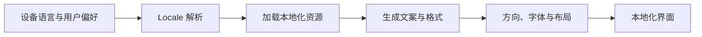
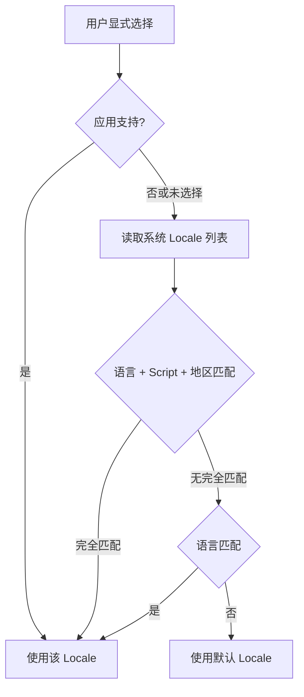

# Flutter 国际化与本地化：从 ARB 到多语言工程治理

> 国际化不是把中文字符串翻译成英文，而是让应用能够正确处理不同语言、地区、复数规则、日期、数字、货币、书写方向和文化习惯。

---

## 一、国际化与本地化

两个概念经常被混用：

| 概念 | 英文 | 含义 |
|---|---|---|
| 国际化 | Internationalization，i18n | 让产品具备适配不同语言和地区的能力 |
| 本地化 | Localization，l10n | 针对具体 Locale 提供翻译、格式和资源 |

数字来自英文单词中首尾字母之间的字符数量：Internationalization 中有 18 个字符，Localization 中有 10 个字符。

一套完整的国际化方案至少需要处理：

- 文本翻译。
- 语言和地区选择。
- 复数与性别规则。
- 日期、时间、数字、百分比和货币。
- 从右到左书写方向。
- 文案长度变化。
- 字体与字形覆盖。
- 动态切换和持久化。
- 翻译资源校验与自动化测试。



---

## 二、理解 Locale

`Locale` 用于描述语言和地区偏好，常见组成包括：

```text
languageCode[-scriptCode][-countryCode]
```

例如：

- `en`：英语。
- `en-US`：美国英语。
- `en-GB`：英国英语。
- `zh-CN`：中国大陆中文。
- `zh-Hant-TW`：繁体字、台湾地区中文。

语言、书写体系和地区表达的是不同维度。只比较 `languageCode` 可能无法区分简体中文与繁体中文，也无法处理同一种语言在不同地区的日期、货币和拼写差异。

在 Dart 代码中：

```dart
const Locale english = Locale('en');
const Locale simplifiedChinese = Locale('zh', 'CN');
const Locale traditionalChinese = Locale.fromSubtags(
  languageCode: 'zh',
  scriptCode: 'Hant',
  countryCode: 'TW',
);
```

### Locale 不是翻译文件名

Locale 是用户语言和地区偏好的结构化表达。翻译文件、日期格式和布局方向都应围绕同一 Locale 解析结果工作，避免各模块分别判断语言字符串。

---

## 三、Flutter 本地化系统

Flutter 本地化主要由以下对象协作：

| 对象 | 职责 |
|---|---|
| `Localizations` | 在 Widget Tree 中提供当前 Locale 和资源对象 |
| `LocalizationsDelegate` | 判断支持范围并异步加载本地化资源 |
| `supportedLocales` | 声明应用支持的 Locale |
| `locale` | 主动指定当前应用 Locale |
| `localeResolutionCallback` | 将设备偏好解析为应用支持的 Locale |

MaterialApp 会使用这些配置建立本地化环境：

```dart
MaterialApp(
  onGenerateTitle: (context) => AppLocalizations.of(context).appTitle,
  localizationsDelegates: AppLocalizations.localizationsDelegates,
  supportedLocales: AppLocalizations.supportedLocales,
  home: const HomePage(),
)
```

`AppLocalizations` 由 Flutter 的本地化代码生成工具产生。

`Localizations` 本质上是依赖传播节点。读取 `AppLocalizations.of(context)` 的 Widget 会依赖当前本地化资源，Locale 变化后相关子树能够更新。

---

## 四、使用 `gen_l10n` 和 ARB

### 4.1 配置生成

在 `pubspec.yaml` 中启用代码生成：

```yaml
flutter:
  generate: true
```

添加基础国际化依赖：

```yaml
dependencies:
  flutter:
    sdk: flutter
  flutter_localizations:
    sdk: flutter
  intl: any
```

建议在 `l10n.yaml` 中明确生成规则：

```yaml
arb-dir: lib/l10n
template-arb-file: app_en.arb
output-localization-file: app_localizations.dart
nullable-getter: false
untranslated-messages-file: build/untranslated_messages.json
```

具体配置项可能随 Flutter SDK 演进，应以项目当前 SDK 的官方文档为准。

### 4.2 ARB 文件

ARB 是基于 JSON 的本地化资源格式。

英文模板 `lib/l10n/app_en.arb`：

```json
{
  "@@locale": "en",
  "appTitle": "Shop",
  "welcomeUser": "Welcome, {name}",
  "@welcomeUser": {
    "description": "Greeting shown on the home page",
    "placeholders": {
      "name": {
        "type": "String",
        "example": "Taylor"
      }
    }
  }
}
```

中文资源 `lib/l10n/app_zh.arb`：

```json
{
  "@@locale": "zh",
  "appTitle": "商城",
  "welcomeUser": "欢迎，{name}"
}
```

代码中使用：

```dart
final l10n = AppLocalizations.of(context);

Text(l10n.welcomeUser(user.displayName));
```

### Key 命名

推荐按语义命名：

```text
checkoutSubmitOrder
profileDeleteAccountTitle
networkErrorRetry
```

避免：

```text
text1
buttonLabel
helloString
```

Key 应描述业务语义，而不是当前英文内容或视觉位置。相同英文在不同上下文中可能需要不同翻译。

### Metadata

`@key` Metadata 应说明：

- 文案出现在哪里。
- 对用户表达什么含义。
- 占位符类型和示例。
- 是否有长度或语气限制。

上下文越清晰，翻译质量越稳定。

---

## 五、占位符、复数与选择规则

### 5.1 占位符

不要使用字符串拼接构造句子：

```dart
// 错误：其他语言的语序可能不同
Text('Welcome ' + user.name);
```

应让翻译资源决定完整语序：

```json
{
  "welcomeUser": "Welcome, {name}"
}
```

### 5.2 复数

不同语言的复数规则并不只是“1 和其他”。应该使用 ICU Message Format：

```json
{
  "cartItems": "{count, plural, =0{Your cart is empty} =1{1 item} other{{count} items}}",
  "@cartItems": {
    "placeholders": {
      "count": {
        "type": "int"
      }
    }
  }
}
```

使用：

```dart
Text(l10n.cartItems(cart.items.length));
```

翻译人员可以根据目标语言重新定义类别和句式，业务代码不需要判断 `count == 1`。

### 5.3 Select

需要根据枚举选择文案时，可使用 Select 语义：

```json
{
  "orderStatus": "{status, select, pending{Pending} paid{Paid} shipped{Shipped} other{Unknown}}"
}
```

未知值必须有 `other` 兜底。对人物性别等敏感属性，应先确认业务确实需要区分，并允许未知或不公开状态。

---

## 六、日期、数字与货币

本地化格式不能通过字符串替换完成。不同 Locale 在分隔符、顺序、货币位置和数字分组上都可能不同。

```dart
import 'package:intl/intl.dart';

String formatOrderSummary({
  required Locale locale,
  required DateTime createdAt,
  required num amount,
  required String currencyCode,
}) {
  final localeName = locale.toLanguageTag();
  final date = DateFormat.yMMMd(localeName).format(createdAt.toLocal());
  final money = NumberFormat.simpleCurrency(
    locale: localeName,
    name: currencyCode,
  ).format(amount);

  return '$date · $money';
}
```

### 必须区分的概念

- Locale 决定展示规则。
- Currency Code 决定货币类型。
- Time Zone 决定时间对应的本地时刻。

用户选择中文界面，不代表金额一定使用人民币；用户身处中国，也不代表订单时间应该强制转换为北京时间。Locale、货币和时区需要由业务分别确定。

### 金额不要使用浮点数直接计算

货币格式化负责展示，不负责修复金额精度。金额计算应使用最小货币单位整数、十进制定点类型或可靠的 Money 类型。

```dart
final int amountInCents = 1099;
final num displayAmount = amountInCents / 100;
```

---

## 七、Locale 解析

设备可能提供多个语言偏好，而应用只支持其中一部分。解析过程应尽量选择最接近的支持项，并提供稳定兜底。



自定义解析示例：

```dart
Locale resolveLocale(
  List<Locale>? preferredLocales,
  Iterable<Locale> supportedLocales,
) {
  final supported = supportedLocales.toList(growable: false);

  for (final preferred in preferredLocales ?? const <Locale>[]) {
    for (final candidate in supported) {
      if (candidate.languageCode == preferred.languageCode &&
          candidate.scriptCode == preferred.scriptCode &&
          candidate.countryCode == preferred.countryCode) {
        return candidate;
      }
    }

    for (final candidate in supported) {
      if (candidate.languageCode == preferred.languageCode) {
        return candidate;
      }
    }
  }

  return supported.first;
}
```

这是简化示例。生产项目还要确定 Script 优先级、地区回退和产品默认语言。若 Flutter 默认解析逻辑已经满足需求，不应无理由重写。

---

## 八、动态切换语言

应用可以使用系统 Locale，也可以允许用户显式选择。

```dart
class LocaleController extends ChangeNotifier {
  Locale? _locale;

  Locale? get locale => _locale;

  void followSystem() {
    if (_locale == null) return;
    _locale = null;
    notifyListeners();
  }

  void select(Locale locale) {
    if (_locale == locale) return;
    _locale = locale;
    notifyListeners();
  }
}
```

接入应用根节点：

```dart
ListenableBuilder(
  listenable: localeController,
  builder: (context, child) {
    return MaterialApp(
      locale: localeController.locale,
      localizationsDelegates: AppLocalizations.localizationsDelegates,
      supportedLocales: AppLocalizations.supportedLocales,
      home: child,
    );
  },
  child: const HomePage(),
)
```

### 状态语义

建议使用两种明确状态：

- `null`：跟随系统。
- 具体 Locale：用户显式选择。

用户选择应持久化。启动时读取失败或保存的 Locale 已不再支持，应回退到系统解析，而不是导致应用无法启动。

切换 Locale 会更新根部 `Localizations`，依赖本地化资源的子树会重新构建。不要通过重启应用实现语言切换。

---

## 九、RTL 与方向适配

阿拉伯语、希伯来语等语言通常从右向左书写。Flutter 会通过当前 Locale 提供 `Directionality`，但组件仍需使用方向感知属性。

### 使用方向属性

优先使用：

- `EdgeInsetsDirectional.start/end`
- `AlignmentDirectional.centerStart`
- `BorderRadiusDirectional`
- `PositionedDirectional`
- `TextAlign.start/end`

避免把“左”直接等同于“开始”：

```dart
Padding(
  padding: const EdgeInsetsDirectional.only(
    start: 16,
    end: 8,
  ),
  child: const Text(
    'Title',
    textAlign: TextAlign.start,
  ),
)
```

### 哪些内容不应镜像

并非所有视觉元素都需要跟随 RTL 镜像，例如：

- 品牌 Logo。
- 播放和暂停图标。
- 地图方向。
- 图表时间轴，取决于业务语义。
- 某些通用符号。

方向适配应基于语义，而不是对整张界面做机械水平翻转。

---

## 十、文案长度、字体与布局

同一文案在不同语言中的长度差异可能非常大。固定宽度和固定高度是国际化界面最常见的问题。

### 布局原则

- 允许文本换行。
- 按约束设计，而不是按某一种语言像素宽度设计。
- 谨慎使用固定高度。
- 按业务决定省略、滚动或换行。
- 按钮文案过长时调整布局，而不是盲目缩小字号。
- 与动态字体一起测试。

```dart
Row(
  children: [
    const Icon(Icons.info_outline),
    const SizedBox(width: 8),
    Expanded(
      child: Text(
        l10n.accountSecurityDescription,
        maxLines: 3,
        overflow: TextOverflow.ellipsis,
      ),
    ),
  ],
)
```

### 字体

- 确认字体覆盖目标语言字形。
- 设计合理的字体回退序列。
- 注意不同字体的基线、字高和视觉重量。
- 大型 CJK 字体可能显著增加包体。
- 字体子集化需要保证实际语言覆盖，不能只根据英文字符裁剪。

---

## 十一、本地化资源工程治理

### 11.1 单一事实来源

翻译资源应有明确的单一事实来源，例如代码仓库中的 ARB，或翻译平台同步后的受控产物。避免设计稿、表格、代码和后台分别维护多份文案。

### 11.2 翻译流程


### CI 建议检查

- ARB 是否为合法 JSON。
- 各语言是否缺失 Key。
- 占位符名称和类型是否一致。
- 是否存在未翻译文案。
- 是否出现废弃 Key。
- 生成代码是否与资源同步。
- 禁止新增硬编码用户可见字符串。

### 11.3 Key 生命周期

- 修改 Key 语义时应创建新 Key，避免旧翻译被错误复用。
- 删除功能时清理废弃 Key。
- 同一文案在不同业务语境中应使用独立 Key。
- 不把服务端动态内容强行复制到客户端 ARB。

### 11.4 服务端文案

服务端返回错误时，推荐返回稳定错误码，由客户端映射为本地化文案：

```json
{
  "code": "inventory_insufficient",
  "details": {
    "available": 2
  }
}
```

客户端使用错误码和参数生成文案。直接展示服务端自然语言会造成语言不一致、不可审校和无法离线处理。

如果内容必须由服务端本地化，应明确 Locale 传递、缓存隔离、回退和服务端翻译治理。

---

## 十二、测试国际化

### 12.1 Widget Test

```dart
testWidgets('shows Chinese checkout label', (tester) async {
  await tester.pumpWidget(
    const MaterialApp(
      locale: Locale('zh'),
      localizationsDelegates: AppLocalizations.localizationsDelegates,
      supportedLocales: AppLocalizations.supportedLocales,
      home: CheckoutPage(),
    ),
  );

  expect(find.text('提交订单'), findsOneWidget);
});
```

### 12.2 RTL Test

```dart
testWidgets('uses RTL direction for Arabic', (tester) async {
  await tester.pumpWidget(
    const MaterialApp(
      locale: Locale('ar'),
      localizationsDelegates: AppLocalizations.localizationsDelegates,
      supportedLocales: AppLocalizations.supportedLocales,
      home: ProfilePage(),
    ),
  );

  final context = tester.element(find.byType(ProfilePage));
  expect(Directionality.of(context), TextDirection.rtl);
});
```

### 测试矩阵

至少覆盖：

- 默认语言。
- 最长文案语言。
- RTL 语言。
- CJK 语言。
- 不同地区的日期、货币。
- 0、1、2 和大数量复数。
- 最大动态字体。
- 小屏和大屏。
- 语言动态切换。
- 设备 Locale 不受支持时的回退。

Golden Test 可发现换行、截断和方向问题，但需要固定字体、平台和渲染环境。

---

## 十三、性能与包体

国际化也有性能和体积成本：

- 大量翻译资源增加包体。
- 多套字体尤其是 CJK 字体可能显著增加体积。
- 复杂 DateFormat/NumberFormat 可复用，避免在高频 `build()` 中重复创建。
- 语言切换可能触发较大范围重建。
- 动态下载语言包需要完整性、版本和离线策略。

不要在没有数据时提前构建复杂的动态语言包系统。先用 App Size Tool 确认资源占比，再决定字体子集、资源拆分或延迟加载。

---

## 十四、常见误区

### 误区一：国际化就是维护多份字符串

还需要处理复数、格式、RTL、字体、布局、资源流程和测试。

### 误区二：用 `count == 1` 处理所有复数

不同语言具有不同复数类别。应使用 ICU 复数规则，让翻译资源决定表达。

### 误区三：当前语言是中文，货币就一定是人民币

Locale、货币和时区是不同业务维度，必须分别确定。

### 误区四：RTL 只需要把 Row 反转

方向还涉及 Padding、Alignment、图标、文本、动画和手势语义；也不是所有内容都应该镜像。

### 误区五：直接展示服务端错误消息最省事

这会导致语言混杂、不可审校和无法离线。应优先使用稳定错误码在客户端本地化。

### 误区六：所有 Locale 只比较 languageCode

Script 和地区会影响字形、格式和用词，只比较语言无法覆盖所有本地化需求。

---

## 十五、落地清单

### 资源与代码

- [ ] 使用 `gen_l10n` 生成类型安全本地化 API。
- [ ] ARB Key 使用稳定业务语义命名。
- [ ] Metadata 包含场景、描述和占位符信息。
- [ ] 复数和 Select 使用 ICU 规则。
- [ ] 禁止拼接可翻译句子。

### 界面

- [ ] 使用 Directional 布局属性。
- [ ] 支持文本换行和长度变化。
- [ ] 与动态字体一起验证。
- [ ] 字体覆盖全部目标语言。
- [ ] 明确哪些图标和内容需要 RTL 镜像。

### 工程治理

- [ ] Locale 解析具有稳定回退规则。
- [ ] 用户语言选择持久化并允许跟随系统。
- [ ] CI 校验缺失翻译和占位符一致性。
- [ ] 测试最长语言、RTL、CJK 和格式规则。
- [ ] 翻译资源、字体和生成代码纳入包体分析。

---

## 十六、总结

Flutter 国际化可以归纳为五个层次：

1. **Locale**：正确表达语言、书写体系和地区。
2. **资源**：使用 ARB 和 `gen_l10n` 生成类型安全 API。
3. **规则**：处理复数、选择、日期、数字和货币。
4. **界面**：适配 RTL、文案长度、字体和动态字号。
5. **治理**：建立翻译、校验、测试和资源发布流程。

最重要的原则是：

> 把语言和地区差异建模为系统能力，而不是散落在 Widget 中的字符串判断。

---

## 十七、问答复盘

### Q1：国际化和本地化有什么区别？

**答：** 国际化是让产品具备适配不同语言和地区的能力，本地化是为某个具体 Locale 提供翻译、格式和资源。

### Q2：为什么不能通过字符串拼接生成翻译句子？

**答：** 不同语言的语序和语法不同。完整句子应由翻译资源决定，占位符只传递动态值。

### Q3：复数为什么不能只判断 `count == 1`？

**答：** 不同语言具有 zero、one、two、few、many、other 等不同规则，应使用 ICU Message Format 由本地化系统选择。

### Q4：Locale 能否直接决定货币和时区？

**答：** 不能。Locale 决定展示习惯，货币和时区属于独立业务数据，需要分别确定。

### Q5：语言切换为什么会引发 Widget 重建？

**答：** 根部 Localizations 的 Locale 和资源发生变化，依赖本地化资源的 Element 会收到依赖更新并重新 Build。

### Q6：RTL 适配时为什么优先使用 `start` 和 `end`？

**答：** `start`、`end` 会根据 TextDirection 自动映射到左右，使同一布局同时适配 LTR 与 RTL。

### Q7：服务端业务错误应该如何本地化？

**答：** 服务端返回稳定错误码和结构化参数，客户端根据当前 Locale 映射文案。不要直接展示未经治理的服务端自然语言消息。

### Q8：国际化测试最容易遗漏什么？

**答：** 最长文案、RTL、动态字体、复数边界、地区格式和不支持 Locale 的回退，这些比单纯检查翻译文本更容易暴露真实问题。
