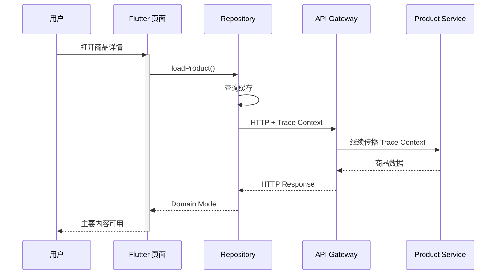
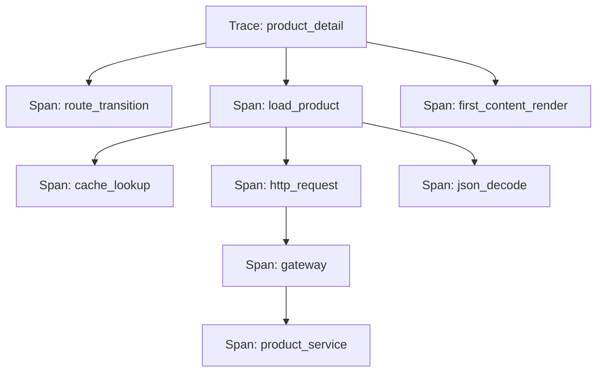
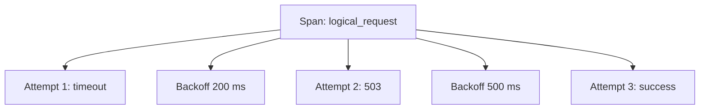
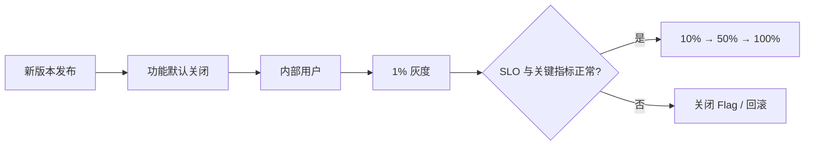
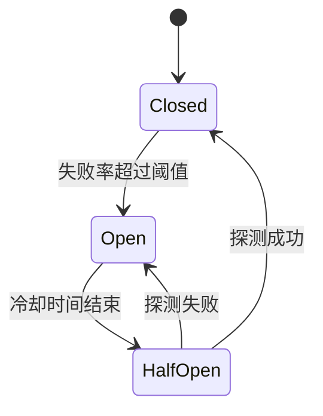
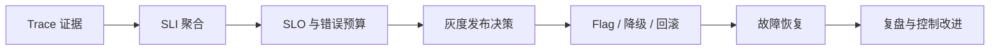

# Flutter 客户端 Trace 与稳定性治理：从链路追踪到灰度、降级和复盘

> 监控告诉我们“系统出了问题”，Trace 负责回答“问题发生在哪一段链路”，治理机制则决定“如何降低影响、恢复服务并防止复发”。

---

## 一、为什么客户端需要 Trace

一次“打开商品详情页”的操作，可能经过：

1. Flutter 路由跳转。
2. 页面状态初始化。
3. Repository 查询缓存。
4. HTTP 请求和重试。
5. 网关与多个服务端服务。
6. JSON 解析和领域模型转换。
7. Widget Build、图片加载和首屏渲染。

如果只记录一条“详情页耗时 2.8 秒”，无法判断时间消耗在哪里。客户端网络日志显示请求耗时 1.9 秒，也不能直接证明服务端处理了 1.9 秒，因为其中还可能包含排队、DNS、连接、TLS、上传和下载。

Trace 的作用是把一次用户操作拆成一组具有父子关系的 Span，并使用同一个 Trace ID 连接客户端、网关和服务端。



Trace 不只用于性能分析，还能支持：

- 确认错误发生在客户端、网络还是服务端。
- 还原重试、缓存、降级和回滚路径。
- 对比不同版本、灰度组和 Feature Flag。
- 发现一条业务链路中的长尾瓶颈。
- 为 SLO、错误预算和故障复盘提供证据。

---

## 二、Trace 的核心数据模型

### 2.1 Trace、Span 与 Event

| 概念 | 含义 | 示例 |
|---|---|---|
| Trace | 一次完整分布式操作 | 用户打开商品详情页 |
| Span | 链路中的一个计时单元 | 缓存查询、HTTP 请求、JSON 解析 |
| Event | Span 内某个时间点发生的事件 | 开始重试、缓存未命中 |
| Attribute | 用于过滤和聚合的字段 | 页面名、版本、状态码 |
| Status | Span 的最终状态 | OK、Error、Unset |

一条 Trace 通常形成树形结构：



每个 Span 至少需要：

- Trace ID。
- Span ID。
- Parent Span ID。
- Span 名称。
- 开始和结束时间。
- 状态。
- 有限的 Attribute 与 Event。

### 2.2 Span 名称必须稳定

错误示例：

```text
GET /products/938271?user=123
```

其中的商品和用户参数会制造大量高基数名称，无法有效聚合。更合理的名称是：

```text
HTTP GET /products/:id
```

动态值可以在经过隐私审查后作为受控 Attribute 保存，但不应进入 Span 名称。

### 2.3 Span 不是普通日志

日志主要记录离散事实，Span 描述有开始、结束和父子关系的操作。不要把每条日志都转换成 Span，否则会产生大量数据和运行时开销。

适合创建 Span 的操作通常是：

- 页面加载。
- 网络请求。
- 数据库查询。
- 大型解析或计算。
- 插件和原生能力调用。
- 关键业务步骤。

---

## 三、客户端 Trace Context

Trace 要跨异步调用和网络传播，必须维护上下文。

```dart
final class TraceContext {
  const TraceContext({
    required this.traceId,
    required this.spanId,
    required this.sampled,
  });

  final String traceId;
  final String spanId;
  final bool sampled;
}
```

一个简化的 Trace API 可以设计为：

```dart
abstract interface class Tracer {
  Future<T> trace<T>(
    String name,
    Future<T> Function(Span span) operation, {
    Map<String, Object?> attributes = const {},
  });
}

abstract interface class Span {
  TraceContext get context;

  void addEvent(
    String name, {
    Map<String, Object?> attributes = const {},
  });

  void recordError(Object error, StackTrace stackTrace);
  void setAttribute(String key, Object value);
}
```

业务使用方式：

```dart
Future<Product> loadProduct(String productId) {
  return tracer.trace(
    'product.load',
    (span) async {
      final cached = await cache.find(productId);
      if (cached != null) {
        span.setAttribute('cache.hit', true);
        return cached;
      }

      span.setAttribute('cache.hit', false);
      return api.fetchProduct(productId);
    },
    attributes: {
      'app.feature': 'product_detail',
    },
  );
}
```

生产实现还需要处理同步异常、异步异常、Span 必然结束、嵌套上下文、采样和批量导出。不要让每个业务模块自行实现不同的 Trace 语义。

---

## 四、跨网络传播 Trace Context

### 4.1 标准传播格式

跨系统传播应优先使用兼容 W3C Trace Context 的格式，例如：

```text
traceparent: 00-<trace-id>-<parent-id>-<flags>
tracestate: <vendor-specific-state>
```

`traceparent` 让下游服务继续同一条 Trace，核心信息包括：

- 版本。
- Trace ID。
- 当前父 Span ID。
- 采样标志。

使用标准格式可以降低客户端、网关、服务端和可观测平台之间的耦合。

### 4.2 HTTP 拦截器注入

下面是概念性示例：

```dart
final class TracingHttpClient {
  TracingHttpClient(this.client, this.tracer);

  final HttpClient client;
  final Tracer tracer;

  Future<HttpResponse> send(HttpRequest request) {
    return tracer.trace(
      'HTTP ${request.method} ${request.routeTemplate}',
      (span) async {
        request.headers['traceparent'] = encodeTraceParent(span.context);

        try {
          final response = await client.send(request);
          span.setAttribute('http.status_code', response.statusCode);
          return response;
        } catch (error, stackTrace) {
          span.recordError(error, stackTrace);
          rethrow;
        }
      },
      attributes: {
        'http.method': request.method,
        'server.address': request.host,
      },
    );
  }
}
```

实际接入时还要考虑：

- 不向不可信第三方域名传播内部 Trace 信息。
- 重定向后是否继续传播。
- 每次重试应创建子 Span，而不是覆盖原请求信息。
- 请求取消应记录为取消语义，不一定标记为服务错误。
- Header 注入失败不能阻断主请求。

### 4.3 重试链路

如果一个请求重试三次，只记录最终成功会隐藏真实体验和服务压力。



建议用一个逻辑请求 Span 包含多个 Attempt Span，记录：

- 尝试序号。
- 错误类型和状态码。
- Backoff 时长。
- 最终结果。

---

## 五、如何设计客户端 Span

### 5.1 页面 Span

页面加载不是简单的 `didPush` 到 `didPop`。更有意义的是拆分关键时间点：

- 路由开始。
- Widget 首次 Build。
- 首帧可见。
- 主要数据到达。
- 主要内容可交互。

页面停留时长可以单独记录，不应与页面加载 Span 混为一谈。

### 5.2 状态管理 Span

不要为每次 `setState` 或每个状态变化创建 Span。适合追踪的是具有业务意义的异步操作：

- 登录提交。
- 搜索请求。
- 购物车同步。
- 支付状态确认。

状态管理层可以给这些操作建立 Span，并将 Repository 和网络 Span 作为子节点。

### 5.3 数据库与缓存 Span

推荐记录：

- 归一化操作名称。
- 缓存命中。
- 查询耗时。
- 返回记录数量。
- 数据库错误类型。

不要记录完整 SQL 参数、Token 或用户隐私数据。

### 5.4 Platform Channel Span

原生 SDK 调用可能跨越 Dart、Engine 和平台线程。Span 应覆盖逻辑调用，并在原生侧继续创建子 Span或至少记录原生阶段耗时。

特别关注：

- 相机启动。
- 地图初始化。
- 支付 SDK。
- 生物识别。
- 大型 Channel 数据编解码。

---

## 六、采样与尾部采样

全量保存所有 Trace 通常不可行。采样需要在成本与诊断能力之间平衡。

### 6.1 Head Sampling

在 Trace 开始时决定是否采样。

优点：

- 实现简单。
- 未采样链路开销较低。
- 上下游容易保持一致。

缺点：

- 决策时还不知道 Trace 最终是否慢或失败。
- 可能丢失低频严重问题。

### 6.2 Tail Sampling

在 Trace 完成后，根据结果决定是否保留：

- 错误 Trace 全部保留。
- 超过阈值的慢 Trace 高比例保留。
- 普通成功 Trace 低比例保留。

尾部采样需要先暂存数据，通常由服务端采集层完成。客户端可以保留有限缓冲，但不能无限保存完整 Trace。

### 6.3 稳定采样

基于 Trace ID、用户或会话进行确定性采样，使同一条链路的各段做出一致决策。完全随机的逐 Span 采样可能产生残缺 Trace。

```text
sampled = hash(traceId) % 10000 < sampleRate
```

采样率应支持远端配置，但配置更新需要版本、有效期和安全兜底，不能因为错误配置导致全量上报风暴。

---

## 七、Trace 的性能与安全边界

Trace SDK 位于每条关键链路上，本身必须足够可靠。

### 性能要求

- 时间戳和 ID 生成应轻量。
- Span 结束时先进入内存队列，不同步等待网络。
- 批量、压缩和后台上报。
- 队列有容量上限，满载时按优先级丢弃。
- 避免在 UI Isolate 执行重序列化和磁盘同步写入。
- 监控 SDK 异常不得影响业务流程。

### 隐私要求

禁止或严格限制记录：

- Token、Cookie、密码和密钥。
- 完整 URL Query。
- 请求和响应正文。
- 用户输入、聊天内容和支付数据。
- 未经匿名化的个人标识。

Attribute 应采用白名单，限制字段长度和基数。仅依赖研发人员“自觉不上传”无法形成可靠治理。

---

## 八、从 Trace 到 SLO

Trace 是证据，SLO 是治理目标。

### 8.1 SLI、SLO 与 SLA

| 概念 | 含义 | 客户端示例 |
|---|---|---|
| SLI | 实际测量指标 | 登录成功率、页面 TTFD P95 |
| SLO | 内部可靠性目标 | 月度登录成功率 ≥ 99.9% |
| SLA | 对外服务承诺 | 未达到承诺时可能产生补偿责任 |

一个有效 SLO 应：

- 对应用户可感知结果。
- 有明确计算口径和时间窗口。
- 能按版本与平台切分。
- 有可采取的治理动作。

“接口平均耗时低于 500 ms”通常不是完整客户端 SLO，因为它没有覆盖页面渲染、缓存、重试和长尾。

### 8.2 错误预算

如果 SLO 是 99.9% 成功率，则允许失败比例为 0.1%，这部分就是错误预算。

```text
错误预算 = 1 - SLO
```

错误预算用于平衡发布速度和稳定性：

- 预算充足：允许正常实验和功能发布。
- 预算快速消耗：降低灰度速度，加强观察。
- 预算耗尽：暂停高风险发布，优先可靠性工作。

不能把错误预算理解为“允许主动制造故障”。它是统一产品、研发和运维决策的量化工具。

---

## 九、Feature Flag 与灰度治理

Feature Flag 将“代码发布”与“功能启用”分离，是客户端止损的重要基础设施。



### 9.1 分桶原则

- 使用稳定用户 ID 或设备 ID 做确定性分桶。
- 同一用户应持续落入同一实验组。
- 不同实验需要独立命名空间，避免相互污染。
- 记录 Flag 版本和实际取值到 Trace。

### 9.2 配置安全

客户端远端配置必须具备：

- Schema 和类型校验。
- 默认值与本地安全值。
- 配置版本和过期时间。
- 签名或可信传输。
- 缓存损坏恢复。
- 未知字段兼容。

Feature Flag 不能代替服务端授权。客户端 Flag 可被修改或绕过，只适合控制体验和发布，不应保护敏感权限。

### 9.3 Flag 生命周期

长期不清理的 Flag 会造成分支爆炸。每个 Flag 应有：

- Owner。
- 创建和过期日期。
- 预期清理版本。
- 默认状态。
- 关闭后的行为。

实验完成后应删除无用分支，而不是永久保留。

---

## 十、熔断、降级与回滚

### 10.1 熔断

当某个依赖持续失败时，继续请求会放大服务端压力并拖慢客户端。熔断器通常经历：



- **Closed**：正常请求并统计结果。
- **Open**：快速失败或走降级，不再持续冲击依赖。
- **Half-Open**：允许少量探测请求判断是否恢复。

客户端熔断应谨慎使用，避免所有设备根据相同瞬时信号同时切换。服务端网关通常更适合全局熔断，客户端可针对体验做短期局部保护。

### 10.2 降级

降级必须在故障前设计，常见方式包括：

- 展示缓存数据并标注可能过期。
- 隐藏非核心模块。
- 使用静态配置替代动态接口。
- 降低图片质量或停止预加载。
- 将复杂页面切换为基础版本。
- 禁止高风险写操作，保留只读能力。

降级应记录到 Trace，区分“正常成功”和“通过降级完成”，否则指标会错误地把降级流量当成正常流量。

### 10.3 回滚

客户端回滚比服务端困难：应用商店版本无法瞬间覆盖所有设备。因此需要多层回滚能力：

1. 关闭 Feature Flag。
2. 回退远端配置。
3. 服务端兼容旧客户端。
4. 发布修复版本。
5. 必要时阻断高风险功能。

客户端 API 和数据 Schema 应保持向后兼容，确保旧版本在服务端变更后仍可运行。

---

## 十一、告警如何使用 Trace

告警负责发现异常，Trace 负责提供上下文。一个可操作的告警至少应包含：

- 受影响的 SLO/SLI。
- 当前值、基线和持续时间。
- 版本、平台、设备和灰度组。
- 代表性错误 Trace 和慢 Trace。
- 当前 Feature Flag 状态。
- Owner 与处理手册。

例如：

```text
告警：Android 8.4.0 商品详情 TTFD P95 从 1.4s 上升到 3.8s
范围：10% 灰度组，主要集中在低内存设备
Trace：图片预取 Span 增加 1.9s，且 Raster 慢帧比例升高
动作：关闭 new_image_prefetch Flag，暂停扩大灰度
```

相比“页面变慢”这样的告警，上述信息能够直接驱动行动。

---

## 十二、故障复盘

复盘不是追究个人责任，而是识别为什么系统允许问题发生、扩大或长时间未被发现。

一份有效复盘应包含：

1. **影响**：用户、版本、平台、业务和持续时间。
2. **时间线**：发布、指标变化、告警、止损和恢复。
3. **根因**：直接技术原因与系统性原因。
4. **放大因素**：采样不足、无灰度、缺少降级等。
5. **有效措施**：哪些告警、Trace 或 Flag 帮助恢复。
6. **改进行动**：Owner、截止时间和验证方式。

### 根因不应停留在“开发疏忽”

更有价值的问题包括：

- 为什么测试没有覆盖这个场景？
- 为什么灰度指标没有阻止扩大流量？
- 为什么接口或 Schema 缺少兼容约束？
- 为什么告警没有对应负责人？
- 为什么只能发布新版本，不能远端止损？

### 行动项必须可验证

错误行动项：

```text
以后加强测试，开发更加仔细。
```

可验证行动项：

```text
为历史三个数据库版本增加自动迁移测试；
负责人：客户端基础架构组；截止：8.5.0 提测前；
验证：CI 必须从三份历史 Schema 快照升级并校验数据。
```

---

## 十三、常见误区

### 误区一：Trace 越细越好

过细 Span 会增加 CPU、内存、流量和存储成本。Span 应对应有诊断价值的操作，而不是每个函数调用。

### 误区二：Trace ID 可以随意自定义

不兼容标准传播格式会增加网关、服务端和观测平台集成成本。应优先遵循通用 Trace Context 规范。

### 误区三：采样意味着错误也可以随机丢弃

普通成功 Trace 可以低比例采样，错误和严重慢链路应通过尾部采样或提升采样率保留。

### 误区四：Feature Flag 可以替代权限校验

客户端 Flag 可以被绕过，只能用于发布和体验控制，权限必须由可信服务端执行。

### 误区五：有回滚能力就不需要兼容设计

客户端版本长期共存，应用商店发布也有延迟。服务端、数据和配置仍需兼容旧客户端。

### 误区六：故障复盘就是确定谁写错了代码

个人错误无法解释为什么问题通过测试、灰度和告警层层扩散。复盘应寻找可系统化改进的控制点。

---

## 十四、落地清单

### Trace

- [ ] 使用稳定 Trace、Span、Event 和 Attribute 模型。
- [ ] 使用标准 Trace Context 跨网络传播。
- [ ] 页面、网络、数据库和关键业务操作建立有限 Span。
- [ ] 重试、缓存、取消和降级具有明确语义。
- [ ] 采用稳定采样，并保留错误和严重慢链路。
- [ ] Attribute 白名单、脱敏和高基数治理。

### 稳定性治理

- [ ] 为用户关键链路定义 SLI 和 SLO。
- [ ] 使用错误预算约束发布风险。
- [ ] Feature Flag 支持稳定分桶、安全默认值和远端关闭。
- [ ] 灰度过程具有自动或人工停止条件。
- [ ] 核心依赖具备缓存、降级或熔断策略。
- [ ] 告警关联代表性 Trace、Owner 和处理手册。
- [ ] 故障复盘行动项具备负责人、期限和验证方法。

---

## 十五、总结

Trace 与稳定性治理之间是一条连续链路：



核心原则可以归纳为：

1. Trace 用统一上下文连接客户端、网络和服务端。
2. Span 应有稳定语义，避免高基数和过度采集。
3. 采样必须兼顾成本、完整链路和异常保留。
4. SLO 把技术指标转换为用户体验目标。
5. 错误预算用于平衡发布速度与可靠性。
6. Feature Flag、灰度、降级和回滚必须在故障前建设。
7. 复盘应改进系统控制点，而不是停留在个人失误。

最终目标不是拥有更多 Trace，而是让团队能够基于证据做出更快、更可靠的发布和止损决策。

---

## 十六、问答复盘

### Q1：Trace、Span 和普通日志有什么区别？

**答：** Trace 表示一次完整链路，Span 表示其中有开始、结束和父子关系的操作；日志是离散事件。日志可附着到 Span，但不应把所有日志都转换成 Span。

### Q2：为什么 Span 名称不能包含用户 ID 或完整 URL？

**答：** 动态值会产生高基数，导致聚合困难和成本上升，还可能泄露隐私。名称应稳定，动态信息只能作为受控 Attribute。

### Q3：客户端如何让服务端继续同一条 Trace？

**答：** 在可信请求中注入标准 Trace Context，例如 W3C `traceparent`，网关和下游服务读取后使用相同 Trace ID 创建子 Span。

### Q4：Head Sampling 与 Tail Sampling 如何选择？

**答：** Head Sampling 开销低但可能提前丢失异常；Tail Sampling 能根据错误和耗时保留重要链路，但需要暂存数据。实践中通常组合使用。

### Q5：为什么每次重试都应该有独立 Attempt Span？

**答：** 它能保留每次失败原因、退避和最终成功过程。只记录最终结果会掩盖用户延迟和对服务端的额外压力。

### Q6：Feature Flag 为什么不能作为安全权限控制？

**答：** 客户端配置可以被修改或绕过。Flag 只适合发布与体验控制，敏感权限必须由可信服务端校验。

### Q7：错误预算耗尽后应该做什么？

**答：** 应降低发布速度或暂停高风险变更，优先修复可靠性问题。具体动作需由团队预先定义，而不是故障后临时决定。

### Q8：一次故障复盘最重要的产出是什么？

**答：** 不是描述谁犯了错，而是形成可验证的系统改进行动，包括负责人、期限和验证方法，降低相同问题再次发生的概率。
