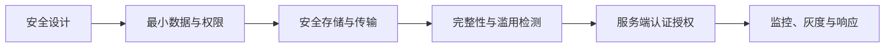
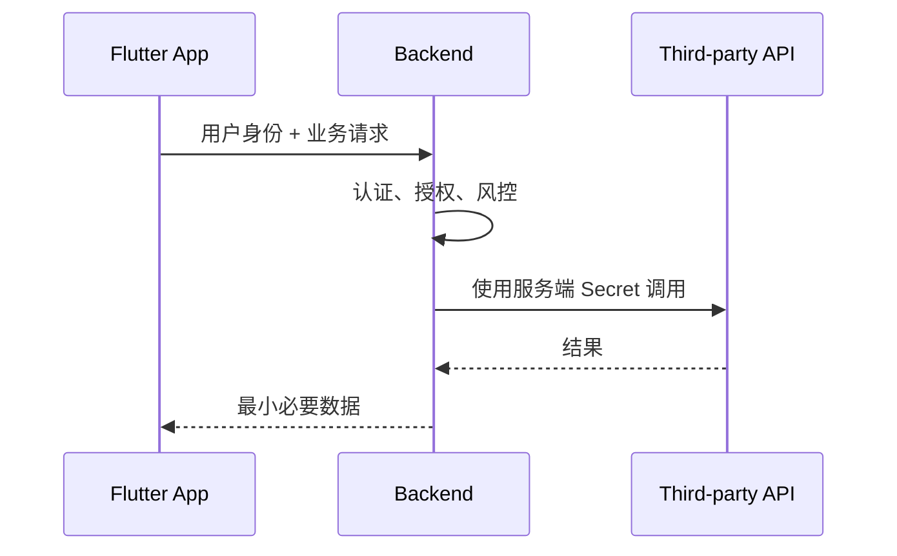
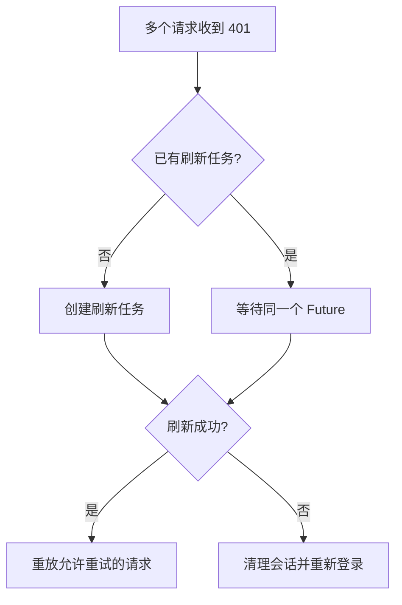
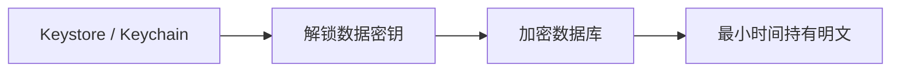
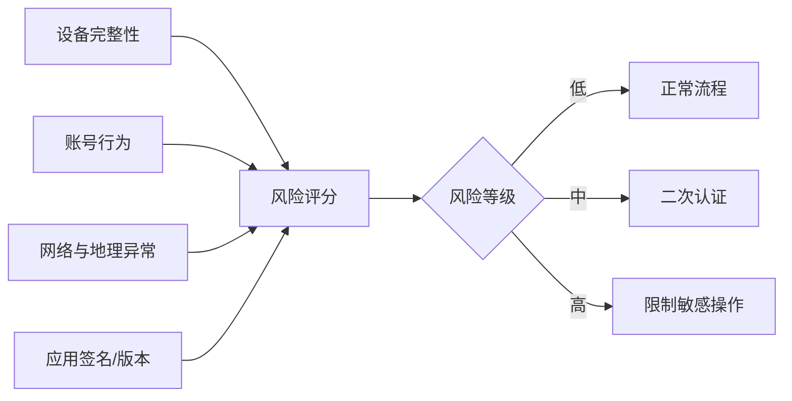

# Flutter 客户端安全：从威胁建模到工程防护

> 客户端安全不是“让应用无法被破解”，而是在不可信设备上保护用户数据、限制攻击能力、提高滥用成本，并确保最终权限由可信服务端控制。

---

## 一、客户端安全的基本前提

Flutter 应用最终运行在用户控制的设备上。攻击者可能：

- 获取安装包并进行静态分析。
- 在 Root 或越狱设备上读取文件和进程信息。
- Hook Dart、Native 函数或网络调用。
- 修改客户端逻辑并重新打包。
- 控制代理、DNS、Wi-Fi 和本地证书环境。
- 自动化调用接口和批量滥用业务能力。
- 从日志、截图、剪贴板、备份和通知中获取数据。

因此必须接受一个事实：

> 任何交付到客户端的固定密钥、算法、开关和业务规则，最终都有被读取或修改的可能。

这不代表客户端防护没有价值。合理的安全设计可以：

- 降低意外泄露风险。
- 提高逆向和自动化攻击成本。
- 缩小单次凭证泄露的影响范围。
- 延缓攻击，为服务端检测和止损争取时间。
- 满足隐私、合规和审计要求。

客户端安全需要纵深防御：



---

## 二、从威胁建模开始

安全措施应针对明确威胁，而不是机械添加 Root 检测、混淆或证书绑定。

### 2.1 识别资产

需要保护的资产通常包括：

- 登录 Token 和会话。
- 用户个人信息。
- 支付、订单和账户资产。
- 本地业务数据和文件。
- API 配额和付费能力。
- 企业内部接口和配置。
- 代码完整性与发布渠道。

### 2.2 识别入口

- 登录、注册和找回密码。
- 网络 API。
- 本地数据库和文件。
- Deep Link、推送和二维码。
- WebView 与 JavaScript Bridge。
- Platform Channel 和第三方 SDK。
- 文件导入、导出和分享。
- 远端配置和 Feature Flag。

### 2.3 评估影响

| 威胁 | 可能影响 | 主要防护方向 |
|---|---|---|
| Token 被窃取 | 账号接管 | 短期凭证、刷新轮换、安全存储、服务端撤销 |
| 本地数据被读取 | 隐私泄露 | 数据最小化、加密、备份控制 |
| 客户端被篡改 | 绕过 UI 与业务限制 | 服务端授权、完整性信号、风控 |
| 接口被自动化滥用 | 资源损失 | 限流、风控、设备和账号关联 |
| 依赖被投毒 | 代码执行、数据泄露 | 依赖治理、锁定版本、制品验证 |

风险优先级应结合发生概率、影响范围、可检测性和恢复成本。不是所有应用都需要同等级的防护。

---

## 三、客户端不能保存真正的机密

下面的内容即使写入环境变量或经过混淆，也会进入最终制品：

```dart
const paymentSecret = String.fromEnvironment('PAYMENT_SECRET');
```

`dart-define` 适合构建配置，不是机密管理系统。攻击者可以通过静态分析、动态 Hook 或观察请求过程提取值。

### 不应放在客户端

- 服务端私钥。
- 数据库管理员凭证。
- 可直接调用高权限接口的长期 API Secret。
- 支付签名私钥。
- 所有用户共享的永久加密主密钥。

### 可以放在客户端但要限制能力

- 明确设计为公开标识的 API Key。
- 短期访问 Token。
- 与应用签名、包名、域名或配额绑定的 Key。
- 只能调用低风险公开能力的标识。

安全能力应下沉到服务端：



---

## 四、认证与会话安全

### 4.1 Access Token 与 Refresh Token

常见设计：

- Access Token 生命周期短，用于普通 API。
- Refresh Token 生命周期较长，只用于获取新 Access Token。
- Refresh Token 轮换，旧 Token 使用后失效。
- 服务端支持撤销、设备管理和风险冻结。

Token 生命周期需要在安全和体验之间平衡。仅在客户端设置过期时间不够，服务端必须检查有效性和撤销状态。

### 4.2 避免 Token 刷新风暴

多个请求同时收到 401 时，应让一个刷新操作执行，其余请求等待结果：



还要防止：

- 刷新接口本身触发无限 401 循环。
- 旧刷新结果覆盖新登录会话。
- 非幂等请求被自动重复提交。
- 登出后仍写入旧 Token。

### 4.3 敏感操作重新认证

即使用户已登录，修改密码、查看恢复码、转账等高风险操作仍可要求：

- 最近登录验证。
- 生物识别或设备凭证。
- OTP 或其他二次认证。
- 服务端风险挑战。

生物识别通常用于解锁设备上的密钥或确认本地用户存在，不能独立证明服务端账号身份。

---

## 五、本地安全存储

### 5.1 普通存储与安全存储

| 数据 | 推荐位置 | 说明 |
|---|---|---|
| 主题、语言 | Preferences | 非敏感配置 |
| Access/Refresh Token | Keychain/Keystore 封装 | 小型敏感凭证 |
| 大型业务数据 | 数据库或文件 | 按敏感度决定是否加密 |
| 加密主密钥 | Keychain/Keystore | 不与密文放在同一普通文件中 |

`shared_preferences` 不是安全存储，不能用来保存 Token、密码或私钥。

Flutter 的安全存储插件通常封装：

- iOS Keychain。
- Android Keystore 及加密存储机制。

具体加密方式、备份行为、设备迁移和最低系统版本依插件版本而异，必须阅读当前插件与平台文档。

### 5.2 安全存储不等于绝对安全

Keychain/Keystore 能降低普通文件读取风险，但不能保证：

- Root/越狱环境中永远无法提取。
- 应用运行时 Token 不会被 Hook。
- 解锁后的明文不会出现在内存。
- 备份和设备迁移配置一定符合业务要求。

因此仍需短期凭证、服务端撤销、设备风险检测和异常行为监控。

### 5.3 数据库加密与密钥管理

数据库加密只有在密钥管理正确时才有意义。



常见错误：

- 把数据库密钥硬编码在应用中。
- 将密钥和密文保存在同一个普通文件。
- 所有用户共享同一固定密钥。
- 只加密数据库，却把敏感数据写入日志和缓存。

是否加密整个数据库应根据威胁模型决定。字段级加密可能减少敏感数据暴露，但会增加查询、迁移和密钥轮换复杂度。

### 5.4 数据生命周期

- 只存储业务必需数据。
- 设置缓存过期和大小上限。
- 登出时删除账号相关敏感数据。
- 账号切换时隔离数据命名空间。
- 删除账号后清理本地残留。
- 明确系统备份是否允许包含这些数据。

“加密后永久保存”不符合数据最小化原则。

---

## 六、日志、崩溃与分析数据

日志是常见泄露渠道。下面的代码不应出现：

```dart
// 错误示例
debugPrint('login token=$token');
debugPrint('response=${response.body}');
```

### 应禁止记录

- Token、Cookie、Authorization Header。
- 密码、验证码和恢复码。
- 银行卡、证件和生物信息。
- 完整请求与响应正文。
- 用户输入的聊天、搜索和表单内容。
- 敏感 Deep Link 参数。

### 结构化脱敏

```dart
Map<String, Object?> sanitizeNetworkEvent({
  required String routeName,
  required int statusCode,
  required Duration duration,
}) {
  return {
    'http.route': routeName,
    'http.status_code': statusCode,
    'duration_ms': duration.inMilliseconds,
  };
}
```

使用归一化路由名而不是完整 URL。字段采用 Allowlist，不依赖开发者在每次调用时手工删除敏感值。

### 崩溃上报

堆栈、Breadcrumb 和设备信息也可能包含敏感数据，需要：

- 限制 Breadcrumb 内容与数量。
- 用户标识匿名化。
- 控制数据保留周期。
- 对访问监控平台进行权限和审计。
- 根据地区和用户选择执行隐私合规。

---

## 七、截图、录屏、剪贴板与通知

### 7.1 截图与录屏

支付密码、恢复码、身份信息等页面可考虑启用平台防截屏能力。需要注意：

- Android 和 iOS 能力与限制不同。
- 防截屏可能影响投屏、客服和无障碍使用。
- 外部摄像头仍可拍摄屏幕。
- 应按页面或状态最小化启用范围。

防截屏是降低意外泄露的措施，不是完整的数据保护方案。

### 7.2 应用切换器快照

应用进入后台时，系统可能生成任务切换预览。敏感页面应在适当生命周期覆盖模糊层或安全占位内容，并在返回前台后恢复。

实现时需要避免：

- 生命周期切换时闪现敏感内容。
- 遮罩阻塞恢复后的交互。
- 在不同平台错误假设相同回调顺序。

### 7.3 剪贴板

- 不自动复制 Token 和密码。
- 敏感内容复制前提示风险。
- 支持时设置过期或敏感标记。
- 不在应用启动时主动读取剪贴板。
- 不将剪贴板内容上传分析平台。

### 7.4 通知

- 锁屏通知不展示完整敏感信息。
- 允许用户选择预览等级。
- Payload 不携带长期凭证。
- 点击通知后重新检查登录与权限。
- 清理不再有效的账号通知。

---

## 八、网络与传输安全

Flutter 应用应默认使用 HTTPS，并依赖系统信任链验证服务端证书。

### 基础要求

- 禁止生产环境明文 HTTP。
- 不实现“信任所有证书”的调试逻辑。
- 调试代理能力不得进入 Release。
- 正确处理重定向后的 Host。
- Token 不出现在 URL Query。
- 请求超时、重试和错误日志不泄露敏感内容。

### 证书绑定

Certificate/Public Key Pinning 可以提高中间人攻击成本，但会引入：

- 证书和公钥轮换风险。
- CDN、代理和灾难恢复复杂度。
- Pin 过期导致全部客户端断网。
- 应用商店旧版本长期存在的问题。

如果采用 Pinning，应至少准备：

- 多个有效 Pin。
- 明确轮换窗口。
- 远端止损或兼容策略。
- 真实过期与灾难恢复演练。

Pinning 不能替代服务端认证、Token 保护和业务授权。

---

## 九、Root、越狱与设备完整性

Root/越狱检测可作为风险信号，但不能作为绝对安全边界。

攻击者可能：

- Hook 检测函数。
- 隐藏 Root 痕迹。
- 修改检测结果。
- 在虚拟环境中模拟正常设备。

### 正确使用方式

将设备完整性作为多个风险信号之一：



可使用平台提供的应用和设备完整性证明能力，但需要服务端验证证明结果，并处理：

- 不支持的设备。
- 无 Google/Apple 服务环境。
- 网络失败。
- 误报和辅助设备。
- 重放与 Nonce。

不应因为单一 Root 检测失败就让所有用户无法使用基础功能，除非业务风险和合规明确要求。

---

## 十、混淆、反调试与完整性

### 10.1 代码混淆

混淆可以：

- 增加静态阅读成本。
- 降低符号和业务命名暴露。
- 配合符号文件还原崩溃堆栈。

混淆不能：

- 保护硬编码 Secret。
- 阻止动态 Hook。
- 替代服务端权限校验。
- 保证算法不可理解。

发布时必须安全保存符号文件，并按版本和构建号管理，否则线上崩溃无法正确符号化。

### 10.2 应用完整性

可以检查：

- 包签名是否符合预期。
- 安装来源与构建渠道。
- 应用版本是否受支持。
- 关键资源是否被篡改。
- 平台完整性证明结果。

纯客户端自检可以被修改，因此高风险决策应由服务端结合证明、账号和行为信号完成。

### 10.3 反调试和反 Hook

反调试可以提高攻击成本，但可能引发：

- 设备兼容问题。
- 开发与客服排障困难。
- 无障碍或企业环境误报。
- 攻击者针对性绕过。

应根据资产价值决定强度，并保留安全降级、灰度和远端开关。

---

## 十一、权限与平台能力

权限遵循最小权限和及时请求：

- 用户触发相关功能时再申请。
- 只申请当前功能需要的最低粒度权限。
- 解释用途，并与隐私声明一致。
- 拒绝后提供安全降级路径。
- 不通过连续弹窗强迫用户授权。
- 权限不再需要时停止采集相关数据。

获得系统权限不等于获得业务授权。例如，相册权限允许选择图片，但不意味着应用可以自动上传整个相册。

Platform Channel 和插件还应检查：

- 方法允许列表。
- 参数类型、长度与范围。
- Engine 和页面生命周期。
- 错误码和敏感日志。
- 多 Engine 与多实例隔离。

Deep Link、WebView 与 JavaScript Bridge 的详细安全边界可参考同工作区的《Flutter 输入与链接安全》。

---

## 十二、第三方 SDK 与供应链

第三方依赖与应用拥有近似的进程权限，可能读取设备信息、网络请求和用户数据。

### 12.1 依赖引入评估

- 维护状态和发布频率。
- 开源代码与许可证。
- 已知漏洞。
- 收集的数据和网络域名。
- Android/iOS 权限变化。
- 传递依赖与 Native Binary。
- 最低平台和 Flutter 版本。

### 12.2 版本与制品治理

- 应用提交 `pubspec.lock`，保证构建可重复。
- 升级依赖时审查 Changelog 和权限变化。
- 限制 `dependency_overrides` 长期存在。
- CI 执行依赖漏洞和许可证检查。
- 构建环境固定并隔离发布凭证。
- 发布制品生成哈希并保留来源记录。

### 12.3 第三方 SDK 数据治理

- 默认关闭不必要的自动采集。
- 在用户授权后再初始化相关能力。
- 使用字段 Allowlist。
- 明确数据地区、保留时间和删除机制。
- SDK 失败不能阻断核心业务。

不能因为 SDK 是知名厂商提供，就跳过数据流和权限审查。

---

## 十三、发布与密钥安全

发布签名和平台证书属于高价值资产。

### CI/CD 要求

- 发布密钥不进入代码仓库。
- 使用专用密钥管理系统或受控 CI Secret。
- 最小化能够执行生产签名的人员和任务。
- 保护 CI Runner 和构建日志。
- 审计密钥读取和发布操作。
- 区分开发、测试与生产凭证。
- 定期轮换可轮换凭证。

### 构建产物

- 确认包名、签名、版本和渠道。
- 禁止 Debug 开关、代理证书和测试接口进入 Release。
- 上传符号文件，但限制访问。
- 检查应用权限和隐私清单。
- 对灰度和正式制品建立可追溯关系。

供应链攻击可能发生在依赖、构建机、CI 脚本、签名和上传各环节，不能只关注应用源码。

---

## 十四、安全监控与响应

客户端安全事件需要与服务端风控和监控结合。

### 可观测信号

- Token 刷新异常和撤销失败。
- 同一账号短时间跨设备、跨地区异常活动。
- 应用签名、版本或完整性异常。
- Root/越狱等设备风险信号。
- 敏感接口高频调用。
- 证书校验失败异常增长。
- 本地解密、数据库或安全存储失败。

### 事件响应


客户端版本无法瞬时覆盖所有用户，因此应提前建设：

- 服务端 Token 撤销。
- Feature Flag。
- 最低支持版本策略。
- 高风险能力远端关闭。
- API 向后兼容。
- 用户通知与账号恢复流程。

---

## 十五、常见误区

### 误区一：使用 `dart-define` 就能保护 Secret

构建变量最终会进入制品。它适合配置，不适合保存服务端机密。

### 误区二：数据放进安全存储就绝对安全

安全存储降低静态读取风险，但运行时明文仍可能被 Hook。还需要短期凭证、撤销和风险检测。

### 误区三：检测到 Root 就能阻止所有攻击

Root 检测可以被绕过，应作为风险信号，而不是唯一授权条件。

### 误区四：代码混淆可以保护业务安全

混淆只提高逆向成本。金额、权限、优惠和资源归属必须由服务端校验。

### 误区五：加密整个数据库就不会泄露数据

密钥管理、内存明文、日志、备份和导出都可能泄露。加密只是纵深防御的一层。

### 误区六：客户端做了证书绑定就不需要其他安全措施

Pinning 只针对部分传输攻击，还存在轮换风险，不能替代认证、授权、数据最小化和风控。

---

## 十六、落地清单

### 凭证与数据

- [ ] 服务端 Secret 不进入客户端制品。
- [ ] Access Token 短期化，Refresh Token 可轮换和撤销。
- [ ] Token 使用 Keychain/Keystore 封装存储。
- [ ] 敏感数据库加密具备独立密钥管理。
- [ ] 登出、账号切换和删除账号时清理本地数据。
- [ ] 日志、崩溃和分析数据采用字段 Allowlist。

### 设备与应用

- [ ] Root/越狱与完整性只作为风险信号。
- [ ] 高风险操作支持二次认证。
- [ ] Release 构建启用合适的混淆并保存符号文件。
- [ ] Debug、代理和测试能力不进入生产环境。
- [ ] 敏感页面评估截图、任务快照和通知泄露。

### 工程与治理

- [ ] 权限按最小范围和用户触发时申请。
- [ ] 第三方 SDK 完成权限、数据和依赖审查。
- [ ] 发布密钥由受控 CI Secret 管理。
- [ ] 服务端具备 Token 撤销、限流和风控。
- [ ] 安全能力支持灰度、远端止损和事件响应。

---

## 十七、总结

Flutter 客户端安全可以归纳为六条原则：

1. **客户端不可信**：固定 Secret 和本地校验最终都可能被绕过。
2. **数据最小化**：不采集、不存储、不输出不必要的敏感数据。
3. **最小权限**：Token、系统权限、插件和 SDK 只获得必要能力。
4. **纵深防御**：安全存储、加密、完整性、混淆和监控共同工作。
5. **服务端权威**：认证、授权、金额和资源归属由服务端决定。
6. **可响应性**：具备撤销、灰度、降级、回滚和复盘机制。

最终目标不是证明客户端无法被攻破，而是：

> 即使某一层被绕过，攻击者仍无法直接获得长期机密或高权限能力，系统也能及时发现、限制影响并完成恢复。

---

## 十八、问答复盘

### Q1：为什么客户端不能保存真正的 Secret？

**答：** 客户端制品和运行环境由用户控制，固定值可通过静态分析、动态 Hook 或观察请求提取。高权限 Secret 必须保留在可信服务端。

### Q2：`dart-define` 适合存储什么？

**答：** 适合环境名称、API 地址和功能配置，不适合私钥、服务端 Secret 或永久高权限凭证。

### Q3：安全存储能否保证 Token 永不泄露？

**答：** 不能。它主要降低静态文件读取风险，Token 使用时仍会以明文出现在应用内存。还需短期有效、轮换、撤销和风险监控。

### Q4：Root 或越狱检测失败后是否应该立即禁止应用？

**答：** 取决于业务风险。检测可被绕过且可能误报，通常应作为风险评分的一部分，对高风险操作增加认证或限制能力。

### Q5：数据库加密最关键的问题是什么？

**答：** 密钥管理。把固定密钥硬编码或与密文存放在一起，会显著削弱加密价值。

### Q6：代码混淆能够保护哪些内容？

**答：** 它能提高静态逆向成本并减少符号暴露，但不能保护硬编码 Secret，也不能替代服务端认证和授权。

### Q7：为什么客户端获得系统权限后仍需要业务授权？

**答：** 系统权限只允许访问设备能力，不代表用户授权某个业务用途，更不代表服务端允许访问相关账号资源。

### Q8：客户端安全事件发生后最有效的止损能力是什么？

**答：** 服务端 Token 撤销、能力限流、Feature Flag 和风险控制通常比等待应用商店发布新版本更快，因此必须提前建设。
