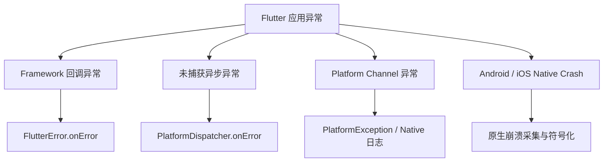
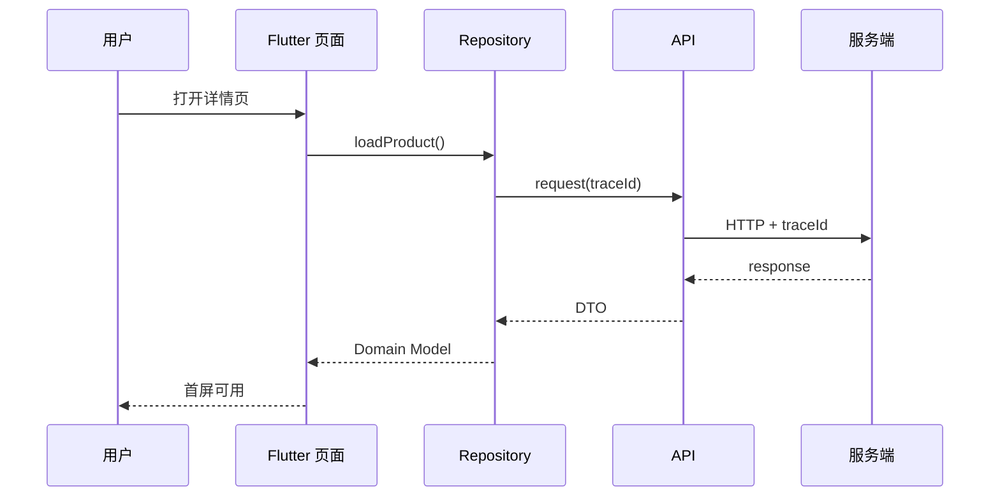
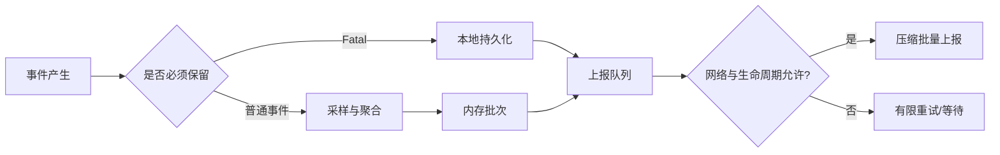

# Flutter 客户端监控体系：从异常发现到问题闭环

> 客户端监控的目标不是“收集更多日志”，而是在用户反馈之前发现问题，并回答四个问题：发生了什么、影响了谁、为什么发生、如何验证修复。

---

## 一、为什么需要客户端监控

服务端通常拥有稳定的运行环境和集中日志，而移动客户端运行在用户设备上，环境高度分散：

- 系统版本、芯片、内存和刷新率不同。
- 网络质量、代理、DNS 和运营商不同。
- 应用版本长期共存，用户不一定及时升级。
- 进程可能被系统直接终止，现场信息难以保留。
- Flutter、原生 SDK 和操作系统问题可能同时出现。

如果只有用户截图和一句“页面卡住了”，研发团队很难重建现场。一个完整的客户端监控系统需要覆盖：

| 领域 | 核心问题 |
|---|---|
| 稳定性 | 应用是否崩溃、无响应或进入不可恢复错误状态 |
| 性能 | 启动、页面、动画和网络是否足够快 |
| 资源 | 内存、CPU、磁盘和流量是否异常 |
| 业务 | 登录、支付、发布等关键流程是否成功 |
| 版本 | 问题集中在哪个版本、平台、设备和用户群 |

真正有价值的监控必须形成闭环：


---

## 二、先定义监控指标

监控建设应从用户体验和业务目标出发，而不是从 SDK 能采集什么出发。

### 2.1 稳定性指标

### Crash-Free User Rate

一段时间内未发生崩溃的用户比例：

```text
Crash-Free Users = 1 - 崩溃用户数 / 活跃用户数
```

它回答“有多少用户受影响”。与崩溃次数相比，按用户计算更接近影响面。

### Crash-Free Session Rate

```text
Crash-Free Sessions = 1 - 崩溃会话数 / 总会话数
```

它回答“用户的一次使用过程有多大概率正常结束”。高频用户可能贡献多个会话，因此它与用户口径不能互相替代。

### Flutter Error

Flutter Framework 捕获的异常不一定导致进程退出，例如 Build、Layout 和 Paint 阶段错误。即使应用展示了 ErrorWidget，也应纳入错误监控。

### ANR 与无响应

Android ANR 表示主线程在规定时间内未响应系统事件。Flutter 页面也可能出现“未崩溃但无法操作”的逻辑卡死，需要结合原生 ANR、主线程堆栈和 Flutter 执行状态分析。

### 2.2 性能指标

| 指标 | 含义 | 建议观察 |
|---|---|---|
| TTID | 初始界面显示时间 | 冷启动、热启动、版本分位数 |
| TTFD | 核心内容完整可用时间 | 首屏数据、图片和交互就绪 |
| Frame Time | 单帧耗时 | UI/Raster、P95/P99、刷新率 |
| Page Load | 页面进入到主要内容可用 | 路由、接口、渲染分段耗时 |
| Network Duration | 请求总耗时 | DNS、连接、服务端、下载阶段 |

只看平均值容易掩盖少量严重慢请求。客户端体验指标通常应同时观察 P50、P90、P95 和 P99。

### 2.3 资源指标

- Dart Heap 和进程内存趋势。
- OOM 数量及前后台状态。
- CPU 高占用时间。
- 本地数据库和缓存体积。
- 单次会话网络流量。
- 图片解码与缓存占用。

资源监控应以趋势和异常为主。持续采集高频 CPU、内存快照会消耗电量和性能，监控本身不能成为新的性能问题。

### 2.4 业务指标

技术指标正常，不代表用户能够完成任务。关键业务链路应监控：

- 登录成功率。
- 首页内容到达率。
- 搜索有结果率。
- 下单、支付、发布成功率。
- 推送送达和点击率。
- 各关键步骤的退出率。

业务监控必须与服务端口径对齐。例如“支付成功”应以服务端最终状态为准，客户端回调只代表客户端观察到的一个阶段。

---

## 三、Flutter 异常采集的边界

Flutter 应用的异常可能来自 Framework、Dart Isolate、Platform Channel 或原生平台。单一入口无法覆盖全部错误。



一个简化的 Dart 异常入口如下：

```dart
Future<void> main() async {
  WidgetsFlutterBinding.ensureInitialized();

  final previousFlutterHandler = FlutterError.onError;
  FlutterError.onError = (details) {
    monitor.recordFlutterError(details);
    previousFlutterHandler?.call(details);
  };

  final previousPlatformHandler = PlatformDispatcher.instance.onError;
  PlatformDispatcher.instance.onError = (error, stack) {
    monitor.recordDartError(error, stack);
    return previousPlatformHandler?.call(error, stack) ?? false;
  };

  runApp(const App());
}
```

这段代码强调两个原则：

1. 记录异常后保留框架或已有 SDK 的处理链，避免监控接入改变原有行为。
2. `PlatformDispatcher.onError` 返回值表示异常是否已处理，不能无条件返回 `true` 并吞掉所有错误。

还需要注意：

- `FlutterError.onError` 主要处理 Framework 回调中的错误。
- 后台 Isolate 的异常需要单独监听或在 Isolate 内上报。
- Zone 可以建立上下文边界，但不能代替所有 Framework、Isolate 和原生错误入口。
- Native Crash、ANR 和 OOM 需要 Android/iOS 侧采集与符号化。
- 捕获异常不等于应用可以安全继续运行，应根据错误类型决定降级或终止。

---

## 四、统一事件模型

不同监控事件需要共享一组稳定字段，才能进行版本、设备和链路聚合。

```dart
enum MonitorLevel { info, warning, error, fatal }

final class MonitorEvent {
  const MonitorEvent({
    required this.name,
    required this.timestamp,
    required this.level,
    required this.attributes,
    this.traceId,
    this.sessionId,
  });

  final String name;
  final DateTime timestamp;
  final MonitorLevel level;
  final Map<String, Object?> attributes;
  final String? traceId;
  final String? sessionId;
}
```

### 推荐公共维度

- 应用版本、构建号、发布渠道。
- Flutter/Dart 版本和构建模式。
- 平台、系统版本、设备型号、内存等级。
- 网络类型、地区和运营商。
- 会话 ID、匿名用户 ID。
- 页面、业务场景和前后台状态。
- Feature Flag 与实验分组。
- Trace ID、Request ID。

公共维度不是越多越好。高基数字段会显著增加存储和查询成本，例如完整 URL、任意错误文本、毫秒时间戳和未归一化设备名称。

### 错误聚合指纹

同类错误需要聚合为一个 Issue，常见指纹信息包括：

- 异常类型。
- 归一化后的消息。
- 前若干个有效堆栈帧。
- 平台与模块。

不能仅按错误文本聚合。文本中包含用户 ID、URL 参数或动态数值时，会把同一错误拆成大量 Issue。

---

## 五、会话、页面与链路上下文

只有异常堆栈通常不足以还原现场，还需要知道错误发生前用户做了什么。

### 5.1 会话

一次会话可定义为应用进入前台到退出、进入后台超时或进程结束。会话定义必须统一，否则 Crash-Free Session 无法稳定比较。

### 5.2 页面追踪

页面进入和退出可通过路由观察器记录：

```dart
class MonitoringRouteObserver extends RouteObserver<PageRoute<dynamic>> {
  void _record(Route<dynamic>? route, String action) {
    final name = route?.settings.name ?? route.runtimeType.toString();
    monitor.addBreadcrumb(
      category: 'navigation',
      message: '$action:$name',
    );
  }

  @override
  void didPush(Route route, Route? previousRoute) {
    super.didPush(route, previousRoute);
    _record(route, 'push');
  }

  @override
  void didPop(Route route, Route? previousRoute) {
    super.didPop(route, previousRoute);
    _record(previousRoute, 'resume');
  }
}
```

真实项目使用声明式路由时，应从路由状态变化建立统一页面命名，而不是依赖不稳定的 Widget 类型名。

### 5.3 Breadcrumb

Breadcrumb 是异常发生前的一组轻量事件，例如：

- 页面跳转。
- 用户点击关键按钮。
- 网络请求失败。
- 登录状态变化。
- 前后台切换。
- Feature Flag 变化。

Breadcrumb 应限制数量和字段长度，使用环形缓冲保留最近事件，避免无限占用内存。

### 5.4 Trace

Trace 用于关联一条跨层链路：



使用同一个 Trace ID，可以把页面慢、客户端网络耗时和服务端 Trace 联系起来，避免客户端与服务端互相猜测。

---

## 六、性能监控如何采集

### 6.1 帧性能

Flutter 可以通过帧时序回调获取 Build 和 Raster 等阶段耗时。采集时需要注意：

- 按设备刷新率计算帧预算，而不是固定使用 16.67 ms。
- 不应上报每一帧的完整明细，应在端侧聚合。
- 区分正常动画页面和静态页面。
- 记录慢帧、严重慢帧比例和分位数。
- 对异常区间保留轻量上下文，再通过专项 Trace 深入分析。

简单聚合示意：

```dart
void installFrameMonitor() {
  WidgetsBinding.instance.addTimingsCallback((timings) {
    for (final timing in timings) {
      frameAggregator.add(
        build: timing.buildDuration,
        raster: timing.rasterDuration,
        total: timing.totalSpan,
      );
    }
  });
}
```

生产代码还需要采样、聚合、生命周期释放和 SDK 版本兼容处理。该回调适合统计帧时序，不应在回调中执行昂贵序列化或同步上报。

### 6.2 启动性能

启动应拆成多个阶段：

1. 进程启动。
2. Flutter Engine 和 Dart 入口就绪。
3. 首帧提交。
4. 首屏主要数据到达。
5. 首屏可交互。

首帧很快但核心内容长期空白，不代表启动体验良好。因此 TTID 与 TTFD 应同时监控。

### 6.3 网络性能

网络监控至少应记录：

- 归一化接口名称，不直接使用含参数完整 URL。
- 方法、状态码、业务错误码。
- 总耗时、请求和响应大小。
- 超时、取消、网络不可达。
- 缓存命中与重试次数。
- Trace ID。

更精细的 DNS、连接、TLS、TTFB 分段能力取决于所用网络栈和平台支持。不能将客户端观测到的总耗时全部归因于服务端。

### 6.4 内存性能

线上持续抓取 Heap Snapshot 成本过高。常见策略是：

- 采集低频进程内存和系统内存压力信号。
- 记录 OOM 前后的页面、图片和业务上下文。
- 发现版本趋势后，在实验室使用 DevTools 做 Heap Diff。
- 对高风险页面执行自动化反复进入退出测试。

线上监控负责发现“哪个版本、哪些设备、哪个页面异常”，本地分析负责找到具体引用链。

---

## 七、采样、缓存与上报

监控系统不能假设设备永远联网，也不能让每个事件立即发起 HTTP 请求。



### 采样策略

- Crash 和关键业务失败通常全量或高比例保留。
- 高频帧、页面和网络事件按用户或会话稳定采样。
- 异常版本可通过远端配置临时提高采样率。
- 同一错误短时间大量出现时进行端侧去重或限流。

稳定采样应让同一用户或会话保持一致，避免一次链路只采到一半。

### 本地缓存

- 使用有大小上限的持久化队列。
- 设置事件过期时间。
- 队列满时按优先级淘汰。
- 崩溃现场应在下次启动补报。
- 上报成功后再删除对应批次。

### 上报约束

- 批量、压缩，避免频繁唤醒网络和 CPU。
- 使用指数退避与 jitter，避免服务异常时形成重试风暴。
- 尊重用户网络和电量状态。
- 监控 SDK 自身异常不能影响主业务。

---

## 八、仪表盘与告警设计

### 8.1 仪表盘

推荐至少建立四类视图：

| 仪表盘 | 主要内容 |
|---|---|
| 版本健康 | Crash-Free、ANR、启动、卡顿、核心业务成功率 |
| 问题聚合 | Issue 趋势、影响用户、首次/最近发生、堆栈 |
| 性能分布 | 页面、接口、设备维度的 P50/P95/P99 |
| 发布对比 | 新旧版本、灰度组、Feature Flag 对照 |

所有指标都应支持按版本、平台、系统、设备和渠道切分。只展示全局平均值，很容易掩盖特定设备或灰度版本的严重问题。

### 8.2 告警

好的告警应同时考虑：

- 影响人数或会话数。
- 相对历史基线的变化。
- 持续时间。
- 错误严重度。
- 当前发布阶段。

例如，“出现一次崩溃”通常不应立即在深夜唤醒团队；“新版本 Crash-Free 在 15 分钟内显著低于基线并影响 100 个用户”则应触发发布阻断。

### 避免告警疲劳

- 同一 Issue 聚合通知。
- 设置恢复通知和静默窗口。
- 区分告警、工单和趋势观察。
- 每条告警明确负责人和处理手册。
- 定期清理长期无人处理的低价值告警。

---

## 九、隐私、安全与成本

监控数据可能包含用户行为、URL、错误文本和设备信息，必须在设计阶段治理。

### 不应采集

- 密码、Token、Cookie、银行卡等机密。
- 未经授权的用户输入全文。
- 完整请求或响应正文。
- 可直接识别用户的敏感个人信息。

### 必须治理

- 字段白名单与端侧脱敏。
- 用户标识匿名化。
- 数据传输加密。
- 数据保留和删除周期。
- 访问权限与审计。
- 不同地区的合规要求。

监控还需要成本预算。高基数标签、全量 Breadcrumb、完整网络 Body 和逐帧明细都会迅速增加存储与查询成本。应优先采集能支持决策的数据。

---

## 十、从告警到故障闭环

一次完整处理过程应包括：

1. **确认**：指标是否真实异常，是否为采集或发布配置变化。
2. **定界**：受影响版本、平台、设备、地区和功能。
3. **止损**：暂停发布、回滚、关闭 Feature Flag 或降级。
4. **定位**：结合 Issue、堆栈、Breadcrumb、Trace 和服务端日志。
5. **修复**：增加自动化测试和防御逻辑。
6. **验证**：灰度组指标恢复，并与对照版本比较。
7. **复盘**：补充监控、告警和处理手册。


监控的最终价值不是生成图表，而是缩短平均发现时间和平均恢复时间，并降低问题再次发生的概率。

---

## 十一、常见误区

### 误区一：接入崩溃 SDK 就完成了监控建设

崩溃只是稳定性的一部分。无响应、卡顿、启动慢、网络失败和业务失败同样会让用户流失。

### 误区二：采集越多，定位越容易

无边界采集会增加性能、流量、隐私和存储成本。有效监控依赖稳定事件模型、关联 ID 和高质量上下文，不是数据数量。

### 误区三：平均耗时正常，性能就正常

平均值会掩盖长尾，应观察分位数，并按版本、设备和网络条件切分。

### 误区四：所有异常都应该吞掉并继续运行

错误捕获用于记录和恢复，不代表应用状态仍然可靠。不可恢复错误应安全终止当前流程或展示兜底页。

### 误区五：客户端请求慢就是服务端慢

总耗时还可能包含 DNS、连接、TLS、排队、下载、重试和客户端解析。需要 Trace 和分段数据确认根因。

### 误区六：有告警就等于监控有效

无人负责、没有处理手册、无法止损的告警只是噪声。告警必须连接到明确的响应流程。

---

## 十二、落地清单

### 指标

- [ ] Crash-Free User / Session。
- [ ] Flutter Error、Native Crash 和 ANR。
- [ ] TTID、TTFD 与页面加载耗时。
- [ ] 慢帧、严重慢帧、UI/Raster 分布。
- [ ] 网络成功率、耗时、重试和缓存命中。
- [ ] 核心业务流程成功率。

### 上下文

- [ ] 版本、平台、设备、系统和网络维度。
- [ ] 会话、页面、Breadcrumb。
- [ ] Feature Flag 和实验分组。
- [ ] Trace ID 与 Request ID。
- [ ] 错误指纹和符号化堆栈。

### 工程治理

- [ ] 稳定采样、批量上报和有限本地队列。
- [ ] 字段白名单、脱敏和数据保留策略。
- [ ] 版本健康仪表盘和发布对比。
- [ ] 告警负责人、处理手册和恢复通知。
- [ ] 灰度、回滚、降级和复盘机制。

---

## 十三、总结

Flutter 客户端监控体系可以归纳为五个层次：

1. **采集**：覆盖 Flutter、Dart、原生、性能和业务事件。
2. **上下文**：通过版本、会话、页面、Breadcrumb 和 Trace 还原现场。
3. **传输**：采样、聚合、持久化并可靠上报。
4. **分析**：按影响面、分位数和多维度聚合，而不是只看平均值。
5. **闭环**：告警连接止损、定位、灰度验证与复盘。

监控建设的核心原则是：

> 采集能够支持决策的最少数据，用统一上下文连接端到端证据，并让每个重要告警都能触发明确行动。

---

## 十四、问答复盘

### Q1：Crash-Free User 与 Crash-Free Session 有什么区别？

**答：** 前者衡量受影响用户比例，后者衡量一次使用会话无崩溃的概率。高频用户可能产生多个会话，因此两个指标需要同时观察。

### Q2：`FlutterError.onError` 能否捕获所有 Flutter 应用异常？

**答：** 不能。它主要覆盖 Framework 回调异常。未捕获异步错误、后台 Isolate、Platform Channel、Native Crash 和 ANR 还需要其他入口。

### Q3：为什么性能监控不能只看平均值？

**答：** 少量严重慢请求或慢帧会被平均值稀释。P95/P99 更能反映长尾用户体验，还应按版本、设备和网络切分。

### Q4：线上是否应该上报每一帧的完整数据？

**答：** 通常不应该。逐帧明细会增加 CPU、流量和存储成本。应在端侧聚合分位数和慢帧比例，只为异常场景保留有限上下文。

### Q5：为什么监控事件需要 Trace ID？

**答：** Trace ID 能把页面操作、Repository、客户端请求和服务端调用连接成一条链路，帮助判断耗时或错误发生在哪个阶段。

### Q6：错误已经上报，是否应该统一返回“已处理”？

**答：** 不应该。上报只代表记录。是否已处理取决于应用能否安全恢复，无条件吞掉错误可能让应用在损坏状态下继续运行。

### Q7：如何避免监控系统影响应用性能？

**答：** 使用稳定采样、端侧聚合、批量压缩、有限队列和异步上报；限制 Breadcrumb 与字段大小，并监控 SDK 自身耗时和失败率。

### Q8：什么样的告警才具有可操作性？

**答：** 告警应包含影响范围、相对基线、持续时间、版本和负责人，并能直接连接到暂停发布、回滚、降级或排查手册等行动。
