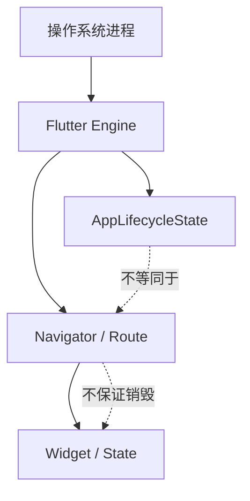
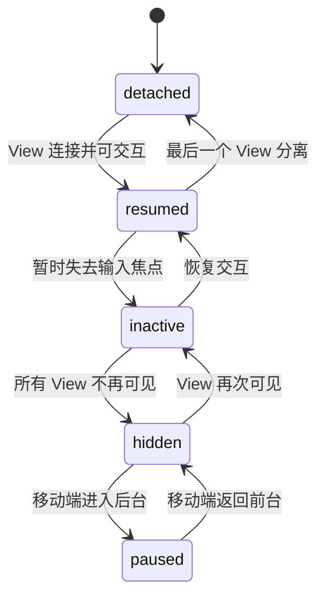
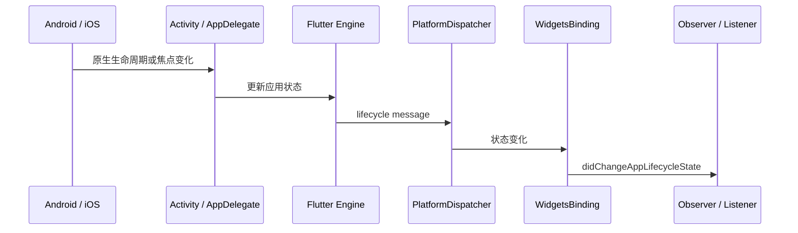
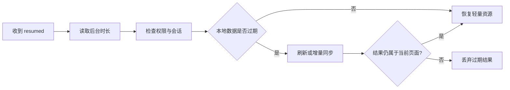
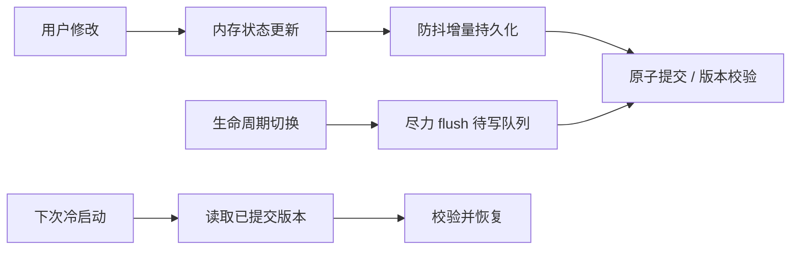
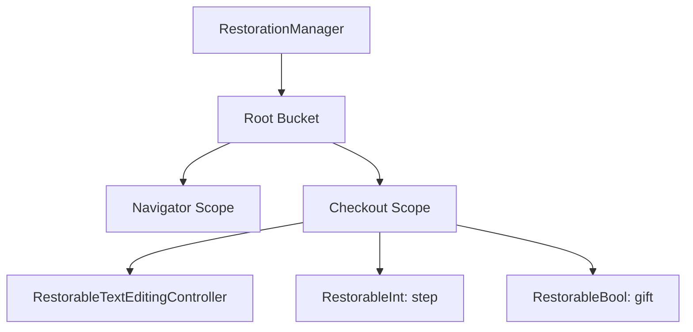
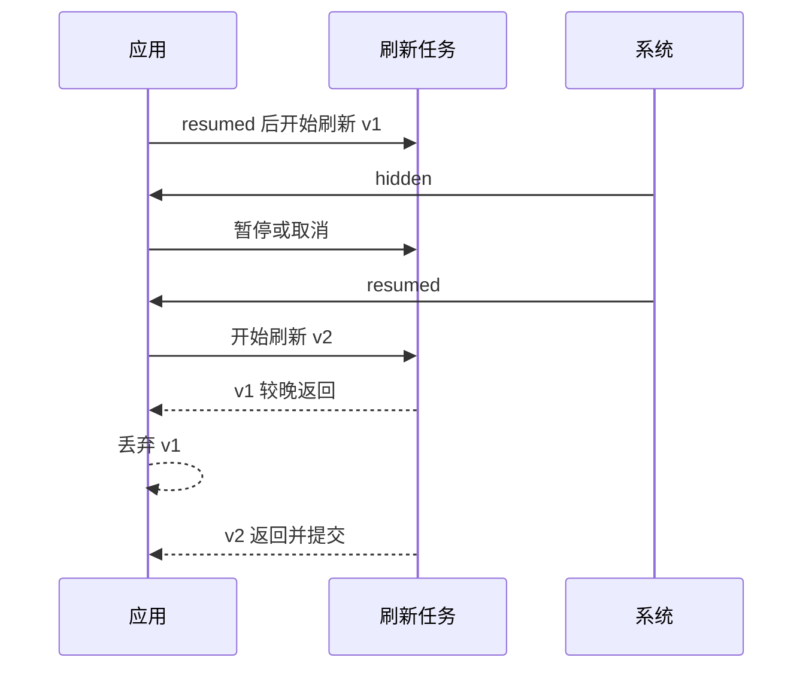
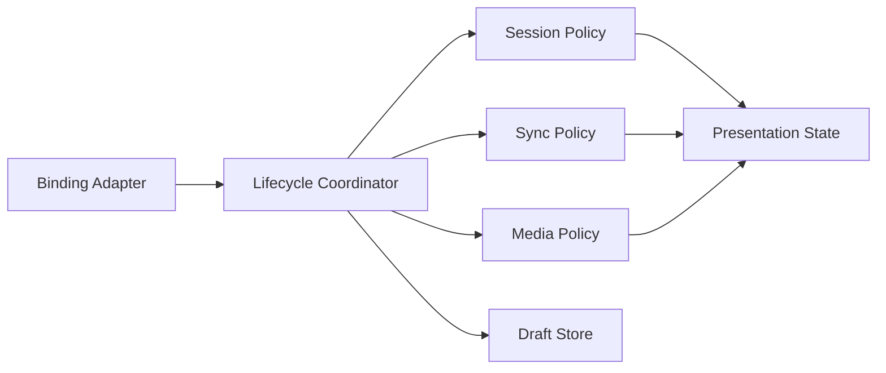

# Flutter 应用生命周期：状态切换、可靠保存与进程恢复

> 应用生命周期通知只能描述 Flutter 当前观察到的状态，不能保证每次切换都完整送达。关键数据必须在变化时持续保存，生命周期回调只适合做补充刷新和资源治理。

---

## 一、为什么应用生命周期容易出错

一个订单编辑页面可能同时处理：

- 用户输入的地址和备注；
- 定位、相机、音视频或传感器资源；
- WebSocket、轮询和数据刷新；
- 前后台切换；
- 来电、通知中心、分屏和窗口失焦；
- 系统内存压力导致的进程终止；
- 再次启动后的页面与表单恢复。

如果只在 `paused` 时保存草稿，会留下一个危险窗口：操作系统可能直接终止进程，回调来不及执行，甚至整个状态序列都不会完整出现。

另一个常见错误是把 `AppLifecycleState` 当成页面可见性：应用仍处于 `resumed` 时，一个 Route 也可能已被另一个 Route 覆盖；在 Add-to-App 或多窗口场景中，Engine、容器和具体页面的可见性关系更复杂。

### 核心结论

1. `AppLifecycleState` 是 Flutter 跨平台归一化后的应用状态，不是 Android/iOS 原生回调的一一翻译。
2. 不要假定状态总按固定顺序出现，也不要假定应用终止前必然收到 `paused` 或 `detached`。
3. `resumed`、`inactive`、`hidden`、`paused`、`detached` 表达的是可见性、输入焦点和宿主视图连接状态的组合。
4. `WidgetsBindingObserver` 和 `AppLifecycleListener` 都能监听生命周期；前者覆盖更多 Binding 事件，后者更聚焦应用生命周期。
5. 关键业务数据应在每次有效变更后增量持久化，生命周期回调只做尽力而为的 flush。
6. State Restoration 用于恢复可序列化的 UI 状态，不是数据库、登录会话或业务事实源的替代品。
7. 应用恢复必须处理数据过期、重复请求、权限变化和异步竞态，不能只把旧内存快照原样显示。

---

## 二、先区分五种生命周期

“生命周期”在 Flutter 工程中至少有五个不同层次：

| 层次 | 典型对象 | 关注点 |
|---|---|---|
| 进程生命周期 | Android/iOS 应用进程 | 创建、系统终止、重新启动 |
| Engine 生命周期 | `FlutterEngine` | Dart Isolate、插件和渲染运行时 |
| 应用生命周期 | `AppLifecycleState` | 可见性、输入焦点、后台状态 |
| Route 可见生命周期 | `RouteObserver`、路由栈 | 页面是否被覆盖、返回或移除 |
| Widget/State 生命周期 | `initState`、`dispose` | 节点挂载、更新与资源释放 |

它们相关，但不能互相替代。



例如：

- 打开一个全屏 Flutter Dialog，底层 Route 不可见，但应用仍可能是 `resumed`。
- 应用进入后台，页面 State 通常仍然 mounted，不会因此调用 `dispose`。
- 页面被 `pop` 后会 `dispose`，但应用生命周期可能从未变化。
- 系统杀死进程时，不能依赖每个 State 都有机会完成异步清理。

---

## 三、`AppLifecycleState` 状态模型

`AppLifecycleState` 由 Flutter Framework 提供，当前包含：

- `detached`
- `resumed`
- `inactive`
- `hidden`
- `paused`

框架会为跨平台一致性合成部分状态，因此不要把它理解成原生平台回调的直接枚举映射。



这张图是便于理解的常见路径，不是状态送达保证。系统可能跳过通知、直接终止进程，不同平台也不一定进入全部状态。

### 3.1 `resumed`：可见并可响应输入

`resumed` 通常表示应用至少有一个可见并获得输入焦点的 View，Flutter 可以正常响应用户输入。

适合执行：

- 检查后台期间可能变化的数据版本；
- 恢复因后台策略暂停的动画、相机预览或轮询；
- 重新验证权限、会话和设备连接；
- 根据时间戳决定是否刷新，而不是无条件重复请求。

```dart
Future<void> onResumed() async {
  final resumeVersion = ++_resumeVersion;
  final stale = clock.now().difference(lastSyncedAt) > refreshInterval;
  if (!stale) return;

  try {
    final snapshot = await repository.refresh();
    if (_disposed || resumeVersion != _resumeVersion) return;
    state = state.withSnapshot(snapshot);
  } catch (error, stackTrace) {
    logger.warning('resume refresh failed', error, stackTrace);
  }
}
```

恢复前台时可能连续收到事件，或与用户主动刷新并发。示例用版本号淘汰过期结果；若底层支持，还应传播取消信号。

### 3.2 `inactive`：可见但暂时不接收输入

`inactive` 表示应用至少部分可见，但没有正常输入焦点，或正处于前后台过渡。

可能场景包括：

- iOS 的控制中心、通知中心或系统中断；
- Android 窗口失去焦点；
- 多窗口、分屏或桌面窗口焦点变化；
- 前后台状态切换的中间阶段。

它不等于“应用已经进入后台”。因此不应在每次 `inactive` 时销毁昂贵资源或结束业务会话，否则短暂系统 UI 覆盖也会导致明显抖动。

适合执行轻量、可逆的动作，例如暂停需要持续输入焦点的交互。

### 3.3 `hidden`：所有 Flutter View 都不可见

`hidden` 表示应用的所有 View 当前不可见。为了让状态机跨平台更统一，Framework 可能在 `inactive` 与 `paused` 之间合成 `hidden`。

它适合表达“基于可见性”的统一逻辑：

- 暂停纯视觉动画；
- 停止没有后台价值的高频刷新；
- 隐藏敏感任务切换预览所需的界面内容；
- 记录可见会话结束时间。

但后台音频、导航、下载等能力受平台权限与后台执行政策约束，不能仅因收到 `hidden` 就假定任务还能持续运行。

### 3.4 `paused`：移动端后台状态

`paused` 主要出现在 Android 和 iOS，表示应用不可见且处于后台。处于该状态时，Engine 不会按前台方式调度常规帧回调。

适合执行：

- 停止无后台权限的采集和渲染工作；
- 尽力 flush 已在内存中的小量待写数据；
- 断开没有后台价值的长连接；
- 记录后台时间，用于恢复时判断数据是否过期。

不适合执行：

- 大型数据库迁移；
- 等待多个网络请求完成；
- 把所有尚未保存的关键数据集中写入；
- 假定异步回调一定能完成。

操作系统留给后台切换的执行时间有限且平台相关。关键保存必须提前发生。

### 3.5 `detached`：Engine 没有连接宿主 View

`detached` 表示 Flutter Engine 仍在运行，但没有附着宿主 View。它也可能是生命周期初始状态。

这在以下场景更需要关注：

- Add-to-App 中复用或缓存 Engine；
- Flutter View 被原生容器移除；
- 多 Engine 或多 View 管理；
- Headless Engine 或后台入口。

`detached` 不等同于 Dart 进程即将终止，也不等同于某个 Route 的 `dispose`。普通纯 Flutter 应用不应把业务保存只绑定到该状态。

---

## 四、Flutter 如何传递生命周期事件

在移动端，原生宿主观察系统生命周期与窗口焦点，再通过 Engine/Platform Dispatcher 把状态传入 Framework。Binding 更新当前状态，并通知监听者。



这是职责级调用链。具体类名、消息通道与平台映射会随 Flutter 版本演进；分析源码时应标注 SDK 版本或提交范围。

### 当前状态从哪里读取

`WidgetsBinding.instance.lifecycleState` 可以读取 Framework 最近获知的状态。应用刚启动、Binding 尚未收到平台状态时，需要考虑它可能尚无有效值，不要以此推导完整历史。

生命周期事件是状态通知，不是持久事件日志。如果监听者注册较晚，它不会自动收到此前所有状态变化。

---

## 五、使用 `WidgetsBindingObserver`

`WidgetsBindingObserver` 不只观察应用生命周期，还可观察系统字体、亮度、Locale、内存压力、路由和可访问性等 Binding 事件。适合已有统一应用协调器或需要组合多类系统事件的场景。

```dart
final class AppLifecycleCoordinator with WidgetsBindingObserver {
  AppLifecycleCoordinator({
    required DraftStore draftStore,
    required RealtimeClient realtimeClient,
    required AppClock clock,
  })  : _draftStore = draftStore,
        _realtimeClient = realtimeClient,
        _clock = clock;

  final DraftStore _draftStore;
  final RealtimeClient _realtimeClient;
  final AppClock _clock;

  bool _started = false;
  bool _disposed = false;
  AppLifecycleState? _lastState;

  void start() {
    if (_started) return;
    _started = true;
    WidgetsBinding.instance.addObserver(this);
    _lastState = WidgetsBinding.instance.lifecycleState;
  }

  @override
  void didChangeAppLifecycleState(AppLifecycleState state) {
    if (_disposed || state == _lastState) return;
    final previous = _lastState;
    _lastState = state;

    switch (state) {
      case AppLifecycleState.resumed:
        _onResumed(previous);
      case AppLifecycleState.inactive:
        _onInactive();
      case AppLifecycleState.hidden:
        _onHidden();
      case AppLifecycleState.paused:
        _onPaused();
      case AppLifecycleState.detached:
        _onDetached();
    }
  }

  void _onResumed(AppLifecycleState? previous) {
    _realtimeClient.reconnectIfNeeded();
  }

  void _onInactive() {}

  void _onHidden() {
    _realtimeClient.suspend();
  }

  void _onPaused() {
    // 这里只 flush 已排队的小量数据，不把关键保存推迟到此刻。
    _draftStore.flushPendingWrites();
  }

  void _onDetached() {
    _realtimeClient.suspend();
  }

  void dispose() {
    if (_disposed) return;
    _disposed = true;
    if (_started) WidgetsBinding.instance.removeObserver(this);
    _realtimeClient.dispose();
  }
}
```

代码中的副作用方法需要设计为幂等，因为状态可能重复、跳跃或快速往返。`flushPendingWrites()` 若返回 Future，回调也不能假定系统会等待它完成；失败应记录并依靠之前的持续保存策略兜底。

### 5.1 注册与释放

如果 Observer 由 Widget State 拥有，应成对注册和移除：

```dart
@override
void initState() {
  super.initState();
  WidgetsBinding.instance.addObserver(this);
}

@override
void dispose() {
  WidgetsBinding.instance.removeObserver(this);
  super.dispose();
}
```

忘记移除会让 Binding 继续持有 Observer，可能导致回调访问已失效状态或延长对象生命周期。应用级 Observer 则应由 Composition Root 明确创建和销毁，不能散落在多个页面重复注册。

---

## 六、使用 `AppLifecycleListener`

较新的 Flutter SDK 提供 `AppLifecycleListener`，用于聚焦监听应用生命周期，并提供状态变化和部分语义化回调。使用前应核对项目最低 Flutter 版本及当前 API 签名。

```dart
final class LifecycleService {
  LifecycleService(this._sessionRepository);

  final SessionRepository _sessionRepository;
  AppLifecycleListener? _listener;

  void start() {
    _listener ??= AppLifecycleListener(
      onStateChange: _handleStateChange,
      onResume: _sessionRepository.validateIfStale,
      onHide: _sessionRepository.recordHiddenAt,
    );
  }

  void _handleStateChange(AppLifecycleState state) {
    logger.info('app lifecycle changed', fields: {'state': state.name});
  }

  void dispose() {
    _listener?.dispose();
    _listener = null;
  }
}
```

### 两种方案如何选择

| 方案 | 优点 | 适用场景 | 代价 |
|---|---|---|---|
| `WidgetsBindingObserver` | 覆盖多类系统事件，兼容成熟代码 | 统一 Binding 协调器、需监听多种事件 | 接口宽，必须正确移除 |
| `AppLifecycleListener` | API 聚焦，生命周期回调语义清晰 | 新项目或独立生命周期服务 | 受最低 Flutter 版本约束 |

不应在同一业务层同时注册两套监听造成重复副作用。无论使用哪种 API，都应把事件转交给可测试的业务协调器，而不是在回调里堆积网络、数据库和 UI 代码。

---

## 七、前后台资源治理

生命周期切换不是“暂停所有东西/恢复所有东西”两个按钮。不同资源需要不同策略。

| 资源 | 进入不可见状态 | 恢复前台 | 关键边界 |
|---|---|---|---|
| UI 动画 | 停止无意义帧调度 | 按当前状态恢复 | `TickerMode` 与应用状态共同考虑 |
| 相机/麦克风 | 释放或暂停采集 | 重查权限后重建 | 系统可能回收设备资源 |
| 音视频播放 | 按产品与音频焦点策略 | 根据中断原因恢复 | 后台播放需平台能力与声明 |
| WebSocket | 按业务保活或断开 | 重连并补增量 | 网络与 Token 可能已变化 |
| 定位 | 降低精度或停止 | 重查权限和服务状态 | 后台定位受平台政策约束 |
| Timer/轮询 | 停止无价值任务 | 按过期时间刷新 | Timer 在后台不可靠 |
| 表单草稿 | 变化时持续保存 | 恢复并校验版本 | 不依赖 `paused` 才保存 |

### 7.1 恢复不是简单调用 `resume()`

应用在后台期间，外部世界已经变化：

- 网络从 Wi-Fi 切到蜂窝或断开；
- Access Token 过期；
- 相机、定位权限被用户修改；
- 服务端数据被其他设备更新；
- 系统回收了媒体解码器；
- 当前时间跨过订单、票券或验证码有效期。

因此恢复流程通常是：



每一步都需要错误处理。恢复失败通常应保留可用旧数据并展示可重试状态，而不是让整个页面崩溃。

### 7.2 页面可见性要单独处理

视频详情页被新 Route 覆盖时，应用仍可能保持 `resumed`。页面级播放、曝光与刷新应结合：

- `RouteObserver` / `RouteAware`；
- Tab 当前索引；
- `TickerMode`；
- 应用生命周期。

最终可播放条件可以建模为：

```dart
bool get shouldPlay =>
    appState == AppLifecycleState.resumed &&
    routeIsCurrent &&
    tabIsSelected &&
    userWantsPlayback;
```

将条件集中成状态机，比在多个回调中分别调用 `play()` 和 `pause()` 更能避免竞态。

---

## 八、关键数据应该何时保存

可靠策略是“变化时保存，生命周期时补充 flush”。

### 8.1 写穿与防抖

订单备注每输入一个字符都同步写数据库会阻塞 I/O；只在后台时保存又不可靠。可以使用短防抖，并在关键操作完成时立即提交：

```dart
final class DraftAutoSaver {
  DraftAutoSaver(this._store);

  final DraftStore _store;
  Timer? _debounce;
  int _version = 0;
  bool _disposed = false;

  void schedule(OrderDraft draft) {
    if (_disposed) return;
    final version = ++_version;
    _debounce?.cancel();
    _debounce = Timer(const Duration(milliseconds: 400), () {
      _persist(draft, version);
    });
  }

  Future<void> flush(OrderDraft draft) async {
    if (_disposed) return;
    _debounce?.cancel();
    final version = ++_version;
    await _persist(draft, version);
  }

  Future<void> _persist(OrderDraft draft, int version) async {
    try {
      await _store.save(draft, version: version);
    } catch (error, stackTrace) {
      logger.error('draft save failed', error, stackTrace);
    }
  }

  void dispose() {
    _disposed = true;
    _debounce?.cancel();
  }
}
```

真实实现还要解决并发写完成顺序。版本号必须由存储层参与条件更新，或使用顺序写队列，才能防止较早写入晚完成后覆盖新版本。仅在内存中比较版本不能保证数据库最终顺序。

### 8.2 保存什么

适合持久化：

- 用户难以重建的输入；
- 当前业务步骤和稳定标识；
- 可安全恢复的导航目标；
- 同步游标、幂等键和未完成操作记录。

不宜直接持久化：

- `BuildContext`、Controller、FocusNode 等运行时对象；
- 网络 Response 或打开的文件句柄；
- 可从事实源廉价重建的派生 ViewData；
- 未加密的 Token、密码和隐私字段；
- 与应用版本强绑定且没有迁移策略的对象图。

### 8.3 保存失败怎么办

保存是业务流程的一部分，应定义：

- 临时 I/O 错误是否重试；
- 磁盘满时如何提示和降级；
- 草稿版本冲突如何解决；
- 敏感数据是否允许落盘；
- 写入是否需要事务和校验和；
- 应用升级后如何迁移旧 schema。

对关键业务，不能只调用 `save()` 后忽略 Future。需要日志、指标和用户可理解的失败状态。

---

## 九、为什么不能依赖“退出回调”

移动操作系统可以因内存压力、用户强制停止、设备重启、崩溃或系统策略终止进程。以下逻辑没有可靠保证：

```dart
@override
void didChangeAppLifecycleState(AppLifecycleState state) {
  if (state == AppLifecycleState.paused) {
    saveAllUnsavedData(); // 错误：把唯一保存机会放在这里
  }
}
```

可能失败的原因：

- `paused` 通知未送达；
- 进程在异步写完成前被冻结或终止；
- 数据量太大；
- 写入失败却没有恢复队列；
- 新旧并发写乱序。

正确设计应让任意时刻的进程终止最多损失一个明确、可接受的小窗口，并且下次启动能检测未完成事务。



---

## 十、进程终止与冷启动恢复

进程被终止后，Dart Heap、单例、Provider、Route 对象和未落盘状态都会消失。恢复不是“应用从 paused 继续执行”，而是一次新的进程与对象图创建。

### 10.1 恢复优先级

建议按以下顺序恢复：

1. 初始化最小依赖和崩溃保护。
2. 读取登录凭据，但由服务端重新验证有效性。
3. 加载业务事实数据与未完成事务。
4. 恢复可安全解释的导航和 UI 状态。
5. 检查版本、权限、时间和远端冲突。
6. 启动网络刷新，并避免旧结果覆盖新输入。

### 10.2 不要恢复危险操作

支付确认、删除、转账等不可逆操作不能因为恢复到旧页面就自动再次执行。需要持久化幂等键和操作状态，再向服务端查询最终结果：

```dart
Future<PaymentState> recoverPayment(PendingPayment pending) async {
  try {
    final remote = await paymentRepository.findByIdempotencyKey(
      pending.idempotencyKey,
    );
    return PaymentState.fromRemote(remote);
  } catch (error, stackTrace) {
    logger.warning('payment recovery failed', error, stackTrace);
    return PaymentRecoveryFailed(pending.idempotencyKey);
  }
}
```

恢复阶段应“查询并对账”，而不是重放不可逆命令。

### 10.3 Android 与 iOS 的边界

- Android 可能在应用后台后终止进程，之后从保存的 Activity/导航相关状态重建入口。
- iOS 也可能终止后台应用；是否以及如何恢复 UI 取决于平台与 Flutter 状态恢复配置。
- 用户从任务列表移除、强制停止、系统终止和崩溃具有不同语义，不应承诺完全相同的恢复体验。
- Web、Desktop 的窗口隐藏、刷新、关闭和多窗口模型不同，不能直接套用移动端 `paused` 路径。

跨平台产品应定义最低恢复保证，例如“草稿内容可恢复，但精确滚动位置只在支持状态恢复的平台尽力恢复”。

---

## 十一、Flutter State Restoration

State Restoration 用于在 Flutter 状态被销毁后恢复一组可序列化的 UI 状态。核心对象包括：

- `RestorationManager`：管理恢复数据与 Bucket 树；
- `RestorationBucket`：某个恢复作用域的数据容器；
- `RestorationScope`：在 Widget 树中建立恢复作用域；
- `RestorationMixin`：帮助 State 注册可恢复属性；
- `RestorableProperty<T>`：把运行时值编码到恢复数据，并在恢复时重建。



### 11.1 开启根恢复作用域

Material 应用可以提供稳定的 `restorationScopeId`：

```dart
MaterialApp(
  restorationScopeId: 'app',
  home: const CheckoutPage(),
);
```

需要恢复导航时，应使用支持 restoration 的路由 API，并为路由提供稳定、可序列化的参数。具体 Navigator API 应以项目 Flutter 版本为准。

### 11.2 使用 `RestorationMixin`

```dart
class CheckoutPageState extends State<CheckoutPage>
    with RestorationMixin {
  final RestorableTextEditingController _note =
      RestorableTextEditingController();
  final RestorableInt _step = RestorableInt(0);
  final RestorableBool _gift = RestorableBool(false);

  @override
  String? get restorationId => 'checkout_page';

  @override
  void restoreState(RestorationBucket? oldBucket, bool initialRestore) {
    registerForRestoration(_note, 'note');
    registerForRestoration(_step, 'step');
    registerForRestoration(_gift, 'gift');
  }

  @override
  Widget build(BuildContext context) {
    return CheckoutForm(
      noteController: _note.value,
      step: _step.value,
      isGift: _gift.value,
      onStepChanged: (value) => setState(() => _step.value = value),
      onGiftChanged: (value) => setState(() => _gift.value = value),
    );
  }

  @override
  void dispose() {
    _note.dispose();
    _step.dispose();
    _gift.dispose();
    super.dispose();
  }
}
```

`registerForRestoration` 应使用作用域内稳定且唯一的 ID。`RestorableProperty` 仍是由 State 拥有的资源，需要在 `dispose` 中释放。

### 11.3 `RestorationScope` 的作用

`RestorationScope` 为子树创建具有 ID 的恢复边界。大型应用可按 Navigator、业务流程或页面划分 Bucket，避免所有属性挤在根作用域，也便于某个子流程结束后丢弃对应恢复数据。

```dart
RestorationScope(
  restorationId: 'checkout_flow',
  child: const CheckoutNavigator(),
);
```

恢复 ID 是持久协议的一部分。随意改名可能让旧版本保存的数据无法对应到新属性，因此需要像本地存储 schema 一样考虑兼容和迁移边界。

### 11.4 自定义 `RestorableProperty`

只有数据能稳定转换为 Restoration 支持的原始可序列化结构时，才适合自定义属性：

```dart
final class RestorableDeliveryOption
    extends RestorableValue<DeliveryOption> {
  @override
  DeliveryOption createDefaultValue() => DeliveryOption.standard;

  @override
  Object? toPrimitives() => value.name;

  @override
  DeliveryOption fromPrimitives(Object? data) {
    return DeliveryOption.values.firstWhere(
      (option) => option.name == data,
      orElse: () => DeliveryOption.standard,
    );
  }
}
```

反序列化必须处理旧值、未知值和损坏数据，不能无条件强制转换。

---

## 十二、State Restoration 不等于业务持久化

两者解决的问题不同：

| 维度 | State Restoration | 数据库/文件/安全存储 |
|---|---|---|
| 目标 | 恢复短期 UI 连续性 | 保存业务事实和长期数据 |
| 典型数据 | 滚动位置、Tab、表单光标、导航栈 | 草稿、订单、同步队列、凭据 |
| 生命周期 | 由系统与恢复作用域管理 | 由应用数据策略管理 |
| 数据规模 | 小型可序列化状态 | 可支持更完整 schema |
| 迁移与一致性 | 能力有限，仍需兼容旧值 | 应显式设计事务、版本和迁移 |
| 安全性 | 不应存敏感秘密 | 敏感数据需专用安全存储 |

一个稳健的恢复流程通常组合两者：

1. Restoration 恢复用户位于结算流程第几步、输入框选区等 UI 状态。
2. Repository 从数据库恢复订单草稿事实。
3. UseCase 校验草稿是否仍有效，并刷新价格、库存和权限。
4. Presentation 合并业务恢复结果与 UI 恢复状态。

如果二者冲突，业务事实和安全规则优先。例如已下架商品不能因为 Restoration 记住了旧选择而继续提交。

---

## 十三、异步、订阅与生命周期竞态

生命周期回调可能与正在进行的异步任务交错：



只检查 Widget 的 `mounted` 不足以解决此问题。`mounted` 只能说明 State 仍在树中，不能说明结果属于当前生命周期代次、当前账号或当前查询条件。

推荐同时考虑：

- 取消令牌：停止底层可取消工作；
- 请求代次：淘汰旧结果；
- 业务版本：防止旧写覆盖新写；
- 用户/会话 ID：阻止跨账号结果污染；
- `mounted`：保护 Widget 生命周期后的 UI 调用；
- 订阅释放：在所有者 `dispose` 时取消 Stream、Timer 和 Observer。

```dart
Future<void> refreshAfterResume() async {
  final requestId = ++_requestId;
  final sessionId = session.currentUserId;

  try {
    final data = await repository.refresh();
    if (!mounted || requestId != _requestId) return;
    if (session.currentUserId != sessionId) return;
    setState(() => snapshot = data);
  } catch (error, stackTrace) {
    if (!mounted || requestId != _requestId) return;
    logger.warning('refresh failed', error, stackTrace);
    setState(() => refreshFailed = true);
  }
}
```

---

## 十四、平台差异与后台执行边界

### 14.1 Android

Android 的 Activity 生命周期、窗口焦点、进程重要性和 Flutter 应用状态不是完全相同的概念。透明 Activity、多窗口、通知栏展开等场景可能影响焦点而非直接进入后台。

需要长期后台执行时，应根据任务类型使用合规平台能力，例如前台服务、WorkManager 或系统调度；不能依赖 Dart Timer 在后台持续准时运行。

### 14.2 iOS

iOS 对后台执行时间和能力类型有严格限制。音频、定位、后台刷新等需要对应 Capability 和真实业务理由。进入后台后发起任意长任务，系统不保证它完成。

生命周期恢复时还需处理音频中断、权限变化和系统资源重建。

### 14.3 Web

浏览器标签页隐藏、窗口失焦、页面冻结与刷新有自己的生命周期。`hidden` 比 `paused` 更有跨平台意义，但浏览器仍可能节流 Timer 或冻结页面。

关键 Web 草稿应使用适当持久化方案，并结合浏览器可见性与页面导航机制；不要依赖关闭页面时完成异步网络保存。

### 14.4 Desktop

桌面窗口失焦、最小化和关闭是不同事件。应用可能有多个窗口，一个窗口隐藏不代表整个进程退出。若需求与窗口相关，应监听窗口级 API，而不是只观察全局 `AppLifecycleState`。

> 平台行为和后台政策会变化。涉及长期后台任务、权限和商店审核时，必须查阅目标系统版本与当前 Flutter 插件的官方文档。

---

## 十五、常见误区与修复

### 15.1 只在 `paused` 保存数据

**问题：** 状态可能未送达，异步保存也可能来不及完成。

**修复：** 数据变化时增量持久化，`paused` 只尽力 flush 小型待写队列。

### 15.2 把 `inactive` 当后台

**问题：** 短暂失焦也会触发，频繁销毁资源会导致抖动。

**修复：** `inactive` 只暂停依赖输入焦点的交互，真正不可见逻辑优先依据 `hidden`/`paused`。

### 15.3 把应用生命周期当 Route 生命周期

**问题：** Route 被覆盖时应用仍可 `resumed`。

**修复：** 页面资源同时建模应用状态、Route 可见性和 Tab 选择状态。

### 15.4 忘记移除 Observer

**问题：** 已销毁对象继续接收回调，造成异常或意外保留。

**修复：** 创建方负责释放，`addObserver` 与 `removeObserver` 成对出现。

### 15.5 恢复前台就无条件刷新

**问题：** 短暂失焦会造成请求风暴，多个响应可能乱序。

**修复：** 根据后台时长和数据 TTL 判断，并使用请求合并、取消或版本号。

### 15.6 用 Restoration 保存 Token

**问题：** Restoration 不是安全存储，也不适合长期业务秘密。

**修复：** 凭据使用平台安全存储，并由服务端验证、刷新和撤销。

### 15.7 恢复页面时自动重放提交

**问题：** 可能造成重复订单、支付或删除。

**修复：** 持久化幂等键，恢复时查询服务端结果并对账。

### 15.8 假定所有平台都经历五种状态

**问题：** 平台模型不同，Framework 也可能合成或跳过状态。

**修复：** 每个状态处理幂等且可独立执行，不依赖固定前驱状态。

---

## 十六、测试与验证

生命周期功能必须在目标平台验证，仅靠单元测试不够。

### 16.1 单元测试协调逻辑

不要让业务类直接只能从 Binding 取状态。可把生命周期转换为内部事件，通过 Fake 驱动：

```dart
test('短暂后台未超过 TTL 时不刷新', () async {
  final repository = FakeCatalogRepository();
  final coordinator = CatalogLifecycleCoordinator(
    repository: repository,
    clock: FakeClock(DateTime(2026, 7, 28, 12)),
    refreshInterval: const Duration(minutes: 5),
  );

  coordinator.onHidden();
  coordinator.advanceClock(const Duration(minutes: 2));
  await coordinator.onResumed();

  expect(repository.refreshCount, 0);
});
```

重点覆盖：

- 重复状态通知是否幂等；
- 跳过中间状态是否仍正确；
- 多次恢复请求的竞态；
- 保存失败与重试；
- 会话切换后旧结果是否被丢弃。

### 16.2 Widget 测试生命周期通知

测试环境可通过测试 Binding 模拟应用生命周期，再验证 Widget 或协调器状态。具体测试 API 可能随 Flutter 版本变化，应使用当前 SDK 暴露的测试方法，避免直接调用生产代码中的受保护回调。

### 16.3 验证 State Restoration

Flutter 的 Widget 测试支持获取和恢复 restoration data。测试应验证：

- 属性能在销毁并恢复后重建；
- 相同作用域中 restoration ID 唯一；
- 未知旧枚举值能降级；
- 业务数据失效时不会盲目沿用 UI 选择；
- `RestorableProperty` 正确释放。

### 16.4 真机进程恢复测试

建议建立可重复脚本：

1. 在 Profile 或 Release 模式打开订单草稿页。
2. 输入内容并等待增量保存完成。
3. 切到后台，制造目标平台支持的进程终止场景。
4. 从系统任务入口或应用图标重新进入。
5. 检查导航位置、表单、业务草稿和网络刷新。
6. 验证不会重复提交，不会跨账号恢复，不会泄漏敏感信息。

手动“上滑杀掉应用”与系统后台回收语义可能不同，不能只用一种操作代表所有恢复场景。Android 和 iOS 应分别按官方调试方法验证。

### 16.5 可观测指标

生产环境可以记录经过脱敏和聚合的指标：

- 前后台切换次数与后台时长分布；
- resume 刷新成功率、耗时与重复请求数；
- 草稿保存失败率和恢复成功率；
- Restoration 解码失败与版本不兼容次数；
- 媒体、连接等资源恢复失败率；
- 冷启动后未完成事务对账结果。

不要上报表单内容、Token 或完整恢复数据。

---

## 十七、推荐的架构边界

不要让每个页面分别理解五种应用状态。中大型项目可以建立三层协作：



- Binding Adapter：监听 Flutter 状态并去重，不包含业务。
- Lifecycle Coordinator：把平台状态转换为内部语义事件。
- Policy/UseCase：决定刷新、暂停、保存和恢复规则。
- Repository/Store：负责持久化、同步和错误处理。
- Presentation：消费明确状态，不直接操作全局连接。

简单应用可以把这些角色合并成一个对象，但仍要保持事件监听、业务决策和数据持久化职责可辨认。

---

## 十八、总结

Flutter 应用生命周期真正需要记住的是：

- `AppLifecycleState` 是跨平台抽象，不能等同于原生回调、Route 可见性或进程生命周期。
- `resumed` 适合校验并恢复资源，`inactive` 表示暂时失焦，`hidden` 表示不可见，`paused` 是移动端后台状态，`detached` 表示 Engine 没有附着 View。
- 状态序列可能跳跃或缺失，所有处理都应幂等，不能依赖固定前驱。
- `WidgetsBindingObserver` 适合广泛 Binding 事件，`AppLifecycleListener` 更聚焦生命周期；两者都必须明确释放。
- 关键数据要在变化时持续保存，后台回调只能作为尽力 flush 的补充。
- 进程恢复是全新对象图的创建，需要重新验证会话、权限、时间和远端事实。
- `RestorationScope` 与 `RestorableProperty` 恢复的是小型 UI 状态，数据库和安全存储仍负责业务事实与凭据。
- 恢复请求要处理取消、代次和会话隔离，`mounted` 只是其中一道 Widget 安全检查。
- 生命周期行为必须通过单元测试、Restoration 测试和 Android/iOS 真机进程恢复共同验证。

---

## 问答复盘

### Q1：`AppLifecycleState` 是否就是 Android Activity 或 iOS AppDelegate 生命周期？

**答：** 不是。它是 Flutter 基于平台状态、窗口焦点和 View 可见性归一化后的跨平台抽象，部分状态还可能由 Framework 合成。

### Q2：为什么不能只在 `paused` 时保存草稿？

**答：** 系统可能不发送完整状态序列，也可能在异步写完成前终止进程。草稿应在变化后增量保存，`paused` 只做尽力 flush。

### Q3：`inactive` 和 `paused` 最容易混淆，区别是什么？

**答：** `inactive` 通常仍可见但暂时失去输入焦点；`paused` 主要表示移动端已不可见并处于后台。短暂 `inactive` 不应触发重型资源销毁。

### Q4：应用是 `resumed`，是否说明当前页面一定可见？

**答：** 不一定。页面可能被新 Route、Tab 或原生容器覆盖。页面可见性应结合 `RouteObserver`、Tab 状态和应用生命周期判断。

### Q5：`WidgetsBindingObserver` 和 `AppLifecycleListener` 应如何选择？

**答：** 需要同时观察 Locale、内存压力等多类 Binding 事件时使用前者；只关心应用生命周期且最低 SDK 支持时可使用后者。两者都应由明确所有者释放。

### Q6：State Restoration 能否替代数据库保存订单草稿？

**答：** 不能。Restoration 面向小型 UI 连续性状态，数据库负责业务事实、事务、迁移和长期一致性。恢复时应合并二者，并以业务事实为准。

### Q7：进程恢复后可以自动重新提交上次未完成的支付吗？

**答：** 不应直接重放。应使用持久化幂等键向服务端查询和对账，再展示最终状态，避免重复支付。

### Q8：异步恢复完成前页面仍 mounted，是否可以直接提交结果？

**答：** 不一定。还要验证请求代次、当前账号、查询条件和业务版本。`mounted` 只能证明 State 仍挂载，不能证明结果仍然有效。

### Q9：如何验证应用具备可靠的进程恢复能力？

**答：** 在 Android 和 iOS 目标设备上使用可重复脚本，覆盖后台切换、系统进程终止、冷启动、旧数据校验和未完成事务对账，并结合保存失败率和恢复成功率监控。

---

## 延伸知识

- StatefulWidget 生命周期：`initState`、`didUpdateWidget`、`deactivate`、`dispose` 与 `mounted`。
- Route 生命周期：`RouteObserver`、嵌套 Navigator 与页面曝光。
- Android 进程与任务模型：Activity 重建、Saved State 和后台任务。
- iOS Scene 生命周期：多 Scene、后台能力与状态恢复。
- 离线优先：本地事实源、同步队列、幂等和冲突解决。
- 依赖注入 Scope：Application、Session、Route 与资源所有权。
