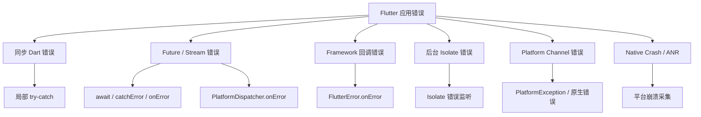
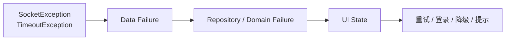

# Flutter 异常处理体系：从捕获、转换到恢复

> 异常处理的目标不是让应用“永远不报错”，而是在错误发生时保留证据、阻止错误扩散，并为用户提供符合业务语义的恢复路径。

---

## 一、为什么异常处理不能只写 `try-catch`

一个 Flutter 应用中的错误可能来自：

- 同步 Dart 代码。
- Future、Stream 等异步任务。
- Build、Layout、Paint 等 Framework 回调。
- 后台 Isolate。
- Platform Channel 和原生插件。
- Android/iOS Native Crash。
- 网络、数据库和业务规则。

这些错误的传播路径并不相同，单个 `try-catch` 或单个全局回调无法覆盖全部情况。



一个完整异常体系至少应回答：

1. 错误在哪里被捕获？
2. 错误如何转换成稳定的业务语义？
3. 哪些错误允许恢复，哪些错误必须终止当前流程？
4. 用户应该看到什么？
5. 研发如何获得足够的定位信息？

---

## 二、先区分 Error、Exception 与业务失败

### 2.1 Error

`Error` 通常表示编程错误或违反运行时约束，例如：

- `StateError`
- `ArgumentError`
- `RangeError`
- `LateInitializationError`
- `AssertionError`

这类错误通常不应被随意吞掉。开发阶段应尽早暴露并修复根因。

### 2.2 Exception

`Exception` 通常表示程序可以预期并处理的异常情况，例如：

- `FormatException`
- `TimeoutException`
- `SocketException`
- `PlatformException`

不过 Dart 并不强制只能抛出 `Exception` 或 `Error`，任何非空对象都可以被 `throw`。工程中应通过规范限制抛出类型，避免字符串等不稳定错误对象。

### 2.3 业务失败

“库存不足”“验证码错误”“用户取消支付”通常不是程序异常，而是业务流程的合法分支。

```dart
sealed class SubmitOrderResult {}

final class OrderSubmitted extends SubmitOrderResult {
  OrderSubmitted(this.orderId);
  final String orderId;
}

final class OutOfStock extends SubmitOrderResult {
  OutOfStock(this.productIds);
  final List<String> productIds;
}

final class PriceChanged extends SubmitOrderResult {
  PriceChanged(this.latestPrice);
  final Money latestPrice;
}
```

将预期业务结果建模为类型，比抛出通用异常更清晰：调用方可以穷尽处理，不需要解析错误字符串。

---

## 三、异常处理的四个动作

异常处理经常把不同职责混在同一个 `catch` 中。更清晰的做法是区分四个动作：

| 动作 | 目标 | 示例 |
|---|---|---|
| 捕获 | 在正确边界接住错误 | `try-catch`、`FlutterError.onError` |
| 转换 | 映射为上层能理解的语义 | SocketException → NetworkUnavailable |
| 记录 | 保存定位所需的证据 | 堆栈、版本、页面、Trace ID |
| 恢复 | 让当前流程安全继续或退出 | 重试、降级、返回上一页 |

每次捕获都应明确下一步：

- 已经处理并恢复。
- 转换后继续向上抛出。
- 记录后重新抛出。
- 错误不可恢复，终止当前业务流程。

最危险的做法是空 `catch`：

```dart
// 错误：既丢失证据，也无法知道状态是否可靠
try {
  await repository.save(data);
} catch (_) {}
```

---

## 四、同步异常

同步异常沿当前调用栈向上传播，可以使用 `try-catch-finally`：

```dart
User parseUser(Map<String, Object?> json) {
  try {
    return User.fromJson(json);
  } on FormatException catch (error, stackTrace) {
    throw UserDataException(
      message: 'Invalid user payload',
      cause: error,
      stackTrace: stackTrace,
    );
  }
}
```

### `on` 与 `catch`

- `on SomeException`：只处理指定类型。
- `catch (error)`：获得错误对象。
- `catch (error, stackTrace)`：同时获得原始堆栈。

应优先捕获能够实际处理的具体类型，把未知错误继续向上传播。

### `rethrow` 与 `throw error`

在 `catch` 中保留原始异常和堆栈时，应使用：

```dart
try {
  performOperation();
} catch (error, stackTrace) {
  logger.error('Operation failed', error, stackTrace);
  rethrow;
}
```

直接 `throw error` 可能改变错误抛出位置，使定位信息不如 `rethrow` 准确。

### `finally`

`finally` 无论成功还是失败都会执行，适合释放当前作用域资源：

```dart
final file = await File(path).open();
try {
  return await file.read(length);
} finally {
  await file.close();
}
```

不要在 `finally` 中无条件返回值，否则可能覆盖原始异常或正常结果。

---

## 五、Future 异常

### 5.1 使用 `await` 捕获

```dart
Future<Profile> loadProfile() async {
  try {
    return await api.fetchProfile();
  } on TimeoutException catch (error, stackTrace) {
    monitor.recordError(error, stackTrace);
    throw const ProfileLoadFailure.timeout();
  }
}
```

`await` 会把 Future 的异步错误重新带回当前 `async` 函数的异常控制流，因此可以使用普通 `try-catch`。

### 忘记 `await` 的问题

```dart
Future<void> submit() async {
  try {
    repository.save(); // Future 未等待
  } catch (error) {
    // 无法捕获 save() 后续异步完成时抛出的错误
  }
}
```

如果任务属于当前流程，应 `await`：

```dart
await repository.save();
```

如果确实是无需等待的后台任务，应显式表达，并在任务自身处理错误。可以使用 `unawaited` 表明这是有意识的决定：

```dart
unawaited(
  analytics.flush().catchError((Object error, StackTrace stackTrace) {
    monitor.recordError(error, stackTrace);
  }),
);
```

不要把 `unawaited` 当成忽略错误的工具。

### 5.2 Future 链错误传播

```dart
return api
    .fetchProfile()
    .then(cache.saveProfile)
    .catchError((Object error, StackTrace stackTrace) {
      monitor.recordError(error, stackTrace);
      throw ProfileLoadFailure.from(error);
    });
```

`catchError` 回调返回普通值时，错误链会被转换为成功完成。复杂逻辑优先使用 `async/await`，通常更容易保持错误边界清晰。

### 5.3 并发 Future

`Future.wait` 中一个任务失败后，组合 Future 会失败，但其他任务通常不会自动取消。

```dart
final results = await Future.wait([
  loadUser(),
  loadConfig(),
  loadRecommendations(),
]);
```

使用时应明确：

- 是否允许部分成功。
- 失败后是否需要取消其他操作。
- 已完成资源如何清理。
- 哪一个错误应反馈给用户。

---

## 六、Stream 异常

Stream 的数据、错误和完成是三类独立事件：

```dart
late final StreamSubscription<ConnectionState> subscription;

void startListening() {
  subscription = connection.states.listen(
    handleState,
    onError: (Object error, StackTrace stackTrace) {
      monitor.recordError(error, stackTrace);
      showDisconnectedState();
    },
    onDone: handleClosed,
  );
}

@override
void dispose() {
  subscription.cancel();
  super.dispose();
}
```

需要明确：

- 错误发生后 Stream 是否结束。
- 是否继续监听后续事件。
- `cancelOnError` 是否符合业务需求。
- Subscription 由谁持有和释放。
- 重连由 Stream 内部还是上层状态机负责。

`handleError` 可转换或过滤流中的错误，但不能让不可恢复的数据源自动恢复。重试和重连应建模为明确状态机。

---

## 七、Flutter Framework 异常

### 7.1 `FlutterError.onError`

Build、Layout、Paint 和手势回调等由 Flutter Framework 调用的代码，其异常通常交给 `FlutterError.onError`。

```dart
void installFlutterErrorHandler() {
  final previousHandler = FlutterError.onError;

  FlutterError.onError = (FlutterErrorDetails details) {
    monitor.recordFlutterError(details);
    previousHandler?.call(details);
  };
}
```

保留已有处理器很重要，否则可能覆盖框架默认输出或其他监控 SDK。

`FlutterErrorDetails` 中常见信息包括：

- Exception。
- StackTrace。
- 发生阶段。
- Diagnostic 信息。
- 相关 Context。

### ErrorWidget

Framework 在某些 Build 错误后会使用 ErrorWidget 替代失败子树。Release 环境可自定义更适合用户的兜底界面：

```dart
void configureErrorWidget() {
  ErrorWidget.builder = (details) {
    return const ColoredBox(
      color: Colors.white,
      child: Center(
        child: Text('页面暂时无法显示'),
      ),
    );
  };
}
```

ErrorWidget 只是显示兜底，不负责上报，也不能保证发生错误后的业务状态仍然可靠。

### 7.2 `PlatformDispatcher.onError`

没有被调用链处理的异步错误，可能到达当前 Root Isolate 的 `PlatformDispatcher.onError`：

```dart
void installPlatformErrorHandler() {
  final previousHandler = PlatformDispatcher.instance.onError;

  PlatformDispatcher.instance.onError = (error, stackTrace) {
    monitor.recordDartError(error, stackTrace);

    if (previousHandler != null) {
      return previousHandler(error, stackTrace);
    }

    return false;
  };
}
```

返回 `true` 表示错误已经被处理。不能为了“防止崩溃”无条件返回 `true`，否则可能吞掉不可恢复错误。

### 7.3 全局入口组合

```dart
Future<void> main() async {
  WidgetsFlutterBinding.ensureInitialized();

  installFlutterErrorHandler();
  installPlatformErrorHandler();
  configureErrorWidget();

  runApp(const App());
}
```

全局入口是最后的安全网，不应代替业务边界中的局部处理。到达全局入口的错误通常已经失去足够业务上下文，难以提供精确恢复。

---

## 八、Zone 的作用与边界

Zone 可以为异步调用链提供上下文，并通过 `runZonedGuarded` 处理该 Zone 内未捕获的异步错误：

```dart
Future<void> main() async {
  await runZonedGuarded(
    () async {
      WidgetsFlutterBinding.ensureInitialized();
      runApp(const App());
    },
    (error, stackTrace) {
      monitor.recordDartError(error, stackTrace);
    },
    zoneValues: {
      #sessionId: createSessionId(),
    },
  );
}
```

Zone 适合：

- 为异步调用链传递 Session、Trace 等上下文。
- 捕获该 Zone 中未处理的异步错误。
- 在测试中覆盖计时和异步行为。

Zone 不是：

- Native Crash 捕获器。
- 后台 Isolate 的通用捕获器。
- 所有 Framework 错误入口的替代品。
- 业务错误恢复策略。

Flutter 的错误入口和 Zone 行为可能随 SDK 版本演进，接入监控 SDK 时应遵循其当前官方初始化方式，避免重复上报。

---

## 九、后台 Isolate 异常

Isolate 拥有独立的内存和错误边界，主 Isolate 的全局处理器不能自动处理所有后台 Isolate 错误。

可以为显式创建的 Isolate 注册错误端口：

```dart
Future<Isolate> spawnWorker() async {
  final errorPort = ReceivePort();

  errorPort.listen((message) {
    final values = message as List<Object?>;
    final error = values[0];
    final stack = StackTrace.fromString(values[1] as String);
    monitor.recordIsolateError(error, stack);
  });

  return Isolate.spawn(
    workerMain,
    null,
    onError: errorPort.sendPort,
    errorsAreFatal: true,
  );
}
```

生产代码还应：

- 保存并关闭 ReceivePort。
- 监听 Isolate 退出。
- 明确任务失败后是否重建 Worker。
- 防止自动重启形成崩溃循环。
- 为消息协议设计结构化失败结果。

对于 `Isolate.run`，调用方应 `await` 返回 Future，并在当前业务边界处理错误。

---

## 十、Platform Channel 与原生异常

Platform Channel 调用失败时，Dart 侧通常收到 `PlatformException`：

```dart
Future<BiometricResult> authenticate() async {
  try {
    final success = await channel.invokeMethod<bool>('authenticate');
    return success == true
        ? const BiometricResult.success()
        : const BiometricResult.rejected();
  } on PlatformException catch (error, stackTrace) {
    monitor.recordError(error, stackTrace);

    return switch (error.code) {
      'not_available' => const BiometricResult.notAvailable(),
      'locked_out' => const BiometricResult.lockedOut(),
      _ => const BiometricResult.failed(),
    };
  }
}
```

### Platform Channel 错误设计

- 原生侧返回稳定错误码，不让 Dart 解析自然语言消息。
- 将“用户取消”与“系统失败”分开。
- 保留必要的原生 Cause 和错误上下文。
- Dart 层转换为领域语义，不让 UI 直接依赖插件错误码。
- 超时和生命周期失效需要明确处理。

### Native Crash

Android/iOS Native Crash 无法由 Dart `try-catch` 处理，需要平台崩溃采集能力，并上传符号文件完成堆栈符号化。

ANR、Watchdog 终止和 OOM 也不一定表现为普通 Dart 异常，需要平台侧指标和下次启动补报机制。

---

## 十一、分层错误模型

底层错误不应直接泄漏到 UI。推荐在层与层之间进行语义转换：



### 数据层

负责识别传输、协议、解析和存储错误：

```dart
sealed class DataFailure implements Exception {
  const DataFailure();
}

final class NetworkUnavailable extends DataFailure {
  const NetworkUnavailable();
}

final class RequestTimeout extends DataFailure {
  const RequestTimeout();
}

final class Unauthorized extends DataFailure {
  const Unauthorized();
}

final class InvalidPayload extends DataFailure {
  const InvalidPayload();
}
```

### Repository 或领域层

将基础设施错误转换成业务可以理解的失败：

```dart
Future<Profile> loadProfile() async {
  try {
    return await remoteDataSource.fetchProfile();
  } on Unauthorized {
    throw const SessionExpired();
  } on NetworkUnavailable {
    final cached = await localDataSource.findProfile();
    if (cached != null) return cached;
    throw const ProfileUnavailable();
  }
}
```

### UI 层

UI 不应展示底层异常字符串，而应根据状态提供恢复动作：

```dart
sealed class ProfileState {}

final class ProfileLoading extends ProfileState {}
final class ProfileData extends ProfileState {
  ProfileData(this.profile);
  final Profile profile;
}
final class ProfileOffline extends ProfileState {
  ProfileOffline(this.cachedProfile);
  final Profile cachedProfile;
}
final class ProfileError extends ProfileState {
  ProfileError(this.canRetry);
  final bool canRetry;
}
```

错误字符串适合日志，不适合作为跨层协议。

---

## 十二、恢复、重试与降级

异常被捕获后，不一定应该重试。

| 错误 | 常见处理 |
|---|---|
| 网络暂时不可达 | 等待网络恢复、手动重试或缓存降级 |
| 超时 | 幂等请求可有限重试 |
| 401 / Session 过期 | Single-flight 刷新或重新登录 |
| 业务参数错误 | 修正输入，不自动重试 |
| 解析不兼容 | 记录版本和 Payload Schema，使用安全兜底 |
| 用户取消 | 安静结束，不作为系统错误告警 |
| 编程错误 | 记录完整证据，修复代码，不盲目继续 |

### 重试原则

- 只自动重试幂等或具备幂等 Key 的操作。
- 使用指数退避与 jitter。
- 限制次数和总时间预算。
- 尊重 `Retry-After`。
- 页面销毁后取消或淘汰结果。
- 记录每次 Attempt，而不是只记录最终结果。

### 降级原则

- 使用缓存数据并显示新鲜度。
- 隐藏非核心模块。
- 只读模式替代高风险写操作。
- 提供明确且可执行的用户提示。

降级不是把所有错误转换为空数据。空数据可能被误认为真实业务结果，掩盖故障。

---

## 十三、错误记录与去重

异常上报至少应包含：

- 错误类型和结构化错误码。
- 原始 StackTrace。
- 应用版本、平台、系统和设备。
- 页面、业务动作和前后台状态。
- Trace ID、Request ID、Session ID。
- Feature Flag 和灰度组。
- 最近的有限 Breadcrumb。

### 避免重复上报

同一个异常可能在数据层记录后重新抛出，最终又被全局处理器记录。应明确所有权：

- 局部捕获并恢复：在局部记录。
- 转换后继续抛出：可添加上下文，但避免重复创建同类 Issue。
- 到达全局安全网：全局记录。

可以给错误附加已记录标记，或由监控 SDK 使用错误对象、Trace ID 和堆栈指纹去重。

### 脱敏

禁止上传：

- Token、Cookie、密码和密钥。
- 完整请求/响应正文。
- 用户输入全文。
- 未经匿名化的个人信息。

错误消息、URL 和 Breadcrumb 都应使用白名单与长度限制。

---

## 十四、异常处理测试

异常路径必须作为正常功能进行测试。

### Unit Test

```dart
test('maps timeout to RequestTimeout', () async {
  final api = FakeProfileApi(
    error: TimeoutException('request timeout'),
  );
  final dataSource = ProfileRemoteDataSource(api);

  await expectLater(
    dataSource.fetchProfile(),
    throwsA(isA<RequestTimeout>()),
  );
});
```

### Widget Test

```dart
testWidgets('shows retry action when profile loading fails', (tester) async {
  await tester.pumpWidget(
    TestApp(
      repository: FakeProfileRepository.failure(),
    ),
  );

  await tester.pump();

  expect(find.text('加载失败'), findsOneWidget);
  expect(find.text('重试'), findsOneWidget);
});
```

### 应覆盖的场景

- 超时、断网和服务端错误。
- Token 刷新失败和并发 401。
- JSON 字段缺失和未知枚举。
- 数据库迁移失败。
- 页面销毁后的异步结果。
- 多请求竞态。
- 重试耗尽和降级。
- 监控上报自身失败。

测试不仅验证“显示了错误文案”，还应验证资源释放、状态合法性和恢复操作。

---

## 十五、常见误区

### 误区一：全局 `try-catch` 可以捕获所有错误

Framework、后台 Isolate、Platform Channel 和 Native Crash 具有不同错误边界，单个入口无法全部覆盖。

### 误区二：捕获异常后不崩溃就是成功处理

错误发生后应用状态可能已经不可靠。成功处理意味着状态一致、用户有恢复路径且证据已保留。

### 误区三：所有失败都应该抛异常

库存不足、用户取消等是合法业务分支，更适合使用明确结果类型。

### 误区四：所有网络错误都应该自动重试

非幂等写操作可能重复执行；认证、参数和业务错误通常不会通过重试恢复。

### 误区五：全局错误处理器应该无条件返回已处理

这会吞掉不可恢复错误，使应用在未知状态下继续运行，还可能隐藏线上问题。

### 误区六：错误日志越详细越好

无边界记录请求正文和用户输入会造成隐私与安全风险。应采集定位所需的最少信息。

---

## 十六、落地清单

### 捕获边界

- [ ] 同步与 Future 错误在业务边界处理。
- [ ] Stream 配置错误回调并释放 Subscription。
- [ ] 接入 `FlutterError.onError`。
- [ ] 接入 `PlatformDispatcher.onError`。
- [ ] 后台 Isolate 具备错误与退出监听。
- [ ] Platform Channel 使用稳定错误码。
- [ ] Native Crash、ANR 和 OOM 使用平台能力采集。

### 错误语义

- [ ] 区分编程错误、基础设施异常和业务失败。
- [ ] 底层错误在层间转换，不直接泄漏到 UI。
- [ ] 用户取消与系统失败分开。
- [ ] UI 状态包含明确恢复动作。
- [ ] 重试具备幂等、退避、次数和时间预算。

### 工程治理

- [ ] 保留原始 StackTrace 和 Trace ID。
- [ ] 避免同一错误重复上报。
- [ ] 字段白名单和隐私脱敏。
- [ ] 异常路径具备 Unit 与 Widget Test。
- [ ] 监控 SDK 失败不影响主业务。

---

## 十七、总结

Flutter 异常处理可以归纳为五层：

1. **局部处理**：在最了解业务语义的位置捕获和恢复。
2. **分层转换**：把底层技术错误转换为稳定的领域失败。
3. **全局安全网**：覆盖未处理的 Framework 和异步错误。
4. **平台补充**：处理 Isolate、Platform Channel 和 Native 错误边界。
5. **工程闭环**：记录、去重、告警、测试和复盘。

最重要的原则是：

> 在最接近错误语义的位置处理可恢复问题，在全局入口记录未处理问题；不要吞掉未知错误，也不要把底层异常直接交给用户。

---

## 十八、问答复盘

### Q1：Error、Exception 和业务失败有什么区别？

**答：** Error 通常表示编程错误，Exception 通常表示可预期技术异常，业务失败是流程中的合法结果。业务失败更适合使用明确结果类型，而不是通用异常。

### Q2：为什么 `try-catch` 有时捕获不到 Future 的错误？

**答：** 如果 Future 没有被 `await`，其错误会在当前同步调用栈结束后产生。应等待该 Future，或在无需等待的任务自身建立错误处理。

### Q3：`FlutterError.onError` 和 `PlatformDispatcher.onError` 有什么区别？

**答：** 前者主要处理 Framework 回调中的错误，后者是 Root Isolate 未捕获异步错误的重要入口。二者互补，不能互相完全替代。

### Q4：`runZonedGuarded` 能捕获 Native Crash 吗？

**答：** 不能。Zone 作用于 Dart 异步上下文，Native Crash、ANR 和后台 Isolate 需要各自的平台或 Isolate 错误机制。

### Q5：捕获错误后是否应该总是返回成功兜底数据？

**答：** 不应该。伪造空数据可能掩盖真实故障并破坏业务语义。只有存在明确降级规则时才返回缓存或兜底，并标识数据状态。

### Q6：为什么错误不能直接显示 `error.toString()`？

**答：** 底层错误文本不稳定、不可本地化，还可能包含敏感信息。UI 应根据领域错误类型选择受控文案和恢复动作。

### Q7：自动重试需要满足什么条件？

**答：** 操作应幂等或具备幂等 Key，错误应具有瞬时恢复可能，并设置退避、jitter、次数和总时间预算。

### Q8：如何避免同一异常被重复上报？

**答：** 明确记录所有权：局部已恢复的错误由局部记录，继续抛出的错误主要在最终边界记录；同时使用 Trace ID、错误标记或堆栈指纹去重。
