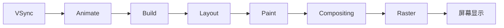

# Flutter 性能优化：从指标、定位到工程实践

> Flutter 性能优化不是给 Widget 添加 `const`，也不是看到卡顿就添加 `RepaintBoundary`。真正有效的优化，始于可复现的问题、可量化的指标和能够证明根因的运行数据。

---

## 一、先定义什么是“性能问题”

用户感知到的性能问题通常包括：

- 页面滑动或动画卡顿。
- 点击后响应迟缓。
- 首屏出现时间过长。
- 图片加载时界面停顿。
- 页面反复进入后内存持续增长。
- 应用安装包过大。
- 弱网环境下长时间白屏或无反馈。

这些现象的根因并不相同。卡顿可能发生在 Dart 执行、布局、绘制或 GPU 栅格化阶段；启动慢可能来自插件初始化、同步 I/O 或首屏依赖；内存增长可能来自对象泄漏，也可能只是缓存策略不合理。

因此，优化的第一步不是修改代码，而是把模糊感受转换为指标。

| 用户问题 | 主要指标 | 常用证据 |
|---|---|---|
| 动画、滑动卡顿 | 帧耗时、掉帧率、P95/P99 | Frame Chart、Timeline |
| 点击响应慢 | 输入到反馈时间 | Timeline、业务埋点 |
| 启动慢 | TTID、TTFD | 启动 Trace、首帧埋点 |
| 内存增长 | Heap、RSS、对象数量 | Memory View、Heap Snapshot |
| 图片导致 OOM | 解码内存、ImageCache | Allocation、缓存统计 |
| 包体过大 | 各组成部分体积 | App Size Tool |

其中：

- **TTID**：Time to Initial Display，初始界面显示时间。
- **TTFD**：Time to Full Display，页面主要内容完整可用的时间。
- **P95/P99**：95% 或 99% 请求/帧落在该值以内，比平均值更能反映长尾体验。

---

## 二、性能优化的正确闭环


一个合格的性能结论应包含：

1. **环境**：设备、系统、Flutter 版本、构建模式、刷新率。
2. **场景**：操作步骤、数据规模、网络条件。
3. **基线**：优化前的帧耗时、内存或启动数据。
4. **证据**：Timeline、调用栈、Heap Diff 或包体分析。
5. **修改**：一次只验证一个主要假设。
6. **结果**：优化后的相同指标。
7. **代价**：内存、复杂度、流量、代码维护成本。

### 为什么不能在 Debug 模式评估性能

Debug 模式包含断言、调试服务、JIT 和额外检查，执行方式与 Release 不同。性能分析通常应使用 **Profile 模式**；最终结论还应在 Release 和目标设备上验证。

模拟器适合功能调试，但 GPU、I/O、温控和系统调度与真机不同，不能代替真机性能基准。

---

## 三、理解一帧：卡顿发生在哪里



在 60 Hz 屏幕上，一帧预算约为：

```text
1000 ms ÷ 60 ≈ 16.67 ms
```

120 Hz 屏幕的预算约为：

```text
1000 ms ÷ 120 ≈ 8.33 ms
```

Flutter 的帧性能需要重点关注两条执行链路：

| 执行侧 | 主要工作 | 常见瓶颈 |
|---|---|---|
| UI Isolate | Dart、状态处理、Build、Layout、Paint 记录 | 同步计算、大范围重建、复杂布局 |
| Raster Thread | 将 Layer 和绘制指令栅格化 | 大图、模糊、阴影、离屏渲染、Shader |

### 判断原则

- UI 时间超预算：优先检查同步 Dart 工作、Build、Layout。
- Raster 时间超预算：优先检查图片、Shader、滤镜、裁剪和 Layer。
- 两边都超预算：可能是复杂 UI 同时增加了框架与 GPU 工作。
- 两边都正常但交互仍迟缓：检查输入调度、平台视图、I/O 和业务链路。

---

## 四、Build 性能优化

### 4.1 缩小状态影响范围

下面的代码把计数状态放在页面顶部，每次变化都会执行整个页面的 `build()`：

```dart
class ProductPage extends StatefulWidget {
  const ProductPage({super.key});

  @override
  State<ProductPage> createState() => _ProductPageState();
}

class _ProductPageState extends State<ProductPage> {
  int quantity = 1;

  @override
  Widget build(BuildContext context) {
    return Column(
      children: [
        const ProductGallery(),
        const ProductDescription(),
        QuantitySelector(
          quantity: quantity,
          onChanged: (value) => setState(() => quantity = value),
        ),
      ],
    );
  }
}
```

这不一定已经构成性能问题，因为稳定的 `const` 子配置可能快速复用。但如果页面 Build 中包含昂贵同步计算，应将状态和计算下沉到真正需要更新的区域。

可使用 `ValueNotifier` 建立局部更新边界：

```dart
class QuantitySection extends StatefulWidget {
  const QuantitySection({super.key});

  @override
  State<QuantitySection> createState() => _QuantitySectionState();
}

class _QuantitySectionState extends State<QuantitySection> {
  final quantity = ValueNotifier<int>(1);

  @override
  void dispose() {
    quantity.dispose();
    super.dispose();
  }

  @override
  Widget build(BuildContext context) {
    return ValueListenableBuilder<int>(
      valueListenable: quantity,
      builder: (context, value, child) {
        return Row(
          children: [
            child!,
            Text('$value'),
            IconButton(
              onPressed: () => quantity.value++,
              icon: const Icon(Icons.add),
            ),
          ],
        );
      },
      child: const Text('购买数量：'),
    );
  }
}
```

稳定的 `child` 不会在每次值变化时重新创建。

### 4.2 `const` 的真实作用

`const` 可以：

- 创建规范化常量对象。
- 稳定 Widget 配置身份。
- 帮助框架跳过部分无变化配置的更新。

`const` 不能直接：

- 消除昂贵的 Layout。
- 降低复杂绘制成本。
- 解决图片解码和 GPU Raster 卡顿。
- 修复过重的同步业务计算。

因此，“尽量写 `const`”是良好习惯，但不能代替性能定位。

### 4.3 避免在 `build()` 中执行昂贵工作

不应在 `build()` 中反复进行：

- 大列表排序、过滤和聚合。
- 大 JSON 解析。
- 同步文件读取。
- 网络请求。
- 创建重复 Future 或 Stream。

派生结果应在输入变化时计算，CPU 密集任务应先测量，再考虑移入 Isolate。

---

## 五、Layout 性能优化

Flutter Box 布局遵循：

> Constraints go down, sizes go up, parents set positions.

Layout 性能问题通常来自重复测量或过大的传播范围。

### 5.1 谨慎使用 Intrinsic 测量

`IntrinsicWidth`、`IntrinsicHeight` 为获得固有尺寸，可能要求子树额外执行测量。复杂树和长列表中，多次固有尺寸计算可能形成接近 `O(N²)` 的成本。

优先考虑：

- 明确约束或固定尺寸。
- 使用布局规则直接计算。
- 只在规模很小且确实需要时使用 Intrinsic。

### 5.2 为列表提供尺寸线索

如果列表项高度固定：

```dart
ListView.builder(
  itemCount: items.length,
  itemExtent: 72,
  itemBuilder: (context, index) {
    return ProductTile(product: items[index]);
  },
)
```

`itemExtent` 让滚动系统无需逐个测量即可推导滚动范围。高度不能固定但可以用样本代表时，可评估 `prototypeItem`。

### 5.3 避免无边界约束冲突

常见错误包括：

- `Column` 中直接放置需要无限高度的 ListView。
- 无界主轴上使用 Expanded。
- 嵌套多个同方向滚动容器。
- 为解决约束错误随意添加 `shrinkWrap: true`。

`shrinkWrap` 需要根据子节点推导滚动容器尺寸，可能增加布局成本。它是布局语义选择，不是通用错误修复开关。

---

## 六、Paint、Layer 与 Raster 优化

### 6.1 RepaintBoundary 的边界

`RepaintBoundary` 可以隔离重绘：当某个高频变化子树重绘时，稳定的相邻区域不必一起 Paint。

适合的场景：

- 复杂静态背景上存在小范围动画。
- 某个子树频繁 Paint，其他区域长期稳定。
- 绘制结果可能被 Raster Cache 复用。

代价包括：

- 增加 Layer 数量。
- 增加内存和合成成本。
- 子树持续变化时，缓存收益可能很低。

应使用 Repaint Rainbow、Frame Chart 和 Layer 信息验证，而不是给每个列表项都添加边界。

### 6.2 谨慎使用昂贵图形效果

重点关注：

- `BackdropFilter` 和大范围模糊。
- 复杂阴影。
- 多层透明叠加。
- 频繁裁剪和复杂 Path。
- 触发离屏缓冲的 `saveLayer`。

这些操作可能增加像素读写、内存带宽和 GPU 工作量。不过，具体 Widget 是否触发昂贵路径取决于引擎优化、参数和平台，不能仅根据 Widget 名称下结论。

### 6.3 Impeller 不会消除所有卡顿

Impeller 通过预先构建渲染管线等方式降低运行时 Shader 编译卡顿，但下面的问题仍然存在：

- 每帧绘制内容过多。
- 大面积模糊和离屏渲染。
- 图片尺寸过大。
- UI Isolate 同步计算过重。
- Layer 数量和合成成本过高。

Flutter 不同版本、平台和设备的渲染后端可能不同，应以目标环境的实际配置和 Trace 为准。

---

## 七、列表与图片优化

### 7.1 使用惰性列表

大量数据应使用 `ListView.builder`、`SliverList` 或 `SliverGrid`，只创建可见区域及缓存区域附近的节点。

同时注意：

- 使用稳定的业务 Key。
- 分页请求防止重复触发。
- 合理设置预取，不一次加载全部数据。
- 谨慎使用 KeepAlive，防止大量子树长期驻留。
- 避免列表项中创建新的 Controller、Future 或大型对象而不释放。

### 7.2 按显示尺寸解码图片

图片文件只有几百 KB，不代表解码后仍然很小。一张 `4000 × 3000` 的 RGBA 图片，粗略解码内存为：

```text
4000 × 3000 × 4 bytes ≈ 45.8 MiB
```

如果图片只显示为缩略图，应提供目标解码尺寸：

```dart
Image.network(
  product.imageUrl,
  width: 120,
  height: 120,
  cacheWidth: 240,
  cacheHeight: 240,
  fit: BoxFit.cover,
)
```

这里假设目标设备像素比约为 2，因此用 240 像素解码。真实项目应根据布局尺寸和 `devicePixelRatio` 计算，避免清晰度不足或过度解码。

### 图片优化清单

- 服务端提供适合目标尺寸的缩略图。
- 选择合适格式和压缩质量。
- 控制并发下载与预加载范围。
- 给 ImageCache 设置符合业务场景的上限。
- 页面退出后释放不再需要的大图引用。
- 用 Memory View 验证，而不是只比较图片文件大小。

---

## 八、异步与计算性能

### 8.1 I/O 异步不等于需要 Isolate

HTTP、数据库异步接口和文件异步读取主要等待外部 I/O，一般不会持续占用 UI Isolate。把所有异步任务放入 Isolate 反而会增加启动和消息通信成本。

适合 Isolate 的通常是 CPU 密集任务：

- 大 JSON 解析。
- 图片处理。
- 压缩、加密。
- 大规模数据排序或计算。

### 8.2 避免 Microtask 饥饿

Dart 会在处理下一个 Event 前清空 Microtask Queue。持续递归追加 Microtask 会阻塞输入、Timer 和绘帧事件。

长计算任务应拆分、下沉到 Isolate，或设计可让出执行权的批处理，而不是用 Microtask 包装后假装异步。

---

## 九、内存优化与泄漏定位

内存上涨不一定等于泄漏。需要区分：

- 正常缓存增长。
- GC 尚未回收的短期对象。
- 持续存在且业务上不再需要的对象。
- Native、图片或 GPU 侧内存。

### 常见泄漏来源

- 未释放 AnimationController、TextEditingController、FocusNode。
- 未取消 StreamSubscription、Timer、Observer。
- 单例、事件总线或闭包持有页面对象。
- GlobalKey、Overlay、KeepAlive 让页面仍处于有效树中。
- 无上限业务缓存或 ImageCache。

### 定位流程


不要只看总内存曲线。应找到具体未释放类型及其引用链，确认是谁仍然持有对象。

---

## 十、启动性能优化

启动优化应区分：

- 进程与 Flutter Engine 初始化。
- Dart 入口与插件注册。
- 首帧显示。
- 首屏数据完整可用。

常见优化方向：

1. 首帧前只保留真正必要的初始化。
2. 相互独立的初始化任务并行执行。
3. 分析插件是否在启动阶段执行同步工作。
4. 非首屏能力延迟到首次使用时初始化。
5. 先显示稳定骨架，再加载非关键数据。
6. 为首屏数据设计缓存和超时兜底。

不要为了缩短首帧而让页面显示不可用的空壳。应同时测量初始显示和完整可交互时间。

---

## 十一、包体积优化

包体优化应先使用 App Size Tool 确定组成：

- Dart AOT Snapshot。
- Native Library。
- 图片、字体和其他 Asset。
- 第三方原生 SDK。
- 多 ABI 产物。

常见措施：

- 删除未使用资源和依赖。
- 使用合适的图片格式和尺寸。
- 对字体做子集化。
- 按发布平台拆分 ABI。
- 检查大型第三方 SDK 的必要性。
- 正确启用图标 Tree Shaking。

包体变小不一定让运行时更快，但会影响下载、安装、更新和部分启动 I/O。应把包体作为独立指标治理。

---

## 十二、性能优化常见误区

### 误区一：所有 Widget 都应该加 `const`

`const` 值得使用，但它主要作用于配置更新，不能解决所有流水线问题。

### 误区二：Widget 拆得越小，性能越好

拆分有利于结构和更新边界，但无意义的包装会增加树层级。是否减少工作取决于状态依赖和更新路径。

### 误区三：卡顿就是 Build 太多

Raster、图片解码、Shader、同步 I/O 和平台视图都可能造成卡顿。必须先看 Frame Chart。

### 误区四：`shrinkWrap: true` 可以解决所有滚动布局问题

它改变滚动容器的尺寸计算方式，并可能增加布局成本。应先理解父约束和滚动结构。

### 误区五：内存上涨就是泄漏

缓存、延迟 GC 和 Native 内存都会让曲线上涨。泄漏需要通过持续增长对象和 Retaining Path 证明。

### 误区六：一次优化截图足以证明结果

性能数据存在波动，应固定环境、多次运行，并观察分位数和长尾，而不是只选择最好的一次。

---

## 十三、性能排查清单

### 帧性能

- [ ] 使用 Profile 模式和目标真机。
- [ ] 记录设备刷新率与帧预算。
- [ ] 区分 UI 和 Raster 超时。
- [ ] 检查同步计算、Build、Layout、Paint。
- [ ] 检查图片、Shader、滤镜和 Layer。

### 内存

- [ ] 重复执行同一页面进入退出流程。
- [ ] 比较 Heap Snapshot。
- [ ] 查找增长对象的 Retaining Path。
- [ ] 检查 Controller、Subscription 和缓存。
- [ ] 同时关注 Dart Heap、图片与 Native 内存。

### 启动与包体

- [ ] 分别测量 TTID 与 TTFD。
- [ ] 检查同步初始化和插件启动工作。
- [ ] 延迟非首屏依赖。
- [ ] 使用 App Size Tool 定位具体组成。
- [ ] 在修改后重新测量用户可感知指标。

---

## 十四、总结

Flutter 性能优化可以归纳为以下原则：

1. 先定义用户问题和量化指标，再修改代码。
2. 使用 Profile 模式和目标真机采集证据。
3. 区分 UI Isolate 与 Raster Thread 的瓶颈。
4. Build、Layout、Paint、Raster 需要使用不同优化手段。
5. 列表应惰性构建，图片应按显示尺寸解码。
6. Isolate 适合 CPU 密集任务，不是所有异步工作的默认答案。
7. 内存泄漏需要通过对象增长和引用链证明。
8. 每次优化都要做相同环境下的前后对比，并建立回归监控。

最终应形成这样的工程闭环：

> **发现问题 → 建立指标 → 采集证据 → 确认根因 → 最小修改 → 对比验证 → 持续监控**

---

## 十五、问答复盘

### Q1：为什么不能在 Debug 模式判断 Flutter 线上性能？

**答：** Debug 模式包含 JIT、断言和调试服务，执行方式与 Release 不同。应使用 Profile 模式定位，并在目标设备的 Release 环境验证最终结果。

### Q2：UI 帧耗时和 Raster 帧耗时分别代表什么？

**答：** UI 侧主要包含 Dart、Build、Layout 和 Paint 记录；Raster 侧负责将绘制指令和 Layer 栅格化。两者超时对应不同的排查方向。

### Q3：添加 `const` 为什么不一定解决卡顿？

**答：** `const` 主要稳定 Widget 配置，可能减少部分更新工作。如果瓶颈位于 Layout、图片解码、滤镜或 GPU Raster，`const` 不会直接降低这些成本。

### Q4：什么时候适合添加 RepaintBoundary？

**答：** 当一个子树频繁重绘、相邻区域稳定，并且隔离后能够减少重复 Paint 时适合。它会增加 Layer 和内存，必须通过 Repaint Rainbow 与 Frame Chart 验证收益。

### Q5：为什么图片文件只有几百 KB，仍可能导致 OOM？

**答：** 文件大小是压缩后的体积，渲染前需要解码为像素。RGBA 图片通常约占宽 × 高 × 4 字节，多张高分辨率图片会快速消耗内存。

### Q6：大 JSON 解析是否应该直接放到 Isolate？

**答：** 不应直接假设。先在目标设备测量解析是否造成帧超时；只有 CPU 成本足够高且超过 Isolate 启动与消息传递成本时，迁移才有收益。

### Q7：内存曲线持续上升是否说明发生泄漏？

**答：** 不一定，可能是缓存或 GC 尚未执行。需要重复业务场景、比较 Heap Snapshot，并通过 Retaining Path 证明不再需要的对象仍被引用。

### Q8：如何证明一次性能优化真实有效？

**答：** 固定设备、版本、构建模式、数据和操作流程，多次采集优化前后相同指标，并比较分位数与长尾，同时记录修改带来的内存、复杂度等副作用。
