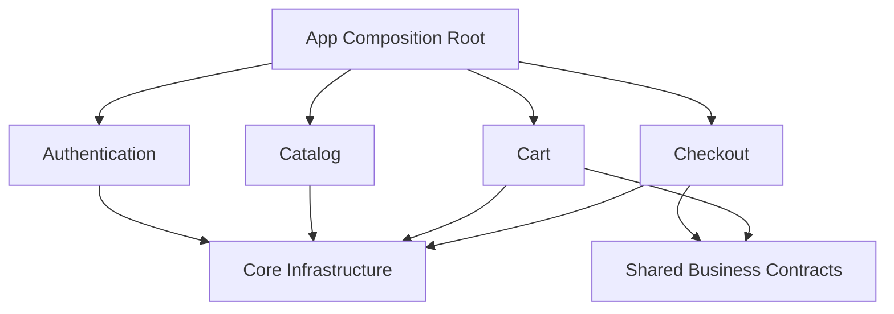
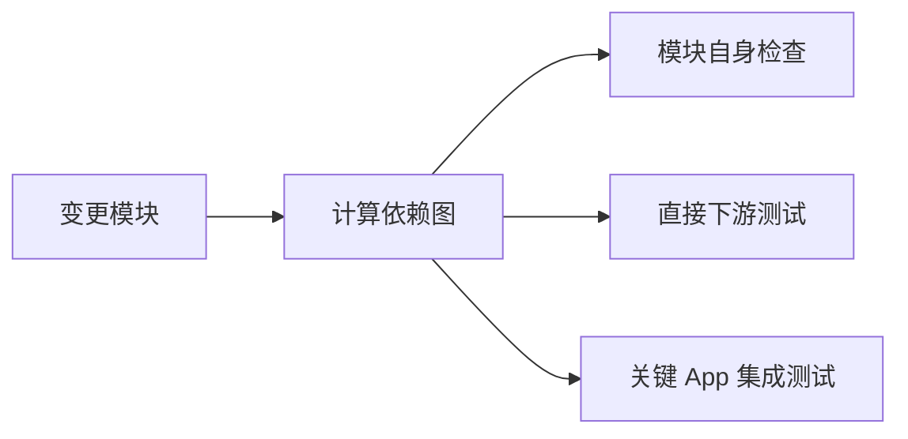

# Flutter 模块化架构：从单体项目到可治理的业务边界

> 模块化不是把 `lib/` 拆成许多 Package，而是建立稳定的业务边界、明确的依赖方向和受控的公共 API，使团队能够独立开发、测试和演进。

---

## 一、什么时候需要模块化

小型 Flutter 应用通常不需要复杂模块体系。随着业务和团队增长，项目可能出现：

- 任意页面都能直接调用任意 Service。
- 修改登录模块导致多个无关页面编译失败。
- 公共目录持续膨胀，没有明确负责人。
- 相同业务规则在多个页面重复实现。
- 测试需要启动整个应用和大量无关依赖。
- 多个团队频繁修改同一批文件，冲突严重。
- 构建、代码分析和生成时间不断增长。
- 功能无法独立发布、替换或删除。

这些问题的根因通常不是文件数量，而是边界缺失。

模块化希望实现：

1. 一个模块围绕明确业务能力组织代码。
2. 模块内部实现默认不可见。
3. 跨模块调用只能通过稳定契约。
4. 依赖关系是有方向、可检查的有向无环图。
5. 模块可以独立测试，必要时可以独立运行。


### 不适合立即模块化的情况

- 产品仍处于快速验证期，业务边界频繁变化。
- 团队规模很小，当前耦合尚未产生实际成本。
- 只是为了追求架构形式，没有明确问题和衡量指标。
- 计划一次性重写整个项目，却没有渐进迁移路径。

模块化本身会增加 Package、契约、版本和工具治理成本，应在收益高于成本时实施。

---

## 二、目录分层不等于模块化

传统 Layer First 结构：

```text
lib/
├── pages/
├── widgets/
├── models/
├── services/
├── repositories/
└── utils/
```

它按技术类型分类，但同一个订单功能会分散在多个目录。随着业务增加，开发者必须跨越整个项目理解一项功能。

Feature First 结构：

```text
lib/
├── features/
│   ├── authentication/
│   ├── catalog/
│   ├── cart/
│   └── checkout/
├── design_system/
└── app/
```

Feature First 让业务相关代码聚合，但如果模块之间仍然可以任意导入内部文件，它只是目录整理，并没有形成真正边界。

真正的模块化还需要：

- Package 或静态分析层面的可见性约束。
- 公共 API 出口。
- 明确依赖规则。
- 模块所有权。
- 自动化边界检查。

---

## 三、如何划分模块

### 3.1 以业务能力为主

优先按相对稳定的业务能力划分：

- Authentication：登录、Token、会话。
- Catalog：商品目录和详情。
- Cart：购物车。
- Checkout：结算和订单提交。
- Payment：支付能力。
- Profile：用户资料。

业务能力比页面更稳定。一个 Checkout 模块可能包含多个页面、状态、Repository 和数据模型，而不是“一页一个 Package”。

### 3.2 基础模块

除业务模块外，通常还需要有限的基础能力：

| 模块 | 责任 |
|---|---|
| app | 应用组装、根路由、全局生命周期 |
| design_system | Token、主题和稳定 UI 组件 |
| networking | HTTP 基础设施、拦截器和协议错误 |
| persistence | 数据库连接、迁移和底层存储 |
| observability | 日志、Trace、监控接口 |
| platform | 平台能力抽象和插件封装 |

基础模块不应包含具体业务规则。例如 `networking` 可以知道 HTTP 401，但“401 后退出登录还是刷新会话”属于认证业务策略。

### 3.3 模块粒度判断

适合独立模块的信号：

- 有明确业务术语和负责人。
- 有独立生命周期和数据边界。
- 能定义相对稳定的输入、输出契约。
- 被多个场景复用，但不需要暴露内部实现。
- 变化频率与其他部分明显不同。

不适合拆分的信号：

- 只有一个很小的 Widget。
- 必须频繁访问另一个模块的大量内部状态。
- 公共 API 比内部实现还复杂。
- 拆分后仍由同一批文件共同变化。

模块粒度过小会形成 Package 爆炸；粒度过大则无法隔离变化。

---

## 四、模块内部结构

模块内部是否分层，应由业务复杂度决定。一种常见结构是：

```text
checkout/
├── lib/
│   ├── checkout.dart
│   └── src/
│       ├── presentation/
│       ├── application/
│       ├── domain/
│       └── data/
├── test/
└── pubspec.yaml
```

### 各层职责

| 层 | 职责 |
|---|---|
| presentation | Widget、页面状态和用户意图 |
| application | 编排用例、事务和跨领域流程 |
| domain | 业务实体、规则和领域契约 |
| data | API、数据库、DTO 和 Repository 实现 |

并非每个模块都需要四层。一个只封装系统分享能力的模块可能只需要接口和平台实现。不要为保持目录对称创建没有行为的 UseCase、Mapper 和 Entity。

### 内部文件默认私有

Dart 以下划线提供库级私有，而不是 Package 级私有。工程上通常通过 `lib/src/` 表达内部实现，并只从顶层库文件导出公共 API。

```dart
// lib/checkout.dart
export 'src/public/checkout_entry.dart';
export 'src/public/checkout_result.dart';
export 'src/public/checkout_routes.dart';
```

消费者只允许：

```dart
import 'package:checkout/checkout.dart';
```

不允许：

```dart
// 错误：绕过模块公共边界
import 'package:checkout/src/data/checkout_repository_impl.dart';
```

仅靠约定容易失效，应使用 Lint、CI 脚本或依赖分析工具禁止跨 Package 导入 `src/`。

---

## 五、依赖方向

模块依赖应形成有向无环图：



### 依赖规则

- App 可以依赖所有需要组装的模块。
- 业务模块不反向依赖 App。
- 业务模块不直接访问另一个模块的内部实现。
- Core 不依赖具体业务模块。
- 跨业务契约放在拥有该能力的模块，或极少量独立契约模块。
- 禁止循环依赖。

### 为什么循环依赖危险

假设 Checkout 依赖 Cart，Cart 又依赖 Checkout：

- 两个模块无法独立理解和测试。
- 初始化和对象生命周期难以推断。
- 任一模块修改都会影响另一方。
- Package 依赖甚至无法正确建立。

循环依赖通常说明：

- 边界划分错误。
- 公共概念缺少明确所有者。
- 双向交互应该通过上层编排。
- 事件被误用为直接同步调用的替代品。

---

## 六、公共 API 设计

公共 API 是模块真正的边界。一个好的 API 应具备：

- 小而明确。
- 使用业务语义。
- 不泄漏内部 DTO、状态管理框架和插件类型。
- 对调用方保持兼容。
- 有明确错误与生命周期语义。

### 6.1 不泄漏内部实现

错误设计：

```dart
abstract interface class CheckoutApi {
  CheckoutBloc get bloc;
  DioException? get lastError;
  CheckoutDto submit(CheckoutRequestDto request);
}
```

它把 BLoC、Dio 和内部 DTO 暴露给消费者，导致实现无法独立替换。

更稳定的契约：

```dart
abstract interface class CheckoutService {
  Future<CheckoutResult> submit(CheckoutCommand command);
}

final class CheckoutCommand {
  const CheckoutCommand({
    required this.cartId,
    required this.addressId,
    required this.paymentMethodId,
  });

  final String cartId;
  final String addressId;
  final String paymentMethodId;
}

sealed class CheckoutResult {
  const CheckoutResult();
}

final class CheckoutSucceeded extends CheckoutResult {
  const CheckoutSucceeded(this.orderId);
  final String orderId;
}

final class CheckoutRejected extends CheckoutResult {
  const CheckoutRejected(this.reason);
  final CheckoutRejection reason;
}
```

### 命令与查询

模块 API 可以区分：

- Command：触发状态变化，如提交订单。
- Query：读取数据，如查询购物车摘要。
- Event：已经发生的业务事实，如会话已失效。

这不是要求完整实现 CQRS，而是让调用语义清晰。

### 6.2 API 演进

- 新增可选能力优先保持向后兼容。
- 删除和重命名先经过弃用周期。
- 错误类型和枚举保留 `unknown` 兼容新值。
- 跨模块模型保持最小字段集合。
- Breaking Change 提供迁移说明。

Monorepo 可以统一修改调用方，但并不意味着可以无成本破坏公共 API。稳定契约仍能减少联动修改。

---

## 七、依赖倒置与 Composition Root

模块内部可以依赖抽象，由应用组装真实实现：

```dart
abstract interface class CheckoutRepository {
  Future<CheckoutResult> submit(CheckoutCommand command);
}

final class CheckoutController {
  CheckoutController(this.repository);

  final CheckoutRepository repository;
}
```

App 作为 Composition Root 负责构造依赖：

```dart
CheckoutModule buildCheckoutModule(AppDependencies app) {
  final repository = RemoteCheckoutRepository(
    httpClient: app.httpClient,
    database: app.database,
  );

  return CheckoutModule(
    controllerFactory: () => CheckoutController(repository),
  );
}
```

这样做的价值是：

- 模块不知道全局 Service Locator。
- 测试可以注入 Fake Repository。
- 对象生命周期由组装层明确管理。
- 基础设施实现可以替换。

不需要为每个类都创建接口。抽象应放在变化边界、跨层契约和外部依赖处。

---

## 八、模块化路由

路由是跨模块依赖最容易失控的地方。

### 8.1 模块拥有页面实现

每个业务模块负责其页面和局部路由，App 负责组合顶层路由。

模块可以导出路由描述：

```dart
abstract interface class CheckoutRoutes {
  RouteBase get route;
}

final class CheckoutRoutePaths {
  static const checkout = '/checkout';
  static const result = '/checkout/result';
}
```

实际项目使用 `go_router`、`auto_route` 或 Router API 时，应避免让业务模块直接持有整个 App Router。

### 8.2 使用业务入口而不是页面类

Catalog 不应直接导入 CheckoutPage：

```dart
// 不推荐
Navigator.of(context).push(
  MaterialPageRoute(builder: (_) => CheckoutPage(cartId: cartId)),
);
```

可以通过受控入口：

```dart
abstract interface class CheckoutNavigator {
  Future<CheckoutNavigationResult?> openCheckout({
    required BuildContext context,
    required String cartId,
  });
}
```

或者让上层 Router 根据声明式导航状态完成跳转。关键不是具体形式，而是调用方依赖业务意图，不依赖目标页面实现。

### 8.3 Deep Link

外部 Deep Link 应先在 App 层解析为受控目标，再由模块处理：


模块不应各自读取原始外部 URL，否则校验、鉴权和回退策略会分散。

---

## 九、模块通信

跨模块通信主要有三种方式。

### 9.1 同步契约调用

调用方需要立即获取结果时，通过公开接口调用：

```dart
final summary = await cartQuery.getSummary();
```

适合清晰的请求/响应关系。

### 9.2 上层流程编排

一个流程同时涉及多个模块时，应由 Application 层或 App 层编排：

```dart
final class LogoutCoordinator {
  LogoutCoordinator({
    required this.session,
    required this.cart,
    required this.profile,
  });

  final SessionService session;
  final CartCache cart;
  final ProfileCache profile;

  Future<void> logout() async {
    await session.revoke();
    await Future.wait([
      cart.clear(),
      profile.clear(),
    ]);
  }
}
```

Authentication 不需要反向依赖 Cart 和 Profile。

### 9.3 领域事件

多个模块只需要知道“某件事已经发生”时，可使用有限的领域事件：

```dart
sealed class DomainEvent {
  const DomainEvent();
}

final class SessionExpired extends DomainEvent {
  const SessionExpired();
}
```

事件机制需要明确：

- 事件所有者。
- 是否保证顺序。
- 是否允许丢失。
- 订阅生命周期。
- 失败处理。
- 是否需要持久化。

不要使用全局事件总线隐藏所有依赖。无法静态追踪的任意事件会把显式耦合变成隐式耦合。

---

## 十、Design System 与共享代码

`common`、`shared`、`utils` 很容易成为无边界垃圾场。

### 10.1 Design System

Design System 可以包含：

- Color、Typography、Spacing Token。
- 主题。
- Button、Input、Dialog 等稳定组件。
- 可访问性和响应式规则。

不应包含：

- 订单按钮。
- 登录业务文案。
- 依赖特定 Repository 的 Widget。
- 只被一个业务使用的复杂组件。

业务组件应留在业务模块，稳定且无业务语义的视觉能力才进入 Design System。

### 10.2 共享业务模型

不要因为多个模块都需要 User，就立刻创建包含所有字段的全局 User Model。不同模块可能只需要：

```dart
final class UserIdentity {
  const UserIdentity({
    required this.id,
    required this.displayName,
  });

  final String id;
  final String displayName;
}
```

共享模型越大，任意字段变化影响的模块越多。应共享最小稳定契约，而不是数据库或 API 的完整对象。

---

## 十一、Monorepo 与 Package 管理

模块化项目通常采用 Monorepo：

```text
workspace/
├── apps/
│   └── customer_app/
├── features/
│   ├── authentication/
│   ├── catalog/
│   ├── cart/
│   └── checkout/
├── packages/
│   ├── design_system/
│   ├── networking/
│   └── observability/
└── pubspec.yaml
```

现代 Dart/Flutter 工具链支持 Pub Workspace。具体配置能力取决于项目使用的 Dart/Flutter 版本，应以当前官方文档为准。

概念性根配置：

```yaml
name: commerce_workspace
publish_to: none

environment:
  sdk: ^3.6.0

workspace:
  - apps/customer_app
  - features/authentication
  - features/catalog
  - features/cart
  - features/checkout
  - packages/design_system
  - packages/networking
```

### Monorepo 的价值

- 原子提交跨模块变更。
- 统一静态分析和测试。
- 共享工具和版本约束。
- 更容易检查依赖图。
- 减少私有 Package 发布负担。

### Monorepo 不能自动解决

- 模块边界。
- 循环依赖。
- 公共 API 膨胀。
- 团队所有权。
- 构建性能。

仓库放在一起只是物理组织，仍需架构治理。

---

## 十二、测试与构建

### 12.1 模块测试

每个模块应具备：

- Domain 和 Application Unit Test。
- Repository Contract Test。
- Widget Test。
- 公共 API 兼容测试。
- 必要的 Golden 或 Integration Test。

模块测试不能依赖完整 App 启动，除非验证的就是跨模块集成。

### 12.2 Contract Test

当接口有多个实现时，使用相同测试套件验证行为：

```dart
void checkoutRepositoryContract(
  CheckoutRepository Function() createRepository,
) {
  test('returns rejected result when cart is empty', () async {
    final repository = createRepository();

    final result = await repository.submit(emptyCartCommand);

    expect(result, isA<CheckoutRejected>());
  });
}
```

Fake、内存实现和真实实现可以复用同一行为契约。

### 12.3 增量 CI

大型 Monorepo 可以根据依赖图只运行受影响模块及其下游测试：



但安全、基础设施和公共契约变更影响面较大，不能为了速度遗漏必要回归。应给模块标注风险等级和测试策略。

---

## 十三、模块所有权与治理

没有治理的模块化会逐渐退化为多个互相耦合的 Package。

每个模块应明确：

- 业务责任。
- Owner。
- 公共 API。
- 允许的上游和下游。
- 数据所有权。
- 生命周期。
- 测试和质量门禁。
- 弃用与迁移策略。

### 自动化规则

- 禁止导入其他 Package 的 `src/`。
- 禁止业务模块依赖 App。
- 检测循环依赖。
- 限制基础模块反向依赖业务。
- 检查公开 API 变化。
- 对废弃 API 设置清理期限。

架构文档只能解释规则，静态分析和 CI 才能持续执行规则。

---

## 十四、从单体项目渐进迁移

一次性重写通常风险高、周期长，也难以持续交付。更稳妥的方式是渐进迁移。


### 迁移步骤

1. 绘制当前依赖图，识别高耦合和高变化区域。
2. 选择边界较清晰、收益明显的一个业务试点。
3. 先定义最小公共契约，不立即重写内部实现。
4. 使用 Adapter 包裹旧代码。
5. 迁移一个真实调用方并补充测试。
6. 加入静态规则，阻止新代码继续绕过边界。
7. 分批迁移并删除旧入口。
8. 使用数据评估收益，再决定下一模块。

### 衡量指标

- 跨模块非法依赖数量。
- 循环依赖数量。
- 模块独立测试耗时。
- 变更影响文件和团队数量。
- CI 总耗时和缓存命中率。
- 公共 API 规模和变化频率。
- 模块相关故障与回滚时间。

模块数量本身不是成功指标。

---

## 十五、常见误区

### 误区一：拆成 Package 就完成了模块化

没有公共 API、依赖方向和治理规则的 Package 仍然可以高度耦合。

### 误区二：模块越小越灵活

过小模块会增加版本、构建、依赖和认知成本。模块应围绕稳定业务能力，而不是单个页面或 Widget。

### 误区三：所有公共代码都放进 Core

Core 会变成全局垃圾场，并反向承载业务逻辑。只有稳定、无业务语义的基础能力适合进入 Core。

### 误区四：事件总线可以实现模块解耦

无约束事件总线隐藏依赖和时序，使调用关系难以分析。跨模块同步需求优先使用显式接口，流程由上层编排。

### 误区五：每个类都需要接口和 UseCase

抽象只应出现在变化边界和跨模块契约处。机械分层会增加样板代码，而不提高隔离能力。

### 误区六：Monorepo 会自动提升构建速度

Monorepo 提供统一管理基础，构建速度仍依赖依赖图、缓存、代码生成和增量 CI 设计。

---

## 十六、落地清单

### 边界

- [ ] 模块按业务能力划分，而不是一页一个 Package。
- [ ] 模块职责、Owner 和数据所有权明确。
- [ ] 内部实现放在 `lib/src/`，只从顶层库导出公共 API。
- [ ] 公共 API 不泄漏内部状态框架、DTO 和插件类型。
- [ ] 跨模块共享最小稳定模型。

### 依赖

- [ ] 依赖形成有向无环图。
- [ ] Core 不依赖具体业务。
- [ ] App 作为 Composition Root 组装模块。
- [ ] 跨模块流程由上层编排。
- [ ] CI 检测循环依赖和非法 `src/` 导入。

### 工程

- [ ] 模块可以独立运行 Unit 和 Widget Test。
- [ ] 多实现契约具备 Contract Test。
- [ ] 公共 API 变化有弃用和迁移策略。
- [ ] 增量 CI 根据依赖影响运行测试。
- [ ] 单体迁移采用 Adapter 和渐进替换。

---

## 十七、总结

Flutter 模块化可以归纳为六个关键点：

1. **业务边界**：模块围绕稳定业务能力，而不是技术文件类型。
2. **封装**：内部实现默认不可见，只暴露最小公共 API。
3. **依赖方向**：模块形成有向无环图，App 负责最终组装。
4. **通信契约**：同步调用使用接口，复杂流程由上层编排，事件只表达业务事实。
5. **工程治理**：静态分析、CI、测试和所有权持续维护边界。
6. **渐进迁移**：先建立契约和约束，再逐步替换旧实现。

模块化的最终目标不是得到更多 Package，而是：

> 让业务变化尽可能停留在所属模块内部，使团队能够在明确边界下独立开发、验证和演进。

---

## 十八、问答复盘

### Q1：Feature First 目录结构是否等于模块化？

**答：** 不等于。它只是按业务聚合文件；真正模块化还需要公共 API、依赖方向、可见性约束、测试和治理规则。

### Q2：一个模块应该按页面还是按业务能力拆分？

**答：** 优先按稳定业务能力拆分。一个业务模块可以包含多个页面、状态和数据源，一页一个模块通常粒度过小。

### Q3：为什么不允许导入其他 Package 的 `src/`？

**答：** `src/` 属于内部实现，直接导入会绕过公共契约，使调用方与实现细节耦合，后续重构无法控制影响范围。

### Q4：业务模块之间出现循环依赖时应该如何处理？

**答：** 重新检查边界，将共同契约归属到明确模块，或由上层 Application/App 编排双向流程，而不是让两个模块互相引用。

### Q5：事件总线为什么不一定解耦？

**答：** 它隐藏了发布者和订阅者之间的依赖、顺序和失败语义。依赖仍然存在，只是从编译期变成运行时，更难追踪。

### Q6：是否应该给每个 Repository、UseCase 和 Service 都创建接口？

**答：** 不应该。接口适合外部依赖、跨模块契约和可能替换的变化边界。无差别抽象只会增加样板代码。

### Q7：Monorepo 对模块化最大的价值是什么？

**答：** 它支持跨模块原子修改、统一工具链和依赖图治理，但不会自动产生正确边界，也不会自动提升构建速度。

### Q8：如何判断一次模块化改造是否有效？

**答：** 观察非法依赖、循环依赖、变更影响范围、独立测试时间、公共 API 稳定性和跨团队冲突，而不是只统计 Package 数量。
