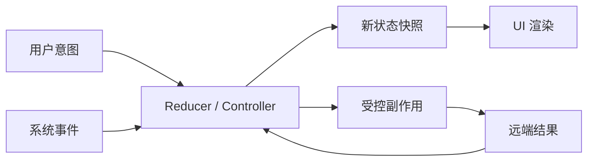
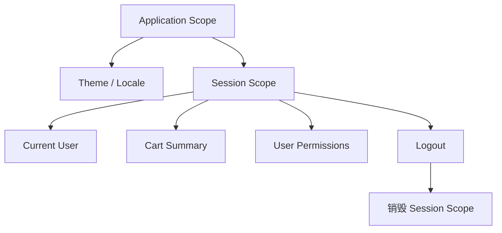
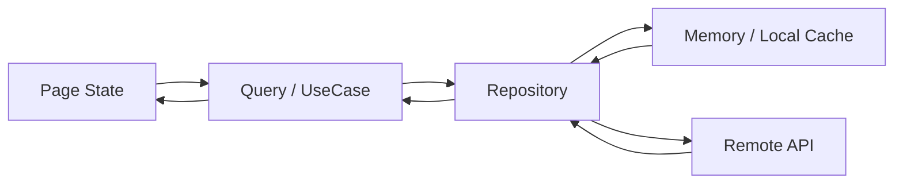
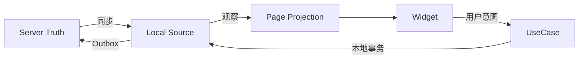
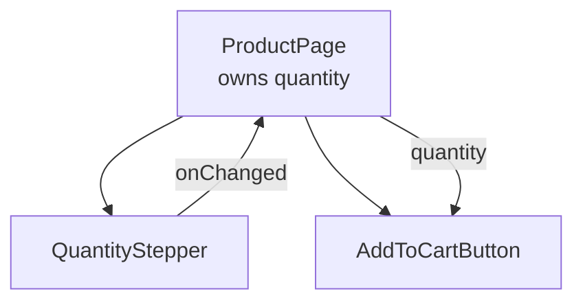
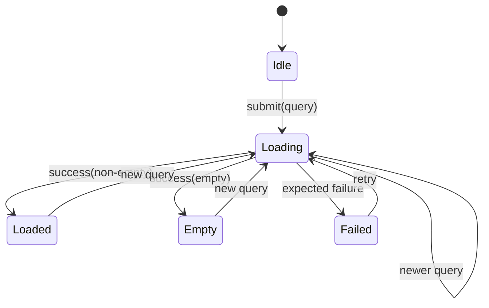
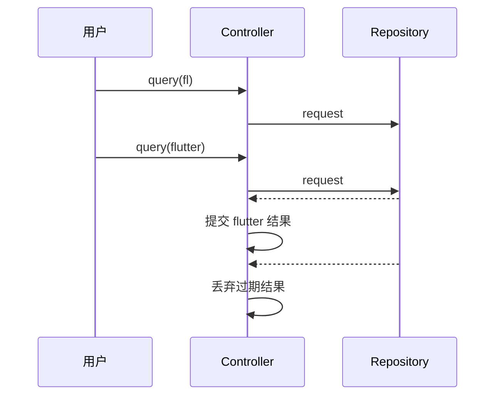

# Flutter 状态设计：从状态分类到可验证的 UI 状态机

> 状态管理的第一步不是选择 Provider、Riverpod 或 BLoC，而是回答三个问题：状态是什么、谁拥有它、它应该存活多久。

---

## 一、为什么状态问题首先是建模问题

一个商品搜索页面可能同时包含：

- 搜索框是否获得焦点；
- 当前输入的关键词和筛选条件；
- 请求是否加载中；
- 服务端返回的商品、分页游标和缓存时间；
- 用户登录信息与购物车数量；
- “加入购物车成功”的提示；
- 当前请求是否已被更新请求淘汰。

如果把它们全部塞进一个全局 `AppState`，页面退出后仍会保留焦点和错误提示；如果全部放进 Widget，本应跨页面共享的购物车又会出现多个副本。

很多所谓的状态管理问题，本质上来自：

- 状态类型没有区分；
- 所有者与生命周期不明确；
- 同一个事实被复制到多个位置；
- 可以计算出的值被重复存储；
- 加载、数据、错误使用互相矛盾的布尔值表达；
- 导航、Toast、埋点等一次性行为被误当成持久状态；
- 异步结果没有并发语义。

### 核心结论

1. 状态应放在所有需要读写它的消费者的最近共同所有者，而不是默认放全局。
2. Ephemeral、Page、Application、Server State 的生命周期、事实来源和一致性规则不同。
3. Single Source of Truth（单一事实源）意味着每个事实只有一个权威写入位置，不意味着整个应用只有一个状态对象。
4. Derived State（派生状态）应尽量从最小事实计算，避免保存可互相矛盾的副本。
5. 状态提升解决共享与协调，状态下沉减少作用域和重建范围；二者都服务所有权，而非风格偏好。
6. 不可变状态提供稳定快照，便于比较、测试和并发推理，但深复制和粗粒度更新有成本。
7. UI 状态机与 Sealed State 能消除非法组合，但需要根据产品需求决定是否允许“旧数据 + 刷新中”等正交状态。
8. Side Effect（副作用）不是普通可重放状态，必须定义触发、消费、失败、去重和生命周期。

---

## 二、状态到底是什么

在 UI 系统中，状态是“在某个时间点会影响后续行为或渲染、并且可能变化的数据”。

可以把界面理解为状态的函数：

```text
UI = render(state)
```

用户输入、系统事件和远端响应经过状态转换，再触发新的渲染：



这个模型不要求必须使用 Redux 或某个状态管理库。`setState`、`ValueNotifier`、Riverpod Notifier、Cubit 都可以实现相同的数据流，区别在作用域、约束和工具能力。

### 2.1 状态与事件

- 状态描述“现在是什么”。
- 事件描述“发生了什么”。
- 命令描述“希望系统做什么”。

```dart
sealed class SearchIntent {
  const SearchIntent();
}

final class QueryChanged extends SearchIntent {
  const QueryChanged(this.query);
  final String query;
}

final class RetryRequested extends SearchIntent {
  const RetryRequested();
}
```

“用户点击重试”是事件，不应永久保存在 `bool didTapRetry` 中；“当前查询失败且允许重试”才是状态。

### 2.2 状态与资源

`TextEditingController`、`AnimationController`、`StreamSubscription` 和 `CancelToken` 是有生命周期的运行时资源，不等同于可序列化状态。

状态可以包含“当前文本”“动画是否展开”，资源则负责与 Framework 或外部系统协作。资源通常由创建它的对象释放，不能因为采用不可变 State 就忽略 `dispose` 和取消订阅。

---

## 三、按所有权和生命周期分类

状态分类不是为了贴标签，而是决定作用域、事实源、持久化和测试策略。

| 类型 | 典型例子 | 常见所有者 | 生命周期 | 是否持久化 |
|---|---|---|---|---|
| Ephemeral State | Hover、焦点、展开、动画进度 | 局部 Widget | Widget/组件 | 通常否 |
| Page State | 查询条件、表单、分页视图 | Route/Page Controller | 页面或业务流程 | 按需求 |
| Application State | 会话、主题、购物车摘要 | 应用/Session Scope | 应用或登录会话 | 经常需要 |
| Server State | 商品、订单、库存、同步游标 | Repository/Query Cache | 由缓存策略决定 | 本地缓存可选 |

同一个值在不同产品中可能属于不同类别。例如搜索关键词：

- 仅用于当前输入框时，是 Ephemeral 或 Page State；
- 需要返回列表后保持时，是 Page State；
- 需要跨设备同步搜索偏好时，部分内容可能成为 Server State。

分类依据是业务语义和生命周期，不是变量类型。

---

## 四、Ephemeral State：尽量留在局部

Ephemeral State 是短生命周期、只影响局部交互的状态：

- 输入框焦点；
- 某个菜单是否展开；
- Hover、Pressed 状态；
- 页面内动画进度；
- 临时选中的列表行；
- 密码是否可见。

```dart
class PasswordField extends StatefulWidget {
  const PasswordField({super.key, required this.controller});

  final TextEditingController controller;

  @override
  State<PasswordField> createState() => _PasswordFieldState();
}

class _PasswordFieldState extends State<PasswordField> {
  bool _obscureText = true;

  @override
  Widget build(BuildContext context) {
    return TextField(
      controller: widget.controller,
      obscureText: _obscureText,
      decoration: InputDecoration(
        suffixIcon: IconButton(
          tooltip: _obscureText ? '显示密码' : '隐藏密码',
          icon: Icon(_obscureText ? Icons.visibility : Icons.visibility_off),
          onPressed: () => setState(() => _obscureText = !_obscureText),
        ),
      ),
    );
  }
}
```

密码可见性只有该组件关心，提升到应用级 Provider 会增加依赖、测试和清理成本。

### 什么时候提升 Ephemeral State

只有其他节点确实需要协调时才提升。例如工具栏按钮要控制编辑区展开状态，两者最近共同祖先可以拥有 `isExpanded`。提升不意味着一定全局化。

---

## 五、Page State：围绕一次页面或流程

Page State 服务一个 Route 或跨多个步骤的业务流程：

- 搜索关键词、筛选和排序；
- 表单输入、校验结果和提交状态；
- 分页数据的当前视图；
- 结算流程步骤；
- 当前页面选中的业务对象。

```dart
final class ProductSearchState {
  const ProductSearchState({
    this.query = '',
    this.filters = const ProductFilters(),
    this.result = const SearchIdle(),
  });

  final String query;
  final ProductFilters filters;
  final SearchResultState result;

  ProductSearchState copyWith({
    String? query,
    ProductFilters? filters,
    SearchResultState? result,
  }) {
    return ProductSearchState(
      query: query ?? this.query,
      filters: filters ?? this.filters,
      result: result ?? this.result,
    );
  }
}
```

Page State 是否在 Route 被覆盖时保留，取决于导航和产品需求；是否在进程终止后恢复，则要使用数据库或 State Restoration 明确设计。

### 页面退出不等于任务取消

Controller 被释放时，应取消订阅、Timer 和可取消请求，并淘汰不可取消请求的结果：

```dart
final class SearchController {
  SearchController(this._repository);

  final ProductRepository _repository;
  Timer? _debounce;
  int _requestVersion = 0;
  bool _disposed = false;

  void queryChanged(String query) {
    if (_disposed) return;
    _debounce?.cancel();
    _debounce = Timer(const Duration(milliseconds: 300), () {
      _search(query, ++_requestVersion);
    });
  }

  Future<void> _search(String query, int version) async {
    try {
      final products = await _repository.search(query);
      if (_disposed || version != _requestVersion) return;
      emit(SearchLoaded(products));
    } catch (error, stackTrace) {
      if (_disposed || version != _requestVersion) return;
      logger.warning('search failed', error, stackTrace);
      emit(const SearchFailed(canRetry: true));
    }
  }

  void dispose() {
    _disposed = true;
    _requestVersion++;
    _debounce?.cancel();
  }
}
```

版本号只淘汰结果，不会停止服务器工作。高成本任务还应向 Repository 传播取消能力。

---

## 六、Application State：按 Scope 管理，而非无限全局

Application State 被多个功能共享，常见内容有：

- 当前登录会话；
- 主题、Locale 和无障碍偏好；
- 购物车摘要；
- Feature Flag 快照；
- 全局网络连接状态。

“应用级”仍不意味着与进程同寿命。例如：



退出登录时必须原子地清理用户相关缓存、订阅和状态，防止新账号读到旧账号数据。会话 State 不应和真正的 Application Scope 混为一个永久单例。

### 全局状态的代价

- 任意页面都可能读写，所有权模糊；
- 生命周期过长，容易泄漏或跨账号污染；
- 测试需要准备庞大全局环境；
- 更新影响范围难预测；
- 业务模块产生隐式耦合。

因此，只把确实需要跨功能共享、且有稳定所有权的事实放入 Application/Session Scope。

---

## 七、Server State：本地只是远端事实的观察与缓存

Server State 的权威事实通常在服务端，本地保存的是某个时间点的快照、缓存或未同步变更：

- 商品详情与库存；
- 订单列表；
- Feed 和分页游标；
- 用户远端配置；
- 上传和同步状态。

它与普通 UI State 的区别在于：

- 数据会过期；
- 多个设备或用户可能同时修改；
- 请求有加载、错误、重试和取消；
- 需要缓存键、TTL、失效和刷新策略；
- 乐观更新可能回滚；
- 分页需要去重和稳定顺序。

### 7.1 不要把 Response 直接变成全局 State

Repository 应拥有数据来源和缓存策略，Presentation 消费业务结果：



页面可以保存当前查询参数和结果投影，但不应成为跨页面服务端缓存的唯一事实源。

### 7.2 新鲜度是状态的一部分

```dart
final class QuerySnapshot<T> {
  const QuerySnapshot({
    required this.data,
    required this.fetchedAt,
    required this.isRefreshing,
  });

  final T? data;
  final DateTime? fetchedAt;
  final bool isRefreshing;

  bool isStale(DateTime now, Duration ttl) {
    final time = fetchedAt;
    return time == null || now.difference(time) > ttl;
  }
}
```

“有数据”和“正在刷新”可以同时成立。若只用互斥的 Loading/Loaded/Error，后台刷新时可能被迫清空旧数据，造成界面闪烁。这说明状态机必须服从真实产品语义，而不是追求形式统一。

---

## 八、Single Source of Truth：一个事实，一个权威写入点

Single Source of Truth（SSOT）不是“只允许一个 Store”，而是每个事实都有唯一权威来源，其他位置只能引用或派生。

### 8.1 重复状态如何产生矛盾

```dart
class CartState {
  List<CartItem> items = [];
  int totalQuantity = 0;
  Money totalPrice = Money.zero;
  bool isEmpty = true;
}
```

这里三个字段都能从 `items` 计算。删除商品时若忘记更新其中一个，UI 会出现“列表为空但结算按钮仍显示金额”的非法组合。

更合理的设计：

```dart
final class CartState {
  const CartState(this.items);

  final List<CartItem> items;

  int get totalQuantity =>
      items.fold(0, (total, item) => total + item.quantity);

  Money get totalPrice => items.fold(
        Money.zero,
        (total, item) => total + item.unitPrice * item.quantity,
      );

  bool get isEmpty => items.isEmpty;
}
```

`items` 是最小事实集，其余是派生状态。

### 8.2 多层系统中的 SSOT

同一业务在不同时间尺度可能有不同权威来源：

- 服务端是订单最终状态的权威来源；
- 本地数据库是离线读取与待同步写入的客户端事实源；
- 页面 State 是当前渲染快照；
- 输入框 Controller 是编辑过程中的即时文本源。

关键是定义同步方向和冲突规则，而不是声称所有数据只存在一份。



离线优先架构中，本地数据库可作为 UI 的直接事实源，Repository 在后台与服务器同步。服务端冲突仍需版本号、时间戳或领域规则解决。

---

## 九、Derived State：能计算就不要重复保存

Derived State 是从其他事实确定性计算出的状态：

- 购物车总价；
- 表单是否可提交；
- 筛选后的商品列表；
- 当前用户是否有某权限；
- 未读消息总数。

### 9.1 派生计算放在哪里

简单、便宜的计算可以是 Getter：

```dart
bool get canSubmit =>
    emailError == null &&
    passwordError == null &&
    email.isNotEmpty &&
    password.isNotEmpty &&
    submitState is! Submitting;
```

昂贵计算或需要稳定引用时，可以在输入变化边界计算并缓存：

```dart
void productsChanged(List<Product> products, ProductFilters filters) {
  final visible = filterProducts(products, filters).toList(growable: false);
  state = state.copyWith(
    products: products,
    filters: filters,
    visibleProducts: visible,
  );
}
```

此时 `visibleProducts` 虽然被存储，但它由同一个状态转换原子更新，属于受控缓存。需要确保所有输入变化都经过这条更新路径。

### 9.2 派生状态的失效条件

缓存派生值前必须明确：

- 它依赖哪些输入；
- 输入如何比较；
- 谁负责重新计算；
- 旧值能否短暂展示；
- 计算失败如何表达；
- 数据规模是否值得缓存。

不要用“性能优化”掩盖没有定义的缓存失效策略。先在 Profile 模式测量，再决定是否缓存。

---

## 十、状态提升与状态下沉

### 10.1 状态提升

当多个组件需要协调同一事实时，把状态提升到最近共同所有者：



```dart
class ProductPage extends StatefulWidget {
  const ProductPage({super.key});

  @override
  State<ProductPage> createState() => _ProductPageState();
}

class _ProductPageState extends State<ProductPage> {
  int _quantity = 1;

  @override
  Widget build(BuildContext context) {
    return Column(
      children: [
        QuantityStepper(
          value: _quantity,
          onChanged: (value) => setState(() => _quantity = value),
        ),
        AddToCartButton(quantity: _quantity),
      ],
    );
  }
}
```

### 10.2 状态下沉

若状态只有一个叶子组件关心，应下沉到该组件或局部 Controller：

- 减少父节点参数；
- 限制重建范围；
- 降低全局依赖；
- 让资源生命周期自然匹配组件。

### 10.3 判断规则

寻找满足以下条件的最近所有者：

1. 所有读者都能访问它。
2. 所有写入都能被约束。
3. 生命周期不短于消费者，也不过度延长。
4. 退出作用域后可以安全销毁。
5. 测试不需要启动无关应用环境。

状态提升过高会全局化，状态下沉过低会产生多个副本。正确位置由共享范围与生命周期共同决定。

---

## 十一、不可变状态：把更新表达成快照替换

不可变 State 在创建后不修改字段；每次转换创建新快照：

```dart
final class ProfileState {
  const ProfileState({
    required this.name,
    required this.tags,
    required this.isSaving,
  });

  final String name;
  final List<String> tags;
  final bool isSaving;

  ProfileState copyWith({
    String? name,
    List<String>? tags,
    bool? isSaving,
  }) {
    return ProfileState(
      name: name ?? this.name,
      tags: tags ?? this.tags,
      isSaving: isSaving ?? this.isSaving,
    );
  }
}
```

### 11.1 收益

- 前后状态可比较和记录；
- 异步任务持有的是稳定快照；
- 测试可直接断言状态序列；
- 撤销、重放和日志更容易实现；
- 更新入口更集中；
- 与单向数据流自然配合。

### 11.2 浅不可变陷阱

`final List<T>` 只保证字段引用不能重新赋值，不保证列表内容不可变：

```dart
// 错误：直接修改旧状态中的集合
state.tags.add('Flutter');
state = state.copyWith(tags: state.tags);
```

修复方式：

```dart
state = state.copyWith(
  tags: List.unmodifiable([...state.tags, 'Flutter']),
);
```

可以使用不可变集合或代码生成减少样板，但仍需理解深浅复制和相等性语义。

### 11.3 成本与边界

- 大型对象图复制会增加分配；
- 深相等比较可能昂贵；
- 一个巨大 State 的任意字段变化都可能通知大量消费者；
- `copyWith` 对可空字段需要区分“不修改”和“设置为 null”；
- 高频数据流如视频帧不适合每帧构造庞大业务快照。

优化方式包括结构共享、按业务边界拆分 State、Selector 订阅局部投影，以及将高频资源留在专用对象中。必须在 Profile 模式和目标设备验证，不应因为“不可变会分配”就退回任意共享可变状态。

---

## 十二、为什么多个布尔值容易制造非法状态

下面的状态看似直观：

```dart
class SearchState {
  bool isLoading = false;
  bool hasError = false;
  bool isEmpty = false;
  List<Product> products = [];
}
```

它允许大量矛盾组合：

- `isLoading && hasError`
- `isEmpty && products.isNotEmpty`
- `hasError` 但没有错误信息
- 四个字段都为 false，却不知道页面应显示什么

状态机的目标是让非法状态无法或难以表示。

---

## 十三、使用 Sealed State 表达互斥状态

Dart 3 的 sealed class 与穷尽 switch 适合建模互斥 UI 状态：

```dart
sealed class SearchResultState {
  const SearchResultState();
}

final class SearchIdle extends SearchResultState {
  const SearchIdle();
}

final class SearchLoading extends SearchResultState {
  const SearchLoading(this.query);
  final String query;
}

final class SearchEmpty extends SearchResultState {
  const SearchEmpty(this.query);
  final String query;
}

final class SearchLoaded extends SearchResultState {
  const SearchLoaded(this.query, this.products);
  final String query;
  final List<Product> products;
}

final class SearchFailed extends SearchResultState {
  const SearchFailed({required this.query, required this.canRetry});
  final String query;
  final bool canRetry;
}
```

UI 可以穷尽处理：

```dart
Widget buildResult(SearchResultState state) {
  return switch (state) {
    SearchIdle() => const SearchSuggestionView(),
    SearchLoading() => const Center(child: CircularProgressIndicator()),
    SearchEmpty(:final query) => EmptyResultView(query: query),
    SearchLoaded(:final products) => ProductList(products: products),
    SearchFailed(:final canRetry) => SearchErrorView(canRetry: canRetry),
  };
}
```

新增状态时，编译器能帮助发现未处理分支。

### 13.1 不要把所有维度强行互斥

“内容状态”和“刷新状态”可能是正交维度：

```dart
final class CatalogState {
  const CatalogState({
    required this.content,
    required this.refresh,
  });

  final CatalogContent content;
  final RefreshState refresh;
}
```

这样可以表达：

- 已有旧数据，同时后台刷新；
- 刷新失败，但旧数据仍可浏览；
- 首次加载失败，没有可展示内容。

如果把每种组合都展开为一个 sealed 子类，状态数量会爆炸。建模时应先识别哪些状态互斥，哪些维度正交。

---

## 十四、UI 状态机：显式定义转换

状态类型限制“能处于什么状态”，状态机还要限制“允许怎样转换”。



### 14.1 转换函数

简单场景可以使用纯函数：

```dart
SearchResultState reduce(
  SearchResultState current,
  SearchEvent event,
) {
  return switch ((current, event)) {
    (_, SearchSubmitted(:final query)) => SearchLoading(query),
    (SearchLoading(:final query), SearchSucceeded(:final products)) =>
      products.isEmpty
          ? SearchEmpty(query)
          : SearchLoaded(query, List.unmodifiable(products)),
    (SearchLoading(:final query), SearchRejected(:final canRetry)) =>
      SearchFailed(query: query, canRetry: canRetry),
    _ => current,
  };
}
```

但异步成功事件还需要请求 ID，否则旧请求可能被错误应用。也可以让 Controller 在进入 Reducer 前淘汰旧结果。

### 14.2 状态机的边界

状态机适合：

- 提交、支付、上传等阶段明确的流程；
- 多种互斥加载/错误状态；
- 需要审计和测试转换的业务；
- 并发规则需要显式表达的场景。

一个只切换展开图标的局部状态无需复杂状态机。抽象收益应高于新增事件、状态和转换样板。

---

## 十五、Side Effect：状态之外的现实动作

Side Effect 是会与外部世界交互、无法仅靠纯状态计算完成的动作，例如：

- 网络请求和数据库写入；
- 导航、Dialog、SnackBar；
- 埋点、日志和系统分享；
- 启动相机、定位或支付 SDK；
- 写剪贴板和请求权限。

### 15.1 为什么 Toast 不是普通 State

如果把 `message = '保存成功'` 放在持久 State 中，Widget 重建、旋转或重新订阅可能重复展示。

副作用需要“最多一次”“至少一次”还是“可重复”，必须由业务定义：

- Toast 通常是当前界面会话内最多一次；
- 导航命令应防重复消费；
- 写入 Outbox 的业务命令可能要求至少一次并依赖幂等；
- 埋点要定义去重键和会话边界。

### 15.2 状态与 Effect 分离

```dart
sealed class CheckoutEffect {
  const CheckoutEffect();
}

final class OpenOrderDetail extends CheckoutEffect {
  const OpenOrderDetail(this.orderId);
  final String orderId;
}

final class ShowCheckoutMessage extends CheckoutEffect {
  const ShowCheckoutMessage(this.message);
  final String message;
}
```

Controller 可以发布状态流和一次性 Effect 流，Presentation 在 mounted 且当前 Route 可见时消费。订阅必须释放，Effect 通道需明确是否缓冲；页面不活跃时是丢弃、延迟还是转换成通知，不能由库默认行为偶然决定。

### 15.3 导航也可以由状态驱动吗

声明式 Router 中，导航栈本身可以是持久状态；“调用 `Navigator.push`”则是副作用。两种设计都成立，区别是：

- 导航状态适合深链、Web URL、恢复和可重放路由；
- 命令式导航简单直接，但需处理重复回调和页面生命周期。

不要同时让 Router State 和 Effect 双方拥有同一导航事实。

---

## 十六、异步状态必须定义并发语义

当用户连续输入 `f`、`fl`、`flutter`，请求返回顺序不一定等于发起顺序。



常见并发策略：

| 策略 | 语义 | 场景 |
|---|---|---|
| Concurrent | 所有任务并发，分别提交 | 独立图片上传 |
| Sequential | 严格按顺序执行 | 操作日志、顺序写入 |
| Restartable | 新任务取消或淘汰旧任务 | 搜索、筛选 |
| Droppable | 任务运行时忽略新事件 | 防重复提交按钮 |

策略必须根据业务选择。支付提交通常不能简单“取消 HTTP 就算取消业务”，因为服务端可能已经受理；需要幂等键与结果对账。

### 16.1 `mounted` 不是并发控制

`mounted` 只说明 State 仍在树中，不能证明：

- 结果属于当前查询；
- 用户仍是同一账号；
- 页面仍是当前 Route；
- 业务版本没有变化；
- 较新的请求尚未完成。

异步提交还需请求代次、取消、会话 ID 或业务版本等条件。

---

## 十七、错误状态如何设计

错误不是一个通用 `String`。UI 至少需要知道：

- 是否有旧数据可继续展示；
- 是否允许重试；
- 是否需要登录或授权；
- 错误作用于整个页面还是某个字段；
- 是否已经记录技术诊断信息。

```dart
sealed class CatalogFailure {
  const CatalogFailure();
}

final class NetworkUnavailable extends CatalogFailure {
  const NetworkUnavailable();
}

final class SessionExpired extends CatalogFailure {
  const SessionExpired();
}

final class CatalogRejected extends CatalogFailure {
  const CatalogRejected(this.reason);
  final CatalogRejectionReason reason;
}
```

Repository 返回业务可解释失败，Presentation 再映射本地化文案和交互。不要把 URL、Token、服务端原始响应或 StackTrace 放入可展示 State；诊断上下文应进入脱敏日志和 Trace。

预期业务失败可以成为 State，编程错误则不应一律吞掉并伪装为“网络异常”。

---

## 十八、状态持久化与恢复

不是所有 State 都应保存。判断维度包括：

- 用户重建成本；
- 数据敏感性；
- 是否能从事实源重新计算；
- 恢复后是否仍有业务意义；
- schema 迁移成本；
- 数据量和写入频率。

### 建议策略

| 状态 | 策略 |
|---|---|
| Hover、焦点、加载动画 | 不持久化 |
| 长表单草稿 | 增量写数据库，处理版本与加密 |
| Tab、滚动位置 | State Restoration 按体验选择 |
| 登录凭据 | 平台安全存储，服务端重新验证 |
| 商品列表 | Repository 缓存，带 TTL 和失效策略 |
| 派生 ViewData | 从事实重新计算 |
| 未完成支付 | 保存幂等键，冷启动后查询对账 |

恢复的是“可验证状态”，不是旧对象图。应用版本、用户、权限、服务端事实变化后，旧状态可能需要迁移、降级或丢弃。

---

## 十九、性能：缩小更新与订阅粒度

状态设计影响 Rebuild，但 Rebuild 不等于 Relayout、Repaint 或 Raster。优化前先在 Profile 模式、目标设备和对应刷新率下测量。

### 19.1 常见性能问题

- 一个巨大 AppState 高频更新，所有消费者收到通知；
- Selector 每次返回新集合，导致相等比较失效；
- 在 `build` 中重复执行昂贵排序和分组；
- 深相等比较大型对象；
- 高频进度与低频业务状态混在同一快照；
- 不可变更新复制整个大型列表。

### 19.2 优化顺序

1. 用 DevTools 确认慢帧和高频 Rebuild。
2. 检查状态所有权是否过高。
3. 按业务变化频率拆分状态。
4. 让消费者选择稳定、最小的投影。
5. 缓存已证明昂贵的派生计算。
6. 对大集合采用分页、结构共享或实体归一化。
7. 用相同场景复测 UI、Raster 帧耗时和内存分配。

不要为了少一次 Rebuild 把状态复制到子组件，破坏 SSOT 后产生的一致性成本通常更高。

---

## 二十、测试状态设计

好的状态模型应能脱离 Widget 验证核心转换。

### 20.1 状态转换测试

```dart
test('空搜索结果进入 SearchEmpty', () {
  const current = SearchLoading('flutter');

  final next = reduce(
    current,
    const SearchSucceeded([]),
  );

  expect(next, isA<SearchEmpty>());
});
```

重点测试：

- 初始状态；
- 合法转换与非法事件；
- 空数据、部分数据和刷新失败；
- 边界值与不可变集合；
- 同一事件重复到达的幂等性。

### 20.2 并发测试

使用可控 Completer 或 Fake Repository 让请求逆序完成，验证旧结果不会覆盖新状态；测试 Controller 释放后不会继续发射；写操作还应验证幂等键。

### 20.3 Effect 测试

分别断言：

- State 序列是否正确；
- Effect 是否只产生一次；
- 重建或重新订阅是否重复消费；
- 页面不可见时采用预定的丢弃或缓冲策略；
- Effect 失败是否记录并恢复。

### 20.4 Widget 测试

对每个 sealed 状态验证对应 UI，并覆盖用户意图：

```text
Idle -> 输入关键词 -> Loading -> Empty
Failed(canRetry: true) -> 点击重试 -> Loading -> Loaded
Loaded(data) + Refreshing -> 保留列表并显示轻量进度
```

集成测试则验证依赖组装、Repository 缓存和导航 Effect 的连接，避免每层单测通过但实际链路错误。

---

## 二十一、常见误区与修复

### 21.1 先选框架，再找状态

**问题：** 架构被 API 形状驱动，简单状态也被全局化。

**修复：** 先确定事实、所有者、生命周期和并发语义，再选择最小可用工具。

### 21.2 所有状态都放全局

**问题：** 页面退出后状态和资源仍存活，依赖范围扩大。

**修复：** 默认局部，只有真实共享时提升到最近共同 Scope。

### 21.3 多处保存同一事实

**问题：** 更新路径不完整导致副本不一致。

**修复：** 建立 SSOT，其他值通过派生或单向同步获得。

### 21.4 `isLoading`、`hasError` 到处组合

**问题：** 非法状态数量指数增长。

**修复：** 互斥阶段使用 sealed state，正交维度拆成独立子状态。

### 21.5 State 中保存一次性 Toast

**问题：** 重建、旋转或重订阅导致重复展示。

**修复：** 使用有明确消费语义的 Effect，或将可持久导航建模为 Router State。

### 21.6 直接修改不可变 State 内的 List

**问题：** 前后状态共享可变引用，比较、历史记录和通知失效。

**修复：** 使用不可变集合或创建新集合，并明确相等性。

### 21.7 只检查 `mounted` 就提交异步结果

**问题：** 页面仍在，但结果可能属于旧查询或旧账号。

**修复：** 同时验证请求代次、会话、业务版本，必要时取消任务。

### 21.8 把 Server State 当永久本地事实

**问题：** 忽略 TTL、失效、冲突和其他设备修改。

**修复：** 由 Repository 定义缓存键、新鲜度、同步与冲突策略。

---

## 二十二、落地步骤

面对一个已有页面，可以按以下顺序重构：

1. 列出所有影响渲染或行为的可变数据。
2. 区分状态、事件、命令和运行时资源。
3. 标记 Ephemeral、Page、Application、Server State。
4. 为每个事实指定唯一所有者、读者、写者和生命周期。
5. 删除重复存储的派生字段，或集中缓存失效逻辑。
6. 把互斥布尔组合改成 sealed state，把正交维度拆开。
7. 明确每类异步事件的并发策略。
8. 分离持久 State 与一次性 Effect。
9. 给资源补齐取消、释放和错误处理。
10. 用状态转换、逆序响应和 Widget 测试验证模型。
11. 在 Profile 模式测量更新粒度，再做性能拆分。

状态设计应渐进演进。不要为了统一形式，一次性把所有局部 `setState` 迁移到复杂框架。

---

## 二十三、总结

Flutter 状态设计真正需要记住的是：

- Ephemeral State 留在组件附近，Page State 跟随页面或流程，Application State 按应用/会话 Scope 管理，Server State 由 Repository 的缓存和同步策略治理。
- SSOT 是“每个事实一个权威写入点”，不是“整个应用一个巨大 Store”。
- 能从最小事实确定性计算的值优先作为 Derived State；昂贵派生值可以缓存，但必须定义失效条件。
- 状态提升到最近共同所有者，状态下沉到最小使用范围，二者共同优化所有权和生命周期。
- 不可变状态让转换、比较和测试更清楚，但集合可变性、复制成本和更新粒度仍需治理。
- Sealed State 适合互斥阶段，正交维度应组合建模，避免状态类爆炸。
- UI 状态机不仅定义状态类型，还要定义合法转换和异步并发策略。
- Side Effect 需要独立的消费、去重和失败语义，不能伪装成普通持久状态。
- `mounted`、取消、请求代次、会话 ID 和业务版本解决的是不同安全边界。
- 框架只能承载设计，不能替代状态分类、所有权和一致性决策。

---

## 问答复盘

### Q1：为什么选择状态管理框架之前要先分类状态？

**答：** 不同状态的所有者、生命周期和一致性要求不同。先分类才能决定局部 `setState`、页面 Controller、Session Scope 或 Repository Cache 哪个边界合适。

### Q2：Single Source of Truth 是否意味着应用只能有一个 Store？

**答：** 不是。它要求每个业务事实只有一个权威写入位置。不同业务边界可以有多个事实源，跨层还需定义明确同步方向。

### Q3：状态提升和全局状态有什么区别？

**答：** 状态提升只需到所有消费者的最近共同所有者；全局状态覆盖整个应用。提升过高会无谓延长生命周期并扩大依赖范围。

### Q4：派生状态是否永远不能保存？

**答：** 不是。便宜计算可即时派生；昂贵计算可以缓存，但必须由输入变化原子更新，并明确依赖、失效和一致性规则。

### Q5：不可变 State 中的 `final List<T>` 是否已经不可变？

**答：** 没有。`final` 只限制字段重新赋值，列表元素仍可修改。应使用不可变集合、只读视图或每次创建新集合。

### Q6：为什么不建议用多个布尔值表达 Loading、Error、Empty？

**答：** 布尔值可以组成互相矛盾的非法状态。互斥阶段用 sealed state 能在类型层限制组合，并让 UI 穷尽处理。

### Q7：已有数据正在后台刷新，应属于 Loaded 还是 Loading？

**答：** 两者可以同时成立。内容状态和刷新状态是正交维度，应组合建模，避免刷新时清空可用旧数据。

### Q8：为什么一次性导航或 Toast 不适合直接放进持久 State？

**答：** State 会被重读和重建，容易重复触发。一次性动作应有明确 Effect 消费语义；声明式导航则应把路由栈本身作为事实状态。

### Q9：搜索页面仍然 mounted，旧请求响应是否可以更新 UI？

**答：** 不可以只凭 `mounted` 判断。还要核对请求代次、当前查询和会话，确保结果仍属于当前状态，必要时取消旧任务。

---

## 延伸知识

- Flutter 原生状态工具：`setState`、`ValueNotifier`、`ChangeNotifier` 与 `InheritedWidget`。
- Provider/Riverpod：依赖传播、Scope、自动释放与 Selector。
- BLoC：事件转换、并发 Transformer 与可审计状态流。
- 离线优先：本地事实源、Outbox、乐观更新与冲突解决。
- State Restoration：UI 连续性与业务持久化的边界。
- 响应式性能：Rebuild、Selector、结构共享与状态归一化。
