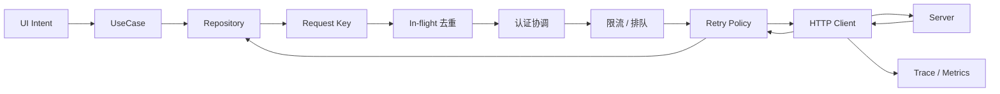
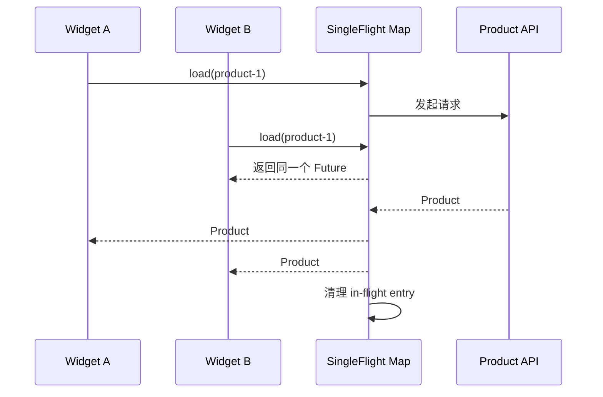
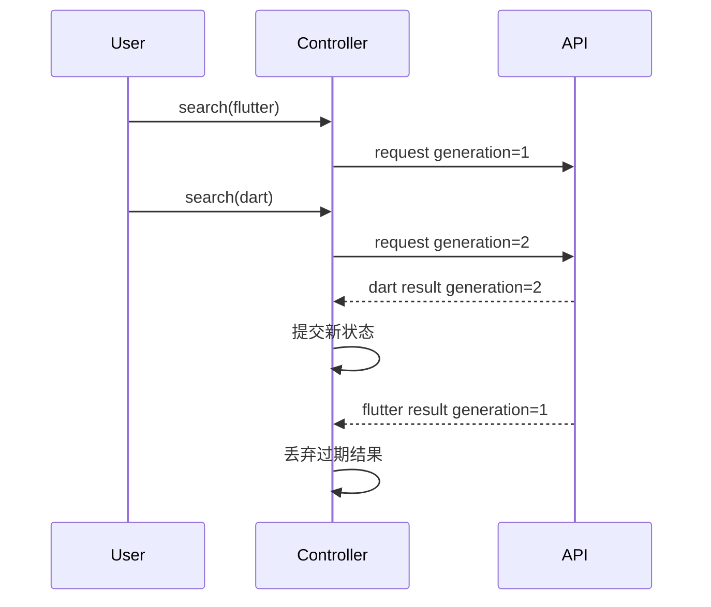
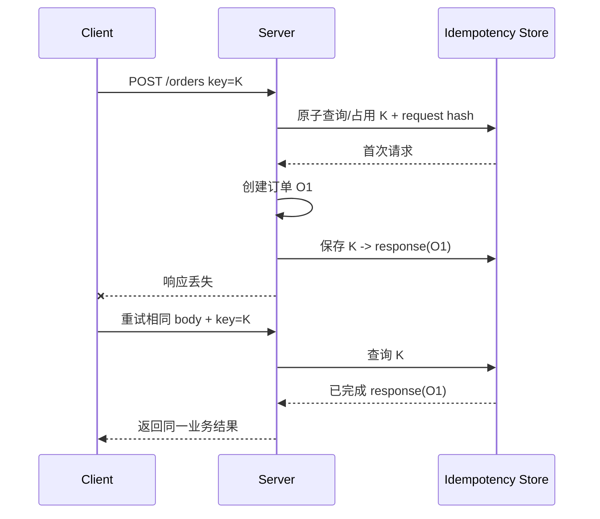
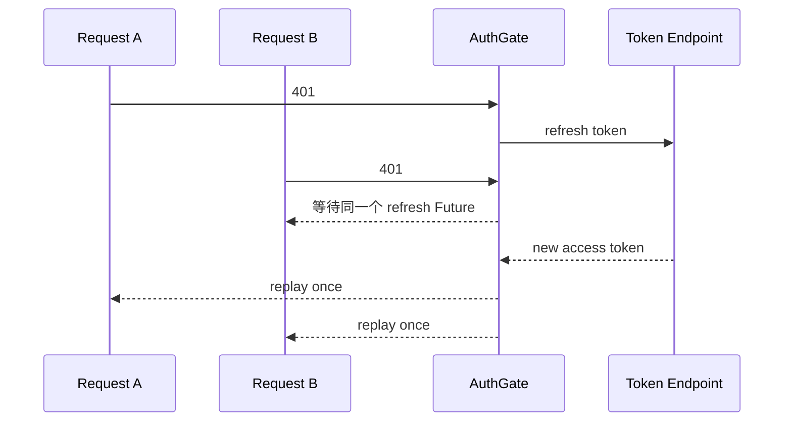
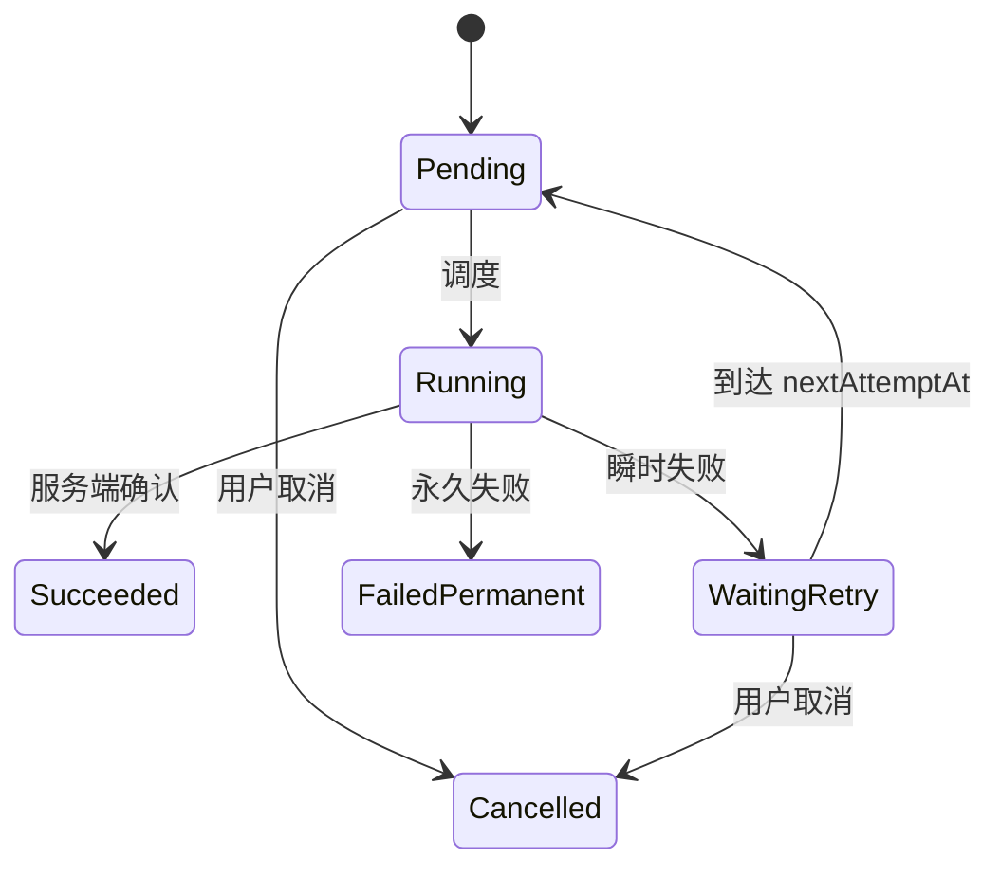
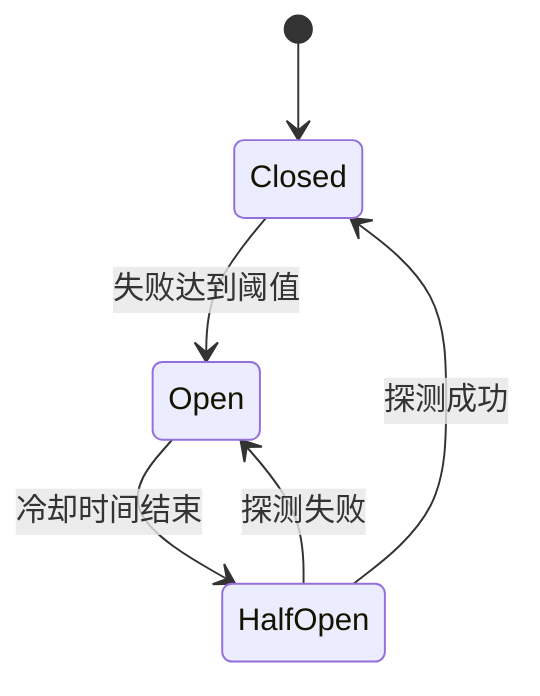
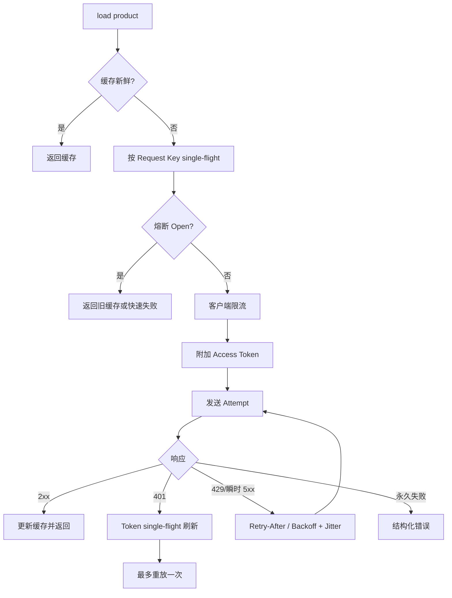

# Flutter 请求治理：去重、竞态、重试、Token 刷新与熔断

> 请求治理不是给每个请求统一加三次重试，而是针对重复、乱序、瞬时失败、认证过期和过载分别建立可证明的策略，并限制这些策略自身造成的放大效应。

---

## 一、为什么“请求成功”还不够

一个电商 Flutter 应用可能同时发生：

- 两个 Widget 请求同一商品详情；
- 用户连续切换筛选条件，旧请求晚于新请求返回；
- 下单请求超时，但服务端其实已经创建订单；
- 20 个并发请求同时收到 401，并各自刷新 Token；
- 服务端返回 429 和 `Retry-After`，客户端仍立即重试；
- 离线操作恢复后批量重放，瞬间压垮接口；
- 故障接口持续失败，应用不断请求、重试和记录日志。

这些问题不只是 HTTP Client 的配置问题，而是分布式系统中的不确定性：客户端不知道请求是否到达、服务端是否执行、响应是否丢失，也无法保证多个异步结果按发起顺序返回。

### 核心结论

1. 去重解决相同 in-flight 读取的资源浪费，竞态控制解决旧结果覆盖新状态；两者不能互相替代。
2. 取消客户端等待不等于取消服务端执行，写操作正确性必须依赖服务端幂等契约。
3. 自动重试只适合具有瞬时恢复可能、且幂等或携带幂等键的操作。
4. 指数退避必须加入 Jitter，并同时限制次数、总时长和全链路重试预算。
5. 收到 `Retry-After` 应尊重服务端节奏，但仍需设置客户端可接受上限并支持取消。
6. Token 刷新必须 single-flight：同一认证作用域只允许一个刷新任务，其余请求等待同一个结果。
7. 401 防护要区分业务请求与刷新请求，限制每个请求最多刷新重放一次，并对刷新失败执行统一登出。
8. 离线排队必须持久化操作 ID、顺序、依赖与幂等键；内存队列不能提供进程终止后的可靠性。
9. 客户端限流保护设备和体验，服务端限流才是安全与容量边界；客户端熔断也不能替代服务端治理。

---

## 二、建立请求治理全景

请求从 UI 到网络并不是一条裸 HTTP 调用：



每一层解决不同问题：

| 机制 | 解决的问题 | 不解决的问题 |
|---|---|---|
| In-flight 去重 | 相同读取同时发生 | 旧查询结果覆盖新查询 |
| 取消/Generation | 结果已经过期 | 服务端写操作已经执行 |
| 幂等键 | 写请求重复执行 | 服务端业务冲突 |
| Retry | 瞬时传输或服务故障 | 参数错误、权限拒绝 |
| Single-flight | 同一刷新任务并发合并 | Token 本身不可刷新 |
| Queue/Replay | 离线或限流时延迟执行 | 操作冲突与顺序语义 |
| Rate Limit | 控制请求速率 | 持续依赖故障 |
| Circuit Breaker | 快速失败并给依赖恢复窗口 | 全局服务容量治理 |

治理策略应该按端点、业务操作和错误类型配置，不能全部塞进一个无差别 Interceptor。

---

## 三、先建立结构化请求与错误模型

治理逻辑需要知道请求是否可重试、认证作用域和幂等键，不能只接收 URL 字符串。

```dart
enum RequestSafety {
  safeRead,
  idempotentWrite,
  nonIdempotentWrite,
}

final class RequestPolicy {
  const RequestPolicy({
    required this.safety,
    required this.timeout,
    this.maxAttempts = 1,
    this.requiresAuth = true,
    this.idempotencyKey,
  });

  final RequestSafety safety;
  final Duration timeout;
  final int maxAttempts;
  final bool requiresAuth;
  final String? idempotencyKey;
}
```

错误至少要区分：

```dart
sealed class RequestFailure {
  const RequestFailure();
}

final class NetworkUnavailable extends RequestFailure {
  const NetworkUnavailable();
}

final class RequestTimedOut extends RequestFailure {
  const RequestTimedOut();
}

final class RateLimited extends RequestFailure {
  const RateLimited(this.retryAfter);
  final Duration? retryAfter;
}

final class AuthenticationExpired extends RequestFailure {
  const AuthenticationExpired();
}

final class ProtocolFailure extends RequestFailure {
  const ProtocolFailure(this.statusCode);
  final int statusCode;
}

final class BusinessRejection extends RequestFailure {
  const BusinessRejection(this.code);
  final String code;
}

final class RequestCancelled extends RequestFailure {
  const RequestCancelled();
}
```

如果所有错误都变成 `Exception('request failed')`，重试器无法判断是否应该重试，UI 也无法决定登录、提示、静默取消还是保留缓存。

---

## 四、重复请求去重：共享同一个 in-flight Future

商品详情页的标题、价格区和推荐区可能在同一时刻请求同一个商品。若参数和数据语义完全相同，可以共享正在执行的 Future：



### 4.1 一个最小 Single-flight 实现

```dart
final class SingleFlight<K, V> {
  final Map<K, Future<V>> _inFlight = {};

  Future<V> run(K key, Future<V> Function() operation) {
    final existing = _inFlight[key];
    if (existing != null) return existing;

    final future = Future<V>.sync(operation);
    _inFlight[key] = future;

    future.whenComplete(() {
      if (identical(_inFlight[key], future)) {
        _inFlight.remove(key);
      }
    }).ignore();

    return future;
  }
}
```

`whenComplete(...).ignore()` 只负责清理派生 Future，原始 `future` 仍向调用者传播成功或错误。使用的 Dart SDK 需支持 `Future.ignore()`；旧版本可显式处理清理 Future 的错误。

### 4.2 Request Key 必须覆盖响应语义

错误的 Key 会把不同请求合并：

```dart
// 错误：只使用 URL，忽略用户和参数
final key = request.path;
```

合理 Key 通常包括：

- HTTP 方法和规范化路径；
- Query、Body 中影响响应的字段；
- 当前用户或租户；
- Locale、币种、区域；
- 分页游标和排序；
- API 版本和权限 Scope；
- 影响内容协商的 Header。

不要把 Access Token 原文放入 Key、日志或指标。可以使用稳定的认证作用域标识，例如 `userId + tenantId + permissionVersion`。

### 4.3 去重不等于缓存

- Single-flight 只在请求执行期间共享结果，完成后删除。
- Cache 在请求完成后继续保存数据，并需要 TTL、失效和容量策略。

二者可以组合：先查缓存，未命中时通过 single-flight 合并回源。

### 4.4 共享请求如何取消

若 A 和 B 共享底层请求，A 页面退出时不能直接取消网络，否则会影响仍在等待的 B。需要：

- 每个订阅者可停止等待和接收结果；
- 只有最后一个订阅者离开时才取消底层请求；
- 或让共享读取继续完成并写入缓存。

具体选择取决于请求成本、缓存价值和客户端是否支持真正取消。简单共享 Future 不具备引用计数取消语义。

---

## 五、请求竞态：旧结果不能覆盖新意图

搜索 `flutter` 后立即切换到 `dart`，即使两个请求都合法，前一个结果也已过期。



### 5.1 Generation 校验

```dart
final class SearchController {
  SearchController(this._repository);

  final ProductRepository _repository;
  int _generation = 0;
  bool _disposed = false;

  Future<void> search(String query) async {
    final generation = ++_generation;
    emit(SearchLoading(query));

    try {
      final result = await _repository.search(query);
      if (_disposed || generation != _generation) return;
      emit(SearchLoaded(query: query, products: result));
    } catch (error, stackTrace) {
      if (_disposed || generation != _generation) return;
      logger.warning('search failed', error, stackTrace);
      emit(SearchFailed(query: query));
    }
  }

  void dispose() {
    _disposed = true;
    _generation++;
  }
}
```

### 5.2 取消和 Generation 应同时考虑

- 取消可以节省带宽、解析和服务器资源，但不保证服务端停止。
- Generation 保证即使取消失败或响应已在路上，旧结果也不会提交。

搜索适合 restartable 语义；图片批量上传可能适合有限并发；订单提交则需要 droppable + 幂等，而不是让新提交任意取消旧提交。

### 5.3 跨端点竞态

详情接口返回 `isFavorite=false`，但用户稍早已通过收藏接口改为 true。即使请求类型不同，旧详情响应仍可能覆盖新写入。

需要服务端版本、更新时间或客户端 mutation version 合并，而不仅是页面请求 generation：

```dart
if (remote.version >= local.favoriteVersion) {
  applyRemoteFavorite(remote.isFavorite);
}
```

客户端时间戳可能受时钟漂移影响，优先使用服务端版本或单调序列。

---

## 六、幂等性：重复执行与执行一次效果相同

幂等描述一个操作重复执行后，系统最终效果与执行一次相同。

HTTP 方法的常见语义：

| 方法 | 规范语义通常是否幂等 | 工程注意 |
|---|---|---|
| GET | 是 | 服务端若夹带副作用会破坏假设 |
| PUT | 是 | 相同目标状态重复提交应一致 |
| DELETE | 是 | 重复删除最终仍是“不存在” |
| POST | 通常不是 | 创建、支付需幂等键 |
| PATCH | 取决于补丁语义 | `set value` 与 `increment` 不同 |

“HTTP 方法在规范上幂等”不代表具体 API 实现一定正确，也不代表响应每次完全相同。客户端应以服务端契约为准。

### 6.1 幂等键如何工作

下单时客户端为一次业务意图生成稳定键：

```dart
final idempotencyKey = uuid.v4();

await api.createOrder(
  request,
  headers: {'Idempotency-Key': idempotencyKey},
);
```



可靠服务端实现还要定义：

- Key 的作用域：用户、商户、端点；
- Key 保留时间；
- 同 Key 不同请求体如何拒绝；
- 首次请求仍在执行时如何响应；
- 业务事务与幂等记录如何原子提交；
- 失败结果是否缓存以及哪些失败允许重试。

幂等键不能只由客户端本地 Map 实现，因为多设备、进程重启和网络重放都绕过它。

### 6.2 键必须跟随业务意图持久化

离线订单或进程恢复后重试，必须使用原来的 Key，而不是每次重试生成新 Key：

```dart
final class PendingCommand {
  const PendingCommand({
    required this.operationId,
    required this.idempotencyKey,
    required this.payload,
  });

  final String operationId;
  final String idempotencyKey;
  final Map<String, Object?> payload;
}
```

用户明确发起“再买一次”才是新业务意图，应产生新 Key。

---

## 七、重试前先回答三个问题

1. 错误是否可能通过等待恢复？
2. 操作是否幂等，或是否有服务端幂等键？
3. 用户是否仍关心结果，剩余时间预算是否允许？

### 7.1 通常可有限重试

- 临时网络不可达，但网络已恢复；
- 连接重置；
- 部分超时；
- 服务器明确的 502、503、504；
- 429，且遵守 `Retry-After`；
- 服务端返回约定的瞬时错误码。

### 7.2 通常不自动重试

- 参数验证失败；
- 403 权限不足；
- 业务拒绝，例如库存不足；
- JSON Schema 不兼容；
- 证书校验失败；
- 用户主动取消；
- 没有幂等保证的写请求；
- 刷新 Token 已明确失效。

401 不是普通重试错误，它应进入受控认证恢复流程。

---

## 八、指数退避与 Jitter

固定间隔重试会让大量客户端同步撞击服务端。基础指数退避可以写成：

```text
delay = min(cap, base * 2^retryIndex)
```

但如果所有设备使用同一延迟，仍会形成同步重试波峰，因此需要 Jitter。

### 8.1 Full Jitter

```text
upper = min(cap, base * 2^retryIndex)
delay = random(0, upper)
```

```dart
final class BackoffPolicy {
  BackoffPolicy({
    required this.base,
    required this.cap,
    Random? random,
  }) : _random = random ?? Random.secure();

  final Duration base;
  final Duration cap;
  final Random _random;

  Duration fullJitter(int retryIndex) {
    final exponent = retryIndex.clamp(0, 30);
    final multiplier = 1 << exponent;
    final upperMs = min(cap.inMilliseconds, base.inMilliseconds * multiplier);
    if (upperMs <= 0) return Duration.zero;
    return Duration(milliseconds: _random.nextInt(upperMs + 1));
  }
}
```

这里限制指数，避免位移和乘法无限增长。密码学安全随机并非重试所必需，注入 `Random` 的主要价值是可测试；生产也可使用普通高质量伪随机源。

### 8.2 重试器必须有预算

```dart
Future<T> retry<T>({
  required Future<T> Function(int attempt) operation,
  required bool Function(Object error) shouldRetry,
  required BackoffPolicy backoff,
  required int maxAttempts,
  required Duration maxElapsed,
}) async {
  final stopwatch = Stopwatch()..start();

  for (var attempt = 1; attempt <= maxAttempts; attempt++) {
    try {
      return await operation(attempt);
    } catch (error) {
      final exhausted = attempt >= maxAttempts;
      if (exhausted || !shouldRetry(error)) rethrow;

      final delay = backoff.fullJitter(attempt - 1);
      if (stopwatch.elapsed + delay >= maxElapsed) rethrow;
      await Future<void>.delayed(delay);
    }
  }

  throw StateError('unreachable');
}
```

生产实现还要支持取消，并将单次请求 Timeout 与整个操作 Deadline 区分：

```text
页面总预算 5s
  attempt 1: 1.2s
  backoff: 0.3s
  attempt 2: 1.5s
  backoff: 0.7s
  attempt 3: 剩余预算 1.3s
```

每层都独立重试会形成乘法放大。例如 HTTP Client 重试 3 次，Repository 再重试 3 次，任务队列再重试 3 次，最坏会产生 27 次调用。应指定唯一重试所有者并传递 attempt 元数据。

---

## 九、正确处理 `Retry-After`

服务端可通过 `Retry-After` 告知客户端何时再试。HTTP 语义允许两类值：

- 秒数，例如 `Retry-After: 120`；
- HTTP-date，例如 `Retry-After: Wed, 21 Oct 2015 07:28:00 GMT`。

```dart
Duration? parseRetryAfter(String? value, DateTime nowUtc) {
  if (value == null) return null;

  final seconds = int.tryParse(value.trim());
  if (seconds != null && seconds >= 0) {
    return Duration(seconds: seconds);
  }

  try {
    final target = HttpDate.parse(value).toUtc();
    final delay = target.difference(nowUtc.toUtc());
    return delay.isNegative ? Duration.zero : delay;
  } on FormatException {
    return null;
  }
}
```

客户端策略通常为：

1. 若 `Retry-After` 合法，至少等待服务端指定时间。
2. 加入少量 Jitter，避免所有客户端同一毫秒恢复。
3. 若等待超过页面或任务 Deadline，直接返回可恢复失败或持久化排队。
4. 对异常巨大值设置产品允许的上限，但不要提前无视服务端继续请求。
5. 等待期间响应取消和会话退出。

客户端本地时间可能漂移，HTTP-date 的准确性低于相对秒数。服务端若可控，优先返回 delta-seconds 或额外提供服务端时间。

---

## 十、Token 刷新为什么需要 Single-flight

Access Token 过期时，多个并发请求可能同时收到 401：



如果 A、B 各自刷新，可能出现：

- 刷新风暴；
- Refresh Token 轮换时，一个请求使另一个 Token 失效；
- 较旧刷新响应覆盖较新 Token；
- 多次登出和重复导航登录页。

### 10.1 按认证作用域合并刷新

```dart
final class TokenRefreshCoordinator {
  TokenRefreshCoordinator(this._authApi, this._tokenStore);

  final AuthApi _authApi;
  final TokenStore _tokenStore;
  Future<AccessToken>? _inFlight;

  Future<AccessToken> refresh() {
    final existing = _inFlight;
    if (existing != null) return existing;

    final future = _performRefresh();
    _inFlight = future;

    future.whenComplete(() {
      if (identical(_inFlight, future)) _inFlight = null;
    }).ignore();

    return future;
  }

  Future<AccessToken> _performRefresh() async {
    final session = await _tokenStore.readSession();
    if (session == null) throw const SessionUnavailable();

    final refreshed = await _authApi.refresh(session.refreshToken);
    await _tokenStore.replaceIfCurrent(
      expectedSessionId: session.id,
      tokens: refreshed,
    );
    return refreshed.accessToken;
  }
}
```

`replaceIfCurrent` 防止用户在刷新期间退出或切换账号后，旧请求把 Token 写回新会话。多租户或多账号应用应按 Session Key 分别 single-flight，而不是一个进程全局共享。

### 10.2 预刷新与 401 刷新

- 预刷新：根据 Token 过期时间提前刷新，减少业务请求 401。
- 响应式刷新：收到可信 401 后刷新，处理时钟漂移、服务端撤销等情况。

二者可以组合，但 Token 的本地过期时间不能替代服务端校验。预刷新也需要 single-flight。

---

## 十一、401 无限循环防护

一个危险 Interceptor：

```dart
// 错误示意：任何 401 都刷新并重放，没有次数限制
if (response.statusCode == 401) {
  await refreshToken();
  return client.send(request);
}
```

如果刷新端点本身返回 401，或者新 Token 仍被拒绝，就会无限循环。

### 11.1 必须建立的护栏

1. 刷新端点不进入普通 401 刷新逻辑。
2. 每个原始请求最多执行一次“刷新后重放”。
3. 请求元数据记录 `authReplayCount`，重放时继承。
4. 刷新失败或重放仍 401，统一失效当前 Session。
5. 登出和登录导航也要 single-flight，避免弹出多个登录页。
6. 公共端点或可匿名降级端点按契约处理，不能全部强制登出。
7. 请求 Body 必须可重放；一次性 Stream、文件流需重建或禁止自动重放。

```dart
Future<Response<T>> sendWithAuth<T>(ReplayableRequest<T> request) async {
  final response = await _send(request);
  if (response.statusCode != 401) return response;
  if (!request.requiresAuth || request.isRefreshRequest) return response;
  if (request.authReplayCount >= 1) {
    await sessionManager.invalidateCurrentSession();
    throw const AuthenticationExpired();
  }

  await refreshCoordinator.refresh();
  return _send(request.copyWith(authReplayCount: 1));
}
```

### 11.2 不是每个 401 都能刷新

服务端应尽量区分：

- Access Token 过期，可刷新；
- Token 无效或已撤销；
- 当前账号无权限；
- 登录态与设备绑定失效；
- Refresh Token 过期。

若协议只有 401，客户端只能采用保守、有限的恢复策略。认证错误码属于客户端与服务端共同维护的稳定契约。

---

## 十二、请求排队与重放

排队适用于：

- 暂时离线；
- Token 正在刷新；
- 客户端并发上限；
- 服务端要求稍后再试；
- 离线优先的写操作。

但“把 Future 放进 List”只能做短暂内存排队，进程终止后全部丢失。可靠写队列需要持久化状态机：



### 12.1 队列记录至少包含

```dart
final class QueuedOperation {
  const QueuedOperation({
    required this.operationId,
    required this.userId,
    required this.kind,
    required this.payload,
    required this.idempotencyKey,
    required this.attemptCount,
    required this.nextAttemptAt,
    required this.createdAt,
  });

  final String operationId;
  final String userId;
  final String kind;
  final Map<String, Object?> payload;
  final String idempotencyKey;
  final int attemptCount;
  final DateTime nextAttemptAt;
  final DateTime createdAt;
}
```

还可能需要优先级、依赖操作 ID、Payload Schema 版本、租户、过期时间和最后错误类型。

### 12.2 重放不是按列表无脑循环

需要定义：

- 同一实体的操作是否严格有序；
- 不同实体是否可有限并发；
- 后续操作是否依赖前序生成的服务端 ID；
- 用户退出后是否删除或隔离队列；
- Payload 在应用升级后如何迁移；
- 冲突时覆盖、合并还是要求用户处理；
- 永久失败如何进入 Dead Letter 状态；
- 恢复网络时如何加 Jitter，避免同时洪峰。

敏感 Payload 应加密或避免落盘，日志不得记录完整内容。

---

## 十三、客户端限流

限流控制单位时间内允许发起的请求，常见目的：

- 防止搜索输入触发过多请求；
- 限制图片上传并发；
- 保护设备 CPU、带宽和电量；
- 避免错误循环压垮服务端；
- 对 SDK 或外部 API 遵守调用配额。

### 13.1 Debounce、Throttle 与 Rate Limit

| 机制 | 语义 | 场景 |
|---|---|---|
| Debounce | 安静一段时间后执行最后一次 | 搜索输入 |
| Throttle | 时间窗内最多执行一次 | 滚动埋点、按钮事件 |
| Concurrency Limit | 同时最多 N 个任务 | 上传、图片预取 |
| Token Bucket | 按速率补充令牌，允许有限突发 | 通用 API 限速 |

UI 禁用按钮不是服务端限流，也不是幂等保证。自动化脚本、多个设备和绕过 UI 的调用仍存在。

### 13.2 客户端与服务端职责

- 客户端限流改善体验并减少浪费。
- 服务端必须按用户、设备、IP、租户和业务资源做容量与风控限制。
- 429 应返回可解析错误与 `Retry-After`。
- 限流 Key、额度和封禁策略不能由客户端决定。

客户端逻辑可被篡改，因此安全边界永远在服务端。

---

## 十四、熔断：持续失败时快速失败

当某个依赖持续失败，继续发送请求会增加延迟、耗电和服务端压力。熔断器通常有三种状态：



- Closed：正常放行并统计结果。
- Open：在冷却期内快速失败或使用缓存降级。
- Half-open：只允许少量探测请求判断依赖是否恢复。

### 14.1 熔断统计不能过于简单

“连续失败 3 次就熔断”在客户端可能误伤：

- 用户本地无网络，不代表服务端故障；
- 4xx 业务错误不应计入依赖健康度；
- 客户端样本量小，偶然性高；
- 所有设备使用同一阈值，可能同步探测形成波峰。

应至少区分端点/依赖、错误类型、最小样本量、时间窗口和冷却 Jitter。客户端通常更适合做短时局部保护；全局熔断、流量切换和容量保护应由网关与服务端治理。

### 14.2 熔断后的降级

- 返回带新鲜度标识的缓存；
- 隐藏非核心模块；
- 延迟非关键上传；
- 提供手动重试但仍受限流；
- 对关键写操作明确提示“结果未知”，稍后对账。

不能把所有失败静默变成成功，否则会掩盖数据一致性问题。

---

## 十五、把策略组合起来

以“打开商品详情”为例：



以“创建订单”为例，顺序不同：

1. 用户意图生成并持久化幂等键。
2. 防重复点击，但不把 UI 防抖当正确性保证。
3. 请求超时后，不确定服务端是否创建成功。
4. 只有服务端承诺幂等时，才用相同 Key 重试。
5. 若结果仍未知，按 Key 查询订单并对账。
6. 进程终止后从持久队列恢复同一个操作，而非创建新意图。

读取优化与写入正确性不能使用同一套默认策略。

---

## 十六、可观测性：必须看见每次 Attempt

如果一次逻辑请求重试三次后成功，只记录最终 200 会掩盖用户等待和服务压力。

建议区分：

- Logical Request：用户视角的一次操作；
- Attempt：一次实际网络调用；
- Auth Refresh：独立子 Span；
- Queue Wait、Rate Limit Wait、Backoff Wait；
- Cache 和 Circuit Breaker 决策。

```text
logical_request checkout.create_order
  queue_wait: 120 ms
  attempt_1: timeout, 1500 ms
  backoff: 340 ms
  attempt_2: 201, 420 ms
  total: 2380 ms
```

### 推荐指标

- 逻辑请求成功率和总耗时；
- Attempt 次数分布与重试放大率；
- 去重命中率和共享等待者数量；
- 取消率、过期结果丢弃数；
- 401、刷新成功率和刷新等待时长；
- 429、`Retry-After` 分布；
- 队列深度、最老任务年龄和永久失败数；
- 熔断开启次数、持续时长和 Half-open 结果；
- 各端点并发和客户端限流等待时间。

日志和 Trace 必须脱敏：不记录 Token、Cookie、密码、完整请求 Body、个人信息或幂等键原文。Request ID、Trace ID 与服务端 Correlation ID 应关联，但也要限制长度和可信输入。

---

## 十七、安全与一致性边界

请求治理代码运行在不可信客户端，不能承担服务端安全职责：

- 幂等必须由服务端原子保证；
- 限流和风控必须在服务端执行；
- Token 仍需服务端验证、撤销与轮换；
- 队列 Payload 必须防篡改或由服务端重新校验；
- 客户端时间、重试次数和权限声明都不可直接信任；
- TLS 失败不能通过重试或降级到明文绕过；
- 日志、代理和错误上报不得泄漏认证信息。

客户端的价值是改善体验、减少浪费并维持本地一致性，而不是建立最终信任。

---

## 十八、常见误区与修复

### 18.1 所有错误统一重试三次

**问题：** 参数、权限和业务错误不会恢复，非幂等写可能重复执行。

**修复：** 按请求安全性、错误类型和 Deadline 决定重试。

### 18.2 去重 Key 只使用 URL

**问题：** 不同用户、Locale、Query 或分页被错误合并。

**修复：** Key 覆盖所有影响响应语义的字段，并隔离认证作用域。

### 18.3 取消 Future 等于取消服务端操作

**问题：** 请求可能已经到达并提交事务。

**修复：** 取消只控制本地资源；写操作依赖幂等键和结果对账。

### 18.4 每个 401 都单独刷新 Token

**问题：** 产生刷新风暴、Token 轮换竞态和旧 Token 覆盖。

**修复：** 按 Session single-flight，并使用条件写入防止跨会话污染。

### 18.5 刷新后无限重放 401

**问题：** 新 Token 仍无效或刷新端点本身 401 时形成循环。

**修复：** 排除刷新端点、记录重放次数，最多一次后统一失效会话。

### 18.6 指数退避不加 Jitter

**问题：** 大量客户端仍在相同时间重试，形成惊群。

**修复：** 使用 Full Jitter 等策略，并限制全链路预算。

### 18.7 只限制重试次数，不限制总时间

**问题：** 单次超时叠加退避，页面可能等待几十秒。

**修复：** 设置 Operation Deadline，把剩余预算传入每次 Attempt。

### 18.8 内存 List 充当离线队列

**问题：** 进程终止后操作丢失，也没有 Schema、幂等和冲突信息。

**修复：** 持久化队列状态机，并定义重放、迁移和 Dead Letter 策略。

### 18.9 客户端熔断代替服务端熔断

**问题：** 单设备样本不代表全局健康，客户端也可被绕过。

**修复：** 客户端只做局部体验保护，服务端负责全局容量和故障隔离。

---

## 十九、测试请求治理

请求治理最重要的不是 Happy Path，而是可控地制造乱序和失败。

### 19.1 去重测试

```dart
test('相同 key 的并发调用只执行一次 operation', () async {
  final gate = Completer<String>();
  final singleFlight = SingleFlight<String, String>();
  var calls = 0;

  Future<String> load() {
    return singleFlight.run('product-1', () {
      calls++;
      return gate.future;
    });
  }

  final first = load();
  final second = load();
  expect(calls, 1);

  gate.complete('result');
  expect(await Future.wait([first, second]), ['result', 'result']);
});
```

还要测试失败后 entry 被清理、不同用户 Key 不合并、最后订阅者取消的策略。

### 19.2 竞态测试

使用两个 Completer 让第二个请求先完成，再完成第一个，断言最终 State 仍对应第二个查询。

### 19.3 重试测试

注入 Fake Clock、Fake Sleeper 和确定性 Random，避免测试真实等待。覆盖：

- 仅瞬时错误重试；
- 最大次数和总 Deadline；
- `Retry-After` 两种格式；
- 取消等待；
- 幂等与非幂等操作；
- 多层不会重复放大。

### 19.4 Token 刷新测试

同时触发多个 401，验证：

- 只调用一次刷新端点；
- 所有等待者使用同一结果；
- 刷新失败只登出一次；
- 业务请求最多重放一次；
- 刷新期间切换账号不会写回旧 Token；
- 一次性 Body 不会被非法重放。

### 19.5 队列与熔断测试

- 进程重启后任务仍存在；
- 相同幂等键重放不重复创建；
- 账号退出后队列正确隔离；
- 依赖操作保持顺序；
- 4xx 不错误计入熔断；
- Open 状态快速失败，Half-open 只放有限探测；
- 冷却与恢复过程可观测。

最后用 Mock Server 或测试环境验证真实 HTTP Header、连接失败、超时、响应流和服务端幂等契约。纯 Mock Client 无法证明协议两端正确协作。

---

## 二十、渐进落地步骤

1. 统计当前端点的重复、重试、401、429、超时和长尾数据。
2. 建立结构化错误模型，区分取消、认证、限流、瞬时与永久失败。
3. 为请求声明安全性、Deadline、认证和幂等策略。
4. 先治理一个高频 GET：规范 Request Key、缓存和 in-flight 去重。
5. 为搜索、筛选和刷新加入取消 + generation 防竞态。
6. 与服务端为订单/支付建立幂等键与查询对账协议。
7. 集中 Token 刷新，加入 single-flight、一次重放和 Session 条件写。
8. 统一 Retry Policy：Backoff、Jitter、`Retry-After` 与总预算。
9. 对离线写入建立持久队列、Schema 和冲突策略。
10. 根据证据引入并发限制与局部熔断，不提前复杂化所有端点。
11. 为每个 Attempt、等待和治理决策补齐 Trace 与指标。
12. 使用故障注入和真实协议测试验证，再逐步扩大范围。

---

## 二十一、总结

Flutter 请求治理真正需要记住的是：

- In-flight 去重共享相同读取，Generation/取消负责阻止旧结果污染新状态。
- Request Key 必须覆盖用户、参数、Locale、分页和权限等响应语义，同时避免泄漏 Token。
- 客户端取消不保证服务端停止；写操作需要服务端幂等键和最终对账。
- 重试只用于可能恢复且安全的操作，必须有指数退避、Jitter、次数、Deadline 和统一预算。
- `Retry-After` 是服务端节奏信号，应解析秒数和 HTTP-date，并在等待期间支持取消。
- Token 刷新按 Session single-flight，Token 写入要做会话条件校验。
- 401 重放最多一次，刷新端点不能进入自身刷新逻辑，一次性 Body 不能盲目重放。
- 离线排队需要持久化状态机、原操作幂等键、顺序、迁移和永久失败策略。
- 客户端限流和熔断用于体验与局部保护，服务端仍负责安全、容量和全局故障治理。
- 每次 Attempt、排队、退避、刷新和熔断决策都应可观测，否则最终 200 会隐藏真实成本。

---

## 问答复盘

### Q1：请求去重和请求竞态控制有什么区别？

**答：** 去重让相同请求共享一次执行；竞态控制阻止旧请求结果覆盖新意图。不同查询不能去重，但仍必须用取消或 generation 防竞态。

### Q2：取消一个下单请求是否意味着订单没有创建？

**答：** 不意味着。客户端只能停止等待或尝试中断传输，服务端可能已提交事务。应使用幂等键查询和对账最终结果。

### Q3：POST 请求能否自动重试？

**答：** 默认不能假定安全。只有服务端提供稳定幂等键契约，且重试使用同一个 Key 与相同业务 Payload 时，才适合有限重试。

### Q4：指数退避为什么还需要 Jitter？

**答：** 相同指数公式会让大量客户端在同一时间重试。Jitter 打散恢复时刻，降低惊群和服务端二次过载风险。

### Q5：收到 `Retry-After` 后应完全替代本地退避吗？

**答：** 它应作为服务端规定的最早重试节奏，同时仍受客户端 Deadline、取消和产品等待上限约束，并可增加少量 Jitter 打散恢复。

### Q6：为什么 Token 刷新必须 single-flight？

**答：** 多个并发刷新会造成请求风暴和 Token 轮换竞态。让所有请求等待同一个刷新 Future，可以保证同一 Session 只有一条刷新链路。

### Q7：如何防止 401 无限循环？

**答：** 刷新端点排除普通刷新逻辑，每个业务请求最多刷新重放一次；重放仍 401 或刷新失败时统一失效会话。

### Q8：离线请求队列为什么必须保留原幂等键？

**答：** 重放仍属于同一次业务意图。生成新 Key 会让服务端把它当成新操作，可能重复创建订单或提交数据。

### Q9：客户端熔断是否能保护服务端？

**答：** 只能减少当前设备的无效流量并改善体验。客户端可被绕过且样本局部，服务端仍需网关限流、熔断、容量治理和降级。

---

## 延伸知识

- HTTP 语义：安全方法、幂等方法、条件请求与状态码。
- 缓存策略：Cache First、Network First、SWR、ETag 与用户隔离。
- 离线优先：Outbox、操作日志、冲突解决和最终一致性。
- 实时通信：心跳、重连、消息序列、去重和断点续传。
- 客户端 Trace：Logical Request、Attempt Span 与 Correlation ID。
- 网络安全：TLS、Token 轮换、证书绑定与敏感日志治理。
