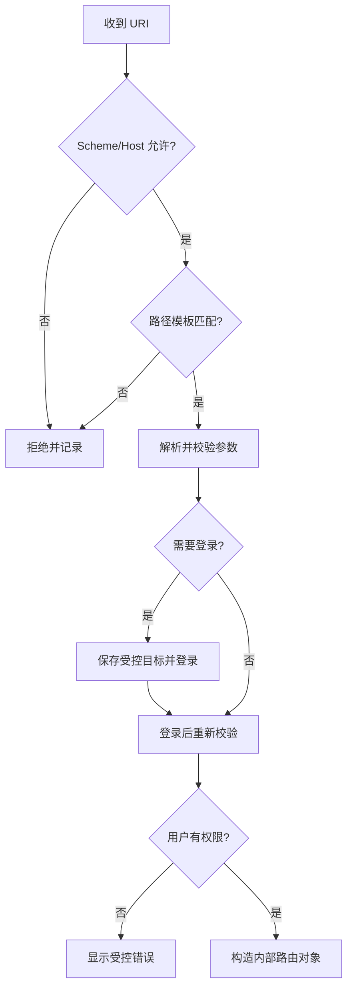
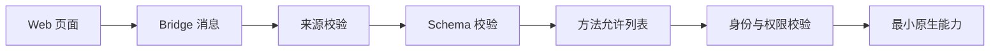
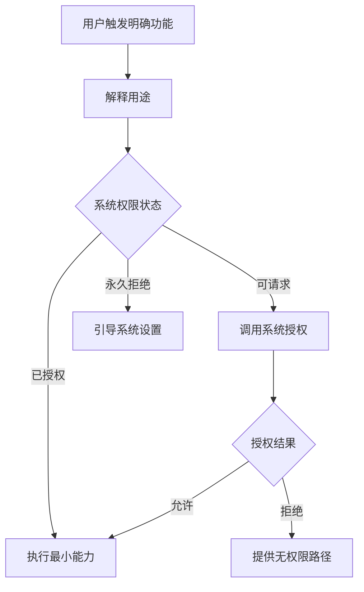

# Flutter 输入与链接安全：Deep Link、WebView 与不可信数据边界

> 客户端接收到的 URL、表单、文件、二维码、剪贴板、推送和 JavaScript 消息都属于不可信输入。安全设计的关键不是“输入来自哪里”，而是“输入最终能够触发什么能力”。

---

## 一、先建立威胁模型

Flutter 应用可能从以下入口接收外部数据：

- Universal Link、Android App Link 和自定义 Scheme。
- 推送通知中的跳转参数。
- 二维码、NFC 和剪贴板。
- WebView 页面、重定向和 JavaScript Bridge。
- 表单、搜索框和富文本编辑器。
- 文件选择、图片上传和分享入口。
- Platform Channel 与第三方原生 SDK。
- 服务端响应、远端配置和本地缓存。

这些数据可能影响：

- 页面导航。
- 登录与账号绑定。
- 支付、下单和转账。
- 文件读取与上传。
- 系统权限调用。
- WebView 中的 Native 能力。
- 本地数据库和服务端请求。


安全目标可以归纳为：

1. 输入不能绕过身份认证和业务授权。
2. 链接不能把用户带到任意页面或任意 Web 地址。
3. Web 内容不能任意调用原生能力。
4. 文件和文本不能突破格式、大小和资源限制。
5. 客户端校验不能被当作服务端安全边界。

---

## 二、不可信输入的处理原则

### 2.1 解析与校验分离

解析只回答“数据是什么结构”，校验回答“这个结构是否被当前业务允许”。

```dart
final uri = Uri.tryParse(rawInput);
if (uri == null) {
  return const LinkDecision.reject('invalid_uri');
}
```

`Uri.tryParse` 成功只说明字符串能够被解析，不代表：

- Scheme 安全。
- Host 可信。
- 路径属于应用支持范围。
- 参数合法。
- 当前用户有权执行目标操作。

### 2.2 使用允许列表

安全边界优先使用 Allowlist，而不是不断补充 Blocklist。

例如，允许访问 `example.com` 时，下面的判断并不安全：

```dart
// 错误：evil-example.com 也以 example.com 结尾
if (uri.host.endsWith('example.com')) {
  open(uri);
}
```

应明确允许精确域名或受控子域：

```dart
bool isAllowedHost(String host) {
  final normalized = host.toLowerCase();
  return normalized == 'example.com' ||
      normalized.endsWith('.example.com');
}
```

即使允许子域，也要确认所有子域都由同一安全边界控制。用户可创建内容的子域通常不应自动获得相同信任。

### 2.3 在使用点再次校验

校验与执行之间可能存在状态变化。例如用户扫描支付二维码后登录账号发生切换，原链接不应自动对新账号生效。

因此，输入在进入系统时做结构校验，在敏感操作执行前还要重新检查：

- 当前身份。
- 当前账号或租户。
- 操作权限。
- 资源状态。
- 风险策略和二次确认。

### 2.4 服务端必须重复校验

Flutter 客户端可以被修改、Hook 或直接绕过。客户端校验用于改善体验和减少误操作，服务端必须独立完成认证、授权、金额、库存和数据归属校验。

---

## 三、Deep Link 安全

Deep Link 能够从应用外部直接触发应用内部导航，是重要攻击入口。

### 3.1 链接类型

| 类型 | 示例 | 安全特征 |
|---|---|---|
| 自定义 Scheme | `myapp://product/123` | 其他应用可能声明同一 Scheme |
| Universal Link | `https://example.com/product/123` | iOS 通过站点关联验证归属 |
| Android App Link | `https://example.com/product/123` | Android 通过域名关联验证归属 |

涉及登录、支付和账号绑定时，应优先使用经过平台域名验证的 HTTPS Link。自定义 Scheme 适合兼容和普通导航，但不能仅凭 Scheme 判断来源可信。

### 3.2 Deep Link 处理链路



重点是：外部 URL 不能直接变成任意内部路由名称和参数。应先映射为受控的内部命令。

### 3.3 使用结构化目标

```dart
sealed class AppLinkTarget {
  const AppLinkTarget();
}

final class ProductTarget extends AppLinkTarget {
  const ProductTarget(this.productId);
  final String productId;
}

final class InviteTarget extends AppLinkTarget {
  const InviteTarget(this.token);
  final String token;
}

final class LinkRejected extends AppLinkTarget {
  const LinkRejected(this.reason);
  final String reason;
}
```

解析器只返回应用明确支持的目标：

```dart
AppLinkTarget parseAppLink(Uri uri) {
  if (uri.scheme != 'https' || !isAllowedHost(uri.host)) {
    return const LinkRejected('untrusted_origin');
  }

  final segments = uri.pathSegments;

  if (segments.length == 2 && segments.first == 'products') {
    final id = segments[1];
    if (RegExp(r'^[a-zA-Z0-9_-]{1,64}$').hasMatch(id)) {
      return ProductTarget(id);
    }
  }

  if (segments.length == 1 && segments.first == 'invite') {
    final token = uri.queryParameters['token'];
    if (token != null && token.length <= 512) {
      return InviteTarget(token);
    }
  }

  return const LinkRejected('unsupported_route');
}
```

这段代码仍只是客户端第一层校验。邀请 Token 是否有效、是否过期、是否属于当前用户，必须由服务端决定。

### 3.4 鉴权后恢复目标

未登录用户打开受保护链接时，不应保存原始 URL 并在登录后直接执行。应保存解析后的受控目标，并在登录完成后重新检查权限和有效期。

```dart
Future<void> handleTarget(AppLinkTarget target) async {
  if (target case InviteTarget()) {
    if (!session.isAuthenticated) {
      pendingTarget.store(target);
      await router.openLogin();
      return;
    }

    final validation = await invitationApi.validate(target.token);
    if (!validation.allowed) {
      return router.openInvalidLink();
    }

    await router.openInvitation(validation.invitationId);
  }
}
```

### 3.5 防止敏感链接重放

登录、绑定和支付回调链接应具备：

- 随机且不可预测的 Token。
- 短有效期。
- 一次性使用。
- 与用户、设备或会话绑定。
- 服务端消费状态。
- 必要时使用 PKCE、State 或 Nonce。

敏感 Token 不应记录到日志、Breadcrumb、分析平台或完整 URL 指标中。

---

## 四、外部 URL 打开策略

应用打开 URL 前应明确目标：

| 目标 | 推荐方式 |
|---|---|
| 应用内部页面 | 映射为受控内部路由 |
| 可信业务 Web 页面 | 受控 WebView 或系统浏览器 |
| 任意用户提供链接 | 优先系统浏览器，并给出风险提示 |
| 电话、短信、邮件 | 校验 Scheme 和参数，调用前让用户确认 |
| 未知 Scheme | 默认拒绝 |

### URL 规范化

安全判断应使用 `Uri` 的结构化字段，不要对原始字符串做简单前缀判断：

```dart
bool isTrustedWebUri(Uri uri) {
  if (uri.scheme.toLowerCase() != 'https') return false;
  if (uri.userInfo.isNotEmpty) return false;
  if (uri.hasPort && uri.port != 443) return false;
  return isAllowedHost(uri.host);
}
```

还要关注：

- Unicode 域名和视觉混淆。
- URL 中的用户名信息，例如 `trusted.com@evil.com`。
- 非默认端口。
- 重定向后的最终地址。
- 编码后的路径穿越字符。
- 过长 URL 导致资源消耗。

对于高风险场景，可使用经过 IDNA 规范化的 ASCII Host 做策略判断。具体规范化能力取决于使用的 URI 和网络库，应通过安全测试验证。

---

## 五、WebView 安全边界

WebView 同时连接 Web 内容和原生应用能力，风险通常高于系统浏览器。

### 5.1 最小能力原则

根据业务需要逐项开启能力：

- 不需要 JavaScript 时保持关闭。
- 不需要文件访问时保持关闭。
- 不允许混合内容。
- 不允许未知窗口和弹窗。
- 限制下载与外部 Scheme。
- 禁止调试能力进入生产环境。
- 使用独立 Cookie 与缓存策略。

不同 WebView 插件和平台版本的 API 名称不同，应以当前插件和平台文档为准，不能照搬某个版本的配置代码。

### 5.2 导航拦截

WebView 不应允许任意跳转：

```dart
NavigationDecision decideNavigation(Uri uri) {
  if (isTrustedWebUri(uri)) {
    return NavigationDecision.navigate;
  }

  if (uri.scheme == 'tel' || uri.scheme == 'mailto') {
    requestUserConfirmation(uri);
    return NavigationDecision.prevent;
  }

  return NavigationDecision.prevent;
}
```

真实实现还应：

- 对主文档和子资源策略分别评估。
- 检查服务端重定向后的 URL。
- 对新窗口请求执行同样校验。
- 将外部链接交给系统浏览器时再次验证。
- 记录拒绝原因，但不记录敏感参数。

### 5.3 混合内容

HTTPS 页面加载 HTTP 资源属于 Mixed Content。攻击者可能篡改脚本、图片或接口响应。

生产环境应默认拒绝 Mixed Content，并确保页面、脚本、图片和 API 全部通过 HTTPS 加载。不要为了兼容某个旧资源全局放开混合内容。

### 5.4 文件访问

WebView 文件访问配置不当可能让页面读取本地文件或跨越预期目录。

- 不加载用户可控的 `file://` 页面。
- 不为远端页面开放任意本地文件访问。
- 本地静态页面应使用受控资源加载机制。
- 文件上传使用系统文件选择器，并限制 MIME、大小和数量。
- 不把应用私有目录真实路径暴露给页面。

---

## 六、JavaScript Bridge 安全

JavaScript Bridge 允许网页调用 Native 能力。一旦 WebView 加载不可信脚本，Bridge 就可能成为原生能力执行入口。



### 6.1 不要暴露通用执行接口

错误设计：

```json
{
  "method": "invokeNative",
  "class": "SystemManager",
  "action": "...",
  "args": {}
}
```

这类通用反射式 Bridge 难以审计，容易意外暴露高权限能力。

应使用有限、版本化的命令：

```json
{
  "version": 1,
  "id": "request-42",
  "method": "shareProduct",
  "params": {
    "productId": "P123"
  }
}
```

### 6.2 结构化解析

```dart
sealed class BridgeCommand {
  const BridgeCommand();
}

final class ShareProduct extends BridgeCommand {
  const ShareProduct(this.productId);
  final String productId;
}

BridgeCommand? parseBridgeCommand(Object? message) {
  if (message is! Map<String, Object?>) return null;
  if (message['version'] != 1) return null;
  if (message['method'] != 'shareProduct') return null;

  final params = message['params'];
  if (params case {'productId': final String productId}) {
    return RegExp(r'^[A-Z0-9]{1,32}$').hasMatch(productId)
        ? ShareProduct(productId)
        : null;
  }

  return null;
}
```

执行前仍需检查当前页面来源、用户身份和业务权限。

### 6.3 Bridge 防护清单

- 只在受信任 Origin 的页面注入 Bridge。
- 导航离开可信 Origin 后立即禁用能力。
- 使用固定方法允许列表和版本化 Schema。
- 参数限制类型、长度、范围和枚举。
- 敏感动作要求用户确认或二次认证。
- Bridge 不能直接读取 Token、Cookie 或任意文件。
- 请求与响应使用 ID 关联，并设置超时。
- 对高频调用限流，防止资源耗尽。
- 记录方法和结果，不记录敏感参数。

仅校验页面初始 URL 不够，因为页面可能重定向或加载被攻击者控制的脚本。

---

## 七、XSS 与 HTML 内容

Flutter 原生 Text Widget 不执行 HTML 或 JavaScript，普通字符串不会像浏览器 DOM 一样产生 XSS。但下面场景仍然存在风险：

- 将用户内容拼接成 HTML 后放入 WebView。
- 使用富文本/Markdown 库渲染可点击链接或内嵌 HTML。
- JavaScript Bridge 处理页面消息。
- 服务端返回 HTML 错误页并直接展示。

### 不要手写字符串替换转义 HTML

HTML 上下文、属性上下文、URL 上下文和 JavaScript 上下文需要不同编码规则。应使用成熟 Sanitizer，并采用允许列表保留必要标签和属性。

例如，一个富文本评论区可能只允许：

- `p`、`strong`、`em`、`ul`、`li`。
- 经过校验的 HTTPS 链接。
- 禁止 `script`、`iframe`、事件属性和内联样式。

Sanitize 应尽量在可信服务端统一执行，客户端仍需按自己的渲染能力做防御性校验。

### Content Security Policy

如果 Web 内容由团队控制，应配置合理的 CSP，限制脚本、样式、图片、连接和 Frame 来源。CSP 是纵深防御，不能替代输出编码、依赖治理和 Bridge 校验。

---

## 八、表单与文本输入

客户端输入校验主要服务于：

- 提供即时反馈。
- 避免无效请求。
- 约束资源消耗。
- 降低误操作。

服务端仍需执行同等或更严格校验。

### 8.1 校验层次


### 规范化

根据业务决定是否：

- 去除首尾空白。
- 统一换行符。
- 规范 Unicode。
- 统一手机号或邮箱大小写规则。
- 保留用户实际输入形式。

规范化会改变数据，不能无差别执行。例如密码通常不应自动 Trim。

### 长度限制

长度限制应明确单位：

- UTF-16 Code Unit。
- Unicode Code Point。
- Grapheme Cluster。
- UTF-8 字节数。

Dart `String.length` 返回 UTF-16 Code Unit 数量，不等于用户看到的字符数。表情和组合字符应使用 Grapheme Cluster 处理；数据库和协议限制则可能关注字节数。

### 正则表达式

正则适合有限格式校验，但应注意：

- 不使用灾难性回溯的复杂正则。
- 不试图用单一正则完整验证所有合法邮箱。
- 对过长输入先做长度限制，再执行正则。
- 最终有效性通常需要服务端或外部系统确认。

### 8.2 不要拼接 SQL 或命令

本地数据库查询应使用参数绑定：

```dart
final rows = await database.query(
  'users',
  where: 'email = ?',
  whereArgs: [email],
);
```

不要将用户输入拼接进 SQL、Shell、JavaScript 或 URL。结构化 API 与参数绑定是首选。

---

## 九、文件与媒体输入

文件选择器返回的文件名、扩展名和 MIME 都不能完全信任。

### 9.1 文件校验

- 限制文件数量。
- 限制单文件和总大小。
- 检查 MIME，并验证文件签名或实际解码结果。
- 对图片设置像素尺寸上限，防止解码炸弹。
- 生成新文件名，不直接使用用户文件名作为存储路径。
- 在临时目录处理，完成后清理。
- 服务端再次执行类型、病毒和内容检查。

扩展名为 `.jpg` 不代表内容一定是 JPEG，客户端报告的 MIME 也可被伪造。

### 9.2 路径安全

如果业务允许用户指定相对路径，应防止：

- `../` 路径穿越。
- 绝对路径覆盖。
- 符号链接逃逸。
- Unicode 路径混淆。
- 超长文件名。

移动应用通常应让系统文件选择器提供受控 URI/句柄，而不是自行接受任意文件系统路径。

### 9.3 图片处理

图片处理要同时考虑安全和性能：

- 限制压缩文件大小和解码后像素数。
- 解码失败安全退出。
- 移除不需要的 EXIF 位置信息。
- 上传前重新编码可降低格式攻击面，但会增加 CPU 成本。
- 大图处理放到后台任务前先评估内存和 Isolate 通信成本。

---

## 十、权限安全

输入可能触发相机、相册、位置、麦克风和通知权限。权限设计应遵循最小权限和及时请求。

### 权限流程



### 原则

- 在用户触发相关功能时请求，而不是启动时批量索取。
- 申请最低粒度权限。
- 用户拒绝后提供可用降级路径。
- 不通过反复弹窗强迫授权。
- 权限文案与实际用途一致。
- 权限获得后，服务端数据访问仍需业务授权。

“拥有相册权限”不等于可以把所有照片上传；“拥有位置权限”也不等于可以无限期追踪用户。

---

## 十一、推送、二维码与剪贴板

### 推送

- 推送 Payload 只携带受控类型和短参数。
- 不直接执行 Payload 提供的任意 URL。
- 点击后重新验证登录和权限。
- 敏感信息不出现在锁屏通知中。
- 推送来源和签名由平台与服务端链路保障。

### 二维码

- 展示解析后的域名和操作说明。
- 敏感操作要求确认。
- 限制内容长度和支持的 Scheme。
- 不扫描后自动执行付款、绑定或下载。
- 一次性 Token 由服务端校验。

### 剪贴板

- 不自动执行剪贴板中的链接或命令。
- 只在用户明确操作后读取。
- 敏感内容写入剪贴板时提示风险，并考虑过期清理能力。
- 不把剪贴板内容自动上传分析平台。

---

## 十二、安全日志与监控

建议监控：

- 被拒绝的 Deep Link 类型和归一化原因。
- WebView 导航拦截次数。
- Bridge 未知方法和 Schema 错误。
- 文件类型、大小校验失败。
- 权限拒绝率和功能降级率。
- 输入导致的解析异常和资源超限。

不要记录：

- 完整敏感 URL。
- 登录、邀请和支付 Token。
- 表单原文。
- 文件内容。
- Cookie、Authorization Header。

安全事件需要限流和聚合，避免攻击者通过构造大量非法输入反向制造日志与上报压力。

---

## 十三、测试策略

### 13.1 Deep Link 测试

至少覆盖：

- 不受支持 Scheme。
- 相似恶意域名。
- URL User Info 欺骗。
- 非默认端口。
- 缺失、重复和超长参数。
- 编码路径和重定向。
- 未登录与无权限。
- Token 过期和重放。

```dart
test('rejects lookalike domain', () {
  final target = parseAppLink(
    Uri.parse('https://evil-example.com/products/P123'),
  );

  expect(target, isA<LinkRejected>());
});
```

### 13.2 WebView 测试

- 可信页面跳转到不可信 Origin。
- 服务端 30x 重定向。
- 新窗口和外部 Scheme。
- 混合内容。
- Bridge 未知版本和方法。
- 参数类型、长度和权限错误。
- 页面离开可信 Origin 后 Bridge 状态。

### 13.3 Fuzz 与资源限制

对解析器进行随机或基于语料的 Fuzz Test：

- 超长字符串。
- 非法 Unicode。
- 深层 JSON。
- 重复 Query Key。
- 大量路径段。
- 异常文件 Header。

测试目标不仅是“返回拒绝”，还要保证不会卡死、OOM、崩溃或输出敏感日志。

---

## 十四、常见误区

### 误区一：能被 `Uri.parse` 解析就是安全链接

解析成功只代表语法可识别，仍需校验 Scheme、Host、路径、参数、权限和业务状态。

### 误区二：客户端已经校验，服务端无需重复校验

客户端可被篡改或绕过，服务端必须执行权威认证和授权。

### 误区三：只加载自己的首页，WebView 就一直可信

页面可能重定向、加载第三方脚本或被 XSS 控制。每次导航和 Bridge 调用都需要校验当前来源。

### 误区四：关闭 JavaScript 就解决了 WebView 安全

还需要处理导航、文件访问、Mixed Content、Cookie、下载、外部 Scheme 和内容来源。

### 误区五：扩展名和 MIME 可以证明文件类型

二者都可能被伪造，应检查内容签名或实际解码，并在服务端再次校验。

### 误区六：正则表达式越复杂，输入校验越安全

复杂正则可能产生回溯型资源攻击，也无法替代业务和服务端校验。应先限制长度，再使用结构化解析和简单规则。

---

## 十五、落地清单

### 链接

- [ ] 优先使用经过平台验证的 HTTPS Link。
- [ ] 使用 `Uri` 结构化解析，不做原始字符串前缀判断。
- [ ] Allowlist Scheme、Host、路径模板和参数。
- [ ] 外部 URL 映射为受控内部目标。
- [ ] 敏感操作重新鉴权并防重放。
- [ ] 重定向和新窗口应用相同策略。

### WebView 与 Bridge

- [ ] 默认关闭不需要的 JavaScript、文件和 Mixed Content 能力。
- [ ] 导航、下载和外部 Scheme 有明确策略。
- [ ] Bridge 仅对可信 Origin 启用。
- [ ] 使用版本化 Schema 和固定方法允许列表。
- [ ] 敏感 Native 能力需要权限校验与用户确认。
- [ ] Bridge 调用限流、超时并避免敏感日志。

### 输入、文件和权限

- [ ] 输入限制类型、长度、范围和资源成本。
- [ ] 数据库和命令使用参数化 API。
- [ ] 文件限制数量、大小、像素和真实格式。
- [ ] 服务端重复执行权威校验。
- [ ] 权限在功能触发时按最小粒度申请。
- [ ] 拒绝权限后提供安全降级路径。

---

## 十六、总结

Flutter 输入与链接安全可以归纳为五层：

1. **结构化解析**：使用 `Uri`、JSON Schema 和类型系统解析数据。
2. **允许列表**：只接受明确支持的 Scheme、Host、路径、命令和文件类型。
3. **权限校验**：在敏感动作执行时检查当前身份和业务授权。
4. **最小能力**：WebView、Bridge、文件和系统权限只开放必要范围。
5. **纵深防御**：客户端防御、服务端校验、监控和安全测试共同生效。

最重要的原则是：

> 不要信任输入，也不要信任输入的来源标签；只允许结构明确、权限充分、资源受限的操作进入执行边界。

---

## 十七、问答复盘

### Q1：为什么 `Uri.tryParse` 成功不代表链接安全？

**答：** 它只验证 URI 是否可解析，不验证 Scheme、Host、路径、参数、来源和业务权限。

### Q2：为什么敏感 Deep Link 应优先使用 Universal Link 或 App Link？

**答：** 平台会验证 HTTPS 域名与应用的关联关系，降低其他应用抢占自定义 Scheme 的风险。但业务 Token 和权限仍需服务端校验。

### Q3：为什么 Deep Link 不应直接转换为任意内部路由名？

**答：** 外部输入可能借此访问未公开页面或注入参数。应先映射为固定的结构化目标，再执行鉴权和业务校验。

### Q4：WebView 只加载可信域名，为什么 Bridge 仍需要校验？

**答：** 页面可能重定向、包含第三方脚本或发生 XSS。Bridge 每次调用都应验证当前 Origin、Schema、方法和权限。

### Q5：客户端输入校验能否防止服务端 SQL 注入？

**答：** 不能。客户端可以被绕过，服务端必须使用参数化查询和权威校验。客户端校验主要改善体验并限制资源消耗。

### Q6：为什么不能只根据扩展名或 MIME 接受上传文件？

**答：** 扩展名和客户端 MIME 都可以伪造，应验证文件签名、实际解码结果、大小和像素，并在服务端再次检查。

### Q7：为什么密码输入通常不应自动 Trim？

**答：** 空格可能是密码的合法组成部分。规范化会改变用户输入，必须根据字段语义决定，不能对所有文本统一处理。

### Q8：输入校验最重要的服务端边界是什么？

**答：** 服务端必须独立完成认证、授权和业务不变量校验，不能相信客户端已经隐藏按钮、验证参数或确认用户权限。
