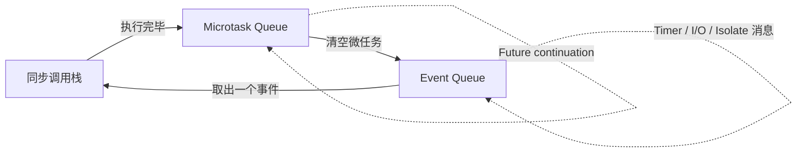
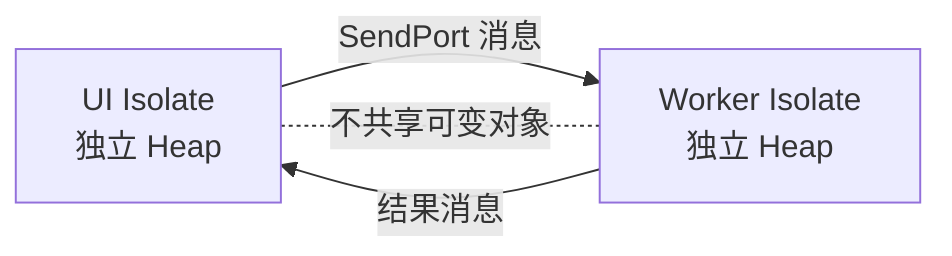
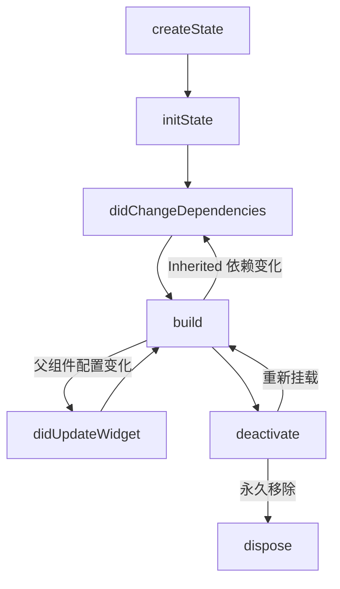
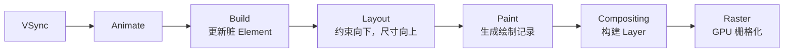
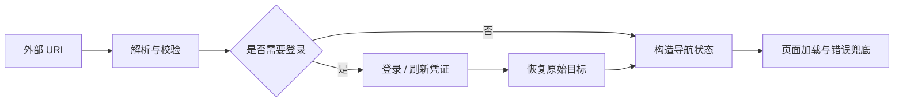
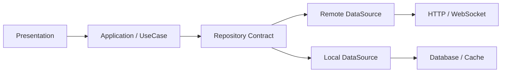
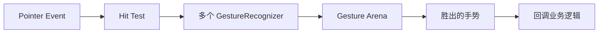
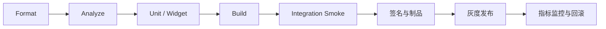
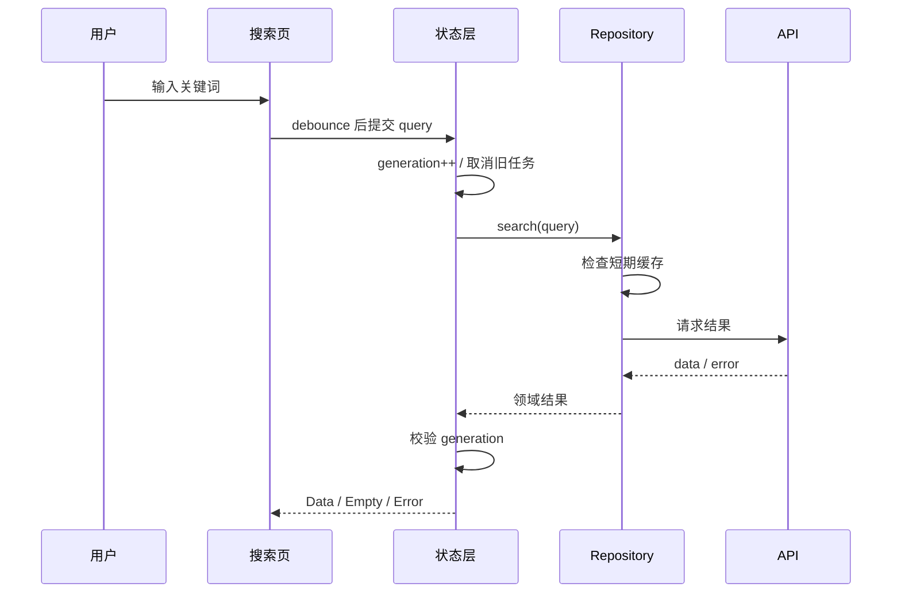

# Flutter 面试知识大纲 · 深度版

> 从 Dart 语言原理到 Flutter 渲染管线、性能工程与系统设计  
> 适用范围：中高级 Flutter 开发岗位 / 移动端架构岗位

---

## 使用说明

这不是一份只给结论的题库，而是一套用于建立知识网络、组织口述答案、应对连续追问的复习大纲。

建议所有原理题都按下面的顺序回答：

1. **定义**：它是什么，解决什么问题。
2. **机制**：底层如何运行，关键对象如何协作。
3. **边界**：什么情况下成立，常见误区是什么。
4. **权衡**：为什么选择它，不选择其他方案的原因。
5. **验证**：如何通过代码、测试或 DevTools 证明结论。

| 能力域 | 面试权重 | 达标信号 |
|---|:---:|---|
| Dart 与并发 | 高 | 能解释类型系统、事件循环、Future、Stream、Isolate 与内存模型 |
| Flutter 原理 | 极高 | 能从 Widget 讲到 Element、RenderObject、Layer 和 GPU |
| 架构与状态 | 高 | 能按状态生命周期、依赖方向和可测试性选择方案 |
| 性能与稳定性 | 极高 | 会根据 DevTools 数据定位，而不是背优化清单 |
| 工程与平台 | 高 | 理解构建、原生互操作、测试、发布和线上治理 |

---

## 目录

- [一、Dart 语言核心](#一dart-语言核心)
- [二、异步模型与并发](#二异步模型与并发)
- [三、Flutter 三棵树与生命周期](#三flutter-三棵树与生命周期)
- [四、Build、布局、绘制与合成](#四build布局绘制与合成)
- [五、状态管理与响应式更新](#五状态管理与响应式更新)
- [六、导航、路由与应用生命周期](#六导航路由与应用生命周期)
- [七、网络、缓存与数据层](#七网络缓存与数据层)
- [八、本地存储与离线架构](#八本地存储与离线架构)
- [九、原生互操作与插件](#九原生互操作与插件)
- [十、性能工程与 DevTools](#十性能工程与-devtools)
- [十一、动画、手势与可访问性](#十一动画手势与可访问性)
- [十二、测试、工程化与发布](#十二测试工程化与发布)
- [十三、架构设计与系统设计题](#十三架构设计与系统设计题)
- [十四、高频问答与追问链](#十四高频问答与追问链)
- [十五、代码题与现场实战](#十五代码题与现场实战)
- [十六、面试前检查清单](#十六面试前检查清单)

---

# 一、Dart 语言核心

## 1.1 类型系统与空安全

### 必须掌握

- Dart 是静态类型语言，支持类型推断、泛型和运行时类型检查。
- 健全空安全将 `T` 与 `T?` 分离，非空类型在静态层面排除 `null`。
- 流程分析会根据判空、提前返回、赋值等控制流完成类型提升。
- `late` 是“稍后一定初始化”的运行时承诺，不是绕过空安全的工具；读前未写会抛出 `LateInitializationError`。
- `dynamic` 会关闭静态成员检查；`Object?` 能接收任意值但仍保留静态类型安全；`var` 只在声明处推断一次。

```dart
String describe(Object? value) {
  if (value case {'name': String name, 'age': int age}) {
    return '$name / $age'; // 模式匹配完成解构和类型提升
  }
  return 'unknown';
}
```

### 高频追问

1. `dynamic`、`Object`、`Object?`、`var` 有什么区别？
2. `late final` 和普通 `final` 的初始化时机有什么区别？
3. 为什么 `List<Cat>` 可以视为 `List<Animal>`，但写入可能失败？
4. Dart 函数参数和返回值的型变规则是什么？

### 深度回答要点

Dart 泛型通常是协变的，这提升了 API 易用性，但将部分类型错误推迟到运行时检查。函数类型中，返回值适合协变，参数类型体现逆变：能够接收更宽类型的函数，可以替代只能接收更窄类型的函数。

## 1.2 类修饰符、mixin、extension 与 sealed class

| 机制 | 适用场景 | 关键边界 |
|---|---|---|
| `abstract interface class` | 对外只提供契约 | Dart 3 类修饰符用于限制库外继承和实现能力 |
| `base` / `final` / `sealed` | 控制继承体系 | `sealed` 便于编译器做穷尽检查 |
| `mixin` | 无 `is-a` 关系的横切复用 | 可使用 `on` 约束宿主；避免隐藏状态耦合 |
| `extension` | 给既有类型增加静态扩展能力 | 不改变真实类型；接收者为 `dynamic` 时不会静态解析扩展 |

```dart
sealed class LoadState<T> {}

final class Loading<T> extends LoadState<T> {}

final class Data<T> extends LoadState<T> {
  Data(this.value);
  final T value;
}

final class Failure<T> extends LoadState<T> {
  Failure(this.error);
  final Object error;
}
```

上面的建模比 `isLoading + hasError + data` 三个字段更安全，因为它从类型层面消除了互相矛盾的非法状态。

## 1.3 对象、相等性与不可变性

- `identical(a, b)` 比较对象标识；`a == b` 可以由类型重载。
- 重载 `==` 后必须同步维护 `hashCode`：相等对象必须拥有相同哈希值。
- `const` 对象可能被规范化，相同常量表达式可指向同一实例。
- 不可变状态有利于变更检测、缓存、并发推理和测试，但复制大型对象会增加分配成本。
- 可通过结构共享、拆分子状态、分页对象或持久化集合降低复制成本。
- 闭包会捕获变量并可能延长对象生命周期；长生命周期回调、Timer、订阅和全局单例是常见泄漏来源。

## 1.4 Dart VM：JIT、AOT 与 Tree Shaking

- **Debug**：通常依赖 JIT，支持热重载、断言和调试能力，不代表真实发布性能。
- **Profile**：保留性能分析能力，适合使用 DevTools 测量。
- **Release**：使用 AOT 优化，关闭调试能力和断言，启用更完整的 tree shaking。
- 热重载主要注入新的函数实现并重建 Widget 树，不会重新执行 `main()` 或 `initState()`。
- 热重启会重建 Dart 状态，但通常不重新安装应用。
- Tree shaking 依赖静态可达性分析；动态反射会削弱裁剪能力，因此 Flutter 生产环境限制 `dart:mirrors`。

---

# 二、异步模型与并发

## 2.1 事件循环



### 核心机制

- 一个 Isolate 同一时刻只执行一段 Dart 代码，不存在共享堆上的多线程并行执行。
- 同步代码运行到调用栈清空后，运行时先清空 microtask queue，再从 event queue 取一个事件。
- `scheduleMicrotask` 和 `Future.microtask` 进入微任务队列。
- Timer、I/O 完成、手势事件和 Isolate 消息通常进入事件队列。
- 持续向微任务队列追加任务会饿死事件队列，造成输入和绘帧延迟。

> **常见误区**：`async` 函数不是从一开始就异步。函数会同步执行到第一个尚未完成的 `await`，随后把 continuation 交还调度器。

## 2.2 Future

### 高频知识点

- Future 有未完成、成功完成、失败完成三种状态，完成后不可再次改变。
- `await` 只是 Future 组合语法，不会自动创建线程。
- `Future.wait` 中任一任务失败时，组合 Future 会失败，但其他任务通常不会自动取消。
- `then`、`catchError`、`whenComplete` 的错误传播必须理解；错误回调返回正常值可能把错误转换成成功结果。
- Dart 原生 Future 没有通用强制取消机制，取消通常需要业务协议、可取消操作或忽略过期结果。

### 防止异步竞态

```dart
int _generation = 0;

Future<void> search(String query) async {
  final generation = ++_generation;
  final result = await repository.search(query);

  if (!mounted || generation != _generation) return;
  setState(() => items = result);
}
```

这段代码解决“旧请求比新请求晚返回，并覆盖新结果”的问题，但并没有停止旧请求消耗网络和服务端资源。更完整的方案应在数据层支持取消。

## 2.3 Stream 与背压

| 类型 | 特征 | 常见用途 |
|---|---|---|
| Single-subscription Stream | 只有一个监听者，消费生命周期明确 | 文件读取、一次请求产生的数据流 |
| Broadcast Stream | 多监听者，晚订阅者通常收不到历史事件 | UI 事件、连接状态、传感器广播 |
| Sync StreamController | `add` 可能在当前调用链派发 | 容易引发重入，需严格理解后再使用 |

### 必须能解释

- `listen` 返回 `StreamSubscription`，页面销毁时应 `cancel()`。
- `pause()` 不一定能让真实生产者停止生产。如果上游无法暂停，中间层仍可能缓存事件，导致内存增长。
- `async*` 使用 `yield` 产生 Stream；`yield*` 转发另一个 Stream。
- `switchMap` 适合搜索：新输入到达时取消旧流。
- `debounce` 控制输入稳定时间，`throttle` 控制时间窗口内的触发频率，两者语义不同。

## 2.4 Isolate



### 适用场景

- 大 JSON 解析、压缩、加密、图片处理等 CPU 密集任务。
- 常规 HTTP、文件异步读写本身主要是 I/O 等待，一般不需要额外 Isolate。
- 一次性任务可用 `Isolate.run` / `compute`；高频任务适合常驻 Isolate 和消息协议。

### 成本与边界

- 创建 Isolate 有启动和内存成本。
- 消息需要可发送并可能发生复制/序列化。
- 大型二进制数据可考虑 `TransferableTypedData` 降低复制成本。
- Isolate 不能直接共享 UI 对象，也不能从后台 Isolate 操作 Flutter Widget 树。

---

# 三、Flutter 三棵树与生命周期

## 3.1 Widget、Element、RenderObject


| 对象 | 职责 | 生命周期特征 |
|---|---|---|
| Widget | 描述 UI 配置 | 轻量、不可变、可频繁创建 |
| Element | 保存挂载位置、依赖关系和身份 | 通常长于 Widget；`BuildContext` 本质上是 Element 接口 |
| State | 保存 StatefulWidget 的可变状态 | 由 StatefulElement 持有，不存放在 Widget 中 |
| RenderObject | 测量、布局、绘制、命中测试、语义 | 只有相关属性变化时才需要 layout 或 paint |
| Layer | 描述可合成输出 | 可被缓存和复用，但过多会增加内存与合成成本 |

### 更新匹配规则

父 Element 更新子节点时，框架主要根据下面的条件决定复用还是替换：

```dart
oldWidget.runtimeType == newWidget.runtimeType &&
oldWidget.key == newWidget.key
```

满足条件时，原 Element 被复用并执行 `update`；否则旧 Element 被卸载，创建新的 Element。

## 3.2 Key

- 无 Key 时，同层节点主要按位置和 `runtimeType` 匹配。
- `ValueKey` 使用稳定业务值区分身份，列表最常用。
- `ObjectKey` 基于对象相等性。
- `UniqueKey` 每次都是新身份；如果在 `build` 中创建，会强制丢弃旧状态。
- `GlobalKey` 可跨父节点迁移子树并访问 State/Context，但维护全局注册并触发 reparent，成本和耦合都更高。

> **面试判断题**：列表数据有增删和重排时，如果有状态的列表项没有稳定 Key，状态可能跟随位置而不是业务数据移动。

## 3.3 StatefulWidget 生命周期



### 各阶段职责

- `initState`：一次性初始化 Controller、订阅稳定依赖；不能监听会变化的 Inherited 依赖。
- `didChangeDependencies`：可以安全读取 InheritedWidget；依赖变化后会再次执行。
- `didUpdateWidget`：同位置的新 Widget 配置到达。订阅对象变化时，应解绑旧对象并绑定新对象。
- `deactivate`：暂时离开树，仍可能重新挂载。
- `dispose`：永久销毁，释放 Controller、FocusNode、Timer、Subscription、Observer。

```dart
@override
void didUpdateWidget(covariant ProfilePage oldWidget) {
  super.didUpdateWidget(oldWidget);
  if (oldWidget.userId != widget.userId) {
    _unsubscribe(oldWidget.userId);
    _subscribe(widget.userId);
  }
}
```

## 3.4 BuildContext

- Context 代表 Widget 在树中的位置，而不是 Widget 本身。
- `Theme.of(context)`、`Provider.of(context)` 会沿祖先 Element 查找依赖。
- 使用错误层级的 Context，可能找不到刚刚创建的 Provider、Scaffold 或 Navigator；可用 `Builder` 创建更内层 Context。
- `await` 之后 Element 可能已卸载，使用 Context 前检查 `context.mounted`。
- 只检查 `mounted` 仍不等于完整解决业务竞态。还要判断这个异步结果是否仍属于当前请求和当前页面状态。

---

# 四、Build、布局、绘制与合成

## 4.1 一帧的生命周期



- 60 Hz 屏幕每帧约 `16.67 ms`，120 Hz 屏幕约 `8.33 ms`。
- UI 线程负责 Dart、Build、Layout、Paint 记录等工作。
- Raster 线程负责把 Layer 和绘制指令栅格化。
- 两条线程任一超出帧预算，都可能产生掉帧。

## 4.2 Flutter 约束系统

核心规则：

> **Constraints go down, sizes go up, parents set positions.**

1. 父 RenderObject 向子节点传递约束。
2. 子节点必须在约束范围内选择尺寸。
3. 子节点把尺寸返回父节点。
4. 父节点决定子节点的位置。

### 高频布局问题

- `Row` 给非 Flex 子项的主轴约束可能较松，长文本容易溢出；使用 `Expanded` / `Flexible` 让其参与剩余空间分配。
- `ListView` 放在 `Column` 中需要得到有界高度，通常使用 `Expanded`。
- Unbounded 表示某个方向最大约束无界，不是要求子节点取无限尺寸。
- 在无界主轴上使用 `Expanded` 会产生逻辑矛盾：既没有可分配的有限剩余空间，又要求填满剩余空间。
- `IntrinsicWidth` / `IntrinsicHeight` 会增加额外测量，复杂树中可能接近 `O(N²)`。
- `LayoutBuilder` 响应的是局部约束，比单纯读取屏幕宽度更适合组件化布局。

## 4.3 rebuild、relayout、repaint

| 阶段 | 常见触发 | 优化方向 |
|---|---|---|
| Build | `setState`、Inherited 依赖变化 | 拆分 Widget、稳定配置、Selector、把状态下沉到最小消费者 |
| Layout | 尺寸或约束相关属性改变 | 避免 Intrinsic；固定 itemExtent；缩小 relayout 范围 |
| Paint | 颜色、阴影、绘制属性、动画改变 | 隔离高频绘制；减少复杂裁剪、模糊和透明叠加 |
| Composite | Layer 结构或属性变化 | 控制 Layer 数量，合理使用 RepaintBoundary |
| Raster | shader、saveLayer、大图解码 | 简化效果、按显示尺寸解码、在目标设备验证 |

### `setState` 的准确解释

`setState` 会先同步执行回调，然后调用 Element 的 `markNeedsBuild`，将它加入本帧或下一帧的脏 Element 集合。框架随后在 Build 阶段重新调用 `build`。它不会直接同步重绘整个屏幕。

## 4.4 RepaintBoundary

适合：某个子树高频重绘，而相邻子树稳定；或复杂绘制结果可被栅格缓存复用。

代价：

- 增加 Layer 数量和内存占用。
- Layer 合成也有成本。
- 子树持续变化时，缓存收益可能很低。

因此不能把 `RepaintBoundary` 当成通用优化。应使用 repaint rainbow、Frame Chart 和 Layer 信息验证。

---

# 五、状态管理与响应式更新

## 5.1 先分类状态

| 状态类型 | 生命周期 | 推荐处理方式 |
|---|---|---|
| 瞬时 UI 状态 | 单组件或单页面 | StatefulWidget、ValueNotifier、Controller |
| 页面业务状态 | 跟随路由存在 | ViewModel、Notifier、Cubit/BLoC |
| 应用级状态 | 跨页面、长生命周期 | 依赖注入 + 单向数据流，限制可变范围 |
| 服务器缓存 | 受远端一致性约束 | 独立缓存策略：TTL、失效、重试、刷新 |

## 5.2 Provider、Riverpod、BLoC

| 方案 | 优势 | 代价与边界 |
|---|---|---|
| Provider | 贴近 InheritedWidget，成熟、容易上手 | 依赖 Context；复杂异步组合需额外约束 |
| Riverpod | 依赖图可组合、可测试，支持 `autoDispose` / `family` | 概念较多；需要治理 Provider 粒度和生命周期 |
| BLoC / Cubit | 事件和状态明确，适合审计复杂流程 | 模板和间接性较多；简单页面可能过度设计 |

面试中不要只说“Riverpod 更好”或“BLoC 更规范”，而要从以下维度比较：

- 状态复杂度与团队规模。
- 生命周期和自动释放。
- 异步取消与并发语义。
- 可测试性和调试追踪。
- 代码生成、学习成本和迁移成本。
- 现有项目生态与团队熟悉度。

## 5.3 InheritedWidget 原理

- 子 Element 调用 `dependOnInheritedWidgetOfExactType` 时，会注册对对应 InheritedElement 的依赖。
- 新旧 InheritedWidget 更新时，通过 `updateShouldNotify` 判断是否通知依赖者。
- 依赖者被标记为需要重新构建。
- Provider 的核心能力建立在这套依赖传播机制上；`select` 通过只观察派生值来减少无关更新。

## 5.4 状态并发语义

同一个事件处理器收到多个异步事件时，必须定义并发策略：

| 策略 | 语义 | 场景 |
|---|---|---|
| Concurrent | 并发处理 | 互不影响的独立任务 |
| Sequential | 严格顺序执行 | 顺序写入、操作日志 |
| Restartable | 新任务取消或淘汰旧任务 | 搜索、筛选 |
| Droppable | 当前任务运行时忽略新任务 | 防止按钮重复提交 |

---

# 六、导航、路由与应用生命周期

## 6.1 Navigator 1.0 与 Router

- Navigator 1.0 是命令式栈操作，适合简单应用。
- Router / Navigator 2.0 用 Page 列表声明导航状态，更适合深链、Web URL、状态恢复和复杂嵌套路由。
- `push` 返回一个 Future，`pop(result)` 可向上一页返回结果。
- `pushReplacement`、`removeUntil` 会改变历史栈语义，要考虑系统返回行为。
- Tab 常使用嵌套 Navigator 保存各自独立的路由栈。

## 6.2 深链完整链路



必须考虑：冷启动、鉴权前置、参数校验、目标不存在、应用版本不支持、登录后恢复原目标、重复深链和并发路由请求。

## 6.3 应用生命周期

- `resumed`：可见并响应输入。
- `inactive`：暂时失去输入焦点或处于过渡状态。
- `paused`：不可见或处于后台。
- `detached`：View 与引擎分离。

不要假定所有平台严格经历全部状态。关键数据不能只依靠 `paused` 时保存，因为进程可能被系统直接终止。

---

# 七、网络、缓存与数据层

## 7.1 推荐分层



- UI 负责展示状态和提交用户意图。
- UseCase 组织业务流程，但不要为每一个简单 CRUD 强制创建空壳 UseCase。
- Repository 屏蔽远端、本地和缓存来源，返回领域结果。
- DTO 与领域模型分离，隔离接口字段变动。

## 7.2 错误模型

错误应至少区分：

- 网络不可达、超时等传输错误。
- HTTP 状态、协议格式等协议错误。
- Token 过期、无权限等认证授权错误。
- 库存不足、额度受限等业务错误。
- JSON 结构不兼容等解析错误。
- 用户主动取消或新请求替换旧请求。

不要把所有错误压成一条字符串，否则 UI 无法决定重试、跳转登录、静默取消或显示业务提示。

## 7.3 请求治理

| 问题 | 策略 | 关键点 |
|---|---|---|
| 重复请求 | in-flight 去重 | 缓存 Key 应考虑参数、用户、语言、分页游标 |
| 结果竞态 | 取消或 generation 校验 | 旧结果不能覆盖新状态 |
| 瞬时失败 | 指数退避 + jitter | 只自动重试幂等操作，尊重 `Retry-After` |
| Token 刷新 | single-flight 刷新 | 防止刷新风暴和无限 401 循环 |
| 离线体验 | local-first / stale-while-revalidate | 标注数据新鲜度，定义冲突策略 |

## 7.4 缓存策略

- **Cache First**：先返回缓存，未命中再请求；适合较稳定数据。
- **Network First**：优先远端，失败回退缓存；适合强新鲜度要求。
- **Stale While Revalidate**：先展示旧数据，同时后台刷新；体验好但 UI 需表达刷新状态。
- **Write Through**：写远端同时更新缓存。
- **Write Behind**：先本地落盘后异步同步；需要操作日志、幂等和冲突解决。

## 7.5 安全

- HTTPS 只保护传输过程，不等于客户端数据绝对安全。
- Token 等小型机密使用 Keychain / Keystore 封装的安全存储。
- 日志、崩溃上报、剪贴板、截图和明文数据库都可能泄露敏感信息。
- 证书绑定会提高中间人攻击门槛，但存在证书轮换和灾难恢复风险；应准备多 Pin 和过渡策略。
- 客户端内置的 API Key 最终可被提取。真正的机密必须保留在服务端。

---

# 八、本地存储与离线架构

| 方案 | 适合场景 | 核心考点 |
|---|---|---|
| shared_preferences | 少量非敏感配置 | 不是事务数据库；写入时机和一致性有限 |
| secure storage | Token、密钥等小型机密 | Keychain/Keystore 行为、备份和设备迁移 |
| SQLite / Drift | 关系数据、查询、事务 | 索引、事务、迁移、并发和查询计划 |
| Isar / Hive 类方案 | 对象或键值、本地优先 | 查询能力、迁移、平台支持、长期维护风险 |

## 8.1 数据库重点

- 索引提升读取，但增加写入成本和存储空间。
- 事务保证一组操作的原子性；事务边界过大会阻塞其他操作。
- `N+1` 查询、全表扫描、缺失分页是常见性能问题。
- Schema Migration 必须覆盖历史版本直接升级，并为失败准备恢复策略。
- 上线前用历史 Schema 快照跑自动化迁移测试。

## 8.2 离线同步

离线同步本质上是分布式一致性问题，需要考虑：

1. 本地操作日志和唯一操作 ID。
2. 幂等提交和指数退避。
3. 服务端版本号或版本向量。
4. 冲突检测和解决策略。
5. 删除墓碑，避免已删除数据被旧客户端重新上传。
6. 同步进度、失败恢复和用户可见状态。

冲突策略可以是 Last-Write-Wins、字段级合并、CRDT 或人工解决。没有通用最佳方案，取决于业务语义和数据价值。

---

# 九、原生互操作与插件

## 9.1 Platform Channel

| Channel | 语义 | 典型用途 |
|---|---|---|
| MethodChannel | 请求 / 响应式调用 | 调用系统 API 或第三方原生 SDK |
| EventChannel | 持续事件流 | 传感器、位置、连接状态 |
| BasicMessageChannel | 任意消息双向传输 | 自定义消息协议 |

### 深度要点

- `StandardMessageCodec` 会编解码数据；大对象和高频调用有明显成本。
- 高频数据可批处理、使用二进制格式、共享纹理或 FFI。
- 原生回调涉及线程和 Engine 生命周期，回调时 Messenger 可能已经失效。
- 原生异常应转换为结构化 `PlatformException`，而不是丢失错误码。
- Pigeon 根据 Schema 生成类型安全接口，减少字符串方法名和手写转换错误。

## 9.2 FFI

- FFI 适合调用 C ABI 和已有高性能原生库。
- 必须明确内存由谁分配、谁释放、何时释放。
- 处理指针生命周期、Native Finalizer、线程安全和 ABI 分发。
- 阻塞的 FFI 调用仍会堵塞当前 Isolate，应移到 Worker Isolate 或使用原生异步接口。

## 9.3 Add-to-App 与多 Engine

- 评估 Engine 启动时间、插件注册、路由协同和内存。
- `FlutterEngineGroup` 可让多个 Engine 共享部分资源。
- 多 Engine 下不能假设所有插件天然支持多实例。
- 原生页面和 Flutter 页面之间应定义清晰的路由、参数、结果和生命周期协议。

---

# 十、性能工程与 DevTools

## 10.1 正确的性能方法


> 不要从“加 const、加 RepaintBoundary”开始。先证明瓶颈属于 Build、Layout、Paint、Raster、I/O、内存还是启动链路。

## 10.2 常用工具和证据

| 症状 | 证据 | 定位方向 |
|---|---|---|
| 滑动卡顿 | Frame Chart、UI/Raster 超预算 | Build/Layout/Paint、图片解码、Shader、同步任务 |
| 启动慢 | TTID/TTFD、Timeline Trace | 引擎、插件、首屏依赖、阻塞 I/O |
| 内存增长 | Heap Snapshot、Diff、Allocation Profile | 引用链、图片缓存、订阅、页面残留 |
| 包体过大 | App Size Tool、资源与符号分析 | ABI、字体、图片、原生 SDK、Tree Shaking |
| 网络慢 | 请求瀑布、缓存命中率、服务端 Trace | 串行请求、重复请求、DNS/TLS、后端耗时 |

## 10.3 常见优化

### Build

- 状态放到最小消费者附近。
- 拆分高频变化和稳定子树。
- 使用 `Selector` / `select` 只监听必要派生值。
- `AnimatedBuilder` 等 Builder 的稳定子树通过 `child` 传入。
- `const` 有助于稳定配置，但不能解决 Layout 或 Raster 瓶颈。

### 列表

- 使用 `ListView.builder` / Sliver 懒构建。
- 已知固定高度时使用 `itemExtent`；可用样本时使用 `prototypeItem`。
- 谨慎 KeepAlive，长列表大量页面常驻会增加内存。
- 分页请求要防重、处理失败重试和游标过期。

### 图片

- 按实际显示尺寸解码，使用 `cacheWidth` / `cacheHeight`。
- 原图解码后再缩小会浪费内存和 Raster 时间。
- 控制 `ImageCache`，大图和长列表尤其需要关注。
- 预加载能改善体验，但会提前消耗网络与内存。

### Raster

- 谨慎使用 `Opacity`、`Clip`、`BackdropFilter`、复杂阴影和 `saveLayer`。
- 简单透明度有时会被引擎优化，不能仅凭 Widget 名判断成本。
- Impeller 通过预构建渲染管线减少 Shader Compilation Jank，但不会消除所有 Raster 卡顿。
- 所有结论都应在目标设备、目标刷新率和 Profile/Release 模式验证。

## 10.4 内存泄漏

常见根因：

- 未取消 StreamSubscription、Timer、AnimationController、Observer。
- 单例、缓存或事件总线持有页面对象。
- 闭包捕获 BuildContext 或大型对象。
- 图片缓存无上限。
- 路由、Overlay、GlobalKey 或 KeepAlive 导致页面仍在树中。

定位流程：观察趋势 → 多次进入退出页面 → GC → Heap Diff → 找未释放实例 → 查看 retaining path → 修复所有权 → 回归验证。

---

# 十一、动画、手势与可访问性

## 11.1 动画

- 隐式动画适合单一目标值变化。
- 显式 `AnimationController` 适合编排、反向、暂停和多个 Tween。
- `Ticker` 在每帧回调，页面不可见时应由 `TickerMode` 等机制暂停。
- 布局属性动画一般比 Transform / Opacity 类合成动画更昂贵。
- Hero 需要唯一 Tag；嵌套 Navigator、目标尺寸变化和图片加载是常见问题。

## 11.2 手势系统



- Pointer 是原始触摸事件；Gesture 是识别后的语义动作。
- 多个识别器进入 Gesture Arena，按各自识别进度胜出或失败。
- 父子手势冲突不是简单的 DOM 冒泡模型。
- `IgnorePointer` 让子树不参与命中；`AbsorbPointer` 自己参与命中并吸收事件。

## 11.3 可访问性

- 提供正确的 Semantics 标签、角色、状态和操作。
- 检查屏幕阅读器顺序，而不是只看视觉顺序。
- 支持动态字体，避免文字截断和固定高度。
- 保证颜色对比度和足够触控尺寸。
- 支持键盘、焦点和方向键导航，特别是桌面端和 Web。
- 避免只用颜色表达错误、成功或选中状态。

---

# 十二、测试、工程化与发布

## 12.1 测试金字塔

| 类型 | 验证内容 | 权衡 |
|---|---|---|
| Unit Test | 纯 Dart 规则、状态转换、Repository | 快且稳定，不能验证真实 UI/插件 |
| Widget Test | 构建、交互、语义、局部 UI | 快且可控，需要手动推进帧和时间 |
| Golden Test | 像素级视觉回归 | 容易受字体、平台和渲染环境影响 |
| Integration Test | 真实业务链路、插件、启动、性能 | 信心高但慢，需控制数量和测试数据 |

### 高频追问

- `pump()` 触发一帧；`pumpAndSettle()` 一直推进到没有待调度帧，无限动画会导致超时。
- 稳定测试应等待可观察业务状态，而不是随意 `Future.delayed`。
- Mock 主要验证交互；Fake 提供简化行为；Stub 只返回预设数据。
- 优先测试输出和状态，不要把测试锁死在私有实现细节上。

## 12.2 CI/CD

典型流水线：



高级岗位还应讨论：

- 覆盖率门禁的合理范围，避免为了数字写低价值测试。
- 构建缓存和代码生成可重复性。
- 包体与性能预算。
- Crash-Free、ANR、启动时间和关键业务成功率。
- 分阶段灰度、Feature Flag、远端熔断和回滚。

## 12.3 依赖与构建

- `^` 版本约束允许兼容升级；理解语义化版本。
- 应用通常提交 `pubspec.lock`，保证团队和 CI 构建一致。
- `dependency_overrides` 适合临时排障，长期使用会隐藏兼容性问题。
- `build_runner` 生成结果必须在 CI 可重复，避免手改生成文件。
- Flavor/Scheme、`dart-define` 和远端配置解决不同层次的问题。
- 客户端编译期变量不是机密，最终都可能被逆向提取。

---

# 十三、架构设计与系统设计题

## 13.1 模块化原则

- 按业务能力组织模块，而不是全局 `pages/`、`models/`、`services/` 分类。
- 模块只暴露小而稳定的公共 API，内部实现不被跨模块引用。
- 依赖方向指向稳定抽象，但不要为了形式给每个类都创建接口。
- Repository 不应演变成全能 Service Locator。
- 共享组件只抽取稳定共性，避免用几十个参数兼容所有业务差异。
- 跨团队治理需要代码所有权、依赖规则、API 兼容策略和自动检查。

## 13.2 高频系统设计题

| 题目 | 必须覆盖的设计轴 |
|---|---|
| 即时通讯 | 消息顺序与幂等、WebSocket 重连、离线队列、已读回执、附件、数据库索引 |
| 信息流 | 游标分页、预取、图片缓存、曝光统计、刷新合并、局部失败、滚动恢复 |
| 电商下单 | 价格时效、库存、幂等提交、支付回调、状态机、弱网恢复、安全 |
| 动态化与灰度 | Schema、版本兼容、签名、兜底、实验分桶、指标、回滚、缓存隔离 |
| 大型多团队 App | 模块边界、路由协议、依赖治理、设计系统、CI、发布列车、所有权 |

## 13.3 搜索页设计示例



完整口述应包括：

1. 输入防抖，空查询立即清空。
2. 旧请求取消或用 generation 淘汰。
3. 使用 sealed state 表达 Loading、Data、Empty、Error、Refreshing。
4. Repository 规范化缓存 Key，定义短 TTL。
5. 分页使用 Cursor，避免数据变动造成页码漂移。
6. Selector 缩小重建，列表图片按尺寸解码。
7. 指标覆盖请求耗时、缓存命中、空结果率、错误率和输入到首结果时间。
8. 测试覆盖竞态、销毁、取消、重试、分页重复和错误恢复。

## 13.4 线上故障回答框架

使用 STAR 还不够，技术面试更关注因果链：

1. **发现**：告警、用户反馈或业务指标如何暴露问题。
2. **止损**：降级、回滚、开关、限流或热修复。
3. **定位**：日志、Trace、Crash、版本和设备分布如何缩小范围。
4. **根因**：直接原因和系统性原因分别是什么。
5. **修复**：为什么这个修复可靠，有什么副作用。
6. **验证**：自动化测试、灰度数据和对照指标。
7. **预防**：监控、门禁、设计约束和故障演练。

---

# 十四、高频问答与追问链

## 14.1 `setState` 做了什么？

**参考回答**：同步执行传入回调，随后把对应 Element 标记为 dirty。框架在后续 Build 阶段重新调用其 `build`，再根据 Widget 配置差异更新子 Element。只有受影响的 RenderObject 才可能进一步 Layout 或 Paint。

**继续追问**：

- 为什么不建议在 `setState` 回调中执行异步函数？
- 如何缩小 rebuild 范围？
- rebuild 一定会触发 repaint 吗？

## 14.2 `const` 为什么可能优化？

**参考回答**：常量对象可被规范化，并让 Widget 配置保持稳定，有助于框架跳过不必要的更新。但如果真正瓶颈位于布局、绘制或图片解码，增加 `const` 不会自动解决。

**继续追问**：如何用 DevTools 证明优化有效，而不是凭感觉判断？

## 14.3 FutureBuilder 为什么可能重复请求？

如果在 `build` 中创建新的 Future，每次重建都会得到新 Future 身份并重新订阅。

```dart
// 错误：父组件一重建，就可能发起新请求
FutureBuilder(
  future: repository.loadUser(widget.id),
  builder: ...,
);
```

应在 `initState`、`didUpdateWidget` 或状态层缓存 Future，并在参数变化时更新。

## 14.4 为什么不能在 `build` 中做副作用？

`build` 可能因为父节点更新、依赖变化、屏幕参数变化等原因反复执行，并且应该只是从当前状态计算 Widget 配置。网络请求、导航、Toast 等副作用放在其中会重复执行并造成时序错误。

## 14.5 GlobalKey 什么时候使用？

需要跨父节点保持同一子树身份、操作 FormState，或框架级能力确实需要访问 State/Context 时使用。普通列表身份优先 LocalKey。要能继续解释 GlobalKey 全局注册、reparent、依赖重建和耦合成本。

## 14.6 如何避免内存泄漏？

回答不能停留在“dispose Controller”：

- 明确对象所有权和生命周期。
- 释放订阅、Timer、Controller、Observer、原生回调。
- 避免单例和闭包持有页面。
- 对图片缓存和业务缓存设置上限与淘汰。
- 用 Heap Diff 和 Retaining Path 证明对象为何仍被引用。

## 14.7 Flutter 为什么性能接近原生？

较准确的回答：Flutter 在移动端 Release 模式通常将 Dart AOT 编译为机器码，框架拥有自己的布局和渲染管线，避免为每个控件跨桥调用原生 UI。它通过 Skia 或 Impeller 等渲染后端把绘制提交给 GPU。

但“接近原生”不是无条件结论。复杂特效、平台视图、插件质量、包体、启动和内存都可能成为差异来源，必须针对真实场景测量。

## 14.8 StatelessWidget 真的无状态吗？

它本身没有关联的可变 State 对象，但可以依赖 InheritedWidget，也可以因为父组件配置变化而重建。因此“无状态”指它不拥有独立可变 State，不代表永远不更新。

## 14.9 `main isolate` 和 UI thread 是一回事吗？

从 Flutter 开发模型看，主 Isolate 执行 UI Dart 代码；但不应把 Dart Isolate 抽象与操作系统线程简单画等号。运行时会把任务调度到底层线程，平台通道、Raster 和 I/O 也有各自线程模型。面试时应区分语言并发模型与 Engine 线程实现。

## 14.10 120 Hz 设备如何分析卡顿？

帧预算约为 8.33 ms。先看 Frame Chart 区分 UI 线程与 Raster 线程：

- UI 超时：检查同步计算、重建、布局和 Dart GC。
- Raster 超时：检查图片解码、Shader、模糊、透明层和复杂绘制。
- 两者都正常但仍不顺：检查输入延迟、帧调度、平台视图和显示链路。

---

# 十五、代码题与现场实战

## 15.1 建议练习题

1. 实现可防竞态的搜索页，包含 debounce、取消、分页、错误和重试。
2. 手写简化版 `ChangeNotifier`，解释监听注册、移除和通知期间修改监听列表的问题。
3. 手写 `InheritedWidget` 状态共享，解释依赖注册和通知。
4. 实现 LRU Cache，说明哈希表 + 双向链表如何实现 `O(1)`。
5. 实现限制最大并发数的任务池，处理错误、取消和完成条件。
6. 实现带指数退避和 jitter 的重试器，只重试幂等操作。
7. 对一个掉帧长列表做诊断，要求先给测量方案，再修改代码。

## 15.2 LRU Cache 思路

```text
HashMap: key -> Node        O(1) 定位
Double Linked List:         维护最近使用顺序

Head <-> Most Recent ... Least Recent <-> Tail
```

- `get`：Map 查节点，移动到头部。
- `put`：已存在则更新并移动；不存在则插入头部。
- 超容量：移除尾部节点，并从 Map 删除。
- 继续追问：线程/Isolate 安全、容量按条数还是字节、过期时间、缓存击穿。

## 15.3 Code Review 清单

| 维度 | 检查点 |
|---|---|
| 正确性 | 生命周期、Null、异常、竞态、重复提交、分页边界、时区、本地化 |
| 性能 | 重建、列表懒加载、图片尺寸、同步阻塞、Layer、缓存上限 |
| 可维护性 | 命名、依赖方向、状态合法性、公共 API、生成代码边界 |
| 可测试性 | 时间/随机/网络可注入，副作用隔离，状态转换可断言 |
| 安全性 | 日志脱敏、Token、输入校验、证书策略、WebView、深链攻击面 |

---

# 十六、面试前检查清单

## 原理

- [ ] 能在 3 分钟内画出 Widget、Element、RenderObject 三棵树。
- [ ] 能解释事件循环、Microtask、Event Queue 和 Isolate。
- [ ] 能解释一帧的 Build、Layout、Paint、Composite、Raster。
- [ ] 能解释 Key 的匹配规则和 GlobalKey 的代价。
- [ ] 能准确描述 State 生命周期和异步 Context 安全。

## 工程

- [ ] 能比较至少两种状态管理方案，并给出业务选择依据。
- [ ] 能设计网络错误、缓存、重试、Token 刷新和请求竞态。
- [ ] 能说明数据库迁移、离线同步和冲突解决。
- [ ] 能说明 Platform Channel、Pigeon、FFI 的边界。
- [ ] 能设计 Unit、Widget、Integration、Golden 测试组合。

## 经验

- [ ] 准备一个性能优化案例，包含设备、模式、数据、根因、收益和回归。
- [ ] 准备一个线上故障案例，包含发现、止损、定位、修复和预防。
- [ ] 准备一个架构演进案例，说明旧方案为何失效以及迁移成本。
- [ ] 准备一个最困难的跨端或原生问题，说明如何建立证据链。
- [ ] 对不确定的版本实现明确说明需要查当前文档或实测。

---

## 结语

技术深度不等于堆砌术语。真正有区分度的回答，会把以下内容连成完整因果链：

> **框架机制 → 业务约束 → 工程权衡 → 测量证据 → 长期治理**

面试时先给清晰结论，再展开底层机制；主动说明边界和代价，最后用真实数据、代码或排查过程验证。这比背诵单一“标准答案”更能体现中高级工程能力。
