# Flutter 音视频架构：播放状态机、Texture、缓存、DRM 与采集

> Flutter 音视频的核心不是调用 `play()`，而是协调网络、封装格式、解码器、音频会话、视频 Texture、应用生命周期和 UI 状态，并为每个异步阶段定义可恢复边界。

---

## 一、为什么音视频功能远比一个播放按钮复杂

一个短视频页面至少涉及：

- 拉取媒体清单或文件；
- 选择清晰度和音视频轨道；
- 下载、缓冲与缓存分片；
- 解封装、解码和音视频同步；
- 将视频帧交给 Flutter 合成；
- 响应播放、暂停、Seek、倍速和切集；
- 处理来电、耳机拔出、其他 App 抢占音频焦点；
- 进入后台、页面被覆盖或控制器销毁；
- DRM（Digital Rights Management，数字版权管理）授权；
- 统计首帧、卡顿、失败和资源占用。

相机和录制又增加：

- 权限、设备枚举与摄像头切换；
- 预览方向、镜像与画面裁剪；
- 曝光、对焦、闪光灯和缩放；
- 音视频采集、编码、封装和文件落盘；
- 磁盘不足、中断、前后台和异常文件清理。

### 核心结论

1. 播放器状态应区分生命周期、播放意图、缓冲、位置和错误，不能用一个 `isPlaying` 表达全部事实。
2. 视频帧适合通过 Texture 进入 Flutter 合成，控制命令和低频状态通过插件接口传递；不要让原始视频帧频繁经过通用 Channel 编解码。
3. 首帧必须定义测量起点和终点；“Controller 初始化完成”不等于用户已经看到画面。
4. 缓冲不是单一 Loading 状态：已有画面、正在补充 Buffer、因 Buffer 耗尽卡住可以同时具有不同语义。
5. Seek 通常先定位到关键帧附近再解码到目标位置，精确度、耗时和网络成本需要权衡。
6. 后台播放依赖平台音频会话、前台服务或后台模式、媒体通知和远程控制，不是监听 `AppLifecycleState` 就能实现。
7. 音频焦点与系统中断必须区分暂时丢失、可 Duck、永久丢失和设备变更，恢复时不能无条件自动播放。
8. 播放缓存、HTTP 缓存和离线下载是不同能力；DRM 内容还受许可证和安全策略约束。
9. 多清晰度自适应依赖服务端提供合理码率梯度、分片和清单，客户端算法无法弥补糟糕的媒体梯度。
10. 相机预览、拍照、录像和录音必须治理权限、方向、生命周期、文件完整性与隐私。
11. 音视频性能要联合 Flutter Timeline、Android/iOS 媒体工具和真实网络环境测量。

---

## 二、先建立端到端媒体链路

### 2.1 播放链路

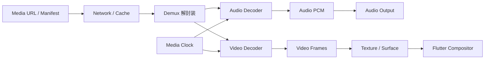

关键阶段：

1. Data Source 从网络、文件或缓存读取字节。
2. Demuxer 从 MP4、MPEG-TS、fMP4 等容器拆出音视频轨道。
3. Decoder 将压缩编码转换为可播放的音频采样和视频帧。
4. Media Clock 协调音频、视频和播放位置。
5. 音频送往系统音频输出。
6. 视频通过 Surface/Texture 等平台路径进入 Flutter Scene。

具体 Android/iOS 播放框架、线程模型、Buffer 类型和硬件解码实现与所选插件及平台版本相关。Flutter 代码不应依赖某个内部线程名称。

### 2.2 采集链路

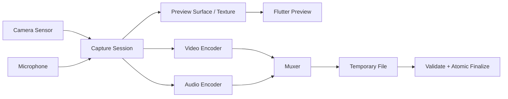

预览和录制可能共享同一 Capture Session，但它们不是同一个状态。预览可用不代表编码器、麦克风和文件写入已经开始。

---

## 三、Flutter 在媒体系统中的职责边界

Flutter 通常适合负责：

- 播放控制 UI；
- 页面和业务状态；
- 手势、字幕样式和控制层动画；
- 路由与生命周期协调；
- 埋点和错误展示；
- 业务播放策略。

平台媒体实现通常负责：

- 网络媒体协议与解封装；
- 硬件/软件解码器；
- 音频输出和音频会话；
- Surface、Pixel Buffer 或 Texture 生产；
- DRM/CDM 与安全解码路径；
- 相机、麦克风、编码与封装；
- 系统媒体通知和远程控制。

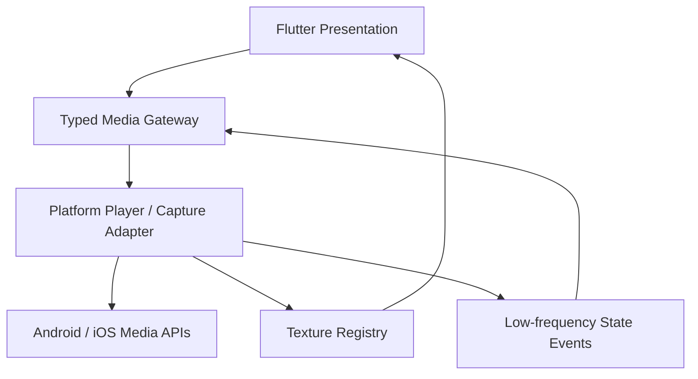

不要把播放器的每个内部 Buffer 回调都原样推给 Dart。跨边界事件应聚合、节流，并使用稳定协议表达 UI 真正需要的状态。

---

## 四、播放器状态机：不要只保存 `isPlaying`

播放器常见事实至少有五个维度：

| 维度 | 示例 |
|---|---|
| 生命周期 | idle、initializing、ready、disposed |
| 播放意图 | playWhenReady / pausedByUser |
| 播放推进 | playing、stalled、ended |
| Buffer | buffered ranges、buffering、buffer exhausted |
| 错误 | recoverable、fatal、DRM、source、decoder |

如果只使用 `isPlaying`、`isLoading`、`hasError` 三个布尔值，会产生矛盾组合：

- 用户希望播放，但正在缓冲，所以实际没有推进；
- 已有旧画面且后台补 Buffer，不应显示全屏 Loading；
- 到达结尾后 `isPlaying=false`，但语义不是用户暂停；
- 音频焦点临时丢失导致暂停，恢复策略不同于用户主动暂停。

### 4.1 Sealed 生命周期状态

```dart
sealed class PlayerLifecycleState {
  const PlayerLifecycleState();
}

final class PlayerIdle extends PlayerLifecycleState {
  const PlayerIdle();
}

final class PlayerInitializing extends PlayerLifecycleState {
  const PlayerInitializing();
}

final class PlayerReady extends PlayerLifecycleState {
  const PlayerReady();
}

final class PlayerFailed extends PlayerLifecycleState {
  const PlayerFailed(this.failure);
  final MediaFailure failure;
}

final class PlayerDisposed extends PlayerLifecycleState {
  const PlayerDisposed();
}
```

### 4.2 正交状态组合

```dart
final class PlayerSnapshot {
  const PlayerSnapshot({
    required this.lifecycle,
    required this.playWhenReady,
    required this.isAdvancing,
    required this.isBuffering,
    required this.position,
    required this.duration,
    required this.buffered,
    required this.speed,
  });

  final PlayerLifecycleState lifecycle;
  final bool playWhenReady;
  final bool isAdvancing;
  final bool isBuffering;
  final Duration position;
  final Duration? duration;
  final List<DurationRange> buffered;
  final double speed;
}
```

`playWhenReady=true` 且 `isAdvancing=false`、`isBuffering=true` 表示用户希望播放但 Buffer 不足。将意图与实际推进分开后，UI 和恢复策略才清晰。

### 4.3 典型状态转换

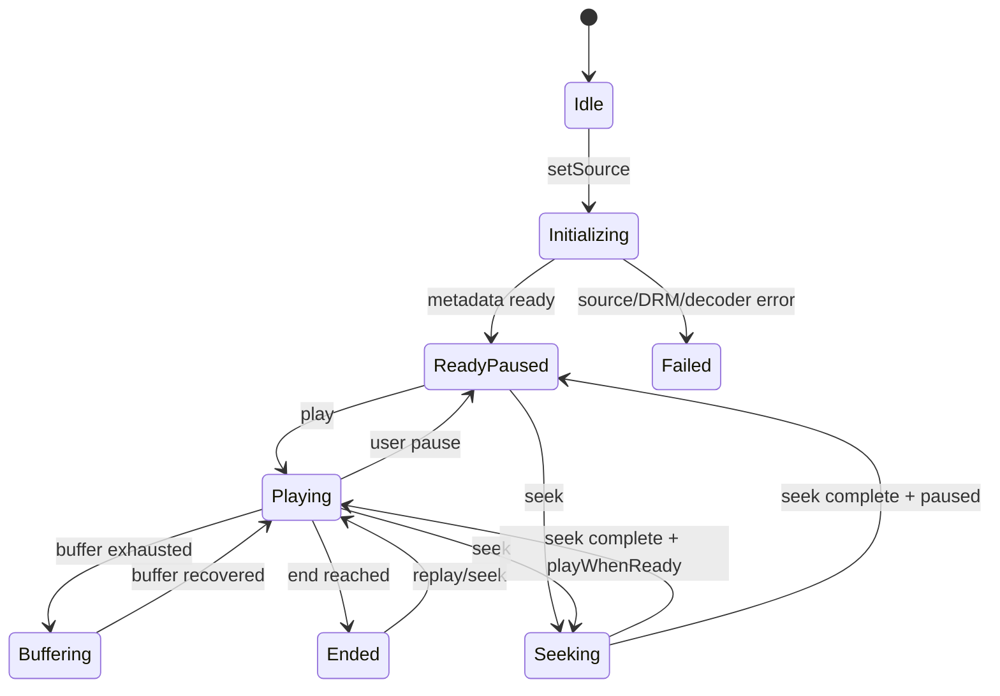

实际播放器可能由底层状态和业务意图组合，而不是单一枚举。重要的是定义每个事件在当前状态是否合法，以及异步结果如何防止跨媒体源污染。

---

## 五、媒体源切换与异步竞态

信息流快速滑动时，播放器可能连续绑定视频 A、B、C。A 的初始化结果晚到，不能覆盖 C。

```dart
final class MediaController {
  MediaController(this._platformPlayer);

  final PlatformPlayer _platformPlayer;
  int _sourceGeneration = 0;
  bool _disposed = false;

  Future<void> setSource(MediaSource source) async {
    final generation = ++_sourceGeneration;
    emit(const PlayerSnapshot.initializing());

    try {
      final metadata = await _platformPlayer.prepare(source);
      if (_disposed || generation != _sourceGeneration) return;
      emit(PlayerSnapshot.ready(metadata));
    } catch (error, stackTrace) {
      if (_disposed || generation != _sourceGeneration) return;
      logger.error('media prepare failed', error, stackTrace);
      emit(PlayerSnapshot.failed(mapMediaFailure(error)));
    }
  }

  Future<void> dispose() async {
    if (_disposed) return;
    _disposed = true;
    _sourceGeneration++;
    await _platformPlayer.dispose();
  }
}
```

生产实现还要：

- 取消旧网络、DRM 和解码准备任务；
- 用媒体实例 ID 过滤迟到事件；
- 确保 Texture ID 与当前实例对应；
- 防止旧播放器释放新播放器资源；
- 对 `dispose` 和平台回调做幂等处理。

`mounted` 只能保护 Widget，不足以验证结果属于当前媒体源。

---

## 六、Texture 渲染：视频帧如何进入 Flutter

视频不适合把每一帧编码成 `Uint8List` 经 MethodChannel 传入 Dart。1080p RGBA 一帧粗略约 8 MB，30 fps 会带来巨大的复制、分配和 Channel 压力。

更常见的路径是平台播放器把帧输出到平台 Buffer/Surface，注册为 Flutter 可消费的 Texture，并把一个轻量 Texture ID 交给 Dart。

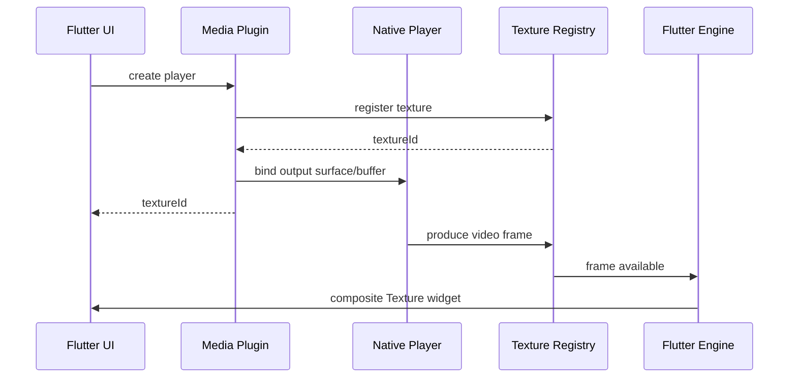

Dart 侧只需：

```dart
AspectRatio(
  aspectRatio: videoWidth / videoHeight,
  child: Texture(textureId: textureId),
)
```

### 6.1 Texture 的优势

- 视频帧避免逐帧穿过通用消息编解码；
- Flutter 可以在 Scene 中布局、变换和覆盖控制层；
- 控制 UI 保持 Flutter 风格；
- 与 Platform View 相比，通常更适合纯画面输出。

### 6.2 Texture 不是零成本

仍可能涉及：

- Decoder 输出格式转换；
- Buffer 队列与同步；
- GPU 纹理导入和合成；
- 旋转、色彩空间与 HDR 处理；
- 帧生产速度与屏幕 VSync 不匹配；
- Texture 生命周期和内存。

Android Surface/SurfaceTexture、iOS Pixel Buffer/Metal 以及 Flutter Engine 的具体对接会随插件、渲染后端和 SDK 版本变化。性能必须真机验证。

### 6.3 控制事件不要每帧跨 Channel

播放位置 UI 通常不需要 60 Hz 原生回调。可以：

- 平台每 200~500 ms 推送校准位置；
- Flutter 在播放期间用 Ticker/Timer 做视觉插值；
- 暂停、Seek、Buffering、速率变化时立即校准；
- 后台时降低或停止 UI 更新。

具体频率取决于字幕、歌词、直播和进度条精度，必须平衡准确性与消息成本。

---

## 七、首帧：先定义“第一帧”是什么

常见时间点：

1. 用户点击播放。
2. 调用 `setSource`。
3. 清单/媒体元数据可用。
4. 播放器 ready。
5. 第一帧被解码。
6. 第一帧提交给 Texture。
7. Flutter 合成并显示非占位画面。
8. 音频首次输出。

不同团队说“首帧 300 ms”可能使用不同起终点，数据不可比较。

### 7.1 推荐指标

- Time to Metadata：设置媒体源到元数据可用；
- Time to Ready：设置媒体源到可播放；
- Video First Frame：播放意图到用户可见视频帧；
- Audio First Sample：播放意图到可听音频；
- Join Time：直播进入到连续播放；
- Poster Gap：封面消失到首帧显示之间的空白。

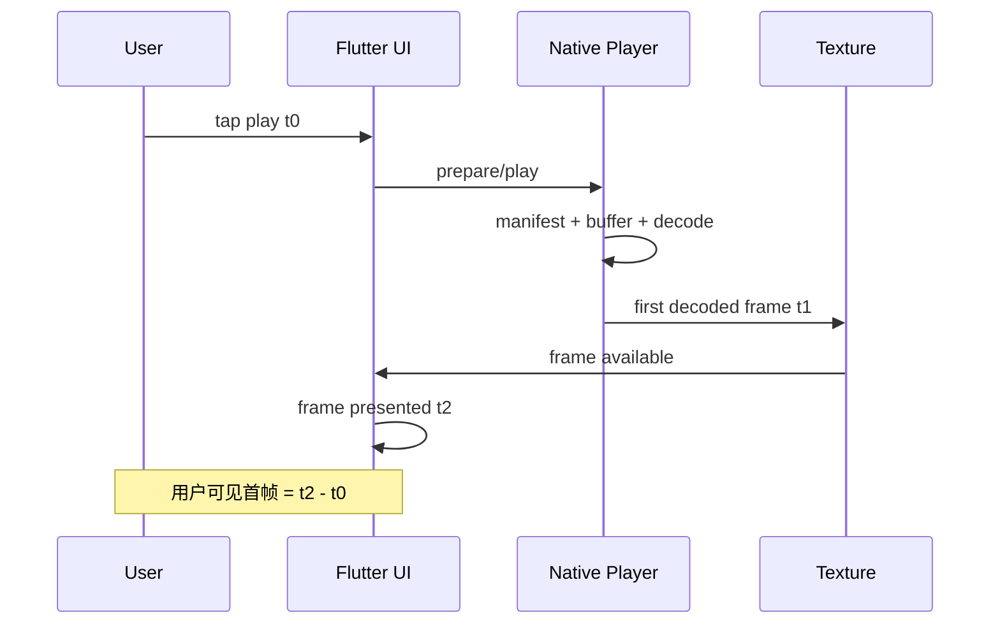

播放器报告 decoded first frame 不一定等于屏幕已显示。若业务要求严格，应结合 Texture 首帧回调、Flutter Frame Timing 或截图/像素检测验证呈现时刻。

### 7.2 优化首帧的方向

- 就近 CDN 与连接复用；
- 合理首分片大小；
- 首选码率不过高；
- 预取清单或首分片，但控制流量和缓存污染；
- 复用播放器需彻底重置旧状态；
- 提前准备解码器要权衡内存；
- 封面保持到真实首帧到达，避免黑屏；
- 将非关键鉴权、埋点从阻塞路径移开；
- DRM License 预取必须符合安全与授权策略。

优化必须先拆分 DNS、连接、TTFB、清单、Buffer、DRM、Decoder 和呈现阶段，不能只测总时间猜根因。

---

## 八、缓冲：下载速度与消费速度的竞争

播放器持续消费媒体数据，网络持续补充 Buffer。当下载吞吐低于媒体码率，Buffer 会下降并最终耗尽。

```text
buffer change ≈ downloaded media duration - consumed duration
```

实际系统还受分片、码率切换、解码队列和直播窗口影响。

### 8.1 三种不同 Loading

| 状态 | 用户体验 | UI 建议 |
|---|---|---|
| Initial buffering | 还没有可播放内容 | 封面 + 启动进度 |
| Rebuffering | 播放中断，等待数据 | 保留最后画面 + 轻量 Loading |
| Background buffering | 仍在播放，后台补数据 | 通常不遮挡画面 |

一个 `isBuffering` 不能决定所有 UI。还需知道是否曾显示首帧、是否实际推进、Buffer Range 和用户播放意图。

### 8.2 Buffer 策略取舍

- 起播 Buffer 小：首帧快，但弱网更易卡顿；
- 起播 Buffer 大：首帧慢，但启动后更稳定；
- 最大 Buffer 大：抗抖动更强，但占内存、流量和缓存；
- 直播 Buffer 小：延迟低，但更敏感；
- 点播预取多：Seek 更快，但可能下载用户不会看的内容。

没有统一最优值。短视频、长视频、音乐、直播和离线播放应有不同策略。

### 8.3 卡顿指标

- Rebuffer Count；
- Rebuffer Duration；
- Rebuffer Ratio = 卡顿总时长 / 播放会话时长；
- Time to First Rebuffer；
- Buffer Level 分布；
- 卡顿前网络吞吐、所选码率和 Decoder 状态。

需要区分网络 Buffering 与 Decoder/Renderer 卡住，UI 上都可能表现为“不动”。

---

## 九、Seek：定位不是简单修改 position

压缩视频通常依赖关键帧（I-frame）。随机 Seek 到任意时间点时，播放器可能需要先定位到目标附近关键帧，再解码后续帧直到目标。


### 9.1 Seek 精度与速度

- Fast/Closest Sync：定位关键帧附近，快但不精确；
- Accurate/Exact：继续解码到目标，慢且消耗更多 CPU/网络；
- Live Seek：受直播 DVR Window 限制；
- 音频 Seek：仍可能受索引、编码帧和流类型限制。

具体 API 能否保证精确 Seek 取决于播放器、容器索引、流协议和平台。

### 9.2 连续拖动进度条

不要为每个 Pointer Move 发起完整 Seek：

1. Flutter 本地更新预览位置。
2. 对缩略图请求节流并取消旧请求。
3. 用户松手后提交最终 Seek。
4. Seek 使用 generation，忽略先前完成事件。
5. Seek 完成后根据 `playWhenReady` 恢复播放或保持暂停。

```dart
Future<void> seekTo(Duration target) async {
  final generation = ++_seekGeneration;
  emit(state.copyWith(seekTarget: target, isSeeking: true));

  try {
    final actual = await player.seek(target);
    if (_disposed || generation != _seekGeneration) return;
    emit(state.copyWith(
      position: actual,
      seekTarget: null,
      isSeeking: false,
    ));
  } catch (error, stackTrace) {
    if (_disposed || generation != _seekGeneration) return;
    logger.warning('seek failed', error, stackTrace);
    emit(state.copyWith(seekTarget: null, isSeeking: false));
  }
}
```

---

## 十、后台播放不是应用不销毁就行

后台音频需要与系统媒体基础设施集成。

### 10.1 Android

典型能力包括：

- 合规的前台服务；
- Media Session；
- 媒体样式通知；
- 音频焦点；
- 耳机、蓝牙与 Noisy Intent；
- 系统媒体按钮和锁屏控制；
- Android 版本对应的权限与后台执行限制。

### 10.2 iOS

典型能力包括：

- 正确配置音频会话 Category/Mode/Options；
- 声明确有业务需要的 Background Audio Mode；
- 接收系统中断与 Route Change；
- Now Playing Info；
- Remote Command Center；
- 遵守 App Store 和平台后台政策。

> 后台能力、权限和商店规则会随系统版本变化。实现时必须查阅目标 Android/iOS 版本与所选插件的当前官方文档。

### 10.3 前后台策略矩阵

| 媒体类型 | 页面不可见 | 应用后台 | 常见策略 |
|---|---|---|---|
| 音乐/播客 | 可继续 | 经用户授权继续 | 系统媒体会话 |
| 短视频 Feed | 暂停 | 暂停 | 回前台按可见项恢复 |
| 视频课程 | 产品决定 | 常转音频或暂停 | 保留位置，明确提示 |
| 视频通话 | 保持会话 | 按平台通话能力 | 音频路由和系统集成 |
| 相机预览 | 停止/释放 | 必须停止 | 返回后重建 Session |

后台播放是产品能力，不应所有播放器默认开启。

---

## 十一、音频焦点与系统中断

音频焦点用于协调多个 App 的声音输出，但 Android 和 iOS 的 API 与事件模型不同。业务层应映射为稳定语义：

```dart
sealed class AudioInterruption {
  const AudioInterruption();
}

final class InterruptionBegan extends AudioInterruption {
  const InterruptionBegan({required this.mayDuck});
  final bool mayDuck;
}

final class InterruptionEnded extends AudioInterruption {
  const InterruptionEnded({required this.mayResume});
  final bool mayResume;
}

final class AudioRouteBecameNoisy extends AudioInterruption {
  const AudioRouteBecameNoisy();
}
```

### 11.1 暂停、Duck 还是继续

- 音乐遇到导航播报：可以 Duck；
- 播客遇到短暂中断：通常暂停更合适；
- 来电：暂停，并记录中断前是否由用户播放；
- 耳机拔出：立即暂停，避免扬声器外放；
- 用户主动暂停后发生中断恢复：不能自动播放。

```dart
bool _wasPlayingBeforeInterruption = false;

void onInterruptionBegan({required bool mayDuck}) {
  _wasPlayingBeforeInterruption = state.isAdvancing;
  if (mayDuck && policy.allowsDucking) {
    player.setVolume(policy.duckVolume);
  } else {
    player.pause();
  }
}

void onInterruptionEnded({required bool mayResume}) {
  player.setVolume(state.userVolume);
  if (mayResume && _wasPlayingBeforeInterruption && !state.pausedByUser) {
    player.play();
  }
  _wasPlayingBeforeInterruption = false;
}
```

恢复条件必须组合系统许可、此前意图和当前页面/会话状态。异步期间媒体源可能已经切换，因此还需验证实例 ID。

### 11.2 音频会话是进程级共享资源

多个播放器、录音器、视频通话和语音消息可能争用同一个音频会话。应建立集中 Audio Session Coordinator，根据当前最高优先级场景配置系统，而不是每个插件独自覆盖 Category/Focus。

---

## 十二、播放器生命周期

需要区分：

- Widget 是否 mounted；
- Route 是否当前可见；
- Tab 是否选中；
- 应用是否 `resumed`；
- 原生容器是否可见；
- Engine 是否仍连接；
- 播放器是否仍拥有解码器和 Texture。

```dart
bool get shouldRenderVideo =>
    appIsVisible && routeIsCurrent && tabIsSelected && !disposed;

bool get shouldPlay =>
    shouldRenderVideo &&
    userWantsPlayback &&
    !audioInterrupted &&
    sourceIsReady;
```

### 12.1 资源释放

播放器 `dispose` 应清理：

- 原生 Player；
- Texture/Surface；
- Channel/Event Handler；
- 音频焦点和媒体会话；
- 网络和 DRM 请求；
- Timer、StreamSubscription 和位置回调；
- 缓存文件句柄；
- 屏幕常亮锁和横竖屏设置。

清理应幂等。页面退出后如果业务需要后台音频，播放器所有权应提升到 Session/Playback Service，而不是被页面 `dispose`；页面只解除 UI 订阅。

### 12.2 播放器池

短视频 Feed 可考虑少量播放器复用，但需要明确：

- 当前、前一个、后一个视频的预热数量；
- Source 切换 generation；
- 旧 Texture 与事件清理；
- DRM Session 是否可复用；
- 用户、Cookie、Header 隔离；
- 内存压力时淘汰；
- 不同编码能力导致的 Decoder 重建。

播放器池会增加状态复杂度，必须用首帧和内存数据证明收益。

---

## 十三、播放缓存的三个层次

### 13.1 内存 Buffer

播放器为连续播放保存即将消费的媒体数据。它生命周期短，主要解决网络抖动，不等于可跨会话缓存。

### 13.2 HTTP/分片磁盘缓存

缓存清单或媒体分片，减少重复下载。需要：

- Cache Key 包含 URL、Range、Header 中影响内容的字段；
- TTL、ETag 或服务端失效策略；
- LRU/容量上限；
- 用户和租户隔离；
- Range Request 正确性；
- 部分分片完整性校验；
- 清单更新和直播窗口处理；
- 敏感 Header 不落日志。

### 13.3 离线下载

离线内容需要完整下载状态机、空间预算、断点续传、清单版本和许可证治理：

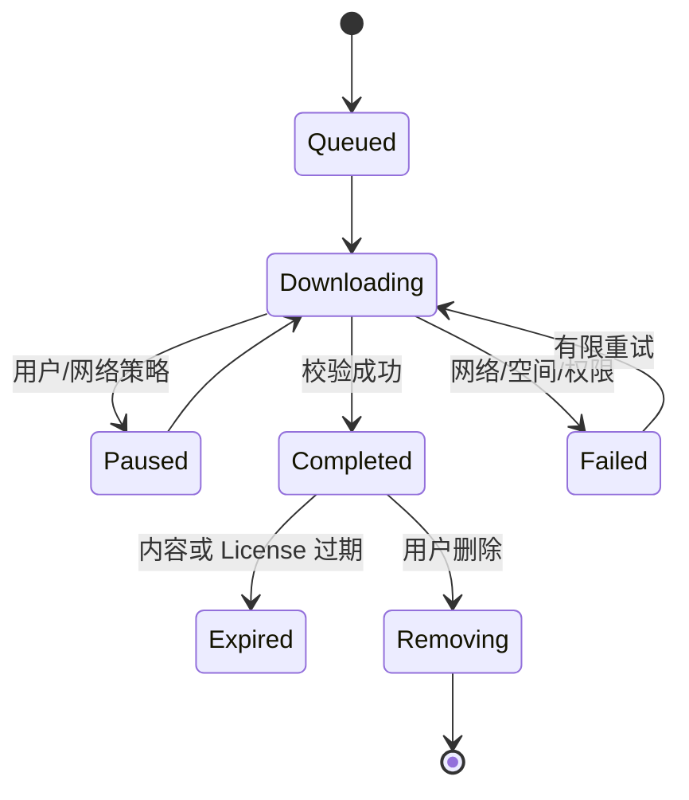

不要把普通播放器临时缓存包装成“离线下载”，两者在完整性、可发现性、过期和 DRM 上承诺不同。

### 13.4 缓存不是越大越好

需要衡量：

- Cache Hit Ratio；
- 节省流量；
- 磁盘占用和写放大；
- 首帧与卡顿改善；
- 内容更新后的陈旧率；
- 用户主动清理与系统空间压力；
- 隐私和账号退出清理。

---

## 十四、多清晰度与自适应码率

多清晰度通常由 HLS、MPEG-DASH 或其他流媒体清单描述多个 Variant/Rendition。每个变体可能有不同：

- 分辨率；
- 视频码率；
- 编码格式和 Profile；
- 帧率；
- HDR/色彩空间；
- 音频轨道和语言；
- DRM 信息。

### 14.1 ABR 选择因素

Adaptive Bitrate（ABR，自适应码率）通常考虑：

- 最近分片下载吞吐；
- 当前 Buffer Level；
- 视口尺寸和设备像素比；
- Decoder 能力；
- 用户选择和流量偏好；
- 直播延迟；
- 切换稳定性与滞回。

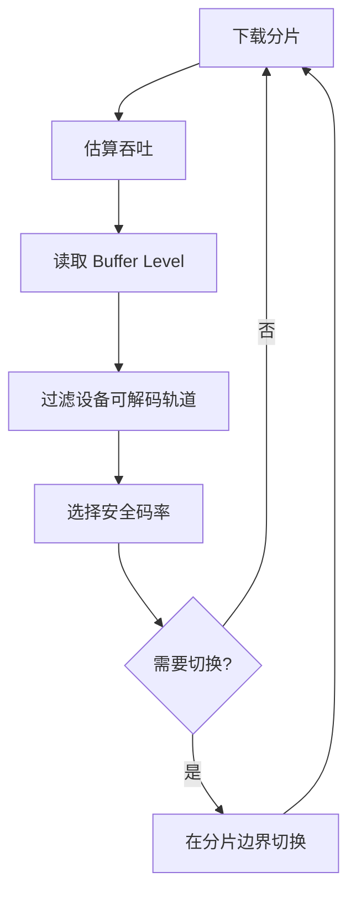

只根据瞬时网速切换会来回震荡。通常需要保守系数、滑动估计和上下切换不同阈值。

### 14.2 手动清晰度与自动模式

- Auto：由 ABR 选择；
- 指定清晰度：约束到用户选择，但网络不足时是继续卡顿还是允许降级要明确；
- 切换时保留位置和播放意图；
- 音视频时间线、分片边界和 DRM 配置要兼容；
- UI 显示的是分辨率标签还是实际当前轨道，应区分。

“选择 1080p”不代表每一帧都以固定码率传输，也不代表设备能硬件解码该 Codec/Profile。

### 14.3 服务端同样决定体验

客户端无法修复：

- 码率梯度断层；
- GOP 过长导致 Seek/切换慢；
- 分片时间线不对齐；
- 音视频时间戳错误；
- CDN Range/缓存配置错误；
- 清单声明与实际编码不一致。

媒体问题必须联合转码、打包、CDN 和客户端排查。

---

## 十五、DRM：不仅是一个 License URL

DRM 常涉及：

- 加密媒体内容；
- Manifest 中的保护信息；
- CDM/平台 DRM 模块；
- License Challenge 与 License Server；
- 用户认证和内容授权；
- Key、License 生命周期；
- 安全解码与输出保护；
- 离线许可证。

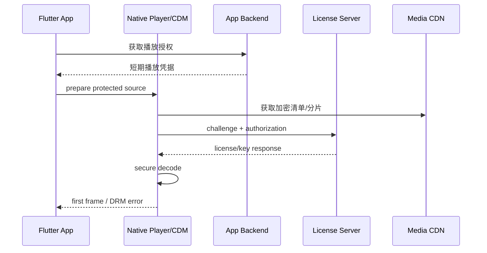

Android 常见 Widevine，Apple 平台常见 FairPlay Streaming；具体能力、等级、离线支持和输出限制取决于设备、系统、播放器和内容策略。

### 15.1 客户端安全边界

- 不在 Dart 代码硬编码长期 License Secret；
- 播放 Token 短期、最小权限并由服务端授权；
- License 请求和响应不写日志；
- 不自行把明文 Key 存数据库；
- 遵守 HDCP、截图/录屏和安全 Surface 策略；
- Root/Jailbreak 检测只能提高门槛，不能成为唯一授权依据；
- 账号退出、设备撤销和内容过期后清理离线 License。

### 15.2 DRM 错误分类

- Provisioning 失败；
- 设备不支持指定方案或安全级别；
- License 网络失败；
- 认证过期；
- 内容授权拒绝；
- License 过期；
- Key Rotation 失败；
- 输出保护不满足；
- 加密轨道与清单不兼容。

只有瞬时网络错误适合有限重试。授权拒绝和设备能力不足不会通过盲目重试恢复。

### 15.3 DRM 与缓存

缓存加密分片不等于获得离线播放权。离线播放还需要平台支持的持久 License、过期和续期策略。不要解密后缓存明文媒体。

---

## 十六、相机预览

相机预览通常通过平台 Capture Session 产生画面，再以 Texture 或平台特定路径交给 Flutter。

### 16.1 初始化状态机

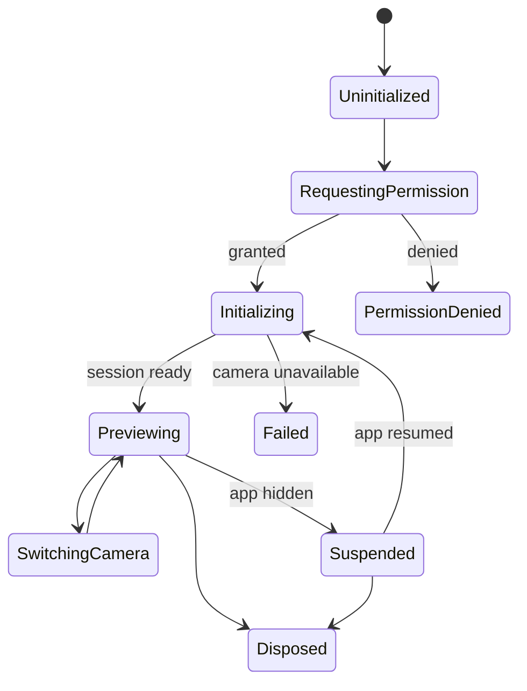

不能在 `build` 中初始化相机。Controller 由明确 State/Scope 拥有，处理异步初始化 generation，并在页面退出时释放。

### 16.2 权限

- 在用户理解用途的时机请求；
- 区分首次拒绝、永久拒绝和系统限制；
- 录制有声视频还需麦克风权限；
- 权限可能在系统设置中改变，恢复前台时重新校验；
- 不在权限未授予时打开采集设备；
- 隐私声明与平台配置必须一致。

### 16.3 方向、镜像与比例

需要区分：

- Sensor Orientation；
- Device Orientation；
- Preview Rotation；
- Capture Rotation Metadata；
- 前置摄像头预览镜像；
- 最终照片/视频是否镜像；
- Preview `cover` 裁剪与实际取景范围。

只对 Flutter Widget 旋转画面不一定修复输出文件方向。元数据和像素旋转要根据下游兼容性处理。

### 16.4 相机资源竞争

系统相机、视频通话、扫码和其他 App 可能占用摄像头。进入后台通常应停止或释放 Session；恢复时重新初始化，而不是假定旧 Texture 和设备句柄仍有效。

---

## 十七、拍照、录像与录音

### 17.1 不要把“开始录制”当成已成功录制

录制链路包含：

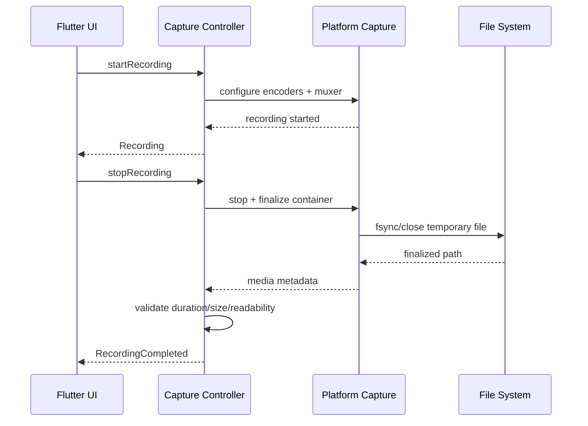

只有容器完成 Finalize 并通过校验后，才能把文件当成可上传成品。

### 17.2 录制状态机

```dart
sealed class RecordingState {
  const RecordingState();
}

final class RecordingIdle extends RecordingState {
  const RecordingIdle();
}

final class RecordingStarting extends RecordingState {
  const RecordingStarting();
}

final class RecordingActive extends RecordingState {
  const RecordingActive(this.startedAt);
  final DateTime startedAt;
}

final class RecordingStopping extends RecordingState {
  const RecordingStopping();
}

final class RecordingCompleted extends RecordingState {
  const RecordingCompleted(this.output);
  final CapturedMedia output;
}

final class RecordingFailed extends RecordingState {
  const RecordingFailed(this.failure, {required this.recoverable});
  final CaptureFailure failure;
  final bool recoverable;
}
```

快速双击、开始期间停止、录制中切摄像头等非法操作应被状态机拒绝或排队，不能同时调用底层 API。

### 17.3 异常路径

- 用户撤销权限；
- 来电或音频会话中断；
- 应用进入后台；
- 磁盘空间不足；
- 文件写入失败；
- 编码器初始化或运行失败；
- 摄像头被占用；
- 温度或系统资源限制；
- 进程终止；
- 最大时长/文件大小到达；
- 蓝牙麦克风或音频路由变化。

每条路径要定义：自动结束并保留、丢弃临时文件、允许重试还是提示用户。

### 17.4 临时文件与原子完成

建议：

1. 在应用私有临时目录写入。
2. 使用唯一 Capture ID，避免文件名冲突。
3. Stop 后关闭编码器和 Muxer。
4. 校验文件存在、大小、时长和可解码性。
5. 原子移动/登记为已完成媒体。
6. 上传成功或用户放弃后按策略清理。
7. 冷启动扫描并删除超龄临时文件。

不要先把未完成路径加入相册或上传队列。

### 17.5 录音特有边界

- Sample Rate、Channel Count、Bit Depth 与编码格式；
- 音频会话 Category/Mode；
- 回声消除、降噪和自动增益是否适用；
- 蓝牙设备的 Profile 与带宽限制；
- 波形数据的采样节流；
- 音频焦点和其他播放器协调；
- 隐私指示器和后台录音政策。

语音消息、音乐录制和实时通话的音频处理目标不同，不能共享一套默认参数。

---

## 十八、错误模型与恢复策略

```dart
sealed class MediaFailure {
  const MediaFailure();
}

final class MediaNetworkFailure extends MediaFailure {
  const MediaNetworkFailure({required this.isTransient});
  final bool isTransient;
}

final class MediaSourceUnsupported extends MediaFailure {
  const MediaSourceUnsupported(this.codecOrContainer);
  final String codecOrContainer;
}

final class MediaDecoderFailure extends MediaFailure {
  const MediaDecoderFailure();
}

final class MediaDrmFailure extends MediaFailure {
  const MediaDrmFailure(this.reason);
  final DrmFailureReason reason;
}

final class CapturePermissionDenied extends MediaFailure {
  const CapturePermissionDenied({required this.permanently});
  final bool permanently;
}

final class CaptureStorageFull extends MediaFailure {
  const CaptureStorageFull();
}
```

恢复策略：

| 错误 | 常见处理 |
|---|---|
| 瞬时网络失败 | 幂等读取有限退避重试，保留播放位置 |
| 内容 404/下架 | 不重试，展示业务状态 |
| Decoder 暂时异常 | 有限重建播放器，避免无限循环 |
| Codec 不支持 | 降级轨道或明确提示 |
| DRM 授权拒绝 | 不盲重试，走登录/购买/设备提示 |
| 相机权限拒绝 | 解释用途，永久拒绝时引导系统设置 |
| 磁盘满 | 停止并安全完成/丢弃，提示清理空间 |
| 用户取消 | 静默结束，不当作崩溃上报 |

底层原始错误和 StackTrace 应进入脱敏诊断；UI 消费稳定业务错误，不展示 License URL、Token、文件绝对路径或设备隐私信息。

---

## 十九、性能与内存

音视频资源大量位于 Dart Heap 之外：

- Decoder Buffer；
- 音频 PCM Buffer；
- 视频帧和 GPU Texture；
- Surface/Pixel Buffer；
- Player/Codec 原生对象；
- HTTP Cache 和文件映射；
- Camera Capture Buffer；
- Encoder/Muxer；
- DRM Session。

Dart Heap 稳定不能证明没有媒体泄漏。

### 19.1 视频帧内存直觉

1920 x 1080 的 RGBA 帧约 7.9 MiB；YUV 格式通常更紧凑，但播放器可能同时持有多帧、转换 Buffer 和 GPU 资源。4K、多播放器预热和高帧率会快速提高峰值。

这只是粗略估算，实际像素格式、对齐、Buffer 数量和零拷贝路径由平台实现决定。

### 19.2 关键性能指标

- Video First Frame / Audio First Sample；
- Rebuffer Count、Duration、Ratio；
- Dropped Video Frames；
- A/V Sync Drift；
- Decoder Init/Reuse Failure；
- 平均与 P95/P99 播放启动时间；
- ABR 切换次数、上切/下切原因；
- 平均播放码率和清晰度；
- Texture/Player 实例数；
- Dart/Native/Graphics 内存；
- 相机打开时间、拍照耗时、录像完成耗时；
- 录制失败和临时文件残留率。

### 19.3 测量工具

- Flutter DevTools：UI/Raster Frame、Dart CPU、Dart Memory；
- Android：Perfetto、Android Studio Profiler、`dumpsys meminfo`、媒体/Codec 日志；
- iOS：Instruments Time Profiler、Allocations、Leaks、Energy Log；
- 网络代理/CDN 日志：清单、分片、TTFB、Range、缓存命中；
- 播放器平台诊断：轨道、Decoder、Buffer、Dropped Frames；
- 外部摄像机或屏幕录制：首帧与音画同步验证。

所有结论应注明 Flutter/插件/系统版本、设备、构建模式、媒体样本、网络条件和屏幕刷新率。

---

## 二十、可观测性与 QoE

QoE（Quality of Experience，体验质量）事件应围绕一次播放 Session：

```text
session_start
source_prepare_start
manifest_loaded
drm_license_start / end
player_ready
first_video_frame
playback_started
rebuffer_start / end
quality_changed
seek_start / end
interruption_begin / end
playback_ended / failed
session_end
```

### 20.1 Session 标识

至少区分：

- Playback Session ID；
- Media Content ID；
- Player Instance ID；
- Source Generation；
- 当前 CDN/清晰度/Codec；
- App/Route 生命周期。

不要把包含签名 Token 的完整媒体 URL 当 Content ID 上报。

### 20.2 卡顿归因

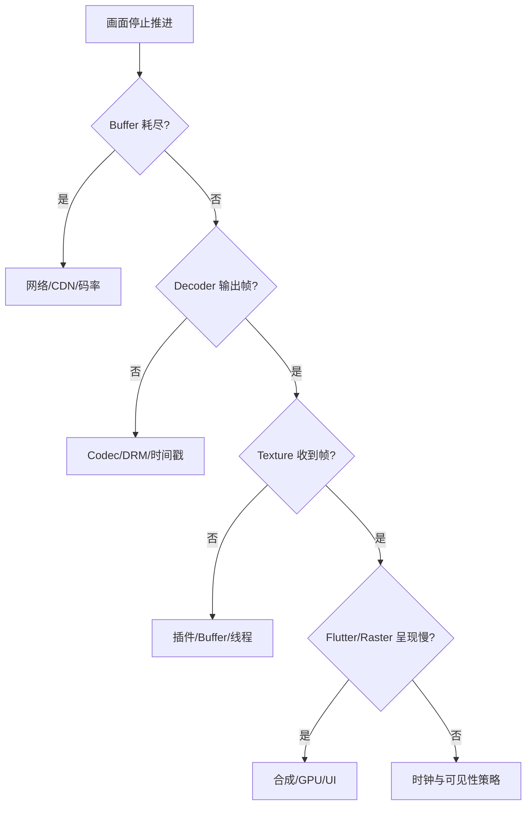

不能把所有“卡住”都归类为网络 Buffering。

---

## 二十一、安全与隐私

- 相机和麦克风权限按需申请，并展示清晰用途；
- 采集指示器和系统隐私行为不能绕过；
- 临时录音录像放在应用私有目录；
- 上传使用 TLS、短期授权和服务端内容校验；
- 日志不记录媒体签名 URL、License、Token、文件内容和用户语音；
- 用户退出或删除内容时执行缓存和离线 License 清理策略；
- 截图/录屏限制只能提高保护程度，不能保证内容无法被外部设备录制；
- 客户端 DRM、混淆和 Root 检测都不能替代服务端授权；
- 第三方播放器、Codec 和媒体 SDK 纳入供应链与漏洞治理。

录制和上传还应考虑未成年人、地域法规、用户同意、数据保留期限和删除机制。

---

## 二十二、测试矩阵

### 22.1 播放功能

- 首次播放、暂停、继续、结束和重播；
- 快速切源和连续 Feed 滑动；
- 起播前 Seek、播放中 Seek、连续拖动；
- 倍速、静音、音轨和字幕切换；
- 清晰度 Auto/手动切换；
- 本地文件、点播、直播和离线内容；
- 受保护和非 DRM 内容；
- 横竖屏、全屏和画中画（若支持）。

### 22.2 网络与媒体样本

- 高延迟、低带宽、抖动、丢包和断网恢复；
- Wi-Fi/蜂窝切换；
- 404、403、429、5xx 和分片损坏；
- 清单更新、直播窗口滑动和 CDN 切换；
- 不同 Codec、Profile、分辨率、帧率和音频格式；
- VFR（可变帧率）、异常时间戳和超长 GOP；
- 音轨缺失、纯音频和无声视频。

### 22.3 生命周期与音频

- Route 覆盖、Tab 切换、前后台和锁屏；
- 来电、闹钟、语音助手和导航播报；
- 耳机插拔、蓝牙切换和扬声器路由；
- 用户暂停后发生中断，确保不自动恢复；
- 后台控制、通知、锁屏信息与媒体按键；
- 低内存后播放器重建。

### 22.4 相机与录制

- 权限允许、拒绝、永久拒绝和设置中撤销；
- 前后摄像头切换；
- 各方向、镜像、裁剪与最终文件；
- 开始/停止快速点击；
- 录制中来电、后台、锁屏和音频路由变化；
- 磁盘不足、最大时长、编码失败；
- 冷启动临时文件清理；
- 文件可解码、时长和音画同步。

### 22.5 设备矩阵

- Android/iOS 最低支持与主流系统；
- 低端、中端、高端设备；
- 不同 GPU、Decoder 能力和屏幕刷新率；
- 刘海、折叠屏、平板和多窗口；
- 真机而非只用模拟器。

---

## 二十三、自动化与故障注入

### 23.1 状态机单元测试

```dart
test('用户主动暂停后，中断结束不会自动恢复', () {
  final machine = PlayerStateMachine.playing();

  machine.onUserPause();
  machine.onInterruptionBegan(mayDuck: false);
  machine.onInterruptionEnded(mayResume: true);

  expect(machine.state.playWhenReady, isFalse);
  expect(machine.commands, isNot(contains(PlayerCommand.play)));
});
```

覆盖非法转换、重复事件、源 generation、Seek generation 和 Dispose 后迟到回调。

### 23.2 Fake Player

Fake 应允许控制：

- Ready 与 First Frame 分开到达；
- Buffering 开始/结束；
- 位置和 Duration；
- Seek 实际落点；
- Error 类型；
- 音频中断；
- 事件乱序。

只 Mock `play()` 是否调用，无法验证播放器状态语义。

### 23.3 网络故障注入

使用可控代理或测试服务器注入延迟、限速、断连、错误分片和 HTTP 状态。测试应记录媒体、网络脚本与预期 ABR/Buffer 行为。

### 23.4 Texture 像素验证

自动化应确认 Texture 不是黑帧或停在封面：

- 等待平台报告首帧；
- 截图目标区域；
- 检查非空像素和帧间变化；
- 同时验证 Aspect Ratio、旋转和遮罩；
- 在 Android/iOS 真机分别执行。

平台播放保护可能禁止截图 DRM 内容，此时应使用非 DRM 测试素材验证渲染链路，并使用播放器诊断验证受保护路径。

---

## 二十四、常见误区与修复

### 24.1 `isPlaying=false` 就显示播放按钮

**问题：** Buffering、Ended、Interrupted 和 User Paused 语义不同。

**修复：** 分离播放意图、实际推进、Buffer 和生命周期状态。

### 24.2 Controller initialized 就算首帧

**问题：** 元数据 ready 后可能仍未解码或呈现画面。

**修复：** 定义从用户意图到屏幕真实首帧的指标，并拆分各阶段。

### 24.3 视频帧通过 MethodChannel 传输

**问题：** 大量编码、复制、分配和线程调度。

**修复：** 使用 Texture/Surface 或平台专用零拷贝方向，Channel 只传控制和聚合状态。

### 24.4 每次拖动进度条都 Seek

**问题：** 连续取消、网络读取和 Decoder Flush 造成卡顿。

**修复：** UI 本地预览，松手提交最终 Seek，使用 generation 淘汰旧结果。

### 24.5 回到前台就无条件自动播放

**问题：** 用户可能已主动暂停，页面也可能不再可见。

**修复：** 组合用户意图、Route、应用状态和音频中断许可。

### 24.6 页面 `dispose` 永远销毁播放器

**问题：** 后台音乐所有权可能属于应用级 Playback Service。

**修复：** 根据业务生命周期放置所有者，页面仅解除 UI 订阅。

### 24.7 缓存加密分片就能离线播放 DRM 内容

**问题：** 仍缺少有效离线 License 和授权策略。

**修复：** 使用平台 DRM 离线能力，管理 License 过期、续期和撤销。

### 24.8 只看 Dart Heap 排查播放器泄漏

**问题：** Decoder、Buffer、Texture 和 Codec 多在原生/Graphics 内存。

**修复：** 联合 DevTools、Android Profiler/Perfetto 和 iOS Instruments。

### 24.9 预热越多播放器首帧越快

**问题：** Decoder、Texture、Buffer 和网络预取会显著增加内存与流量。

**修复：** 限制预热窗口，按设备能力和实际首帧收益动态调整。

### 24.10 录制 Stop 返回就直接上传

**问题：** Muxer 可能尚未 Finalize，文件损坏或时长异常。

**修复：** 等待平台完成关闭，校验文件后原子登记为成品。

---

## 二十五、工程落地步骤

1. 明确业务类型：短视频、长视频、音乐、直播、通话还是采集。
2. 定义播放/录制状态机和非法转换。
3. 选择受维护的媒体引擎或插件，不自行实现 Codec 和流媒体协议。
4. 定义 Flutter 与平台的类型安全 Gateway，隔离插件 API。
5. 视频采用 Texture 等适当渲染路径，控制事件聚合节流。
6. 定义首帧、卡顿、Seek、音画同步和错误指标。
7. 建立应用、Route、音频焦点和播放器所有权策略。
8. 与服务端确定清单、码率梯度、GOP、CDN、缓存和 DRM 契约。
9. 相机和录制补齐权限、方向、临时文件、异常中断和清理。
10. 用 Fake Player 测状态机，用真机与故障注入测真实媒体链路。
11. 联合 Flutter 和平台工具检查帧、Native/Graphics 内存与能耗。
12. 按设备、系统、网络和媒体样本建立回归矩阵，再逐步上线。

---

## 二十六、总结

Flutter 音视频真正需要记住的是：

- 播放器是网络、解封装、解码、时钟、音频输出和视频合成共同构成的异步系统。
- 播放意图、实际推进、Buffer、生命周期和错误应分开建模。
- Texture 让视频帧绕开通用 Channel 大对象传输，但仍有 Buffer、GPU 和生命周期成本。
- 首帧必须测到用户真实可见画面，Ready 或 Decoded 回调只是中间节点。
- Initial Buffering、Rebuffering 和后台补 Buffer 的 UI 与策略不同。
- Seek 受关键帧、索引、网络和 Decoder 影响，连续拖动应本地预览并只提交最终目标。
- 后台播放依赖平台媒体会话、权限、通知和远程控制。
- 音频焦点恢复必须尊重用户暂停意图、系统许可和当前页面状态。
- 播放缓存、磁盘分片缓存与离线下载的可靠性承诺不同。
- ABR 依赖吞吐、Buffer、设备能力和服务端合理码率梯度。
- DRM 需要平台 CDM、License 和安全解码链路，缓存密文不等于离线授权。
- 相机与录制要处理权限、方向、中断、文件 Finalize、空间和隐私。
- Dart Heap 只覆盖媒体内存的一部分，验证必须结合原生和 Graphics 工具。

---

## 问答复盘

### Q1：为什么 `isPlaying` 不能完整表达播放器状态？

**答：** 用户希望播放但正在缓冲、系统中断、播放结束和用户暂停都会导致画面不推进，但恢复和 UI 语义不同，需要拆分播放意图、推进、Buffer 与生命周期。

### Q2：视频帧为什么不适合通过 MethodChannel 传给 Flutter？

**答：** 帧数据大且频率高，通用 Channel 会产生编解码、复制和分配成本。Texture/Surface 让平台媒体 Buffer 直接进入 Flutter 合成链路。

### Q3：播放器报告 Ready 是否表示首帧已经显示？

**答：** 不表示。Ready 通常只说明具备播放条件，后续还有解码、Texture 提交和 Flutter 呈现。首帧指标必须明确终点。

### Q4：已有视频画面时后台下载分片，是否应该显示全屏 Loading？

**答：** 通常不应该。后台补 Buffer 与 Buffer 耗尽导致的 Rebuffering 不同，应保留可用画面，只在真实播放中断时显示轻量反馈。

### Q5：为什么 Seek 可能落不到用户指定的精确毫秒？

**答：** 压缩视频通常要先定位关键帧，再向目标解码。播放器、容器索引和所选 Seek 模式决定速度与精度。

### Q6：来电结束后是否应该自动恢复播放？

**答：** 只有系统允许、用户中断前确实在播放、期间没有主动暂停，且当前媒体和页面仍有效时才恢复。

### Q7：播放器临时缓存和离线下载有什么区别？

**答：** 临时缓存用于改善当前或近期播放；离线下载承诺跨会话可用，需要完整性、空间、版本、过期、账号隔离和 DRM License 管理。

### Q8：选择 1080p 是否意味着播放器始终以固定 1080p 码率播放？

**答：** 不一定。标签、实际轨道、编码码率和 ABR 约束是不同概念；设备能力和网络策略也可能影响最终选择。

### Q9：相机预览正常是否说明录像一定成功？

**答：** 不说明。录像还要初始化音视频编码器和 Muxer、持续写文件并完成 Finalize，任何阶段都可能因权限、空间、中断或 Codec 失败。

### Q10：Dart Heap 稳定能否排除音视频内存泄漏？

**答：** 不能。Decoder、PCM、视频 Buffer、Texture、Surface 和 DRM Session 多位于原生或 Graphics 内存，需要平台工具联合验证。

---

## 延伸知识

- 原生视图与混合工程：Texture、Platform View 和 Engine 生命周期。
- 应用生命周期：前后台、Route 可见性与进程恢复。
- 请求治理：分片重试、`Retry-After`、Token 与并发控制。
- 客户端监控：播放 QoE、Trace、长尾和错误聚合。
- 客户端安全：媒体 Token、DRM、缓存与隐私权限。
- 性能优化：Flutter UI/Raster 与 Native/Graphics 内存联合分析。
