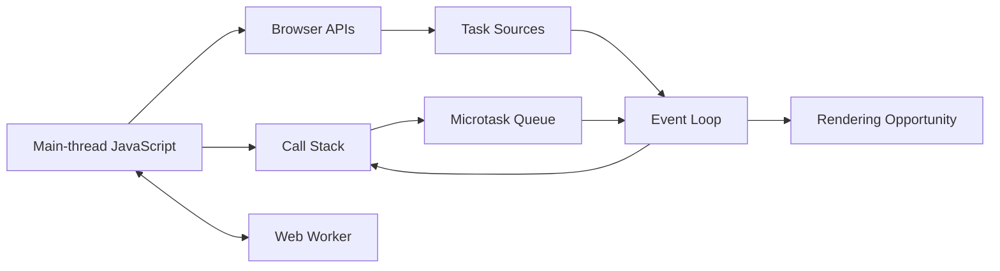
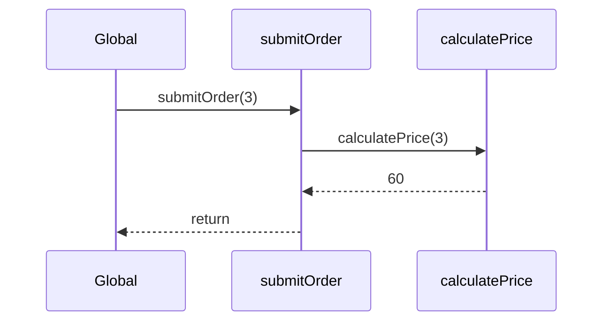
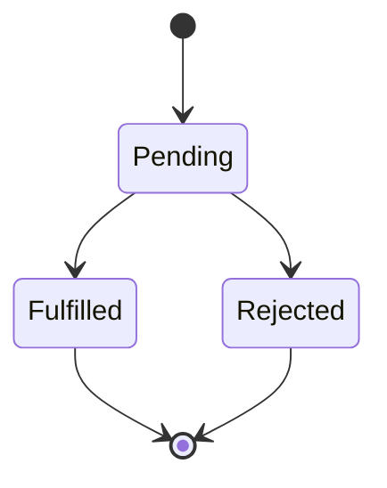
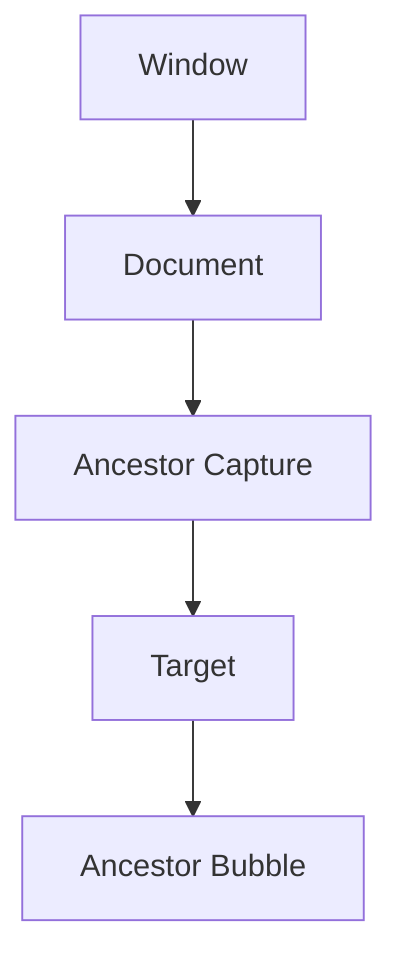
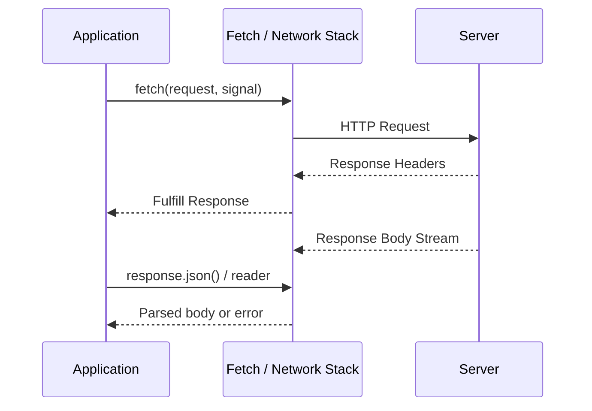
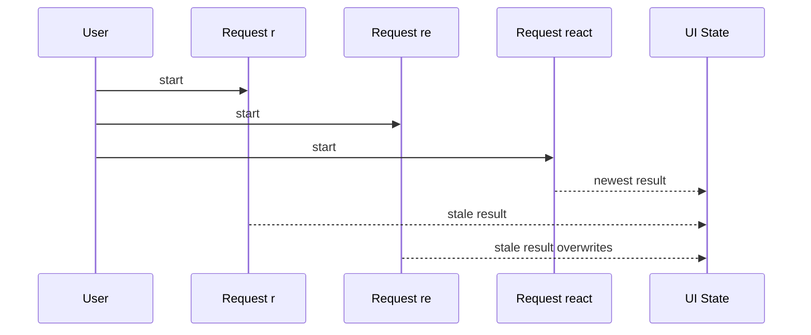
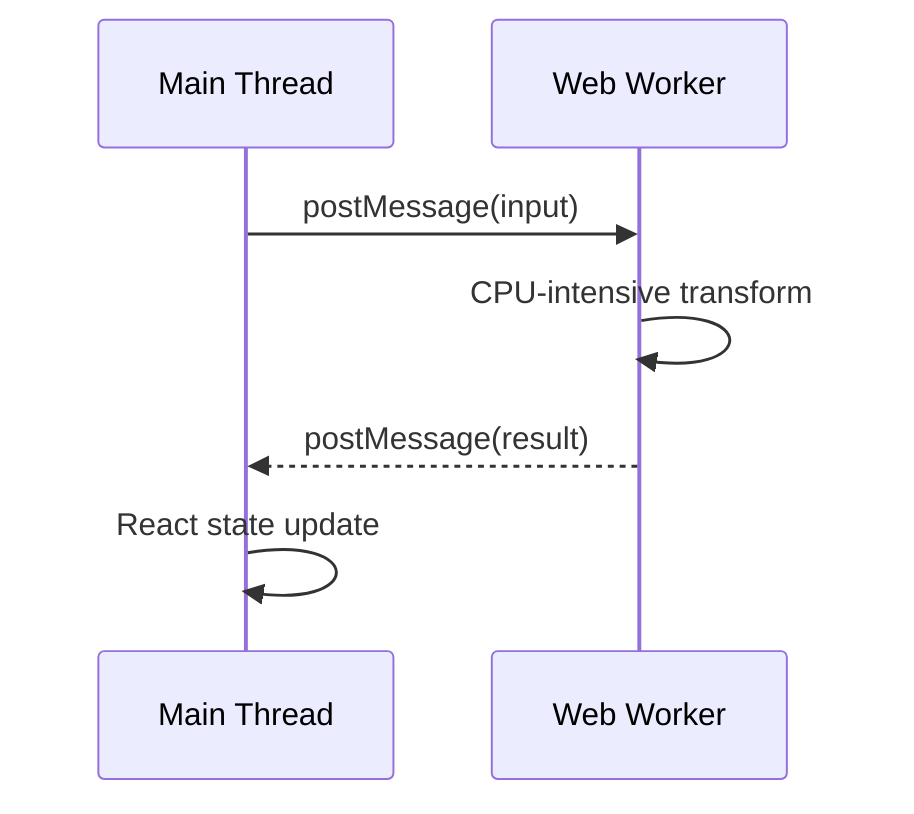

# JavaScript Event Loop 与异步：从任务调度到取消、竞态和并发控制

> JavaScript 的异步不是“代码在后台自动并行执行”。主线程一次仍只执行一个 JavaScript Job；浏览器、网络栈、Timer 和 Worker 在各自环境推进工作，再通过 Task、Microtask 或消息把结果交回对应 Event Loop。

---

## 一、本文解决什么问题

React 应用中经常遇到这些现象：

- `setTimeout(fn, 0)` 没有立即执行；
- Promise 回调晚于同步代码，却通常早于 Timer；
- 连续创建 Microtask 会让页面无法渲染和响应点击；
- `await` 后面的代码不是新线程，仍可能阻塞主线程；
- Fetch Promise 已 Fulfill，但响应体还没有读取完成；
- Abort Fetch 后，服务端可能仍完成写操作；
- 旧搜索请求晚于新请求返回并覆盖界面；
- `Promise.all` 同时发起大量请求，触发限流和内存压力；
- Web Worker 能并行计算，却不能直接操作 DOM；
- 浏览器中的任务顺序，放到 Node.js 后不完全相同。

本文以现代浏览器主线程为主，并连接 React Render 与 Effect。Node.js Event Loop、Service Worker 和 Worklet 具有不同宿主语义；涉及具体顺序与 API 支持时，应固定浏览器、Node.js 和 React 版本验证。

### 核心结论

1. Call Stack 描述当前同步 JavaScript 调用；异步 I/O 由宿主推进，完成后再安排回调或 Promise Reaction。
2. 浏览器不是只有一个“宏任务队列”。HTML 定义多个 Task Source，并在规定时机执行 Microtask Checkpoint。
3. 当前栈清空后，Microtask Queue 通常会持续排空，因此无限追加 Microtask 会造成渲染和输入饥饿。
4. Promise 只能从 Pending 转为 Fulfilled 或 Rejected；`.then` 总返回新 Promise，并采用返回值或 Thenable 的最终状态。
5. `async` 函数总返回 Promise；`await` 暂停当前异步函数并在后续 Job 中恢复，不会把 CPU 工作移到其他线程。
6. Timer 延迟表示最早可调度时间，不是精确执行时间；后台标签页、嵌套和长任务都会造成延迟。
7. Fetch 将请求、响应头、响应体流和业务解析分为多个阶段；HTTP 错误通常不会自动 Reject。
8. AbortController 传播取消信号，但取消本地等待不等于撤销服务端副作用。
9. 异步竞态应组合取消、结果新鲜度校验与业务幂等，单一机制不足以覆盖全部情况。
10. 有界并发控制同时在途数量，Rate Limit 控制时间窗口速率，两者不是同一问题。
11. Web Worker 提供独立线程和 Event Loop，适合 CPU 密集任务，但数据传输、错误和生命周期仍需治理。

---

## 二、浏览器异步执行全景



这是一张概念图：

- 网络、Timer、解码等工作不保证对应某条固定“Web API 线程”；浏览器实现可能跨线程、跨进程。
- Task Source 之间如何选择由宿主定义，不能把所有任务视为一个公开 FIFO 队列。
- Rendering Opportunity 由浏览器决定，并非每个 Task 结束后必然 Paint。

---

## 三、Call Stack 与 Run-to-completion

```javascript
function calculatePrice(quantity) {
  return quantity * 20;
}

function submitOrder(quantity) {
  const price = calculatePrice(quantity);
  console.log(price);
}

submitOrder(3);
```



一个正在执行的 JavaScript Job 通常会持续到返回或抛错，另一个点击回调不会强行插入。这让同步代码段容易推理，也意味着长任务会阻塞输入、Timer、Promise 后续工作和渲染。

### 3.1 `async` 不会自动并行 CPU 工作

```javascript
async function stillBlocking(items) {
  return items.map(runCpuHeavyTransformation);
}
```

函数虽然返回 Promise，但 `map` 仍在主线程同步执行。CPU 密集任务应先测量，再考虑算法优化、分片、Web Worker 或服务端处理。

### 3.2 Long Task 的工程影响

长任务会提高输入延迟并推迟 Paint。排查时应使用浏览器 Performance 面板、Long Animation Frame/Long Task 观察和目标设备 Profile，不能仅根据函数是否声明为 `async` 判断。

---

## 四、Task 与 Microtask

教学资料常把 Task 称为 Macro Task，但 HTML 规范主要使用 Task。常见 Task 来源包括：

- 初始 Script；
- Timer 到期；
- 用户交互事件；
- `postMessage` / `MessageChannel`；
- 网络与其他宿主事件。

常见 Microtask 来源包括：

- Promise Reaction；
- `queueMicrotask`；
- MutationObserver 通知。

### 4.1 基本执行顺序

```javascript
console.log('A');
setTimeout(() => console.log('B'), 0);
Promise.resolve().then(() => console.log('C'));
queueMicrotask(() => console.log('D'));
console.log('E');
```

现代浏览器普通 Script 场景中通常输出：

```text
A
E
C
D
B
```

同步 Script 先结束，随后执行 Microtask Checkpoint；Timer 回调属于后续 Task。

### 4.2 Microtask 会持续排空

```javascript
function starve() {
  queueMicrotask(starve);
}

starve();
```

每个 Microtask 又添加一个 Microtask，Checkpoint 无法结束，Timer、点击和渲染可能长期得不到机会。

```javascript
queueMicrotask(() => {
  console.log('microtask-1');
  queueMicrotask(() => console.log('microtask-3'));
});

queueMicrotask(() => console.log('microtask-2'));
```

通常输出 `1, 2, 3`：本轮 Checkpoint 会继续处理新加入的 Microtask。

### 4.3 渲染不是固定队列项

浏览器在合适时机更新渲染。同步长任务和 Microtask Starvation 都会推迟 Paint。`requestAnimationFrame` 面向渲染前动画回调，但也不能简化为“永远优先于 Timer”。

---

## 五、Promise 状态与链式调用



Promise 一旦 Settled 就不会再次变化。`resolve` 一个 Promise/Thenable 时，外层 Promise 会采用其最终状态，而不一定立即 Fulfill。

### 5.1 Executor 同步执行

```javascript
console.log('A');

const promise = new Promise((resolve) => {
  console.log('B');
  resolve('value');
});

promise.then(() => console.log('C'));
console.log('D');
```

通常输出 `A, B, D, C`。Executor 在构造时同步运行，`.then` 回调在后续 Promise Job 中执行。

### 5.2 `.then` 总返回新 Promise

```javascript
fetchUser()
  .then((user) => fetchOrders(user.id))
  .then((orders) => orders.filter((order) => order.active))
  .then(renderOrders)
  .catch(reportError);
```

- 返回普通值：下一个 Promise Fulfill 该值；
- 抛出异常：下一个 Promise Reject；
- 返回 Promise/Thenable：采用其最终状态；
- 没有 `return`：下一个收到 `undefined`。

错误示例：

```javascript
submitOrder(order).then((result) => {
  saveAuditLog(result); // 链没有等待
}).then(showCompleted);
```

修复：

```javascript
submitOrder(order)
  .then((result) => saveAuditLog(result))
  .then(showCompleted)
  .catch(reportError);
```

### 5.3 Promise 组合器

| API | 完成条件 | 失败语义 | 典型用途 |
|---|---|---|---|
| `Promise.all` | 全部 Fulfill | 任一 Reject 即 Reject | 所有结果必需 |
| `Promise.allSettled` | 全部 Settled | 不因单项失败整体 Reject | 批量结果 |
| `Promise.race` | 第一个 Settled | 采用第一个状态 | 超时竞争 |
| `Promise.any` | 第一个 Fulfill | 全部 Reject 时 AggregateError | 多副本首个成功 |

组合器不会自动取消其他任务。Race 超时后，请求仍可能继续，除非显式 Abort。

---

## 六、`async` / `await`

`async` 函数总返回 Promise，函数内抛错会让返回 Promise Reject。

```javascript
async function load() {
  console.log('B');
  const value = await Promise.resolve('value');
  console.log('D', value);
}

console.log('A');
load();
console.log('C');
```

通常输出 `A, B, C, D value`。`await` 暂停当前 `load` 的后续执行，调用者继续；恢复部分作为后续 Promise Job 执行。

### 6.1 避免不必要串行化

```javascript
// 两个请求互不依赖时被串行化。
const user = await fetchUser();
const settings = await fetchSettings();
```

```javascript
const userPromise = fetchUser();
const settingsPromise = fetchSettings();
const [user, settings] = await Promise.all([userPromise, settingsPromise]);
```

是否并发应根据依赖、限流、失败策略和资源决定，不能机械替换所有连续 `await`。

### 6.2 `forEach` 不等待 Async Callback

```javascript
// 错误
items.forEach(async (item) => {
  await saveItem(item);
});
```

串行使用 `for...of`，小规模全并发使用 `Promise.all(items.map(...))`，大量任务使用有界并发。

### 6.3 Loading 也有竞态

多个并发请求共享一个 Boolean Loading 时，一个请求先完成就可能错误关闭 Loading。应按请求 ID、计数器或显式状态机管理，而不是在每个 `finally` 中无条件设为 `false`。

---

## 七、Timer：延迟只是下界

```javascript
const startedAt = performance.now();
setTimeout(() => {
  console.log(performance.now() - startedAt);
}, 100);
```

实际延迟可能远大于 100 ms，因为回调还要等待：

- 当前长任务；
- Microtask 清空；
- 嵌套 Timer 最小延迟；
- 后台标签页节流；
- 节能和系统休眠；
- 页面冻结或丢弃；
- Event Loop 的其他任务。

### 7.1 `setInterval` 的漂移

操作耗时接近间隔时，Interval 可能积压或连续执行。轮询更适合在一次完成后调度下一次，并支持 Abort、退避和页面生命周期。

```javascript
async function poll(signal) {
  while (!signal.aborted) {
    await refreshData(signal);
    await delay(5000, signal);
  }
}

function delay(milliseconds, signal) {
  return new Promise((resolve, reject) => {
    const timer = setTimeout(resolve, milliseconds);
    const onAbort = () => {
      clearTimeout(timer);
      reject(signal.reason ?? new DOMException('Aborted', 'AbortError'));
    };
    signal.addEventListener('abort', onAbort, { once: true });
  });
}
```

生产实现应在正常完成时移除 Abort Listener，或使用目标环境已验证的 Abort-aware Timer API。

### 7.2 动画与时间

动画应使用 `requestAnimationFrame` 围绕刷新机会更新，不要假设 `setInterval(..., 16)` 等于 60 FPS。120 Hz 屏幕帧预算更短，必须在目标设备测量。

---

## 八、DOM Event：传播、默认行为与任务



- `stopPropagation` 阻止继续传播；
- `stopImmediatePropagation` 还影响同目标后续 Listener；
- `preventDefault` 尝试阻止可取消事件的默认行为。

三者不是同一个概念。

### 8.1 Listener 中的 Microtask

```javascript
button.addEventListener('click', () => {
  console.log('listener');
  queueMicrotask(() => console.log('microtask'));
});
```

Microtask 通常在当前回调和调用栈结束后的 Checkpoint 执行，常早于下一次渲染。但默认行为与 Microtask 的精确顺序取决于事件类型和规范步骤，不能推广所有 DOM Event。

### 8.2 高频事件治理

- 将视觉更新合并到每帧一次；
- 对滚动使用合适的 Passive Listener；
- 避免同步 Layout Read/Write 循环；
- 搜索使用 Debounce + Abort + 新鲜度检查；
- 组件卸载时移除 Listener。

React Synthetic Event 的委托与优先级属于 React 实现层，仍建立在浏览器事件模型之上。

---

## 九、Fetch 生命周期



### 9.1 HTTP 404/500 通常不会 Reject

```javascript
const response = await fetch('/api/product/missing');
if (!response.ok) {
  throw new Error(`HTTP ${response.status}`);
}
const product = await response.json();
```

Fetch Reject 常见于网络失败、CORS 失败或 Abort。HTTP 错误是成功获得 Response，需要显式判断。

### 9.2 Response 不是完整数据

`response.json()` 继续读取和解析 Body，仍可能因网络中断、非法 JSON、过大响应或 Body 已消费而失败。完整性能链路应区分：

- Request Start；
- TTFB；
- Body Download；
- Parse/Transform；
- State Update；
- React Commit 与内容可见。

### 9.3 Cache、Service Worker 与连接

Fetch 可能命中 HTTP Cache、由 Service Worker 拦截、重定向或走网络。DNS、连接复用、HTTP/2/3 协商等由浏览器处理，不要从一次 DevTools 观察推广所有用户。

### 9.4 业务超时

```javascript
async function fetchWithTimeout(url, milliseconds) {
  const controller = new AbortController();
  const timer = setTimeout(
    () => controller.abort(new Error('request timeout')),
    milliseconds,
  );

  try {
    return await fetch(url, { signal: controller.signal });
  } finally {
    clearTimeout(timer);
  }
}
```

目标环境若支持 AbortSignal 组合或超时便捷 API，可优先采用，但应验证兼容范围和错误语义。

---

## 十、AbortController：取消不是撤销

```javascript
const controller = new AbortController();
fetch('/api/search?q=react', { signal: controller.signal });
controller.abort('query changed');
```

取消分为三个层次：

1. 调用方停止等待；
2. Fetch、Reader、Timer 或算法停止本地工作；
3. 服务端撤销已执行副作用。

AbortController 主要覆盖前两层，第三层需要业务协议。POST 可能已创建订单，即使客户端随后 Abort；写操作必须使用 Idempotency Key、状态查询和补偿。

### 10.1 自定义函数支持 Signal

```javascript
async function processInChunks(items, { signal, chunkSize = 100 }) {
  const results = [];

  for (let index = 0; index < items.length; index += chunkSize) {
    signal.throwIfAborted();
    results.push(...items.slice(index, index + chunkSize).map(transformItem));
    await new Promise((resolve) => setTimeout(resolve, 0));
  }

  return results;
}
```

Timer 分片只是基础方案，不承诺帧性能。CPU 工作较重时应使用 Worker。AbortSignal 一旦 Abort 不会复位，每次独立操作应创建新 Controller。

---

## 十一、异步竞态

搜索 `r`、`re`、`react` 的返回顺序可能与发起顺序相反：



### 11.1 Abort + Generation

```javascript
function createLatestSearch(searchApi) {
  let generation = 0;
  let activeController;

  return async function search(query) {
    const currentGeneration = ++generation;
    activeController?.abort('superseded');

    const controller = new AbortController();
    activeController = controller;

    try {
      const result = await searchApi(query, { signal: controller.signal });
      if (currentGeneration !== generation) return { kind: 'stale' };
      return { kind: 'success', result };
    } catch (error) {
      if (controller.signal.aborted) return { kind: 'cancelled' };
      throw error;
    }
  };
}
```

Abort 节省仍可取消的工作，Generation 防止过期结果提交。写请求仍需业务幂等。

### 11.2 React Effect 中的竞态

```jsx
useEffect(() => {
  const controller = new AbortController();
  let active = true;

  async function load() {
    try {
      const product = await fetchProduct(productId, controller.signal);
      if (active) setProduct(product);
    } catch (error) {
      if (active && !controller.signal.aborted) setError(error);
    }
  }

  load();
  return () => {
    active = false;
    controller.abort();
  };
}, [productId]);
```

常见仲裁语义包括 Last Request Wins、First Success Wins、Single-flight、Version Check 和 Read-modify-write 冲突。应先定义业务规则，再选机制。

---

## 十二、并发限制

`Promise.all(items.map(fetchItem))` 会立即创建全部操作。浏览器连接池只能限制部分网络并行，无法自动控制请求对象、解析、内存和服务端压力。

### 12.1 有界并发 Worker Pool

```javascript
async function mapWithConcurrency(items, concurrency, mapper, signal) {
  if (!Number.isInteger(concurrency) || concurrency < 1) {
    throw new RangeError('concurrency must be positive');
  }

  const results = new Array(items.length);
  let nextIndex = 0;

  async function worker() {
    while (true) {
      signal?.throwIfAborted();
      const index = nextIndex++;
      if (index >= items.length) return;
      results[index] = await mapper(items[index], index, signal);
    }
  }

  await Promise.all(
    Array.from(
      { length: Math.min(concurrency, items.length) },
      () => worker(),
    ),
  );

  return results;
}
```

主线程上同步获取 `nextIndex` 在每次 `await` 前不会被另一 Job 插入；若扩展到 SharedArrayBuffer/Worker，需要 Atomics 或消息协调。

### 12.2 并发、速率与背压

| 机制 | 控制内容 | 示例 |
|---|---|---|
| Concurrency Limit | 同时在途数量 | 最多 5 个上传 |
| Rate Limit | 时间窗口内启动数量 | 每秒最多 10 次请求 |
| Debounce | 安静一段时间后执行 | 搜索输入停止 300 ms |
| Throttle | 一段时间最多执行一次 | 滚动统计 |
| Backpressure | 消费者反向限制生产者 | Stream 高水位 |
| Single-flight | 相同 Key 共享在途任务 | Token 刷新 |

并发池还要定义 Fail-fast/All-settled、重试、结果顺序、队列上限、429 和页面离开后的取消。

---

## 十三、Web Worker

Dedicated Worker 拥有独立线程、全局环境和 Event Loop，通过消息与页面通信，不能直接操作 DOM。



```javascript
// report.worker.js
self.addEventListener('message', (event) => {
  try {
    self.postMessage({ kind: 'success', result: buildLargeReport(event.data) });
  } catch (error) {
    self.postMessage({
      kind: 'failure',
      message: error instanceof Error ? error.message : String(error),
    });
  }
});
```

```javascript
const worker = new Worker(
  new URL('./report.worker.js', import.meta.url),
  { type: 'module' },
);

worker.addEventListener('message', handleResult);
worker.addEventListener('error', handleError);
worker.postMessage(input);
// 生命周期结束时 worker.terminate();
```

### 13.1 Structured Clone 与 Transferable

`postMessage` 默认 Structured Clone，大对象复制会消耗时间和内存。`ArrayBuffer` 可转移所有权：

```javascript
worker.postMessage(buffer, [buffer]);
```

转移后发送方 Buffer 通常变为 Detached。SharedArrayBuffer 需要跨源隔离等安全条件，并使用 Atomics 正确同步。

### 13.2 Worker 的适用边界

适合大型解析、图片/音频处理、搜索索引、数据聚合和 Wasm CPU 任务。不一定适合极短计算、主要等待网络的 I/O 或需要频繁 DOM 交互的流程。

Worker 取消可用 `terminate()` 终止整个实例，或设计 `start/cancel/progress/success/failure` 消息协议。长循环必须主动分片检查取消，否则无法及时处理 Cancel 消息。

---

## 十四、浏览器与 Node.js 的边界

Node.js 使用 libuv 和自己的 Timer、I/O、Check 等阶段，并提供 `process.nextTick`。它不是 HTML Event Loop 的复制品。

`setImmediate` 不是浏览器标准 API；在 Node.js 中，Timer 与 Immediate 的先后还取决于运行上下文和 I/O 阶段。`process.nextTick` 与 Promise Microtask 也有独立规则，滥用会导致饥饿。

React SSR 代码不能假设：

- 存在 `window`、DOM Event 或 `requestAnimationFrame`；
- Node Timer 节流与浏览器相同；
- Fetch 实现和连接池完全相同；
- 模块单例只服务一个请求；
- 未等待 Promise 会在响应结束后安全完成。

请求级资源应绑定 Request Signal 和生命周期，避免跨请求共享用户状态。

---

## 十五、React 中的异步边界

### 15.1 State Update 与浏览器任务

React 可批处理更新，具体调度语义随 React 版本和 Root API 演进。不要用浏览器 Task/Microtask 模型直接推导某个 Update 必然何时 Commit。

稳定结论是：Event Handler 读取当前 Render 快照；Setter 请求后续更新，不会修改当前闭包绑定；需要 DOM 已更新时，应使用 React 提供的生命周期和测量 API，而不是随意插入 `Promise.resolve()`。

### 15.2 Effect 不是通用请求调度器

数据框架、Router Loader 或 Server Component 能更集中地取数时，不必把所有请求塞进 `useEffect`。使用 Effect 时必须处理 Dependency、Cleanup、Abort、Stale Result、缓存和 Strict Mode 开发检查下的幂等性。

### 15.3 Transition 不会创建 Worker

Transition 能降低部分更新优先级并允许渲染被中断，但同步 CPU 重计算仍占用主线程。应优化算法、缓存或使用 Worker。

---

## 十六、常见误区与错误案例

### 16.1 误区：JavaScript 单线程，所以浏览器不能并行

主线程 JavaScript 一次执行一个 Job，但网络、解码、渲染和 Worker 可以并行。要区分语言执行与宿主实现。

### 16.2 误区：`setTimeout(fn, 0)` 会立即执行

它只让 Timer 在满足最小延迟后有资格安排 Task，还要等待当前栈、Microtask 和其他调度条件。

### 16.3 误区：Promise Callback 是同步回调

即使 Promise 已 Fulfilled，`.then` 回调也会进入后续 Job，不会插入当前同步栈。

### 16.4 误区：`await` 会阻塞线程

它暂停当前 Async Function；但 `await` 前后执行的 CPU 代码仍在主线程，可能阻塞 UI。

### 16.5 误区：Abort Fetch 等于取消服务端请求

服务端可能已完成操作，必须使用幂等键、状态查询和补偿。

### 16.6 误区：`Promise.all` 会自动限制并发

它只组合 Promise，不限制任务数，也不取消已启动任务。

### 16.7 错误案例：Race 超时但不取消

```javascript
// 错误：超时后 Fetch 仍继续。
await Promise.race([
  fetch('/api/report'),
  new Promise((_, reject) => {
    setTimeout(() => reject(new Error('timeout')), 3000);
  }),
]);
```

超时应触发 Abort，并在 `finally` 清理 Timer。写请求还需幂等和结果对账。

---

## 十七、性能、测试与验证

### 17.1 观察指标

- Long Task 与 Total Blocking Time；
- Interaction to Next Paint（INP）；
- Microtask 长链；
- Timer 实际漂移；
- Fetch TTFB、下载、解析和完整可用时间；
- 同时在途请求数和队列等待；
- Worker 启动、消息复制和内存；
- React Render/Commit 耗时。

必须在目标设备、生产构建和真实网络条件下验证。

### 17.2 可控异步测试

```javascript
function deferred() {
  let resolve;
  let reject;
  const promise = new Promise((res, rej) => {
    resolve = res;
    reject = rej;
  });
  return { promise, resolve, reject };
}
```

用 Deferred 手动让新请求先完成、旧请求后完成，断言最终状态仍属于新请求。还应：

- 注入 Clock/Scheduler；
- 显式 Flush Microtask；
- 了解 Fake Timer 对 Promise/RAF 的模拟边界；
- 验证取消后不提交状态；
- 验证卸载时释放 Timer、Listener 和 Worker。

### 17.3 错误与取消分类

至少区分 User Cancelled、Superseded、Deadline Exceeded、Network Failure、HTTP Failure、Parse Failure、Business Rejection 和 Programmer Error。取消不应污染错误 SLO，但异常取消率也可能暴露体验问题。

---

## 十八、总结

理解 Event Loop 不需要只背输出顺序，而要抓住异步工作的所有权与交接点：

1. Call Stack 执行同步 JavaScript，长任务会阻塞输入和渲染。
2. 宿主完成 Timer、网络和事件工作后，把回调安排为 Task 或 Promise Job。
3. Microtask Checkpoint 持续排空队列，滥用会造成饥饿。
4. Promise 链通过新 Promise 传播值和错误，组合器不会自动取消。
5. `async/await` 改善控制流，不提供线程和自动并发。
6. Timer 延迟只是下界，动画和 Deadline 应使用合适机制。
7. Fetch 的 Response、Body、Parse 和业务状态是不同阶段。
8. AbortController 传播取消，远端副作用仍需幂等和对账。
9. 异步竞态需要 Abort、Generation/Version 与业务仲裁共同治理。
10. 有界并发保护浏览器、网络和服务端，Rate Limit 与 Backpressure 需单独设计。
11. Web Worker 适合转移 CPU 工作，但通信和生命周期有成本。
12. React 调度建立在浏览器机制之上，却有自己的 Render、Commit 和优先级语义。

将异步流程建模为“启动、排队、完成、取消、过期、提交”后，代码才能在弱网、快速交互和组件生命周期变化中保持正确。

---

## 问答复盘

### Q1：浏览器是否只有一个宏任务队列和一个微任务队列？

**答：** 这种说法适合入门但不严谨。HTML 定义多个 Task Source，Event Loop 选择可运行 Task；Microtask 在规定的 Checkpoint 中执行到队列清空。

### Q2：为什么 Promise 回调通常早于 `setTimeout(..., 0)`？

**答：** 当前 Script Task 结束后先执行 Microtask Checkpoint，Promise Reaction 在其中运行；Timer 属于后续 Task。但不要推广为所有宿主和上下文的绝对顺序。

### Q3：`await` 是否会把后续代码发送到新线程？

**答：** 不会。它暂停当前 Async Function，并通过 Promise Job 恢复；恢复后的 JavaScript 仍在对应 Event Loop 线程执行。

### Q4：Fetch 返回 500 时为什么没有进入 `catch`？

**答：** Fetch 成功获得 HTTP Response，通常会 Fulfill。应用必须检查 `response.ok`；网络、CORS、Abort 等才常导致 Reject。

### Q5：AbortController 与 Generation 为什么常要同时使用？

**答：** Abort 节省仍可取消的工作，但可能发生太晚或底层不支持；Generation 阻止过期结果提交，两者解决不同层次的问题。

### Q6：并发限制与限流有什么区别？

**答：** 并发限制控制同时在途任务数量，限流控制时间窗口内启动速率。5 个并发任务仍可能在一秒内发起很多短请求。

### Q7：Web Worker 为什么不能直接更新 React 组件？

**答：** Worker 位于独立线程和全局环境，不能访问 DOM 或 React Root。它通过消息返回结果，由主线程更新 State。

### Q8：React 搜索请求如何避免旧结果覆盖新结果？

**答：** Query 改变时 Abort 旧请求，并用当前请求 ID/Generation 校验结果；Effect Cleanup 阻止卸载后提交，写操作还需服务端幂等。

---

## 延伸知识

- **React Render 与 Commit**：浏览器任务、React Scheduler 和提交阶段如何协作。
- **Hooks 与 Effect**：依赖数组、Cleanup、Stale Closure 和 Strict Mode。
- **数据请求治理**：缓存、去重、重试、Token 刷新与离线。
- **浏览器渲染管线**：Style、Layout、Paint、Composite 与帧预算。
- **Streams 与 Backpressure**：ReadableStream、TransformStream 和增量解析。
- **Node.js 异步模型**：libuv、`process.nextTick`、Worker Threads 与 Async Hooks。
