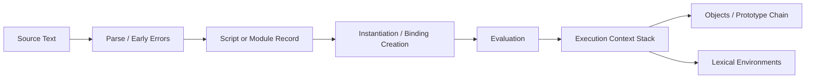
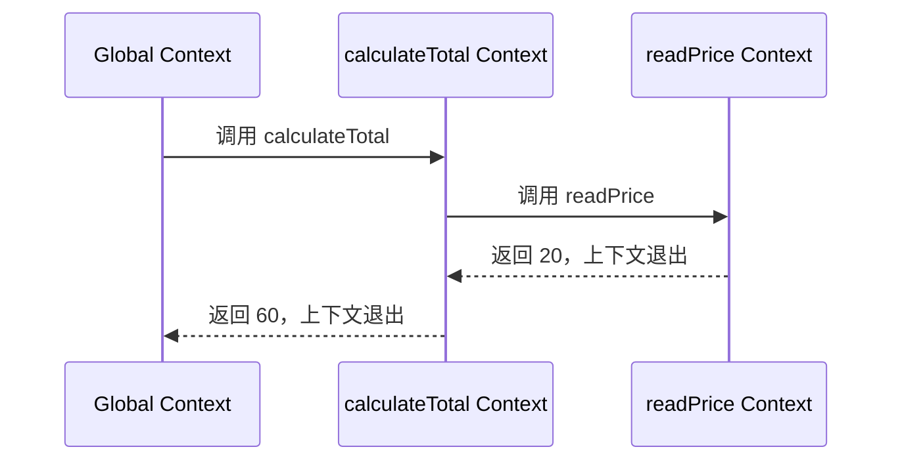
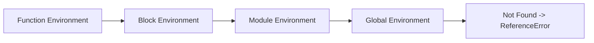
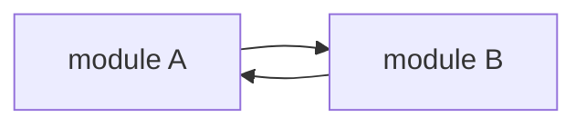
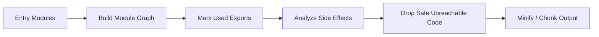

# JavaScript 执行模型：从执行上下文、闭包到 ESM 与 Tree Shaking

> React 组件最终仍是 JavaScript 函数。要解释闭包为何读取旧状态、方法解构后为何丢失 `this`、模块为什么只初始化一次，以及未使用导出为何没有被删除，必须先理解语言如何创建绑定、解析标识符和执行模块。

---

## 一、本文解决什么问题

开发 React 应用时，经常遇到这些现象：

- 函数声明可以在定义前调用，`let` 却会触发暂时性死区；
- 回调在函数返回后仍能访问局部变量；
- `const handler = object.method` 调用时丢失 `this`；
- 修改原型会影响实例属性查找，却不会改变实例自身属性；
- `Object.assign` 与属性描述符复制结果不同；
- ESM 的导入会随导出绑定更新，而解构 CommonJS 导出得到的可能只是当前值；
- 同一个模块被多处导入，却通常只执行一次；
- 代码使用 ESM，打包结果仍包含看似未使用的模块；
- React Effect 或事件回调读取了某次 Render 的旧 Props/State。

这些问题看似分散，实际都围绕一个主线：JavaScript 如何创建 Execution Context、Environment Record 和对象属性，并在运行时解析名称与调用方式。

本文以 ECMAScript 语言语义为主。浏览器全局环境、Node.js CommonJS 包装、Bundler 转换和 Tree Shaking 属于宿主或工具行为；涉及具体结果时，应固定 Node.js、浏览器、TypeScript、Babel 和构建工具版本，通过目标产物验证。

### 核心结论

1. Execution Context（执行上下文）是规范用于描述代码执行状态的抽象记录，不是业务代码可直接访问的普通 JavaScript 对象。
2. Lexical Environment 由 Environment Record 和外部环境引用组成，Scope Chain 本质上是沿外部引用查找标识符绑定的过程。
3. “变量提升”是创建阶段建立绑定后的可观察结果，不是引擎把源码文本移动到顶部。
4. Closure（闭包）保存对定义位置词法环境的可达关系，捕获的是绑定而非自动复制的值。
5. 普通函数的 `this` 主要由调用形式决定；箭头函数没有自己的 `this`，而是使用外层词法 `this`。
6. 属性查找先检查对象自身属性，再沿 Prototype Chain 查找；词法作用域链与原型链解决的是两类完全不同的问题。
7. Property Descriptor 决定属性的值、可写性、可枚举性、可配置性或 Getter/Setter 行为，赋值语法不能表达全部属性语义。
8. Script、ESM 与 CommonJS 具有不同顶层作用域和加载语义；Node.js CommonJS 是宿主模块系统，不属于 ECMAScript 模块规范。
9. ESM 的静态 `import`/`export` 和 Live Binding 有利于静态分析，但 Tree Shaking 还依赖副作用分析、包元数据和转译结果。
10. React 每次 Render 都创建新的函数调用环境；闭包读取哪次 Render 的绑定，是理解 Effect、事件处理器和异步竞态的基础。

---

## 二、从源码到执行：先建立全景

JavaScript 引擎处理 Script 或 Module 时，会解析源码、建立作用域和绑定，再执行语句。下面是概念流程，不对应某个引擎的逐函数内部实现：



需要区分三个层次：

- **语言规范抽象**：Execution Context、Environment Record、Reference 等；
- **引擎实现**：V8、SpiderMonkey、JavaScriptCore 如何优化栈帧、闭包和对象布局；
- **宿主环境**：浏览器提供 DOM、Event Loop，Node.js 提供文件、进程和 CommonJS 等能力。

规范术语不能机械等同于内存结构。例如词法环境是否真的分配为 Heap 对象、局部变量是否保留在寄存器，由引擎优化决定。

---

## 三、Execution Context：谁正在执行什么代码

Execution Context 描述引擎执行一段 ECMAScript 代码所需的状态。常见上下文来源包括：

- Script 全局代码；
- ECMAScript Module；
- 函数调用；
- `eval` 代码；
- Generator 或 Async Function 的暂停与恢复。

规范中的上下文会关联当前代码、词法环境、变量环境、Realm、函数和 `this` 等信息，具体字段随规范算法而定。

### 3.1 调用栈中的上下文

```javascript
function readPrice(product) {
  return product.price;
}

function calculateTotal(product, quantity) {
  const price = readPrice(product);
  return price * quantity;
}

calculateTotal({ price: 20 }, 3);
```

概念上的执行顺序：



同步函数返回后，它的活动调用上下文退出栈。但被闭包引用的绑定仍可能存活；“上下文出栈”不等于所有局部数据立即释放。

### 3.2 创建绑定与执行语句

教学中常说上下文分为“创建阶段”和“执行阶段”。这可以帮助理解，但规范实际通过 Declaration Instantiation 等算法为不同代码类型创建绑定。

```javascript
console.log(loadUser()); // 可以调用

function loadUser() {
  return 'Alice';
}

console.log(status); // undefined
var status = 'ready';

console.log(token); // ReferenceError
let token = 'secret';
```

原因不是源码被移动：

- 函数声明在执行语句前完成绑定与函数对象初始化；
- `var` 绑定已创建并初始化为 `undefined`；
- `let` 绑定已创建，但在声明初始化前不可访问，形成 TDZ（Temporal Dead Zone，暂时性死区）。

### 3.3 `var`、`let`、`const` 与函数声明

| 声明 | 作用域 | 初始化前读取 | 是否可重新赋值 | 是否成为全局对象属性 |
|---|---|---|---|---|
| `var` | 函数或全局变量环境 | `undefined` | 可以 | 经典浏览器 Script 顶层可能是，存在宿主边界 |
| `let` | 块级词法环境 | TDZ，抛出错误 | 可以 | 不会简单成为全局对象属性 |
| `const` | 块级词法环境 | TDZ，抛出错误 | 不可以重新绑定 | 不会简单成为全局对象属性 |
| Function Declaration | 依代码位置和语法上下文决定 | 通常初始化为函数 | 绑定规则依声明环境 | 顶层 Script 与 Module 不同 |

`const` 只禁止重新绑定，不会递归冻结对象：

```javascript
const settings = { theme: 'light' };
settings.theme = 'dark'; // 合法
// settings = {};        // TypeError
```

---

## 四、Lexical Environment：名称存在哪里

Lexical Environment（词法环境）是规范抽象，可理解为：

```text
LexicalEnvironment {
  EnvironmentRecord
  OuterEnvironmentReference
}
```

Environment Record 保存标识符绑定，Outer Reference 指向外层词法环境。

### 4.1 词法作用域由定义位置决定

```javascript
const currency = 'CNY';

function createFormatter() {
  const prefix = 'Total:';

  return function format(value) {
    return `${prefix} ${currency} ${value}`;
  };
}
```

`format` 的外层环境由它**定义在** `createFormatter` 内部决定，不由将来在哪里调用决定。这就是 Lexical Scoping（词法作用域）。

示例仅用于展示名称解析；真实金额格式化应使用 `Intl.NumberFormat`。

### 4.2 块会创建新的词法环境

```javascript
let message = 'outer';

{
  let message = 'inner';
  console.log(message); // inner
}

console.log(message); // outer
```

内层 `message` Shadow（遮蔽）外层绑定，但没有修改外层值。

### 4.3 `catch`、Class 和 Module 也有作用域

```javascript
try {
  throw new Error('failed');
} catch (error) {
  console.log(error.message);
}

// console.log(error); // ReferenceError
```

Class 声明具有词法绑定和 TDZ；Module 的顶层绑定也不会像经典 Script 那样暴露为全局对象属性。

---

## 五、Scope Chain：标识符如何被解析

当执行 `total + taxRate` 时，引擎需要解析 `total` 和 `taxRate` 分别指向哪个绑定。概念上从当前 Lexical Environment 开始，沿 Outer Reference 向外查找：



真实链条顺序取决于代码嵌套，图仅表示逐层查找。

```javascript
const taxRate = 0.1;

function createCalculator(discount) {
  return function calculate(total) {
    return total * (1 - discount) * (1 + taxRate);
  };
}

const calculate = createCalculator(0.2);
console.log(calculate(100)); // 88
```

名称解析关系：

- `total` 在当前函数参数环境找到；
- `discount` 在外层 `createCalculator` 环境找到；
- `taxRate` 继续在模块或全局环境找到；
- 找不到的标识符读取会抛出 `ReferenceError`。

### 5.1 作用域链与对象属性查找不同

```javascript
const user = { profile: { name: 'Alice' } };
console.log(user.profile.name);
```

这里先通过作用域链找到标识符 `user`，再通过对象属性访问寻找 `profile` 和 `name`。前者查询 Environment Record，后者查询对象自身属性及 Prototype Chain。

### 5.2 `with` 和直接 `eval` 为什么妨碍优化

`with` 可以动态把对象属性引入名称解析，直接 `eval` 可能在当前上下文中执行动态代码。这会让静态分析更困难。

ESM 和严格模式禁止 `with`。生产代码也应避免直接 `eval`，它同时带来安全、CSP、可维护性和优化问题。

---

## 六、Closure：函数与定义环境的组合

Closure（闭包）不是只有“函数嵌套并返回”才存在。函数创建时会关联定义位置的词法环境，使其以后仍能解析自由变量。

```javascript
function createCounter() {
  let count = 0;

  return {
    increment() {
      count += 1;
      return count;
    },
    current() {
      return count;
    },
  };
}

const counter = createCounter();
counter.increment(); // 1
counter.increment(); // 2
counter.current();   // 2
```

`increment` 和 `current` 共享同一个 `count` 绑定。

### 6.1 捕获绑定，不是自动冻结值

```javascript
let status = 'idle';

const readStatus = () => status;
status = 'ready';

console.log(readStatus()); // ready
```

闭包读取绑定当前值。但每次函数调用会创建新的参数和局部绑定：

```javascript
function createReader(value) {
  return () => value;
}

const first = createReader('first');
const second = createReader('second');

first();  // first
second(); // second
```

### 6.2 循环中的 `var` 与 `let`

```javascript
const wrong = [];
for (var index = 0; index < 3; index += 1) {
  wrong.push(() => index);
}

console.log(wrong.map((read) => read())); // [3, 3, 3]
```

`var` 循环共享一个函数级绑定。`let` 的 `for` 循环会为迭代创建相应绑定：

```javascript
const correct = [];
for (let index = 0; index < 3; index += 1) {
  correct.push(() => index);
}

console.log(correct.map((read) => read())); // [0, 1, 2]
```

### 6.3 闭包与内存生命周期

闭包只会让其可达路径中的数据继续存活，不会“复制整个作用域”。但长期注册的回调可能间接保留大对象：

```javascript
function subscribe(socket, largeCache) {
  const onMessage = (event) => {
    largeCache.set(event.id, event.payload);
  };

  socket.addEventListener('message', onMessage);

  return () => {
    socket.removeEventListener('message', onMessage);
  };
}
```

如果忘记执行清理函数，Socket、回调和 `largeCache` 可能持续可达。是否泄漏必须用 Heap Snapshot 和 Retainer Path 验证，不能仅凭“用了闭包”判断。

---

## 七、闭包与 React Render

函数组件每次 Render 都是一次新的函数调用，会创建新的参数、局部变量和回调函数：

```jsx
function SearchPage({ query }) {
  const handleClick = () => {
    console.log(query);
  };

  return <button onClick={handleClick}>Log query</button>;
}
```

每次 Render 的 `handleClick` 闭包关联该次调用的 `query` 绑定。

### 7.1 Stale Closure 的本质

```jsx
function Counter() {
  const [count, setCount] = useState(0);

  useEffect(() => {
    const timer = setInterval(() => {
      console.log(count);
    }, 1000);

    return () => clearInterval(timer);
  }, []);

  return <button onClick={() => setCount((value) => value + 1)}>{count}</button>;
}
```

Effect 只在首次挂载时建立 Timer，回调关联首次 Render 的 `count`。后续 Render 创建了新绑定，但旧 Timer 仍调用旧闭包。

修复取决于意图：

- 需要对最新 `count` 重新同步副作用：把 `count` 放入依赖；
- 更新状态依赖前值：使用函数式更新；
- 需要稳定订阅但读取最新非响应值：使用符合当前 React API 与约束的 Ref/Event 方案；
- 不要为了消除 Lint 提示随意清空依赖。

### 7.2 闭包不是 React Bug

React 没有改变 JavaScript 词法作用域。它通过重复调用组件，让每次 Render 拥有独立快照。问题来自副作用生命周期与闭包对应的 Render 不一致。

---

## 八、`this` 绑定：由调用形式决定

`this` 不是普通词法变量。普通函数的 `this` 取决于调用方式、严格模式和显式绑定。

### 8.1 四类常见规则

```javascript
function describe() {
  return this?.name;
}

const user = { name: 'Alice', describe };

user.describe();                    // 隐式绑定：user
describe.call({ name: 'Bob' });     // 显式绑定：Bob
const bound = describe.bind({ name: 'Carol' });
bound();                            // 硬绑定：Carol
new describe();                     // 构造调用：新对象
```

独立调用在严格模式下 `this` 为 `undefined`；非严格 Script 中可能发生全局替换。ESM 代码天然以严格模式执行。

### 8.2 方法不是独立的数据类型

```javascript
const account = {
  balance: 100,
  readBalance() {
    return this.balance;
  },
};

account.readBalance(); // 100

const read = account.readBalance;
read(); // 严格模式下 this 为 undefined，读取时报错
```

函数赋值给变量后，调用表达式不再包含 Base Object。修复方式取决于 API：

```javascript
const readBound = account.readBalance.bind(account);
const readWrapped = () => account.readBalance();
```

### 8.3 箭头函数使用词法 `this`

```javascript
class Timer {
  label = 'sync';

  start() {
    setTimeout(() => {
      console.log(this.label);
    }, 0);
  }
}
```

箭头函数没有自己的 `this`、`arguments` 和构造能力，`call`/`bind` 不能改变其 `this`。

### 8.4 React 中是否需要 `this`

函数组件主要使用词法绑定，不依赖组件实例 `this`。Class Component 的方法传递则需要绑定，除非使用实例字段箭头函数等写法。字段转换语义和产物取决于目标环境与构建配置。

---

## 九、Prototype Chain：对象属性如何继承

JavaScript 对象具有内部 `[[Prototype]]` 链接。读取属性时，先检查自身属性，再沿原型链查询：


```javascript
const animal = {
  speak() {
    return `${this.name} makes a sound`;
  },
};

const dog = Object.create(animal);
dog.name = 'Milo';

dog.speak(); // Milo makes a sound
```

`speak` 在 `animal` 上找到，但调用 Base 是 `dog`，所以方法中的 `this` 为 `dog`。

### 9.1 Own Property 与 Inherited Property

```javascript
Object.hasOwn(dog, 'name');  // true
Object.hasOwn(dog, 'speak'); // false
'speak' in dog;              // true
```

处理不可信字典时，优先使用 `Object.hasOwn` 或无原型对象，避免把继承属性当成业务字段。

### 9.2 `class` 是原型机制上的语言抽象

```javascript
class User {
  constructor(name) {
    this.name = name;
  }

  greet() {
    return `Hello ${this.name}`;
  }
}
```

`greet` 通常定义在 `User.prototype`，实例共享方法。Class 还带来严格模式、`super`、Private Field 和初始化顺序等语义，不能简单说成“只是语法替换”而忽略这些差异。

### 9.3 Prototype Pollution

把攻击者控制的 `__proto__`、`constructor.prototype` 等路径合并到普通对象，可能污染共享原型。防护包括：

- 使用结构化 Schema 验证；
- 禁止危险 Key；
- 使用 `Object.create(null)` 存储纯字典；
- 更新受影响的 Merge 库；
- 不把 `for...in` 结果无条件视为自身属性。

---

## 十、Property Descriptor：属性不仅有一个值

Data Property Descriptor 包含：

- `value`；
- `writable`；
- `enumerable`；
- `configurable`。

Accessor Property Descriptor 使用 `get` 和 `set`，不能与 `value`/`writable` 混用。

```javascript
const user = {};

Object.defineProperty(user, 'id', {
  value: 'user-1',
  writable: false,
  enumerable: true,
  configurable: false,
});

console.log(Object.getOwnPropertyDescriptor(user, 'id'));
```

### 10.1 赋值创建属性的默认 Descriptor

```javascript
const object = {};
object.name = 'Alice';
```

普通赋值创建的自身数据属性通常为可写、可枚举、可配置。`Object.defineProperty` 未指定的布尔字段默认是 `false`，这是常见陷阱。

### 10.2 枚举操作并不相同

| 操作 | 自身属性 | 继承属性 | Symbol | 不可枚举 |
|---|---|---|---|---|
| `Object.keys` | 是 | 否 | 否 | 否 |
| `for...in` | 是 | 是 | 否 | 否 |
| `Object.getOwnPropertyNames` | 是 | 否 | 否 | 是 |
| `Reflect.ownKeys` | 是 | 否 | 是 | 是 |
| Object Spread | 可枚举自身 | 否 | 是 | 否 |

Getter 在读取时可能执行代码。对象展开、序列化和日志工具可能触发 Getter，不能把属性访问视为永远无副作用。

### 10.3 Spread 不复制完整 Descriptor

```javascript
const source = {};
Object.defineProperty(source, 'token', {
  get() {
    return 'computed';
  },
  enumerable: true,
});

const copied = { ...source };
console.log(Object.getOwnPropertyDescriptor(copied, 'token'));
// copied.token 是普通 Data Property，Getter 语义已丢失
```

需要复制描述符时：

```javascript
const exactCopy = Object.defineProperties(
  {},
  Object.getOwnPropertyDescriptors(source),
);
```

这仍是浅复制，不复制原型和嵌套对象。

---

## 十一、Module Scope：模块不是全局脚本拼接

模块为顶层声明提供独立作用域，显式控制依赖和导出。

```javascript
// pricing.js
const taxRate = 0.1;

export function calculateTotal(price) {
  return price * (1 + taxRate);
}
```

`taxRate` 不会成为 `globalThis.taxRate`。

### 11.1 Script 与 ESM 顶层差异

| 维度 | 经典 Script | ESM |
|---|---|---|
| 顶层作用域 | Global Environment | Module Environment |
| 严格模式 | 需显式启用 | 默认严格模式 |
| 顶层 `this` | 浏览器经典 Script 常为 `globalThis` | `undefined` |
| 依赖 | 共享全局或动态加载 | 静态 `import`/`export` |
| 加载 | 通常按标签策略 | 模块图链接与求值 |

浏览器、Worker 和 Node.js 的全局对象及加载方式不同，不能把浏览器 Script 结论直接套到所有宿主。

### 11.2 模块通常只求值一次

同一 Realm/Loader 中，同一解析模块记录通常被缓存和复用：

```javascript
// analytics.js
console.log('initialize analytics');
export const analytics = createAnalytics();
```

多个模块导入它时通常只初始化一次。但以下情况可能产生多个实例：

- URL 或查询参数不同；
- 包被重复安装为不同物理版本；
- 不同 Realm、Worker、iframe 或 Node.js VM Context；
- Bundler 拆出相互隔离的 Runtime；
- ESM 与 CommonJS 入口分别加载不同构建。

不要把模块单例当成跨进程或跨浏览器标签页单例。

### 11.3 循环依赖



ESM 会先建立模块图和绑定，再按规范顺序求值。Live Binding 并不意味着循环依赖中的值总已初始化；过早读取仍可能触发 TDZ 或得到部分初始化行为。

循环依赖往往暴露模块职责或初始化副作用问题。应通过提取接口/常量模块、依赖注入或延迟调用打破，而不是依赖偶然执行顺序。

---

## 十二、ESM：静态结构与 Live Binding

ESM（ECMAScript Modules）使用静态语法：

```javascript
// counter.js
export let count = 0;

export function increment() {
  count += 1;
}
```

```javascript
// app.js
import { count, increment } from './counter.js';

console.log(count); // 0
increment();
console.log(count); // 1
```

Import 是只读的 Live Binding 视图。导入方不能给 `count` 重新赋值，但能观察导出模块更新该绑定。

### 12.1 静态不等于同步

静态 `import` 的依赖关系可在执行前分析，但模块加载可能涉及网络，模块图求值也可能受 Top-level Await 影响。动态 `import()` 返回 Promise，并形成按需加载边界。

### 12.2 模块命名空间对象

```javascript
import * as counter from './counter.js';
```

`counter` 是特殊的 Module Namespace Exotic Object，不应假设它与普通可扩展对象具有相同属性行为。

### 12.3 ESM 的副作用

```javascript
// register-locale.js
registerLocale('zh-CN');
```

仅导入模块就执行顶层注册：

```javascript
import './register-locale.js';
```

这种 Side-effect Import 是合法设计，但会影响 Tree Shaking、测试隔离和初始化顺序。更可测试的方案通常显式导出初始化函数，并在 Composition Root 调用。

---

## 十三、CommonJS：运行时加载与导出对象

CommonJS 是 Node.js 生态长期使用的模块系统。典型代码：

```javascript
// counter.cjs
let count = 0;

function increment() {
  count += 1;
}

module.exports = {
  increment,
  get count() {
    return count;
  },
};
```

```javascript
const counter = require('./counter.cjs');
counter.increment();
console.log(counter.count);
```

Node.js 会在模块包装环境中提供 `require`、`module`、`exports` 等绑定，并缓存已加载模块。具体解析与 ESM 互操作行为取决于 Node.js 版本、文件扩展名和 `package.json` 配置。

### 13.1 `exports` 与 `module.exports`

初始时 `exports` 引用 `module.exports`，但给 `exports` 重新赋值不会替换真正导出：

```javascript
exports = { value: 1 }; // 错误：只修改局部绑定
module.exports = { value: 1 }; // 真正替换导出对象
```

### 13.2 CommonJS 的动态能力

```javascript
const implementation = require(`./adapter-${process.env.TARGET}.cjs`);
```

运行时路径和条件加载很灵活，但让构建工具难以静态确定依赖图。Bundler 可能保守打包整个目录、生成 Context Module，或直接无法解析。

### 13.3 ESM 与 CommonJS 不是简单语法差异

| 维度 | ESM | CommonJS |
|---|---|---|
| 依赖结构 | 静态声明为主 | `require()` 可动态执行 |
| 导出语义 | Live Binding | `module.exports` 对象 |
| 加载/链接 | 模块图实例化后求值 | 通常执行到 `require` 时加载 |
| 顶层严格模式 | 是 | Node 包装函数本身不自动等同 ESM 语义 |
| Tree Shaking | 更适合静态分析 | 通常更保守 |
| 异步模块 | 动态 Import、Top-level Await | `require` 传统上同步 |

Node.js 的 ESM/CJS 互操作包含默认导入、命名导出推断、同步/异步限制等版本行为，应查阅目标 Node.js 文档并写集成测试。

---

## 十四、Tree Shaking：删除静态不可达导出

Tree Shaking 是构建工具基于模块图和静态分析移除未使用代码的优化。它不是 JavaScript 运行时垃圾回收，也不是 ESM 规范保证。



### 14.1 为什么 ESM 更适合 Tree Shaking

静态 `import`/`export` 让工具在不执行代码的情况下知道：

- 模块依赖关系；
- 导入了哪些命名绑定；
- 导出了哪些声明；
- 哪些导出从入口不可达。

CommonJS 的导出对象可以动态修改，`require` 路径也可运行时计算，分析通常更保守。

### 14.2 ESM 仍可能无法删除代码

```javascript
// library.js
initializeGlobalRegistry(); // 顶层副作用

export function used() {}
export function unused() {}
```

即使只导入 `used`，工具也不能删除整个模块初始化。以下行为也会阻碍优化：

- 顶层修改全局对象、DOM 或 Prototype；
- 注册 Polyfill、Locale、Custom Element；
- Getter 或函数调用的副作用无法证明；
- 动态属性访问或 Namespace 整体传递；
- `eval`、动态 `require`；
- 转译把 ESM 提前变成 CommonJS；
- 包把源码和多种入口配置错误。

### 14.3 `sideEffects` 元数据的风险

包可以通过 `package.json` 声明哪些文件包含副作用。错误设置 `"sideEffects": false` 可能让 CSS、Polyfill 或注册模块在生产构建中被删除。

更稳妥的做法是精确列出副作用文件，并用真实消费者构建验证：

```json
{
  "sideEffects": [
    "**/*.css",
    "./src/register-elements.js"
  ]
}
```

具体匹配规则由构建工具解释，应参考对应版本文档。

### 14.4 Barrel File 的边界

```javascript
// index.js
export * from './button.js';
export * from './chart.js';
export * from './editor.js';
```

现代 Bundler 可能正确消除未使用导出，但 Barrel 会扩大模块图解析，且子模块顶层副作用、CommonJS 依赖或开发服务器转换可能增加构建和启动成本。

不要只凭源码导入路径判断包体，应分析生产产物。

### 14.5 如何验证 Tree Shaking

1. 使用生产模式和真实目标浏览器配置构建。
2. 开启 Source Map 或 Bundler Analyzer。
3. 创建只导入单个 API 的最小 Consumer。
4. 搜索未使用模块的唯一字符串或函数名。
5. 对比修改 `sideEffects`、入口和转译配置前后的压缩产物。
6. 运行功能测试，防止副作用被误删。
7. 记录构建工具、Minifier 和包版本。

包体减少必须以压缩后实际字节和加载 Chunk 为准，不能只看模块数量。

---

## 十五、常见误区与错误案例

### 15.1 误区：提升会把声明移动到文件顶部

源码没有移动。可观察行为来自执行前创建和初始化绑定的规则。`var`、`let`、函数和 Class 的初始化状态不同。

### 15.2 误区：闭包保存变量创建时的值

闭包关联词法绑定。共享绑定更新后可读取新值；每次函数调用又会创建独立绑定，因此 React 每次 Render 的闭包形成不同快照。

### 15.3 误区：箭头函数可以用 `bind` 修改 `this`

箭头函数没有自己的 `this`，`bind` 不能覆盖它从外层捕获的 `this`。

### 15.4 误区：作用域链和原型链都是“向上查找变量”

作用域链查找标识符绑定，原型链查找对象属性。`user.name` 会先解析 `user` 标识符，再查找 `name` 属性。

### 15.5 误区：对象展开是完整克隆

Spread 只复制可枚举自身属性的当前值，是浅复制；它不会保留原型和完整 Property Descriptor，还可能执行 Getter。

### 15.6 误区：改成 ESM 就一定能 Tree Shake

ESM 只提供可静态分析的基础。顶层副作用、CommonJS 转译、动态访问、错误包元数据和构建配置仍会阻止删除。

### 15.7 错误案例：React Effect 隐藏真实依赖

```jsx
// 错误：Effect 使用 productId，却声明空依赖。
useEffect(() => {
  loadProduct(productId).then(setProduct);
}, []);
```

当 `productId` 改变时，Effect 不会重新同步，而且旧请求可能覆盖新状态。修复需要同时处理依赖、取消和竞态：

```jsx
useEffect(() => {
  const controller = new AbortController();

  async function load() {
    try {
      const nextProduct = await loadProduct(productId, {
        signal: controller.signal,
      });
      setProduct(nextProduct);
    } catch (error) {
      if (!controller.signal.aborted) {
        reportError(error);
      }
    }
  }

  load();
  return () => controller.abort();
}, [productId]);
```

组件还应设计 Loading、Error 和旧数据显示策略。Abort 取消客户端等待，不保证服务端业务已停止。

---

## 十六、工程实践与方案选择

### 16.1 优先使用词法依赖和显式参数

相比隐式全局、动态 `this` 和运行时修改原型，显式参数与模块依赖更容易测试和 Tree Shake：

```javascript
export function createOrderService({ api, clock, logger }) {
  return {
    async submit(order) {
      const startedAt = clock.now();
      try {
        return await api.submitOrder(order);
      } catch (error) {
        logger.error('submitOrder failed', { error, startedAt });
        throw error;
      }
    },
  };
}
```

### 16.2 模块顶层保持可预测

模块导入可能发生在测试收集、SSR、构建分析和浏览器启动阶段。顶层应避免：

- 立即访问只存在于浏览器的 `window`；
- 发起网络请求；
- 启动 Timer 或订阅；
- 修改全局 Prototype；
- 读取请求级用户数据；
- 注册无法撤销的监听器。

将副作用放入显式生命周期函数，并提供清理方法。

### 16.3 不要为微小优化破坏语义

引擎会优化很多短生命周期上下文和闭包。是否存在性能问题，应通过目标浏览器的 Performance、CPU Profile、Allocation/Heap Snapshot 测量。

不要为了“避免闭包”把状态移到全局，也不要为了 Tree Shaking 拆出大量难维护文件。优化目标应是实际加载字节、解析/执行时间和内存 Retainer，而不是语法偏好。

---

## 十七、测试与验证方法

### 17.1 语言行为测试

覆盖：

- `var`、`let`、`const` 与 TDZ；
- 块级 Shadowing；
- 循环闭包；
- 方法解构后的 `this`；
- 箭头函数的词法 `this`；
- Own 与 Inherited Property；
- Descriptor 的写入、枚举和配置行为；
- ESM Live Binding；
- 循环依赖初始化；
- CommonJS Cache 与导出对象变化。

### 17.2 多运行环境验证

至少在项目支持的环境测试：

- Chromium、Firefox、Safari 对应版本；
- Node.js 目标 LTS/运行版本；
- SSR 与浏览器 Hydration；
- Jest/Vitest 等测试转换环境；
- TypeScript/Babel 转译后的目标代码；
- 开发与生产 Bundler。

测试环境将 ESM 转成 CommonJS 后，循环依赖和初始化顺序可能与生产浏览器不同。

### 17.3 包体与内存验证

- 用 Bundle Analyzer 检查模块归属；
- 对比 Gzip/Brotli 后 Chunk 大小；
- 检查动态 Import 是否真的形成异步 Chunk；
- 用 Coverage 找出初始页面未执行代码；
- 用 Heap Snapshot 检查闭包 Retainer；
- 反复挂载/卸载组件，确认 Listener 和 Timer 被释放；
- 在生产模式测试，开发模式包含额外诊断。

---

## 十八、总结

JavaScript 执行模型可以沿两条查找链和两种模块语义建立：

1. Execution Context 描述当前代码执行状态，并关联词法环境等规范记录。
2. Lexical Environment 保存绑定，Scope Chain 沿定义位置解析标识符。
3. 闭包让函数在离开原调用后仍能访问对应绑定，也会影响对象可达生命周期。
4. 普通函数 `this` 由调用形式决定，箭头函数使用外层词法 `this`。
5. Prototype Chain 用于对象属性继承，与词法作用域链不是同一机制。
6. Property Descriptor 决定属性写入、枚举、配置和访问器行为。
7. ESM 提供模块作用域、静态依赖和 Live Binding；CommonJS 使用运行时 `require` 与导出对象。
8. Tree Shaking 是构建优化，依赖静态可达性和副作用分析，不是 ESM 自动保证。
9. React 每次 Render 创建新的函数环境，旧闭包读取旧 Render 绑定是语言语义的自然结果。
10. 性能和包体结论必须在目标生产构建中测量，不能从语法形式直接推断。

掌握这些基础后，React 的 Hooks 依赖、Render 快照、事件回调、模块单例和构建优化会从“框架魔法”还原为可推理的 JavaScript 行为。

---

## 问答复盘

### Q1：Execution Context 是一个可以通过 JavaScript API 读取的对象吗？

**答：** 不是。它是 ECMAScript 规范描述执行状态的抽象记录，引擎可以用栈帧、寄存器或其他结构实现，业务代码不能直接访问。

### Q2：`let` 的 TDZ 是否意味着绑定尚未创建？

**答：** 不是。绑定已在词法环境中创建，但声明执行前尚未初始化；此时读取会抛出 `ReferenceError`。

### Q3：闭包捕获的是值还是变量绑定？

**答：** 捕获的是词法绑定关系。共享绑定被更新后闭包能读到新值，但每次函数调用和 React Render 会创建新的局部绑定。

### Q4：为什么 `const method = object.method; method()` 会丢失 `this`？

**答：** `this` 取决于调用表达式。赋值后调用不再以 `object` 为 Base，应使用 `bind` 或包装函数显式保留接收者。

### Q5：作用域链与原型链最关键的区别是什么？

**答：** 作用域链查询标识符绑定，原型链查询对象属性。前者由代码词法嵌套决定，后者由对象的 `[[Prototype]]` 关系决定。

### Q6：ESM Import 为什么被称为 Live Binding？

**答：** 导入关联导出模块的绑定，而不是简单复制当前值。导出方更新绑定后，导入方后续读取能观察变化，但不能给 Import 重新赋值。

### Q7：使用 ESM 后未使用代码为什么仍可能进入产物？

**答：** 模块可能有顶层副作用、被转译成 CommonJS、存在动态访问或包元数据不准确。Tree Shaking 是构建工具的保守静态优化，需要检查真实产物。

### Q8：React Effect 读取旧 State 时应该如何修复？

**答：** 先明确副作用同步目标，再补齐依赖、清理和异步竞态处理。不能简单清空依赖或用 Ref 隐藏所有响应式读取。

---

## 延伸知识

- **Event Loop 与异步**：Call Stack、Task、Microtask、Promise 和浏览器渲染时机。
- **React Render 与 Commit**：每次 Render 快照如何进入 DOM Mutation 和 Effect 生命周期。
- **Hooks 原理**：Hook 调用顺序、Update Queue、依赖比较和闭包关系。
- **状态设计**：不可变更新、对象标识、派生状态和 Reducer。
- **构建体系**：TypeScript、Babel、Bundler、Code Splitting 与包条件导出。
- **性能分析**：V8 优化边界、Hidden Class、Inline Cache 与真实 Profile 方法。
