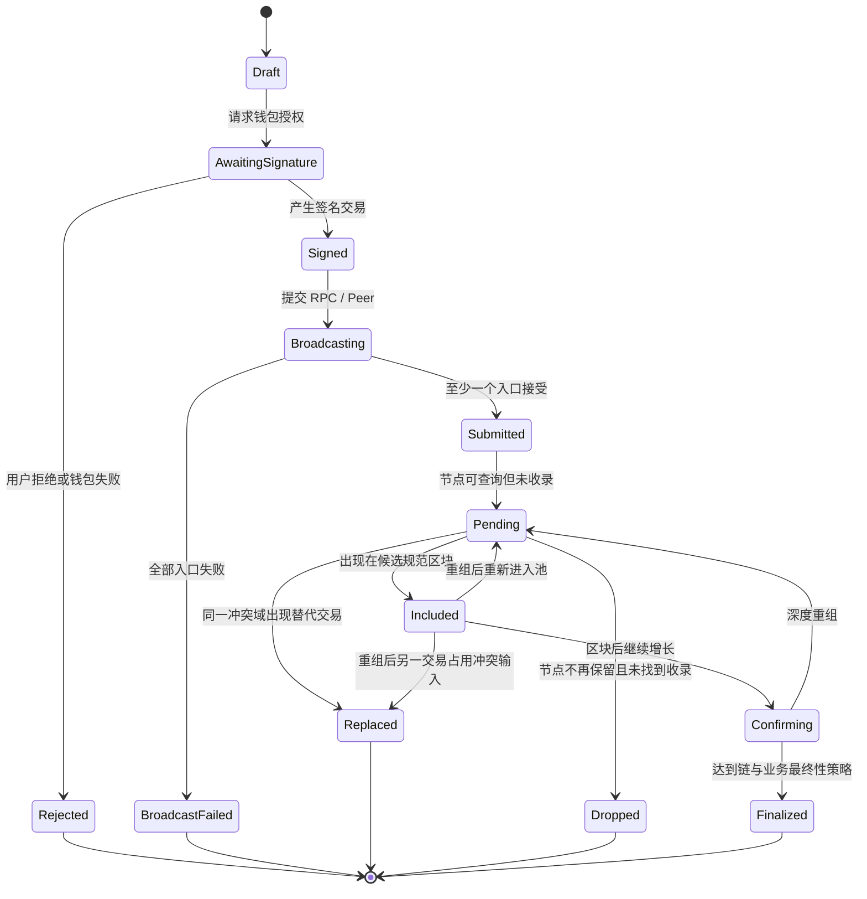
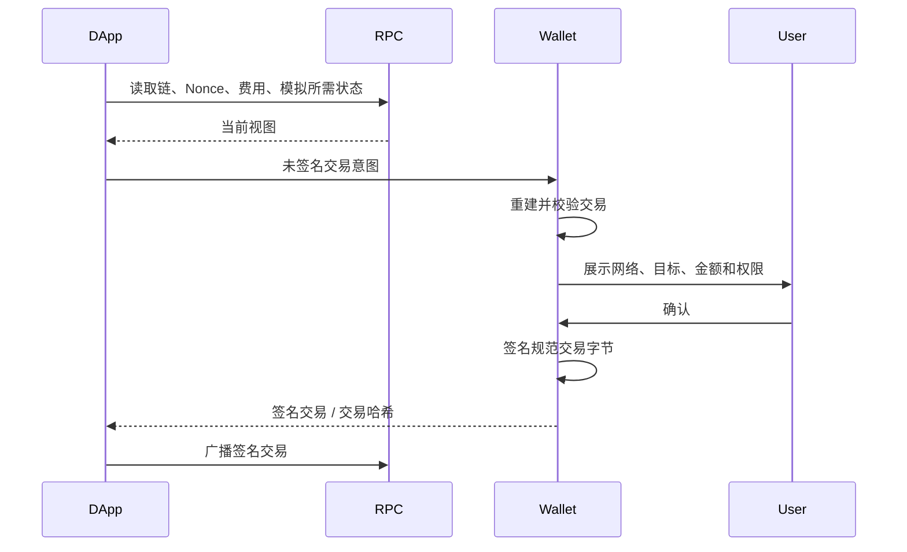
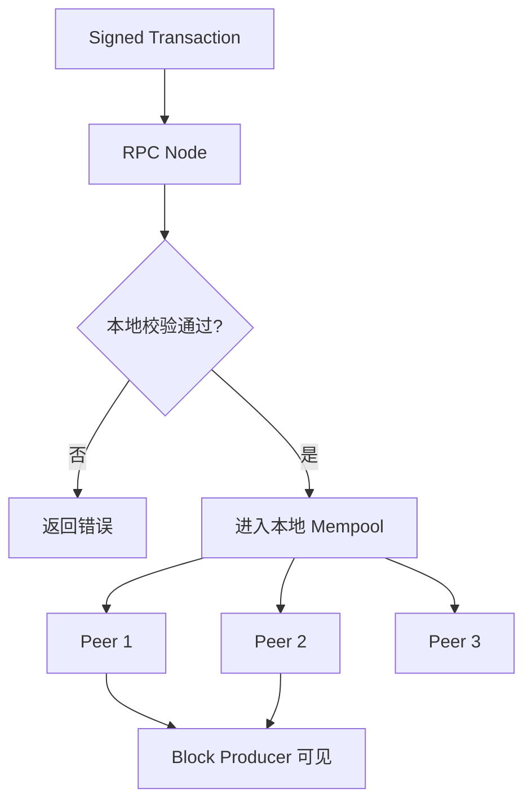
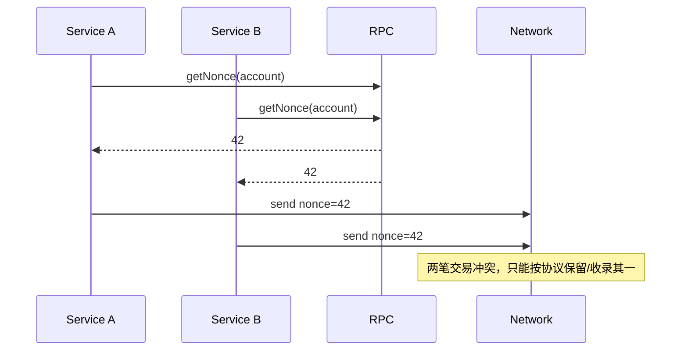
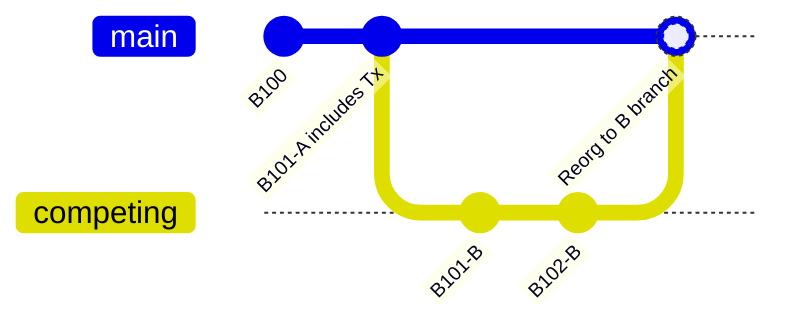
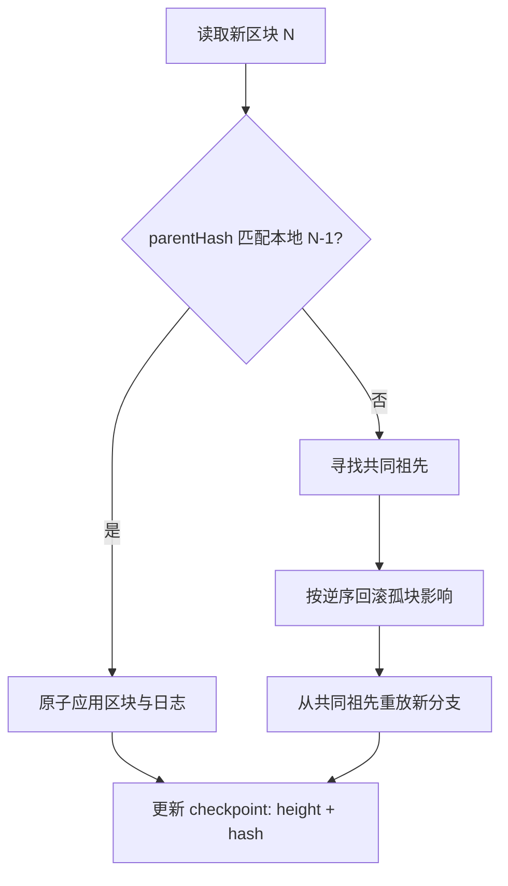
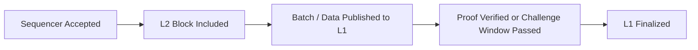

# Web3 交易与最终性：从 Mempool、Nonce、区块确认到重组处理

> 钱包返回交易哈希，只表示一份签名交易已经形成并被某个入口接受；区块浏览器显示交易，也不必然意味着业务可以不可逆结算。交易状态会前进、停滞、被替换，甚至因链重组而回退。

---

## 一、本文解决什么问题

DApp 最常见的交易代码看起来很简单：

```typescript
const transaction = await contract.write(...args);
await transaction.wait();
showSuccess();
```

真实网络中，这段流程可能遇到：

- 用户在钱包中拒绝签名；
- RPC 接受交易，但其他节点从未看到；
- 费用过低，交易长时间停留在 Mempool；
- 相同 Nonce 的更高费用交易替换了原交易；
- 后续 Nonce 交易被前一笔卡住；
- 交易进入区块，但合约执行失败；
- 区块被重组移出规范链；
- RPC、Indexer 和钱包对状态给出不同答案；
- 链停止最终化，但仍不断产生新区块；
- 跨链桥或 Layer 2 已确认交易，却尚未完成目标结算。

本文不把“成功”当成一个布尔值，而是建立一套可观察、可回退的交易生命周期，并解释最终性为何必须由目标链和业务风险共同定义。

### 核心结论

1. 交易生命周期至少包含构造、授权、广播、待处理、收录、执行结果、确认和最终化；任何中间状态都可能超时或分叉。
2. RPC 返回交易哈希不等于全网广播成功，更不等于区块收录或执行成功。
3. Mempool 通常是节点本地策略，不是全网一致数据库；不同节点可能接收、拒绝、替换或丢弃不同交易。
4. Nonce 在账户模型中常用于排序与防重放。并发发送必须由单一协调者管理，不能让多个组件各自读取一次链上 Nonce 后独立递增。
5. Block Inclusion 证明交易位于当前观察到的候选规范链中；Receipt 成功还需要与目标链、区块哈希和执行状态一起验证。
6. Confirmation 表示收录区块之后又积累了后续链进展，但确认数的安全含义取决于共识、攻击成本和链状态。
7. Reorganization 会让已收录交易回到待处理、进入另一高度、被替换或永久消失，因此状态机必须支持回退。
8. 概率最终性通过确认增长降低重组概率；经济最终性通过协议投票、锁定和惩罚等机制建立更强承诺，但都依赖具体安全假设。
9. Finalized Block 是协议或客户端给出的链特定语义，不是所有链共享的固定时间或 RPC 能力。
10. 业务结算策略应按资产价值、可逆成本和链风险分级，不能全站统一等待固定区块数。

---

## 二、一笔交易的完整状态机

Transaction Lifecycle（交易生命周期）不是一条只能向前的进度条，而是一个需要处理替换、丢弃和重组回退的状态机。

先建立与具体链尽量解耦的状态图：



图中 `Submitted`、`Pending`、`Included` 和 `Finalized` 不能合并：

- `Submitted` 是客户端与入口之间的结果；
- `Pending` 是某个节点的本地观察；
- `Included` 是交易位于当前候选规范链；
- `Finalized` 是目标链安全模型与业务策略下的稳定状态。

某些链不暴露公开 Mempool，某些 L2 的排序器先返回软确认，再把批次发布或证明提交到结算层。状态名称可以调整，但这些不同保证不能被压成一个“处理中”。

---

## 三、交易构造：签名前已经决定了大量语义

交易是规范编码后的协议消息。常见字段包括：

- 目标网络或 Chain ID；
- 发送者或输入所有权证明；
- 接收地址或合约地址；
- 转账金额、调用数据或资产输入；
- Nonce 或待消费 UTXO；
- 资源上限和费用参数；
- 有效期、最近区块引用或其他防重放域；
- 数字签名。

### 3.1 构造、签名和广播是三个阶段



DApp 提供的费用和 Nonce 只是建议或输入，钱包可能重建交易。签名前必须以钱包实际展示和实际签名字节为准。

### 3.2 模拟成功不保证链上成功

交易模拟基于某个区块状态和调用参数。签名、排队到收录期间，状态可能变化：

- 余额或授权被其他交易消耗；
- 价格和 Oracle 更新；
- NFT 已被其他用户铸造；
- 合约被暂停或升级；
- 区块时间、生产者或调用顺序改变；
- MEV 参与者插入前置交易。

模拟适合发现确定性错误和预估资源，但不是未来执行成功证明。高风险操作应设置业务 Slippage、Deadline、最低输出、目标状态版本等链上约束。

---

## 四、广播：RPC 接受不等于全网接受

提交签名交易后，RPC 通常先做编码、签名、费用和本地策略检查，然后返回交易标识或错误。



RPC 返回哈希通常只能证明该入口接受了请求。随后仍可能：

- 节点在响应后崩溃，交易尚未传播；
- Peer 因费用、余额或策略不同拒绝交易；
- 节点处于落后或错误分支；
- 私有 RPC 不向公共网络传播；
- 交易只进入某个私有订单流或 Builder 通道；
- RPC 返回的链并非用户预期网络。

### 4.1 交易哈希是什么保证

交易哈希通常由规范签名交易字节计算，因此同一签名交易重复广播应产生同一标识。但必须按链规则判断：

- 某些系统的用户操作、Bundle、意图和最终链上交易具有不同标识；
- 签名前的请求 ID 不是链上交易哈希；
- 调整费用通常会改变签名交易和哈希；
- RPC 返回哈希后仍应本地计算或交叉验证链与编码，视 SDK 能力而定。

### 4.2 多 RPC 广播的边界

重复广播**同一签名字节**通常用于提高传播覆盖率。不要在多个服务上并发“重新构造并签名”，否则不同费用估计可能产生多笔相同 Nonce 的冲突交易。

广播器需要记录：

- 原始签名字节或安全引用；
- Chain ID；
- From、Nonce 或输入集合；
- 交易哈希；
- 每个入口的提交时间和响应；
- 首次被 Peer/RPC 查询到的时间。

签名交易可能包含敏感业务信息，日志和持久化必须遵守隐私与密钥安全策略。

---

## 五、Mempool：节点本地的候选交易集合

Mempool（Memory Pool，内存池）是节点保存尚未进入规范区块的候选交易集合。名称虽包含 Memory，具体实现可能持久化部分数据，但它通常不是共识状态。

### 5.1 为什么各节点 Mempool 不一致

节点可能采用不同：

- 最低费用门槛；
- 容量和逐出策略；
- 单账户或单 Peer 限制；
- 交易替换加价规则；
- 本地白名单与黑名单；
- 抗 DoS 校验顺序；
- 客户端版本和协议升级状态；
- 网络连接和接收时序。

因此，“RPC A 查不到交易”不能直接推出交易已丢失，也不能用单个节点的 Mempool 排名准确预测收录时间。

### 5.2 Pending 与 Queued

在账户 Nonce 模型中，节点可能区分：

- **Executable / Pending**：前序 Nonce 连续且当前状态允许执行；
- **Queued / Future**：Nonce 前有缺口，需要等待更早交易；
- **Underpriced**：费用相对本地策略不足；
- **Invalid**：按当前状态或规则无效。

这些名称和分类属于客户端接口，不是所有链的统一标准。

### 5.3 Mempool 的隐私和 MEV 风险

公开交易在收录前可能被搜索者观察，并触发：

- 抢跑和三明治攻击；
- 清算竞争；
- NFT 抢铸；
- 复制套利；
- 交易审查或延迟。

私有交易通道可以减少公开泄露，但会引入对中继、Builder 或服务商的可用性、隐私和不审查信任。私有提交也不等于保证收录或避免所有 MEV。

---

## 六、Nonce：排序、防重放与并发冲突

Nonce 的含义取决于协议。在 Ethereum 一类账户模型中，发送账户交易 Nonce 通常按顺序递增，用于防止同一签名交易重复改变状态，并定义账户交易顺序。

### 6.1 为什么并发发送容易冲突

两个组件同时读取链上 Nonce `42`：



如果各组件各自执行“读取 Nonce + 1”，冲突不可避免。应由账户级单一协调者分配 Nonce，并持久化意图与交易映射。

```typescript
interface PendingTransaction {
  chainId: bigint;
  account: string;
  nonce: bigint;
  hash: string;
  createdAt: number;
  replacedBy?: string;
}

interface NonceStore {
  runExclusive<T>(
    chainId: bigint,
    account: string,
    operation: () => Promise<T>,
  ): Promise<T>;
}
```

锁只能保护单进程时，应升级为数据库事务、租约或单写者队列。协调器还必须与链上状态和本地未确认记录对账，不能只在内存中递增。

### 6.2 `latest` 与 `pending` Nonce

某些 RPC 允许读取已确认状态或包含本地待处理交易的 Nonce。`pending` 视图依赖该 RPC 的本地 Mempool，切换提供商后可能变小或变大。

稳健分配器通常综合：

- 规范链已确认 Nonce；
- 本地已签名、已广播但未最终化记录；
- 目标 RPC 的待处理视图；
- 已替换和已丢弃交易；
- 重组后的回退状态。

### 6.3 Nonce Gap 会阻塞后续交易

若 Nonce `42` 长期未收录，`43`、`44` 即使费用很高，也可能无法按账户顺序执行。处理方式包括提高 `42` 的费用、用同 Nonce 的取消交易替换，或等待其恢复。

“取消交易”通常不是从网络删除原交易，而是广播同 Nonce、符合替换规则的新交易，试图让新交易先被收录。原交易仍可能在其他节点存在，结果取决于最终收录者看到的候选集合。

### 6.4 UTXO 模型的冲突域不同

UTXO 链不是用账户连续 Nonce 排序，而是交易消费具体未花费输出。两笔交易消费同一输入会形成 Double Spend 冲突；钱包需要 Coin Selection、Change Output 和输入锁定。

因此不能把账户 Nonce 管理器直接移植到 UTXO 钱包。共同点是：并发构造必须由本地协调器管理“可消费状态”，并在重组后重新对账。

---

## 七、Transaction Replacement：替换不是修改原交易

签名交易一旦形成就不能原地修改。所谓替换，是创建另一笔占用相同冲突域的交易：账户模型常使用相同发送者和 Nonce，UTXO 模型可能消费相同输入。

### 7.1 加速与取消

- **Speed Up**：保留业务意图，提高符合协议/节点策略的费用；
- **Cancel**：用同一冲突域创建无害或自转交易，争取先被收录；
- **Business Replace**：修改接收方、金额或调用数据，本质是新授权。

节点通常要求替代交易在费用上满足加价策略，但阈值属于客户端和网络策略，不能硬编码一个全链永久有效百分比。

### 7.2 状态应该按“交易意图”聚合

用户想完成的是“订单 123 支付”，不一定是某个固定哈希。一次意图可能产生哈希链：

```text
intent-123
  -> txHash-A (原交易)
  -> txHash-B (加速替换)
  -> txHash-C (再次加速)
```

数据库应同时建模：

- `intentId`：业务意图；
- `attemptId`：每次签名尝试；
- `transactionHash`：链上候选交易；
- `conflictKey`：账户 + Nonce，或输入集合；
- `replacementOf` / `replacedBy`；
- 每个哈希的收录和重组历史。

只用 `transactionHash` 作为订单主键，会在替换后丢失业务连续性。

---

## 八、Dropped Transaction：查不到不等于可以重发

Dropped Transaction 通常表示某个观察节点不再保留交易，原因可能包括：

- Mempool 容量逐出；
- 费用低于新策略；
- Nonce 已被其他交易使用；
- 余额或输入变得无效；
- 节点重启或切换；
- 交易从未传播到该节点；
- 协议升级后不再有效。

### 8.1 如何判断“可能已丢弃”

不能只查询一次 `getTransaction(hash) === null`。应结合：

1. 多个独立 RPC 是否都查不到；
2. 冲突 Nonce 或输入是否已被其他交易收录；
3. 发送账户当前 Nonce 是否已越过；
4. 交易是否曾出现在某个区块，后来发生重组；
5. 原始交易按当前状态是否仍有效；
6. 距广播时间和链活跃程度是否超过业务阈值。

即便判断为 Dropped，重新签名写操作也必须避免双重业务执行。链上防重放不等于业务幂等，例如两个不同 Nonce 都可能调用同一个 `createOrder`。

### 8.2 不要无限自动重发

自动重发会导致：

- 用户在未知费用下重复授权；
- 状态变化后执行过期意图；
- 多 RPC 分叉视图产生冲突尝试；
- 费用竞价失控；
- 后端和钱包对 Nonce 所有权分裂。

应设置意图过期时间、最大费用、最大替换次数和人工确认阈值。

---

## 九、Block Inclusion：进入区块还要验证执行结果

当交易出现在某个区块中，可称其已收录。但 DApp 至少要验证：

- Chain ID 与预期网络一致；
- 交易哈希与签名尝试一致；
- 区块哈希和高度已记录；
- 区块当前仍属于候选规范链；
- 交易执行状态成功；
- 日志、返回语义或状态变化符合业务预期；
- 目标合约、接收方、资产和金额正确。

### 9.1 收录与执行成功是两件事

某些智能合约链会把执行失败的交易也收录，并消耗费用。Receipt 存在不等于业务成功，必须检查协议定义的状态字段。

即便顶层交易成功，内部调用或 Token 行为仍可能与预期不一致。业务系统应验证最终状态或可信事件，而不是仅检查 `status`。

### 9.2 Event 也不是脱离上下文的真相

事件日志属于具体区块执行结果：

- 区块重组后日志可能被移除；
- 相同事件签名可能来自仿冒合约；
- 代理升级可能改变业务语义；
- 非标准 Token 可能不按预期发出事件；
- Indexer 可能延迟或漏处理。

消费事件时应保存 `chainId + blockHash + transactionHash + logIndex` 等身份，并支持 Removed / Reorg 回滚。

---

## 十、Confirmation：确认数不是通用安全常数

若交易位于高度 `H` 的区块，链头增长到 `H + k`，常说交易有若干确认。不同工具对“包含区块是否算第一个确认”的定义可能不同，系统应明确公式。

```text
confirmations = currentCanonicalHeight - inclusionHeight + 1
```

这只是高度差，不是直接的安全概率。

### 10.1 为什么后续区块会增加稳定性

在基于最长/最重链和概率最终性的系统中，攻击者若想移除旧交易，需要构建能超过当前规范链的替代历史。随着后续工作或权重累积，成本通常上升，成功概率下降。

但实际风险还受以下因素影响：

- 攻击者控制的算力或权重；
- 网络分区和区块传播；
- 链的总安全预算；
- 客户端和共识 Bug；
- 交易价值是否足以激励攻击；
- 检查点、最终性 Gadget 或社会恢复机制。

因此“等待 6 个区块永远安全”不是跨链结论。

### 10.2 时间不是确认的替代品

等待 10 分钟，但链在此期间没有出块，安全进展可能为零；快速产生许多低安全预算区块，也不等于高价值链的同等保证。

最终性策略应观察链的协议进展，而不是只启动本地计时器。

---

## 十一、Reorganization：已收录状态为什么会回退

Reorganization（链重组）发生在节点原先接受的一段链被另一候选规范链替代时。



上图仅用于表达分叉替换，实际共识不是 Git 合并。

### 11.1 重组后交易可能去哪

- 交易仍有效，重新进入 Mempool；
- 交易被新分支的区块再次收录，但高度和区块哈希改变；
- 相同 Nonce 的另一交易已收录，原交易变为 Replaced；
- 余额、输入或 Deadline 改变，原交易失效；
- RPC 不再保留原交易，观察为 Dropped。

因此从 `Included` 回退时，不能机械地设为 `Pending`，而要重新评估冲突域和有效性。

### 11.2 Indexer 如何处理重组

Indexer 不应只保存最后处理高度，还要保存每个高度对应的区块哈希：



业务派生表必须可逆或可重建。只把事件转换成“发送一次邮件/发一次货”的不可逆副作用，会在重组时无法恢复。

### 11.3 浅重组与深重组

正常网络竞争可能产生浅重组；深重组可能意味着严重网络分区、共识攻击、客户端故障或最终性异常。监控应按链的正常分布设置分级告警，而不是看到任意重组都宣布攻击。

---

## 十二、概率最终性与经济最终性

Finality 描述已接受结果未来不再被协议正常过程推翻的保证。不同协议给出的保证形式不同。

### 12.1 Probabilistic Finality

概率最终性常见于基于累积工作或权重选择链的系统。交易越深，发生足够大重组的概率通常越低，但理论上不一定降为绝对零。

业务策略常以确认数作为近似，但应根据：

- 链安全预算；
- 历史重组分布；
- 交易金额和攻击收益；
- 入账可逆性；
- 当前网络异常状态；
- 交易对手风险。

### 12.2 Economic Finality

PoS 系统可能由验证者投票、检查点和 Slashing 等机制形成经济最终性。推翻已最终化结果可能需要大量验证者违反协议并承担可罚没成本。

经济最终性不是“技术上绝对无法改变”：

- 协议阈值假设可能被突破；
- Slashing 能否执行取决于证据和社会协调；
- 客户端 Bug 可能影响投票；
- 极端事件可能通过协议外协调选择恢复链；
- 用户仍需获得可信检查点和正确客户端。

它表达的是在特定共识和经济假设下的强承诺。

### 12.3 Finality 与 Liveness 可以分离

某些网络可以继续出块，但因验证者参与不足而停止最终化。此时：

- `latest` 高度继续增长；
- 交易能被收录；
- `finalized` 高度停滞；
- 依赖最终性的桥、交易所或高价值业务应暂停结算。

健康监控不能只看最新区块时间，还要看最终性进度和 Latest-to-finalized Distance。

---

## 十三、Finalized Block：必须采用链特定语义

Finalized Block 可能来自：

- 共识协议明确的最终化检查点；
- 客户端暴露的 `safe` / `finalized` 标签；
- BFT 委员会证书；
- L2 排序器软确认；
- L1 数据发布、挑战期结束或有效性证明验证；
- 应用自己定义的确认策略。

这些保证不可互换。

### 13.1 Chain-specific Finality 检查表

接入一条链前应确认：

1. 共识使用概率最终性、确定性/BFT 最终性，还是二者组合？
2. RPC 是否支持 `safe`、`finalized` 或等价标签？
3. 最终性依赖多少参与权重和什么网络假设？
4. 正常与异常情况下最终化需要多久？
5. Finality Stall 时 Latest 是否继续推进？
6. L2 的排序器确认、L2 最终性和 L1 结算分别是什么？
7. 跨链消息何时可在目标链执行，是否存在挑战或证明延迟？
8. 协议升级、治理回滚和客户端检查点如何处理？

这些答案必须来自目标链在指定版本和验证日期下的官方规范与节点实测。

### 13.2 L2 最终性是多阶段的

一个 Rollup 交易可能经历：



每一步对应不同风险。面向用户的“秒级确认”可能只是排序器软确认，高价值退出或跨链结算可能需要等待更后阶段。

---

## 十四、DApp 交易状态设计

不要只维护 `isLoading` 和 `isSuccess`。一个可持久化模型可以是：

```typescript
type TransactionState =
  | { kind: 'awaitingSignature'; intentId: string }
  | { kind: 'rejected'; intentId: string; reason: string }
  | { kind: 'broadcasting'; intentId: string; attemptId: string }
  | { kind: 'pending'; hash: string; firstSeenAt: number }
  | {
      kind: 'included';
      hash: string;
      blockNumber: bigint;
      blockHash: string;
      executionSucceeded: boolean;
    }
  | {
      kind: 'confirming';
      hash: string;
      blockNumber: bigint;
      blockHash: string;
      confirmations: bigint;
    }
  | { kind: 'finalized'; hash: string; finalizedBlockHash: string }
  | { kind: 'replaced'; hash: string; replacementHash: string }
  | { kind: 'dropped'; hash: string; lastSeenAt: number }
  | { kind: 'unknown'; hash: string; reason: string };
```

### 14.1 状态迁移必须可回退

```typescript
function observeCanonicalBlock(
  state: TransactionState,
  observation: {
    blockNumber: bigint;
    blockHash: string;
    stillCanonical: boolean;
  },
): TransactionState {
  if (
    (state.kind === 'included' || state.kind === 'confirming')
    && state.blockHash === observation.blockHash
    && !observation.stillCanonical
  ) {
    return {
      kind: 'unknown',
      hash: state.hash,
      reason: 'inclusion block was reorganized; reconcile nonce/input',
    };
  }
  return state;
}
```

回退到 `unknown` 后应触发对账：查询原哈希、冲突 Nonce/输入、账户状态和多个链头，而不是立即显示失败或自动重发。

### 14.2 页面关闭后仍要继续追踪

交易生命周期可能长于浏览器页面或移动 App 进程。应持久化最小追踪信息，并由：

- App 恢复时重新对账；
- 后端 Watcher 持续观察；
- 推送或通知服务更新；
- Indexer 处理确认和重组。

前端轮询只能改善 UX，不能作为高价值业务唯一结算器。

### 14.3 并发与竞态

监控器可能同时收到：

- WebSocket 的新区块；
- HTTP 轮询回执；
- Indexer 事件；
- 钱包返回的替换通知；
- 用户手动刷新。

所有更新应携带观察来源、区块高度、区块哈希和时间，并通过单一 Reducer/事务合并。不能按 HTTP 响应到达顺序覆盖状态。

---

## 十五、业务最终性策略

协议最终性与业务最终性不是同一个概念。业务还要考虑金额、履约可逆性和欺诈成本。

| 场景 | 可接受策略示例 | 失败补偿 |
|---|---|---|
| 点赞、游戏低价值动作 | 收录或少量确认后乐观展示 | 重组后回退 UI |
| 小额数字内容 | Safe/若干确认后交付 | 可撤销授权、风控限额 |
| 电商实物发货 | 强确认/最终化 + 完整支付校验 | 延迟发货、人工审核 |
| 交易所入账 | 按链和资产动态确认 | 暂停提现、风险准备金 |
| 跨链桥提款 | 源链最终性 + 桥协议完成 + 目标链确认 | Emergency Pause、限额 |
| 治理与大额金库 | Finalized + Timelock + 多源验证 | Guardian、延迟执行 |

策略不应写死在 UI。服务端或风险配置需要版本化记录：

- Chain ID 与资产；
- 最低确认/Finality 标签；
- 最大可接受 Finality Stall；
- 重组深度告警阈值；
- 单笔和累计风险限额；
- 降级、暂停和人工审核条件。

动态调整必须防止配置服务被攻击后降低安全阈值。

---

## 十六、常见误区与错误案例

### 16.1 误区：拿到交易哈希就是提交成功

哈希可以在本地签名后计算，RPC 接受也只是一个入口的结果。应区分 `signed`、`submitted`、`seenByNetwork` 和 `included`。

### 16.2 误区：Receipt 存在就是业务成功

Receipt 可能记录失败执行。即便成功，也要验证链、合约、资产、金额、事件和最终性。

### 16.3 误区：固定等待 N 个区块适用于所有链

不同链的区块时间、安全预算、分叉选择和最终性不同。L2 还包含排序器、L1 发布和证明/挑战阶段。

### 16.4 误区：交易查不到就重新发一笔

原交易可能只在另一个节点，或已进入尚未被当前 RPC 看到的区块。重新签名可能造成双重业务执行或 Nonce 冲突。

### 16.5 误区：Finalized 后所有业务都不可撤回

链历史的协议最终性不阻止合约管理员回滚业务状态、Token 冻结、Oracle 修正或现实世界退款。还要分析应用权限和链下法律流程。

### 16.6 错误案例：用前端计时器决定发货

```typescript
// 错误：时间流逝不能证明链产生确认或达到最终性。
setTimeout(() => fulfillOrder(orderId), 10 * 60 * 1000);
```

正确方向是由后端结算器验证目标链的规范区块、执行结果和最终性，并以订单幂等键提交履约：

```typescript
interface SettlementEvidence {
  chainId: bigint;
  transactionHash: string;
  blockHash: string;
  blockNumber: bigint;
  finality: 'included' | 'safe' | 'finalized';
  recipient: string;
  asset: string;
  amount: bigint;
  executionSucceeded: boolean;
}

function isSettlementReady(
  evidence: SettlementEvidence,
  requiredFinality: SettlementEvidence['finality'],
): boolean {
  const rank = { included: 0, safe: 1, finalized: 2 } as const;
  return evidence.executionSucceeded
    && rank[evidence.finality] >= rank[requiredFinality];
}
```

这只是策略骨架。`safe` 和 `finalized` 是否存在、含义是什么，必须由目标链适配器实现并验证。

---

## 十七、可观测性与故障治理

### 17.1 交易级指标

- Signature Approval / Rejection Rate；
- Submit Success Rate；
- First Seen Latency；
- Time to Inclusion；
- Time to Safe / Finalized；
- Replacement Rate；
- Dropped Rate；
- Execution Revert Rate；
- Reorged Transaction Count；
- Finality Lag。

延迟应使用分位数并按链、交易类型、费用策略、RPC 和钱包分组，平均值会掩盖长尾。

### 17.2 状态停留告警

不同停留状态对应不同排查方向：

| 状态 | 可能原因 | 检查项 |
|---|---|---|
| Broadcasting | RPC 故障、签名字节无效 | 多入口响应、Chain ID、错误分类 |
| Pending | 费用不足、Nonce Gap、余额变化 | 冲突交易、Mempool、费用市场 |
| Included 未确认 | 链停顿或 RPC 落后 | 链头哈希、Peer、区块生产 |
| Confirming 未最终化 | Finality Stall | 验证者参与、Finalized Height |
| Indexer 落后 | 消费失败、重组回滚 | Checkpoint 高度与哈希、队列积压 |

### 17.3 多源一致性检查

对高风险交易，可从独立节点读取同一高度的区块哈希、回执和 Finalized Checkpoint。仅比较高度不够，因为同高度可能位于不同分支。

发现冲突时，应进入 `unknown / degraded`，暂停不可逆结算并保留证据，而不是多数投票后无条件继续。多个 RPC 可能共享同一上游，所谓多数未必独立。

---

## 十八、测试与验证方法

### 18.1 状态机测试

至少覆盖：

- 用户拒签、钱包断开和签名超时；
- RPC 接受后查询不到；
- Pending 超时但稍后收录；
- 同 Nonce 加速替换和取消替换；
- Nonce Gap 阻塞后续交易；
- 收录但执行失败；
- 收录区块发生重组；
- 重组后原交易再次收录；
- 重组后替代交易收录；
- Finality 停滞但 Latest 增长；
- Indexer 落后或回滚失败；
- App 重启后恢复追踪。

### 18.2 本地与测试网实验

1. 固定链、客户端版本、区块高度和测试时间。
2. 同时连接两个独立节点，比较 Mempool 可见性。
3. 发送低费用交易，再用同 Nonce 发送符合规则的替代交易。
4. 人为制造账户 Nonce Gap，观察后续交易状态。
5. 在可控开发网络制造短分叉，验证 UI 和 Indexer 回滚。
6. 暂停最终性相关参与者或使用协议提供的故障环境，观察 Latest 与 Finalized 差距。
7. 重启 App、Watcher 和节点，验证持久化记录能否恢复。

公共测试网的费用市场、参与者和重组分布不等同于主网，实验只能验证流程，不能直接推导生产阈值。

### 18.3 记录版本与证据

每次最终性测试应记录：

- Chain ID、网络名和协议升级状态；
- 客户端名称与版本；
- RPC 提供商与方法；
- 交易原始字节或安全哈希引用；
- Inclusion Height + Block Hash；
- Safe / Finalized Height + Block Hash；
- 观察时间、重组和替换历史；
- 业务采用的最终性策略版本。

这样才能在故障后回答“当时依据什么完成结算”。

---

## 十九、总结

一笔 Web3 交易不是“发送后等待成功”，而是一段可能前进、停滞和回退的分布式状态机：

1. 构造阶段确定链、目标、Nonce/输入、费用和业务约束。
2. 签名只授权确定字节，不保证广播和执行。
3. RPC 接受是接入层状态，Mempool 是节点本地候选视图。
4. Nonce 或 UTXO 冲突域决定替换和并发协调方式。
5. 区块收录后仍要验证执行结果和业务状态。
6. 确认数只是链进展的近似指标，安全含义依赖具体共识。
7. 重组会移除已收录交易，DApp、Indexer 和结算器必须支持回滚。
8. 概率最终性和经济最终性提供不同形式的稳定保证。
9. Finalized 必须按目标链、L2 和跨链协议分别定义。
10. 高价值业务需要链上证据、独立观察、幂等履约和故障暂停共同闭环。

真正可靠的交易体验，不是永远显示一个旋转中的“Pending”，而是让用户知道交易当前获得了什么保证、下一步可能发生什么，以及系统如何从替换、丢弃和重组中恢复。

---

## 问答复盘

### Q1：RPC 返回交易哈希后，交易处于什么状态？

**答：** 最多说明某个入口接受了签名交易。它可能尚未传播到生产者，也未进入区块；应记录为 Submitted/Broadcast，而不是 Confirmed。

### Q2：为什么不同 RPC 对同一交易的 Pending 状态可能不一致？

**答：** Mempool 通常是节点本地策略，各节点的 Peer、费用门槛、容量、替换规则和接收时序不同，因此不形成全网一致视图。

### Q3：账户 Nonce 与交易哈希最容易混淆的边界是什么？

**答：** Nonce 标识账户交易顺序和冲突域，同一 Nonce 可以产生多个不同哈希的替代交易；交易哈希标识某一份确定的签名字节。

### Q4：交易已收录且 Receipt 存在，是否可以判定业务成功？

**答：** 不能。还要检查执行状态、目标合约、资产、金额和事件语义，并确认收录区块仍在规范链且达到业务所需最终性。

### Q5：Dropped Transaction 是否可以安全地重新发送？

**答：** 不能直接重发。应先检查多个节点、冲突 Nonce/UTXO、账户状态和重组历史；重新签名还必须确保链上和业务层幂等。

### Q6：确认数越多是否一定线性增加安全性？

**答：** 不一定。确认数只是高度差，实际安全性取决于共识权重、网络状态、攻击成本、最终性机制和交易价值，不能跨链线性比较。

### Q7：PoS 链继续出块是否说明网络最终性正常？

**答：** 不一定。部分协议可能在 Latest 继续增长时停止 Finalized Checkpoint 推进，高价值结算应监控最终性高度而不只看最新区块时间。

### Q8：电商支付为什么需要可回退状态机和幂等履约？

**答：** 收录交易可能因重组被移除或被替代；状态机用于回退链上观察，幂等履约防止多个哈希、重复通知或恢复重放造成重复发货。

---

## 延伸知识

- **共识机制**：Fork Choice、Validator、Attestation、Safety、Liveness 和 Finality Gadget。
- **Ethereum 状态模型**：账户 Nonce、Receipt、State Root 与 Transaction Root。
- **Gas 与费用市场**：费用估计、Base Fee、Priority Fee 和替换策略。
- **DApp 交易状态机**：钱包交互、用户拒签、模拟、重试和跨设备恢复。
- **Indexer 一致性**：日志消费、Checkpoint、重组回滚和最终化窗口。
- **Layer 2 与跨链**：排序器软确认、L1 结算、挑战期、证明和桥接最终性。
