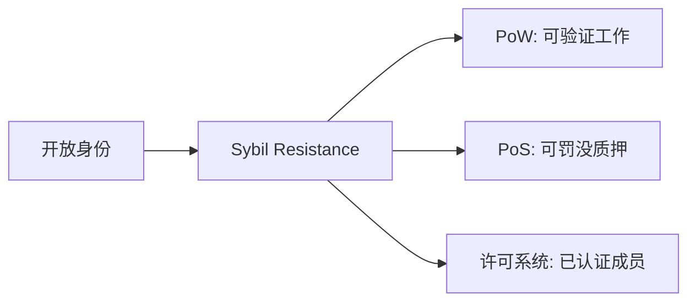
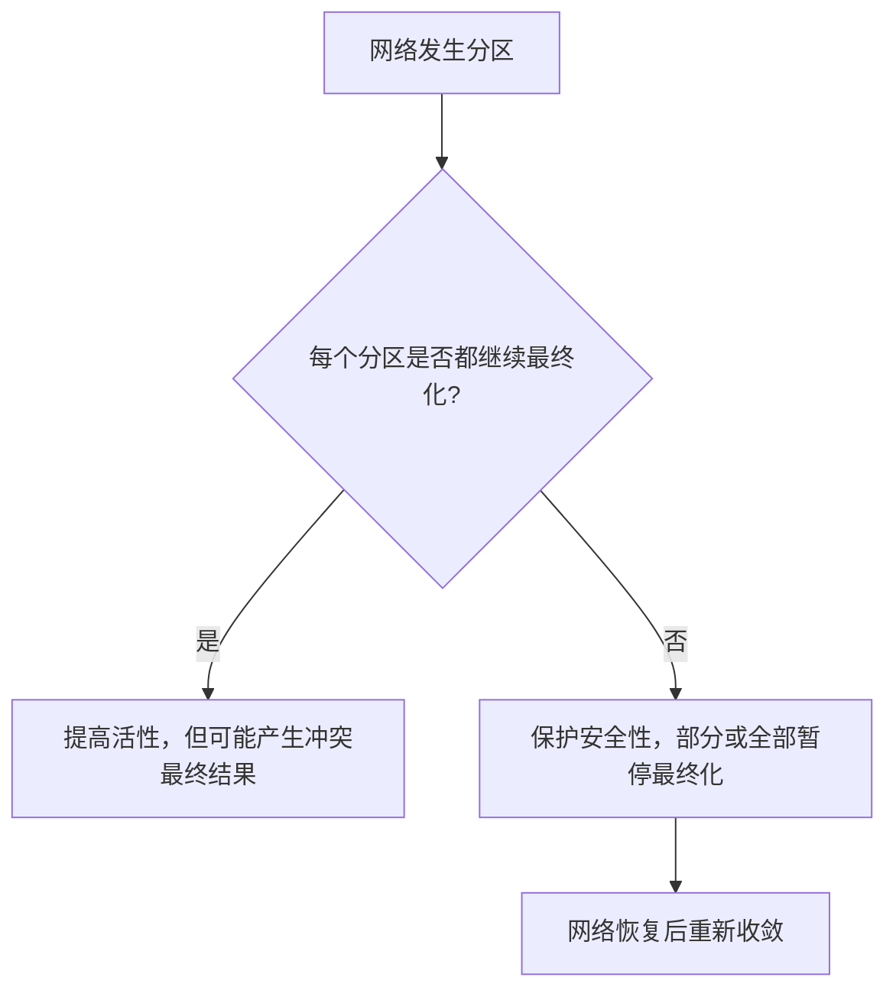
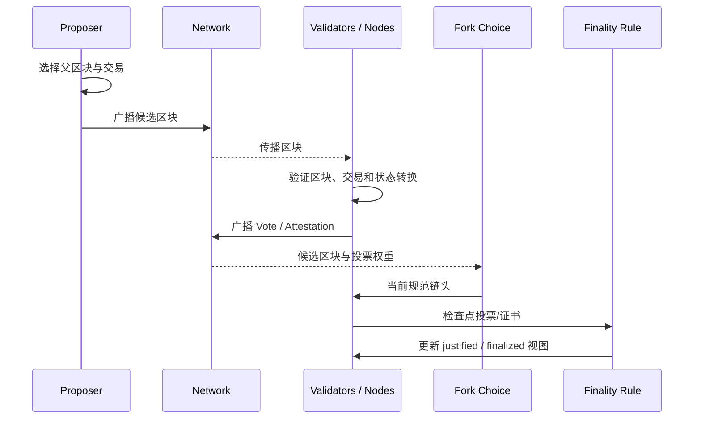
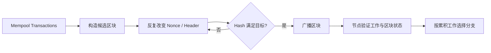
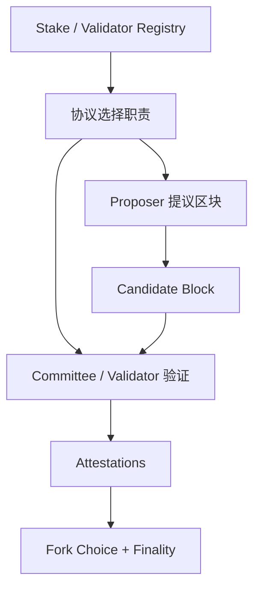
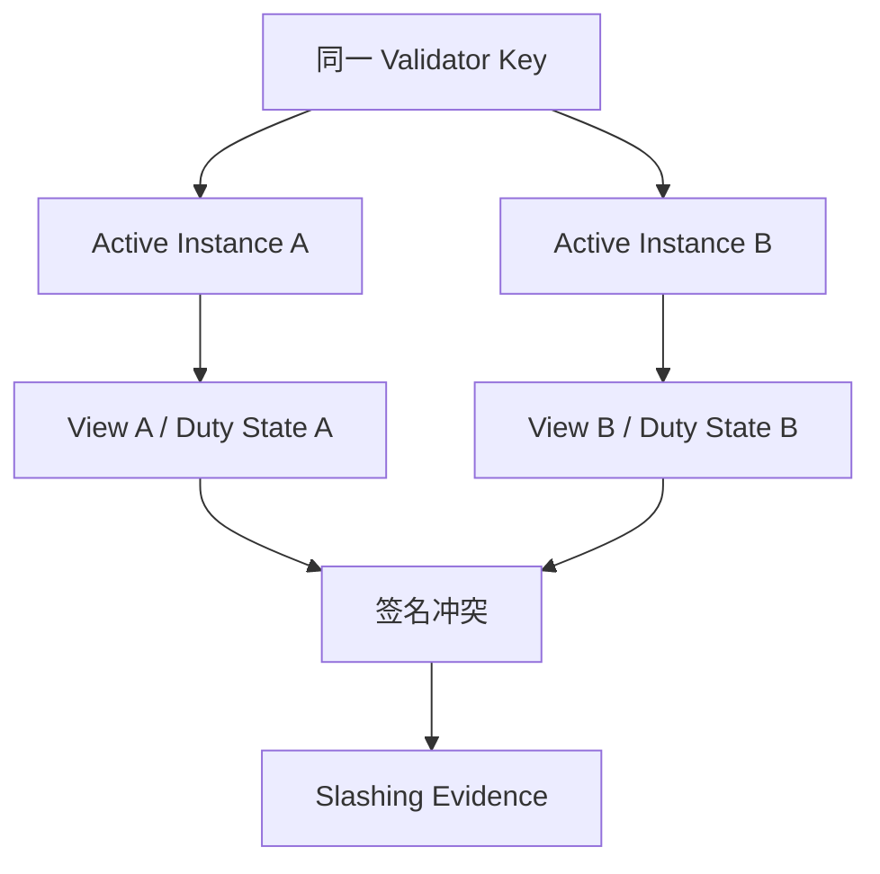
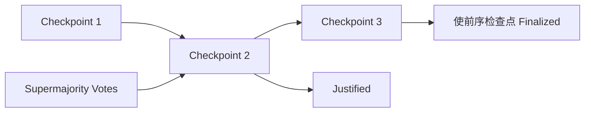
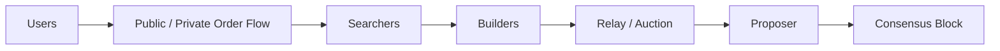

# Web3 共识机制：从 PoW、PoS 到分叉选择与最终性

> 共识不是让所有节点在每一毫秒都看到相同数据，而是让节点在明确的网络与故障假设下，对交易顺序、规范历史和最终结果逐步收敛，并在安全性与活性发生冲突时作出可解释的取舍。

---

## 一、本文解决什么问题

上一节讨论了交易从 Mempool 到收录、重组和最终化的状态变化。但还有一个更底层的问题：网络中可能同时出现多个候选区块，节点为什么最终会选择相同历史？

常见回答是“少数服从多数”，但这不够准确：

- “多数”按节点数量、算力、质押权重还是委员会计算？
- 攻击者能否创建大量伪身份获得多数？
- 节点因网络延迟看到不同区块时，谁是错的？
- 两个区块都符合交易规则时，如何选择规范分支？
- 为什么系统有时宁可停止最终化，也不接受冲突结果？
- PoS 验证者离线、双签或投票冲突会发生什么？
- Fork Choice 和 Finality Gadget 是否解决同一问题？
- 交易排序与 MEV 属于共识安全，还是市场结构问题？

本文使用链无关的概念模型解释共识，再比较 PoW（Proof of Work，工作量证明）和 PoS（Proof of Stake，权益证明）。具体出块周期、投票阈值、惩罚公式和最终化时间属于链与协议版本参数，不能从本文的通用模型直接推导。

### 核心结论

1. 共识解决的是多节点对有序历史和最终结果的收敛，不负责判断 Oracle、业务输入或资产价值是否真实。
2. 共识安全必须声明网络模型、故障模型、参与权重和密码学假设；“节点很多”本身不是安全证明。
3. Safety 表示不会同时接受冲突的最终结果，Liveness 表示系统能持续推进；网络分区时协议往往必须优先其一。
4. PoW 用可验证的计算成本和累积工作抵抗 Sybil；PoS 用可罚没质押、验证者身份和投票权重建立安全边界。
5. Proposer 提议候选区块，Validator/Committee 验证并投票；提议权不等于可写入任意状态，无效区块仍应被拒绝。
6. Attestation 是对链头、检查点或协议命题的签名投票，只有绑定 Slot/Epoch、域和目标后才具有明确语义。
7. Slashing 惩罚可证明的协议冲突行为，不等于惩罚所有离线，也不能替代密钥隔离、双签保护和运营监控。
8. Fork Choice 选择当前应跟随的候选链头，Finality Gadget 为检查点建立更强不可逆承诺；二者可以组合但职责不同。
9. PoW 常以累积工作形成概率最终性；许多 PoS/BFT 设计提供经济或协议最终性，但仍依赖阈值、网络和客户端正确性。
10. MEV 主要来自交易排序、包含与排除权。它与区块生产紧密相连，但不能把所有不公平排序都误判为共识失效。

---

## 二、共识之前：先声明系统假设

讨论一个协议是否“安全”，至少要给出以下条件。

### 2.1 网络模型

| 模型 | 假设 | 工程含义 |
|---|---|---|
| Synchronous | 消息在已知上界内到达 | 可使用固定超时推理，但现实公网很难长期满足严格上界 |
| Asynchronous | 不假设消息到达上界 | 无法仅凭等待区分节点宕机和消息延迟 |
| Partially Synchronous | 未知时刻后网络延迟满足某个上界 | 许多实际 BFT 协议采用的推理背景 |

在纯异步模型中，只要允许节点崩溃，确定性共识就存在著名的不可能性边界。实际协议通过随机性、最终同步假设、失败检测器或经济机制取得可用方案。

这不意味着“区块链不可能达成共识”，而是说明任何活性结论都依赖条件，不能同时承诺任意分区、任意延迟下永远安全且持续出块。

### 2.2 故障模型

- **Crash Fault**：节点停止、重启或不响应；
- **Omission Fault**：节点遗漏发送或接收部分消息；
- **Byzantine Fault**：节点可以发送冲突、伪造或恶意消息；
- **Adaptive Corruption**：攻击者根据运行状态选择攻击参与者；
- **Network Adversary**：延迟、分区、审查或选择性传播消息。

数字签名能识别谁签了冲突消息，但无法迫使节点在线，也无法保证消息及时传播。

### 2.3 Sybil Resistance

开放网络中，攻击者可以低成本创建大量 Node ID。因此不能按“一个网络连接一票”投票。



PoW 和 PoS 首先解决“如何赋予难以伪造的协议权重”，然后共识规则使用这些权重选择历史或统计投票。

---

## 三、Safety 与 Liveness：共识的两条主线

### 3.1 Safety

Safety（安全性）可以概括为：两个诚实参与者不会最终接受互相冲突的结果。

例如，同一笔 UTXO 不应在两个最终账本中分别支付给不同接收者；同一账户 Nonce 的冲突交易也不应同时成为最终事实。

Safety 失效通常比短暂停机严重，因为不同参与者可能基于冲突结果完成不可逆链下结算。

### 3.2 Liveness

Liveness（活性）表示有效交易在满足协议条件时最终能够被处理，链能够继续产生并确认新区块。

活性下降可能表现为：

- 出块停止；
- 区块继续产生但无法最终化；
- 某些用户交易持续被审查；
- 验证者参与率不足；
- 网络分区中的节点无法同步规范链。

### 3.3 网络分区中的取舍



成熟协议不会用一句“CAP”替代分析，而会明确：什么条件下可继续出块、什么条件下可最终化、恢复后如何选择分支，以及违反安全阈值时依赖什么社会协调。

---

## 四、共识执行流程的通用模型

不同协议细节差异很大，但可以抽象出以下对象：



需要区分：

- **Validity**：区块是否符合状态转换和协议规则；
- **Availability**：验证所需数据是否可获得；
- **Fork Choice**：多个有效候选分支中当前跟随哪条；
- **Finality**：哪些历史获得更强、不可轻易回退的承诺。

共识不能让无效状态变有效。诚实节点必须先验证区块，再把它纳入分叉选择和投票。

---

## 五、Proof of Work：用累积工作选择历史

PoW 要求区块生产者寻找满足难度目标的证明。其他节点验证证明通常远比生产证明便宜。

### 5.1 简化工作流



哈希难题本身不理解交易。区块仍需通过签名、双花、金额、脚本或状态转换验证。

### 5.2 PoW 如何抵抗 Sybil

创建一万个节点身份不能凭空获得一万倍出块权。影响力来自投入的有效计算工作，而工作需要硬件和能源成本。

安全假设通常关注攻击者相对诚实网络的算力、网络传播和经济收益，而不是矿工地址数量。

### 5.3 概率最终性

PoW 链可能临时出现多个有效分支。节点按协议定义的累积工作规则选择分支，较短分支中的区块成为孤块或陈旧块。

交易后续积累的工作越多，攻击者重写历史通常越困难，但概率不必降为绝对零。确认策略应结合：

- 全网安全预算；
- 攻击者租赁或控制算力的可能性；
- 区块传播和 Selfish Mining 风险；
- 交易价值及链下结算可逆性；
- 当前网络异常与历史重组数据。

### 5.4 PoW 的成本与中心化压力

- 持续能源和硬件投入；
- 专用硬件、矿池和廉价能源形成规模效应；
- 矿池模板和区块构造权可能集中；
- 算力可跨链迁移，较小链可能更易受攻击；
- 出块时间具有随机性，确认延迟存在长尾。

能源成本是安全预算的一部分，也是外部成本。评价必须同时考虑安全、开放参与、硬件市场和实际能源来源，不能只用单一口号。

---

## 六、Proof of Stake：用质押权重和惩罚约束行为

PoS 让参与者锁定协议资产成为 Validator，并按质押权重或协议采样承担提议、投票等职责。

### 6.1 基本对象

- **Validator**：注册质押并执行验证职责的协议身份；
- **Proposer**：在某个 Slot/Round 被选中提议候选区块；
- **Committee**：在特定阶段验证或投票的一组验证者；
- **Attestation/Vote**：验证者对链头、检查点或协议命题的签名声明；
- **Slashing**：对可证明冲突行为的质押惩罚；
- **Inactivity Penalty**：对长期离线或不参与的经济处理，是否存在及规则因链而异。

### 6.2 PoS 不是“持币者直接投票每笔交易”

交易有效性由协议规则验证。验证者参与的是区块提议、链头选择和最终性投票，不是按财富决定无效交易也能通过。



### 6.3 PoS 的主要安全假设

- 恶意或被攻破的质押权重低于协议安全阈值；
- 质押和惩罚能够被协议正确执行；
- 验证者密钥、签名域和时间职责安全；
- 新节点能获得可信起点或检查点；
- 网络在活性要求的阶段最终恢复足够同步；
- 客户端实现和协议升级保持一致。

PoS 不消耗 PoW 同等形式的持续计算，但安全并非免费：资本机会成本、验证基础设施、流动性质押治理和惩罚风险共同构成经济结构。

### 6.4 Nothing-at-stake 与长程攻击

早期 PoS 讨论常指出，验证者为多个分支签名的边际成本可能很低。现代协议通常通过 Slashing、最终性规则和可验证冲突证据约束这种行为。

长程攻击关注历史验证者在退出或密钥泄露后签署替代历史。某些 PoS 系统需要 Weak Subjectivity：新节点在合理时间范围内从可信渠道获得近期检查点。其具体窗口和同步规则必须查阅目标协议。

---

## 七、Validator 与 Proposer：职责和权力边界

### 7.1 Proposer 能做什么

Proposer 通常可以在规则范围内决定：

- 选择父区块；
- 从可见订单流中选择交易；
- 安排交易顺序；
- 设置部分区块元数据；
- 自建区块或采用 Builder 提供的 Payload。

它不能合法地：

- 凭空增加账户余额；
- 绕过签名和状态转换规则；
- 超出区块资源上限；
- 让无效状态根被诚实节点接受。

提议权带来排序和审查能力，但不等于修改协议规则的权力。

### 7.2 Validator 必须独立验证

Validator 不应因区块来自知名 Builder 或高收益 Relay 就盲签。至少要验证：

- 父区块和 Slot/Round；
- Proposer 身份与签名；
- 数据可用性；
- 交易与状态转换；
- 执行结果和承诺；
- Fork Choice 与最终性约束。

实际系统可能把 Execution、Consensus、Validator Client 和 Remote Signer 拆成多个进程。职责拆分不能破坏端到端验证。

### 7.3 Validator 并不等于一台机器

一个运营实体可以控制多个 Validator Key，多台机器也可以共同服务一个职责。衡量去中心化应看独立运营实体、质押权重、客户端、云厂商和地理分布，而不是只数 Validator ID。

---

## 八、Attestation：有上下文的签名投票

Attestation 可以包含对当前链头、源检查点、目标检查点或委员会职责的声明。不同链字段不同，但必须绑定明确上下文：

```text
attestation = Sign(
  validatorKey,
  domain || chainId || protocolVersion || slot || source || target || head
)
```

真实编码必须使用协议标准，不能照此拼接字符串。

### 8.1 为什么投票会延迟

Validator 需要先接收区块、验证数据和执行结果，再传播 Attestation。投票过早可能盲签无效区块，过晚则错过纳入和奖励窗口。

需要观测：

- Block Propagation Delay；
- Attestation Inclusion Delay；
- Participation Rate；
- Head Vote Accuracy；
- Missed Duty；
- Clock Offset。

### 8.2 签名投票不等于最终化

单个 Attestation 只代表一个验证者或权重的声明。协议需要聚合足够、符合关系的投票，并满足检查点与阈值规则，才能推进 Justification 或 Finalization。

---

## 九、Slashing：惩罚可证明的冲突行为

Slashing 的核心不是“节点出错就罚钱”，而是针对能够由链上或协议证据证明、会威胁安全性的行为。

常见类别概念上包括：

- 同一职责为冲突区块双重提议；
- 对冲突目标作双重投票；
- 一个投票包围另一个投票；
- 协议特定的安全违规。

具体条件和处罚公式必须按目标协议定义。

### 9.1 离线与 Slashing 不应混为一谈

短时离线通常导致错过奖励或普通惩罚，而非必然 Slashing。Slashing 处理的是可证明冲突，离线主要影响 Liveness。

### 9.2 最危险的运维错误：双活签名

为了高可用直接运行两个同时持有同一 Validator Key 的实例，可能让它们在网络视图不同或数据库不同步时签署冲突消息。



安全架构应采用协议支持的：

- 单一活动签名器；
- Slashing Protection Database；
- 强一致 Leader Lease/Fencing；
- Remote Signer 的职责校验；
- 切换前状态同步和停顿窗口；
- 密钥导入导出时的历史记录迁移。

普通负载均衡器和 Eventually Consistent 存储不足以保护共识签名。

### 9.3 Slashing 的经济作用与边界

Slashing 提高安全攻击成本，并让冲突证据可追责，但不能：

- 恢复已被攻击者转移的链下资产；
- 防止验证密钥被盗后首次作恶；
- 保证所有证据都及时上链；
- 替代客户端多样性和密钥安全；
- 消除大质押实体对审查和治理的影响。

---

## 十、Fork Choice：当前应该跟随哪个链头

Fork Choice（分叉选择规则）在多个有效候选区块之间计算当前规范链头。

PoW 常比较累积工作；PoS 可能结合最新投票、质押权重、检查点和协议约束。算法名相似也不代表参数和安全性质相同。

### 10.1 Fork Choice 的输入

```typescript
interface ForkChoiceObservation {
  blockHash: string;
  parentHash: string;
  heightOrSlot: bigint;
  valid: boolean;
  available: boolean;
  observedWeight: bigint;
  conflictsWithFinalized: boolean;
}
```

这只是观测模型，不是共识实现。真实 Fork Choice 还依赖投票新鲜度、祖先关系、Equivocation 处理、Boost、检查点和协议版本。

### 10.2 Fork Choice 会随新信息改变

节点收到迟到区块或 Attestation 后，当前 Head 可能切换，引发浅重组。这不一定意味着协议失败，而是分布式网络对传播延迟的正常收敛。

但 Fork Choice 不应越过已最终化检查点，除非协议进入严重安全故障或采用协议外恢复规则。

### 10.3 Client Bug 风险

Fork Choice 是共识关键路径。不同客户端对边界条件处理不一致，可能导致网络分裂。需要：

- 可执行规范或精确伪代码；
- 官方测试向量；
- 跨客户端 Hive/Interop 测试；
- Fuzz 与状态机测试；
- 多客户端生产分布；
- 分叉和最终性实时监控。

---

## 十一、Finality Gadget：为检查点建立强承诺

Finality Gadget 在区块生产/分叉选择机制之上，通过验证者投票或证书让某些检查点获得更强最终性。



图中是概念关系，不代表任一链的精确阈值或相邻规则。

### 11.1 Fork Choice 与 Finality Gadget 的区别

| 机制 | 回答的问题 | 更新频率 | 是否可能回退 |
|---|---|---|---|
| Fork Choice | 现在跟随哪个候选链头 | 随区块和投票更新 | 正常情况下可发生浅重组 |
| Finality Gadget | 哪些检查点获得强最终承诺 | 按轮次/Epoch/证书推进 | 在安全假设内不应回退 |

节点通常从已最终化检查点出发运行 Fork Choice。两者组合可以兼顾快速链头和较慢但更强的最终性。

### 11.2 Finality Stall

当在线或正确投票权重不足时，链可能无法形成 Supermajority Certificate：

- Head 继续增长；
- 未最终化区间扩大；
- 跨链桥和高价值结算暂停；
- 弱网络节点面临更长重组窗口；
- 恢复后需要协议规则重新推进最终性。

监控必须同时展示 Head、Safe/Justified 和 Finalized，而不是只报“链仍在出块”。

---

## 十二、PoW 与 PoS 的工程比较

| 维度 | PoW | PoS |
|---|---|---|
| Sybil 权重 | 可验证计算工作 | 可验证质押权重 |
| 主要成本 | 硬件、能源、运维 | 资本锁定、机会成本、运维与惩罚风险 |
| 出块参与 | 矿工/矿池 | Validator/Proposer/Committee |
| 常见最终性 | 概率最终性 | 可组合 Fork Choice 与经济/BFT 最终性 |
| 作恶追责 | 工作成本已付，身份未必持久 | 冲突签名可形成 Slashing 证据 |
| 长程历史 | 重写需重新累积工作 | 需处理历史密钥、检查点或弱主观性 |
| 中心化压力 | ASIC、能源、矿池、模板 | 质押规模、托管、流动性质押、云基础设施 |
| 运营风险 | 算力和网络可用性 | 密钥双签、时钟、职责和 Slashing |

不能只比较 TPS 或能源。执行吞吐往往受区块资源、网络和执行层限制，不由 PoW/PoS 名称单独决定。

---

## 十三、MEV 与共识边界

MEV（Maximal Extractable Value，最大可提取价值）来自参与者通过交易包含、排除和排序获得的额外价值。

### 13.1 为什么共识参与者接近 MEV

Proposer 最终发布有序交易列表，因此具有最后的包含与排序权。现实架构可能把职责拆为：



职责拆分能形成竞争市场并降低 Validator 自建区块复杂度，也会引入 Builder/Relay 集中、审查、隐私泄露和可用性风险。

### 13.2 哪些属于共识失效

- Proposer 构造**有效但对自己更有利**的交易顺序：通常是 MEV/市场设计问题；
- 大量 Proposer 持续排除某类合法交易：活性和抗审查风险；
- Validator 为无效区块投票：协议违规或实现故障；
- 冲突区块被同时最终化：共识 Safety 失效；
- Builder 隐藏 Payload 导致错过 Slot：可用性和活性问题。

不能把一次抢跑称为链失去共识，也不能因为区块有效就忽略系统性审查。

### 13.3 MEV 缓解的代价

- Private Mempool 减少公开抢跑，但增加中继信任；
- Batch Auction 改善顺序公平，但增加延迟和机制复杂度；
- Encrypted Mempool 隐藏内容，但面临密钥释放与 DoS；
- Proposer-builder Separation 降低构建集中于 Validator 的压力，却可能集中 Builder；
- Inclusion List 增强抗审查，但增加协议和带宽负担。

评价方案要同时测量用户执行价格、审查时间、Builder 集中度、区块价值和故障时的降级行为。

---

## 十四、常见误区与错误案例

### 14.1 误区：共识就是 51% 节点同意

协议按算力、质押或委员会证书计算权重，不是按网络节点数量。具体安全阈值也不总是 51%。

### 14.2 误区：Proposer 可以随意修改状态

Proposer 可以选择有效交易及顺序，但无效状态转换会被诚实验证者拒绝。排序权与规则修改权不同。

### 14.3 误区：PoS 不耗费大量计算，所以没有安全成本

PoS 安全预算来自质押资本、罚没风险、机会成本、基础设施和资产经济价值。成本形式改变，不等于消失。

### 14.4 误区：Slashing 会惩罚所有宕机

Slashing 通常针对可证明的冲突行为；普通离线更多影响奖励、轻度惩罚和网络活性。必须按目标协议区分。

### 14.5 误区：达到 Finalized 后现实业务绝不会改变

共识最终性约束链历史，不能阻止合约治理升级、Oracle 修正、Token 冻结或链下法律撤销。

### 14.6 错误案例：用两个 Active Validator 实例实现高可用

```yaml
# 错误：两个实例共享同一签名密钥，可能在分区时双签。
validator_a:
  mode: active
  key: shared-validator-key

validator_b:
  mode: active
  key: shared-validator-key
```

正确方向是使用单一活动签名权、Fencing Token、Slashing Protection 和可验证的故障切换流程。具体部署应遵循目标客户端和协议的官方 Validator 运维文档。

---

## 十五、工程实践：Validator 与节点治理

### 15.1 密钥分层

根据协议能力区分：

- Withdrawal / Owner Key：控制资金退出或所有权；
- Validator Signing Key：执行高频共识职责；
- Fee Recipient / Operator 配置；
- API、Relay 和监控凭证。

高价值提款密钥应与在线签名环境隔离。Validator Key 需要低延迟使用，但必须限制签名域和职责。

### 15.2 客户端多样性

单一客户端占据过高权重时，一个 Bug 可能同时影响大量验证者。多样性治理包括：

- 统计 Execution 与 Consensus Client 份额；
- 避免默认镜像和自动升级形成同时故障；
- 在测试环境跨客户端验证升级；
- 保留回滚和紧急停止签名能力；
- 监控异常分叉与版本分布。

多客户端不能消除规范歧义，但能减少单实现相关故障。

### 15.3 升级与分叉准备

协议升级前记录：

- 激活高度、Epoch 或时间；
- 最低客户端版本；
- Genesis/Fork Version 与签名 Domain；
- Execution/Consensus 接口兼容性；
- 是否需要数据库迁移；
- 监控和回滚条件；
- 未升级节点的预期行为。

升级时“节点仍运行”不代表它跟随正确链，应检查 Fork Digest、Peer、链头哈希和最终性。

---

## 十六、共识可观测性

### 16.1 核心指标

- Head Slot/Height 与时间；
- Finalized Slot/Height 与时间；
- Head-to-finalized Distance；
- Validator Participation Rate；
- Missed Proposal / Attestation；
- Attestation Inclusion Delay；
- Reorg Count 与 Depth；
- Peer Count 与传播延迟；
- Client/Version Distribution；
- Slashing、Equivocation 与 Invalid Block；
- Builder/Relay 成功率和集中度。

### 16.2 告警不能只看“不出块”

| 现象 | 风险 | 处理方向 |
|---|---|---|
| Head 停止 | 全网活性或本地同步故障 | 对比独立节点、Peer 和时钟 |
| Head 增长但 Finalized 停止 | Finality Stall | 检查参与率和协议事件 |
| Reorg 深度异常 | 网络、攻击或客户端分歧 | 暂停高价值结算 |
| 本地 Head 与参考节点哈希不同 | 分叉或节点落后 | 检查版本、Peer、数据库 |
| Attestation 大量延迟 | 网络/CPU/执行验证瓶颈 | Trace 职责全链路 |
| 单 Relay 占比过高 | 构建市场集中与可用性风险 | 多 Relay 与本地构建降级 |

### 16.3 DApp 如何响应共识异常

- Finality Stall：允许只读和低风险交互，暂停跨链与高价值结算；
- 深重组：把相关交易退回 Reconciliation，撤销未最终化派生状态；
- RPC 分叉：展示网络异常，不自动按最快响应继续；
- 链停止：避免无限提高费用和重复签名；
- 协议升级分裂：固定可信检查点并等待官方/多客户端证据。

故障开关应由服务端和链上风险策略共同控制，并防止单个配置源被攻击。

---

## 十七、测试与验证方法

### 17.1 协议与客户端测试

- 官方状态转换与 Fork Choice 测试向量；
- 多客户端互操作测试；
- 网络延迟、丢包、乱序与分区；
- Validator 离线、恢复和时钟漂移；
- 冲突 Proposal/Attestation 与 Slashing Evidence；
- Finality Stall 与恢复；
- 数据不可用和无效执行 Payload；
- 升级边界前后的 Domain 与规则；
- Fuzz 区块、投票和序列化输入。

### 17.2 运维演练

1. 在隔离测试环境演练 Validator 故障切换。
2. 验证旧实例被 Fencing 后无法继续签名。
3. 迁移 Slashing Protection 数据并检查历史完整性。
4. 模拟一个客户端实现故障，确认能暂停受影响实例。
5. 切断 Relay，验证本地构建或替代 Relay 降级。
6. 制造 Finality Stall，确认 DApp 和结算器自动降级。
7. 恢复网络后核对 Head、Finalized 和业务状态。

不得用主网生产 Validator 做破坏性双签实验。

### 17.3 固定验证环境

报告共识行为时记录：

- Chain、Network、Fork/协议版本；
- 区块高度、Slot/Epoch 和区块哈希；
- Execution/Consensus Client 及版本；
- Validator 权重与在线率；
- 网络延迟和故障注入方式；
- Fork Choice Head 与 Finalized Checkpoint；
- 测试日期和数据来源。

缺少版本和检查点的“PoS 几分钟最终化”不是可复现结论。

---

## 十八、总结

理解共识需要抓住“权重、验证、选择、最终化”四层：

1. PoW 用工作、PoS 用质押建立抗 Sybil 的协议权重。
2. Proposer 生成候选区块，Validator 独立验证并发布投票。
3. Fork Choice 根据区块、工作或投票选择当前链头。
4. Finality Gadget 或累积工作让旧历史获得更强稳定性。
5. Safety 防止冲突最终结果，Liveness 保证系统持续推进。
6. 网络分区和拜占庭参与者迫使协议在明确假设下权衡二者。
7. Attestation 必须绑定职责和 Domain，Slashing 只处罚可证明的安全违规。
8. Validator 高可用的核心是防双签，而不是简单部署双 Active。
9. MEV 利用排序与包含权，但有效排序不等于共识失效，系统性审查仍会威胁活性。
10. DApp 必须监控 Finalized 进展和重组，并在共识异常时暂停不可逆结算。

共识协议的价值不是宣称“绝对不会分叉”，而是清楚定义什么情况下会分叉、如何重新收敛、何时可以认为结果最终，以及突破这些保证需要控制什么资源并付出什么代价。

---

## 问答复盘

### Q1：共识是否意味着所有节点时刻拥有完全相同的数据？

**答：** 不是。网络传播需要时间，节点短暂看到不同链头是正常现象；共识要求它们按规则逐步收敛，并避免最终接受冲突结果。

### Q2：Safety 与 Liveness 最容易混淆的边界是什么？

**答：** Safety 关心不产生冲突最终结果，Liveness 关心系统能继续推进。网络分区时，暂停最终化可能损失活性，却是在保护安全性。

### Q3：PoW 和 PoS 分别用什么抵抗 Sybil Attack？

**答：** PoW 按可验证计算工作赋权，PoS 按可验证、可惩罚的质押赋权。二者都不是按节点连接数量投票。

### Q4：Proposer 能否把一笔无效交易写入链？

**答：** 它可以提议包含无效交易的区块，但诚实节点应在状态转换验证时拒绝。提议权带来排序权，不赋予修改协议规则的权力。

### Q5：Validator 离线一定会被 Slashing 吗？

**答：** 通常不会直接等同。离线主要影响奖励和活性，Slashing 针对双重提议、冲突投票等可证明安全违规，具体以目标协议为准。

### Q6：Fork Choice 与 Finality Gadget 为什么都需要？

**答：** Fork Choice 快速决定当前跟随哪个链头，Finality Gadget 较慢地为检查点建立强承诺。前者允许正常浅重组，后者在安全假设内不应回退。

### Q7：链仍在持续出块，为什么交易所可能暂停入账？

**答：** Head 可以增长而 Finalized Checkpoint 停滞。高价值结算依赖最终性而非仅仅收录，因此 Finality Stall 时应暂停或提高风险等级。

### Q8：为什么不能用两个共享同一密钥的 Active Validator 实现高可用？

**答：** 网络分区或状态不同步时，两个实例可能签署冲突职责并触发 Slashing。应使用单一活动签名权、Fencing 和完整 Slashing Protection 数据。

---

## 延伸知识

- **Ethereum Execution 与 Consensus**：Execution Client、Consensus Client、Engine API、Slot 和 Epoch。
- **交易最终性**：Confirmation、Reorganization、Safe 与 Finalized 的业务状态机。
- **MEV 供应链**：Searcher、Builder、Relay、Proposer 与订单流拍卖。
- **Layer 2 共识**：中心化排序器、共享排序、Escape Hatch 和 L1 结算。
- **跨链安全**：轻客户端桥、外部验证者、经济安全和最终性错配。
- **Validator 工程**：Remote Signer、DVT、密钥恢复、客户端多样性与升级治理。
