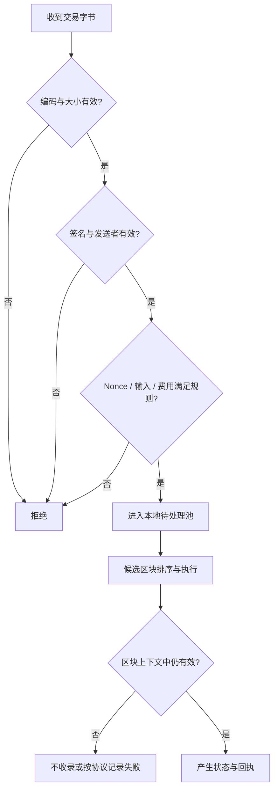
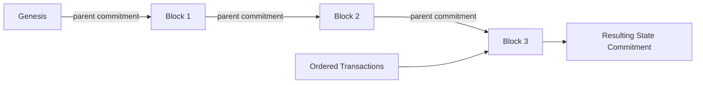
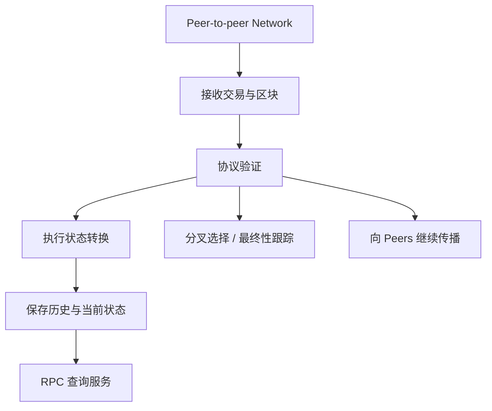
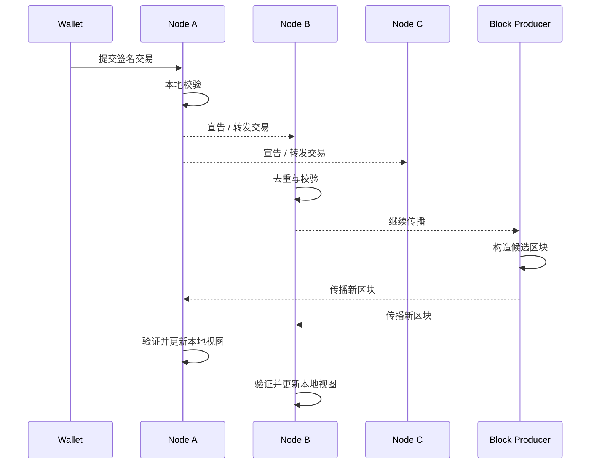
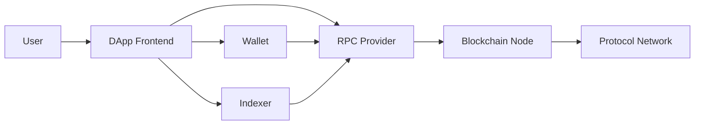
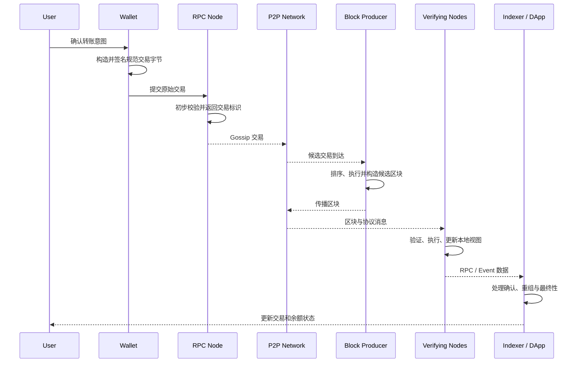

# Web3 分布式账本：从交易、区块和状态到节点信任模型

> 分布式账本不是“把同一张数据库表复制到很多机器”。它要让互不完全信任的节点，在消息延迟、节点离线甚至恶意行为存在时，仍能验证一条共同接受的历史，并从这段历史独立计算当前状态。

---

## 一、本文解决什么问题

第一次接触区块链时，很容易形成一个过度简化的模型：用户发起交易，矿工或验证者把交易打包成区块，所有节点保存区块，所以数据不能篡改。

这个描述遗漏了真正决定系统性质的问题：

- 账本记录的是交易历史，还是账户当前状态？
- 节点收到一个区块后，为什么不能直接相信发送方？
- 网络中同时出现两段合法历史时，节点接受哪一段？
- 全节点、归档节点、轻客户端和 RPC 节点的能力有什么差异？
- “链上可查”是否意味着 DApp 用户已经自行验证？
- 哈希能发现数据变化，为什么仍然需要共识？
- 分布式、去中心化、不可篡改和拜占庭容错是否是同一个概念？

本文建立一个与具体链尽量解耦的基础模型。Ethereum、Bitcoin 以及不同 Layer 2（L2）在状态模型、区块结构、数据可用性和最终性上存在差异；涉及特定协议时，应以目标链在指定区块高度启用的规则为准。

### 核心结论

1. 分布式账本可以理解为“协议约束的有序交易历史 + 可验证的状态转换 + 多节点复制”，而不是普通数据库自动拥有的属性。
2. 交易表达状态转换意图；只有通过协议校验并进入被接受历史的交易，才会影响规范状态。
3. 区块批量组织交易，并通常通过哈希承诺关联内容与前序历史；哈希负责完整性证明，不负责决定冲突历史中的胜者。
4. 节点通过 P2P 网络发现对等节点并交换交易、区块或其他协议消息；Gossip 提高传播覆盖率，但不保证全局顺序、恰好一次送达或最终接受。
5. 全节点验证协议规则；归档节点额外保留历史状态；轻客户端验证精简证明；RPC 节点只是服务角色，不天然代表某种验证强度。
6. 拜占庭故障包括任意错误和恶意行为。哈希、签名、状态转换验证与共识分别解决不同问题，不能相互替代。
7. “使用区块链”不会自动消除信任，只会重构信任：用户仍需信任客户端、验证规则、数据可用性、治理及自己选择的数据入口。
8. DApp 若只调用单一托管 RPC 并接受返回值，本质上仍对该入口建立了较强信任，不能宣称所有读操作都已去信任化。

---

## 二、先定义“账本”

在会计语境中，账本记录资产和负债的变化。在区块链系统中，账本的内容取决于协议模型，但通常可以从两种互补视角理解。

### 2.1 历史视角：按顺序记录已接受的交易

设初始状态为 `S0`，一组有序交易为 `T1...Tn`，协议定义确定性的状态转换函数 `apply`：

```text
S1 = apply(S0, T1)
S2 = apply(S1, T2)
...
Sn = apply(Sn-1, Tn)
```

如果诚实节点从同一初始状态出发，采用相同协议版本，以相同顺序执行相同有效交易，就应得到相同状态。这里至少有四个条件：

- 初始状态一致；
- 交易集合和顺序一致；
- 状态转换规则一致；
- 执行不能依赖未纳入协议的本地随机值、时钟或外部数据。

“确定性执行”并不代表交易一定成功。协议可以把失败结果、费用消耗或回执也定义为确定性结果。

### 2.2 状态视角：当前谁拥有什么、合约存了什么

应用通常关心当前状态，例如余额、NFT 所有者、借贷头寸或 DAO 提案状态。当前状态可以被看作已接受历史的计算结果：

```text
Sn = fold(apply, S0, [T1, T2, ..., Tn])
```

不同链对状态的组织方式不同：

- Bitcoin 主要采用 UTXO（Unspent Transaction Output，未花费交易输出）模型；
- Ethereum 执行层采用账户模型，状态包含账户、代码和合约存储等；
- 某些系统把核心数据放在链下，只在链上提交状态根、证明或结算结果。

因此，“账本就是余额表”和“账本只是一串交易”都不完整。前者忽略了可审计历史，后者忽略了节点为验证与查询维护的派生状态。

### 2.3 分布式账本与分布式数据库

两者都可能复制数据，但设计目标不同：

| 维度 | 典型分布式数据库 | 公有链分布式账本 |
|---|---|---|
| 参与者 | 同一组织或已认证成员 | 开放或弱许可参与者 |
| 写入授权 | 由数据库账户和集群控制 | 由协议、密钥与交易规则约束 |
| 故障假设 | 常重点处理崩溃、分区 | 还要处理任意或恶意行为 |
| 排序方式 | Leader、Quorum、时间戳等 | 共识、分叉选择和最终性规则 |
| 数据修改 | 可更新、删除、修复 | 通常追加历史并以新交易修正状态 |
| 验证主体 | 集群内部节点 | 节点或客户端可按规则独立验证 |
| 性能目标 | 吞吐、延迟、可用性 | 还要权衡开放验证与抗审查等性质 |

许可链可能更接近跨组织分布式数据库。判断一个系统的性质，应检查参与权限、验证规则、故障假设和治理机制，不能只看它是否使用“区块”这个数据结构。

---

## 三、交易：状态转换的输入

交易（Transaction）不是“已经发生的事实”，而是由发送方提交、等待协议处理的状态转换请求。

### 3.1 一笔交易通常包含什么

具体字段因链而异，常见语义包括：

- 发送者或其可验证身份；
- 接收方或目标程序；
- 转移的资产或调用参数；
- 防重放序号，如账户 `nonce` 或被消费的 UTXO；
- 费用参数和资源上限；
- 对交易内容的数字签名；
- 链标识或其他域分离信息。

签名通常证明“持有对应私钥的一方授权了这段确定字节”，但它不证明：

- 发送方理解了钱包展示的业务含义；
- 交易一定会被区块收录；
- 合约调用一定成功；
- 链上资产一定具有宣称的链下价值；
- 签名页面、钱包或设备未被攻击。

### 3.2 交易验证不是单一布尔检查

节点处理交易时，可能经历不同层次的验证：



交易进入某个节点的内存池，不代表全网都已看到，更不代表交易已确认。待处理池通常属于节点本地策略，容量、费用门槛和替换规则可能不同。

### 3.3 顺序为什么重要

状态转换通常不满足交换律。假设 Alice 只有 10 个代币：

```text
T1: Alice -> Bob   8
T2: Alice -> Carol 5
```

先执行 `T1` 与先执行 `T2` 会让不同交易失败或无法被收录。智能合约中的抢跑、清算、套利和 NFT 铸造也依赖交易顺序。

所以，多节点仅就“有哪些交易”达成一致还不够，还必须对被接受历史中的顺序和结果建立共同视图。

---

## 四、区块：批量承诺一段有序历史

区块（Block）把一组有序交易及协议元数据组织成可传播、可验证的单位。不同链的真实区块格式差异很大，但可以使用以下概念模型：

```text
BlockHeader {
  parentCommitment
  transactionsCommitment
  resultingStateCommitment
  consensusMetadata
}

BlockBody {
  orderedTransactions
  otherProtocolData
}
```

这里使用 `commitment` 而非固定写成某种 Merkle Root，是因为不同协议和版本可能采用不同承诺结构。

### 4.1 区块关联了什么

一个区块通常建立三类关系：

1. **与前序历史关联**：区块头引用父区块或前序承诺。
2. **与本区块数据关联**：交易承诺让验证者能够检查区块体是否被替换。
3. **与执行结果关联**：状态承诺让节点比较执行结果，并为状态证明提供基础。



修改旧区块中的交易会改变相关承诺，并使后续引用不再匹配。但这只说明改动可以被检测，并不自动阻止攻击者重新计算一条替代历史。

### 4.2 “哈希链”为什么不等于共识

攻击者完全可以在自己的机器上创建另一串内部哈希一致的区块。节点面对两条结构均有效的历史，仍要回答：

- 谁有资格提出区块？
- 如何衡量或比较候选历史？
- 什么时候一个结果足够稳定或最终确定？
- 违反规则的参与者付出什么代价？

这些是共识、分叉选择与最终性机制处理的问题。哈希提供防篡改检测，共识决定冲突视图如何收敛，两者职责不同。

### 4.3 不可篡改不是绝对不可改变

更严谨的说法是：在给定安全假设下，改写已被广泛接受的历史需要突破密码学假设、控制足够协议权重、利用实现或治理漏洞，或承担显著经济成本。

链可能发生短期重组（Reorganization），协议也可能通过升级改变未来规则，极端情况下社区甚至可能协调采用新的客户端规则。因此“写入一个区块后永远不可逆”不是普适公开契约。

---

## 五、状态：历史执行后的可验证结果

每个执行节点若保存完整输入，理论上可以从创世状态重放全部历史。但生产节点通常还维护数据库、索引和缓存，以便快速验证新区块与响应查询。

### 5.1 状态转换必须由协议定义

用一个极简余额账本表示核心约束：

```typescript
type AccountId = string;

interface Transfer {
  from: AccountId;
  to: AccountId;
  amount: bigint;
  nonce: bigint;
}

interface Account {
  balance: bigint;
  nextNonce: bigint;
}

type LedgerState = ReadonlyMap<AccountId, Readonly<Account>>;

function applyTransfer(
  state: LedgerState,
  transfer: Transfer,
): LedgerState {
  if (transfer.amount <= 0n) throw new Error('invalid amount');

  const sender = state.get(transfer.from);
  const receiver = state.get(transfer.to) ?? {
    balance: 0n,
    nextNonce: 0n,
  };

  if (!sender) throw new Error('unknown sender');
  if (sender.nextNonce !== transfer.nonce) {
    throw new Error('invalid nonce');
  }
  if (sender.balance < transfer.amount) {
    throw new Error('insufficient balance');
  }

  const next = new Map(state);
  next.set(transfer.from, {
    balance: sender.balance - transfer.amount,
    nextNonce: sender.nextNonce + 1n,
  });
  next.set(transfer.to, {
    balance: receiver.balance + transfer.amount,
    nextNonce: receiver.nextNonce,
  });
  return next;
}
```

这段代码展示了三个关键点：

- 输入相同且顺序相同，结果应相同；
- 校验与状态更新是一个原子语义，不能先改余额再发现 `nonce` 错误；
- 返回新状态便于推理，但真实节点会使用高效持久化结构，不会为每笔交易复制整张表。

它**不是区块链实现**：没有规范编码、签名验证、费用、区块、持久化、网络、分叉选择、数据可用性和共识。尤其不能直接把 JSON 字符串哈希当成跨实现一致的交易标识；规范系统必须明确定义字节编码与域分离。

### 5.2 状态根不是状态本身

状态承诺通常是固定长度摘要。它可以让验证者判断“我计算出的状态是否与区块承诺一致”，或配合证明验证某个局部状态，但不能单独恢复全部状态。

因此必须区分：

- **数据完整性**：数据是否匹配承诺；
- **数据可用性**：验证者是否能取得重建和验证所需的数据；
- **状态正确性**：状态是否由有效历史按规则执行得到；
- **历史规范性**：这段历史是否被共识规则选为规范历史。

只公布一个根值，不能自动解决后三个问题。

---

## 六、Node：节点究竟做什么

Node 是参与协议网络的软件实例或运行实体，但“一个节点”并不等于“一台物理服务器”。同一台机器可以运行多个节点，一个节点也可能由多个进程组成。

典型全节点会执行以下职责中的一部分：



不是所有节点都提出区块。以 PoS（Proof of Stake，权益证明）系统为例，验证者职责、执行节点职责和 RPC 服务可以由不同软件或运营组件承担。具体拆分取决于协议。

### 6.1 节点独立验证的意义

假设 Peer 声称：“这是最新区块，Alice 的余额是 100。”全节点不会仅因对方是知名服务商就接受。它应检查：

- 区块编码、大小与父引用；
- 共识相关证明或元数据；
- 每笔交易的格式与授权；
- 状态转换和资源约束；
- 执行结果是否匹配区块承诺；
- 候选历史是否符合分叉选择与最终性规则。

独立验证将“相信对方给出的结论”转化为“相信本地实现的协议规则、密码学假设和已选择的检查点”。这仍然存在信任，只是信任边界发生了变化。

### 6.2 节点实现也可能分歧

不同客户端对协议规范理解不一致，或同一代码库出现确定性 Bug，可能导致链分裂。因此生产网络通常重视：

- 协议规范的精确定义；
- 多客户端实现；
- 交叉客户端测试向量；
- 确定性执行环境；
- 升级激活条件；
- 异常分叉监控。

“客户端多样性”能降低单一实现 Bug 的集中风险，但也增加实现不一致的可能，需要规范、测试和协调机制配套。

---

## 七、P2P 网络与 Gossip：传播不等于共识

Peer-to-peer（P2P，对等网络）描述节点之间直接形成覆盖网络并交换协议消息。它不意味着每个节点与所有其他节点连接，也不保证各节点地位、带宽或影响力完全相等。

### 7.1 一个简化传播过程



Gossip 的核心思想是节点把新信息传播给部分邻居，邻居校验、去重后继续传播，使消息逐步覆盖网络。

### 7.2 Gossip 不提供哪些保证

不能把 Gossip 当成可靠消息队列。它通常不直接保证：

- 所有节点同时收到消息；
- 消息只送达一次；
- 不同节点看到相同到达顺序；
- 一个节点广播的交易一定被生产者收录；
- 网络分区期间所有节点保持相同链头；
- 恶意节点不会延迟、审查或发送冲突消息。

协议需要消息 ID、重复抑制、有效性校验、Peer 评分、带宽限制和同步机制。交易最终是否进入规范历史，由区块生产与共识决定，不由“广播成功”决定。

### 7.3 P2P 仍可能出现中心化压力

公开连接不自动带来均匀拓扑。节点可能依赖少数云厂商、引导节点、RPC 服务、区块构建者或网络中继。评估网络韧性时，应测量运营商分布、客户端分布、地理与自治系统分布，以及关键中间层故障的影响。

---

## 八、四类常见节点角色

“节点类型”经常把存储策略、验证强度和服务接口混在一起。更准确的比较如下。

| 角色 | 主要保存内容 | 能否独立验证链头 | 典型用途 | 主要代价或信任 |
|---|---|---|---|---|
| Full Node | 验证所需历史与近期/当前状态，具体裁剪因实现而异 | 通常可以 | 网络验证、自有 RPC | 同步、存储、带宽和运维成本 |
| Archive Node | 全节点数据加历史状态查询能力 | 通常可以 | 历史状态、分析、调试 | 显著更高的存储和索引成本 |
| Light Client | 区块头、检查点及按需证明 | 在轻客户端安全模型内验证 | 钱包、资源受限设备 | 依赖诚实多数/委员会、数据提供者与证明可用性等具体假设 |
| RPC Node | 对外提供 JSON-RPC 等查询接口 | 不确定，取决于后端 | DApp、钱包、后端服务 | 调用方往往信任其返回值、可用性与隐私处理 |

### 8.1 Full Node 不等于 Archive Node

全节点的核心是验证当前规范链，而不是永久保留任意历史高度的完整状态。为控制磁盘，全节点可能裁剪旧状态或历史数据，只保留继续验证所需内容。

归档节点在此基础上保存或构建历史状态，使应用可以查询“某个旧区块高度时这个账户或存储槽是什么”。归档能力属于数据保留和查询能力，不代表共识投票权更高。

### 8.2 Light Client 不是“少下载一点的全节点”

轻客户端不执行或保存全量数据，而是验证区块头、共识证明、同步委员会证明或状态证明等精简信息。它的安全性依赖具体协议：

- 检查点从哪里获得；
- 谁提供数据和证明；
- 证明能否验证目标状态；
- 数据提供者能否通过不响应实施可用性攻击；
- 长程攻击或弱主观性如何处理。

所以不能脱离链与实现笼统声称“轻客户端和全节点一样无需信任”。

### 8.3 RPC Node 是接口角色

一个 RPC 服务背后可能是全节点、归档节点、负载均衡集群、缓存、索引数据库，甚至第三方聚合结果。RPC 回答“调用方如何访问数据”，不回答“后端如何验证数据”。

DApp 调用 `eth_call`、读取余额或监听日志时，如果不验证响应证明，就在信任 RPC：

- 没有返回错误链或旧数据；
- 没有选择性隐藏交易；
- 能正确处理重组；
- 不会记录并滥用 IP、地址和查询关联；
- 在高峰和故障期间保持可用。

---

## 九、拜占庭故障：节点可能以任意方式失败

Crash Fault 只考虑节点停止、重启或无法响应。Byzantine Fault（拜占庭故障）还包括节点发送任意、矛盾或恶意消息，例如：

- 向不同 Peer 发送不同区块；
- 提交无效交易或状态承诺；
- 重放旧消息；
- 延迟传播以获取排序优势；
- 伪造身份发起 Sybil Attack；
- 验证者双签或违反投票规则；
- RPC 对不同用户返回不同结果。

### 9.1 不同机制解决不同故障

| 机制 | 主要作用 | 不能单独解决 |
|---|---|---|
| Hash / Commitment | 检测内容变化、承诺大规模数据 | 冲突历史选择、发送者授权 |
| Digital Signature | 验证授权者及消息完整性 | 签名者是否诚实、消息是否应被接受 |
| State Validation | 验证交易和执行结果符合规则 | 多条有效历史谁是规范历史 |
| Consensus | 在故障假设内对历史排序与最终性收敛 | 客户端 Bug、私钥被盗、错误业务逻辑 |
| Economic Incentive | 提高某些攻击成本、鼓励参与 | 所有攻击动机与链下胁迫 |
| Peer Diversity | 降低单点网络视图风险 | 协议层多数权重被控制 |

安全来自这些机制的组合，并受阈值、同步假设和实现正确性限制。

### 9.2 安全性与活性

分布式协议常区分两类目标：

- **Safety（安全性）**：不接受两个相互冲突的最终结果；
- **Liveness（活性）**：有效输入最终能够推进并产生新结果。

网络严重分区时，协议可能选择暂停最终确认以保护安全性，也可能继续推进但允许暂时分叉。不存在脱离网络与故障假设、同时无条件保证所有性质的协议。

拜占庭容错阈值、网络同步模型和最终性条件属于具体共识协议内容，不能从“使用 PoS”或“有很多节点”直接推导。

---

## 十、Trust Assumption：系统到底信任什么

“Trustless”更适合作为方向，而不是绝对属性。任何可运行系统都建立在一组信任和假设上。

### 10.1 协议层信任

可能包括：

- 密码学原语在目标时间范围内安全；
- 控制共识权重的恶意参与者不超过协议阈值；
- 网络最终能在要求的时限内传递必要消息；
- 验证者能获得执行和数据可用性所需数据；
- 客户端正确实现同一套协议规则；
- 用户获得可信的初始软件、创世配置或检查点。

### 10.2 应用层信任

即使底层链正常，用户仍可能依赖：

- 智能合约没有漏洞，代理指向预期实现；
- 管理员、多签或治理权限不会滥用；
- Oracle 提供正确、及时且抗操纵的数据；
- 跨链桥的验证者或证明系统可靠；
- 前端域名、CDN 和钱包没有替换交易参数；
- Token、NFT 或现实资产的链下承诺可兑现。

### 10.3 接入层信任



用户可能没有直接验证链，而是同时信任前端、钱包、RPC 和索引器。工程设计应明确每一条读取和写入路径：

- 写交易前，钱包是否展示目标链、合约、方法、金额和授权范围？
- 读数据来自 RPC、Indexer 还是本地验证？
- 多个来源冲突时以谁为准？
- 数据需要达到 `latest`、`safe` 还是 `finalized` 语义？
- RPC 不可用时，是切换提供商、降级为只读，还是阻止高风险操作？

透明描述信任假设比笼统宣传“去中心化”更有工程价值。

---

## 十一、一个完整的数据流：转账如何成为账本状态

下面把用户发起转账到应用观察状态的路径串起来：



关键边界如下：

1. RPC 返回交易哈希，只表示它接受了提交，不表示已上链。
2. 区块收录是状态推进的重要阶段，但是否稳定取决于链的重组与最终性语义。
3. DApp 不能只把交易状态设计为“加载中 / 成功 / 失败”，至少还要处理待签名、已广播、待收录、已收录、已确认、被替换、被丢弃和重组回退。
4. Indexer 的数据存在同步延迟。链上 RPC、交易回执和索引结果短暂不一致是正常工程场景。
5. 用户最终看到的余额可能来自缓存或 Indexer，并不必然是其钱包独立验证后的链状态。

---

## 十二、常见误区与错误案例

### 12.1 误区：节点越多，系统一定越去中心化

节点数量只是一个指标。如果大量节点由同一实体控制、运行同一客户端、部署在同一云区域或依赖同一 RPC 上游，故障仍高度相关。

应同时评估共识权重、运营实体、客户端、网络、托管商、治理权限和关键基础设施分布。

### 12.2 误区：数据有哈希，所以数据一定真实

哈希只能证明拿到的数据与某个承诺匹配，不能证明输入事实真实。例如 Oracle 把错误价格写入链，链可以忠实、不可抵赖地保存这个错误。

需要分别验证数据来源、授权者、承诺所属的规范区块，以及区块的最终性。

### 12.3 误区：查到交易哈希就是支付成功

交易可能仍在待处理池、执行失败、被替换，或所在区块发生重组。支付系统需要按目标链定义确认策略，并校验接收地址、资产合约、金额、执行状态和最终性，而不是只检查哈希存在。

### 12.4 误区：运行全节点即可查询任意历史状态

普通全节点可能裁剪历史状态。需要任意高度状态查询时，应使用具备目标数据范围的归档节点或专门索引系统，并验证其同步高度和重组处理策略。

### 12.5 错误案例：DApp 将单一 RPC 当作唯一事实源

```typescript
// 错误：一次 RPC 结果直接触发不可逆发货。
const receipt = await provider.getTransactionReceipt(transactionHash);
if (receipt) {
  await shipOrder(orderId);
}
```

问题包括：回执可能代表失败执行，区块可能尚未达到业务要求的稳定程度，RPC 可能滞后或返回错误网络的数据，订单内容也未与链上转账绑定。

更合理的处理是：

```typescript
interface PaymentObservation {
  chainId: bigint;
  transactionHash: string;
  blockNumber: bigint;
  succeeded: boolean;
  recipient: string;
  asset: string;
  amount: bigint;
  finality: 'included' | 'safe' | 'finalized';
}

function canFulfill(
  payment: PaymentObservation,
  expected: Omit<PaymentObservation, 'blockNumber' | 'succeeded' | 'finality'>,
): boolean {
  return payment.succeeded
    && payment.finality === 'finalized'
    && payment.chainId === expected.chainId
    && payment.transactionHash === expected.transactionHash
    && payment.recipient === expected.recipient
    && payment.asset === expected.asset
    && payment.amount >= expected.amount;
}
```

示例中的 `finalized` 是抽象业务字段。不同链、RPC 标签和结算系统对最终性的定义不同，不能复制这段判断就宣称支付安全。高价值业务还应使用独立观察节点、幂等履约和人工止损机制。

---

## 十三、工程实践：如何选择节点与数据入口

### 13.1 按风险选择验证强度

| 场景 | 可考虑的入口 | 必须补充的治理 |
|---|---|---|
| 展示公开行情 | 托管 RPC + Indexer | 缓存、同步高度、降级提示 |
| 钱包余额展示 | 多 RPC 或轻客户端 | Chain ID、区块标签、隐私保护 |
| 交易广播 | 多地域 RPC | 重复广播幂等、Nonce 与替换跟踪 |
| 高价值支付确认 | 自有验证节点 + 独立数据源 | 最终性、重组、金额和合约校验 |
| 历史分析 | Archive Node + Indexer | 数据范围、回填、重组重算 |
| 协议风控 | 多客户端节点与监控 | 分叉检测、链停顿和异常状态根告警 |

方案选择要同时考虑价值风险、延迟要求、查询复杂度、隐私、节点成本和团队运维能力。

### 13.2 RPC 容灾不能只做轮询切换

多个 RPC 可能共同依赖同一上游。容灾设计至少记录：

- 提供商、地域和实际后端是否独立；
- 当前链 ID、客户端版本和同步状态；
- 最新、Safe 与 Finalized 高度差；
- 错误率、延迟和限流响应；
- 同一关键查询在多源之间是否一致；
- 切换期间是否会发生读旧、Nonce 冲突或重复广播。

对于读请求，可以做带高度语义的 Quorum 或交叉验证；对于写请求，必须考虑同一签名交易重复广播通常是可接受的，但重新签名可能改变 Nonce、费用或交易标识。

### 13.3 观测账本同步而不只观测 HTTP 200

一个 RPC 健康检查返回 200，不代表节点可以提供正确的新鲜数据。应监控：

- Peer 数量与网络连接状态；
- 本地链头与参考链头的高度、哈希差异；
- Safe / Finalized 进度；
- 区块导入和执行延迟；
- 重组深度与频率；
- 数据库、磁盘、内存和带宽；
- RPC 各方法延迟、错误、限流和响应大小；
- Indexer 已处理高度及其对应区块哈希。

跨来源比较时必须比较同一高度的区块哈希，而不是只比较高度数字。两个节点都在高度 `N`，仍可能位于不同分支。

---

## 十四、如何验证本文模型

不应只靠阅读概念建立信心。可以在目标链的测试环境执行以下实验。

### 14.1 对比 RPC 与本地验证节点

1. 固定链、客户端版本和验证日期。
2. 记录多个 RPC 的 Chain ID、最新高度与区块哈希。
3. 提交一笔可识别的测试交易，记录各节点首次看到交易和回执的时间。
4. 比较 `latest`、`safe`、`finalized` 等标签；目标链不支持时明确记录。
5. 暂停一个本地节点网络，再恢复同步，观察其如何寻找并验证缺失区块。
6. 检查索引器在区块收录后多久可查询，并验证重组后的回滚行为。

### 14.2 验证状态转换的确定性

为最小账本代码编写测试：

```typescript
import { strict as assert } from 'node:assert';

const genesis = new Map([
  ['alice', { balance: 10n, nextNonce: 0n }],
]);

const transfer = {
  from: 'alice',
  to: 'bob',
  amount: 4n,
  nonce: 0n,
};

const first = applyTransfer(genesis, transfer);
const second = applyTransfer(genesis, transfer);

assert.deepEqual([...first], [...second]);
assert.equal(first.get('alice')?.balance, 6n);
assert.equal(first.get('bob')?.balance, 4n);
assert.throws(() => applyTransfer(first, transfer), /invalid nonce/);
```

还应覆盖金额为零或负数、余额不足、未知发送者、接收者与发送者相同、整数边界和不同交易顺序。真实协议测试还需要规范测试向量、跨客户端一致性测试和模糊测试。

### 14.3 记录实验边界

Web3 系统会升级，RPC 也可能改变后端。实验报告至少记录：

- 链与 Network ID / Chain ID；
- 区块高度和区块哈希；
- 节点客户端及版本；
- RPC 提供商与接口版本；
- 测试时间和网络条件；
- 最终性或确认判定标准。

缺少这些信息的“实测 TPS”“几秒最终确认”或“某节点一定保存全部历史”都难以复现。

---

## 十五、总结

真正需要记住的不是节点类型名词，而是分布式账本的验证链条：

1. 用户用交易表达状态转换意图，并通过密码学授权。
2. 网络传播交易，但传播不承诺收录、顺序和最终性。
3. 区块批量组织有序交易，并承诺前序历史、数据或执行结果。
4. 节点按协议独立验证交易、区块和状态转换，而不是信任 Peer 的结论。
5. 共识在明确的故障与网络假设下选择规范历史并推进最终性。
6. 全节点、归档节点、轻客户端和 RPC 节点提供不同验证、存储与服务能力。
7. DApp 的实际信任边界还包含前端、钱包、RPC、Indexer、合约权限和链下数据源。

“去中心化”不是一个开关。工程师应具体说明谁能写、谁在验证、数据如何获得、冲突如何解决、结果何时稳定，以及每一层仍然信任什么。

---

## 问答复盘

### Q1：分布式账本是否就是多台机器保存同一份数据库？

**答：** 不是。复制只是基础能力；分布式账本还要定义写入授权、确定性状态转换、冲突历史选择、独立验证以及对崩溃和恶意节点的故障假设。

### Q2：交易广播成功后，为什么余额不能立即视为已更新？

**答：** 广播只说明某个入口接收了交易。交易还可能未收录、被替换、执行失败或随区块重组回退，业务必须按目标链的收录与最终性语义推进状态。

### Q3：区块之间通过哈希关联，为什么还需要共识？

**答：** 哈希能检测内容变化，但任何人都能生成一条内部哈希一致的替代链。共识和分叉选择负责在多条候选历史中确定规范视图。

### Q4：全节点与归档节点最容易混淆的边界是什么？

**答：** 全节点强调独立验证当前规范链，归档节点强调保留历史状态查询能力。归档节点存储更多，但不会因此获得更强的协议权力。

### Q5：RPC 节点是否一定是全节点？

**答：** 不一定。RPC 是服务接口角色，后端可能是全节点、归档节点、缓存或索引集群。调用方若不验证证明，就需要信任该服务返回的链、区块和状态数据。

### Q6：轻客户端是否与全节点具有完全相同的安全性？

**答：** 不能笼统判断。轻客户端依赖目标协议的区块头、检查点、委员会或状态证明模型，还可能依赖数据提供者的可用性；必须结合具体链和实现分析。

### Q7：拜占庭故障与普通宕机有什么区别？

**答：** 宕机是停止响应，拜占庭节点可以任意行动，包括向不同节点发送冲突消息、伪造结果或故意延迟传播。协议必须在明确的恶意权重和网络假设下讨论安全性。

### Q8：电商收到链上支付后，何时可以发货？

**答：** 不能只凭交易哈希或一次回执。系统应校验链、资产合约、接收方、金额和执行结果，等待符合业务风险的最终性，并通过独立数据源、幂等履约和异常止损处理 RPC 错误及重组。

---

## 延伸知识

- **密码学基础**：哈希、Merkle Proof、数字签名和密钥管理如何提供可验证性。
- **交易与最终性**：Mempool、Nonce、替换交易、区块确认与重组的完整状态机。
- **共识机制**：PoW、PoS、Fork Choice、Safety、Liveness 与经济最终性。
- **Ethereum 状态模型**：EOA、合约账户、World State、Storage 与各类 Root。
- **Indexer 与链下数据一致性**：事件日志、回填、重组回滚和链上事实源边界。
- **Layer 2 与数据可用性**：执行、排序、证明和结算如何拆分，信任假设如何改变。
