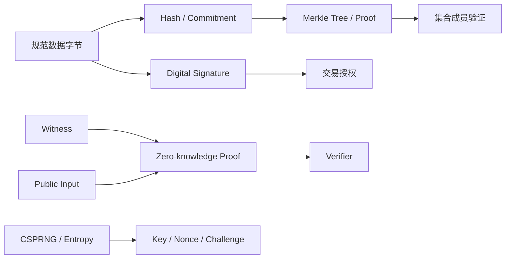
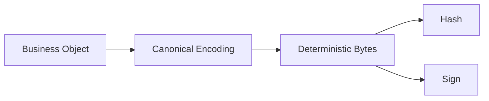
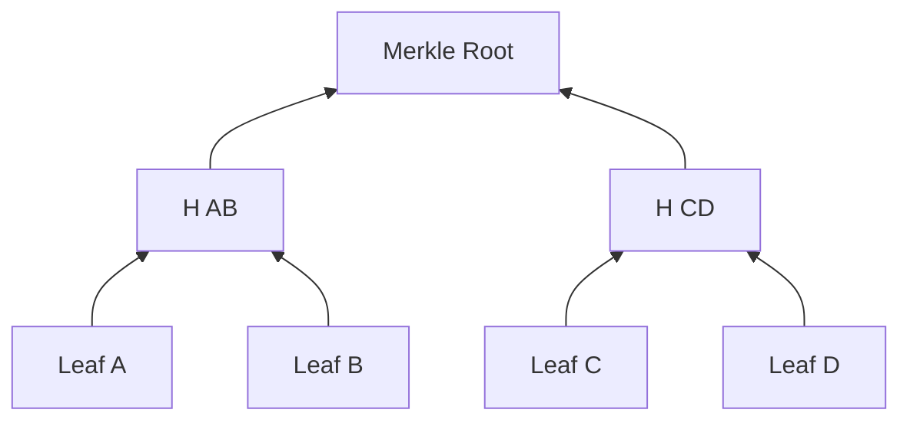
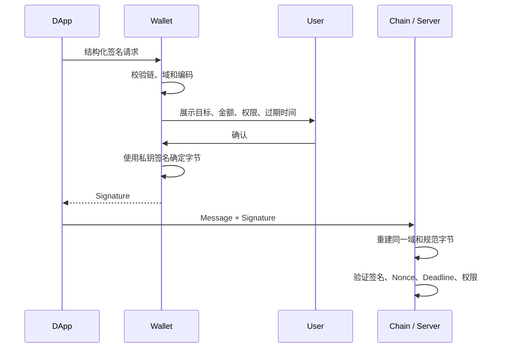
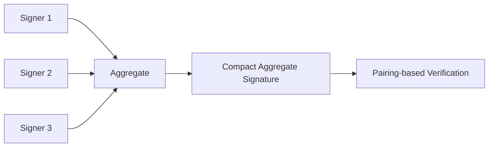
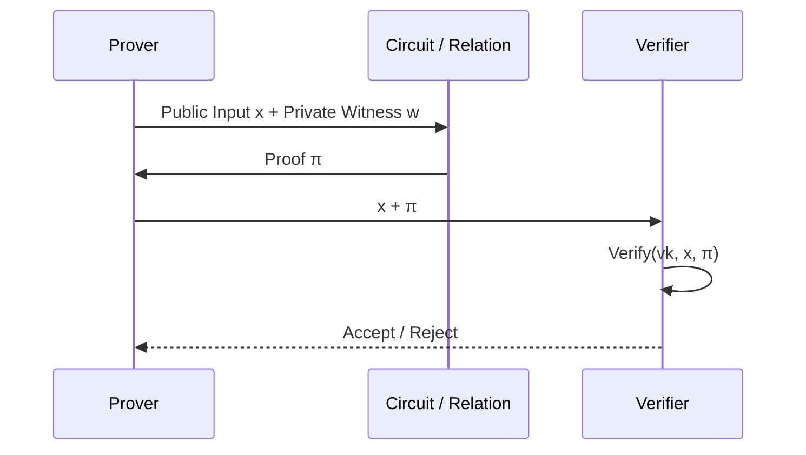
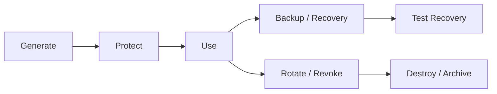

# Web3 密码学基础：从哈希、Merkle Proof 到数字签名与零知识证明

> 密码学不是给数据加一层“不可破解”的外壳。哈希、签名、Merkle Proof、门限协议与零知识证明具有不同安全目标；只有把算法、编码、密钥、上下文和验证流程连成完整协议，才能得到可讨论的安全结论。

---

## 一、本文解决什么问题

在 Web3 应用中，我们经常看到这些说法：

- “哈希不可逆，所以数据不可篡改”；
- “地址由公钥生成，所以知道地址就能验证所有权”；
- “签名由私钥产生，所以签过的业务一定可信”；
- “Merkle Proof 很短，因此区块数据一定可用”；
- “BLS 可以聚合，所以把所有签名拼起来就行”；
- “零知识证明不会泄露任何信息”；
- “用时间戳生成随机数，链上没人能预测”。

这些说法把特定安全性质扩大成了万能保证。本文回答四个层次的问题：

1. 每种密码学原语究竟保证什么，不保证什么？
2. Web3 协议如何把这些原语组合成交易授权、数据承诺和证明？
3. 编码、域分离、随机数、密钥生命周期为什么经常比算法名称更容易出错？
4. DApp、钱包和合约工程师如何验证实现，而不是自行发明密码学？

文中的算法性质是一般性原理。具体链使用的曲线、哈希、编码、签名规范和预编译合约可能随协议及升级变化；实现前必须固定链、协议版本、标准文档、库版本和测试向量。

### 核心结论

1. 密码学安全是“在明确攻击模型和计算假设下，攻击成功概率足够低”，不是数学意义上的绝对不可能。
2. 哈希函数提供固定长度摘要，核心性质包括原像抗性、第二原像抗性和碰撞抗性；三者不是“加密”，也不提供数据真实性。
3. Merkle Tree 把一组有序数据承诺为一个根，Merkle Proof 证明某个叶子属于该承诺；它不证明承诺所在区块是规范链，也不保证全部数据可用。
4. 数字签名验证“给定公钥对应私钥对给定消息的授权”，前提是消息编码、域、密钥和验证规则正确；签名不证明现实身份或业务事实真实。
5. ECDSA、EdDSA 和 BLS 不是可随意替换的签名格式，它们依赖不同曲线、哈希到曲线、编码和安全假设，链上兼容性必须按协议验证。
6. 门限签名让多方协作产生一个签名，链上多签让合约验证多个独立签名；二者的故障恢复、可审计性和信任边界不同。
7. 零知识证明同时讨论完备性、可靠性和零知识性，不等于“隐藏所有元数据”，也不能证明电路外的输入事实正确。
8. 私钥、Nonce、Seed、Salt 与 Challenge 对随机性的要求不同。安全随机数必须来自 CSPRNG（Cryptographically Secure Pseudorandom Number Generator，密码学安全伪随机数生成器），不能使用时间戳或普通 PRNG。

---

## 二、先建立密码学能力地图

Web3 的验证链可以简化为：



每种原语回答的问题不同：

| 原语 | 主要回答 | 不直接回答 |
|---|---|---|
| Hash | 数据是否对应同一摘要 | 数据来自谁、是否真实 |
| MAC | 持有共享密钥者是否认证消息 | 面向第三方的公开验证 |
| Digital Signature | 私钥持有者是否授权确定消息 | 签名者现实身份、业务是否合理 |
| Merkle Proof | 叶子是否属于根所承诺的集合/序列 | 根是否来自规范链、数据是否可用 |
| Threshold Signature | 是否达到分布式签名门限 | 各参与者在链上的独立可见授权 |
| Zero-knowledge Proof | 某关系存在有效见证，且按协议控制泄露 | 见证对应的链下事实一定真实 |
| Encryption | 无密钥者难以读取明文 | 数据完整性和发送者身份，除非使用认证加密 |

> Web3 常用哈希和签名，但链上数据通常是公开的。签名不是加密，哈希也不是隐私机制。

---

## 三、Hash Function：把任意输入映射为固定长度摘要

密码学哈希函数 `H` 接收字节串并输出固定长度摘要：

```text
digest = H(messageBytes)
```

输入变化通常会让输出发生不可预测的大幅变化，但“雪崩效应”只是直观现象，不足以完整定义安全性。

### 3.1 三个容易混淆的安全性质

假设输出长度为 `n` 位：

1. **Preimage Resistance（原像抗性）**：给定摘要 `y`，难以找到 `x` 使 `H(x) = y`。理想情况下泛型攻击约需 `2^n` 量级尝试。
2. **Second-preimage Resistance（第二原像抗性）**：给定 `x`，难以找到不同的 `x'` 使两者哈希相同。
3. **Collision Resistance（碰撞抗性）**：难以找到任意两个不同输入 `x`、`x'` 具有相同摘要。受生日界影响，理想 `n` 位哈希的泛型碰撞攻击约为 `2^(n/2)` 量级。

这里的数量级用于解释安全参数，不是对真实硬件耗时的性能承诺。具体算法还可能受到结构性密码分析影响。

### 3.2 哈希不是加密

加密需要密钥并允许授权方恢复明文；哈希没有解密操作。所谓“不可逆”也不能保护低熵输入：

```text
H("000000")
```

攻击者可以枚举所有六位 PIN 并建立映射。密码存储应使用带 Salt、成本可配置且抗并行的密码哈希/KDF（Key Derivation Function），不能直接使用通用快速哈希。

### 3.3 输入是字节，不是对象

以下业务对象没有天然唯一字节表示：

```json
{"to":"0xabc","amount":"10"}
```

字段顺序、空格、Unicode 规范化、数字格式、大小写和缺省字段都可能产生不同字节。协议必须定义 Canonical Encoding（规范编码），例如固定字段顺序、整数宽度、字节序和字符串编码。



如果签名端和验证端编码规则不同，即便算法完全正确，也会验证失败；更糟的是，不明确的编码可能产生字段拼接歧义。

### 3.4 域分离：同一字节不能在不同语义中复用

假设系统对登录 Challenge 和转账指令都直接签名原始文本，相同字节可能被跨场景重放。Domain Separation（域分离）把应用、链、版本和消息类型纳入待哈希/签名字节：

```text
digest = H(
  protocolDomain ||
  chainId ||
  contractAddress ||
  messageType ||
  canonicalPayload
)
```

实际协议应使用标准定义的结构化编码，不能直接用无长度前缀的字符串拼接。Ethereum 的交易签名和结构化数据签名有各自域规则，具体以适用的 EIP 和钱包实现为准。

### 3.5 使用标准 API，而不是手写算法

浏览器中可以通过 Web Crypto 计算 SHA-256：

```typescript
const encoder = new TextEncoder();

async function sha256(message: string): Promise<string> {
  const bytes = encoder.encode(message);
  const digest = await crypto.subtle.digest('SHA-256', bytes);
  return [...new Uint8Array(digest)]
    .map((byte) => byte.toString(16).padStart(2, '0'))
    .join('');
}
```

这段代码只适合演示标准哈希 API。需要注意：

- SHA-256 与 Ethereum 常见的 Keccak-256 不是同一算法；
- JavaScript 的 `SHA3-256` 命名也不能被假设等同于 Keccak-256；
- 字符串哈希前使用了 UTF-8，但链上结构通常需要 ABI 或协议规定的字节编码；
- 大文件应考虑流式哈希，Web Crypto 的 `digest` 接口需要完整输入缓冲区；
- 不要把摘要与密码、私钥或认证 Token 一起记录到日志。

---

## 四、Merkle Tree：用一个根承诺一组数据

Merkle Tree 将叶子哈希逐层组合，最终得到 Merkle Root。一个二叉概念模型如下：



真实协议可能使用二叉树、多叉 Trie、稀疏树、Verkle Tree 或其他承诺结构。不能把“状态根”默认理解为上述简单二叉 Merkle Tree。

### 4.1 为什么叶子和内部节点要区分

一种常见防歧义设计是加前缀：

```text
leafHash = H(0x00 || encodedLeaf)
nodeHash = H(0x01 || leftHash || rightHash)
```

这让叶子数据和内部节点使用不同域。左右位置也属于证明语义；若随意排序兄弟哈希，会改变树定义。

### 4.2 Merkle Proof 包含什么

证明某个叶子属于根，通常无需提供全部叶子，只需提供从叶子到根路径上的兄弟哈希及其方向：

```typescript
interface ProofStep {
  sibling: Uint8Array;
  siblingOnLeft: boolean;
}

type HashPair = (
  domain: number,
  left: Uint8Array,
  right: Uint8Array,
) => Promise<Uint8Array>;

async function verifyMerkleProof(
  leafHash: Uint8Array,
  proof: readonly ProofStep[],
  expectedRoot: Uint8Array,
  hashPair: HashPair,
): Promise<boolean> {
  let current = leafHash;

  for (const step of proof) {
    current = step.siblingOnLeft
      ? await hashPair(0x01, step.sibling, current)
      : await hashPair(0x01, current, step.sibling);
  }

  return constantTimeEqual(current, expectedRoot);
}

function constantTimeEqual(a: Uint8Array, b: Uint8Array): boolean {
  if (a.length !== b.length) return false;
  let difference = 0;
  for (let index = 0; index < a.length; index += 1) {
    difference |= a[index] ^ b[index];
  }
  return difference === 0;
}
```

这是结构示例，不是某条链的 Proof 验证器。生产实现必须使用协议规定的：

- 哈希或承诺算法；
- 叶子规范编码与域分离；
- 奇数叶子处理规则；
- 路径索引、树高和键编码；
- 根来源及其最终性验证；
- Proof 大小、深度和输入资源限制。

### 4.3 Proof 证明了什么

验证成功只能说明：按指定树规则计算，给定叶子与路径得到 `expectedRoot`。还需要继续验证：

1. 根是否来自目标链、目标区块和正确字段；
2. 区块头是否属于客户端接受的规范历史；
3. 区块是否达到业务需要的最终性；
4. 叶子编码是否表达了用户想验证的业务对象。

Merkle Inclusion Proof 通常证明“存在”。证明“不存在”需要树结构支持缺失路径或相邻性证明，不能把找不到 Inclusion Proof 当成密码学意义上的不存在证明。

### 4.4 Proof 不等于数据可用性

一个根可以承诺大量数据，但如果生产者拒绝提供数据，其他节点可能无法重建状态或验证执行。Data Availability（数据可用性）需要额外的传播、采样、纠删码或委员会等机制，不能由短 Proof 自动推出。

---

## 五、公钥、私钥与地址

非对称密码系统通常从私钥推导公钥：

```text
privateKey --one-way derivation--> publicKey --encoding/hash--> address
```

私钥是控制权根，公钥用于验证签名，地址通常是协议定义的公钥或脚本标识。不同链的地址编码、校验和与派生方式不同。

### 5.1 私钥不是“账户密码”

密码泄露后，中心化服务可以验证身份并重置密码；私钥泄露后，攻击者通常可以直接产生有效签名，链本身无法区分合法持有者与窃取者。

密钥工程至少包括：

- 使用 CSPRNG 生成足够熵；
- 在受保护硬件或密钥库中存储；
- 备份和恢复机制；
- 签名前可信展示实际消息；
- 权限分层、限额与会话密钥；
- 轮换、撤销或账户恢复路径；
- 防止日志、剪贴板、Crash 和分析 SDK 泄露。

### 5.2 助记词、Seed 与派生路径

助记词通常编码用于生成 Seed 的熵或输入，再由分层确定性钱包派生大量子密钥。标准、Checksum、口令和派生路径必须匹配；同一助记词在不同路径下可产生完全不同地址。

不要在普通网页、聊天工具或自制“离线脚本”中输入生产助记词。测试必须使用明确无价值的测试 Seed，并与生产环境物理或逻辑隔离。

### 5.3 地址不证明现实身份

地址只能作为协议内标识。把地址绑定到某个人、机构或域名，需要额外身份声明、签名挑战、注册表或链下核验。即使绑定成功，密钥也可能轮换或被盗。

---

## 六、数字签名：授权确定消息

数字签名通常包含三个算法：

```text
(sk, pk) = KeyGen()
signature = Sign(sk, message)
valid = Verify(pk, message, signature)
```

目标是没有私钥的攻击者难以伪造有效签名。验证成功意味着签名与公钥、消息满足算法关系，不代表签名者做出了正确业务决策。

### 6.1 完整签名流程



签名验证只是最后一组检查中的一个。防重放还需要 Nonce、Deadline、Chain ID、合约地址和用途域等业务字段。

### 6.2 签名不天然提供不可否认性

工程语境常说签名提供 Non-repudiation（不可否认性），但现实归责还取决于私钥是否独占、设备是否被攻破、授权 UI 是否可信、法律和审计证据是否完整。密码学只证明密钥与消息的关系，不能单独证明自然人的主观行为。

### 6.3 不要混用签名编码

签名可能有固定宽度、DER、恢复标识或协议自定义编码。验证端必须检查：

- 长度与字段范围；
- 曲线点是否合法且属于正确子群；
- 签名是否存在多种等价表示；
- 公钥恢复规则；
- Canonical / Low-s 等协议约束；
- 错误输入是否被安全拒绝。

这些规则应由经过审计的库和链标准实现，而不是 DApp 自行解析字节。

---

## 七、ECDSA：Nonce 失误会暴露私钥

ECDSA（Elliptic Curve Digital Signature Algorithm，椭圆曲线数字签名算法）广泛用于区块链，但“ECDSA”只指定算法族，不能省略曲线、哈希和编码参数。

### 7.1 签名中的一次性 Nonce

ECDSA 每次签名需要秘密标量 `k`。如果不同消息复用相同 `k`，攻击者可以利用两个签名恢复私钥；如果 `k` 有偏差或熵不足，也可能泄露密钥信息。

因此工程上应：

- 使用成熟库实现确定性 Nonce 或可靠 CSPRNG；
- 不允许调用方直接传入 `k`；
- 防范侧信道和故障注入；
- 使用官方测试向量和异常输入测试；
- 审核平台硬件密钥接口支持的曲线与编码。

确定性 Nonce 减少随机数生成失败风险，但不消除私钥泄露、侧信道、错误消息编码或实现 Bug。

### 7.2 ECDSA 可恢复签名的边界

某些区块链协议可从消息摘要、签名和恢复参数推导候选公钥，从而减少交易中携带公钥的需要。这是特定曲线与编码规则的能力，不能假设所有 ECDSA API 都提供相同恢复语义。

浏览器 Web Crypto 支持的 ECDSA 曲线集合与 Ethereum 常用曲线并不相同。因此不能用 `P-256` 示例去验证要求其他曲线的链上签名。

---

## 八、EdDSA：确定性签名不等于自动安全

EdDSA（Edwards-curve Digital Signature Algorithm）使用 Edwards 曲线家族，常见实例包括 Ed25519。其设计通常提供确定性签名和较简单的高性能实现路径。

### 8.1 与 ECDSA 的主要差异

| 维度 | ECDSA | EdDSA（以具体实例为准） |
|---|---|---|
| 曲线形式 | 常基于 Weierstrass 曲线 | 基于 Edwards 曲线 |
| Nonce | 随机或按标准确定性生成 | 通常从密钥材料与消息确定性派生 |
| 签名编码 | 协议差异较多 | 实例通常定义固定格式 |
| 公钥恢复 | 某些协议支持 | 通常不是同一用法 |
| 兼容性 | 多条链和传统系统采用 | 部分链、身份和现代协议采用 |

不能只因为 EdDSA 是确定性的，就认为它不会泄露密钥。错误的密钥扩展、Fault Attack、侧信道、Nonce 派生实现错误和跨协议复用仍然可能破坏安全性。

### 8.2 Ed25519 与 EdDSA 不是完全同义词

EdDSA 是算法族，Ed25519 是具体参数实例。预哈希版本、上下文版本和纯消息版本的签名语义也不同。验证端必须使用发送端相同的模式，不能靠“都是 Ed25519”模糊处理。

---

## 九、BLS Signature：聚合能力来自不同数学结构

BLS 签名通常基于支持 Pairing（双线性配对）的曲线。其突出能力是多个签名或公钥可以按协议聚合，从而降低某些共识消息的存储和验证负担。

### 9.1 聚合不等于简单拼接

概念上，多方对消息签名后可产生聚合签名：



但协议必须区分：

- 多人签同一消息；
- 多人签不同消息；
- 公钥是否经过 Proof of Possession；
- 是否防御 Rogue-key Attack；
- Hash-to-curve 和 Domain Separation 如何定义；
- 曲线点与子群检查是否完整。

### 9.2 BLS 的代价

- Pairing 验证通常比某些传统椭圆曲线操作复杂；
- 实现需要严格的序列化、子群检查和 Hash-to-curve 标准；
- 聚合会让单个参与者归责和故障定位更复杂；
- 不同 BLS 曲线、签名在 G1/G2 的选择和标准套件不互通。

是否采用 BLS 取决于协议对聚合、带宽、验证成本和生态支持的权衡，不能仅凭“签名更短”做选择。

---

## 十、Threshold Signature：一把逻辑密钥由多方共同控制

Threshold Signature（门限签名）让 `n` 个参与者中的至少 `t` 个协作产生一个对外可验证的签名，私钥通常不会在单台机器上完整出现。

### 10.1 门限签名与链上多签

| 维度 | Threshold Signature | Smart-contract Multisig |
|---|---|---|
| 链上外观 | 通常像一个普通公钥签名 | 合约验证多个签名或批准 |
| 成本 | 链上数据可能较小 | 取决于签名数量和合约逻辑 |
| 参与者可见性 | 链上未必能识别每个参与者 | 通常可审计签名者/Owner |
| 协议复杂度 | 需要交互式 MPC/DKG、份额保护 | 合约和钱包流程更直观 |
| 成员变更 | 可能需要重新共享或刷新 | 可由合约规则更新 |
| 故障恢复 | 依赖门限协议和备份 | 依赖合约阈值和 Owner 管理 |

MPC（Multi-party Computation，多方安全计算）是更广泛的计算框架，门限签名是其常见应用之一；二者不能简单画等号。

### 10.2 DKG 与密钥份额

生产门限系统可能通过 DKG（Distributed Key Generation，分布式密钥生成）建立共享公钥和私钥份额。工程风险包括：

- 恶意参与者在生成阶段发送不一致份额；
- 签名会话被中断或拒绝服务；
- Nonce 预处理材料复用；
- 份额备份导致门限假设失效；
- 成员设备共用同一云账户或管理员，形成相关故障；
- 协议 Transcript、会话 ID 和消息未做域分离。

门限是数学阈值，不等于组织独立性。`2-of-3` 设备若都由同一凭证控制，实际安全边界仍可能只有一个。

---

## 十一、Zero-knowledge Proof：证明关系而不公开见证

零知识证明通常让 Prover 证明：存在秘密 Witness `w`，使公开输入 `x` 满足关系 `R(x, w) = true`，同时不泄露超出命题本身所允许的信息。



### 11.1 三个基本性质

1. **Completeness（完备性）**：诚实 Prover 拥有有效 Witness 时，Verifier 应接受。
2. **Soundness（可靠性/健全性）**：没有有效 Witness 的攻击者难以生成可接受证明。
3. **Zero Knowledge（零知识性）**：Verifier 除命题成立外，不获得协议定义之外的 Witness 信息。

具体系统还讨论 Knowledge Soundness、Succinctness、透明设置、后量子假设等性质，不能用“ZK”一词概括全部能力。

### 11.2 ZK Proof 不证明输入事实真实

电路可以证明“私有价格输入满足某个计算”，但如果价格来自被操纵的 Oracle，证明只保证计算相对输入正确。类似地，年龄证明依赖签发者是否正确核验并签发凭证。

证明系统的边界包括：

- 电路是否正确表达业务规则；
- Public Input 是否绑定链、合约、状态根和上下文；
- Witness 来源是否可信；
- Proving Key / Verification Key 是否对应预期电路；
- Trusted Setup 是否安全完成；
- Verifier 合约和库是否正确；
- Proof 是否可被跨域重放。

### 11.3 隐私仍会被元数据破坏

即使 Witness 保持零知识，交易发送者、时间、Gas、金额模式、网络 IP、存取款关联和唯一 Public Input 仍可能泄露身份。隐私系统需要同时分析链上图谱、网络层、前端遥测和出入金路径。

### 11.4 Trusted Setup 与透明证明

部分证明系统需要 Trusted Setup。若设置过程中应销毁的秘密材料被保留，可能影响系统可靠性。多方仪式可降低风险，但前提是至少一方诚实销毁贡献。

透明证明系统避免特定可信设置，但通常在 Proof 大小、Prover 时间、Verifier 成本或假设上作不同取舍。选型必须基于目标链验证成本、证明吞吐、递归需求、硬件和审计成熟度实测。

---

## 十二、随机数与熵：密码系统最隐蔽的根基

Entropy（熵）描述不确定性来源。CSPRNG 从操作系统收集的高质量 Seed 扩展出难以预测的随机字节。

### 12.1 不要使用普通 PRNG 生成密钥

错误示例：

```typescript
// 错误：Math.random() 不承诺密码学不可预测性。
function insecurePrivateKey(): Uint8Array {
  return Uint8Array.from(
    { length: 32 },
    () => Math.floor(Math.random() * 256),
  );
}
```

浏览器中应使用：

```typescript
function secureRandomBytes(length: number): Uint8Array {
  const bytes = new Uint8Array(length);
  crypto.getRandomValues(bytes);
  return bytes;
}
```

即便随机字节安全，也不能直接断言它就是某条曲线的合法私钥。应让经过审计的密钥生成 API 处理标量范围、拒绝采样和密钥对象保护。

### 12.2 不同“随机值”具有不同要求

| 名称 | 典型作用 | 关键要求 |
|---|---|---|
| Private Key | 长期控制资产 | 高熵、保密、合法范围、可恢复策略 |
| Signature Nonce | 单次签名内部值 | 唯一/不可预测或按标准确定性生成，绝不能错误复用 |
| Protocol Nonce | 防重放或排序 | 唯一性、状态一致性，不一定保密 |
| Salt | 防止相同输入产生相同派生结果 | 通常要求唯一，可公开 |
| IV / AEAD Nonce | 加密模式输入 | 要求由具体模式定义，某些模式复用会灾难性失效 |
| Challenge | 认证新鲜性 | 不可预测、单次使用、绑定会话并过期 |
| On-chain Randomness | 链上抽签等 | 不可由生产者或参与者低成本预测和操纵 |

名称相同不代表安全要求相同。例如账户 `nonce` 是公开序号，ECDSA `k` 必须保密且安全生成。

### 12.3 链上随机数不能直接信任本地环境

智能合约执行必须确定，不能调用操作系统 CSPRNG。区块时间、区块哈希、生产者字段和交易顺序可能被参与者在规则允许范围内影响。

常见方案包括 Commit-reveal、VRF（Verifiable Random Function，可验证随机函数）或专用 Randomness Beacon，但各有边界：

- Commit-reveal 可能遭遇最后揭示者拒绝公开；
- VRF 依赖密钥、Oracle/委员会和可用性；
- Beacon 依赖协议参与者及其阈值假设；
- 使用未来区块信息仍需分析重组和生产者操纵成本。

随机方案必须结合奖池价值、操纵收益、参与人数、超时和惩罚机制设计。

---

## 十三、常见误区与错误案例

### 13.1 误区：哈希值不同就能证明原文件被恶意篡改

它只能证明两个字节串不同。差异可能来自正常编码、换行或元数据变化；如果预期哈希来源本身被替换，比较也没有意义。必须认证“可信摘要从哪里来”。

### 13.2 误区：签名验证成功就可以执行请求

攻击者可以重放一份旧的合法签名。验证端还要检查 Domain、Chain ID、目标合约、Nonce、Deadline、授权范围和当前账户状态。

### 13.3 误区：Merkle Proof 越短越安全

Proof 大小主要由树结构和承诺方案决定。安全性还依赖哈希、编码、根的可信来源、树深限制和验证实现；短 Proof 不自动意味着更强安全。

### 13.4 误区：门限签名就是把助记词拆成几份

简单切割助记词不提供门限密码协议的份额验证、分布式签名和主动安全属性。正确门限系统需要标准 Secret Sharing、DKG/MPC 协议及完整运维控制。

### 13.5 误区：零知识等于匿名

零知识保护协议定义的 Witness 泄露，但地址、时间、Gas、网络信息和资金流仍可关联。匿名性是端到端系统属性。

### 13.6 错误案例：登录签名没有域和过期时间

```typescript
// 错误：静态文本可被任何持有者长期重放。
const message = `Login as ${walletAddress}`;
```

改进后的挑战至少应包含：

```typescript
interface SignInChallenge {
  domain: string;
  uri: string;
  chainId: bigint;
  address: string;
  nonce: string;
  issuedAt: string;
  expirationTime: string;
  statement: string;
}
```

服务端必须生成高熵 Nonce、将其绑定会话、原子地消费一次，并验证域名、URI、链、地址和时间窗口。应优先采用目标生态已审阅的标准登录消息格式，而不是自创字符串协议。

---

## 十四、工程实践：如何安全使用密码学

### 14.1 选库而不是选算法名字

评估密码学库时至少检查：

- 是否实现目标链和标准要求的精确套件；
- 是否有第三方审计、维护记录和安全公告；
- 是否执行严格输入、点、子群与编码检查；
- 是否提供常数时间实现或明确侧信道边界；
- 是否提供官方和跨实现测试向量；
- 是否支持硬件密钥、零化和密钥不可导出；
- Wasm、JavaScript、Native 与合约实现是否保持一致；
- 供应链是否锁定版本、校验制品并具备升级响应流程。

### 14.2 把签名请求当成安全 UI

钱包不能只展示十六进制摘要。用户需要看到：

- 目标网络和 Chain ID；
- DApp 域名及请求来源；
- 合约地址和可识别身份；
- 方法、接收方、金额与 Token；
- 授权额度、有效期和可撤销性；
- 模拟执行结果及其局限；
- 原始数据入口，供高级核验。

前端显示的按钮文案不能替代钱包对实际签名字节的可信展示。

### 14.3 设计密钥生命周期



只讨论生成和存储不够。生产方案还需回答：

- 谁能触发签名，能签什么，单笔和周期限额是多少；
- 密钥丢失、设备损坏和成员离职如何恢复；
- 备份是否让门限控制退化；
- 如何轮换合约权限和链下 API 凭证；
- 被盗后如何暂停、撤权、迁移资产和通知用户；
- 如何在不记录私钥和敏感消息的前提下审计操作。

### 14.4 协议升级必须考虑密码学迁移

更换哈希、曲线或证明系统通常会改变地址、签名、状态承诺、Verifier 和硬件支持。迁移需要双栈验证、版本化 Domain、旧密钥处置、跨版本重放防护和链上治理，不能只替换依赖包。

---

## 十五、测试与验证方法

### 15.1 使用标准测试向量

至少覆盖：

- 空输入、边界长度与超长输入；
- Unicode、整数宽度、字节序和规范编码；
- 正确签名与单字节修改后的消息；
- 错误曲线、公钥、签名长度和非法点；
- Merkle 路径方向、错误兄弟节点和错误根；
- Domain、Chain ID、Nonce 与 Deadline 改变；
- Threshold 低于、达到和超过门限；
- ZK 错误 Witness、错误 Public Input 和错误 Verification Key。

测试向量应来自协议标准或维护方，并固定版本。自己生成再自己验证只能证明两个路径可能共享同一错误。

### 15.2 Differential Test 与跨语言验证

同一规范字节应在 TypeScript、Rust、Go、Solidity 或目标客户端中产生相同摘要和验证结果。差异测试特别容易发现：

- ABI Packed Encoding 歧义；
- 数字被 JavaScript `number` 截断；
- Hex 前缀、奇数长度和大小写处理；
- UTF-8 与 Unicode 规范化差异；
- DER 与固定宽度签名转换错误；
- `r`、`s`、恢复参数或 Low-s 规则差异。

资产数值和链上整数应使用 `bigint` 或精确大整数库，不能经过 IEEE 754 浮点数。

### 15.3 Fuzz 与资源限制

验证器处理攻击者控制的输入，除了返回正确结果，还必须安全失败：

- Fuzz 非法长度、嵌套和曲线点；
- 限制 Proof 深度、批量数量和内存；
- 测量最坏情况 CPU、Gas 和分配；
- 防止异常导致服务进程崩溃；
- 检查批量验证失败时是否正确定位或整体拒绝；
- 在目标链、编译器和硬件上验证性能。

不能根据 Debug、本地桌面或单个成功样本推导链上 Gas 和移动钱包性能。

### 15.4 安全审查记录

每个密码学调用点应能回答：

1. 使用哪个算法套件和库版本？
2. 输入字节如何规范编码和域分离？
3. 密钥、Nonce、Salt 和 Challenge 从哪里来？
4. 验证端还检查哪些业务上下文？
5. 密钥泄露、算法弃用和库漏洞如何轮换？
6. 哪些结论是标准契约，哪些依赖当前链或实现？

---

## 十六、总结

Web3 密码学应沿着“数据、承诺、授权、证明、密钥”五条线理解：

1. 哈希把确定字节映射为摘要，安全结论依赖原像、第二原像和碰撞抗性。
2. 规范编码和域分离决定参与哈希与签名的究竟是什么，不能视为外围细节。
3. Merkle Tree 用根承诺一组数据，Proof 只证明相对该根的成员关系。
4. 数字签名证明密钥对消息的授权，不证明现实身份、业务事实或用户理解。
5. ECDSA、EdDSA 和 BLS 各有参数、编码、实现与协议边界，不能跨链替换。
6. 门限签名重构私钥控制权，但增加交互协议、份额恢复和组织独立性风险。
7. 零知识证明验证电路关系并控制 Witness 泄露，输入真实性和元数据隐私仍需另外解决。
8. CSPRNG、熵和密钥生命周期决定密码学原语能否在真实系统中保持安全。

最重要的工程原则是：不要发明密码学，不要只验证算法，不要让安全结论越过协议边界。采用成熟标准和库，用官方测试向量验证字节级兼容，并为密钥泄露和算法迁移预留可执行方案。

---

## 问答复盘

### Q1：Hash Function 与 Encryption 最关键的区别是什么？

**答：** 哈希没有密钥和解密过程，用于摘要与承诺；加密让持有密钥者恢复明文。哈希低熵秘密仍可被枚举，签名和哈希也不会自动隐藏链上数据。

### Q2：原像抗性与碰撞抗性为什么不能混为一谈？

**答：** 原像抗性是在给定摘要时寻找输入，碰撞抗性是寻找任意一对同摘要输入。理想 `n` 位哈希的泛型攻击数量级分别约为 `2^n` 与 `2^(n/2)`，安全目标不同。

### Q3：Merkle Proof 验证成功能否证明交易已最终上链？

**答：** 不能。它只证明叶子属于给定根；客户端还要验证根位于目标区块、区块属于规范历史，并达到业务要求的最终性。

### Q4：ECDSA 与 EdDSA 的签名能否直接互换？

**答：** 不能。两者使用不同曲线结构、Nonce 生成、编码和验证规则；即使同属椭圆曲线签名，也必须匹配具体算法套件与链协议。

### Q5：BLS 聚合签名为什么仍要验证参与者公钥？

**答：** 未正确绑定公钥与持有证明时可能遭受 Rogue-key Attack。协议还需定义同消息/异消息聚合、Hash-to-curve、域分离和子群检查。

### Q6：门限签名与链上多签最容易混淆的边界是什么？

**答：** 门限签名通常对外呈现一个公钥和签名，链上多签则由合约验证多个授权。前者链上紧凑但链下协议复杂，后者审计直观但链上成本和隐私不同。

### Q7：零知识证明是否能证明 Oracle 输入是真实市场价格？

**答：** 不能。证明只能保证 Witness 与 Public Input 满足电路关系。Oracle 是否诚实、输入是否及时以及电路是否表达正确规则仍是独立信任边界。

### Q8：钱包登录签名已经验证通过，服务端还必须检查什么？

**答：** 至少检查预期 Domain、URI、Chain ID、地址、一次性 Nonce、签发与过期时间，并原子消费 Challenge。否则合法签名仍可能被跨站、跨链或长期重放。

---

## 延伸知识

- **交易与最终性**：签名交易如何进入 Mempool、被替换、收录、重组并最终确认。
- **共识机制**：密码学身份、签名权重与 Safety/Liveness 如何协作。
- **Ethereum ABI 与结构化签名**：规范编码、函数选择器、交易哈希和 Typed Data。
- **钱包与账户抽象**：助记词、硬件钱包、Session Key、Passkey 和恢复策略。
- **智能合约安全**：签名重放、Malleability、授权绕过和 Oracle 操纵。
- **ZK Rollup**：执行 Trace、电路、证明聚合、数据可用性与链上 Verifier。
