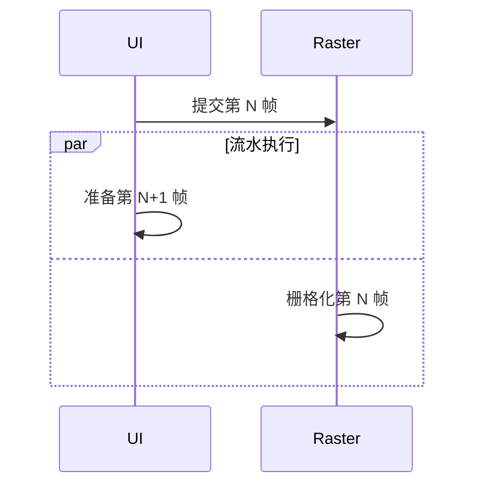

# 60 Hz 与 120 Hz 屏幕，帧预算有什么不同？

同一个页面在旧手机上滚动正常，换到 120 Hz 设备反而偶尔掉帧。有人会疑惑：高刷新率不是应该更流畅吗？

高刷新率确实能让动画和滚动更细腻，但前提是应用能更快地准备下一帧。屏幕刷新得越快，留给每帧工作的时间越少。

> 核心结论：60 Hz 的理论显示周期约为 16.67 ms，120 Hz 约为 8.33 ms。120 Hz 不是“自动更快”，而是要求 UI 与 Raster 流水线以更短周期稳定交付帧。

## 帧预算怎么算

计算方式很直接：

```text
理论显示周期 = 1000 ms ÷ 刷新率
```

| 刷新率 | 理论显示周期 |
|---:|---:|
| 60 Hz | 约 16.67 ms |
| 90 Hz | 约 11.11 ms |
| 120 Hz | 约 8.33 ms |

如果某个关键阶段耗时 10 ms，它在 60 Hz 下可能还没超过理论周期，在 120 Hz 下却已经错过 8.33 ms 的目标节奏。高刷新率设备因此更容易暴露同步计算、复杂布局、大图和滤镜等每帧成本。

这些数字只是理论上限。系统调度、温控、后台负载和管线同步也需要时间，不能把预算全部花在一个业务函数上。

## UI 和 Raster 预算不能直接相加

Flutter 的 UI 侧负责 Dart、Build、Layout 和 Paint 记录，Raster 侧负责把绘制内容栅格化。两侧可以流水处理不同帧：



因此，60 Hz 不能理解成“UI 有 16.67 ms，Raster 还有 16.67 ms，总共可以用 33.34 ms”。它们虽然可能并行，但都要维持约 16.67 ms 的交付节奏；任一侧持续超时都会形成积压。120 Hz 同理，只是周期缩短到约 8.33 ms。

## 120 Hz 不代表应用一直输出 120 FPS

没有动画、滚动或界面变化时，Flutter 通常不会仅因为屏幕刷新而重复执行完整渲染流程。

另外，设备可能使用动态刷新率。系统会根据显示内容、电量、温控和平台策略切换刷新率，应用也可能因为某一侧超时而无法跟上最高刷新节奏。因此测试报告不能只写“这是一台 120 Hz 手机”，还要记录问题发生时采用的刷新率和设备状态。

诊断时可以读取当前 View 所在 Display 报告的刷新率：

```dart
double frameBudgetMilliseconds(BuildContext context) {
  final refreshRate = View.of(context).display.refreshRate;
  return 1000 / refreshRate;
}
```

这个值适合帮助记录测试环境，不代表系统承诺应用始终按该速率呈现。动态刷新设备上应结合实际 Trace 和平台工具判断。

## 为什么不能永远把 16 ms 当慢帧阈值

如果监控固定使用 16 ms：

- 在 120 Hz 设备上，一帧耗时 12 ms 会被判为“正常”，但它已经错过一个 8.33 ms 周期；
- 不同刷新率的数据混在一起，P95、P99 很难解释；
- 优化可能只让 60 Hz 合格，却没有改善高刷新率体验。

线上帧指标应按刷新率、设备档位和页面场景分组。本地排查则应同时看 DevTools Performance 中的 UI 与 Raster 帧，而不是只看平均 FPS。

## 动画速度也不能按“每帧走一步”

下面这种思路在不同刷新率下会产生不同速度：

```dart
position += 2; // 每帧移动 2 像素
```

60 FPS 时一秒大约移动 120 像素，120 FPS 时可能变成 240 像素。动画应根据经过的时间计算进度。Flutter 的 `AnimationController`、Ticker 等机制就是按时间戳推进，不应把业务动画速度绑定到固定帧数。

## 一套实际的验证方法

1. 在目标真机使用 Profile 模式复现，最终再用 Release 验证；
2. 记录设备、系统、Flutter 版本、当前刷新率和温控状态；
3. 固定列表长度、图片、动画和操作脚本；
4. 分别观察 UI、Raster 是否超过当前刷新周期；
5. 比较 P95、P99、连续慢帧和输入到视觉反馈时间；
6. 在 60 Hz 与高刷新率设备上分别复测。

Debug 模式和模拟器可以帮助找逻辑问题，但不能代替高刷新率真机的性能结论。

## 最后记住这几点

- 帧预算由当前刷新率决定，不能永远写死为 16 ms。
- 60 Hz 约 16.67 ms，120 Hz 约 8.33 ms。
- UI 与 Raster 可以流水并行，但预算不能简单相加。
- 120 Hz 提供更流畅的上限，也提出更短的交付周期。
- 动态刷新率设备要记录实际测试状态。
- 动画按时间推进，性能在目标真机上按刷新率验证。

## 问答复盘

### Q1：120 Hz 屏幕为什么每帧只有约 8.33 ms？

**答：** 一秒需要刷新 120 次，理论周期是 `1000 ÷ 120`，约为 8.33 ms。

### Q2：UI 和 Raster 各用 8 ms，120 Hz 下总计 16 ms 也没问题吗？

**答：** 不能这样相加。两侧可流水处理不同帧，但都要维持约 8.33 ms 的交付节奏，持续超时会产生积压。

### Q3：120 Hz 设备一定始终以 120 Hz 运行吗？

**答：** 不一定。设备可能动态切换刷新率，系统策略、温控和内容状态都会影响实际运行情况。

### Q4：页面静止时，Flutter 会每秒完整绘制 120 次吗？

**答：** 通常不会。没有动画或视觉更新时，Flutter 无须持续执行完整的 Build、Paint 和 Raster 流程。

### Q5：为什么平均 FPS 不足以判断高刷新率体验？

**答：** 平均值会掩盖少数长帧和连续掉帧，应结合当前预算查看 P95、P99 与具体慢帧。

### Q6：固定每帧移动 2 像素有什么问题？

**答：** 动画速度会随实际帧率变化。应按经过时间计算进度，而不是依赖执行了多少帧。

### Q7：60 Hz 上已经流畅，还需要在 120 Hz 上测试吗？

**答：** 需要。相同工作量可能满足 16.67 ms，却超过 8.33 ms；两类设备暴露的性能边界不同。
