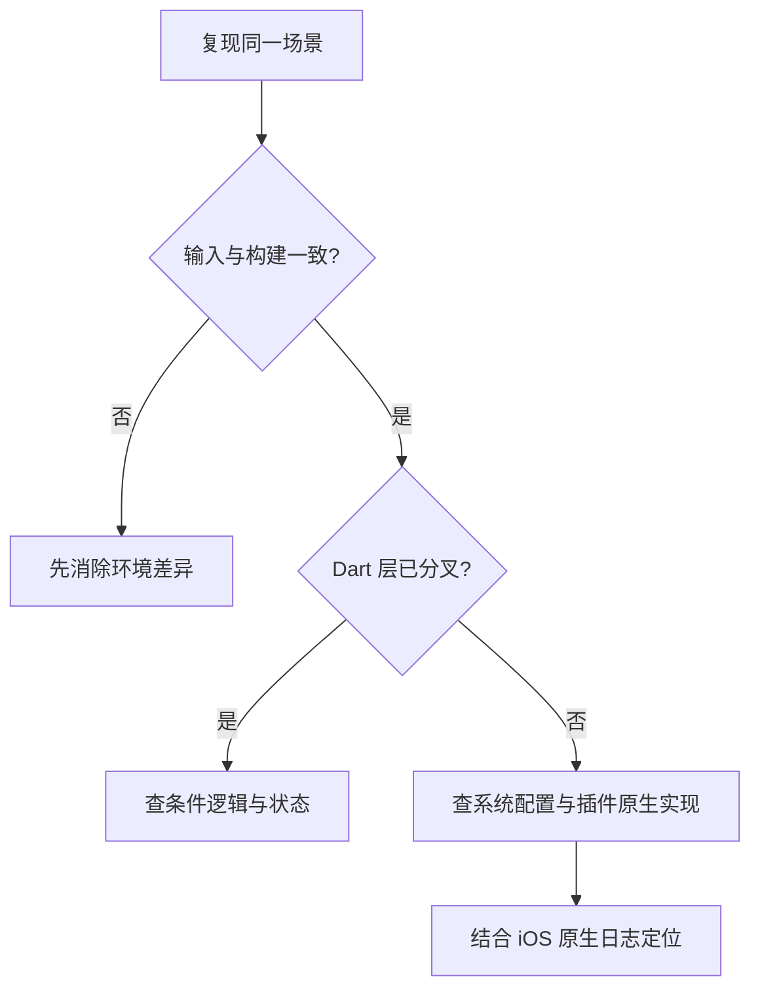

# Android 正常、iOS 异常，排查时先找哪些平台差异？

同一份 Flutter 代码，Android 能打开相机、请求接口，iOS 却报错或没有反应。只反复检查 Dart 逻辑，或笼统归为“iOS 兼容问题”，都很难找到首次分叉。

> 核心结论：先确认两端输入与构建环境一致，再按权限与能力、网络策略、生命周期、沙箱与 UI、插件原生实现逐层比较。先找到分叉发生在哪一层，不要从平台名称猜根因。

## 第一步：先证明两端跑的是同一个场景

排查前先对齐：

- App 版本、构建模式和环境配置；
- API 地址、账号、Feature Flag 与服务端数据；
- 系统版本、设备型号、Locale、时区和网络；
- 操作步骤、生命周期和权限状态；
- 插件版本及 Android、iOS 原生依赖版本。

两端可能使用不同环境变量、缓存或灰度配置。输入未对齐时，“Android 正常”不能证明共享逻辑正确。

日志用同一个非敏感操作标识串起 Dart、Platform Channel 和原生回调，且不能输出 Token、Cookie 或隐私数据。

## 第二步：权限声明和平台能力

相机、相册、定位或通知异常时，不要只看 Dart 侧 `request()`。Android 涉及 Manifest、运行时权限和系统版本；iOS 还要检查 `Info.plist` 用途说明，部分能力需要 Entitlement、签名或 Provisioning Profile。

比较未申请、拒绝、受限和已授权如何映射为业务状态；恢复前台时重新读取权限。

## 第三步：网络与证书策略

如果 Android 请求成功、iOS 失败，先保留 iOS 原生网络错误，再检查：

- URL、端口和重定向是否一致；
- 证书链、主机名、TLS 与设备时间是否有效；
- iOS App Transport Security（ATS）和 Android Network Security Configuration 是否造成策略差异；
- 代理、VPN、证书绑定或测试证书是否参与请求。

不要用“全局允许不安全连接”掩盖问题。应修正证书、域名或最小范围的平台配置。

## 第四步：生命周期和后台行为

`AppLifecycleState` 是跨平台归一化状态，不是原生回调的一一翻译。iOS 进入后台后可能很快暂停普通执行；Android 则受 Activity、进程与后台限制影响。

如果问题只在切后台、锁屏或恢复后发生，记录任务从哪个状态开始、中断时如何保存、恢复后是否重查权限与资源，以及迟到结果是否写回旧页面或账号。

## 第五步：沙箱、文件与界面环境

不要保存平台绝对路径，也不要假定临时文件永久存在。通过受支持的目录 API 取路径，并验证文件、权限和写入结果。

界面异常先比较 Safe Area、键盘 Insets、文字缩放、字体回退、Locale 和手势。Android 正常不代表 iPhone 的安全区、动态字体和键盘下仍满足约束。

地图、WebView 或原生输入框还要检查 Platform View 的合成、手势、焦点和生命周期。

## 第六步：插件其实是两套实现

Flutter 插件通常是统一 Dart API 加独立的 Android、iOS 实现，两端可能使用不同 SDK、线程要求和错误码。

收到 `PlatformException` 时，保留 `code`、脱敏 `message`、参数摘要和原生日志。原生 Crash 不会被 Dart `try-catch` 捕获，需要 Xcode 日志和符号化堆栈。

还要核对插件 Changelog、iOS 安装步骤、Pod、最低系统版本和签名。只在 Release 异常时，优先比较 Entitlement 与原生 SDK 初始化。

## 一套够用的排查顺序

1. 对齐版本、环境、账号、网络和操作步骤；
2. 用同一标识串起 Dart、Channel 和原生日志；
3. 检查权限、Entitlement、URL、TLS 与 ATS；
4. 复现生命周期，并检查沙箱、Safe Area 和 Platform View；
5. 最后深入插件 iOS 实现、原生依赖与构建配置。

平台政策与插件会变化。涉及权限、后台和网络安全时，应查目标 iOS、Flutter SDK 与插件的当前官方文档。

## 最后记住这几点

- 先证明两端输入与构建一致，再讨论平台差异。
- 权限 API 成功调用，不代表声明与能力配置完整。
- 网络失败要保留原生错误，不能全局放宽策略。
- 生命周期、沙箱和 Platform View 都有平台边界。
- Flutter 插件是一套 Dart 接口加多套原生实现。
- Dart 日志与 iOS 原生日志必须用同一操作标识关联。

## 问答复盘

### Q1：Android 正常，能证明 Dart 业务代码没有问题吗？

**答：** 不能。两端可能使用不同配置、数据或条件分支，应先对齐输入并定位首次分叉。

### Q2：iOS 权限请求失败，只检查 Dart 插件返回值够吗？

**答：** 不够。还要检查 `Info.plist`、Entitlement、签名、系统授权和插件安装要求。

### Q3：iOS HTTPS 失败，可以临时关闭 ATS 后直接上线吗？

**答：** 不应该。应定位证书、域名、TLS 或最小范围配置，不能全局放宽安全策略。

### Q4：Flutter 生命周期状态在 Android 和 iOS 上完全相同吗？

**答：** 不是。它是归一化语义，原生回调、暂停时机和后台能力仍有差异。

### Q5：文件路径在 Android 可用，为什么 iOS 可能失败？

**答：** 两端沙箱目录与策略不同。不要复用绝对路径，应通过支持的目录 API 获取并验证。

### Q6：为什么 `try-catch` 没抓到 iOS 插件崩溃？

**答：** Dart 只能处理传播过来的异常。原生 Crash 需要 iOS 日志和符号化堆栈。

### Q7：只在 iOS Release 包异常，第一批检查什么？

**答：** 比较 Release 的环境配置、Entitlement、签名、Pod 依赖、原生 SDK 初始化和符号文件。
