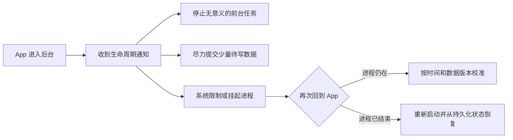

# App 切到后台后，哪些任务不能想当然地继续运行？

倒计时还剩 30 秒，App 切到后台一分钟，回来却还剩 25 秒；上传显示“进行中”，重新打开后其实早已中断；草稿只在 `paused` 时保存，结果进程被系统终止，内容还是丢了。

这些问题都有同一个误区：代码已经启动，不等于操作系统会让它一直运行。

> 核心结论：App 进入后台后，普通 Dart 代码、计时器、Isolate、网络回调和生命周期保存都没有“必定继续执行”的保证。先确定任务是否必须跨后台完成，再决定暂停恢复、持久化重建，还是接入平台后台能力。

## 进入后台，不等于页面销毁

App 进入后台时，页面 `State` 通常仍然 mounted，未必会执行 `dispose`。但这也不代表 Dart 代码可以继续获得前台时一样的 CPU、网络和帧调度。

操作系统可能限制后台执行，随后挂起甚至终止整个进程。生命周期通知也不是必达消息：异步清理还没完成，进程就可能已经结束。



真正可靠的设计必须同时接受两条路径：原进程恢复，以及进程被杀后的冷启动。

## 这几类任务最容易被误判

### 计时器、倒计时和轮询

`Timer.periodic` 只能表示“运行环境有机会调度时执行回调”，不是后台秒表。进程被挂起时，回调不能按预期频率执行；恢复后也不能靠少执行了多少次来推算真实时间。

倒计时应保存截止时间，恢复时重新计算：

```dart
final deadline = DateTime.now().add(const Duration(minutes: 10));

Duration remainingTime() {
  final remaining = deadline.difference(DateTime.now());
  return remaining.isNegative ? Duration.zero : remaining;
}
```

轮询则应在后台停止，恢复前台后根据 `lastSyncedAt` 判断是否需要刷新，而不是补跑所有错过的轮次。

### 普通网络请求、WebSocket 和上传

请求在切后台后可能暂时继续，也可能因为进程挂起、网络切换或超时而失败。WebSocket 对象仍在，也不代表连接仍然可用。

重要上传应支持断点、重试、幂等和服务端状态查询。恢复后先确认真实状态，不要只相信内存里的“上传中”。WebSocket 应设计心跳与重连，并补齐缺失数据。

### “等到 `paused` 再保存”的关键数据

生命周期回调适合做尽力而为的少量 flush，不适合临时启动一批数据库写入或网络提交。系统不会等待你的异步方法执行完。

表单草稿、编辑进度和关键业务状态，应在数据变化时增量保存。进入后台时只处理已排队的小量写入；冷启动后从持久化数据恢复。

### Isolate 中的计算

Isolate 是 Dart 的并发执行单元，不是操作系统授予的后台运行资格。它仍属于当前应用进程：进程被挂起时不能继续算，进程被终止后数据也会一起消失。

新 Isolate 只能避免阻塞主 Isolate，不能把普通任务变成可靠后台任务。

### 动画、帧回调和依赖前台界面的工作

动画、`Ticker` 和帧回调依赖 Flutter 的帧调度。App 不可见时，不应该依赖它们推进业务状态。业务倒计时、订单过期和验证码有效期都应以时间戳或服务端状态为准，动画只负责展示。

## 生命周期回调应该做什么

生命周期处理要轻量、可重复，并允许状态快速往返。下面的协调器停止前台轮询，在恢复时按数据新鲜度重新同步：

```dart
late final AppLifecycleListener _lifecycleListener;

@override
void initState() {
  super.initState();
  _lifecycleListener = AppLifecycleListener(
    onStateChange: _handleLifecycleChange,
  );
}

void _handleLifecycleChange(AppLifecycleState state) {
  if (state == AppLifecycleState.hidden ||
      state == AppLifecycleState.paused) {
    pollingController.stop();
    draftRepository.flushPendingWrites(); // 仅作尽力而为的补充
    return;
  }

  if (state == AppLifecycleState.resumed) {
    pollingController.start();
    _refreshIfStale();
  }
}

Future<void> _refreshIfStale() async {
  try {
    final snapshot = await repository.refreshIfStale();
    if (!mounted || snapshot == null) return;
    setState(() => currentSnapshot = snapshot);
  } catch (error, stackTrace) {
    logger.error('resume refresh failed', error, stackTrace);
  }
}

@override
void dispose() {
  _lifecycleListener.dispose();
  pollingController.dispose();
  super.dispose();
}
```

`hidden` 和 `paused` 可能先后出现，所以 `stop`、`start` 和 flush 都应设计为幂等，多调用一次不会产生重复任务。恢复刷新仍然是异步操作，需要处理异常、页面销毁和旧请求覆盖新请求等竞态。

## 真正需要后台完成怎么办

先按业务语义分类：

- 可以等用户回来：暂停任务，恢复后重新校准；
- 不能丢但不要求准时：持久化任务，再交给平台调度；
- 用户明确感知的持续任务：使用平台允许的前台或特定后台能力；
- 关键结果必须可靠：让服务端持有事实状态，客户端恢复后查询。

Android 的延迟任务、持续任务，和 iOS 的系统调度任务、特定 Background Modes，适用条件并不相同。通常需要插件或原生代码接入，并满足权限、声明和系统限制。即使接入平台 API，也不能承诺任意时刻立即执行。

Web 后台标签页会受到计时器节流，Desktop 则受窗口、休眠和进程状态影响。跨平台项目不能用一套“切后台后继续跑”的假设覆盖所有端。

## 最后记住这几点

- 进入后台不等于 `dispose`，仍然 mounted 也不等于任务会继续。
- Timer、轮询、网络、Isolate 和帧回调都不是可靠后台机制。
- 关键数据持续保存，生命周期回调只做轻量补充。
- 恢复前台后按时间、版本和服务端事实重新校准。
- 必须跨后台完成的任务，要使用对应平台允许的能力，并接受系统调度限制。

## 问答复盘

### Q1：App 进入 `paused` 后，页面一定会执行 `dispose` 吗？

**答：** 不一定。页面通常仍在组件树中，但应用进程可能随后被挂起或终止，这与 Widget 生命周期是两回事。

### Q2：为什么 `Timer.periodic` 不适合直接实现业务倒计时？

**答：** Timer 回调依赖运行环境调度，后台期间可能延迟。业务倒计时应保存截止时间，并在恢复时用当前时间重新计算。

### Q3：把任务放进 Isolate，能保证切后台后继续执行吗？

**答：** 不能。Isolate 解决 Dart 并发计算问题，仍属于应用进程，不会获得额外的系统后台执行资格。

### Q4：关键草稿为什么不能只在 `paused` 时保存？

**答：** 生命周期通知和异步写入都不保证在进程终止前完成。关键内容应随变更增量持久化，后台回调只负责补充 flush。

### Q5：网络请求切后台后没有立刻失败，是否说明它可靠？

**答：** 不能这样判断。它可能暂时继续，也可能随后因挂起、断网或超时失败；重要任务需要重试、幂等和状态恢复。

### Q6：接入系统后台任务 API 后，能保证准时执行吗？

**答：** 通常不能。Android 和 iOS 都会根据任务类型、资源状况和系统策略调度，应用应按“允许延迟、可以重试”设计。

### Q7：App 恢复前台后应该立刻重发所有请求吗？

**答：** 不应该。先检查数据是否过期、连接是否有效和任务是否已经完成，再合并或取消重复请求，避免恢复瞬间制造竞态。
