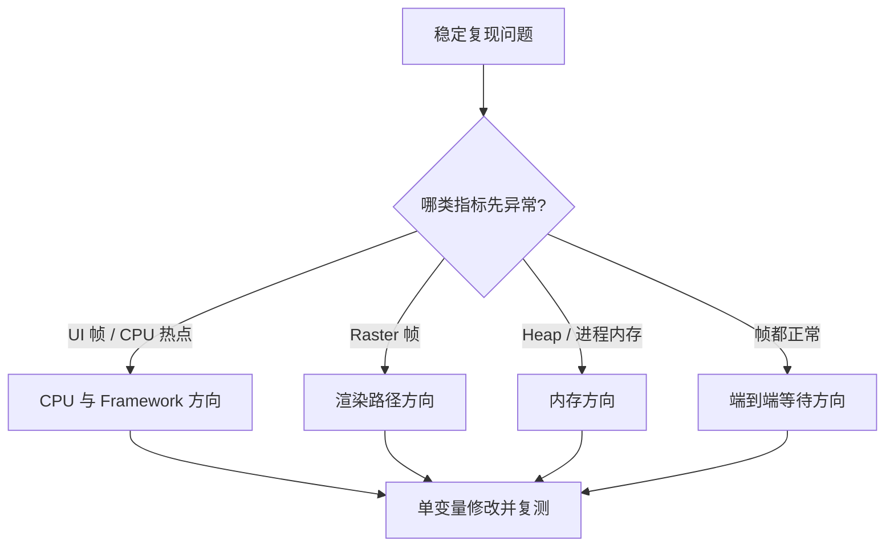

# CPU、GPU、内存问题，如何先做方向判断？

页面掉帧、发热、内存上涨经常一起出现。看到 Raster 慢就说“GPU 不行”，看到 GC 就说“内存泄漏”，很容易把方向带偏。

> 核心结论：先用同一段操作同时观察 UI 帧、Raster 帧、CPU 调用栈、Dart Heap 和进程总内存。第一轮只决定“优先往哪个方向查”，不要把一个指标直接当成最终结论。

## 先固定问题发生的时间窗口

在目标真机的 Profile 模式下，固定设备、刷新率、数据量和操作步骤，只录制问题附近的一小段时间。

把“商品页很卡”改成“首次进入后快速滚动，图片出现时发生连续慢帧”，才能将帧图、CPU 样本和内存曲线对到同一时刻。

60 Hz 帧周期约 16.7 ms，120 Hz 约 8.3 ms。最终还要在 Release 真机复测。

## 第一眼先看这张方向表

| 主要现象 | 第一批证据 | 优先方向 |
|---|---|---|
| UI 帧持续超预算 | CPU Profiler 中有同步热点 | Dart、Build、Layout 或业务计算 |
| UI 正常，Raster 帧超预算 | 大图、滤镜、复杂绘制附近变慢 | Raster、驱动或 GPU 路径 |
| Heap 与 GC 压力明显 | 分配速率高、对象数量上涨 | Dart 分配与引用关系 |
| Dart Heap 稳定，进程内存上涨 | RSS/PSS、Native、Graphics 增长 | 图片、纹理、插件或平台资源 |
| UI、Raster 都正常，点击仍慢 | 输入到反馈链路有等待 | 网络、I/O、平台调用或业务流程 |

这只是入口。CPU、GPU 和内存会互相影响，仍要做单变量验证。

## CPU 方向：看时间花在哪段调用栈

UI 帧高，说明 UI Isolate 没有及时完成当前帧工作。再用 CPU Profiler 确认热点是否落在解析、排序、同步 I/O、状态计算、Build 或 Layout。

重点不是总体 CPU 使用率，而是问题窗口内哪段调用栈占用关键时间。后台 Isolate 或原生线程使用 CPU，也不一定阻塞当前帧。

缩小数据量或暂时跳过某段计算；慢帧随之变化，才值得沿该调用链深入。

## GPU 方向：Raster 慢只是线索

Raster 超预算时，先查大图、模糊、阴影、复杂路径、离屏层和纹理更新。但它不能直接证明 GPU 算力不足。

Raster 路径还包含 CPU 绘制回放、资源准备、驱动调用和 GPU 等待。降低图片像素、关闭模糊或减少绘制面积，若 Raster 时间明显变化，渲染方向才更可信。

要进一步区分 GPU、驱动或系统合成，Android 使用 Perfetto 等平台 Trace，iOS 使用 Instruments、Core Animation 或 GPU 工具。还应记录 Flutter 版本和实际渲染后端。

## 内存方向：Heap 和进程内存要一起看

Dart Heap 上涨可能来自缓存、短期分配或 GC 尚未发生。重复进入退出页面，观察 GC 后基线，再用 Heap Snapshot Diff 和 Retaining Path 找持有者。

若 Dart Heap 稳定，而 Android RSS/PSS、Native、Graphics 或 iOS Memory Footprint 上涨，应检查图片、纹理、播放器、Platform View 和插件资源。

高分配速率会增加 GC 压力，大纹理也可能增加渲染成本。多个指标同时异常时，要用时间先后和单变量实验判断因果。

## 三个快速对照实验

- **数据量减半**：UI 热点随数据量变化，优先查解析、排序、列表和布局。
- **关闭视觉效果**：模糊、大图关闭后 Raster 慢帧减少，继续深挖渲染路径。
- **重复进入退出**：比较 GC 后 Heap、对象数量和进程基线，持续增长后再查引用或资源。

## 一套够用的排查顺序

1. 固定真机、构建模式、刷新率和复现脚本；
2. 录制 UI、Raster、CPU 与内存的同一时间窗口；
3. 先选最异常的一类指标作为优先方向；
4. 一次只改变数据量、视觉效果或生命周期中的一个变量；
5. 用调用栈、平台 Trace 或引用链证明根因；
6. 在相同场景复测，并检查另两类指标是否产生副作用。

## 最后记住这几点

- UI 慢优先查 CPU 与 Framework 工作，但要落实到调用栈。
- Raster 慢指向渲染路径，不等于已经证明 GPU 瓶颈。
- 内存要同时看 Dart Heap 与进程总内存。
- 单变量修改适合验证方向，最终结论仍需要 Trace 或引用链。
- 所有性能结论都应来自目标真机的 Profile 或 Release 数据。

## 问答复盘

### Q1：UI 帧超预算，就一定是业务 Dart 代码慢吗？

**答：** 不一定。Build、Layout、同步插件调用也在 UI 路径上，应通过调用栈定位。

### Q2：Raster 帧很高，可以直接认定 GPU 性能不足吗？

**答：** 不可以。Raster 还包含 CPU、资源准备、驱动调用和等待，需要平台 Trace 区分。

### Q3：CPU 使用率不高，为什么页面仍会掉帧？

**答：** 总体平均值会掩盖短时 UI 阻塞，也可能是 Raster、I/O 或系统合成问题。

### Q4：Dart Heap 稳定，是否说明没有内存问题？

**答：** 不能。图片、纹理、插件和 Platform View 可能主要占用 Native 或 Graphics 内存。

### Q5：GC 频繁就是内存泄漏吗？

**答：** 不是。它也可能来自高分配速率。泄漏需要证明无用对象在 GC 后仍被引用并持续增长。

### Q6：关闭模糊后不卡了，修复就是删除模糊吗？

**答：** 不一定。实验只支持渲染路径假设，还可评估缩小区域、降低像素量或调整实现。

### Q7：UI 和 Raster 都正常，用户仍说点击慢怎么办？

**答：** 扩展到输入至视觉反馈的端到端 Trace，检查网络、I/O、平台调用和业务等待。
