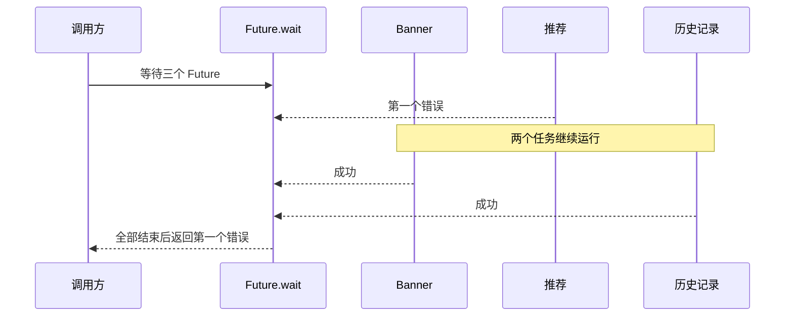

# `Future.wait` 中一个请求失败，其他请求会怎样？

首页同时请求 Banner、推荐和历史记录。推荐接口很快失败，另外两个请求却继续返回；有时页面马上报错，有时又要等很久。

> 核心结论：`Future.wait` 只负责汇总结果，不负责取消任务。默认情况下，一个 Future 失败后，组合 Future 会等其他 Future 全部结束，再抛出第一个错误；设置 `eagerError: true` 只会提前报告错误，其他任务仍会继续。

## 默认情况下会发生什么

```dart
final sections = await Future.wait([
  repository.loadSection('banner'),
  repository.loadSection('recommendations'),
  repository.loadSection('history'),
]);
```

三个方法调用会先产生各自的 Future，`Future.wait` 再等待它们。

如果推荐请求失败，默认的 `eagerError` 是 `false`：

1. 记录最先出现的错误；
2. 继续等待其他 Future 结束；
3. 全部结束后以第一个错误完成，后续错误会被丢弃。

只要有一个失败，调用方就拿不到成功结果列表。即使另外两个请求已经成功，它们的值也不会出现在返回结果中。



## `eagerError` 只改变报错时机

```dart
await Future.wait(
  [
    repository.loadSection('banner'),
    repository.loadSection('recommendations'),
    repository.loadSection('history'),
  ],
  eagerError: true,
);
```

设置为 `true` 后，第一个错误出现时，组合 Future 会立即失败，外层 `catch` 可以更早展示错误或进入降级页面。

但 Banner 和历史记录不会因此停止。它们可能继续占用网络和解析资源，也可能继续写缓存或产生其他副作用。

| 方式 | 组合 Future 何时报错 | 其他任务是否自动取消 |
|---|---|---|
| 默认 `eagerError: false` | 所有 Future 都结束后 | 不会 |
| `eagerError: true` | 第一个错误出现时 | 不会 |

## 先决定是否允许部分成功

### 三个结果缺一不可

例如权限、账号和核心配置缺一不可，此时可以直接使用 `Future.wait`，统一在外层捕获错误。

任务本身最好只返回值，不要各自直接修改页面状态。否则组合 Future 已经失败，迟到任务仍可能更新 UI，页面会同时出现错误态和局部成功内容。

### 某些模块失败也能展示

首页推荐失败不应该拖垮 Banner 和历史记录时，应在每个可降级任务内部把错误转换为明确结果：

```dart
Future<Section?> loadOptionalSection(String sectionName) async {
  try {
    return await repository.loadSection(sectionName);
  } catch (error, stackTrace) {
    logger.error(
      'load section failed: $sectionName',
      error,
      stackTrace,
    );
    return null;
  }
}

final sections = await Future.wait([
  loadOptionalSection('banner'),
  loadOptionalSection('recommendations'),
  loadOptionalSection('history'),
]);

final availableSections = sections.whereType<Section>().toList();
```

这里把 `null` 明确定义为“该模块降级”。不能在所有场景里随手吞错：关键数据失败时，仍应进入可观察的错误状态。

## 想停止其他请求，需要额外取消能力

Dart 普通 `Future` 没有统一的强制取消接口。任务能否停止，取决于具体库是否提供取消令牌、订阅或任务句柄。

如果业务要求“一项失败就停止其他任务”，通常需要：

1. 使用 `eagerError: true` 尽早收到失败；
2. 提前保存每个任务的取消句柄；
3. 在失败路径中主动取消仍在运行的任务；
4. 即使取消发出，也继续防守可能已经完成的迟到回调。

## `cleanUp` 是做什么的

`Future.wait` 提供可选的 `cleanUp` 回调。只要有任务失败，它会用于处理其他成功 Future 产生的非空结果，因为这些结果不会再通过返回列表交给调用方。

它适合释放成功结果代表的临时资源，不负责取消请求。`cleanUp` 只在发生错误时使用，而且不应该抛出异常，否则会产生未捕获的异步错误。普通 JSON 数据通常不需要它。

## 并发写操作尤其要小心

下面这种写法不是事务：

```dart
await Future.wait([
  orderRepository.submitOrder(order),
  couponRepository.useCoupon(couponId),
]);
```

订单可能成功、优惠券可能失败。客户端忽略响应无法撤销服务端已经执行的操作。

需要原子一致性的写操作，应由服务端事务、幂等键、状态版本或补偿流程保证，不能把 `Future.wait` 当作“全部成功，否则全部回滚”。

## 怎样验证“报错不等于取消”

使用 `Completer` 可以证明：组合 Future 因 `eagerError` 报错后，另一个 Future 仍能完成。

```dart
test('eager error does not cancel the remaining future', () async {
  final slowResponse = Completer<int>();
  var slowTaskCompleted = false;

  final slowTask = slowResponse.future.then((value) {
    slowTaskCompleted = true;
    return value;
  });

  final waiting = Future.wait<int>(
    [Future<int>.error(StateError('request failed')), slowTask],
    eagerError: true,
  );

  await expectLater(waiting, throwsStateError);
  expect(slowTaskCompleted, isFalse);

  slowResponse.complete(2);
  await slowTask;

  expect(slowTaskCompleted, isTrue);
});
```

## 最后记住这几点

- 默认模式会等所有 Future 结束，再返回第一个错误。
- `eagerError: true` 只提前报错，不会取消剩余任务。
- 一个任务失败后，调用方拿不到其他任务的成功结果列表。
- 允许部分成功时，应把每个任务的结果显式建模。
- `cleanUp` 用于清理已经成功的结果，不负责取消进行中的任务。
- 并发写操作不会自动回滚，一致性需要业务协议保证。

## 问答复盘

### Q1：一个 Future 失败后，其他网络请求会立即停止吗？

**答：** 不会。`Future.wait` 没有通用取消能力，其他请求会按各自实现继续、失败或完成。

### Q2：默认模式为什么没有马上进入 `catch`？

**答：** 因为默认 `eagerError` 为 `false`，组合 Future 要等所有任务结束后才以第一个错误完成。

### Q3：开启 `eagerError` 后，是否可以认为资源已经释放？

**答：** 不可以。它只让外层更早收到错误，剩余任务和已占用资源仍需单独管理。

### Q4：为什么一个失败后拿不到其他成功结果？

**答：** `Future.wait` 的返回契约是完整结果列表或错误，不提供部分结果。需要部分成功时应在单个任务内转换结果。

### Q5：`cleanUp` 能取消未完成请求吗？

**答：** 不能。它只处理错误发生后已经成功得到的非空结果，并且清理回调不应抛出异常。

### Q6：多个写请求放进 `Future.wait`，失败时会自动回滚吗？

**答：** 不会。每个服务端操作可能独立生效，需要事务、幂等或补偿机制处理一致性。

### Q7：结果列表按完成顺序排列吗？

**答：** 不是。全部成功时，结果顺序与传入 Future 的迭代顺序一致，与实际完成先后无关。
