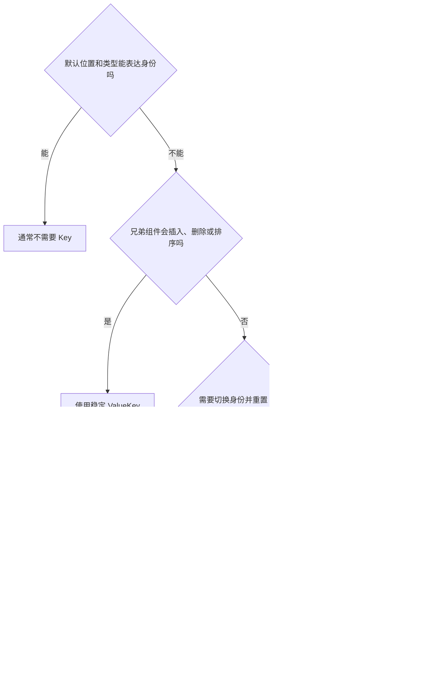

# `Key` 不是越多越好：什么时候真的需要它？

看到列表状态错位，就加 `Key`；看到页面没刷新，也加 `Key`；为了“性能更好”，甚至给每个 Widget 都加一个 `Key`。

结果可能恰好相反：状态频繁丢失、输入框内容重置、动画重新开始，代码里还多了一堆没有意义的标识。

> 核心结论：`Key` 用来帮助 Flutter 判断“新旧 Widget 是否代表同一个逻辑对象”。只有默认的位置和类型不足以表达身份时，才需要它。

## Flutter 默认怎么判断“还是不是它”

Widget 是不可变配置，界面更新时会不断产生新 Widget。Flutter 需要判断新配置应该更新原来的 Element，还是创建一个新的 Element。

在同一个父节点下，Widget 类型和 `Key` 是身份匹配的重要依据。没有 `Key` 时，同类型兄弟组件主要按位置匹配。

这在固定布局里通常没有问题：第一个标题还是第一个标题，第二个按钮还是第二个按钮。

问题出现在列表插入、删除和排序时。位置变了，但业务对象还是原来那个。

## 列表排序：状态应该跟着数据走

假设 `TaskRow` 内部保存了展开状态。列表排序后，如果没有稳定 Key，同类型行可能按新位置复用原来的 Element，展开状态就会落到另一条任务上。

```dart
ListView.builder(
  itemCount: tasks.length,
  itemBuilder: (context, index) {
    final task = tasks[index];

    return TaskRow(
      key: ValueKey(task.id),
      task: task,
    );
  },
)
```

`ValueKey(task.id)` 告诉 Flutter：无论这条任务移动到哪个位置，只要 ID 相同，它仍然是同一个逻辑对象。

这里应该使用稳定、唯一的业务 ID。`ValueKey(index)` 仍然跟着位置变化，对排序和插入几乎没有帮助。

不过也要反问一句：行内保存的是临时 UI 状态，还是任务完成状态这类业务事实？业务状态应该由明确的数据源管理，不能只靠 `Key` 保住一份局部 State。

## Key 要放在真正参与比较的层级

下面的 Key 放得太深：

```dart
return Padding(
  padding: const EdgeInsets.all(8),
  child: TaskRow(
    key: ValueKey(task.id),
    task: task,
  ),
);
```

列表直接比较的兄弟节点是多个没有 Key 的 `Padding`，不是里面的 `TaskRow`。排序时，外层仍可能按位置匹配。

应该把 Key 放到列表直接返回的节点上：

```dart
return Padding(
  key: ValueKey(task.id),
  padding: const EdgeInsets.all(8),
  child: TaskRow(task: task),
);
```

判断方法很简单：谁是同一个父节点下会移动的兄弟，Key 就应该放在谁身上。

## 有时我们故意让状态重建

`Key` 不只用于保留状态。改变 Key 也可以明确表示：“这已经是另一个对象，请重新创建 State。”

```dart
ProfileForm(
  key: ValueKey(user.id),
  user: user,
)
```

切换用户后，`user.id` 改变，旧表单 State 不再复用，可以避免上一个用户的临时输入残留。

这是一种明确的身份切换，不应该被当成通用“强制刷新”技巧。频繁改变 Key 会丢失焦点、滚动位置、Controller 和动画状态。

## 常见 Key 应该怎么选

### `ValueKey`

根据值判断身份，最适合稳定的业务 ID，例如订单号、任务 ID。

### `ObjectKey`

根据对象身份匹配。若每次更新都创建新的不可变对象，ObjectKey 也会随对象改变，此时业务 ID 通常比对象身份更稳定。

### `UniqueKey`

每个实例都不同。适合明确要求“永远是新对象”的少数场景。

不要在 `build` 中随手创建：

```dart
TaskRow(
  key: UniqueKey(),
  task: task,
)
```

父组件每次重建都会得到新 Key，原来的 State 会被丢弃。

### `PageStorageKey`

常用于在 `PageStorage` 机制中区分页面或滚动视图，帮助恢复滚动位置。它解决的是页面存储身份，不是业务数据持久化。

### `GlobalKey`

`GlobalKey` 能跨父节点标识唯一元素，还可以访问对应的 State 或 BuildContext，例如表单校验：

```dart
class _CheckoutPageState extends State<CheckoutPage> {
  final _formKey = GlobalKey<FormState>();

  void submit() {
    if (_formKey.currentState?.validate() != true) return;
    // 提交订单
  }
}
```

它应长期保存在 State 中，不能每次 `build` 都重新创建。同一个 `GlobalKey` 也不能同时出现在组件树的两个位置。

`GlobalKey` 能力强、维护成本也更高。普通列表身份优先使用 `ValueKey` 等 LocalKey，不要给每一行创建 `GlobalKey`。

## 一张简单的选择图



## Key 不能解决什么

- 不能保证页面更少 Rebuild；
- 不能自动提升列表性能；
- 不能替代业务状态管理；
- 不能把内存状态持久化到下次启动；
- 不能修复错误的数据流和生命周期设计。

`Key` 解决的是身份匹配。把它用于其他问题，往往只是暂时掩盖根因。

## 最后记住这几点

- 固定结构通常不需要 Key。
- 列表会插入、删除或排序时，使用稳定业务 ID 作为 `ValueKey`。
- Key 要放在真正参与兄弟节点比较的层级。
- `UniqueKey` 会主动制造新身份，不要在 `build` 中随手创建。
- `GlobalKey` 用于少量需要全局唯一身份或访问 State 的场景。
- Key 管身份，不管业务数据和性能结果。

## 问答复盘

### Q1：给所有 Widget 加 Key，性能会更好吗？

**答：** 不会。Key 增加了身份信息，但不能保证减少 Rebuild，也可能增加维护和匹配成本。

### Q2：列表为什么不推荐使用 `ValueKey(index)`？

**答：** 索引代表位置，不代表业务对象。插入或排序后，原索引可能已经对应另一条数据。

### Q3：列表项内部已经加了 Key，为什么状态仍然错位？

**答：** Key 可能放得太深。它应放在发生移动、且由同一父节点直接比较的兄弟节点上。

### Q4：改变 Key 为什么能重置表单？

**答：** 新 Key 表示新的逻辑身份，Flutter 不再复用原 Element 和 State，因此表单会重新创建。

### Q5：`UniqueKey` 适合给动态列表使用吗？

**答：** 通常不适合。每次生成的新 Key 都不同，会让列表项 State 无法稳定保留，应优先使用业务 ID。

### Q6：什么时候真的需要 `GlobalKey`？

**答：** 需要全局唯一身份、跨父节点保留元素，或访问特定 State，例如表单校验时。普通列表身份不需要它。
