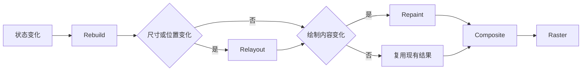

# Rebuild 多就一定卡吗？

打开重建统计后，页面一滑动，很多 Widget 都在闪。有人马上开始加 `const`、拆组件、上状态选择器，目标是把 Rebuild 次数降到最低。

但优化了一圈，页面可能还是卡。因为“重建很多”和“这一帧超时”不是一回事。

> 核心结论：Rebuild 只是重新生成 Widget 配置。它有成本，但不必然触发后面的布局、绘制和栅格化，也不必然造成卡顿。先测每帧时间花在哪里，再决定是否优化 Rebuild。

## 先把几个阶段分开

一次界面更新可能经过多个阶段：



它们关注的事情不同：

- Rebuild：重新执行 `build`，生成新的 Widget 配置；
- Relayout：重新计算 RenderObject 的尺寸和位置；
- Repaint：重新记录需要绘制的内容；
- Composite：组织和提交 Layer；
- Raster：把绘制指令变成屏幕上的像素。

Rebuild 后，如果渲染属性没有发生需要布局或绘制的变化，后续工作可能很少。反过来，某些动画的 Widget 重建不多，但每帧的绘制或栅格化很重，照样会卡。

## Rebuild 什么时候会变贵

简单的 `Text`、`Padding` 和普通布局组件，单次 `build` 通常不值得紧张。真正需要关注的是 Rebuild 中做了什么。

### 在 `build` 中反复做数据计算

```dart
@override
Widget build(BuildContext context) {
  final visibleOrders = orders
      .where((order) => order.status == selectedStatus)
      .toList()
    ..sort((a, b) => b.createdAt.compareTo(a.createdAt));

  return OrderList(orders: visibleOrders);
}
```

只要当前组件重建，筛选、复制和排序就会重新执行。数据量小可能没有问题；数据量大或重建频繁时，它才可能进入性能热点。

可以在数据或筛选条件变化时计算一次，而不是每次 `build` 都算：

```dart
Future<void> loadOrders() async {
  final orders = await orderRepository.load();
  final visibleOrders = orders
      .where((order) => order.status == selectedStatus)
      .toList()
    ..sort((a, b) => b.createdAt.compareTo(a.createdAt));

  if (!mounted) return;
  setState(() {
    _visibleOrders = visibleOrders;
  });
}
```

这只是避免重复计算，不代表大型排序一定适合放在 UI Isolate。计算是否需要移到其他 Isolate，仍要根据目标设备上的测量结果判断。

### 更新范围比实际需要大

一个点赞按钮变化，却让持有整页状态的父组件调用 `setState`，整页 `build` 都会重新执行。

如果这次状态只属于按钮，可以把状态下沉到更小的 StatefulWidget，或使用状态管理工具只订阅需要的字段。重点不是“组件拆得越碎越好”，而是让状态生命周期和更新范围一致。

### Build 中夹带同步 I/O 或复杂对象创建

读取文件、同步解析大 JSON、复杂正则、大量日志和昂贵对象初始化，都不应该因为 Rebuild 被反复执行。`build` 最好保持为一次轻量、可重复的界面描述。

## 帧预算比重建次数更重要

60 Hz 屏幕大约每 16.67 ms 产生一帧，120 Hz 屏幕约为 8.33 ms。应用还需要为布局、绘制、栅格化等工作留出时间，因此不能把全部预算都交给 `build`。

判断是否卡顿，应在目标设备的 Profile 或 Release 模式下观察：

1. 是否真的存在超出帧预算的慢帧；
2. 慢帧发生在 UI 侧还是 Raster 侧；
3. UI 侧时间是否主要消耗在 Build 或 Layout；
4. 问题是否只在特定列表长度、图片、动画或设备上出现。

Debug 模式包含断言、调试服务和额外检查，不能据此得出线上性能结论。

## `const` 有用，但不是万能答案

`const` 可以让稳定的 Widget 配置被复用，也能表达“这部分配置不会变化”。它适合顺手使用，但不能替代测量。

父组件的 `build` 仍可能执行；真正的卡顿如果来自图片解码、复杂布局或 Raster，增加 `const` 不会解决根因。

同样要注意：

- `Key` 主要用于匹配和保留组件身份，不是减少 Rebuild 的性能开关；
- `RepaintBoundary` 隔离的是绘制范围，不是 Rebuild；
- 状态选择器可以缩小通知范围，但选择逻辑和状态设计本身也有维护成本。

## 一套实用的排查顺序

1. 在目标设备使用 Profile 或 Release 模式复现。
2. 确认屏幕刷新率和对应帧预算。
3. 用 DevTools Performance 视图找到具体慢帧。
4. 判断主要耗时属于 Build、Layout、Paint 还是 Raster。
5. 如果 Build 确实很重，再定位频繁重建的组件和同步计算。
6. 缩小状态更新范围，移除 `build` 中的重复重活。
7. 用同一设备、同一场景再次测量，确认慢帧是否减少。

优化前后只比较 Rebuild 次数没有意义。用户感受到的是帧是否按时完成，不是控制台里出现了多少次 `build`。

## 最后记住这几点

- Rebuild 多不等于一定卡，单次成本和发生时机同样重要。
- Rebuild、Relayout、Repaint、Composite 和 Raster 是不同阶段。
- `const`、状态下沉和选择器只解决特定范围的问题。
- 性能结论必须来自目标设备的 Profile 或 Release 测量。
- 优化目标是减少慢帧，而不是追求 Rebuild 次数归零。

## 问答复盘

### Q1：只要 `build` 执行，就会重新布局和绘制吗？

**答：** 不一定。是否继续 Relayout 或 Repaint，取决于更新后的渲染属性是否让对应阶段变脏。

### Q2：Rebuild 次数很多，应该马上优化吗？

**答：** 不应该。先确认是否出现慢帧，以及慢帧是否真的消耗在 Build 阶段。

### Q3：加 `const` 能解决所有 Rebuild 问题吗？

**答：** 不能。它有助于复用稳定配置，但解决不了复杂布局、图片解码、重绘或栅格化瓶颈。

### Q4：`RepaintBoundary` 能减少 Rebuild 吗？

**答：** 不能。它主要隔离重绘边界，并可能增加 Layer 成本，应该针对 Paint 问题测量后使用。

### Q5：60 Hz 和 120 Hz 设备的优化标准一样吗？

**答：** 不一样。60 Hz 的单帧间隔约为 16.67 ms，120 Hz 约为 8.33 ms，高刷新率留给每帧的时间更少。

### Q6：列表筛选写在 `build` 中一定有问题吗？

**答：** 不一定。小数据量可能足够快；数据量大且重建频繁时才值得迁移。是否优化应由测量结果决定。
