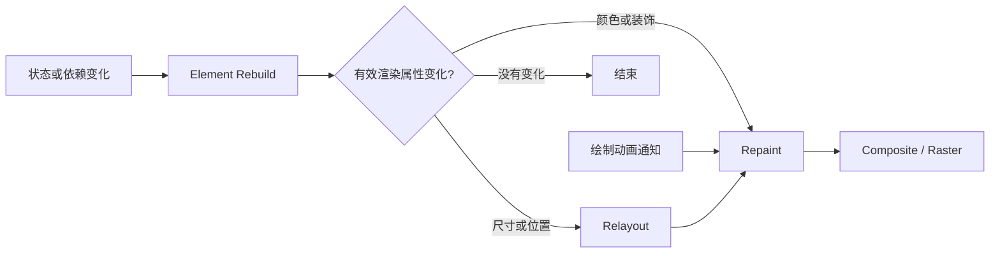

# Repaint 和 Rebuild 不是一回事

控制台里不断出现 `build` 日志，重绘提示又在闪，很容易得出结论：“Widget 重建了，所以整块页面一定重新绘制了。”这个判断经常把优化方向带偏。

> 核心结论：Rebuild 是 Element 重新执行 `build` 并协调 Widget 配置；Repaint 是 RenderObject 重新记录绘制内容。Rebuild 后不一定 Repaint，Repaint 也可以不经过 Rebuild。

## 两者分别在做什么

Widget 是不可变配置，Element 负责协调配置，RenderObject 负责布局与绘制。

- **Rebuild**：Element 重新执行 `build`，用新 Widget 配置协调子 Element；
- **Repaint**：RenderObject 重新执行 Paint 阶段并记录绘制命令；
- **Raster**：后续把绘制内容栅格化为屏幕像素，不能和 Repaint 混为一谈。

一次常见更新大致是：



新 Widget 不代表 RenderObject 的有效属性一定变化；属性变化也可能只影响布局或绘制中的一部分。

## Rebuild 后，为什么可能不 Repaint

`setState` 会让当前 State 对应的 Element 在后续构建阶段执行 `build`，但它不会直接调用 Paint。

下面的 `_requestVersion` 没有参与界面配置。点击后当前组件会 Rebuild，但返回的稳定子配置没有变化，因此没有理由仅因为这次状态变化就重绘它：

```dart
int _requestVersion = 0;

void retryRequest() {
  setState(() => _requestVersion++);
}

@override
Widget build(BuildContext context) {
  debugPrint('build version=$_requestVersion');
  return const ColoredBox(
    color: Color(0xFF00897B),
    child: SizedBox(width: 120, height: 48),
  );
}
```

真实业务中，父组件可能因其他状态重建，而某个子树的配置保持不变。“父组件执行了 `build`”不能推出“整个子树重新 Paint”。

如果颜色、阴影或文字内容变化，通常需要 Repaint；宽高、Padding 等几何属性变化还可能先触发 Relayout。

## Repaint 也可以不经过 Rebuild

动画只改变绘制参数时，可以把 `Animation` 传给 `CustomPainter` 的 `repaint`。每次通知会直接请求重绘，不需要每个 Tick 都调用 `setState`：

```dart
class PulseIndicator extends StatefulWidget {
  const PulseIndicator({super.key});

  @override
  State<PulseIndicator> createState() => _PulseIndicatorState();
}

class _PulseIndicatorState extends State<PulseIndicator>
    with SingleTickerProviderStateMixin {
  late final AnimationController _controller = AnimationController(
    vsync: this,
    duration: const Duration(milliseconds: 800),
  )..repeat(reverse: true);

  @override
  void dispose() {
    _controller.dispose();
    super.dispose();
  }

  @override
  Widget build(BuildContext context) {
    return CustomPaint(
      size: const Size.square(48),
      painter: PulsePainter(_controller),
    );
  }
}

class PulsePainter extends CustomPainter {
  PulsePainter(this.animation) : super(repaint: animation);

  final Animation<double> animation;

  @override
  void paint(Canvas canvas, Size size) {
    final radius = 8 + animation.value * 10;
    canvas.drawCircle(
      size.center(Offset.zero),
      radius,
      Paint()..color = const Color(0xFF00897B),
    );
  }

  @override
  bool shouldRepaint(covariant PulsePainter oldDelegate) {
    return animation != oldDelegate.animation;
  }
}
```

这绕过了每帧 Build 和 Layout，但 Paint 与 Raster 仍有成本。大面积模糊、复杂路径或大图仍可能让动画超时。

## `shouldRepaint` 也不是总开关

`shouldRepaint(oldDelegate)` 只负责新旧 Painter 实例替换时的配置比较。即使返回 `false`，尺寸变化、祖先重绘或 `repaint` 通知仍可能执行 `paint`。因此 `paint` 必须可重复调用，不能放业务副作用。

## `RepaintBoundary` 解决的是什么

`RepaintBoundary` 形成独立绘制边界，有机会避免稳定且昂贵的相邻区域跟随高频区域一起 Paint。

但它不会：

- 阻止 Rebuild 或减少 Layout；
- 保证建立 Raster Cache；
- 让边界内部的复杂绘制自动变便宜。

边界还会增加 Layer 和内存成本。它适合绘制节奏不同的相邻区域，不适合无差别包住每个列表项。

## 怎么判断应该优化哪一个

Debug 下可用 Widget Build 跟踪和重绘高亮确认范围，最终性能结论仍要在目标真机的 Profile 或 Release 模式验证。

排查顺序可以保持简单：

1. 在 DevTools Performance 中找到具体慢帧；
2. UI 侧慢，再看 Build、Layout 和同步 Dart 工作；
3. Paint 范围异常，再查触发者与边界；
4. Raster 侧慢，再查图片、滤镜、阴影和路径；
5. 修改后用同一场景复测。

60 Hz 一帧约 16.7 ms，120 Hz 约 8.3 ms。重绘多不一定卡，关键是每帧是否超过预算。

## 最后记住这几点

- Rebuild 更新 Widget 配置，Repaint 重新记录绘制内容。
- `setState` 触发 Rebuild，不等于直接触发整页 Repaint。
- `CustomPainter(repaint:)` 可以在不 Rebuild 的情况下重绘。
- `RepaintBoundary` 隔离 Paint，不优化 Build 和 Layout。
- 优化前先用慢帧和执行阶段证明问题在哪里。

## 问答复盘

### Q1：调用 `setState` 后一定会 Repaint 吗？

**答：** 不一定。它会安排 Rebuild；RenderObject 的有效属性变化后，才可能需要 Layout 或 Paint。

### Q2：发生 Repaint 前一定执行过 `build` 吗？

**答：** 不一定。`CustomPainter` 的 `repaint` Listenable、RenderObject 动画等路径可以直接请求重绘。

### Q3：颜色变化和宽度变化走的流程一样吗？

**答：** 不一样。颜色通常只需 Repaint，宽度会影响几何，通常需要 Relayout，并可能继续 Repaint。

### Q4：`RepaintBoundary` 能减少 Rebuild 次数吗？

**答：** 不能。它作用于 RenderObject 的 Paint 边界，不是 Element 的 Build 边界。

### Q5：`shouldRepaint` 返回 `false`，`paint` 就不会再执行吗？

**答：** 不是。尺寸、祖先绘制或 `repaint` 通知仍可能触发 `paint`。

### Q6：动画绕过 Build 后，就一定更流畅吗？

**答：** 不一定。它减少了 Build、Layout 路径，但复杂 Paint 与 Raster 仍可能超过帧预算。

### Q7：看到重绘高亮一直闪，应该马上加 `RepaintBoundary` 吗？

**答：** 不应该。先确认该区域是否昂贵、是否导致慢帧，再比较加入边界后的 Paint、Raster、Layer 和内存变化。
