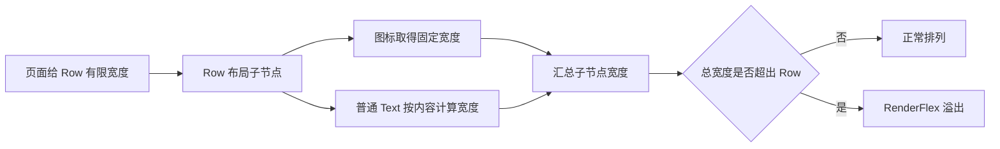

# `Row` 为什么会溢出？先弄清约束从哪里来

一段文字放进 `Column` 很正常，放进 `Row` 后却出现熟悉的黄黑条纹：

```text
A RenderFlex overflowed by 86 pixels on the right.
```

很多人第一反应是给文字加省略号、缩小字号，或者把 `Row` 改成 `mainAxisSize: MainAxisSize.min`。这些改法偶尔看起来有效，却没有处理真正的问题。

> 核心结论：`Row` 溢出通常不是内容“太长”，而是子组件没有拿到可用的最大宽度。先找到约束从哪里来，再决定应该压缩、换行、折行还是滚动。

## Flutter 布局先记住三句话

Flutter 的盒布局可以用三句话概括：

1. 约束向下传；
2. 尺寸向上传；
3. 父节点决定子节点的位置。

约束就是父节点告诉子节点：“你的宽高最小是多少，最大是多少。”子节点只能在这个范围内选择自己的尺寸。



## 为什么 `Text` 没有自动换行

下面的代码很容易溢出：

```dart
Row(
  children: [
    const Icon(Icons.info_outline),
    const SizedBox(width: 8),
    Text(order.description),
  ],
)
```

`Row` 沿水平方向排列子节点。布局普通的非 Flex 子节点时，它通常会先让子节点按自身需要计算宽度，而不是直接告诉 `Text`“你只能使用剩余空间”。

`Text` 没拿到有限的剩余宽度，就没有明确的换行位置。图标、间距和文本宽度加起来超过 `Row` 的最大宽度后，`RenderFlex` 只能报告溢出。

黄黑条纹是 Debug 模式下的提示。Release 模式不显示这条提示，并不代表布局问题消失了。

## 长文本：给它一个有限宽度

最常见的修复是用 `Expanded` 或 `Flexible` 包住文本：

```dart
Row(
  crossAxisAlignment: CrossAxisAlignment.start,
  children: [
    const Icon(Icons.info_outline),
    const SizedBox(width: 8),
    Expanded(
      child: Text(order.description),
    ),
  ],
)
```

`Row` 会先计算图标和间距，再把剩余宽度交给 `Expanded`。此时 `Text` 知道最大宽度，才有条件换行。

两者的区别可以简单理解为：

- `Expanded`：必须占满分配到的剩余空间；
- `Flexible`：最多使用分配到的空间，可以更小。

如果只是让一段长文本适应剩余区域，二者通常都能避免溢出。是否需要占满空间，再根据布局意图选择。

## 省略号为什么有时不生效

只写下面两行，仍然可能溢出：

```dart
Text(
  order.description,
  maxLines: 1,
  overflow: TextOverflow.ellipsis,
)
```

省略号也需要一个明确的最大宽度。没有宽度边界，`Text` 不知道应该在哪里截断。

```dart
Expanded(
  child: Text(
    order.description,
    maxLines: 1,
    overflow: TextOverflow.ellipsis,
  ),
)
```

先用 `Expanded` 提供有限宽度，再设置单行省略，行为才完整。

## 多个标签：不要硬塞进 `Row`

商品标签、筛选条件或技能标签数量不固定时，需求通常不是“压进同一行”，而是“放不下就换到下一行”。这时应该使用 `Wrap`：

```dart
Wrap(
  spacing: 8,
  runSpacing: 8,
  children: tags.map((tag) => Chip(label: Text(tag))).toList(),
)
```

`Row` 只负责一行排列，`Wrap` 才负责自动折行。

## 什么情况应该横向滚动

如果内容本来就不能压缩或换行，例如宽表格、时间轴、固定尺寸工具栏，可以提供水平滚动：

```dart
SingleChildScrollView(
  scrollDirection: Axis.horizontal,
  child: Row(children: timelineItems),
)
```

这里的 `Row` 位于横向滚动区域，水平方向可能没有有限上界。不要再随意放 `Expanded`，因为“占满剩余宽度”的前提是剩余宽度必须可以计算。

## 几个经常无效的修复

### `mainAxisSize: MainAxisSize.min`

它表示 `Row` 尽量按子节点总宽度收缩，不会把过长内容自动压进父节点允许的范围。子节点总宽度超过父约束时，仍然会溢出。

### 缩小字号

它只是推迟问题出现。换一段更长的文案、更窄的设备或更大的系统字体，溢出还会回来。

### 外层加一个更宽的 `Container`

如果屏幕或上层布局已经给出最大宽度，子节点不能凭空突破这个约束。先检查父约束，而不是不断向内层追加宽度。

## 一套实用的排查顺序

1. 找到报错的 `RenderFlex` 是 `Row` 还是 `Column`。
2. 确认溢出发生在水平还是垂直方向。
3. 查看父节点到底提供了有限约束还是无限约束。
4. 判断内容应该压缩、换行、折行，还是允许滚动。
5. 长文本优先尝试 `Flexible` 或 `Expanded`。
6. 动态多项使用 `Wrap`，不可压缩内容使用对应方向的滚动容器。
7. 在窄屏、大字体和真实业务长文案下再次验证。

## 最后记住这几点

- `Row` 溢出的关键是约束，不只是内容长度。
- `Text` 要换行或显示省略号，必须先拿到有限宽度。
- `Expanded` 与 `Flexible` 用于分配剩余空间，`Wrap` 用于自动折行。
- 横向滚动区域中通常没有有限的水平剩余空间，不能随意使用 `Expanded`。
- 不要只在默认字体和一种屏幕宽度下验证布局。

## 问答复盘

### Q1：为什么同一段文字在 `Column` 中正常，在 `Row` 中溢出？

**答：** 两者传给子节点的主轴约束不同。`Row` 中的普通 `Text` 可能没有得到可用于换行的有限剩余宽度。

### Q2：给 `Text` 设置 `ellipsis` 为什么没有效果？

**答：** 省略号需要明确的最大宽度。先通过 `Expanded`、`Flexible` 或固定约束限定宽度，再设置 `maxLines` 和 `overflow`。

### Q3：`Expanded` 和 `Flexible` 应该怎么选？

**答：** 需要占满剩余空间时用 `Expanded`；允许子节点小于可用空间时用 `Flexible`。二者都能为长文本提供有限宽度。

### Q4：标签放不下时应该用 `Expanded` 吗？

**答：** 如果需求是自动换行，应使用 `Wrap`。`Expanded` 解决剩余空间分配，不负责把多个子节点折到下一行。

### Q5：横向 `SingleChildScrollView` 中为什么不能随意用 `Expanded`？

**答：** 横向滚动通常不给子节点有限的最大宽度，而 `Expanded` 需要可计算的剩余空间，两者的布局前提冲突。

### Q6：Release 模式没有黄黑条纹，是否说明问题消失了？

**答：** 没有。黄黑条纹是调试提示，内容超过可用空间的布局事实仍然存在。
