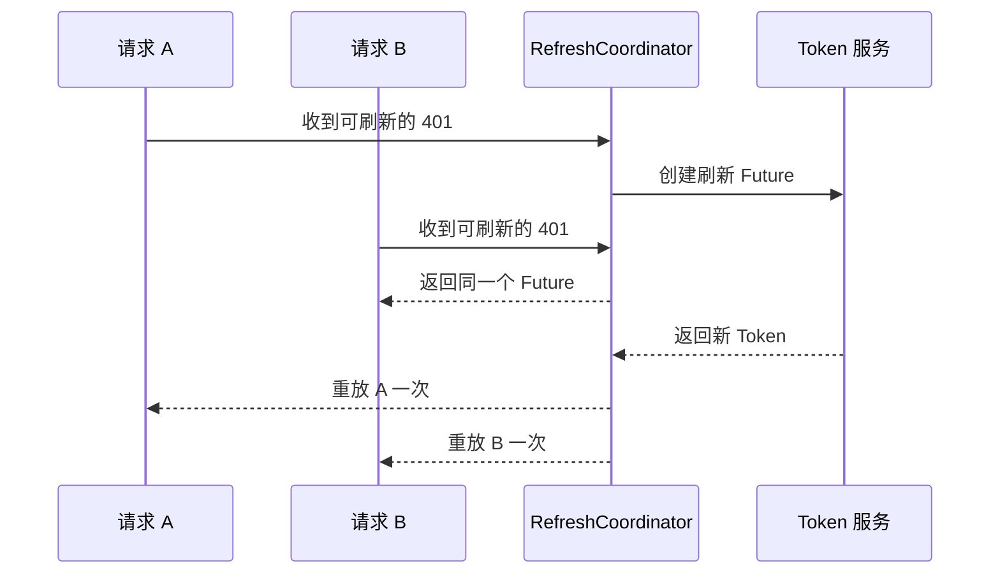

# Token 过期后多个接口同时刷新，如何避免重复刷新？

首页并行加载用户、消息和配置，Access Token 恰好过期，三个接口同时返回 401。每个拦截器都去刷新一次 Token，结果刷新接口被调用三次，有的业务请求还拿到了已经失效的中间 Token。

> 核心结论：同一登录会话在同一时刻只能有一个刷新任务。第一个 401 创建刷新 Future，后续 401 直接等待这个 Future；刷新完成后，各自的原请求最多重放一次。

## 为什么一个布尔值不够

最常见的做法是 `_isRefreshing = true`。但其他请求发现它为 true 后该怎么办？立即重发会继续使用旧 Token，循环等待又需要自己处理成功、失败和超时。

共享 Future 更直接：它既表示“刷新正在进行”，也会把同一份成功结果或同一个错误交给所有等待者。这种把同时发生的相同工作合并成一次的方式，通常叫 single-flight。



## 用同一个 Future 合并刷新

下面的协调器在刷新期间始终返回 `_inFlight`。成功或失败后再清空，下一轮过期才能创建新任务：

```dart
final class TokenRefreshCoordinator {
  TokenRefreshCoordinator(this._authApi, this._tokenStore);

  final AuthApi _authApi;
  final TokenStore _tokenStore;

  Future<SessionTokens>? _inFlight;

  Future<SessionTokens> refresh() {
    final existing = _inFlight;
    if (existing != null) return existing;

    final future = _performRefresh();
    _inFlight = future;

    future.whenComplete(() {
      if (identical(_inFlight, future)) {
        _inFlight = null;
      }
    }).ignore();

    return future;
  }

  Future<SessionTokens> _performRefresh() async {
    final session = await _tokenStore.readSession();
    if (session == null) throw const SessionUnavailable();

    final refreshed = await _authApi.refresh(session.refreshToken);

    final saved = await _tokenStore.replaceIfCurrent(
      expectedSessionId: session.id,
      tokens: refreshed,
    );
    if (!saved) throw const SessionChanged();

    return refreshed;
  }
}
```

`replaceIfCurrent` 是 TokenStore 的业务接口：只有当前会话仍是刷新开始时的 Session，才原子替换 Access Token 和可能轮换的 Refresh Token。

这一步不能省。用户可能在刷新期间退出登录或切换账号，迟到的旧刷新结果不能写回新会话，也不能交给等待请求继续使用。

多账号、多租户应用应按 Session Key 分别维护 single-flight，不能让不同认证作用域共用一个全局刷新任务。

## 401 拦截器必须加护栏

刷新合并只是第一步。完整流程至少需要这些限制：

1. 只有协议明确表示 Access Token 过期时才刷新；
2. 刷新 Token 的请求本身不能再次进入刷新逻辑；
3. 每个原始业务请求最多“刷新后重放”一次；
4. 重放仍返回 401 时，结束恢复流程并失效当前会话；
5. 刷新失败后统一清理会话和跳转登录，不能每个等待者各执行一次。

不是所有 401 都表示 Access Token 可刷新。Token 被撤销、账号被禁用、设备绑定失效和 Refresh Token 过期，都可能需要直接结束会话。最好由服务端提供稳定的认证错误码；只有 HTTP 状态码时，客户端要采用保守且有限的恢复策略。

403 通常表示当前身份没有权限，不应该通过刷新 Token 反复重试。

## 原请求不一定能直接重放

普通 GET 通常容易重新构造。上传流、一次性 Stream、已经读取过的 multipart Body 则可能无法再次发送，需要重新打开文件或重新创建请求体。

POST 写请求还要考虑幂等性。刷新 Token 只解决认证，不保证重复提交安全；下单、支付等操作仍要复用原幂等键，防止第一次请求已经被服务端执行。

因此，请求对象需要明确记录：

- 是否需要认证；
- 是否为刷新请求；
- 已重放次数；
- Body 是否可以重建；
- 写操作的幂等身份。

## 刷新期间页面退出怎么办

Token 刷新属于 Session，不应绑在某个页面 `State` 上。一个页面退出，只需要停止等待和重放自己的业务请求；如果还有其他请求在等待，不应把共享刷新一起取消。

刷新完成后，原请求重放前仍要检查调用方是否已取消、会话是否变化、结果是否仍有业务意义。共享基础任务和每个调用方的生命周期要分开管理。

## 预刷新能替代 401 刷新吗

不能完全替代。客户端可以根据已知过期时间提前刷新，减少大量请求同时遇到 401，但本地时间可能有偏差，Token 也可能被服务端提前撤销。

预刷新和 401 后刷新可以并存，并且都必须进入同一个 single-flight 协调器，否则只是把重复刷新提前发生了。

## 怎样验证没有刷新风暴

使用 Fake AuthApi 和 `Completer` 同时制造多个 401，验证：

1. 刷新端点只调用一次；
2. 所有等待请求获得同一刷新结果；
3. 刷新失败时所有等待者都失败，但会话只清理一次；
4. 每个业务请求最多重放一次；
5. 刷新期间切换账号，旧 Token 不会写入新会话；
6. 不可重放 Body 不会被自动再次发送。

日志记录 Session 的非敏感标识、等待者数量、刷新耗时和重放次数即可，不能输出 Access Token、Refresh Token、Cookie 或完整认证头。

## 最后记住这几点

- 用共享 Future 做 single-flight，不要只放一个 `_isRefreshing`。
- 同一认证作用域同时只允许一个刷新任务。
- 刷新请求排除自身拦截，业务请求最多重放一次。
- Token 写入要校验 Session，防止退出或切换账号后的迟到覆盖。
- 刷新 Token 不代表原请求可以安全重放，仍要检查 Body 和幂等性。
- 刷新失败后的登出和导航也要统一执行一次。

## 问答复盘

### Q1：为什么布尔锁不能完整解决重复刷新？

**答：** 它只能表示正在刷新，不能把结果或错误交给等待请求。共享 Future 同时解决状态、等待和结果传播。

### Q2：多个请求等待同一个刷新 Future，刷新失败会怎样？

**答：** 所有等待者都会收到同一个失败。会话清理和登录跳转应集中处理，避免执行多次。

### Q3：刷新接口返回 401 后还能再次刷新吗？

**答：** 不能进入普通刷新逻辑，否则会无限递归。通常应判定 Refresh Token 已失效并结束当前会话。

### Q4：新 Token 写入成功后，原请求可以无限重放吗？

**答：** 不可以。每个业务请求通常最多重放一次；再次 401 说明恢复失败，应停止循环。

### Q5：为什么切换账号时要做条件写入？

**答：** 旧会话的刷新可能晚于新会话登录完成。条件写入可以阻止旧 Token 覆盖新账号状态。

### Q6：上传请求收到 401 后一定能自动重放吗？

**答：** 不一定。一次性流或已消费的请求体可能无法复用，需要重建 Body，写操作还要有幂等保证。

### Q7：提前刷新 Token 后，还需要处理 401 吗？

**答：** 需要。时钟偏差、服务端撤销和会话策略变化都可能让本地判断失准，两条路径应共享同一刷新协调器。
