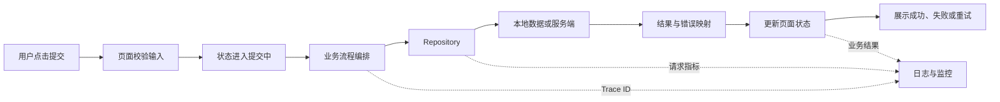
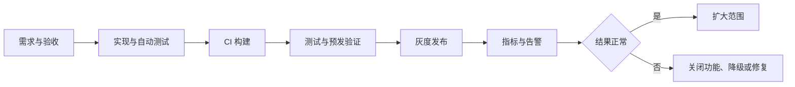

# 别先画分层图：从工作流看 Flutter 生产架构

讨论 Flutter 架构时，很容易先画出 Presentation、Domain、Data 三层，再为每层创建一批目录。图很完整，真正写业务时却还是不知道：状态放哪里、失败怎么处理、请求能不能重试、线上出错怎么定位。

问题在于，目录只是结果，不是架构的起点。

> 核心结论：生产架构应该从关键工作流出发。先把一次用户操作如何完成、失败和恢复讲清楚，再决定状态、业务规则和基础设施分别放在哪里。

## 先选一条真正重要的工作流

以“提交订单”为例，完整过程不只是调用接口：



沿着这条链路追问，架构职责会自然出现：

- 谁防止用户重复提交；
- 谁校验库存、优惠和支付条件；
- 谁决定是否读取缓存；
- 谁处理 Token 刷新、超时和错误映射；
- 页面退出后结果是否仍然有效；
- 服务端成功但客户端超时时，能不能安全重试；
- 线上失败时，如何用同一个请求标识串起客户端与服务端日志。

这些问题有明确答案，架构才开始具备生产意义。

## 运行时工作流需要四类边界

### 1. 展示与页面状态

Widget 负责把状态显示出来，并把用户事件交出去。页面状态至少能区分初始、加载、成功、空数据和错误，而不是用多个容易冲突的 `bool` 拼接。

页面层可以使用 `setState`、Provider、Riverpod 或 BLoC。框架不是重点，重点是状态由谁拥有、生命周期多长、哪些组件需要订阅。

### 2. 业务流程编排

提交订单通常不只是一个 HTTP 请求，还可能包含输入校验、幂等键、优惠确认和结果转换。这些步骤应该由明确的业务操作统一编排，而不是散落在按钮回调里。

简单页面不必强行创建 UseCase。只有当流程包含多步规则、需要复用或需要独立测试时，单独的应用服务或 UseCase 才真正降低复杂度。

### 3. 数据与平台边界

Repository 的价值是给上层稳定契约，隐藏数据来自接口、数据库还是缓存。它还需要明确：

- 哪一份数据是事实源；
- 缓存什么时候可用、什么时候失效；
- 网络错误如何转换为上层能理解的失败；
- 分页、重试和并发请求遵守什么规则。

相机、定位、支付 SDK 和平台通道也属于外部边界。序列化、权限、原生生命周期和错误传播应该封装在适配层，不应直接渗透到每个 Widget。

### 4. 生产保障能力

认证刷新、日志、Trace、指标、功能开关和环境配置会穿过多条业务工作流。它们适合放在清晰的公共边界，但不要把所有东西都扔进 `core/utils`。

只有多个业务模块真正共享、契约稳定的能力，才值得上升为公共基础设施。

## 先定义异常路径，再写成功路径

生产架构与演示项目最大的区别，是不能只考虑成功。

提交订单至少要考虑：

1. 用户连续点击；
2. 请求超时但服务端已经成功；
3. 页面退出或 App 切到后台；
4. Token 过期并触发刷新；
5. 服务端返回业务冲突；
6. 客户端拿到结果前进程被终止。

这时会发现，`mounted` 只能阻止销毁后的 UI 更新，不能解决重复提交和服务端一致性。写请求还需要服务端幂等、订单状态查询或业务版本校验。

错误也不应该一律变成 `null`。网络不可用、登录失效、库存不足和系统异常需要不同的处理方式，至少要让上层知道是否可重试、是否要重新登录、是否需要用户修改输入。

## 目录应该跟着业务边界走

对于持续演进的项目，可以优先按业务能力组织，再在能力内部划分职责：

```text
lib/
├── features/
│   └── checkout/
│       ├── presentation/
│       ├── application/
│       ├── domain/
│       └── data/
├── infrastructure/
│   ├── networking/
│   ├── persistence/
│   └── observability/
└── app/
    ├── routing/
    └── bootstrap/
```

这不是固定模板。小型项目可以合并 `application` 与 `domain`，简单查询也不需要层层转发。

判断是否拆层，可以问：它是否有独立规则、是否需要替换实现、是否需要单独测试、是否被多个入口复用。没有真实边界时，增加文件只会增加跳转成本。

## 完整架构还有一条交付工作流

运行时流程设计得再好，如果不能稳定发布和观察，也不能称为完整的生产架构。



这条工作流会反过来影响代码架构：

- 依赖可以替换，核心逻辑才容易测试；
- 环境配置有明确入口，测试包才不会误连生产；
- 发布产物带构建标识，Crash 才能对应源码和符号文件；
- 关键操作带 Trace ID，客户端与服务端才能串联；
- 高风险功能有开关，移动端无法即时回滚时才能快速止损；
- 后端兼容旧版本，灰度期间多个客户端版本才能共存。

可测试、可发布和可观测不是架构完成后的附加项，而是生产架构的一部分。

## 怎么判断架构是否真的完整

拿一条关键工作流，从头走到尾，检查能否回答：

- 状态由谁拥有，什么时候创建和销毁；
- 业务规则在哪里执行；
- 数据事实源和缓存策略是什么；
- 异常、取消、重试和并发怎么处理；
- Android 与 iOS 的平台差异在哪里收口；
- 各层如何独立测试；
- 线上如何定位一次失败；
- 新版本出问题时如何降级或止损。

如果答案只是“我们用了 BLoC”“我们是 Clean Architecture”，说明说的是工具或形式，还没有描述完整工作流。

## 最后记住这几点

- 生产架构从关键业务工作流开始，不从目录开始。
- 状态管理框架只解决部分状态流转问题，不等于完整架构。
- 成功、失败、取消、重试和一致性必须放在同一条流程中考虑。
- 分层要对应真实边界，否则只会增加维护成本。
- 运行时业务流与工程交付流都闭环，架构才具备生产价值。

## 问答复盘

### Q1：用了 Clean Architecture，就算生产架构完整了吗？

**答：** 不算。分层只是组织手段，还要说明状态、异常、一致性、发布、监控和降级如何协作。

### Q2：每个接口都需要一个 UseCase 吗？

**答：** 不需要。只有存在多步业务规则、复用需求或独立测试价值时，单独编排层才值得存在。

### Q3：Repository 只是对网络请求再包一层吗？

**答：** 不是。它应提供稳定数据契约，并明确事实源、缓存、错误映射和并发策略。

### Q4：`mounted` 能解决提交订单的所有生命周期问题吗？

**答：** 不能。它只保护 UI 更新，无法阻止重复提交，也不能保证服务端操作的一致性和幂等性。

### Q5：为什么发布和监控也属于架构？

**答：** 因为生产系统必须能定位版本、观察结果并在异常时止损，这些能力会直接影响配置、依赖和业务边界设计。

### Q6：小项目需要完整保留四层目录吗？

**答：** 不需要。职责可以合并，但状态所有权、错误处理、数据边界和发布保障仍要有明确答案。
