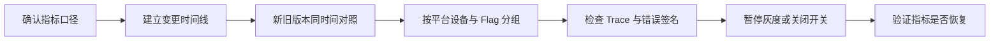

# 发版后指标变差，怎样判断是否由本次改动引起？

新版本开始灰度后，页面成功率下降、TTFD 变慢或 Crash-Free 变差。时间刚好对上，第一反应通常是：“这次发版有问题，赶紧回滚。”

先止损可能是对的，但“发版后发生”不等于“由发版造成”。同期还可能有服务端发布、远端配置、流量结构、系统版本和监控口径变化。

> 核心结论：先确认指标本身可信，再比较同一时间的新旧版本与灰度组，最后用 Trace、错误签名和关闭开关后的恢复情况验证。归因需要一条证据链，不能只靠时间相邻。

## 第一步：先确认指标没有“自己变”

看到曲线下降，先检查：

- 指标定义、分母和聚合方式是否变化；
- 监控 SDK、采样率或上报字段是否随版本调整；
- 数据是否存在延迟、丢失或低样本波动；
- P95、P99 是否因设备、地区或网络人群比例变化；
- 新旧版本的埋点是否仍表达同一个业务结果。

例如新版把“用户主动取消”也计入失败，成功率会下降，但不代表功能真的退化。指标口径不一致时，后续对比没有意义。

## 第二步：把所有变化放到同一条时间线

至少标出：

- 客户端构建开始灰度、扩大比例和暂停的时间；
- Feature Flag 实际启用范围；
- 服务端、网关、CDN 和远端配置变更；
- 第三方 SDK、证书、推送或支付配置变化；
- 告警出现、用户反馈和止损动作。

如果指标在客户端灰度前已经开始恶化，应先查同时发生的外部变化。时间线用于缩小范围，不负责单独证明因果。

## 第三步：优先做“同时间对照”

不要只拿今天的新版本和上周全量数据比较。移动端发布期间，新旧版本会长期并存，最有价值的是同一时间窗口内比较：

- 新版本与旧版本；
- Flag 开启组与关闭组；
- Android 与 iOS；
- 不同 OS、设备档位、网络和地区；
- 首次升级用户与已经稳定运行的用户。

如果只有新版本、特定平台或 Flag 开启组变差，客户端改动的嫌疑会提高。若新旧版本同时下降，更应检查服务端、网络或共同依赖。

分组时一次只改变主要变量。把版本、平台、设备和网络全部混在全局平均值里，很容易出现错误结论。

## 哪些证据更接近因果

| 证据 | 说明 | 强度 |
|---|---|---|
| 发版后曲线变差 | 时间相关，仍可能有其他变化 | 弱 |
| 问题集中在新版本或 Flag 组 | 影响范围与改动一致 | 中 |
| 灰度比例上升时问题同步放大 | 出现剂量关系，但仍需排除人群差异 | 中 |
| Trace、堆栈或错误码指向改动路径 | 建立具体执行链联系 | 强 |
| 关闭 Flag 后同一人群恢复 | 受控反转支持因果 | 强 |
| 相同输入可稳定复现并由修复消除 | 根因与修复形成闭环 | 强 |

证据越强，越能回答“为什么是这次改动”，而不只是“什么时候发生”。

## 一个 Flutter 场景怎么判断

假设新版商品详情增加图片预加载，灰度后 TTFD 长尾变差。

先比较同一时间的新旧版本，并按设备内存档位、平台和 `image_prefetch` Flag 分组。如果问题集中在新版本的开启组，再查看代表性慢 Trace：网络是否变慢、图片解码是否提前占用关键阶段、UI 或 Raster 慢帧是否增加。

暂停扩大灰度并关闭 Flag 后，如果同一人群逐步恢复，预加载路径的嫌疑很高。随后还要在目标真机复现，并验证调整预加载范围后的指标，才能关闭根因调查。

这里不能只看 TTFD。预加载可能改善后续浏览，却增加流量、内存或首屏 Raster 成本，需要一起评估收益和代价。

## 止损动作也可以帮助验证

影响较大时，不必等到完全查清才行动。可以暂停灰度、关闭 Feature Flag、回退远端配置或服务端降级，同时继续保留证据。

但“动作后恢复”也要谨慎解释：缓存过期、流量变化或服务端恢复可能恰好同时发生。最好比较同一人群，并确认恢复时间与开关传播时间一致。

移动端也不能假设商店版本可以瞬间回滚。数据库迁移、服务端 Schema 和已写入数据还可能让直接回退不安全，因此兼容设计和远端开关要在故障前准备。

## 一套够用的归因顺序

1. 确认指标定义、样本和上报完整性；
2. 对齐客户端、Flag、服务端和配置变更时间线；
3. 同时间比较新旧版本和灰度对照组；
4. 按平台、设备、网络与关键路径继续分组；
5. 用 Trace、错误签名或 Crash 堆栈连接到改动；
6. 暂停灰度或关闭开关，验证同一人群是否恢复；
7. 复现、修复并用同样指标完成前后对比。

## 最后记住这几点

- 发版后变差只是相关性，不是因果结论。
- 先验证指标口径，再分析代码影响。
- 同时间的新旧版本对照比跨日期全局平均更可信。
- 灰度组、Flag、Trace 和错误签名要进入监控维度。
- 暂停灰度与关闭开关既能止损，也能提供反转证据。
- 根因关闭需要复现、修复和同指标验证形成闭环。

## 问答复盘

### Q1：指标在发版后立刻变差，能直接认定是客户端吗？

**答：** 不能。还要排除指标口径、服务端、配置、流量和系统环境变化。

### Q2：为什么要比较同一时间的新旧版本？

**答：** 它们共享当时的服务端和外部环境，比跨日期对比更能隔离客户端版本变量。

### Q3：只有新版本变差，就已经证明根因了吗？

**答：** 还没有。版本人群、升级路径和配置也可能不同，应继续结合 Trace、错误签名和受控反转。

### Q4：灰度比例越高，指标越差说明什么？

**答：** 它提供剂量关系证据，但仍要排除灰度人群和设备结构差异。

### Q5：关闭 Feature Flag 后恢复，可以直接结束调查吗？

**答：** 不建议。还要复现具体路径、确认根因并验证修复，否则同类问题可能再次出现。

### Q6：为什么不能只看全局平均值？

**答：** 它会混合版本、平台、设备和网络差异，并掩盖长尾与局部严重回退。

### Q7：线上影响很大，但根因还没查清，应该等吗？

**答：** 不应该。先暂停灰度、关闭开关或降级止损，同时保留版本、Flag 和 Trace 证据继续调查。
