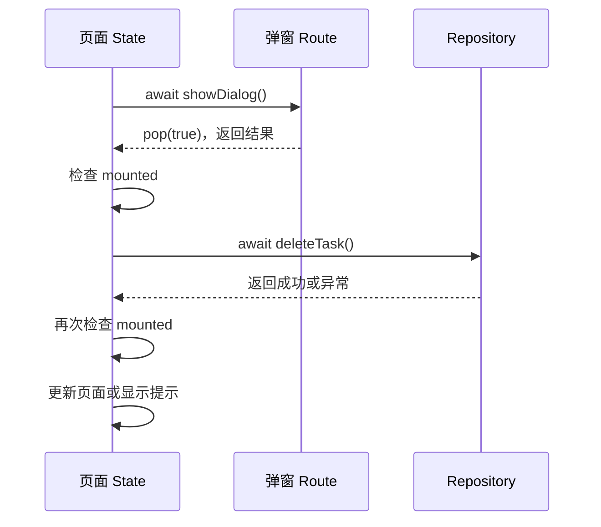

# 弹窗关闭后更新页面，为什么经常遇到 `mounted` 问题？

删除一条数据前先弹出确认框，用户点“确认”后调用接口，再刷新页面。这段流程看起来很顺，却经常遇到 `setState() called after dispose()`，或者静态检查提示不要跨异步间隙使用 `BuildContext`。

> 核心结论：弹窗关闭，只表示 `showDialog` 返回的 `Future` 完成了，不代表发起弹窗的页面仍然存在。每经过一次 `await`，都要重新确认接下来要使用的页面或 `BuildContext` 还处于 mounted 状态。

## 问题通常是怎么出现的

下面的代码有两个异步间隙，却在最后直接更新页面：

```dart
Future<void> deleteTask() async {
  final confirmed = await showDialog<bool>(
    context: context,
    builder: (dialogContext) => AlertDialog(
      title: const Text('删除任务？'),
      actions: [
        TextButton(
          onPressed: () => Navigator.of(dialogContext).pop(true),
          child: const Text('确认'),
        ),
      ],
    ),
  );

  if (confirmed != true) return;

  await repository.deleteTask(widget.taskId);

  setState(() {
    tasks.removeWhere((task) => task.id == widget.taskId);
  });
  ScaffoldMessenger.of(context).showSnackBar(
    const SnackBar(content: Text('删除成功')),
  );
}
```

用户操作弹窗时，原页面可能被路由替换，也可能因为父组件条件变化而从组件树中移除。接口请求期间，同样可能发生这些事。一旦对应的 `State` 已经执行 `dispose`，再调用 `setState` 就会报错；继续通过旧 `context` 查找 `Navigator`、`Theme` 或 `ScaffoldMessenger` 也不再可靠。

## 三套生命周期并不会自动同步

这个场景里至少有三个对象：

- 页面 `State`：由页面在组件树中的存在时间决定；
- 弹窗 Route：由 `Navigator` 推入，关闭时独立退出；
- 删除任务：由 `Future` 的执行过程决定，不会因为页面销毁自动取消。



通常情况下，`showDialog` 只是把弹窗压到当前页面之上，底层页面不会因此销毁。但“通常不会”不等于“异步返回时一定还在”。真正需要防守的是等待期间发生的其他导航和组件树变化。

## 更稳妥的写法

让弹窗只返回结果，后续业务由页面处理。并且在每个 `await` 之后，使用页面状态前都重新检查：

```dart
Future<void> deleteTask() async {
  final taskId = widget.taskId;

  final confirmed = await showDialog<bool>(
    context: context,
    builder: (dialogContext) => AlertDialog(
      title: const Text('删除任务？'),
      actions: [
        TextButton(
          onPressed: () => Navigator.of(dialogContext).pop(false),
          child: const Text('取消'),
        ),
        TextButton(
          onPressed: () => Navigator.of(dialogContext).pop(true),
          child: const Text('确认'),
        ),
      ],
    ),
  );

  if (!mounted || confirmed != true) return;

  try {
    await repository.deleteTask(taskId);
    if (!mounted) return;

    setState(() {
      tasks.removeWhere((task) => task.id == taskId);
    });
    ScaffoldMessenger.of(context).showSnackBar(
      const SnackBar(content: Text('删除成功')),
    );
  } catch (error, stackTrace) {
    logger.error('deleteTask failed', error, stackTrace);
    if (!mounted) return;

    ScaffoldMessenger.of(context).showSnackBar(
      const SnackBar(content: Text('删除失败，请稍后重试')),
    );
  }
}
```

这里提前保存 `taskId`，是为了保证异步恢复后处理的仍是用户当时确认删除的任务。点击遮罩、系统返回键或其他没有传值的关闭方式，结果可能是 `null`，所以应明确判断 `confirmed != true`。

在 `State` 方法中可以直接检查 `mounted`。如果保存和使用的是某个 `BuildContext`，则检查 `context.mounted`。检查对象要与后面真正使用的对象一致。

## 为什么不能只检查一次

第一次检查只能证明：弹窗返回的那个时刻，页面还在。

接着执行网络请求，又产生了新的异步间隙。页面完全可能在请求期间销毁，所以请求返回后还要再检查一次。判断规则不是“一个方法检查一次”，而是“每次跨过异步间隙后，准备操作界面前检查一次”。

## `mounted` 解决不了什么

`mounted` 是最后一道 UI 生命周期保护，不是异步任务管理器。

- 它不会取消已经发出的网络请求；
- 它不会阻止用户重复点击产生多个请求；
- 它不会解决旧请求比新请求晚返回造成的数据覆盖；
- 它不会决定任务应该由页面、Controller 还是 Repository 持有。

如果删除任务必须在页面退出后继续完成，应把任务状态放到 Repository、Controller 或更高层状态容器中。页面只订阅结果，并在自身仍然 mounted 时展示它。若任务离开页面就没有意义，还要结合所用网络库或异步方案提供的取消能力，而不是只在结果回来后丢弃 UI 更新。

## 容易踩的两个坑

第一，不要在弹窗 `pop` 后继续跨异步使用 `dialogContext`。这个 Context 属于弹窗子树，弹窗退出后会失效。弹窗用它完成 `pop(result)` 即可，页面提示应使用仍然有效的页面 Context。

第二，不要把“页面看不见”和“页面已销毁”混为一谈。新 Route 覆盖在上面时，原页面可能仍然 mounted；页面被移除并执行 `dispose` 后才是 unmounted。是否可更新应看生命周期，不要只凭肉眼判断页面是否可见。

## 最后记住这几点

- `showDialog` 是一次异步等待，关闭弹窗不等于原页面一定存在。
- 弹窗通过 `pop(result)` 返回选择，页面负责后续业务和界面更新。
- 每个 `await` 后，只要要使用 State 或 Context，就重新检查对应的 `mounted`。
- `mounted` 只能拦住失效的 UI 操作，不能取消任务或解决竞态。
- 需要跨页面继续执行的任务，应交给生命周期更长的业务层管理。

## 问答复盘

### Q1：`showDialog` 关闭时，底层页面一定会执行 `dispose` 吗？

**答：** 不会。通常只是弹窗 Route 退出，底层页面仍在；但等待期间页面可能因其他导航或父组件变化被移除，所以异步返回后仍要检查。

### Q2：为什么弹窗返回后检查过 `mounted`，接口返回后还要再检查？

**答：** 因为网络请求形成了新的异步间隙。第一次检查不能保证页面在第二次等待结束时仍然存在。

### Q3：`mounted` 和 `context.mounted` 应该怎么选？

**答：** 在 `State` 内保护当前 State 时用 `mounted`；跨异步保存并准备使用某个 `BuildContext` 时，检查那个 Context 的 `mounted` 状态。

### Q4：弹窗关闭后还能使用 `dialogContext` 显示 SnackBar 吗？

**答：** 不应依赖它。`dialogContext` 属于正在退出的弹窗子树，应把结果返回页面，再用有效的页面 Context 处理提示。

### Q5：加了 `mounted`，网络请求会在页面销毁时停止吗？

**答：** 不会。请求仍会继续，`mounted` 只是阻止结果回来后更新已经销毁的界面；是否取消要由具体异步方案处理。

### Q6：用户在弹窗外点击后，为什么代码没有继续删除？

**答：** 这种关闭方式通常没有返回 `true`，结果可能是 `null`。用 `confirmed != true` 处理，可以只让明确确认的操作继续执行。
