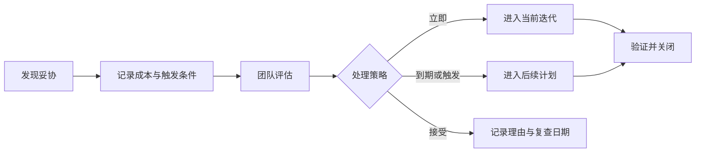

# 技术债不是“以后再改”：怎样记录才真的有人处理？

代码里留下一句 `TODO: 后面优化`，Issue 里写一个“重构网络层”，几个月后通常没人敢动。不是团队不重视质量，而是这条记录无法回答：为什么要改、什么时候必须改、改到什么程度算完成。

> 核心结论：一条能被处理的技术债，必须写清当前妥协、持续成本、影响范围、触发条件、负责人和验收标准。“以后再改”没有时间点，也没有决策信息，只是在转移记忆负担。

## 先分清是不是技术债

技术债通常是团队知道当前方案不理想，但为了交付时间、兼容性或信息不足，主动接受了未来成本。

| 类型 | 判断方式 | 处理方式 |
|---|---|---|
| 缺陷 | 已违反当前正确性或验收要求 | 按影响修复，不能包装成长期技术债 |
| 技术债 | 当前可运行，但已知妥协会增加风险或修改成本 | 记录成本、触发条件和偿还方案 |
| 普通改进 | 现状可接受，希望进一步提升体验或结构 | 进入正常需求与优先级评估 |

崩溃、数据错误、安全漏洞和资源泄漏不能因为难改就统一贴上“技术债”标签。它们首先是风险或缺陷。

## 为什么一句 TODO 很难被处理

下面这些记录几乎无法排期：

```dart
// TODO: 后面优化
// FIXME: 这里写得不好
// TODO: 换成更好的状态管理
```

它们缺少三个关键事实：现状造成了什么成本，什么事件会让成本变得不可接受，以及完成后如何证明问题被解决。

代码注释也不适合保存完整决策。更实用的做法是在 Issue 系统中保留上下文，代码只留下可搜索的编号：

```dart
// Debt: MOBILE-241，当前请求去重只覆盖单页面作用域。
```

## 一条技术债至少写清七件事

### 当前妥协是什么

描述实际行为和边界，不写“代码很乱”。例如：“搜索条件、加载态和结果列表都由页面级 `setState` 更新。”

### 为什么当时接受

记录交付约束、兼容要求或尚未确定的信息。这样后来的人不会把有意取舍误当成随手失误，也不会重复讨论已经否决的方案。

### 正在支付什么成本

成本要尽量可观察，例如修改同一功能需要同时调整多个文件、测试难以隔离、故障影响范围大，或 Profile Trace 已出现稳定慢帧。不要编造性能数字，也不要只写“影响维护”。

### 影响范围在哪里

列出涉及模块、平台、接口和不在本次范围内的部分。范围不清的“重构整个架构”很难进入迭代。

### 什么条件触发偿还

可以是明确日期、版本节点、下一次修改该模块，或一个可验证阈值。只有“有空再做”时，这条债务实际没有触发条件。

### 谁负责重新评估

Owner 不一定亲自编码，但要负责推动决策。优先绑定模块团队或长期角色，并写下复查日期，避免人员变化后成为无主事项。

### 怎样算完成

写成可验收结果：测试通过、调用方完成迁移、旧接口删除、目标设备复测、监控无回退。只写“完成重构”无法关闭 Issue。

## 一份可以直接使用的模板

```markdown
# [Debt] 一句话说明当前妥协

## 当前实现
现状、边界，以及为什么当时接受。

## 成本与证据
维护、稳定性、性能或交付成本；附 Trace、事故或重复修改记录。

## 影响范围
涉及模块、平台、调用方，以及明确不处理的范围。

## 触发条件
处理日期、版本节点、模块再次修改或指标阈值。

## 处理方向
建议方案、主要风险和仍需验证的问题。

## 完成标准
迁移、测试、性能、监控和旧实现清理要求。

## Owner 与复查时间
负责团队、下一次评估日期。
```

方案不必一开始就写成完整设计文档，但必须让接手者知道下一步要验证什么。

## 一个 Flutter 场景怎么记录

假设搜索页为了赶交付，把输入、加载态和列表结果都放在页面级 `setState` 中。当前数据量下没有证据说明它已造成卡顿，因此不能直接写“性能很差”。

更好的记录是：当前更新范围包含静态页头和结果列表；接入实时搜索建议后，更新频率会增加。触发条件是实时建议进入开发，或目标真机 Profile 证明 UI 帧稳定超出对应刷新率预算。处理方向是分离搜索会话状态与展示组件；完成标准包括竞态测试、页面行为回归和同场景性能复测。

这条记录既没有夸大现状，也让产品需求和技术成本建立了联系。

## 怎样避免债务列表变成坟场



团队还需要最小治理动作：定期清理无主记录；新债务在 PR 中关联 Issue；修改相关模块时自动看到已有债务；关闭时附测试、Trace 或迁移结果。

债务也可以被明确接受或删除。评估后认为偿还成本长期高于收益，就记录理由和复查条件，而不是让它永久保持“待处理”。

## 最后记住这几点

- 技术债是已知妥协，不是所有缺陷和改进的统称。
- TODO 只适合指向记录，不能代替完整上下文。
- 成本、影响范围和触发条件决定它能否进入排期。
- Owner 负责推动评估，完成标准负责证明债务已偿还。
- 技术债可以立即处理、计划处理，也可以有依据地接受。
- 关闭债务时要留下测试、性能或迁移证据。

## 问答复盘

### Q1：代码有坏味道，就一定是技术债吗？

**答：** 不一定。技术债强调团队已知的妥协及未来成本；普通改进仍需按收益和优先级评估。

### Q2：为什么 `TODO: 后面优化` 基本不会被处理？

**答：** 它没有成本、触发条件、Owner 和完成标准，无法判断何时应排期。

### Q3：线上崩溃可以先记成技术债吗？

**答：** 不能因此降低优先级。它首先是缺陷或稳定性风险，应按影响处置，再记录相关结构性债务。

### Q4：技术债必须马上给出最终方案吗？

**答：** 不必，但要写清处理方向、风险和下一步需要验证的问题，不能只描述不满。

### Q5：Owner 是否必须亲自完成改造？

**答：** 不必须。Owner 负责重新评估、推动排期和确认结果，实际实现可以由其他成员完成。

### Q6：怎样设置有效的触发条件？

**答：** 使用日期、版本节点、模块再次修改或可验证指标，避免“有时间再做”。

### Q7：修复代码合并后，技术债就能关闭吗？

**答：** 不一定。还要确认调用方迁移、旧实现清理、测试和必要的性能或监控验证均已完成。
