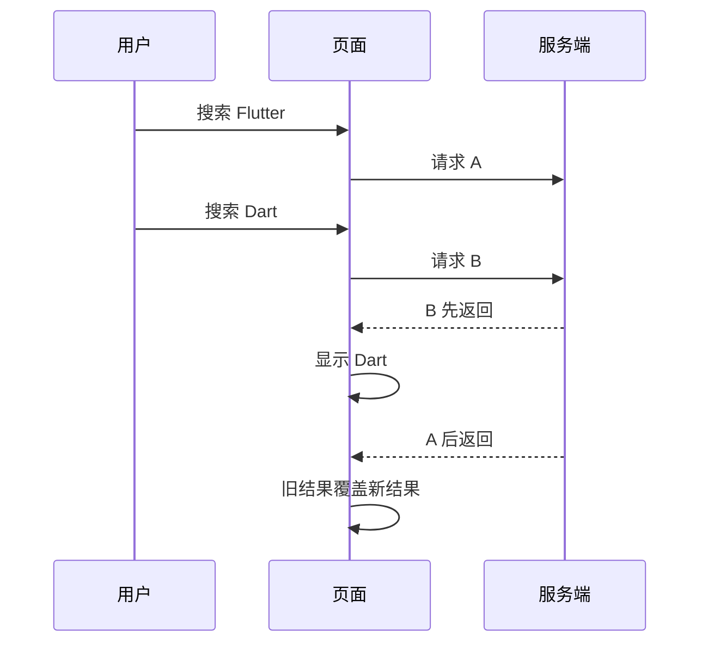

# 接口回来了，为什么旧数据覆盖了新数据？

搜索框输入“Flutter”，接口开始请求。紧接着改成“Dart”，第二个请求也发出去了。

页面先显示 Dart 的结果，过了一会儿却又跳回 Flutter。日志里两个接口都成功，没有报错，代码看起来也只是正常地给列表赋值。

> 核心结论：请求的发出顺序，不等于返回顺序。只要多个异步任务都能修改同一份页面状态，就可能发生竞态。

## 问题是怎么出现的

最常见的代码通常长这样：

```dart
Future<void> search(String keyword) async {
  final result = await searchRepository.search(keyword);
  if (!mounted) return;

  setState(() {
    _items = result;
  });
}
```

每次输入都调用 `search`。问题不在 `setState`，而在于每个请求返回后都有资格修改 `_items`。



网络耗时会受到缓存、连接复用、服务端负载、数据量和重试等因素影响。先发出的请求完全可能后返回。

## `mounted` 为什么解决不了

`mounted` 只回答一个问题：这个 `State` 还在组件树中吗？

上面的两个请求返回时，页面可能一直都在，所以两次 `mounted` 都是 `true`。它能避免页面销毁后调用 `setState`，却无法判断哪个结果更新。

换句话说：

- `mounted` 处理生命周期；
- 请求标识处理异步顺序。

两者不能互相替代。

## 让最后一次搜索生效

对于搜索、筛选、切换 Tab 这类场景，用户通常只关心最后一次操作。可以给请求增加递增版本号：

```dart
int _searchVersion = 0;

Future<void> search(String keyword) async {
  final requestVersion = ++_searchVersion;

  setState(() {
    _loading = true;
    _errorMessage = null;
  });

  try {
    final result = await searchRepository.search(keyword);
    if (!mounted || requestVersion != _searchVersion) return;

    setState(() {
      _items = result;
    });
  } catch (error, stackTrace) {
    logger.error('search failed', error, stackTrace);
    if (!mounted || requestVersion != _searchVersion) return;

    setState(() {
      _errorMessage = '搜索失败，请稍后重试';
    });
  } finally {
    if (mounted && requestVersion == _searchVersion) {
      setState(() {
        _loading = false;
      });
    }
  }
}
```

每次搜索都会生成更大的版本号。请求返回时，只有版本号仍然等于当前值，才有资格更新页面。

注意，数据、错误和加载状态都要做版本判断。否则旧请求虽然不能覆盖列表，却可能提前关闭新请求的 Loading，或者显示已经过期的错误。

## 清空搜索时也要让旧请求失效

用户点击“清空”后，之前的请求可能仍在执行。如果只清空列表，旧请求回来后还会把数据填回去。

```dart
void clearSearch() {
  _searchVersion++;

  setState(() {
    _items = [];
    _loading = false;
    _errorMessage = null;
  });
}
```

递增版本号相当于宣布：此前所有搜索结果都已过期。

## 防抖和取消请求够不够

防抖能减少请求数量，但不能保证已经发出的请求按顺序返回。因此，防抖不是竞态保护。

部分网络库支持取消请求。取消可以节省网络、解析和服务端资源，值得使用，但仍建议保留版本判断：取消可能发生得太晚，请求也可能已经完成。最终是否允许结果更新页面，应该由页面自己的状态规则决定。

Dart 的普通 `Future` 没有通用的强制取消能力。是否能真正取消，要看网络库和底层请求是否提供相应机制。

## 不是所有请求都该“最后一次生效”

版本号方案适合“新操作替代旧操作”的读取场景，但不要到处照搬。

- 搜索、筛选、切换分类：通常只保留最后一次结果。
- 分页加载：每一页都可能需要，应按页码合并、去重并防止重复请求。
- 提交订单、修改资料：页面忽略旧响应，不代表服务端没有执行。需要服务端配合幂等键、数据版本或条件更新保证一致性。

客户端版本号保护的是“页面接受哪个结果”，不是服务端事务。

## 一套实用的排查方法

遇到数据突然回退，可以先记录：

1. 请求编号；
2. 查询参数；
3. 发出时间与完成时间；
4. 是否更新了数据、Loading 或错误状态。

如果日志只打印“接口成功”，很难看出覆盖关系。把同一次请求的编号带进完整链路，顺序问题通常会很直观。

## 最后记住这几点

- 请求先发不代表先回，成功响应也可能已经过期。
- `mounted` 防止生命周期错误，不解决请求竞态。
- 版本判断要同时保护数据、Loading 和错误状态。
- 防抖减少请求，取消节省资源，版本号决定结果是否生效。
- 写请求的一致性必须由服务端协议共同保证。

## 问答复盘

### Q1：两个接口都成功，为什么还会出现错误页面？

**答：** 成功只表示各自完成，不表示返回顺序符合用户操作顺序。后返回的旧请求仍可能覆盖新状态。

### Q2：检查 `mounted` 后还需要请求版本号吗？

**答：** 需要。`mounted` 判断页面是否存活，版本号判断响应是否仍然有效。

### Q3：加了防抖就不会发生竞态了吗？

**答：** 不一定。防抖只能减少请求；只要存在两个已发出的请求，返回顺序仍可能变化。

### Q4：为什么旧请求不能在 `finally` 中关闭 Loading？

**答：** 因为新请求可能仍在执行。旧请求关闭 Loading，会让界面提前表现为加载完成。

### Q5：请求版本号可以保证服务端数据一致吗？

**答：** 不可以。它只控制客户端接受哪个响应；写操作还需要服务端的幂等、版本校验或事务机制。

### Q6：分页列表也应该只接受最后一个请求吗？

**答：** 通常不应该。分页需要按页码管理、合并和去重，不能简单丢弃先发但后返回的有效页面。
