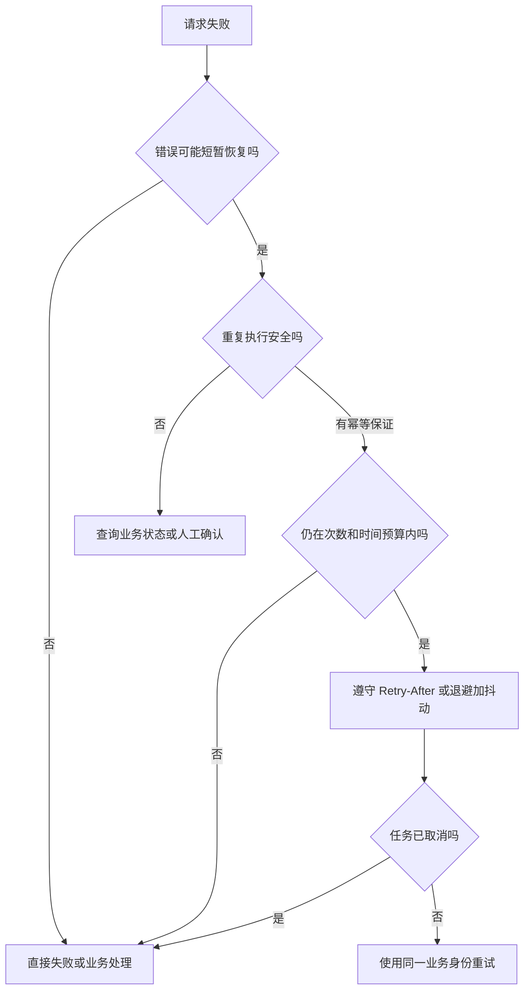

# 网络重试不是多调几次：哪些请求可以安全重试？

接口超时后再调几次，读请求可能只是多耗流量；如果是下单、支付或领取优惠券，第一次已经成功就会制造重复业务。

> 核心结论：只有“错误可能短暂恢复”，并且“重复执行不会改变业务结果”的请求，才适合自动重试。次数只是最后一个参数，幂等性、错误类型、时间预算和取消条件才是前提。

## 先问三个问题

决定重试前，按顺序回答：

1. 这次失败等一会儿可能恢复吗？
2. 原请求可能已经被服务端执行了吗？
3. 即使执行两次，最终业务效果仍然一样吗？

超时时最难判断：客户端没收到响应，只能证明“结果未知”，不能证明服务端没有执行。



## 哪些请求通常可以重试

HTTP 规范把 GET、HEAD、OPTIONS、TRACE 定义为安全方法；安全方法以及 PUT、DELETE 也属于幂等方法。但方法名只是起点，最终要看接口契约：

| 请求 | 自动重试判断 |
|---|---|
| 查询商品、配置等 GET | 通常可以，但接口不能夹带领取、计数等业务写入 |
| 把资料 PUT 为同一目标状态 | 通常可以，仍要处理版本冲突 |
| 删除同一资源 | 最终状态仍是不存在，可重试；第二次响应可能变成 404 |
| 创建订单、支付等 POST | 默认不安全，除非服务端提供可靠幂等机制 |
| PATCH | 取决于语义；“设为 10”可能幂等，“增加 10”通常不是 |

幂等说的是最终效果，不是每次状态码和响应体必须相同。

## 哪些错误值得重试

常见候选包括网络短暂不可达、连接重置，以及 408、429、502、503、504。前提仍是请求可以安全重复，并符合当前 API 契约。

下面这些情况通常不应自动重试：

- 参数或数据格式错误，例如 400、422；
- 权限不足、业务规则拒绝；
- 证书校验失败；
- 用户主动取消；
- 没有幂等保证的写请求；
- 服务端已明确给出不可恢复错误。

401 应进入受控的 Token 刷新流程，限制请求重放次数。409 通常要先获取最新版本并解决冲突，不能原样盲重试。

## POST 怎样做到可以重试

创建订单这类操作需要服务端支持幂等键。客户端在用户第一次提交时生成一次业务键，后续网络重试始终携带同一个键和相同请求内容：

```dart
final pendingOrder = PendingOrder(
  operationId: idGenerator.newId(),
  idempotencyKey: idGenerator.newId(),
  payload: orderPayload,
);

await pendingOrderStore.save(pendingOrder);

await orderApi.createOrder(
  pendingOrder.payload,
  idempotencyKey: pendingOrder.idempotencyKey,
);
```

App 重启后也必须恢复原来的键。每次尝试都生成新键，服务端看到的仍是多个新订单；只有用户明确“再下一单”时才创建新键。

服务端要原子保存幂等键、请求摘要和结果，并拒绝“同键不同内容”。客户端本地 Map 无法覆盖多设备、进程重启和响应丢失。

## 不要固定间隔立即重试

大量客户端固定间隔重试会形成重试风暴。常用策略是指数退避并加入 Jitter（随机抖动）：

```text
upper = min(maxDelay, baseDelay * 2^retryIndex)
delay = random(0, upper)
```

同时限制：

- 最大尝试次数；
- 总 Deadline，而不只是单次超时；
- 单个请求的唯一重试层；
- 页面退出、会话变化和用户取消；
- 网络变化和任务是否仍有意义。

HTTP Client、Repository 和任务队列若各重试三次，最坏会放大成 27 次调用。应明确唯一重试所有者。

服务端返回 `Retry-After` 时应尊重其节奏，但仍受总 Deadline 和取消状态约束。

## 页面生命周期也要纳入重试

商品查询页面退出后，用户通常已不关心结果，应取消退避等待和后续尝试。取消网络等待不代表服务端停止执行，因此写请求仍要靠幂等键和状态查询兜底。

必须跨页面继续的任务，应交给更长生命周期的 Controller 或任务队列，并持久化操作身份和进度。

## 怎样验证重试策略

不要用真实弱网碰运气。通过 Fake Client 和可控时钟验证：

1. 前两次 503、第三次成功，调用次数和延迟符合策略；
2. 400、403 或业务拒绝不会重试；
3. 退避期间取消后不再发送请求；
4. POST 超时后的所有尝试使用同一幂等键；
5. `Retry-After`、最大次数和总 Deadline 能终止流程。

日志至少记录操作 ID、attempt、重试原因、等待时长和最终结果，但不要记录 Token、密码等敏感信息。

## 最后记住这几点

- 超时表示结果未知，不表示服务端没有执行。
- 自动重试需要同时满足“故障可恢复”和“重复执行安全”。
- GET、PUT、DELETE 的规范语义可作为起点，具体仍以 API 契约为准。
- POST 写操作要靠服务端幂等键，重试时必须复用同一个键。
- 使用退避、Jitter、次数、Deadline 和取消共同限制重试。
- 重试只能有一个明确所有者，避免层层放大。

## 问答复盘

### Q1：GET 请求是否一定可以安全重试？

**答：** 不一定。规范语义是只读，但具体接口如果夹带业务写入，就已经破坏了这个前提，仍要以服务端契约为准。

### Q2：DELETE 重试后返回 404，说明它不幂等吗？

**答：** 不说明。幂等关注最终效果，资源重复删除后仍然不存在；每次响应状态可以不同。

### Q3：POST 超时后为什么不能直接再发一次？

**答：** 因为服务端可能已经执行，只是响应丢失。应使用原幂等键重试，或先查询业务状态。

### Q4：500 错误都应该自动重试吗？

**答：** 不应该。只有服务端契约确认它属于瞬时错误，且请求可安全重复时才重试；程序缺陷不会因为多调用几次而修复。

### Q5：为什么指数退避还要加入 Jitter？

**答：** 仅使用相同指数间隔，所有客户端仍可能同时重试。随机抖动可以分散请求波峰。

### Q6：重试时为什么必须复用原来的幂等键？

**答：** 同一个键表示同一次业务意图。换新键会让服务端把重试识别为新的创建或支付操作。

### Q7：页面销毁后，读请求还应该继续重试吗？

**答：** 通常不应该。用户已不再关心页面结果，应取消后续尝试；需要跨页面完成的任务应由更长生命周期的组件管理。
