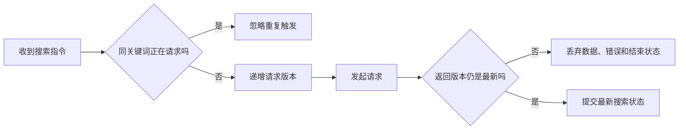

# 连点两次搜索，怎样避免后返回的旧请求覆盖结果？

用户先搜“Flutter”，马上改成“Dart”又点了一次。Dart 请求先回来，页面已经显示正确结果；几秒后 Flutter 请求才结束，却把列表改回了旧内容。

两个接口都成功，错的是客户端让两个响应拥有了同样的更新权限。

> 核心结论：搜索通常采用“最后一次操作生效”（latest-wins）。防抖和取消只能减少无效工作，真正决定结果能否写入页面的，应该是请求身份校验。

## 先决定搜索的并发规则

不是所有“连点两次”都应该用同一种处理方式：

- 同一个关键词重复点击：通常直接复用或忽略正在进行的请求；
- 关键词已经变化：新搜索替代旧搜索，只接受最新结果；
- 下单、支付等写操作：不能照搬 latest-wins，应禁用重复提交，并由服务端保证幂等。

搜索按钮暂时禁用可以挡住鼠标连点，但挡不住键盘提交、下拉刷新、生命周期恢复或其他代码入口。并发规则应该放在统一的 Controller 或状态层，而不是只写在某个按钮上。

## 一次搜索要管住三种状态

很多修复只保护了结果列表：旧响应不能更新数据，却仍能在 `finally` 中关闭 Loading，或者把旧错误显示到新搜索上。

请求身份应同时保护：

- 搜索数据；
- Loading 状态；
- 错误状态。



## 把 latest-wins 写进 Controller

下面的 Controller 用递增版本号标记每次搜索。同关键词正在加载时直接去重；关键词变化后，旧请求即使最后才返回，也不能再修改状态。

```dart
enum SearchStatus { idle, loading, success, failure }

final class ProductSearchController extends ChangeNotifier {
  ProductSearchController(this._repository);

  final SearchRepository _repository;

  int _requestVersion = 0;
  bool _disposed = false;

  SearchStatus status = SearchStatus.idle;
  String keyword = '';
  List<Product> items = const [];
  String? errorMessage;

  Future<void> search(String input) async {
    if (_disposed) return;

    final normalizedKeyword = input.trim();
    if (status == SearchStatus.loading &&
        normalizedKeyword == keyword) {
      return;
    }

    final requestVersion = ++_requestVersion;

    if (normalizedKeyword.isEmpty) {
      keyword = '';
      items = const [];
      status = SearchStatus.idle;
      errorMessage = null;
      _notifyListeners();
      return;
    }

    keyword = normalizedKeyword;
    status = SearchStatus.loading;
    errorMessage = null;
    _notifyListeners();

    try {
      final result = await _repository.search(normalizedKeyword);
      if (!_isCurrent(requestVersion)) return;

      items = result;
      status = SearchStatus.success;
      _notifyListeners();
    } catch (error, stackTrace) {
      debugPrint('search failed: $error\n$stackTrace');
      if (!_isCurrent(requestVersion)) return;

      status = SearchStatus.failure;
      errorMessage = '搜索失败，请稍后重试';
      _notifyListeners();
    }
  }

  bool _isCurrent(int requestVersion) {
    return !_disposed && requestVersion == _requestVersion;
  }

  void _notifyListeners() {
    if (!_disposed) notifyListeners();
  }

  @override
  void dispose() {
    _disposed = true;
    _requestVersion++;
    super.dispose();
  }
}
```

这里没有用一个公共 `finally` 关闭 Loading。只有当前请求才有资格提交 success 或 failure，所以旧请求不能提前结束新请求的加载状态。

清空搜索也会递增版本号，因此此前所有未完成结果都会自然失效。Controller 销毁时同样让版本失效，避免异步返回后通知已经释放的监听者。

## 取消请求为什么仍然值得做

版本号保证正确性，但旧请求仍可能消耗网络、解析和服务端资源。如果所用网络库支持取消，可以在新搜索开始时取消前一个请求。

不过取消不是最终防线：取消可能发生得太晚，请求也可能已进入完成阶段。更稳妥的组合是：

1. 输入联想使用防抖，减少请求数量；
2. 同关键词进行中时去重；
3. 新关键词到来时尽量取消旧请求；
4. 无论取消是否成功，都用版本号校验结果。

Dart 的普通 `Future` 没有统一的强制取消能力，具体做法要看当前网络库公开的取消 API。

## 用“乱序返回”验证，而不是靠手速

这类测试不应该依赖真实网络。使用 `Completer` 控制两个 Future 的完成顺序，故意让第二次搜索先返回：

```dart
test('late old response cannot overwrite latest search', () async {
  final firstResponse = Completer<List<Product>>();
  final secondResponse = Completer<List<Product>>();
  var requestCount = 0;

  final repository = CallbackSearchRepository((keyword) {
    requestCount++;
    return requestCount == 1
        ? firstResponse.future
        : secondResponse.future;
  });
  final controller = ProductSearchController(repository);

  final firstSearch = controller.search('Flutter');
  final secondSearch = controller.search('Dart');

  secondResponse.complete([const Product(name: 'Dart')]);
  await secondSearch;

  firstResponse.complete([const Product(name: 'Flutter')]);
  await firstSearch;

  expect(controller.keyword, 'Dart');
  expect(controller.items.single.name, 'Dart');

  controller.dispose();
});
```

`CallbackSearchRepository` 是把回调包装成 Repository 的测试桩。测试的关键不是这个类，而是主动制造“后发先回”，确认旧响应完成后状态仍保持 Dart。

还应补充三类测试：旧请求失败不能覆盖新成功、旧请求不能关闭新 Loading、清空关键词后旧结果不能重新出现。

## 最后记住这几点

- 搜索通常是 latest-wins，写操作不能直接套用。
- 按钮禁用和防抖只能减少触发，不能独立保证结果正确。
- 请求版本要同时保护数据、Loading 和错误。
- 取消用于节省资源，版本校验负责最终正确性。
- 用可控 Future 稳定复现乱序返回，不要依赖真实网络碰运气。

## 问答复盘

### Q1：同一个关键词连点两次，需要发送两个请求吗？

**答：** 通常不需要。可以忽略第二次触发或复用进行中的请求，避免重复网络和解析工作。

### Q2：禁用搜索按钮后，竞态就解决了吗？

**答：** 没有完全解决。搜索可能还有键盘、刷新或代码调用入口，并发规则应放在统一状态层。

### Q3：为什么不能只保护搜索结果列表？

**答：** 旧请求仍可能关闭新请求的 Loading，或显示过期错误。一次请求拥有的全部 UI 状态都要校验身份。

### Q4：防抖、取消和版本号有什么区别？

**答：** 防抖减少触发，取消减少已经开始的无效工作，版本号决定响应是否仍有权提交状态。

### Q5：页面已经销毁，请求版本号还需要失效吗？

**答：** 需要。Controller 销毁后应拒绝异步结果并停止通知；如果请求可取消，也应由资源所有者执行取消。

### Q6：分页加载也应该只接受最后一个请求吗？

**答：** 通常不应该。分页需要按页码管理并合并有效结果，latest-wins 更适合新查询替代旧查询的场景。

### Q7：怎样稳定测试旧请求后返回？

**答：** 用两个 `Completer` 控制完成顺序，让第二个 Future 先完成，再断言第一个完成后状态没有回退。
