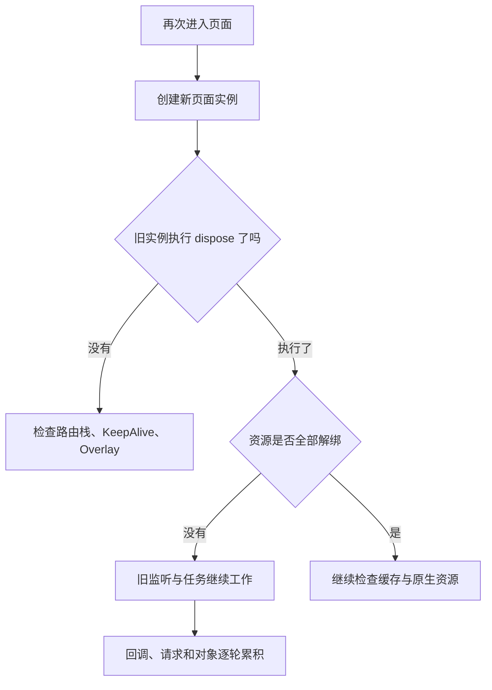

# 页面反复进入退出后越来越卡，先检查哪些资源？

第一次进入订单页很流畅，来回打开十几次后，滚动开始掉帧，接口请求次数变多，日志也像被复制了一样重复输出。重启 App 后又恢复正常。

这不一定是内存泄漏，也可能是监听器重复注册、定时任务叠加，或者页面压根没有销毁。

> 核心结论：先检查旧页面离开后是否仍在工作，再检查对象是否仍被持有。排查重点不是看到多少个 `dispose`，而是每一份有生命周期的资源是否都有明确所有者和对称的释放动作。

## 先确认页面到底有没有销毁

在 `dispose` 中记录页面实例标识，然后固定执行“进入—操作—退出”多轮，确认旧实例何时销毁。

如果 `dispose` 没执行，不要立刻判断 Flutter 有问题。页面可能仍被下面这些结构保留：

- `IndexedStack` 中的 Tab 页面；
- 使用 KeepAlive 的列表或分页页面；
- 嵌套 `Navigator` 中仍在路由栈里的 Route；
- 仍未移除的 `OverlayEntry`。

这些页面继续存在不一定是泄漏，但轮询、动画、相机预览可能仍在运行。此时要根据路由可见性或业务激活状态暂停工作，真正销毁时再释放资源。



## 第一批检查：会自己继续工作的资源

这类问题最容易让页面“越用越忙”：

- `Timer`、轮询任务和延迟回调；
- `StreamSubscription`、WebSocket 和事件总线订阅；
- `ChangeNotifier`、`ValueNotifier` 及其他 `addListener`；
- `WidgetsBindingObserver`、`RouteObserver` 等观察者；
- 网络请求、Isolate 和可取消的异步任务。

典型现象是每进一次页面，同一事件就多执行一次。内存还没明显上涨，CPU、网络和 Rebuild 已经先叠加。

注册时应保存可以取消的句柄。监听回调也尽量使用命名方法，否则后续很容易拿错函数对象，导致 `removeListener` 无效。

```dart
import 'dart:async';

class _OrderPageState extends State<OrderPage>
    with WidgetsBindingObserver {
  late final ScrollController _scrollController;
  StreamSubscription<OrderEvent>? _orderSubscription;
  Timer? _pollTimer;

  @override
  void initState() {
    super.initState();
    WidgetsBinding.instance.addObserver(this);

    _scrollController = ScrollController()
      ..addListener(_handleScroll);
    _orderSubscription = repository
        .watchOrder(widget.orderId)
        .listen(_handleOrderEvent);
    _pollTimer = Timer.periodic(
      const Duration(seconds: 15),
      (_) => _requestRefresh(),
    );
  }

  void _handleScroll() {
    // 根据滚动位置处理页面逻辑
  }

  void _handleOrderEvent(OrderEvent event) {
    if (!mounted) return;
    setState(() => currentOrder = event.order);
  }

  void _requestRefresh() {
    // 请求层还应处理取消、去重和旧结果淘汰
  }

  @override
  void dispose() {
    _pollTimer?.cancel();
    unawaited(_orderSubscription?.cancel());
    _scrollController.removeListener(_handleScroll);
    _scrollController.dispose();
    WidgetsBinding.instance.removeObserver(this);
    super.dispose();
  }
}
```

`mounted` 只能阻止失效页面更新 UI，不能停止 Timer、请求或订阅继续消耗资源。该取消的任务仍然要取消。

## 第二批检查：需要显式释放的对象

页面自己创建的 `AnimationController`、`TextEditingController`、`ScrollController`、`PageController`、`FocusNode` 和各类 `ValueNotifier`，通常应在页面销毁时 `dispose`。

关键判断是“谁拥有它”。Controller 如果由父组件传入，当前页面通常只解除自己的监听；如果由页面创建后交给子组件使用，所有者仍是页面。

相机、播放器、录音、地图和平台视图还会占用 Native、纹理或系统句柄。Dart Heap 稳定时，也要按当前插件 API 检查原生资源是否释放。

## 第三批检查：缓存和大对象引用

图片缓存、列表预加载和尚未 GC 的对象，都可能让内存曲线暂时升高。

需要重点检查：

- 单例、事件总线或闭包是否保存了页面 `State`、`BuildContext`；
- 大图、字节数组、视频帧是否仍被集合或缓存引用；
- `GlobalKey`、Overlay、KeepAlive 是否让整棵页面子树长期存活；
- 缓存是否只有写入，没有容量上限和淘汰策略。

## 怎么证明修复真的有效

在目标真机的 Profile 模式下固定数据和操作步骤，重复进入退出页面，并记录：

1. 每轮事件回调、请求和 Timer 触发次数是否保持稳定；
2. Flutter DevTools Memory 中相关对象数量是否持续增长；
3. 触发或等待垃圾回收后，对比 Heap Snapshot；
4. 通过 Retaining Path 查明是谁仍在持有旧页面；
5. 用 Performance Timeline 对比修复前后的 UI、Raster 帧耗时。

如果 Dart 对象数量稳定，但进程内存或卡顿仍持续增长，还要检查图片、纹理以及插件的 Native 资源。Debug 模式和模拟器适合找功能问题，不适合作为最终性能结论。

## 最后记住这几点

- 先确认旧页面有没有销毁，再检查销毁是否完整。
- 优先查 Timer、Subscription、Listener、Observer 和重复请求。
- Controller 是否释放，取决于资源所有权，不是见到就 `dispose`。
- 页面被缓存时，应在不可见时暂停工作，在真正销毁时释放资源。
- 内存上涨需要用对象数量和引用链证明，不能只看一条总内存曲线。

## 问答复盘

### Q1：页面退出后没有执行 `dispose`，一定是泄漏吗？

**答：** 不一定。路由栈、KeepAlive、IndexedStack 或 Overlay 可能仍在合法持有页面，应先确认页面的预期生命周期。

### Q2：为什么页面越来越卡，但内存变化不明显？

**答：** 可能是监听、Timer 或网络请求逐轮叠加。重复工作会先增加 CPU、网络和 Rebuild，不一定马上表现为明显内存增长。

### Q3：给异步回调加 `mounted` 就够了吗？

**答：** 不够。它只保护 UI 更新，不会取消订阅、请求或计算任务；资源仍要按自身 API 停止和释放。

### Q4：所有传给页面的 Controller 都应该在页面中销毁吗？

**答：** 不应该。谁创建并拥有资源，通常由谁销毁；页面只应解除自己添加的监听。

### Q5：匿名监听为什么容易移除失败？

**答：** `removeListener` 需要同一个回调对象。重新写一个外观相同的闭包，不代表它与注册时是同一对象。

### Q6：Heap Snapshot 没发现旧 State，为什么仍可能越来越卡？

**答：** 问题可能在图片、纹理、相机或播放器等 Native 资源，也可能是缓存和任务量增长，需要结合插件状态与 Timeline 检查。

### Q7：修复后怎样验证不是偶然变快？

**答：** 在同一目标设备、Profile 模式和固定场景下重复多轮，对比回调次数、对象数量、Heap Diff 和帧耗时。
