# Flutter Layer 与合成：从 Layer Tree 到保留式渲染

> 本文聚焦 Paint 之后、Raster 之前的合成结构：Flutter 为什么需要 Layer Tree，不同 Layer 表达什么变化，未重绘的子树如何被保留，以及 Raster Cache 为什么不是“给 Widget 截图后永久复用”。

---

## 一、为什么绘制命令之外还需要 Layer

Canvas 和 DisplayList 可以描述“画什么”，但复杂界面还要表达“这些内容如何组合”：

- 某个子树整体平移或缩放；
- 一组内容共享透明度；
- 子树受到矩形或路径裁剪；
- 一个重绘边界本帧没有变化，可以复用旧结果；
- Flutter 内容需要和 Platform View 共同进入最终画面；
- Engine 需要识别稳定内容，评估是否建立 Raster Cache。

如果每次变化都把整棵 RenderObject Tree 重新 Paint 成一条扁平命令流，局部动画会使大量稳定内容反复记录。Layer Tree 提供了可保留、可组合的中间结构。

### 核心结论

1. RenderObject Tree 负责布局和绘制职责，Layer Tree 负责保存可合成的绘制输出与空间、裁剪、透明度等组合关系，两棵树不一一对应。
2. 只有需要独立合成、重绘隔离或特殊平台内容的区域才形成独立 Layer；不是每个 Widget、Element 或 RenderObject 都拥有一个 Layer。
3. `ContainerLayer` 是可包含子 Layer 的基础类型；Offset、Transform、Opacity 和 Clip 等 Layer 表达不同的合成状态。
4. `PictureLayer` 等内容 Layer 承载绘制记录，现代 Engine 内部实际绘制表示与命名会随版本演进。
5. Framework Layer Tree 与 Engine/GPU 内部合成表示不是同一棵对象树，业务代码不应依赖二者固定一一映射。
6. Retained Rendering 的核心是未变化子树复用既有 Layer/Engine 结果，避免重复 Paint 和重复场景构建工作；它不等于 Raster Cache。
7. Raster Cache 缓存的是某些稳定绘制内容的栅格化结果，是否建立、何时命中和何时淘汰由 Engine 启发式策略决定。
8. Layer 可以减少重绘，却会增加树遍历、内存、纹理、状态切换和合成管理成本；层越多不代表越快。
9. `RepaintBoundary` 是建立绘制隔离和 Layer 边界的常用方式，但只有稳定、昂贵内容与频繁变化内容相邻时才可能受益。
10. Layer 与缓存优化必须在目标真机的 Profile/Release 模式同时观察 UI、Raster、Layer 数、缓存行为、内存和画质。

---

## 二、从 RenderObject Tree 到最终画面

一帧的职责级链路如下：

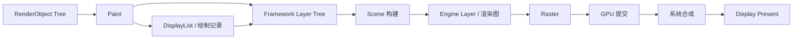

这里至少存在三个不同语境的“合成”：

| 语境 | 含义 |
|---|---|
| Framework Compositing | Paint 期间建立 Layer Tree，表达子树组合关系 |
| Engine Compositing | Engine 消费 Scene/Layer 信息，组织渲染任务与表面 |
| OS Compositor | 操作系统组合应用 Surface、系统 UI、原生视图等内容 |

讨论“合成慢”时必须指出是哪一层。Flutter Layer 数较多、GPU Raster 较慢和系统 Platform View 合成异常，是三类不同问题。

---

## 三、Layer Tree 与 RenderObject Tree 的关系

### 3.1 两棵树不一一对应

普通 RenderObject 可以把内容记录到祖先提供的同一绘制上下文中，不需要独立 Layer。只有在以下场景中才可能建立新 Layer：

- RenderObject 是重绘边界；
- 子树需要独立 Transform、Opacity 或 Clip 合成状态；
- 需要承载 Platform View、Texture 或其他特殊内容；
- Framework/Engine 为特定效果选择合成路径。

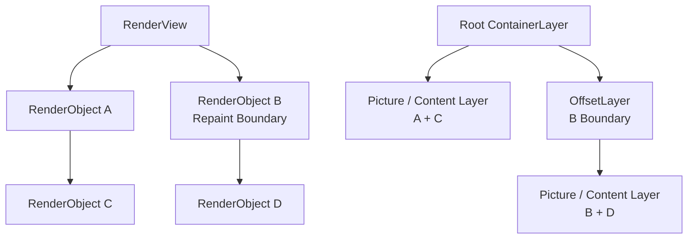

上图只是心智模型。具体 Layer 类型和合并方式取决于 Flutter 版本、RenderObject 属性以及实际绘制路径。

### 3.2 `needsCompositing`

RenderObject 会维护当前子树是否需要合成相关处理的信息。Paint 前的 Compositing Bits 更新阶段把子节点需求向上传播，使父节点知道某些效果是否需要通过 Layer 处理。

这解释了为什么同一个 Widget 在不同子树结构下可能走不同绘制路径：一个子节点是否需要独立合成，可能影响祖先的 Clip、Opacity 或 Transform 如何实现。

`needsCompositing` 属于 Framework 渲染机制，不应在普通业务中手工猜测。需要分析时应锁定 Flutter 版本查看对应 RenderObject 的 Paint 实现。

---

## 四、Layer 基础模型

Framework 中 Layer 表示一段可加入 Scene 的合成内容或状态。可以从两个维度理解：

- **Container Layer**：可以拥有子 Layer，表达树结构和组合状态；
- **Leaf/Content Layer**：承载绘制记录、平台内容或其他最终输入。

### 4.1 Layer 生命周期

Layer 通常经历：

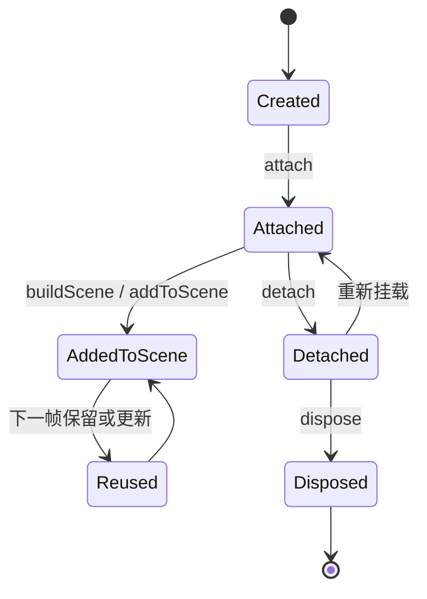

具体内部状态和方法属于版本实现。稳定原则是：Layer 是有父子关系和资源生命周期的对象，不应被任意同时插入多个位置，也不应在仍被渲染树使用时擅自释放。

### 4.2 Layer 不是 GPU Texture

Layer 是 Framework/Engine 用来表达合成关系的逻辑对象。它可能最终对应：

- 一组绘制命令；
- 一个变换或裁剪节点；
- 一个离屏表面；
- 一份 Raster Cache 纹理；
- 一个平台视图或外部纹理引用；
- 仅用于组织子节点的容器。

因此，“增加一个 Layer 就增加一张纹理”不准确；“Layer 只是普通 Dart 对象所以几乎免费”也不准确。实际资源取决于 Layer 类型、内容、后端和当前帧决策。

---

## 五、ContainerLayer：Layer Tree 的容器基础

`ContainerLayer` 可以包含子 Layer，是 Offset、Transform、Opacity、Clip 等常见容器 Layer 的基础。

其核心职责包括：

- 维护 Layer 父子关系；
- 按顺序访问和提交子 Layer；
- 传播 attach、detach、dispose 等生命周期；
- 参与 Scene 构建和保留式复用；
- 聚合子树的合成信息。

Layer 的兄弟顺序会影响最终绘制覆盖关系。后加入的内容通常位于先加入内容之上，但具体平台内容的合成约束还要结合 Platform View 路径分析。

普通业务几乎不需要直接构造 `ContainerLayer`。自定义 RenderObject 需要特殊 Layer 时，应优先使用 `PaintingContext.push...` 或遵循现有 RenderObject 模式，让 Framework 管理旧 Layer 复用和生命周期。

---

## 六、OffsetLayer：重绘边界与局部坐标

`OffsetLayer` 为子树提供平移偏移，是重绘边界常见的承载 Layer。RenderObject 成为 Repaint Boundary 后，其绘制结果可以进入独立 Layer 子树。

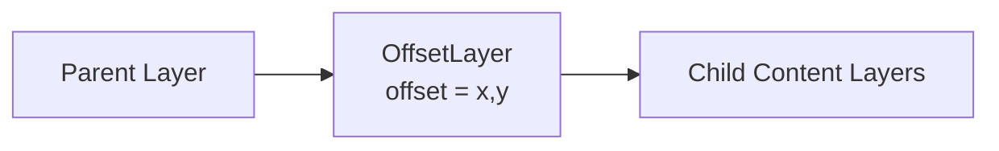

### 6.1 为什么需要 Offset

重绘边界的内容通常以自身局部坐标记录。父布局位置发生变化时，如果内容本身未变，Framework/Engine 有机会只更新 Layer 的 Offset 或祖先 Transform，而不重新执行边界内部 Paint。

例如，一个稳定头像随列表整体滚动：

- 头像内容本身可能不需要重新记录；
- 其 Layer 在新位置参与合成；
- Raster Cache 是否命中仍取决于变换、稳定性和 Engine 策略。

### 6.2 Offset 更新不等于零成本

即使内部内容被保留，仍可能发生：

- Layer Tree 属性更新与遍历；
- Scene 重建或部分更新；
- Raster Cache 坐标和采样处理；
- GPU 合成与像素覆盖；
- 滚动区域中新内容首次 Paint/Raster。

保留式渲染减少的是可避免工作，不会消除每帧显示和合成成本。

---

## 七、TransformLayer：合成阶段表达空间变换

`TransformLayer` 对整个子 Layer 树应用矩阵变换，常见于平移、缩放、旋转和透视。

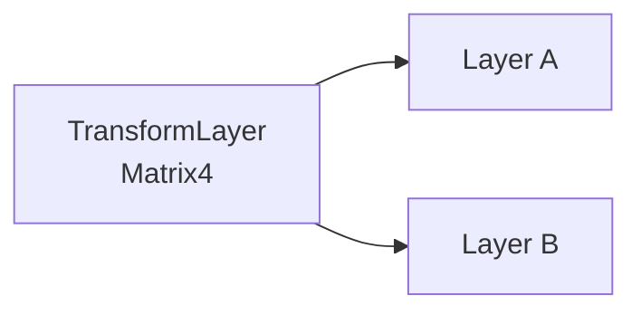

### 7.1 Transform Layer 与 Canvas Transform

| 方式 | 作用对象 | 主要结果 |
|---|---|---|
| Canvas Transform | 后续绘制命令 | 变换被记录进当前绘制内容 |
| TransformLayer | 整个 Layer 子树 | 合成时统一变换子树 |

二者可能产生相同视觉结果，但更新与复用边界不同。如果内容稳定、仅整体矩阵变化，独立 Transform Layer 可能避免子树重新 Paint。

### 7.2 Transform 的代价

- 矩阵每帧变化仍需更新和合成；
- 非整数平移可能影响采样清晰度；
- 缩放可能导致缓存分辨率和画质权衡；
- 透视和复杂变换可能增加 Raster 成本；
- 视觉变换不自动改变 Layout 约束；
- 命中测试需要使用相同变换语义。

具体 Widget 是否使用 Layer、Canvas 变换或其他优化路径会随 Framework 实现变化，不能仅凭 Widget 名称判断。

---

## 八、OpacityLayer：对子树应用整体透明度

`OpacityLayer` 表达对子 Layer 子树应用统一 Alpha。它与给每个绘制命令分别设置半透明颜色不完全等价：重叠区域的视觉混合结果可能不同。

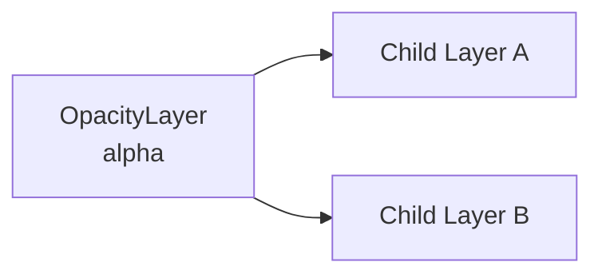

### 8.1 为什么整体透明度更复杂

假设子树中两个不透明圆形互相重叠：

- 分别把两个圆设为 50% Alpha，重叠区会混合两次；
- 先把两个圆作为整体，再把整体设为 50%，重叠结构先完成内部绘制，再统一透明。

为了保持整体语义，后端可能需要中间表面或其他合成策略。是否产生离屏渲染、能否避免额外表面，取决于内容、平台和渲染后端。

### 8.2 不要把 OpacityLayer 当作免费动画

只改变 Layer Alpha 可能避免子树重新 Paint，但仍存在合成、像素填充、缓存和内存带宽成本。大面积半透明内容、嵌套透明或与 Filter 组合时尤其需要真机测量。

`Opacity`、`FadeTransition` 与直接颜色 Alpha 的方案选择将在“渲染性能”模块进一步比较。

---

## 九、ClipLayer：对子 Layer 子树实施裁剪

Framework 中常见裁剪 Layer 包括矩形、圆角矩形和路径裁剪，对应职责可概括为：

| 类型 | 裁剪形状 | 常见复杂度 |
|---|---|---|
| ClipRectLayer | 轴对齐矩形 | 通常最简单 |
| ClipRRectLayer | 圆角矩形 | 需要边缘处理 |
| ClipPathLayer | 任意 Path | 几何与抗锯齿更复杂 |

具体类名和使用路径以目标 Flutter 版本为准。

### 9.1 Layer Clip 与 Canvas Clip

Canvas Clip 记录在某段绘制命令中；ClipLayer 对整个子 Layer 树施加裁剪。若子树包含独立 Layer 或平台内容，Framework 可能需要 Layer 级裁剪语义。

### 9.2 Clip 行为边界

- Clip 不改变 Layout 尺寸；
- Clip 不天然减少子树 Build 或 Layout；
- Clip 外内容是否能在更早阶段被剔除取决于边界信息；
- 复杂 Path、抗锯齿和嵌套裁剪可能增加成本；
- Platform View 对复杂 Clip 的支持和实现路径存在平台差异。

不要为所有圆角组件默认增加复杂裁剪。若子内容本来不会越界，装饰圆角与裁剪是不同需求。

---

## 十、PictureLayer 与绘制内容 Layer

经典 Framework 心智模型中，`PictureLayer` 承载一段由 Canvas 记录的绘制内容。随着 Flutter Engine 从 Picture/Skia 相关路径演进到 DisplayList 与 Impeller，底层表示和类之间的对应关系可能变化。

稳定的理解是：

> 内容 Layer 保存可供 Engine 后续回放的绘制记录及其边界，而容器 Layer 保存这些内容如何组合。

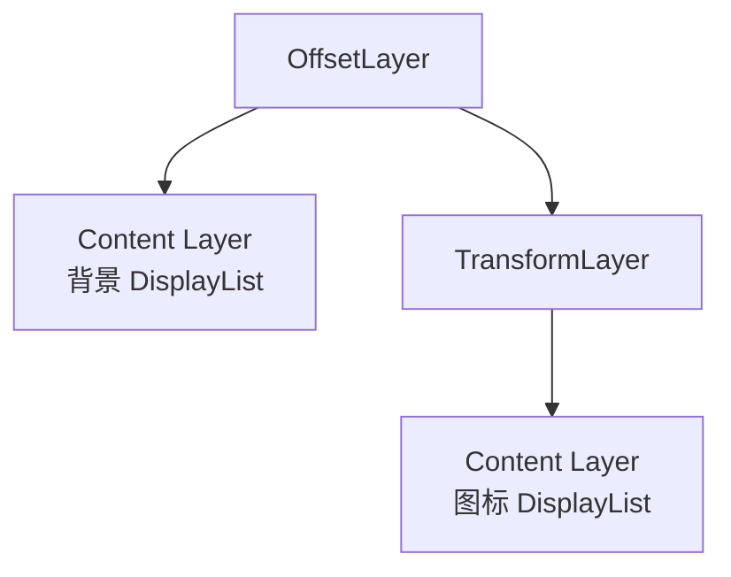

内容边界很重要。过大的边界可能增加 Raster、缓存纹理或无效像素处理；错误地在声明边界外绘制可能造成裁剪、缓存或诊断异常。

业务通常不直接创建 PictureLayer，而是通过 CustomPainter、RenderObject Paint 和 PaintingContext 生成绘制内容。

---

## 十一、PlatformViewLayer：连接两套渲染系统

Platform View 不是普通 Canvas 绘制命令。Android View、iOS UIView 等由平台 UI 和合成系统管理，Flutter 需要在 Layer/Scene 阶段表达其位置、尺寸和组合关系。

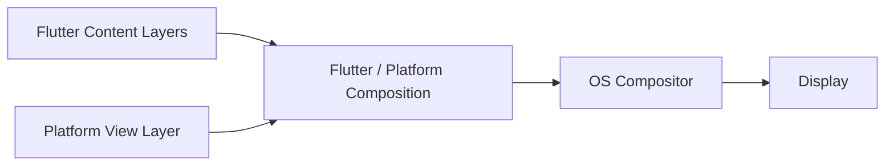

### 11.1 PlatformViewLayer 的职责边界

它通常表达：

- 平台视图标识；
- 几何位置与尺寸；
- Flutter 与原生内容的层级关系；
- 向 Engine/Embedder 提交平台视图合成信息。

它不意味着原生 View 的像素一定被 Flutter Raster Thread 以普通 DisplayList 方式绘制。

### 11.2 平台差异

Android 的 Hybrid Composition、Texture Layer Hybrid Composition 等路径，以及 iOS 的 UIView 合成方式，可能对 Transform、Clip、Opacity、手势、无障碍和性能产生不同限制。

具体默认路径、支持矩阵和优化持续演进。必须按 Flutter 版本、系统版本、控件类型与目标真机验证，不能从 `PlatformViewLayer` 名称推导固定实现。

---

## 十二、Retained Rendering：保留未变化的 Layer 子树

Retained Rendering（保留式渲染）指框架保存上一帧的场景结构，在后续帧复用未变化部分，而不是每帧从零生成所有绘制内容。

### 12.1 与立即模式绘制对比

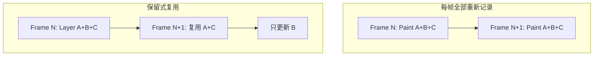

Flutter 的 Widget 声明式更新、RenderObject 脏标记、Repaint Boundary 和 Layer Tree 共同支持这种局部更新模型。

### 12.2 Retained Rendering 不等于页面截图

被保留的可能是：

- Framework Layer 对象与子树关系；
- Engine Layer 句柄或场景节点；
- DisplayList 等绘制记录；
- 在满足条件时建立的 Raster Cache。

只有最后一项接近“复用已栅格化像素”。保留 Layer 结构并不保证内容已经缓存成纹理，也不保证下一帧完全没有 Raster 工作。

### 12.3 复用成立的条件

通常需要：

- 子树未被标记需要 Paint；
- Layer 类型和所有权关系稳定；
- 影响内容的配置没有变化；
- 变换、裁剪等变化可以在祖先 Layer 处理；
- Engine 仍持有可复用的对应结果。

具体复用判定属于版本实现。业务层应通过稳定 Key、合理重绘边界和不可变配置提供可复用条件，而不是依赖内部 Layer 身份。

---

## 十三、Layer 复用的典型链路

以一个边界内内容不变、外部位置变化的组件为例：

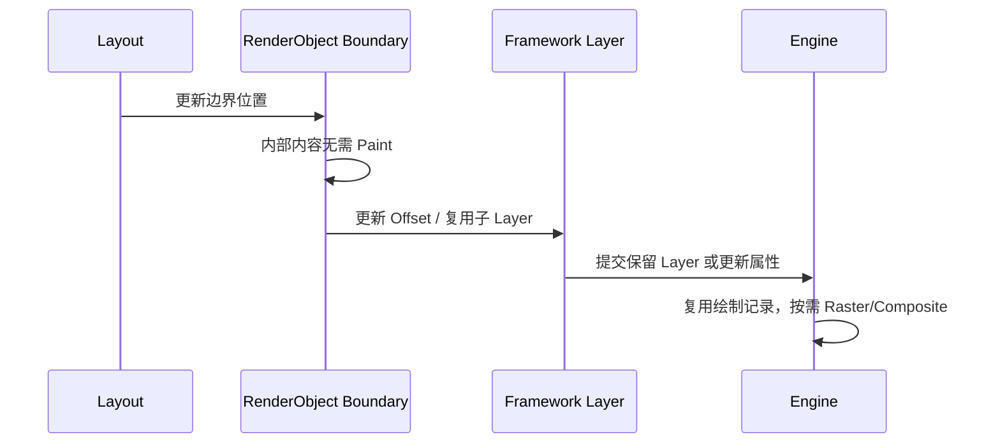

如果内部内容变化：

```text
markNeedsPaint
  → 重绘边界被标记 Dirty
  → PipelineOwner.flushPaint
  → 边界子树重新 Paint
  → 更新内容 Layer / DisplayList
  → Engine 决定 Raster 与缓存策略
```

### 13.1 Layer 身份稳定的重要性

自定义 RenderObject 如果每帧无条件创建全新 Layer，可能破坏 Engine 对旧 Layer 的 retained 复用。正确实现通常会保存 Layer 引用，或使用 `PaintingContext.push...` 的旧 Layer 参数/LayerHandle 模式，让框架更新已有对象。

这些 API 偏底层且随版本演进。除非确实需要自定义合成行为，否则优先组合标准 Widget 和 RenderObject。

---

## 十四、Raster Cache：缓存栅格化结果

Raster Cache 尝试把稳定且重复绘制成本较高的内容缓存成可快速复用的栅格结果，以减少后续帧重复执行复杂绘制。

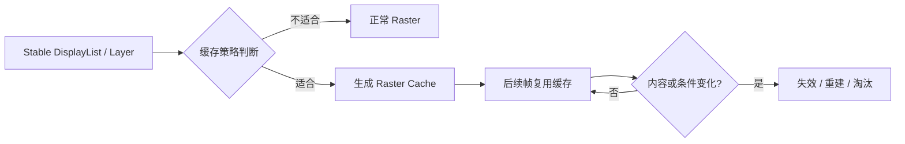

### 14.1 Raster Cache 不由业务强制控制

Engine 通常根据启发式条件决策，例如：

- 内容是否连续多帧稳定出现；
- 绘制是否足够复杂；
- 变换和尺寸是否适合缓存；
- 缓存纹理需要多少内存；
- 当前缓存预算和淘汰压力；
- 后端是否能从缓存中获益。

具体阈值和策略会变化，不应在业务文档中写死“出现 N 帧后必定缓存”。

### 14.2 缓存的收益与代价

| 收益 | 代价 |
|---|---|
| 减少复杂 Path、文字或子树重复 Raster | 首次生成缓存需要额外工作 |
| 稳定动画中可复用像素结果 | 占用 GPU/系统内存 |
| 降低部分 GPU 绘制命令成本 | 变换、尺寸或内容变化可能频繁失效 |
| 改善稳定复杂内容的帧耗时 | 缓存采样可能影响画质或增加带宽 |

### 14.3 哪些场景可能没有收益

- 内容每帧都改变；
- 图形本身非常简单；
- 尺寸和缩放持续变化；
- 缓存面积远大于实际可见区域；
- 列表中大量一次性出现内容竞争缓存；
- 设备内存紧张导致频繁淘汰。

`isComplex`、`willChange` 等只是提示，不能保证缓存建立，也不能替代测量。

---

## 十五、Retained Rendering、RepaintBoundary 与 Raster Cache 的区别

| 机制 | 主要复用内容 | 主要减少的工作 | 是否保证发生 |
|---|---|---|---|
| Dirty 标记 | 未变化 RenderObject 阶段结果 | Layout / Paint 遍历 | 由脏状态决定 |
| RepaintBoundary | 独立 Layer 子树与绘制记录 | 相邻变化导致的重复 Paint | 边界建立后仍取决于变化范围 |
| Retained Rendering | 旧 Layer/Engine 场景结构 | Layer/Scene 重建与内容重复记录 | 取决于 Layer 稳定性 |
| Raster Cache | 栅格化像素结果 | 重复 Raster | Engine 启发式，不保证 |

常见误解是：“加了 `RepaintBoundary`，内容就一定缓存成图片。”正确链路是：边界先提供独立 Paint/Layer 单元，Engine 再根据稳定性和成本决定是否建立 Raster Cache。

---

## 十六、Layer 合成成本来自哪里

Layer 的成本不能只用“数量”概括。需要同时考虑面积、类型、重叠、更新频率和后端实现。

### 16.1 Framework 与 CPU 成本

- Layer 对象创建、更新和树遍历；
- Scene 构建与属性提交；
- 复杂边界和矩阵计算；
- Layer 频繁替换导致 retained 复用失败；
- 过多小边界增加管理开销。

### 16.2 GPU 与内存成本

- 离屏表面或缓存纹理分配；
- 多层重叠导致 Overdraw；
- 大面积透明混合消耗内存带宽；
- 纹理采样、缩放和颜色混合；
- Clip、Filter、Backdrop 与 Shader 组合；
- 缓存上传、失效和淘汰。

### 16.3 系统合成成本

- Platform View 与 Flutter Surface 组合；
- 多 Surface 或 Overlay 限制；
- 原生视图动画、裁剪和透明；
- Android/iOS 系统合成器与驱动差异。

### 16.4 不能只看 Layer 数量

10 个覆盖全屏、带模糊和透明的 Layer，可能比 100 个很小、稳定且不重叠的 Layer 更昂贵。Layer Count 适合作为线索，不是性能结论。

---

## 十七、RepaintBoundary 的正确使用方式

### 17.1 适合添加边界的场景

- 父区域每帧动画，子区域复杂但稳定；
- 子区域频繁重绘，周围大面积内容稳定；
- 复杂图表与轻量选中指示器更新频率不同；
- 列表中的某个媒体/动画区域需要隔离相邻 Paint。

```dart
RepaintBoundary(
  child: ExpensiveStaticChart(data: chartData),
)
```

### 17.2 不适合盲目添加的场景

- 子树本身每帧都全部变化；
- Paint 很简单；
- 边界面积巨大但只有少量内容；
- 列表每项都加边界导致 Layer 和缓存压力；
- 真正瓶颈位于 Build、Layout 或同步业务计算；
- Raster 成本来自边界内部的大图和 Filter。

### 17.3 边界位置如何选择

边界应该包围“更新频率一致”的绘制单元：

```text
错误倾向：一个边界包住稳定背景 + 每帧动画 + 大图
更合理：稳定背景 | 动画前景 | 大图，各自按测量结果决定边界
```

边界过大导致局部变化重绘过多；边界过碎则增加 Layer 和合成管理成本。

---

## 十八、工程案例：图表十字线与稳定曲线

图表包含两类内容：

- 数据曲线、网格与坐标轴：数据不变时稳定，但绘制较复杂；
- 手指移动的十字线和 Tooltip：每个 Pointer Event 更新。

错误结构：

```dart
CustomPaint(
  painter: ChartPainter(
    data: data,
    pointer: pointer,
  ),
)
```

每次指针移动都可能重新记录整张图表。

按更新频率拆分：

```dart
Stack(
  children: [
    RepaintBoundary(
      child: CustomPaint(
        painter: ChartDataPainter(data: data),
        size: chartSize,
      ),
    ),
    CustomPaint(
      painter: ChartPointerPainter(pointer: pointer),
      size: chartSize,
    ),
  ],
)
```

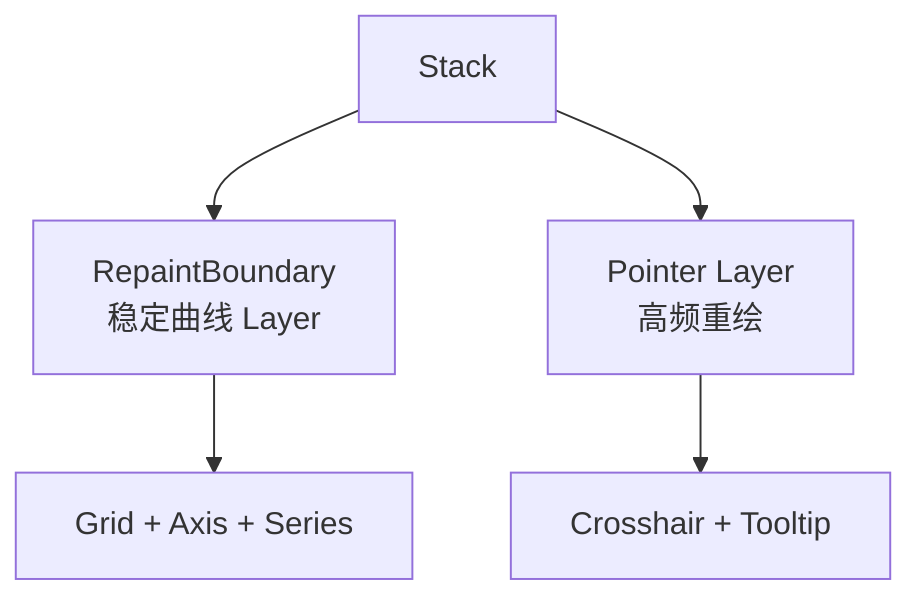

### 18.1 预期收益

指针移动时，稳定曲线所在边界有机会复用旧绘制结果，只重绘前景指针区域。

### 18.2 必须验证的代价

- 是否新增过多 Layer；
- 稳定曲线是否真的昂贵；
- 前景透明覆盖是否增加 Raster 成本；
- 图表尺寸或缩放变化是否让缓存频繁失效；
- Tooltip 是否越界导致边界和重绘区域扩大；
- 低端设备内存是否承受缓存纹理。

如果曲线只有几条简单线段，拆层成本可能高于收益。

---

## 十九、常见错误与误区

### 19.1 “一个 Widget 对应一个 Layer”

错误。Widget 对应 Element，只有部分 RenderObject/绘制操作形成 Layer。Layer Tree 通常比 Widget Tree 稀疏，且关系不一一对应。

### 19.2 “Layer 就是一张缓存图片”

错误。Layer 是合成结构节点，可能只是 Transform、Clip 或容器。只有特定情况下才对应离屏表面或 Raster Cache。

### 19.3 “RepaintBoundary 越多越流畅”

错误。边界会增加 Layer、内存和合成成本。它只适合隔离更新频率不同且 Paint 成本足够高的区域。

### 19.4 “没有 Paint 就没有 Raster”

不准确。Layer 内容虽然未重新 Paint，位置、Transform、Opacity 或系统合成变化仍可能需要 Raster/Composite；缓存是否可直接复用取决于后端条件。

### 19.5 “Raster Cache 命中后没有任何 GPU 成本”

错误。缓存仍需纹理采样、变换、混合和写入目标表面，只是避免了原始复杂内容的重复栅格化。

### 19.6 “OpacityLayer 必然创建 saveLayer”

不能作绝对结论。实际离屏和合成策略取决于内容、后端与 Flutter 版本，应通过 Trace 和目标设备验证。

### 19.7 “Framework Layer 与 Engine Layer 一一对应”

错误。Framework 构建逻辑 Layer Tree，Engine 可能合并、展开、缓存或映射为不同的内部渲染结构，具体实现不是稳定契约。

---

## 二十、如何观察 Layer 与合成问题

### 20.1 DevTools 与调试能力

可以组合使用：

- Performance View：区分 UI 与 Raster 超预算；
- Timeline：查看 Paint、Raster 和相关事件；
- Repaint Rainbow：观察哪些区域持续重绘；
- Layer Tree/Inspector 相关诊断：查看边界与 Layer 结构；
- Raster Cache 相关 Trace/调试标记：观察命中和生成；
- 平台 GPU/System Trace：分析系统合成和 Platform View。

具体开关、事件名与可用平台会随 Flutter/DevTools 版本变化，应以当前工具为准。

### 20.2 诊断顺序

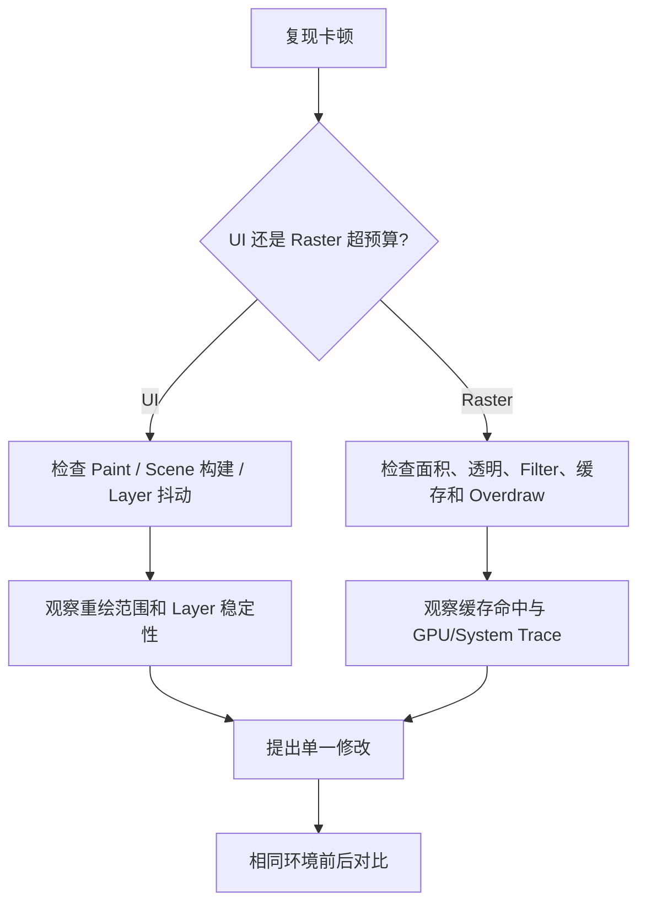

### 20.3 需要记录的环境

- Flutter/Dart 与应用提交；
- Android/iOS 版本和设备；
- Profile 或 Release 模式；
- Skia/Impeller 等实际后端；
- 刷新率和设备温控状态；
- Layer 数、缓存和内存数据；
- 页面数据规模与操作脚本；
- Platform View 类型和合成模式。

---

## 二十一、测试与验证

### 21.1 视觉正确性

Layer 拆分可能改变 Clip、Opacity、BlendMode 和覆盖顺序。应使用 Golden Test 和真机截图验证：

- 透明内容重叠；
- Clip 边缘；
- Transform 后边界；
- 不同设备像素比；
- Platform View 前后层级；
- 深色模式和动态字体不会意外扩大绘制区域。

### 21.2 交互与语义

视觉 Layer 变化不应破坏 Hit Test 与 Semantics Tree。特别检查：

- Transform 后点击坐标；
- Clip 外区域是否仍错误响应；
- Platform View 与 Flutter 手势竞争；
- TalkBack/VoiceOver 焦点顺序；
- Opacity 为零的内容是否符合产品的可交互和可访问性语义。

### 21.3 性能对照实验

以添加 RepaintBoundary 为例：

1. 固定设备、版本、数据和交互脚本；
2. 记录优化前 UI/Raster P50、P95、P99；
3. 记录 Layer 数、重绘范围和内存；
4. 只添加一个候选边界；
5. 重复同样测量；
6. 检查首次缓存生成是否引入尖峰；
7. 验证滚动、缩放和页面切换场景；
8. 无稳定收益则移除边界。

不要只看平均 FPS。短时 Raster Cache 构建尖峰、P99 卡顿和内存增长可能被平均值掩盖。

---

## 二十二、方案选择

| 目标 | 优先手段 | 主要代价 |
|---|---|---|
| 隔离稳定内容与高频动画 | 经测量的 RepaintBoundary | Layer 和内存增加 |
| 整体移动稳定子树 | Transform/Offset 合成路径 | 合成与采样成本 |
| 整体透明动画 | Opacity/FadeTransition | 可能的离屏和带宽成本 |
| 限制子 Layer 可见范围 | 合适形状的 Clip | Clip 与抗锯齿成本 |
| 嵌入原生控件 | Platform View | 平台合成、手势和功能限制 |
| 复用复杂稳定绘制 | 提供稳定 Layer/缓存条件 | 缓存内存和失效成本 |
| 简单静态内容 | 保持普通绘制 | 不引入额外 Layer 管理 |

最合理的 Layer 结构通常不是“最少”或“最多”，而是与内容更新频率、几何边界和合成语义一致。

---

## 二十三、源码阅读入口

下列符号适合串联 Layer 与合成主链路。私有符号和精确类关系会变化，阅读时应记录 Flutter 版本和提交范围。

| 主题 | 建议关注的符号 |
|---|---|
| 合成位更新 | `PipelineOwner.flushCompositingBits` |
| Paint 与 Layer | `PaintingContext`、`pushLayer`、各类 `push...` |
| Layer 基础 | `Layer`、`ContainerLayer` |
| 常见容器 | `OffsetLayer`、`TransformLayer`、`OpacityLayer` |
| 裁剪 Layer | `ClipRectLayer`、`ClipRRectLayer`、`ClipPathLayer` |
| 内容 Layer | `PictureLayer` 或当前版本对应绘制内容路径 |
| 平台视图 | `PlatformViewLayer` 与 Embedder 合成路径 |
| Scene 构建 | `Layer.buildScene`、`addToScene`、`SceneBuilder` |
| 重绘边界 | `RenderObject.isRepaintBoundary`、`PaintingContext.repaintCompositedChild` |
| Engine 复用 | `EngineLayer`、`SceneBuilder.addRetained` 等当前版本路径 |

推荐阅读链路：

```text
PipelineOwner.flushCompositingBits
  → PipelineOwner.flushPaint
  → PaintingContext / Repaint Boundary
  → Framework Layer Tree
  → Layer.buildScene / SceneBuilder
  → Engine Layer 与 Raster Cache
  → Raster / GPU / OS Compositor
```

---

## 二十四、总结

理解 Flutter Layer 与合成，需要记住：

1. Layer Tree 保存可合成的绘制输出和组合关系，不与 Widget 或 RenderObject 一一对应。
2. ContainerLayer 组织子树，Offset、Transform、Opacity、Clip 等 Layer 表达不同合成状态。
3. PictureLayer 等内容 Layer 承载绘制记录，具体底层表示会随 DisplayList、Skia、Impeller 演进。
4. PlatformViewLayer 连接 Flutter 与原生视图合成系统，不是普通 Canvas 图片。
5. Retained Rendering 复用稳定 Layer/Scene 结构，Raster Cache 则复用部分栅格化像素，两者不能混淆。
6. RepaintBoundary 提供独立 Paint/Layer 单元，但不保证 Raster Cache，也不优化 Build 和 Layout。
7. Layer 复用需要稳定身份、合理边界和未变化内容；每帧创建新 Layer 会削弱 retained 收益。
8. 合成成本同时来自 CPU 树管理、GPU 混合与纹理、内存带宽以及系统 Platform View 合成。
9. Layer 数量只是诊断线索，面积、重叠、类型和更新频率通常更关键。
10. 所有优化都应在目标真机、实际渲染后端和稳定脚本下做前后对照。

> Layer 的价值不是把界面切得越碎，而是为更新频率不同的绘制内容建立正确的保留与合成边界。

---

## 二十五、问答复盘

### Q1：Layer Tree 与 RenderObject Tree 是一一对应的吗？

**答：** 不是。多数 RenderObject 可以共享同一绘制记录，只有重绘边界、独立合成效果或平台内容等场景才形成额外 Layer。

### Q2：OffsetLayer 为什么有助于复用？

**答：** 边界内部内容可在局部坐标中保持不变，父级只更新 Offset 参与合成，从而有机会避免内部子树重新 Paint。但 Scene 更新和 GPU 合成仍有成本。

### Q3：Canvas Transform 与 TransformLayer 有什么区别？

**答：** Canvas Transform 进入当前绘制命令；TransformLayer 对整个 Layer 子树统一变换。后者在内容稳定、矩阵变化时更有机会复用子树，但具体路径取决于 Framework 实现。

### Q4：OpacityLayer 是否一定意味着创建离屏缓冲？

**答：** 不能作绝对判断。整体透明语义可能需要中间表面，但后端可以根据内容采用不同优化。应在目标版本和设备上查看 Trace。

### Q5：Retained Rendering 与 Raster Cache 有什么区别？

**答：** Retained Rendering 主要复用 Layer、Scene 和绘制记录结构；Raster Cache 复用栅格化像素。前者成立不代表后者一定建立。

### Q6：添加 RepaintBoundary 后为什么 Raster 仍可能很慢？

**答：** 边界只隔离 Paint。内部大图、模糊、阴影或复杂混合仍需 Raster；缓存也可能未建立、失效或面积过大。

### Q7：一个页面 Layer 数量很多，是否可以直接判定性能差？

**答：** 不能。还要看 Layer 类型、面积、重叠、更新频率、缓存和后端。数量是线索，不能代替 UI/Raster Timeline 与内存证据。

### Q8：为什么自定义 RenderObject 不应每帧创建新 Layer？

**答：** Layer 身份不稳定可能让 Framework/Engine 无法复用上一帧对应结果，并增加对象与 Scene 构建成本。应遵循 Layer 更新和旧 Layer 复用模式。

### Q9：PlatformViewLayer 是否表示原生 View 被 Flutter Raster 成普通纹理？

**答：** 不一定。它表达平台视图合成信息，实际可能走平台视图层级、纹理或混合路径，取决于平台、模式和 Flutter 版本。

### Q10：如何验证一个 Layer 拆分是否值得保留？

**答：** 固定真机环境和交互脚本，对比拆分前后的 UI/Raster 分位数、重绘范围、Layer 数、缓存行为、内存与视觉正确性。没有稳定收益就应移除。

---

## 二十六、延伸知识

- **渲染性能**：`saveLayer()`、Opacity、BackdropFilter、ImageFilter、Clip 与阴影成本。
- **Skia 与 Impeller**：渲染图、Pass、Pipeline、资源上传与 Shader 策略。
- **Platform View**：Android/iOS 合成路径、手势、无障碍与生命周期。
- **自定义 RenderObject**：`isRepaintBoundary`、LayerHandle、Paint 与命中测试。
- **性能工具**：DevTools Timeline、Raster Cache Trace、Perfetto 与 Instruments。
- **内存治理**：图片、缓存纹理、离屏 Surface 与 GPU 资源预算。
