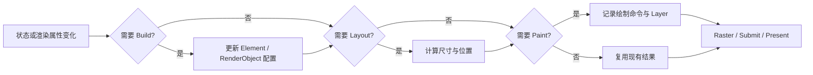
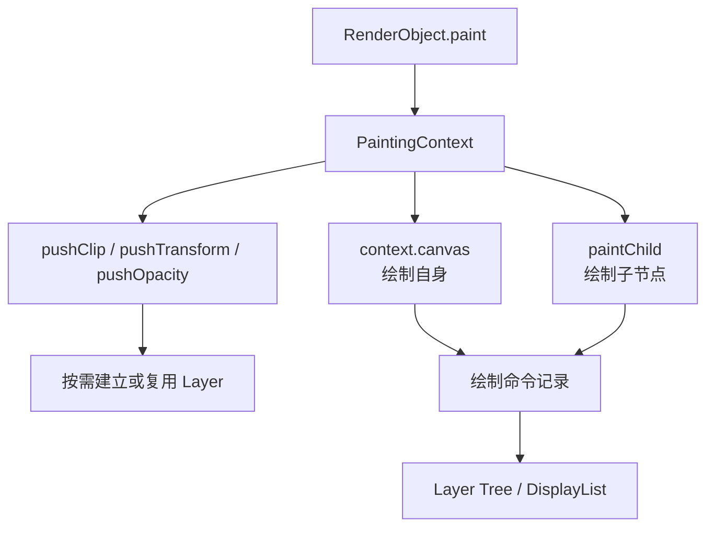
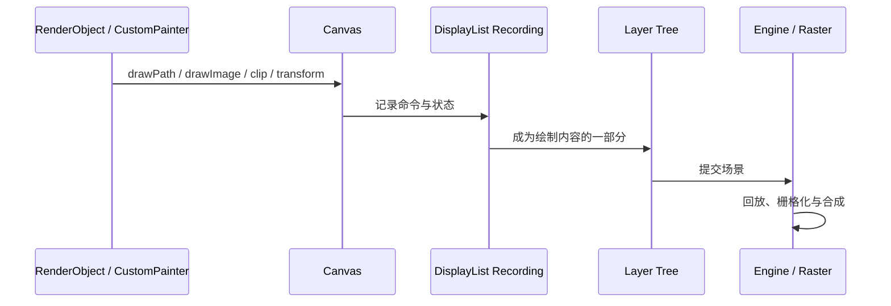
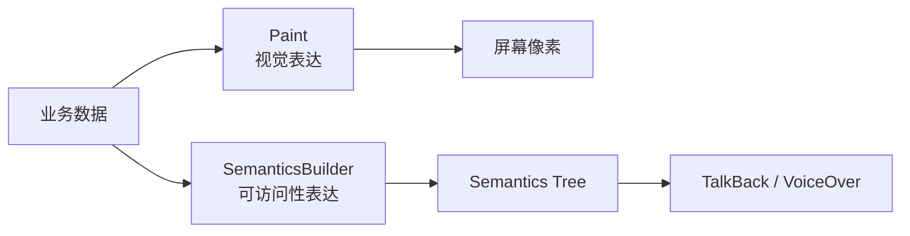

# Flutter Painting：从 Canvas 绘制到 CustomPainter 交互与语义

> 本文聚焦 Flutter Framework 的 Paint 阶段：RenderObject 如何通过 `PaintingContext` 记录绘制命令，Canvas 状态为何必须成对管理，以及如何构建同时具备视觉、交互、性能和无障碍能力的 `CustomPainter`。

---

## 一、为什么“能画出来”还不够

Flutter 提供了 `CustomPaint` 和 `CustomPainter`，几行代码就能画线、圆和路径。但生产级自定义绘制还要回答更多问题：

- 绘制发生在帧流水线的哪个位置？
- Canvas 是真实屏幕画布，还是命令记录接口？
- `PaintingContext` 为什么不只传一个 Canvas？
- `save()`、`restore()`、Clip 和 Transform 如何共同影响后续命令？
- `shouldRepaint()` 返回 `false` 是否意味着永远不会再次执行 `paint()`？
- 动画为什么可以绕过 Widget Build 直接触发重绘？
- 自定义图形如何响应点击，而不是只显示像素？
- 屏幕阅读器如何理解一条 Canvas 绘制的折线？
- Paint 慢和 Raster 慢应该如何区分？

### 核心结论

1. Paint 阶段主要记录绘制描述，不负责在 UI Isolate 上逐像素着色；真正栅格化发生在后续 Engine/GPU 路径。
2. RenderObject 通过 `PaintingContext` 绘制自己和子节点；Canvas 是 Context 暴露的绘制命令接口。
3. `Paint` 描述一次绘制操作的样式，`Path` 描述几何轮廓，两者职责不同。
4. Canvas 的 Transform、Clip 等属于状态栈，必须使用 `save()`/`restore()` 限制作用域，避免污染后续绘制。
5. Framework 会把绘制命令记录为适合后续回放的表示；现代 Flutter Engine 通常使用 DisplayList，但具体存储与优化属于版本实现。
6. `shouldRepaint()` 只比较新旧 Painter 配置，返回 `false` 不是 `paint()` 永不执行的强保证。
7. `Listenable repaint` 可以直接触发 Paint，避免动画每帧经过 Build。
8. 自定义绘制不会自动获得业务级命中区域和 Semantics，交互与无障碍必须显式设计。
9. `CustomPainter` 优化要同时观察 Paint 记录成本、Layer 数量、Raster 成本、内存和画质，不能只看 `paint()` 调用次数。

---

## 二、Painting 在帧流水线中的位置

状态变化可能依次触发 Build、Layout 和 Paint，但三者不是同义词。



常见变化对应关系如下：

| 变化 | Build | Layout | Paint |
|---|:---:|:---:|:---:|
| StatefulWidget 的文本配置变化 | 通常需要 | 可能需要 | 可能需要 |
| RenderObject 颜色变化 | 不一定 | 通常不需要 | 需要 |
| RenderObject 宽高变化 | 不一定 | 需要 | 通常需要 |
| Painter 的动画进度变化 | 可绕过 | 取决于尺寸是否变化 | 需要 |
| 相邻节点重绘且没有隔离边界 | 不一定 | 不一定 | 可能连带发生 |

Paint 完成只代表 Framework 已生成本帧的绘制描述。DisplayList、Layer Tree 还需要被 Engine 消费并栅格化，最后才能形成屏幕像素。

---

## 三、从 RenderObject 到 PaintingContext

### 3.1 RenderObject 的 Paint 入口

RenderObject 在 Paint 阶段接收 `PaintingContext` 和相对父节点的 Offset。职责级示意如下：

```dart
@override
void paint(PaintingContext context, Offset offset) {
  final canvas = context.canvas;
  canvas.drawRect(
    offset & size,
    Paint()..color = const Color(0xFF1565C0),
  );
}
```

这里的 `offset & size` 创建一个以 `offset` 为左上角、以 `size` 为尺寸的 Rect。实际自定义 RenderObject 还需正确实现布局、命中测试与语义，不能只实现 Paint。

### 3.2 PaintingContext 为什么存在

如果 Paint 只需要 Canvas，框架可以直接传 Canvas。`PaintingContext` 的价值在于它同时协调：

- 当前绘制命令的记录；
- 子 RenderObject 的绘制；
- 绘制边界与 Layer；
- Clip、Transform、Opacity 等可能影响合成的操作；
- 当前记录对象的结束与后续 Layer 组织。



绘制子 RenderObject 时应使用 `context.paintChild(child, childOffset)`，不能直接调用子节点的 `paint()`。前者让框架有机会处理重绘边界和 Layer。

### 3.3 `context.canvas` 的作用域

`PaintingContext.canvas` 适合记录当前绘制上下文中的普通绘制命令。某些需要合成边界的效果应使用 Context 的 `push...` 能力或对应 RenderObject/Widget，让框架管理 Layer 生命周期。

不要假设一次 `paint()` 期间始终对应同一个底层记录对象。框架可能因子节点重绘边界或 Layer 操作切换记录目标，具体细节属于版本实现。

---

## 四、Canvas：命令接口与状态机

### 4.1 Canvas 不是屏幕像素数组

在 Flutter Paint 阶段，Canvas 更适合被理解为绘制命令接口：

```dart
canvas.drawRect(rect, paint);
canvas.drawPath(path, paint);
canvas.drawImage(image, offset, paint);
```

这些调用描述“画什么”，通常会被记录下来，后续由渲染后端回放和栅格化。它们不是业务 Dart 代码逐像素写显存。

### 4.2 Canvas 状态包含什么

Canvas 维护状态栈，典型状态包括当前坐标变换矩阵和当前 Clip 区域。变换和裁剪会影响其后的绘制命令，直到 `restore()` 恢复之前状态。

```dart
canvas.save();
canvas.translate(center.dx, center.dy);
canvas.rotate(angleRadians);
canvas.drawRect(
  Rect.fromCenter(center: Offset.zero, width: 80, height: 32),
  paint,
);
canvas.restore();
```

### 4.3 必须成对恢复状态

错误示例：

```dart
// 错误：旋转状态会继续影响后面的文字。
canvas.translate(center.dx, center.dy);
canvas.rotate(angleRadians);
canvas.drawRect(localRect, shapePaint);
canvas.drawParagraph(paragraph, labelOffset);
```

修复方式是用 `save()` 和 `restore()` 建立最小作用域。复杂绘制可配合 `try/finally`，避免中途异常或提前返回破坏状态平衡：

```dart
canvas.save();
try {
  canvas.clipRect(plotBounds);
  drawSeries(canvas);
} finally {
  canvas.restore();
}
```

---

## 五、Paint：一次绘制操作的样式

`Paint` 描述 Canvas 如何描边、填充和采样。

| 属性 | 作用 | 注意点 |
|---|---|---|
| `color` | 纯色 | 与 Shader 等设置的组合以当前 API 契约为准 |
| `style` | 填充或描边 | `PaintingStyle.fill/stroke` |
| `strokeWidth` | 描边宽度 | 受 Transform 缩放影响 |
| `strokeCap` | 线段端点 | 圆头会延伸视觉边界 |
| `strokeJoin` | 线段连接 | 尖角可能受 Miter 限制影响 |
| `shader` | 渐变或自定义着色 | 创建和复用策略需测量 |
| `blendMode` | 源与目标的混合方式 | 可能影响离屏和 Raster 成本 |
| `maskFilter` | 模糊等效果 | 大面积使用成本较高 |
| `filterQuality` | 图片采样质量提示 | 收益和成本依后端、缩放场景而异 |

### 5.1 Paint 可以复用，但不要共享可变语义

Painter 内可以保存稳定 Paint，减少每帧重复配置：

```dart
class GridPainter extends CustomPainter {
  GridPainter()
      : gridPaint = Paint()
          ..color = const Color(0x1F000000)
          ..strokeWidth = 1;

  final Paint gridPaint;

  @override
  void paint(Canvas canvas, Size size) {}

  @override
  bool shouldRepaint(covariant GridPainter oldDelegate) => false;
}
```

但 `Paint` 是可变对象。若同一实例被多个分支临时修改，后续绘制可能继承错误样式。只有测量证明对象分配值得优化时，才应增加复杂的共享与复位逻辑。

### 5.2 透明度不只是颜色 Alpha

给 Paint 设置半透明颜色，通常表示当前命令与目标内容混合；对一组复杂内容应用整体透明度，则可能需要独立合成或离屏处理。两者视觉结果和成本不总是相同。

`Opacity`、`saveLayer()`、BlendMode 的详细成本属于“渲染性能”模块。Painting 阶段只需先建立边界：不要为了“透明”随意添加 `saveLayer()`。

---

## 六、Path：描述几何，不描述样式

Path 可以包含直线、圆弧、贝塞尔曲线和多个子路径。它只描述轮廓，最终如何显示由 Paint 决定。

```dart
final path = Path()
  ..moveTo(20, 80)
  ..cubicTo(80, 10, 140, 150, 220, 60);

canvas.drawPath(
  path,
  Paint()
    ..color = const Color(0xFF00695C)
    ..style = PaintingStyle.stroke
    ..strokeWidth = 4
    ..strokeCap = StrokeCap.round,
);
```

### 6.1 Path 的常见能力

- `moveTo`：移动当前点，不绘制连线；
- `lineTo`：添加直线；
- `quadraticBezierTo`：二次贝塞尔曲线；
- `cubicTo`：三次贝塞尔曲线；
- `arcTo` / `addArc`：添加圆弧；
- `close`：连接当前子路径的终点与起点；
- `addRect`、`addOval`、`addRRect`：添加规则轮廓；
- `fillType`：控制多个轮廓相交时的填充规则。

### 6.2 Path 不是命中测试的自动答案

视觉 Path 和交互区域可以不同。细折线如果只使用几像素宽的几何命中区域，触控体验会很差。工程上通常定义更宽的逻辑容差，并在多个候选冲突时使用最近点或层级规则。

Path 的 `getBounds()` 只是轴对齐包围盒，不等同于精确可见区域；`contains()` 适合填充区域判断，也不自动等同于描边宽度命中。

---

## 七、Clip：限制绘制区域，而不是布局尺寸

Canvas Clip 影响后续绘制的可见区域，不会改变 RenderObject 的 Layout 尺寸，也不会自动改变命中测试范围。

```dart
canvas.save();
canvas.clipRRect(
  RRect.fromRectAndRadius(
    Offset.zero & size,
    const Radius.circular(8),
  ),
);
canvas.drawImageRect(image, sourceRect, Offset.zero & size, imagePaint);
canvas.restore();
```

### 7.1 Clip 的工程边界

- Clip 后的命令仍需要被 Framework 记录；后端能否快速剔除取决于几何和实现；
- 复杂 Path Clip 通常比简单 Rect Clip 更难处理；
- 抗锯齿可改善边缘，但有额外成本；
- Clip 不等于 `saveLayer()`，但某些组合效果可能引入额外渲染路径；
- 只为“保险”添加 Clip 可能增加无意义成本。

是否昂贵必须在目标后端和设备测量，不能使用“所有 Clip 都慢”或“Clip 完全免费”的绝对结论。

---

## 八、Transform：改变坐标系，不改变布局结果

Canvas Transform 改变后续绘制命令使用的坐标空间：

```dart
canvas.translate(dx, dy);
canvas.rotate(radians);
canvas.scale(scaleX, scaleY);
canvas.transform(matrix4.storage);
```

Transform 不会让父 RenderObject 重新计算这个图形的 Layout 尺寸。一个布局尺寸为 100 × 100 的节点被放大两倍后，视觉内容可能超出原布局边界。

### 8.1 绘制坐标与事件坐标必须一致

如果图形使用自定义矩阵绘制，命中测试需要：

1. 保存或重建同一变换矩阵；
2. 对输入坐标应用逆矩阵，转换回图形局部坐标；
3. 在局部坐标中执行几何判断；
4. 处理矩阵不可逆的边界。

只改变 Canvas，不同步命中测试，会产生“看得见但点不到”或“点在空白处却命中”的问题。

Widget 层的 `Transform` 是否参与命中测试还受配置影响；应核对当前 Flutter API 的 `transformHitTests` 等契约。

---

## 九、DisplayList：绘制命令如何交给 Engine

现代 Flutter Engine 通常使用 DisplayList 表达一组绘制命令和状态变化。可以把它理解为适合跨阶段保存、分析和回放的绘制记录，而不是屏幕位图。



命令记录使 Framework 与 Raster 阶段职责分离，也使绘制内容可随 Layer 保留和复用。Engine 还可基于边界和命令特征做剔除或后端优化。

DisplayList 的具体操作集合、存储方式、优化以及与 Skia/Impeller 的衔接会随 Flutter 版本变化。业务代码应依赖 Canvas、CustomPainter 和 RenderObject 等公开契约。

“Paint 指令更少就一定更快”也不成立。一个大面积模糊命令可能比许多简单线段的 Raster 成本高，必须分别测量 UI Paint 与 Raster。

---

## 十、CustomPaint 与 CustomPainter 的职责

### 10.1 CustomPaint 是 Widget 配置

`CustomPaint` 可提供背景 Painter、Child、前景 Painter、无 Child 时的建议尺寸，以及缓存相关提示。概念绘制顺序为：

```text
painter（背景）
  → child
  → foregroundPainter（前景）
```

Painter 应在分配给 `CustomPaint` 的 Canvas/Size 契约内工作。绘制越界可能受到父节点、Clip 和合成边界影响，也会让重绘与命中范围难以推断。

### 10.2 CustomPainter 是绘制委托

`CustomPainter` 的核心扩展点包括：

```dart
abstract class CustomPainter {
  void paint(Canvas canvas, Size size);
  bool shouldRepaint(covariant CustomPainter oldDelegate);

  bool? hitTest(Offset position);
  SemanticsBuilderCallback? get semanticsBuilder;
  bool shouldRebuildSemantics(covariant CustomPainter oldDelegate);
}
```

这是职责级签名摘录，构造参数、注解和未来扩展应以项目当前 Flutter SDK 为准。

### 10.3 `size` 从哪里来

Painter 不决定自身 Layout 尺寸。`size` 来自承载它的 RenderObject 布局结果：有 Child 时受 Child 与父约束影响；无 Child 时 `CustomPaint.size` 是建议尺寸，仍需满足父约束。

不要在 Painter 中通过屏幕宽度猜测实际 Canvas 尺寸，应使用传入的 `size`。

---

## 十一、`shouldRepaint`：比较配置，而不是预测所有重绘

当新 Painter 实例替换旧实例时，Framework 调用 `shouldRepaint(oldDelegate)` 判断配置变化是否要求重绘。

```dart
class ProgressPainter extends CustomPainter {
  const ProgressPainter({required this.progress, required this.color});

  final double progress;
  final Color color;

  @override
  void paint(Canvas canvas, Size size) {}

  @override
  bool shouldRepaint(covariant ProgressPainter oldDelegate) {
    return progress != oldDelegate.progress || color != oldDelegate.color;
  }
}
```

### 11.1 常见错误

始终返回 true 会放弃配置比较机会，但是否构成问题仍需测量。另一个更隐蔽的问题是只比较可变 List 引用：调用者原地修改同一 List 时，比较无法发现内容变化。

输入应建模为不可变快照，或者携带稳定版本号与等价比较策略。

### 11.2 返回 false 的边界

`shouldRepaint()` 返回 false 只表示“新旧 Painter 配置不要求重绘”。以下情况仍可能执行 `paint()`：

- 承载对象尺寸变化；
- 祖先或绘制边界需要重绘；
- Painter 的 `repaint` Listenable 通知；
- 框架因其他原因重新创建绘制记录。

所以 `paint()` 必须是可重复执行的纯绘制过程，不能依赖“只调用一次”。

---

## 十二、使用 Listenable 绕过每帧 Build

动画只改变绘制参数、不改变 Widget 或 Layout 时，可以把 `Animation<double>` 等 Listenable 传给 `CustomPainter` 的 `repaint` 参数。

```dart
class PulsePainter extends CustomPainter {
  PulsePainter({required this.animation}) : super(repaint: animation);

  final Animation<double> animation;
  final Paint dotPaint = Paint()..color = const Color(0xFF00897B);

  @override
  void paint(Canvas canvas, Size size) {
    final radius = 8 + animation.value * 12;
    canvas.drawCircle(size.center(Offset.zero), radius, dotPaint);
  }

  @override
  bool shouldRepaint(covariant PulsePainter oldDelegate) {
    return animation != oldDelegate.animation;
  }
}
```

State 仍要正确创建和释放 `AnimationController`。这条路径减少的是每个动画 Tick 对 Build 的依赖，不代表 Raster 免费；大面积模糊或复杂路径仍可能超预算。

---

## 十三、完整实践：可交互折线图

生产组件应让 Paint、Hit Test 和 Semantics 共用同一份 Geometry。下面用精简代码展示关键结构。

### 13.1 不可变模型与几何

```dart
@immutable
class ChartPoint {
  const ChartPoint({required this.label, required this.value});

  final String label;
  final double value;
}

List<Offset> resolveOffsets(List<ChartPoint> points, Rect bounds) {
  if (points.isEmpty) return const <Offset>[];

  final maxValue = points
      .map((point) => point.value)
      .fold<double>(0, (max, value) => value > max ? value : max);
  final safeMax = maxValue <= 0 ? 1.0 : maxValue;

  return List<Offset>.generate(points.length, (index) {
    final xRatio = points.length == 1 ? 0.5 : index / (points.length - 1);
    final yRatio = (points[index].value / safeMax).clamp(0.0, 1.0);
    return Offset(
      bounds.left + bounds.width * xRatio,
      bounds.bottom - bounds.height * yRatio,
    );
  }, growable: false);
}
```

真实图表还要处理负值、空范围、时间轴、格式化和 RTL。示例仅用于说明 Painting 协作关系。

### 13.2 Painter 实现

```dart
class LineChartPainter extends CustomPainter {
  LineChartPainter({
    required List<ChartPoint> points,
    required this.selectedIndex,
    required this.onPointHit,
    required this.textDirection,
  }) : points = List<ChartPoint>.unmodifiable(points);

  final List<ChartPoint> points;
  final int? selectedIndex;
  final ValueChanged<int> onPointHit;
  final TextDirection textDirection;

  final Paint _linePaint = Paint()
    ..color = const Color(0xFF00796B)
    ..style = PaintingStyle.stroke
    ..strokeWidth = 3
    ..strokeCap = StrokeCap.round
    ..strokeJoin = StrokeJoin.round;
  final Paint _pointPaint = Paint()..color = const Color(0xFF00796B);
  final Paint _selectedPaint = Paint()..color = const Color(0xFFD84315);

  Rect _bounds(Size size) =>
      Rect.fromLTWH(16, 12, size.width - 32, size.height - 28);

  @override
  void paint(Canvas canvas, Size size) {
    final bounds = _bounds(size);
    final offsets = resolveOffsets(points, bounds);
    if (offsets.isEmpty) return;

    final path = Path()..moveTo(offsets.first.dx, offsets.first.dy);
    for (final point in offsets.skip(1)) {
      path.lineTo(point.dx, point.dy);
    }

    canvas.save();
    try {
      canvas.clipRect(bounds.inflate(8));
      canvas.drawPath(path, _linePaint);
      for (var index = 0; index < offsets.length; index++) {
        final selected = index == selectedIndex;
        canvas.drawCircle(
          offsets[index],
          selected ? 6 : 4,
          selected ? _selectedPaint : _pointPaint,
        );
      }
    } finally {
      canvas.restore();
    }
  }

  @override
  bool? hitTest(Offset position) {
    // hitTest 没有 Size 参数。生产实现应由共享 Geometry 提供
    // 当前尺寸对应的坐标，或在外层 GestureDetector 中统一处理。
    return null;
  }

  @override
  SemanticsBuilderCallback get semanticsBuilder {
    return (Size size) {
      final offsets = resolveOffsets(points, _bounds(size));
      return List<CustomPainterSemantics>.generate(points.length, (index) {
        final point = points[index];
        return CustomPainterSemantics(
          rect: Rect.fromCircle(center: offsets[index], radius: 24),
          properties: SemanticsProperties(
            label: '${point.label}，${point.value}',
            button: true,
            selected: index == selectedIndex,
            textDirection: textDirection,
            onTap: () => onPointHit(index),
          ),
        );
      }, growable: false);
    };
  }

  @override
  bool shouldRepaint(covariant LineChartPainter oldDelegate) {
    return !listEquals(points, oldDelegate.points) ||
        selectedIndex != oldDelegate.selectedIndex;
  }

  @override
  bool shouldRebuildSemantics(covariant LineChartPainter oldDelegate) {
    return shouldRepaint(oldDelegate) ||
        textDirection != oldDelegate.textDirection;
  }
}
```

### 13.3 为什么命中测试更适合共享 Geometry

`CustomPainter.hitTest()` 只接收位置，不接收 Size。虽然可以保存最近一次 Paint 计算的坐标，但这会引入“命中依赖上次绘制”的隐式状态。

更稳健的方案是：

1. 由 Widget 根据约束和数据生成不可变 `ChartGeometry`；
2. Painter 使用 Geometry 绘制；
3. GestureDetector 使用同一 Geometry 选择最近点；
4. Semantics Builder 使用同一 Geometry 生成区域。

这样可以避免视觉、点击和无障碍区域分别计算后发生漂移。

---

## 十四、自定义命中测试

### 14.1 命中测试解决什么问题

Paint 只产生视觉结果，命中测试回答“输入坐标是否属于这个交互目标”。常见对象包括图表数据点、手写轨迹、地图区域、自定义旋钮和画布编辑器节点。

### 14.2 命中测试设计原则

1. 使用逻辑触控范围，而不是照搬可见线宽；
2. 多目标重叠时定义层级、距离或最近点规则；
3. Transform 后将输入坐标转换到同一坐标系；
4. Clip 视觉范围与命中范围保持产品语义一致；
5. 不在命中遍历中执行昂贵全量搜索；
6. 数据量大时使用空间索引、分桶或二分结构；
7. 鼠标悬停、触控、手写笔的容差可以不同。

### 14.3 GestureDetector 与 Painter hitTest 如何选择

| 方案 | 优点 | 适用场景 |
|---|---|---|
| `CustomPainter.hitTest` | 几何和 Painter 靠近，可参与 CustomPaint 命中 | 简单图形目标 |
| 外层 `GestureDetector` | 手势竞技、拖拽、缩放能力完整 | 复杂手势与状态协调 |
| 自定义 RenderObject | 精确控制布局、绘制、命中和语义 | 高复用基础组件或编辑器 |

外层 GestureDetector 仍要把事件坐标映射到图表局部空间，并使用与 Paint 相同的 Geometry。

---

## 十五、自定义绘制 Semantics

### 15.1 为什么 Canvas 内容默认不可理解

屏幕阅读器读取的是 Semantics Tree，不会通过像素识别业务含义。Canvas 上画出的折线、按钮或刻度，如果没有 Semantics，辅助技术可能只看到一个空白区域。



视觉和语义必须来自同一业务模型，但不必一一映射像素。复杂图表可以提供整体摘要、关键趋势、当前选中点和可操作数据点。

### 15.2 `semanticsBuilder` 与 `shouldRebuildSemantics`

`semanticsBuilder` 根据当前 Size 生成 `CustomPainterSemantics` 列表，每项包含区域和语义属性。`shouldRebuildSemantics()` 判断新旧 Painter 替换时是否需要重建这些描述。

仅颜色变化且语义不变时，`shouldRepaint()` 可以为 true，而 `shouldRebuildSemantics()` 为 false。标签或选中状态变化时则需要重建语义。

### 15.3 Semantics 工程要求

- Label 描述业务含义，不描述“这里画了一个蓝色圆”；
- 状态使用 selected、enabled、checked 等语义属性；
- 操作提供 onTap、increase、decrease 等对应能力；
- 区域足够稳定，避免焦点每帧跳动；
- 顺序符合阅读逻辑；
- 动画连续数值避免每帧播报；
- TalkBack 与 VoiceOver 都需要真机验证。

自定义 Semantics API 会随 Flutter 演进，属性签名和废弃项应以目标 SDK 为准。

---

## 十六、Paint、Layer 与 Raster 的性能边界

| 问题 | 发生位置 | 典型原因 |
|---|---|---|
| Paint 记录慢 | UI Isolate | 大量 Dart 循环、复杂 Path 构造、重复文本布局 |
| Layer/合成复杂 | Framework / Engine | 过多边界、Clip、Opacity、平台视图组合 |
| Raster 慢 | Raster/GPU | 大图、模糊、阴影、复杂混合、离屏表面 |

### 16.1 避免在 `paint()` 中做业务计算

`paint()` 不应解析 JSON、请求网络、同步读库、排序大型集合或更新业务状态。大型数据可预处理为绘制模型；几何依赖最终 Size 时，可缓存由 Size 和数据版本共同决定的 Geometry。

### 16.2 Path 是否应该缓存

Path 缓存有收益的前提是构造成本可观、数据和尺寸稳定、命中率高且失效逻辑可控。简单 Path 每帧重建可能比维护复杂缓存更合适，必须用 Timeline 和内存数据验证。

### 16.3 `isComplex` 与 `willChange`

`CustomPaint` 提供与缓存有关的提示：内容复杂且相对稳定时可能有利；内容即将持续变化时不宜期待稳定缓存。

它们是提示，不是命令，也不保证后端一定建立缓存。错误标记可能增加缓存尝试、内存或失效成本，只有真机测量证明确有收益时才使用。

---

## 十七、测试与验证方法

### 17.1 Geometry 单元测试

把坐标换算、最近点选择和坐标范围抽为纯函数，覆盖空数据、单点、全零、负值、极端 Size、重叠点、Transform 正逆映射和浮点边界。

### 17.2 Golden Test

Golden Test 适合稳定视觉输出，但要固定 Flutter 版本、字体、设备像素比、Surface Size 和平台环境。抗锯齿、图片和 Shader 可能需要合理容差。Golden 通过不证明交互和 Semantics 正确。

### 17.3 命中与 Semantics 测试

命中测试至少覆盖点中心、触控容差边界、重叠区域、Clip 外区域、Transform 后坐标、空数据和尺寸变化。

Widget Test 可启用 Semantics，验证 Label、状态、操作和区域。自动化测试后仍需在 Android TalkBack 与 iOS VoiceOver 真机检查焦点顺序和播报内容。

### 17.4 性能验证

在目标真机的 Profile 或 Release 模式：

1. 固定 Flutter 版本、设备、刷新率和数据规模；
2. 使用 DevTools Timeline 录制相同操作；
3. 分别观察 UI Paint 与 Raster 事件；
4. 打开重绘可视化确认重绘范围；
5. 对比缓存、边界或效果简化前后的 P50/P95/P99；
6. 同时记录 Layer 数、内存、画质和功耗；
7. 在目标平台实际使用的 Skia/Impeller 配置下复测。

不能在 Debug 模式根据肉眼感受得出最终性能结论。

---

## 十八、常见误区

### 18.1 “Canvas 调用就是立即画到屏幕”

不准确。Framework 通常记录绘制命令，Engine 后续栅格化并提交，系统再完成合成与呈现。

### 18.2 “`shouldRepaint` 返回 false 就绝不会调用 `paint`”

不准确。它只比较新旧 Painter 配置；尺寸、祖先、重绘边界和 repaint Listenable 等因素仍可能触发 Paint。

### 18.3 “Clip 能限制布局和点击范围”

不准确。Canvas Clip 限制视觉绘制，布局尺寸和命中测试需要各自处理。

### 18.4 “Transform 后点击坐标会自动匹配”

直接操作 Canvas 矩阵时，自定义命中逻辑必须使用对应逆变换。只有特定上层组件配置才会协助变换命中。

### 18.5 “自定义绘制天然比 Widget 树快”

不成立。CustomPainter 可以减少大量细粒度节点，但会把几何、语义、命中、缓存和维护责任交给业务。普通 UI 使用标准组件通常更可靠。

### 18.6 “语义节点应该对应每一个可见图元”

不一定。语义应服务用户任务。数千个数据点逐一暴露会让辅助技术不可用，应提供摘要、聚合和可操作关键点。

---

## 十九、方案选择

| 需求 | 优先方案 | 原因 |
|---|---|---|
| 常规布局和装饰 | 标准 Widget | 自动获得布局、命中和语义能力 |
| 少量纯视觉绘制 | CustomPainter | API 简洁，适合背景、进度和图形 |
| 高频绘制动画 | CustomPainter + repaint Listenable | 可绕过每帧 Build |
| 复杂手势画布 | GestureDetector + 共享 Geometry/Painter | 手势与绘制职责可分离 |
| 自定义布局、绘制和命中协议 | 自定义 RenderObject | 获得完整渲染生命周期控制 |
| 大规模场景或游戏 | 成熟游戏/图形框架 | 需要场景管理、资源、输入和循环能力 |

选择 CustomPainter 的理由应是“绘制模型更适合批量命令表达”，而不是为了减少 Widget 文件数量。

---

## 二十、源码阅读入口

下列符号可以串联 Painting 主链路。它们包含公开 API 与 Framework 内部实现，阅读时应锁定 Flutter SDK 版本和提交范围。

| 主题 | 建议关注的符号 |
|---|---|
| Paint 管线刷新 | `PipelineOwner.flushPaint` |
| RenderObject 绘制 | `RenderObject._paintWithContext`、`paint` |
| 绘制上下文 | `PaintingContext`、`paintChild`、各类 `push...` 方法 |
| CustomPaint 渲染对象 | `RenderCustomPaint` |
| Painter 决策 | `CustomPainter.paint`、`shouldRepaint` |
| 命中测试 | `CustomPainter.hitTest`、`RenderCustomPaint` 命中路径 |
| 自定义语义 | `semanticsBuilder`、`shouldRebuildSemantics` |
| 绘制接口 | `Canvas`、`Paint`、`Path` |

推荐阅读路径：

```text
PipelineOwner.flushPaint
  → RenderObject Paint 路径
  → PaintingContext
  → RenderCustomPaint.paint
  → CustomPainter.paint
  → Canvas 命令记录
  → Layer / Scene 提交
```

内部私有符号和精确调用顺序可能变化，业务代码不能依赖它们。

---

## 二十一、总结

1. Paint 位于 Layout 之后、Raster 之前，主要负责记录绘制描述并组织 Layer。
2. PaintingContext 协调自身绘制、子节点绘制和 Layer 操作，Canvas 是其命令接口。
3. Paint 负责样式，Path 负责几何，二者应分开建模。
4. Clip 和 Transform 属于 Canvas 状态，必须控制作用域并同步考虑命中测试。
5. DisplayList 是现代 Flutter Engine 常见的绘制记录表示，但具体实现属于版本边界。
6. `shouldRepaint()` 比较新旧配置，不是 Paint 生命周期的绝对开关。
7. repaint Listenable 可让纯绘制动画避开每帧 Build，但不会消除 Paint 和 Raster 成本。
8. 自定义绘制必须同时设计视觉、Geometry、命中测试和 Semantics。
9. 性能优化需要区分 Paint 记录、Layer 合成和 Raster，并在目标真机验证。

> CustomPainter 的价值不是“绕过 Flutter 自己画”，而是在 Flutter 渲染契约内，用更直接的绘制命令表达复杂视觉，同时主动承担交互、语义和性能边界。

---

## 二十二、问答复盘

### Q1：PaintingContext 与 Canvas 的职责有什么区别？

**答：** Canvas 提供绘制命令和状态栈；PaintingContext 还负责子节点绘制、重绘边界与 Layer 协调。RenderObject 应使用 `paintChild()` 绘制子节点。

### Q2：调用 `canvas.drawPath()` 后，像素是否已经写入屏幕？

**答：** 通常没有。Paint 阶段先记录绘制描述，后续 Engine 执行 Raster、GPU 提交和系统呈现后，用户才看到像素。

### Q3：`Paint` 和 `Path` 为什么要分开？

**答：** Path 描述几何轮廓，Paint 描述填充、描边、颜色和混合方式。同一 Path 可以用不同 Paint 绘制。

### Q4：Canvas Transform 会改变 RenderObject 的 Layout 尺寸吗？

**答：** 不会。它只改变后续绘制坐标系。视觉内容可能超出布局边界，命中测试也必须处理对应坐标变换。

### Q5：`shouldRepaint()` 返回 false 后，为什么 `paint()` 仍可能执行？

**答：** 它只判断新旧 Painter 配置。尺寸、祖先重绘、边界变化或 repaint Listenable 都可能导致 Paint。

### Q6：动画 Painter 为什么使用 `super(repaint: animation)`？

**答：** Animation 是 Listenable，变化时可以直接标记 RenderCustomPaint 重绘，避免每个 Tick 都经由 `setState()` 触发 Build。它不保证 Raster 成本降低。

### Q7：视觉上只有 3 px 的折线，命中半径应该也是 3 px 吗？

**答：** 通常不应该。触控目标需要更宽的逻辑容差，并在重叠候选中选择最近点或最高层级。

### Q8：Canvas Clip 后，Clip 外区域是否自动无法点击？

**答：** 不会自动保证。Clip 约束视觉绘制，命中逻辑必须单独遵循相同业务范围，布局尺寸也不会改变。

### Q9：CustomPainter 画出的图表为什么需要单独实现 Semantics？

**答：** 屏幕阅读器读取 Semantics Tree，而不是识别像素。Painter 应从同一业务模型生成摘要、标签、状态和操作。

### Q10：如何判断一个自定义绘制优化是否有效？

**答：** 在目标真机的 Profile/Release 模式固定数据和操作，对比 UI Paint、Raster、掉帧分位数、Layer 数、内存与画质。只减少 `paint()` 次数不能证明整体性能提升。

---

## 二十三、延伸知识

- **Layer 与合成**：Layer Tree、保留式渲染、Layer 复用与 Raster Cache。
- **渲染性能**：`saveLayer()`、Opacity、BackdropFilter、Clip、阴影与 Shader 成本。
- **自定义 RenderObject**：布局协议、ParentData、Paint、命中测试和 Semantics 生命周期。
- **文本绘制**：TextPainter、Paragraph、字体回退、基线与文本缓存。
- **图片绘制**：解码尺寸、`drawImageRect`、九宫格、颜色空间与内存。
- **无障碍测试**：Semantics Tree、TalkBack、VoiceOver 与焦点顺序。
