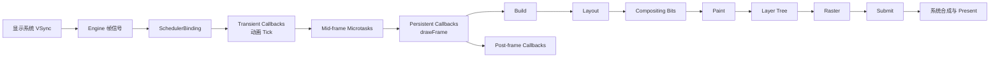
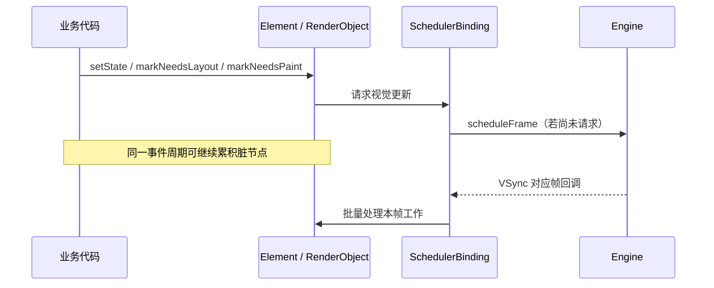
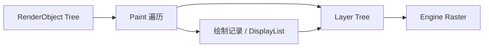
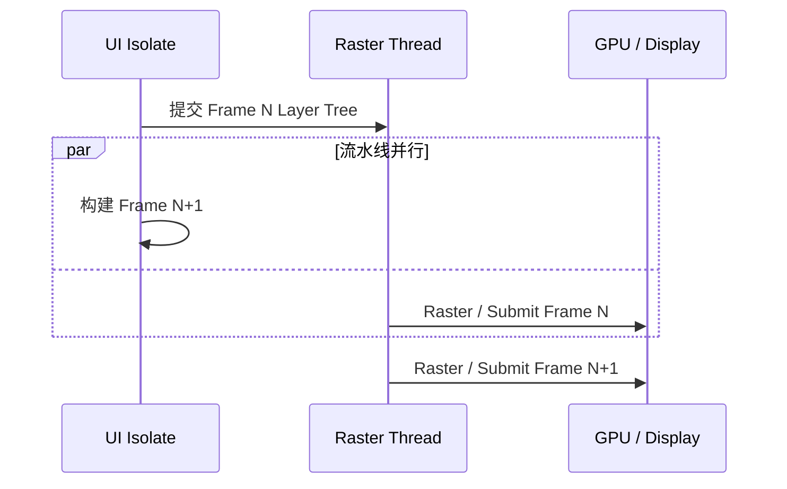
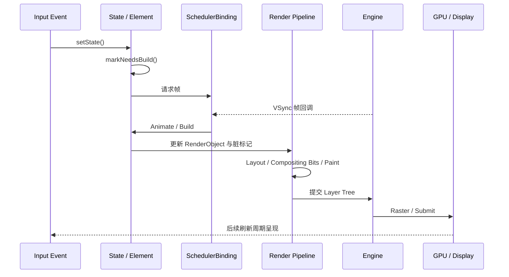

# Flutter 帧流水线：从 VSync 调度到屏幕呈现

> 本文解决一个核心问题：状态发生变化后，Flutter 如何把工作安排到合适的帧，并最终生成屏幕像素？理解这条链路，才能区分 Rebuild、Relayout、Repaint、Composite 与 Raster，避免把所有卡顿都归因于 `build()`。

---

## 一、为什么要理解帧流水线

业务代码通常只做两件事：修改状态和声明 Widget。屏幕更新却需要跨越 Framework、Engine、渲染后端、GPU 与操作系统显示系统。

当页面卡顿时，只知道“这一帧慢了”还不够。需要继续判断：

- Dart 同步业务是否阻塞了 UI Isolate；
- Build 是否遍历了过大的 Element 子树；
- Layout 是否发生重复测量或大范围约束传播；
- Paint 是否生成了过于复杂的绘制指令；
- Raster 是否被大图、滤镜、阴影或离屏渲染拖慢；
- 平台视图、图片解码或系统合成是否引入额外等待；
- 应用是否错过 VSync，导致结果只能在后续显示周期呈现。

### 核心结论

1. VSync 是显示节奏信号，不是“每次到来都必须重建整个页面”的命令。
2. `setState()`、动画 Tick 等操作通常先标记脏节点并请求一帧，真正的 Build、Layout 和 Paint 在后续帧回调中批量执行。
3. Framework 的 `drawFrame()` 主要在 UI Isolate 上完成 Build、Layout、Paint 与 Layer Tree 生成；Raster 由 Engine 的栅格线程和图形后端处理。
4. Rebuild、Relayout、Repaint、Compositing 和 Raster 是不同工作，前一个阶段发生不代表后面所有阶段都必须全量执行。
5. 60 Hz、90 Hz、120 Hz 的理论显示周期分别约为 16.67 ms、11.11 ms、8.33 ms；实际可用应用预算还会受到系统调度和管线协作影响。
6. UI 阶段及时完成并不保证 Raster 阶段及时完成，两侧任何一侧积压都可能造成卡顿。
7. 性能结论必须在目标真机的 Profile 或 Release 模式验证，并记录 Flutter 版本、平台、渲染后端与屏幕刷新率。

---

## 二、一帧的全景图

下面是职责级流程。具体线程名、队列组织和 Engine 内部函数会随 Flutter 版本、平台与渲染后端演进，不应把它们当作稳定 API。



可以把流水线分成三层：

| 层次 | 主要职责 | 常见观察位置 |
|---|---|---|
| Flutter Framework | 调度回调、Build、Layout、Paint、生成 Layer Tree | UI 帧、Dart Timeline |
| Flutter Engine / 渲染后端 | 消费 Layer Tree、生成并提交 GPU 工作 | Raster 帧、Engine Trace |
| OS / GPU / Display | 执行图形命令、系统合成、按刷新周期呈现 | 平台 GPU 工具、系统 Trace |

“Paint 完成”只表示 Framework 已记录本帧需要的绘制内容，不等于像素已经显示；“Raster 完成”也不必然等于用户此刻已经看到，提交结果还要进入系统合成与显示时序。

---

## 三、VSync：为什么帧要跟随显示器节奏

### 3.1 VSync 是什么

VSync（Vertical Synchronization，垂直同步）可理解为显示系统提供的帧节奏信号。Flutter 使用该信号安排动画与渲染，使生成内容尽量匹配显示器刷新周期。

如果应用完全按照自己的定时器随意绘制，可能出现：

- 生成速度远快于显示速度，浪费 CPU、GPU 和电量；
- 生成时间与显示刷新错位，增加延迟或产生不稳定节奏；
- 动画用固定像素步长推进，在不同刷新率下速度不一致。

动画因此应基于时间而不是“每帧移动固定距离”。`AnimationController`、Ticker 等机制会根据时间戳计算进度。

### 3.2 帧预算

理论显示周期为：

```text
frame interval = 1000 ms / refresh rate
```

| 刷新率 | 理论显示周期 |
|---:|---:|
| 60 Hz | 约 16.67 ms |
| 90 Hz | 约 11.11 ms |
| 120 Hz | 约 8.33 ms |

这个数字不是“UI 线程和 Raster 线程各自可以随意使用完整预算后再相加”。流水线可以重叠处理不同帧，但每个阶段必须维持显示节奏；任一侧持续超预算都会形成积压。

还要注意：

- 设备可能使用动态刷新率；
- 系统调度、温控和后台负载会压缩有效时间；
- 模拟器的刷新与 GPU 行为不能代表真机；
- 平均耗时低于预算也可能存在明显的 P95/P99 长尾。

### 3.3 没有界面变化时会一直绘制吗

通常不会。Flutter 是按需请求帧的：脏 Build、动画 Tick、渲染更新等工作会触发帧调度。没有待处理视觉工作时，应用无须仅因屏幕刷新而不断执行完整渲染流水线。

持续运行的 Ticker 会持续请求帧。因此页面不可见或动画不需要运行时，应通过生命周期、`TickerMode` 或控制器管理停止无效动画。

---

## 四、SchedulerBinding：Framework 的帧调度中心

`SchedulerBinding` 协调来自 Engine 的帧信号和 Framework 内不同类型的回调。理解它时，最重要的是区分“请求一帧”和“注册某阶段回调”。

### 4.1 请求一帧

当框架发现下一帧有工作时，会经由调度机制请求 Engine 在合适的 VSync 时机回调。多次状态变化通常可以合并到同一帧，而不是每次 `setState()` 都立即渲染一次。



调度具有合并效果，但不能把它理解为无限制防抖。如果更新发生在当前帧对应阶段之后，或者回调继续请求新帧，工作可能进入下一帧。

### 4.2 Scheduler Phase

从公开枚举所表达的语义看，一帧中的调度阶段包括：

| 阶段 | 典型工作 |
|---|---|
| `idle` | 当前未处理帧回调 |
| `transientCallbacks` | Ticker、动画等临时帧回调 |
| `midFrameMicrotasks` | 临时回调之后产生的微任务 |
| `persistentCallbacks` | 渲染流水线等持久帧回调 |
| `postFrameCallbacks` | 本帧持久回调结束后的收尾回调 |

这些阶段描述回调调度顺序，不等于操作系统线程调度阶段，也不等于 GPU 管线阶段。

---

## 五、三类 Frame Callback 不可混用

### 5.1 Transient Frame Callback

临时帧回调只针对某个待到来的帧执行，Ticker 和动画驱动属于典型场景。回调发生在渲染流水线之前，因此动画值更新后，本帧仍有机会 Build、Layout 和 Paint。

业务代码通常不需要直接管理底层 transient callback，而应优先使用 `Ticker`、`AnimationController` 等上层抽象，它们同时处理时间戳、启停和生命周期。

### 5.2 Persistent Frame Callback

持久帧回调会参与每个被调度的帧，Framework 的渲染入口注册在这一阶段。它不是普通业务的“永久逐帧监听器”：公开添加接口没有对应的逐项移除语义，错误使用很容易制造长期成本。

需要连续动画时使用 Ticker；需要在布局后执行一次操作时使用 post-frame callback，不要用持久回调模拟两者。

### 5.3 Post-frame Callback

`addPostFrameCallback` 在本帧持久回调完成后执行，常用于读取已经完成布局的尺寸、在首帧后触发一次协调操作。

```dart
class ProductHeaderState extends State<ProductHeader> {
  final headerKey = GlobalKey();
  bool _scheduledMeasurement = false;

  @override
  Widget build(BuildContext context) {
    if (!_scheduledMeasurement) {
      _scheduledMeasurement = true;
      WidgetsBinding.instance.addPostFrameCallback((_) {
        if (!mounted) return;

        final renderBox =
            headerKey.currentContext?.findRenderObject() as RenderBox?;
        if (renderBox == null || !renderBox.hasSize) return;

        reportHeaderSize(renderBox.size);
      });
    }

    return ProductHeaderBody(key: headerKey);
  }
}
```

需要明确三个边界：

1. 注册 post-frame callback 本身通常不会主动请求新帧；如果没有帧在运行，还要由真正的视觉更新触发帧。
2. 回调是一次性的，但已注册后不能按普通订阅方式取消，所以必须检查 `mounted` 和业务代次。
3. 在回调中无条件 `setState()`，并在每次 Build 时再次注册，会形成逐帧循环。

### 5.4 回调顺序

```text
VSync
  → transient callbacks（动画 Tick）
  → mid-frame microtasks
  → persistent callbacks（drawFrame）
  → post-frame callbacks
```

事件队列、微任务队列与帧回调是相关但不同的调度机制。`Future.microtask` 不会自动等到布局完成，`Future.delayed(Duration.zero)` 也不是可靠的“下一帧 API”。

---

## 六、Animate：把时间推进为新的界面状态

每个动画帧到来时，Ticker 使用帧时间戳推进动画。监听动画的 Widget 或 RenderObject 随后被标记更新，渲染流水线消费最新状态。

```dart
class PulsingLogoState extends State<PulsingLogo>
    with SingleTickerProviderStateMixin {
  late final AnimationController controller;

  @override
  void initState() {
    super.initState();
    controller = AnimationController(
      vsync: this,
      duration: const Duration(milliseconds: 600),
    )..repeat(reverse: true);
  }

  @override
  void dispose() {
    controller.dispose();
    super.dispose();
  }

  @override
  Widget build(BuildContext context) {
    return FadeTransition(
      opacity: controller.drive(Tween(begin: 0.55, end: 1.0)),
      child: const FlutterLogo(size: 72),
    );
  }
}
```

这个例子包含必要的生命周期管理。`vsync` 不只是一个语法参数，它让 Ticker 能与树的可见性策略协作；`dispose()` 则避免控制器继续持有资源和回调。

动画卡顿并不一定是动画计算慢。动画只是每帧触发更新，真正超预算的可能是其引发的大范围 Layout、复杂 Paint 或 Raster 特效。

---

## 七、Build：更新配置树，而不是直接画像素

### 7.1 Build 的输入与输出

Build 阶段处理 Dirty Element，执行相关 `build()`，再使用新 Widget 配置协调 Element Tree。它的主要结果是更新树和 RenderObject 配置，不直接产生屏幕像素。

典型链路可概括为：

```text
State.setState
  → Element.markNeedsBuild
  → BuildOwner 安排脏 Element
  → 帧的 Build 阶段
  → Element.rebuild / performRebuild
  → Element.updateChild
  → 更新、创建或移除 Element
  → 必要时更新 RenderObject 属性
```

`setState()` 的回调是同步执行的，因此不能声明为 `async`。它随后标记当前 Element 需要重建，但通常不会在调用栈内立刻执行 `build()`。

### 7.2 Rebuild 不等于整棵树重建

Framework 只处理被标记的节点及协调所需的子树。新旧 Widget 满足可更新条件时，原 Element 和 RenderObject 可以复用。

```dart
setState(() {
  quantity += 1;
});
```

这段代码表达“当前 State 的配置输出可能变化”，而不是“销毁页面并重新绘制全部像素”。

### 7.3 Build 的工程边界

`build()` 应保持快速、无副作用且可重复执行：

- 不发起无法去重的网络请求；
- 不进行大型 JSON 解析或同步 I/O；
- 不依赖 `build()` 只执行一次；
- 不在其中无条件安排下一次 `setState()`；
- 将昂贵计算缓存、预处理或移出 UI Isolate。

`const` 可以减少部分配置创建与协调工作，但不能直接优化昂贵 Layout、Paint 或 Raster。

---

## 八、Layout：约束向下，尺寸向上，位置由父节点决定

RenderObject 的布局遵循对应布局协议。对常见 RenderBox，可用一句话概括：

> Constraints go down, sizes go up, parents set positions。

即父节点把约束传给子节点，子节点在约束内确定尺寸，父节点决定子节点的位置。

### 8.1 Layout 如何被触发

当影响几何信息的属性变化时，RenderObject 调用 `markNeedsLayout()`。脏标记会传播到合适的重新布局边界，PipelineOwner 在帧内集中刷新布局。

可能触发布局的变化包括：

- 宽高、Padding、约束变化；
- 字体、字号或文本内容改变导致测量变化；
- Flex 参数或子节点数量改变；
- 父约束变化；
- 滚动窗口变化导致新的 Sliver 子节点参与布局。

### 8.2 Relayout 不等于 Repaint

布局结果改变后通常需要重新绘制，但框架仍使用独立脏标记管理两个阶段。反过来，颜色变化可以只触发 Paint，不需要 Layout。

布局的常见高成本来源包括：

- Intrinsic 测量导致额外布局遍历；
- 自定义 RenderObject 反复测量子节点；
- 深层约束变化扩大重新布局范围；
- 长列表一次性创建和布局大量子节点。

不能只凭 Widget 名称断言布局一定慢，应在 Profile 模式结合 Timeline 和页面规模验证。

---

## 九、Compositing Bits 与 Paint：生成可复用的绘制结构

### 9.1 Paint 不是逐像素着色

Framework 的 Paint 阶段调用 RenderObject 的绘制逻辑，通过 `PaintingContext`、Canvas 等记录绘制操作，并建立或更新 Layer Tree。这里主要生成“画什么、如何组合”的描述；真正把描述转换为像素属于 Raster。



DisplayList、Layer 类型和渲染后端的具体组织属于版本相关实现。稳定的工程心智模型是：Framework 记录绘制内容并提供合成结构，Engine 消费这些结果进行栅格化。

### 9.2 Compositing Bits 的作用

在 Paint 前，渲染管线需要更新哪些 RenderObject 需要独立合成层等信息。这些合成位影响 Paint 如何建立 Layer Tree。

并不是每个 RenderObject 都对应独立 Layer。只有需要独立合成、重绘边界、变换、平台视图或特定视觉效果等场景，才可能形成额外 Layer。具体 Layer 选择由 Widget、RenderObject 属性与当前版本实现共同决定。

### 9.3 RepaintBoundary 的真实作用

`RepaintBoundary` 可以形成绘制隔离边界，使边界一侧变化时不必重新记录另一侧的绘制内容，并可能为 Raster Cache 提供稳定单元。但它不是通用加速开关：

- 不减少 Build；
- 不减少 Layout；
- 会增加 Layer 和合成管理成本；
- 内容每帧都变化时，缓存收益可能很低；
- 边界过多会增加内存与诊断复杂度。

只有确认某个稳定且昂贵的区域因相邻动画被反复重绘时，才应加入边界并测量前后变化。

---

## 十、Compositing、Raster、Submit 与 Present

### 10.1 Compositing

合成阶段根据 Layer Tree 决定各图层的变换、裁剪、透明度和组合关系。Flutter 采用保留式 Layer 结构，使没有变化的部分在合适条件下可以复用，而不是每一帧都从业务 Widget 开始重新创建所有内容。

“合成”在不同上下文可能指 Framework 构建 Layer Tree，也可能指 Engine/系统将多个图层组合，沟通时应说明层次。

### 10.2 Raster

Raster（栅格化）把矢量路径、文字、图片、Shader 和 Layer 效果转换为目标表面的像素结果。常见 Raster 压力包括：

- 超出显示尺寸的大图片和频繁图片缩放；
- 大面积模糊、阴影和 `BackdropFilter`；
- 需要离屏表面的效果；
- 复杂路径、裁剪和大量重叠透明内容；
- 缓存未命中或内容每帧变化；
- 特定后端、驱动和设备上的 Shader 或资源准备成本。

Skia 与 Impeller 的管线、默认平台范围和优化策略会继续演进。不要照搬旧文章断言某平台永远使用某后端，必须以目标 Flutter 版本、运行日志和官方文档为准。

### 10.3 Submit 与 Present

Raster 线程通过图形 API 向 GPU 提交命令和资源。之后还可能经历 GPU 执行、平台 Surface 交换、系统窗口合成，最终在显示刷新周期 Present。

因此：

- Dart Timeline 中函数返回，不代表 GPU 已执行完成；
- Raster 线程提交很快，也可能在驱动或 GPU 队列等待；
- Flutter 自身帧图正常时，平台视图或系统合成仍可能影响体验；
- 截图或普通日志不足以定位所有 GPU 与呈现问题。

---

## 十一、UI Isolate 与 Raster Thread 如何协作

传统分析通常关注两个主要执行侧：

| 执行侧 | 主要工作 | 典型问题 |
|---|---|---|
| UI Isolate / Platform Task Runner 上的 Dart | 事件、业务 Dart、动画、Build、Layout、Paint 记录 | 同步计算、过大重建、重复布局 |
| Raster Task Runner | 消费 Layer Tree、准备资源、执行栅格与提交 | 图片、滤镜、复杂绘制、GPU 等待 |

这里有两个边界必须说清：

1. Dart Isolate 是隔离的内存与事件循环模型，不等于一个永久绑定、永不迁移的操作系统线程。Engine 的 Task Runner 与平台线程映射属于实现细节。
2. “UI Thread”在 Flutter 文档、Android/iOS 平台和性能工具中可能指不同对象。分析 Trace 时应按线程/Task Runner 的实际标签和当前版本解释。

流水线允许 UI 侧准备第 N+1 帧时，Raster 侧处理第 N 帧：



并行提高吞吐量，但不会消除依赖和队列上限。UI 侧长期过慢会交不出新帧，Raster 侧长期过慢则会让待渲染帧积压；Engine 可能丢弃已经失去呈现价值的中间工作，具体策略属于版本实现。

---

## 十二、从状态变化到屏幕更新的调用链

以点击后调用 `setState()` 为例，职责级链路如下：



关键分支是：

- 新 Widget 的有效渲染配置不变，工作可能止步于 Build；
- 仅颜色改变，可能只需要 Paint；
- 尺寸或约束改变，需要 Layout，并通常带来后续 Paint；
- Layer Tree 内容或位置变化，Raster/合成仍需处理；
- 即使 Framework 无须重绘全部子树，最终显示系统仍需呈现合成后的帧。

### 源码阅读入口

下列符号适合用来串联调用链，但属于 Flutter Framework/Engine 的版本化实现。阅读时应记录 `flutter --version` 与仓库提交号。

| 目标 | 建议关注的符号 |
|---|---|
| 帧调度 | `SchedulerBinding.scheduleFrame`、`handleBeginFrame`、`handleDrawFrame` |
| Widget 渲染入口 | `WidgetsBinding.drawFrame` |
| Build 刷新 | `BuildOwner.buildScope`、`Element.rebuild` |
| 渲染管线 | `RendererBinding.drawFrame`、`PipelineOwner.flushLayout`、`flushCompositingBits`、`flushPaint` |
| 场景提交 | `RenderView.compositeFrame`、`SceneBuilder` 相关路径 |
| 帧时序 | `FrameTiming`、`PlatformDispatcher.onReportTimings` |

不要在业务代码中依赖这些内部调用顺序完成逻辑；业务应依赖公开生命周期和调度 API。

---

## 十三、常见误区与错误案例

### 13.1 误区：`setState()` 会立即重绘整个屏幕

`setState()` 同步执行状态修改并标记 Element Dirty。真正 Build 通常由后续帧批处理；Layout 和 Paint 是否发生取决于 RenderObject 的有效属性是否变化。

### 13.2 错误：用 post-frame callback 制造永久循环

```dart
// 错误：每次 Build 注册回调，回调再次触发 Build。
@override
Widget build(BuildContext context) {
  WidgetsBinding.instance.addPostFrameCallback((_) {
    if (!mounted) return;
    setState(() => frameCount++);
  });
  return Text('$frameCount');
}
```

如果需求是动画，使用 `AnimationController`；如果只需初始化后测量一次，应设置一次性门闩，并在回调中检查 `mounted` 与业务条件。

### 13.3 错误：用微任务等待布局

```dart
// 错误：微任务不保证 Layout 已完成。
Future.microtask(() {
  final box = context.findRenderObject() as RenderBox;
  useSize(box.size);
});
```

需要读取本帧布局结果时可使用一次性 post-frame callback。若正在编写父子布局协作，优先考虑 `LayoutBuilder`、约束传递或自定义布局，而不是在帧后反向测量。

### 13.4 误区：UI 帧正常就一定流畅

UI 侧能及时生成 Layer Tree，但 Raster 仍可能因大图、滤镜、复杂裁剪或 GPU 等待超预算。必须同时查看 UI 与 Raster 时间。

### 13.5 误区：`RepaintBoundary` 越多越好

它用额外 Layer 和内存换取绘制隔离及潜在缓存。边界放错位置可能没有收益，甚至增加合成成本。应先用重绘可视化与 Timeline 证明存在重复 Paint。

### 13.6 误区：60 Hz 设备只要每段工作都小于 16.67 ms

阶段之间存在排队、同步和系统开销，多个小任务也可能共同错过呈现期限。应观察整帧时间线和稳定分位数，而不是单个函数阈值。

---

## 十四、工程实践：让每帧工作可控

### 14.1 按阶段优化

| 证据 | 优先检查 | 常见措施 |
|---|---|---|
| UI / Build 高 | 大范围监听、同步计算、列表子树 | 缩小状态范围、缓存纯计算、惰性构建 |
| UI / Layout 高 | Intrinsic、多次测量、约束传播 | 简化布局、固定已知尺寸、优化自定义布局 |
| UI / Paint 高 | 复杂路径、重复重绘 | 简化绘制、验证绘制边界、缓存稳定结果 |
| Raster 高 | 图片、模糊、阴影、离屏层 | 降低像素规模、简化效果、检查 Layer 与缓存 |
| 两侧正常但交互慢 | 输入、业务 I/O、平台视图、系统合成 | 扩展 Trace 到端到端链路 |

### 14.2 将 CPU 密集工作移出关键帧

大型解析、压缩、图像处理等纯 Dart CPU 工作可考虑放到独立 Isolate。但需要计算：

- 消息复制或可转移数据的成本；
- 任务启动和调度成本；
- 结果过期、取消和异常传播；
- 数据规模是否足以抵消跨 Isolate 成本。

异步函数不等于并行。一个没有真正异步等待的昂贵 `async` 函数仍可能占用 UI Isolate。

### 14.3 不在帧关键路径做同步 I/O

同步文件访问、数据库阻塞调用和平台通道上的重工作都可能让 UI 错过 VSync。平台通道的 Dart API 即使返回 Future，也不保证原生实现没有阻塞平台关键线程；需要同时检查 Dart 与原生 Trace。

### 14.4 管理持续帧源

页面退出或不可见后应停止：

- `AnimationController` 和自建 Ticker；
- 无业务价值的周期性状态更新；
- 相机、视频或传感器驱动的无效刷新；
- 未释放的监听器和流订阅。

释放资源不仅防止泄漏，也避免后台持续请求帧和消耗电量。

---

## 十五、如何测量和验证

### 15.1 建立可复现环境

每次性能报告至少记录：

- Flutter/Dart 版本与应用提交；
- Android/iOS 版本、设备型号与芯片；
- Profile 或 Release 构建模式；
- Skia/Impeller 等实际渲染后端；
- 屏幕当前刷新率；
- 页面数据量、图片规格和操作脚本；
- 冷缓存/热缓存、网络和温控条件。

Debug 模式包含 JIT、断言、调试服务和额外检查，不能用于最终性能结论。

### 15.2 使用 DevTools Performance View

一次有效排查应：

1. 在目标真机以 Profile 模式运行；
2. 固定数据与交互步骤，多轮复现；
3. 录制问题前后完整 Timeline；
4. 分别查看 UI 与 Raster 超预算帧；
5. 展开事件，定位 Build、Layout、Paint 或 Raster 相关耗时；
6. 提出单一根因假设并做最小修改；
7. 在相同环境比较 P50、P95、P99 和掉帧比例；
8. 检查内存、画质、功耗与维护成本是否恶化。

可结合重绘彩虹、性能叠加层、Widget Rebuild 统计等诊断能力，但具体开关位置和名称可能随 DevTools 版本变化，应以当前工具为准。

### 15.3 使用 FrameTiming 做自动化观测

`FrameTiming` 可提供 Build、Raster 等帧阶段的时间信息，适合建立场景级统计。以下示例只展示监听生命周期；指标聚合应按业务场景分桶，避免逐帧同步写日志反过来干扰性能。

```dart
class FrameTimingCollector {
  final List<FrameTiming> _samples = <FrameTiming>[];
  bool _started = false;

  void start() {
    if (_started) return;
    _started = true;
    WidgetsBinding.instance.addTimingsCallback(_onTimings);
  }

  void stop() {
    if (!_started) return;
    WidgetsBinding.instance.removeTimingsCallback(_onTimings);
    _started = false;
  }

  List<FrameTiming> takeSamples() {
    final result = List<FrameTiming>.unmodifiable(_samples);
    _samples.clear();
    return result;
  }

  void _onTimings(List<FrameTiming> timings) {
    _samples.addAll(timings);
  }
}
```

注意：

- 回调可能批量提供多帧数据；
- 阈值应依据每帧对应的刷新周期，而不是永远写死 16 ms；
- 采集本身要限量、采样和异步上报；
- 不同平台可提供的时间戳精度与阶段信息应以当前 API 文档为准；
- 自动化统计用于发现回归，根因仍需 Timeline 或平台 Trace。

### 15.4 一个最小验证实验

要验证“UI 慢”和“Raster 慢”的区别，可以准备两个独立实验页面：

1. UI 实验：在交互触发时执行可控的同步 CPU 计算，观察 UI 帧事件变长；实验只用于 Profile 测试，不进入生产。
2. Raster 实验：保持 Dart 逻辑简单，逐步增加大面积滤镜或高像素图片，观察 Raster 帧变化。

每次只改变一个变量，并恢复到基线。不要用人为卡顿得到的绝对毫秒数推导真实业务收益，它只能帮助确认工具和心智模型。

---

## 十六、方案选择：不同问题使用不同工具

| 需求 | 合适机制 | 不合适的替代 |
|---|---|---|
| 连续动画 | Ticker / AnimationController | Timer、永久 post-frame 循环 |
| 布局后执行一次 | post-frame callback，带生命周期检查 | microtask、零延时 Future |
| 根据父约束构建 | LayoutBuilder | 帧后读取尺寸再反复 setState |
| 隔离重复绘制 | 经测量验证的 RepaintBoundary | 给每个组件都加边界 |
| 处理 CPU 密集纯 Dart 工作 | 评估后使用 Isolate | 仅添加 `async` 关键字 |
| 定位帧卡顿 | Profile 真机 + Timeline | Debug 模式主观观察 |

选型的核心不是 API 是否“能实现”，而是它是否处于正确的流水线阶段，是否具有可取消的生命周期，以及是否带来额外帧、Layer、内存或跨线程成本。

---

## 十七、总结

理解 Flutter 帧流水线，需要记住以下结论：

1. VSync 提供显示节奏，SchedulerBinding 将动画、渲染和帧后任务组织到明确阶段。
2. 状态更新通常先积累脏标记，再在帧内批量执行 Build、Layout 和 Paint。
3. Build 更新 Widget/Element 配置关系，Layout 计算几何，Paint 记录绘制内容，Layer Tree 表达合成结构。
4. Raster 把绘制描述转成像素并提交 GPU，最终还要经过系统合成与 Present。
5. UI 与 Raster 可以流水线并行，但任一侧持续超出刷新周期都会导致卡顿或积压。
6. Rebuild、Relayout、Repaint、Composite 和 Raster 不能混为一谈，优化措施也不能跨阶段替代。
7. post-frame callback 是一次性帧后协调工具，不是动画循环，也不会天然保证对象仍然存活。
8. 帧预算随刷新率变化，性能必须在 Profile/Release、目标设备和真实数据规模下测量。

一句话概括：

> Flutter 的一帧不是一次 `build()`，而是由显示节奏驱动、跨 Framework 与 Engine 协作，并通过脏标记和保留式结构尽量只处理真正变化内容的流水线。

---

## 十八、问答复盘

### Q1：VSync 到来是否一定执行完整的 Build、Layout 和 Paint？

**答：** 不一定。VSync 为已经调度的帧提供节奏；具体阶段只处理相应脏工作。没有 Dirty Element 时可以没有业务 Build，没有布局脏节点时也无须全量 Layout。

### Q2：调用 `setState()` 后为什么通常不会立即执行 `build()`？

**答：** `setState()` 先同步修改状态并标记 Element Dirty，Framework 将多个更新合并到后续帧的 Build 阶段处理，从而与显示节奏对齐并减少重复工作。

### Q3：Rebuild、Relayout 和 Repaint 的边界是什么？

**答：** Rebuild 更新 Widget 配置与 Element 协调；Relayout 重新计算 RenderObject 几何；Repaint 重新记录绘制内容。配置变化若未改变有效渲染属性，可以止步于 Build；仅颜色变化通常不需要 Layout。

### Q4：Paint 完成为什么不等于屏幕已经显示？

**答：** Paint 主要记录绘制操作并生成 Layer Tree。Engine 还需 Raster、提交 GPU，操作系统再合成并在显示周期 Present，用户才会看到结果。

### Q5：60 Hz 屏幕上，UI 和 Raster 是否各有 16.67 ms，可以相加为 33.34 ms？

**答：** 不能这样理解。两侧可流水线处理不同帧，但都必须维持约 16.67 ms 的显示节奏；任一侧持续超预算都会积压并错过呈现期限。

### Q6：post-frame callback 与 microtask 有什么关键区别？

**答：** post-frame callback 位于本帧持久回调之后，适合读取已完成的布局结果；microtask 只相对当前 Dart 事件调度，不保证 Layout 已完成。post-frame callback 还必须处理 `mounted` 和重复注册问题。

### Q7：页面动画卡顿，应先给动画区域添加 `RepaintBoundary` 吗？

**答：** 不应先猜。先在 Profile 真机查看 UI 与 Raster 帧，再确认成本来自 Build、Layout、Paint 还是 Raster。只有稳定昂贵区域被相邻变化反复 Paint 时，`RepaintBoundary` 才可能有收益。

### Q8：为什么 `async` 不能自动避免 UI Isolate 卡顿？

**答：** `async` 只改变 Future 控制流，不会自动把同步 CPU 计算移到其他 Isolate。大型解析或计算仍会阻塞当前 Isolate，必须拆分、降低成本或评估跨 Isolate 执行。

### Q9：120 Hz 设备上仍使用 16 ms 作为慢帧阈值有什么问题？

**答：** 120 Hz 的理论周期约为 8.33 ms。固定 16 ms 会漏掉已经错过一个刷新周期的帧；监控应记录实际刷新率，并结合平台和 FrameTiming 数据设定阈值。

### Q10：UI 与 Raster 指标都正常，用户仍觉得点击响应慢，应查什么？

**答：** 扩展到输入事件至视觉反馈的端到端 Trace，检查业务等待、平台通道、原生主线程、平台视图、I/O、系统合成以及状态是否直到后续事件才请求帧。

---

## 十九、延伸知识

- **Painting**：`PaintingContext`、Canvas、DisplayList、CustomPainter 与语义。
- **Layer 与合成**：Layer Tree、重绘边界、保留式渲染与 Raster Cache。
- **渲染性能**：`saveLayer`、Opacity、Clip、Filter、图片与 Shader 成本。
- **自定义 RenderObject**：约束协议、布局边界、绘制、命中测试与 Semantics。
- **平台视图**：Flutter Layer 与 Android/iOS 原生视图的合成差异。
- **性能工程**：FrameTiming、DevTools Timeline、系统 Trace 与线上分位数监控。
