# Flutter 渲染性能：从 saveLayer、滤镜到 Skia 与 Impeller

> 本文聚焦 Flutter 的 Paint、Layer、Raster 与 GPU 路径，解释为什么离屏渲染、透明、模糊、裁剪和阴影可能昂贵，以及如何区分 Shader Compilation Jank、像素填充压力、缓存失效和 UI Isolate 问题。

---

## 一、为什么“这个 Widget 很耗性能”通常不是合格结论

工程讨论中经常出现以下判断：

- `Opacity` 很慢，不能用；
- Clip 很耗性能；
- `BackdropFilter` 一定掉帧；
- 加 `RepaintBoundary` 就能优化；
- Impeller 已经解决 Flutter 的 Shader 卡顿；
- 120 Hz 设备只要 Raster 小于 16 ms 就没问题。

这些结论要么缺少条件，要么把相关性当作因果关系。相同 Widget 在不同尺寸、更新频率、Layer 结构、设备、后端和缓存状态下，成本可能完全不同。

例如，一个 24 × 24 的静态圆角 Clip 与全屏、每帧变化、带抗锯齿和滤镜的复杂 Path Clip，不能被归为同一种性能问题。

### 核心结论

1. 渲染优化必须先区分 UI Paint/Scene 构建慢、Raster/GPU 慢、系统合成慢，不能看到卡顿就调整 Widget。
2. `RepaintBoundary` 隔离 Paint 并提供独立 Layer 单元，不减少 Build/Layout，也不保证建立 Raster Cache。
3. `saveLayer()` 概念上需要中间绘制目标和后续合成，成本与边界面积、像素格式、重叠、滤镜和设备带宽密切相关。
4. Opacity 的成本取决于是单个绘制命令 Alpha、整体子树透明、是否能合成优化，以及是否需要离屏表面。
5. `BackdropFilter` 过滤已绘制背景，通常需要读取或采样背景区域；`ImageFilter` 过滤当前输入内容，两者数据依赖不同。
6. Clip 的成本由形状、抗锯齿、是否与 Layer/滤镜组合、覆盖面积及后端决定，不能简单归纳为“Clip 都慢”。
7. 阴影成本主要受模糊半径、覆盖面积、几何复杂度、动画频率和缓存影响，不是 elevation 数字本身决定一切。
8. Shader Compilation Jank 是运行时准备图形程序或管线造成的延迟之一，不等于所有 Raster Jank；Impeller 也不会消除像素、带宽、资源上传和业务 Dart 成本。
9. Skia、Impeller、Metal、Vulkan、OpenGL 位于不同抽象层：Skia/Impeller 是渲染实现，Metal/Vulkan/OpenGL 是底层图形 API。
10. 性能结论必须记录 Flutter 版本、平台、实际渲染后端、构建模式、设备、刷新率、场景和缓存状态，并在同条件下对照验证。

---

## 二、先定位：卡顿发生在哪一段

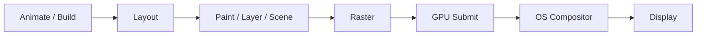

### 2.1 主要问题分类

| 现象 | 主要观察侧 | 可能根因 |
|---|---|---|
| UI 帧超预算 | UI Isolate | Dart 计算、Build、Layout、Paint 记录、Scene 构建 |
| Raster 帧超预算 | Raster/GPU | 大图、模糊、阴影、离屏、复杂混合、资源准备 |
| UI 与 Raster 都慢 | 两侧 | 大范围动态 UI 同时增加 Framework 与 GPU 工作 |
| 两侧正常但体验迟缓 | 端到端 | 输入调度、平台主线程、Platform View、系统合成、业务等待 |

### 2.2 帧预算必须匹配刷新率

| 刷新率 | 理论显示周期 |
|---:|---:|
| 60 Hz | 约 16.67 ms |
| 90 Hz | 约 11.11 ms |
| 120 Hz | 约 8.33 ms |

设备可能动态改变刷新率。线上监控和本地测试不能永远把 16 ms 写死为唯一阈值，还应关注 P50、P95、P99、连续掉帧和输入到视觉反馈时间。

### 2.3 为什么先看证据

如果瓶颈是同步 JSON 解析，删除圆角 Clip 不会解决问题；如果 Raster 被全屏模糊拖慢，给 Widget 添加 `const` 也不会降低 GPU 像素工作。

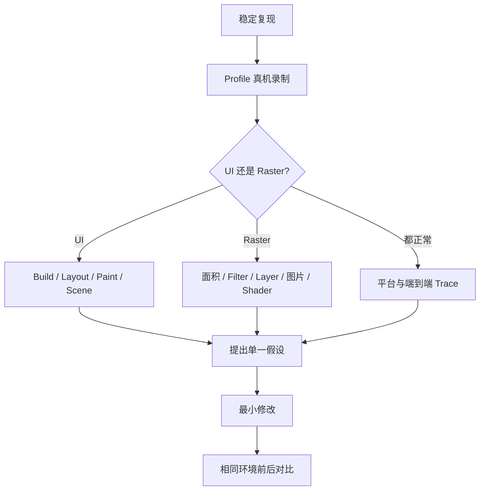

---

## 三、理解渲染成本的四个维度

仅统计 Widget 或 Draw Call 数量不够。渲染成本至少取决于：

### 3.1 工作面积

处理 20 × 20 像素和处理 1440 × 3200 像素不是同一数量级。模糊、透明混合、离屏表面和多层 Overdraw 对面积尤其敏感。

### 3.2 每像素操作复杂度

纯色填充、纹理采样、多重滤镜和复杂 BlendMode 的每像素成本不同。一个绘制命令也可能包含昂贵 Shader。

### 3.3 更新频率

一次性的复杂效果与每秒 120 次更新的效果不能等价。稳定内容可能被 retained rendering 或 Raster Cache 复用，持续变化内容则可能反复失效。

### 3.4 中间结果与内存带宽

离屏表面需要分配或复用 Render Target，把内容写入中间目标，再读取并合成到最终目标。移动 GPU 常受内存带宽、Tile 存储和表面切换影响。

因此可以使用下面的粗略心智模型，而不能把它当精确公式：

```text
Raster cost ≈ processed pixels
            × per-pixel work
            × number of passes
            + resource/pipeline preparation
            + synchronization/composition overhead
```

---

## 四、RepaintBoundary：隔离 Paint，不是通用缓存开关

`RepaintBoundary` 让子树成为独立重绘边界，通常对应独立 Layer 子树。它解决的问题是：某一侧变化时，另一侧稳定内容是否必须跟着重新 Paint。

### 4.1 适用场景

- 复杂稳定背景上有小范围动画；
- 图表主体稳定，十字线高频移动；
- 视频/动画区域与周边静态界面更新频率不同；
- 父节点频繁 Paint，而某个昂贵子树长期稳定。

```dart
Stack(
  children: [
    RepaintBoundary(
      child: ExpensiveStaticChart(data: chartData),
    ),
    AnimatedCrosshair(position: pointerPosition),
  ],
)
```

### 4.2 不适用场景

- 边界内部每帧全部变化；
- Paint 本身很简单；
- 真正瓶颈在 Build 或 Layout；
- 大面积 Filter、图片或阴影仍位于边界内部；
- 大量列表项边界造成 Layer 和缓存压力；
- 页面很少重绘，隔离没有实际机会产生收益。

### 4.3 与 Raster Cache 的关系

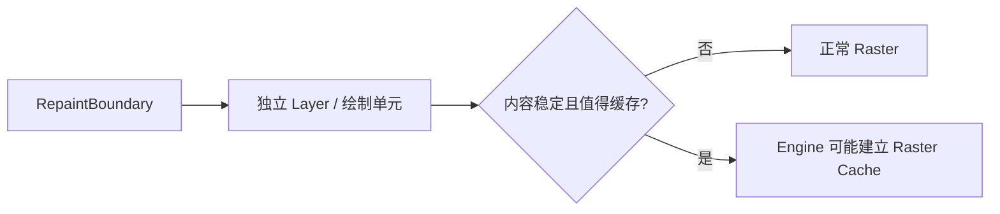

边界只是提供候选单元。缓存是否建立、命中和淘汰由 Engine 策略决定，不能假设“加边界等于截图缓存”。

### 4.4 验证指标

- UI Paint 时间是否下降；
- 重绘彩虹显示的范围是否缩小；
- Raster 是否改善或恶化；
- Layer 数和内存是否增加；
- 首次缓存生成是否产生尖峰；
- 滚动、缩放后缓存是否频繁失效。

---

## 五、`saveLayer()`：为什么离屏绘制可能昂贵

Canvas 的 `save()` 只保存 Transform 和 Clip 等状态；`saveLayer()` 还会建立一个概念上的中间绘制层，使后续命令先画到中间目标，再使用 Paint 合成回父目标。

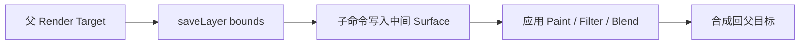

### 5.1 `save()` 与 `saveLayer()` 的区别

| API | 主要作用 | 是否需要中间绘制目标 |
|---|---|---|
| `save()` | 保存 Canvas 状态 | 通常不需要 |
| `saveLayer(bounds, paint)` | 隔离一组绘制，再整体处理 | 概念上需要，后端可能优化 |

具体后端可以合并、消除或改变实现，但业务应按“可能产生额外 Render Pass 和内存读写”评估。

### 5.2 常见使用原因

- 对一组内容统一应用 BlendMode；
- 整体透明度且不能直接合成优化；
- Mask、Filter 或颜色处理需要中间输入；
- 抗锯齿裁剪需要先绘制再合成；
- 某些 Widget 或 RenderObject 内部为保证视觉语义使用离屏层。

### 5.3 边界为什么重要

错误示例：

```dart
canvas.saveLayer(null, layerPaint);
drawSmallBadge(canvas);
canvas.restore();
```

`null` 边界可能让后端使用更宽泛的保存范围，具体行为依实现而异。已知效果只覆盖局部时，应提供准确、略含抗锯齿或模糊扩展的边界：

```dart
final layerBounds = badgeBounds.inflate(filterRadius);
canvas.saveLayer(layerBounds, layerPaint);
try {
  drawSmallBadge(canvas);
} finally {
  canvas.restore();
}
```

边界过小会裁掉滤镜扩散像素，过大会增加中间表面面积。必须根据 Filter Kernel、阴影或描边范围计算，而不是机械使用 Widget Size。

### 5.4 估算内存规模

假设一个离屏表面使用每像素 4 字节的常见颜色格式，仅原始颜色存储粗略为：

```text
1440 × 3200 × 4 bytes ≈ 17.6 MiB
```

这不是最终 GPU 占用结论，因为还可能涉及对齐、MSAA、Tile、压缩、双缓冲和临时资源。但它足以说明：全屏离屏与局部 200 × 200 离屏不是同一成本。

---

## 六、Opacity：单命令 Alpha 与整体透明不同

### 6.1 直接颜色 Alpha

如果只有一个简单图形，可以直接让 Paint 使用透明颜色：

```dart
final paint = Paint()
  ..color = const Color(0xFF00695C).withValues(alpha: 0.5);
canvas.drawRect(rect, paint);
```

这通常不需要为了整体语义建立额外子树层，但具体 Blend 仍有像素成本。

### 6.2 整体子树 Opacity

当多个互相重叠的子元素需要作为整体变透明时，分别修改每个元素 Alpha 可能改变重叠区视觉结果。`Opacity`/`OpacityLayer` 表达的是整体 Alpha。

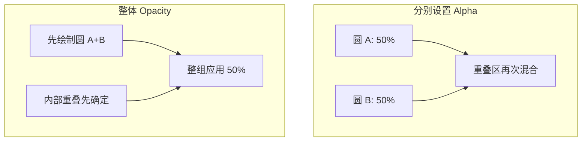

### 6.3 动画方案比较

| 方案 | 适用场景 | 边界 |
|---|---|---|
| 直接颜色 Alpha | 单个简单绘制命令 | 多子元素重叠时语义可能不同 |
| `FadeTransition` | Animation 驱动整体透明 | 仍需评估合成和 Raster |
| `AnimatedOpacity` | 隐式动画、易用 | 动画期间可能持续合成，具体路径需测量 |
| 条件移除/`Visibility` | 完全不可见且不需保留交互 | 生命周期、布局和状态语义不同 |

Opacity 为 0 不一定表示子树所有 Build/Layout/语义成本自动消失。是否参与命中测试、Semantics 和布局取决于所用 Widget 与配置。

### 6.4 优化原则

- 只处理真正需要整体透明的最小区域；
- 避免多个大面积 Opacity 嵌套；
- 静态半透明装饰优先评估直接颜色 Alpha；
- 透明动画同时观察 UI、Raster 和内存带宽；
- 不用肉眼流畅替代低端设备和高刷新率测试。

---

## 七、BackdropFilter：为什么背景模糊尤其敏感

`BackdropFilter` 过滤已经绘制在其后方的背景内容，再将结果与前景组合。它的数据依赖不是“只处理自己的 Child”。

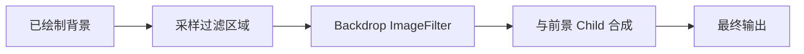

### 7.1 常见成本来源

- 读取或采样背景像素；
- 高斯模糊需要多个采样/Pass；
- 模糊范围会超出可见边界；
- 全屏或大面积 Filter 增加处理像素；
- 滚动背景每帧变化，使结果难以稳定缓存；
- 多个重叠 BackdropFilter 重复处理相近区域；
- 与 Clip、Opacity、Platform View 组合可能增加合成复杂度。

### 7.2 必须限制作用范围

```dart
ClipRect(
  child: BackdropFilter(
    filter: ImageFilter.blur(sigmaX: 12, sigmaY: 12),
    child: const ColoredBox(
      color: Color(0x22000000),
      child: SizedBox.expand(),
    ),
  ),
)
```

Clip 的目的不仅是视觉圆角或边界，也帮助定义需要过滤的区域。没有合适 Clip 时，实际过滤范围可能大于产品看到的局部面板。

具体 Widget 组合是否能收紧后端处理范围应以当前 Flutter 版本 Trace 验证。

### 7.3 工程替代方案

- 设计允许时使用半透明纯色或渐变覆盖；
- 对静态背景预生成模糊图，而不是每帧实时模糊；
- 缩小模糊区域和 Sigma；
- 合并视觉上连续的模糊区域，避免重复过滤；
- 页面滚动时降低或停用非关键模糊，需与设计和可访问性共同评估；
- 对低端设备使用能力分级或远程配置。

替代方案可能改变视觉语义，不能只为了性能悄悄降低设计质量；需要产品可接受的降级契约。

---

## 八、ImageFilter：过滤输入内容

`ImageFilter` 常用于模糊、矩阵变换等图像处理。与 BackdropFilter 的关键区别是：

| 类型 | 主要输入 | 常见用途 |
|---|---|---|
| BackdropFilter | 已绘制背景 | 毛玻璃、背景模糊 |
| ImageFilter | 当前子树/图像输入 | 内容模糊、图像变换 |

```dart
ImageFiltered(
  imageFilter: ImageFilter.blur(sigmaX: 8, sigmaY: 8),
  child: const ProductThumbnail(),
)
```

### 8.1 成本因素

- 输入区域尺寸；
- Sigma 或 Kernel 范围；
- 每帧内容是否变化；
- 是否可复用中间结果；
- Filter 链数量；
- 色彩空间和像素格式；
- GPU 后端和设备带宽。

### 8.2 不要在动画中无界增加 Sigma

模糊半径越大，采样范围通常越大。动画同时改变内容、尺寸和 Sigma，会让缓存与优化更困难。

若效果只是从清晰过渡到不可见，可以比较以下方案：

- Blur 动画；
- Opacity + Scale；
- 预生成多档模糊资源；
- 只在动画关键阶段启用 Blur。

最终选择应比较画质、GPU 时间、内存和工程复杂度。

---

## 九、Clip 成本：形状只是第一层因素

### 9.1 常见 ClipBehavior

Flutter Widget 常见裁剪行为包括不裁剪、硬边裁剪、抗锯齿裁剪以及抗锯齿配合保存层。具体枚举与默认值应以目标 SDK 为准。

一般心智模型：

| 裁剪方式 | 视觉特征 | 潜在成本 |
|---|---|---|
| Rect Hard Edge | 无抗锯齿软边 | 通常较简单 |
| Anti-aliased Rect/RRect | 边缘更平滑 | 需要边缘覆盖处理 |
| Complex Path Clip | 任意形状 | 几何和采样更复杂 |
| AntiAlias + SaveLayer | 保证特定边缘组合语义 | 可能引入离屏表面 |

这不是固定性能排名，硬件和后端可能对特定形状优化。

### 9.2 Clip 不等于圆角装饰

```dart
DecoratedBox(
  decoration: BoxDecoration(
    color: Colors.white,
    borderRadius: BorderRadius.circular(12),
  ),
  child: child,
)
```

这只绘制圆角背景，并不保证 Child 被裁剪。如果 Child 本身不会越界，就没有必要为了背景圆角额外 Clip。

### 9.3 常见优化

- 使用最简单且满足视觉要求的形状；
- 避免每帧变化的复杂 Path Clip；
- 缩小 Clip 和绘制区域；
- 不为“保险”层层嵌套 Clip；
- 图片圆角可评估服务端/资源侧预处理，但要考虑多尺寸、缓存和画质；
- Platform View 的 Clip 支持需单独验证。

### 9.4 测量边界

如果 UI Paint 高，检查 Path 构造和裁剪记录；如果 Raster 高，检查覆盖面积、抗锯齿、离屏和像素工作。不能只看到 `ClipPath` 就认定根因。

---

## 十、阴影成本：面积、模糊和动画共同决定

阴影通常涉及几何扩展、模糊与透明混合。常见来源包括：

- `BoxShadow`；
- Material Elevation；
- `Canvas.drawShadow`；
- 自定义 MaskFilter；
- 图片资源中的预烘焙阴影。

### 10.1 成本因素

| 因素 | 影响 |
|---|---|
| Blur Radius / Sigma | 增大采样与扩展区域 |
| 图形面积 | 增加处理像素 |
| Path 复杂度 | 增加几何与覆盖计算 |
| Spread | 扩大阴影边界 |
| 动画频率 | 稳定缓存更难 |
| 多层阴影 | 增加 Pass 和 Overdraw |
| 裁剪边界 | 可能裁掉阴影或扩大中间表面 |

### 10.2 阴影动画为什么危险

同时动画 elevation、形状、尺寸和颜色，可能让几何、模糊和缓存每帧变化。若设计目标只是表现抬起，可以比较：

- 固定阴影 + Transform 位移；
- 两档预定义阴影交叉切换；
- 只动画较小区域；
- 使用边框、亮度或背景变化替代部分阴影语义。

### 10.3 图片阴影的取舍

预烘焙阴影可减少运行时计算，但会增加资源体积、内存、多分辨率维护和缩放失真风险，也不适合动态形状与主题。它不是通用最佳方案。

---

## 十一、Shader Compilation Jank 是什么

Shader 是 GPU 执行的图形程序。绘制某种效果时，渲染系统需要获得与当前材质、Blend、采样、Clip 和目标格式相匹配的程序或管线状态。

若某个变体首次出现时需要同步编译、链接或创建 Pipeline，且准备时间落在关键帧内，就可能造成 Shader/Pipeline Jank。

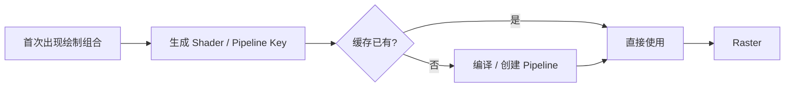

### 11.1 它不等于所有首次卡顿

首次进入页面卡顿还可能来自：

- 图片首次解码和纹理上传；
- 字体加载与 Glyph Atlas 更新；
- 大型 DisplayList 首次 Raster Cache；
- Dart 类加载或业务初始化；
- 平台视图创建；
- I/O 与数据库；
- GPU 驱动资源分配。

必须用 Timeline、Engine Trace 和平台工具确认，不能把“第一次卡”都称为 Shader 编译。

### 11.2 SkSL Warm-up 的版本边界

历史 Skia 路径中，Flutter 曾提供采集和预热 SkSL 等方案以降低部分运行时 Shader 编译卡顿。其适用平台、命令、收益和与当前后端的关系会随 Flutter 演进。

在采用任何预热方案前，应确认：

- 当前目标平台实际使用 Skia 还是 Impeller；
- 当前 Flutter 官方文档是否仍推荐该流程；
- 采集设备和 GPU 覆盖是否足够；
- Bundle 增量和维护成本；
- 是否真正命中线上 Shader 变体。

不要把旧版 SkSL 教程直接应用到当前 Impeller 默认路径。

---

## 十二、Skia 渲染管线：稳定模型与版本边界

Skia 是跨平台 2D 图形库，Flutter 历史和当前部分平台/配置会使用 Skia 消费绘制描述并通过底层 GPU 或软件路径输出。

职责级模型：

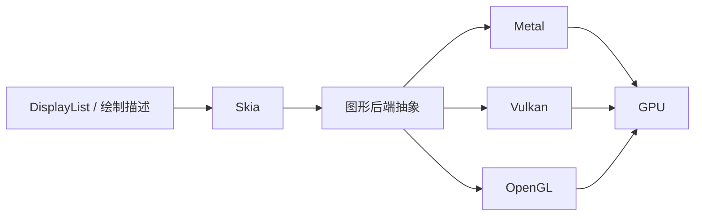

### 12.1 Skia 的优势

- 成熟的 2D 绘制能力和广泛平台支持；
- 丰富 Path、文字、图片、滤镜与 Blend 实现；
- 多种 GPU/CPU 后端；
- 大量真实设备和场景验证。

### 12.2 运行时不确定性

传统 GPU 路径可能在运行过程中遇到新的 Shader/Pipeline 组合，驱动、缓存和设备差异会影响首次准备延迟。同时仍存在离屏、带宽、Overdraw、资源上传等普通 GPU 成本。

Skia 内部架构也持续演进，不能把某个旧版 Ganesh/Graphite、Shader 缓存或 API 映射当永久契约。

---

## 十三、Impeller 渲染管线：减少不确定性，不是消除成本

Impeller 是 Flutter 面向可预测渲染而设计的渲染器。其方向包括更早准备 Shader、明确渲染 Pass 和资源管理、减少运行时不可控 Shader 编译。

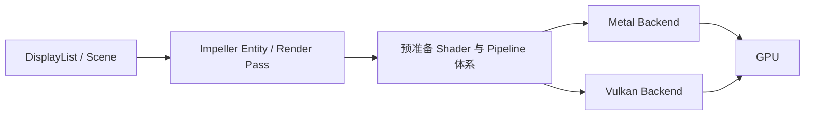

这是职责级模型。实际模块名、支持平台和管线构建细节应以目标 Flutter 提交为准。

### 13.1 Impeller 主要解决什么

- 降低运行时首次 Shader 编译的不确定性；
- 对渲染 Pass、资源和后端行为提供更可控实现；
- 针对现代显式图形 API 设计；
- 提升 Flutter 对渲染器演进和诊断的控制力。

### 13.2 Impeller 不解决什么

- UI Isolate 的同步业务计算；
- 大范围 Build/Layout/Paint；
- 每帧数百万像素的复杂模糊；
- 超大图片解码和纹理上传；
- 过量 Overdraw 与透明混合；
- 内存不足和缓存抖动；
- Platform View 系统合成限制；
- 应用错误的 Layer 和生命周期设计。

### 13.3 仍可能存在 Pipeline/资源准备

“预编译 Shader”不意味着所有 Pipeline State、纹理、采样器和 Render Target 在应用启动前全部创建。具体缓存、变体和后端准备策略会演进。

因此看到 Impeller 下的首次卡顿，仍应收集 Trace，而不是直接断言“不可能是图形准备”。

---

## 十四、Metal、Vulkan、OpenGL 的位置与差异

### 14.1 抽象层关系

```text
Flutter Framework
  → DisplayList / Scene
  → Skia 或 Impeller
  → Metal / Vulkan / OpenGL 等图形 API
  → GPU Driver
  → GPU Hardware
```

Metal、Vulkan 和 OpenGL 不是 Skia/Impeller 的竞品，而是它们可能使用的底层图形 API。

### 14.2 Metal

Metal 是 Apple 平台的现代图形 API，提供显式资源、命令缓冲和 Pipeline 管理。实际支持能力受 iOS/macOS 版本、GPU 家族和 Flutter 后端实现影响。

### 14.3 Vulkan

Vulkan 是跨厂商的显式图形 API，常用于 Android 等平台。它提供更直接的资源和同步控制，同时设备驱动质量、扩展支持和内存模型差异较大。

### 14.4 OpenGL / OpenGL ES

OpenGL 是较早的状态机式图形 API，驱动承担更多隐式工作。它仍可能作为特定平台、兼容或回退路径存在，但支持状态必须以当前 Flutter 版本和设备日志为准。

### 14.5 不能用 API 名称预测性能

Vulkan 不保证在所有设备上快于 OpenGL，Metal 也不会自动使全屏模糊免费。最终性能取决于：

- Flutter 渲染器实现；
- 驱动和 GPU；
- 资源与同步策略；
- 场景像素、Pass 和带宽；
- 系统版本与温控。

---

## 十五、如何确认实际渲染后端

不要根据平台做静态假设。确认方式包括：

- 查看当前 Flutter 官方平台支持矩阵；
- 检查 `flutter run`/应用启动日志中的渲染器信息；
- 使用 DevTools、Engine Trace 或平台 GPU 工具；
- 记录构建参数和是否启用/禁用特定后端；
- 在 Crash/性能埋点中上报可可靠获得的后端标识。

具体命令行开关会随 Flutter 版本变化，执行前应查看当前 `flutter run --help` 和官方文档，不在长期脚本中依赖未经验证的旧参数。

### 15.1 为什么后端是性能维度

同一页面在不同 Flutter 版本或后端上可能表现不同。线上性能看板至少应能按以下维度切分：

```text
app_version
flutter_version
platform / os_version
device / gpu_family
renderer_backend
refresh_rate
feature_flag
```

否则后端迁移后的改善或回归会被混在总体分布中。

---

## 十六、资源上传与图片：常被误判为 Shader 问题

图片第一次显示通常涉及：

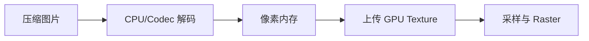

### 16.1 常见问题

- 原图远大于显示尺寸；
- 首屏同时解码多张大图；
- 图片缓存预算不合理；
- 动画中反复创建或替换纹理；
- 纹理上传与关键帧竞争；
- 大图叠加 Clip、Opacity 和 Filter。

### 16.2 工程处理

- 按显示像素尺寸请求或解码图片；
- 分批预取，不阻塞首个关键反馈；
- 控制并发解码和缓存预算；
- 保留占位尺寸，避免图片到达后 Relayout；
- 区分 CPU 解码、GPU 上传和 Raster 采样证据；
- 记录冷缓存与热缓存结果。

即使 Impeller 避免了某些 Shader 编译卡顿，纹理上传尖峰仍然可能存在。

---

## 十七、Overdraw 与透明混合

Overdraw 表示同一像素在一帧中被多次覆盖。普通不透明覆盖有时可被剔除或优化，但多层透明内容通常需要读取目标颜色并混合。

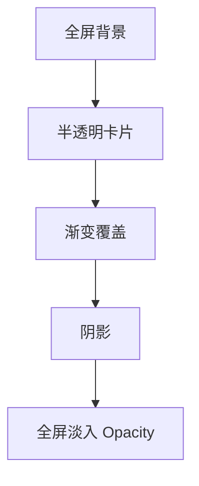

### 17.1 常见来源

- 多层全屏背景；
- 不可见但仍绘制的覆盖层；
- 大面积半透明装饰；
- 嵌套 Opacity；
- 列表项阴影互相覆盖；
- 模糊区域背后仍绘制复杂内容。

### 17.2 优化方向

- 删除真正不可见的层；
- 合并可等价的背景与装饰；
- 缩小半透明覆盖面积；
- 避免在全屏过渡中叠加多个昂贵效果；
- 使用平台 GPU Overdraw/Frame Capture 工具验证；
- 保持视觉结果一致，避免错误合并改变 Blend 语义。

---

## 十八、工程案例：商品页毛玻璃底部面板

需求：商品图片上方固定一个带背景模糊、圆角、阴影和淡入动画的底部操作面板。

初始实现：

```dart
AnimatedOpacity(
  opacity: visible ? 1 : 0,
  duration: const Duration(milliseconds: 300),
  child: ClipRRect(
    borderRadius: BorderRadius.circular(24),
    child: BackdropFilter(
      filter: ImageFilter.blur(sigmaX: 24, sigmaY: 24),
      child: Container(
        decoration: BoxDecoration(
          color: Colors.white.withValues(alpha: 0.22),
          boxShadow: const [
            BoxShadow(blurRadius: 32, color: Color(0x33000000)),
          ],
        ),
        child: const CheckoutActions(),
      ),
    ),
  ),
)
```

不能仅凭代码断言必然卡顿，但风险叠加明显：整体 Opacity、圆角 Clip、大 Sigma Backdrop Blur 和大阴影同时覆盖较大区域。

### 18.1 测量步骤

1. 在目标中低端真机 Profile 模式录制进入动画和滚动背景；
2. 确认 UI 还是 Raster 超预算；
3. 记录面板像素面积、刷新率和实际后端；
4. 分别关闭 Blur、Shadow、Opacity 动画，每次只改变一个变量；
5. 比较 Raster P50/P95/P99 和内存；
6. 使用 Frame Capture/Trace 检查 Render Pass、Filter 和 Overdraw；
7. 复测静止、滚动和页面转场三种状态。

### 18.2 可能的改进顺序

- 用紧确 Clip 限制 BackdropFilter 区域；
- 降低 Sigma，确认设计可接受阈值；
- 让面板使用固定 Blur，仅动画 Transform/Opacity；
- 缩小或简化阴影；
- 低端设备切换为半透明纯色背景；
- 背景静态时评估预模糊资源；
- 确保不可见后停止动画并按产品语义移除昂贵效果。

每项改动都可能改变视觉结果，必须经过设计验收和 Golden/真机截图比较。

---

## 十九、建立可重复的渲染性能实验

### 19.1 测试矩阵

| 维度 | 示例 |
|---|---|
| 设备 | 低端 Android、中端 Android、主流 iPhone |
| 刷新率 | 60/90/120 Hz，记录实际值 |
| 模式 | Profile 定位，Release 复核 |
| 后端 | 当前默认后端及必要对照 |
| 状态 | 冷缓存、热缓存、首次进入、重复进入 |
| 场景 | 静止、滚动、动画、页面转场 |
| 温控 | 冷机、稳定温度，避免热降频混入 |

### 19.2 指标

- UI/Raster Frame Time 分布；
- Missed Frame / Jank 比例；
- P50、P95、P99；
- 连续掉帧长度；
- 输入到视觉反馈时间；
- Layer 数、Render Pass、缓存命中；
- GPU/系统内存；
- 功耗和温升；
- 画质与视觉差异。

### 19.3 单变量原则

一次同时删除 Blur、Shadow 和 Opacity，即使变快也无法证明根因。应逐项控制变量，再验证组合效果。

### 19.4 预热与采样

首次进入和稳定运行应分开统计。预热可以代表长期交互，却会掩盖首用卡顿；冷缓存可以发现资源准备问题，却不能代表所有用户会话。

---

## 二十、工具链：从 DevTools 到平台 GPU Trace

### 20.1 Flutter DevTools

- Performance View：定位 UI 与 Raster 慢帧；
- Timeline：展开 Paint、Raster 和异步事件；
- Repaint Rainbow：观察持续重绘范围；
- Performance Overlay：快速观察趋势；
- Memory View：检查图片、缓存和整体内存变化。

### 20.2 Android

- Perfetto/System Trace：线程、调度、Surface 与系统合成；
- `gfxinfo` 等平台帧统计：辅助观察帧分布；
- Android GPU Inspector/Frame Profiler：分析 Render Pass、纹理、Shader 和 GPU 瓶颈；
- SurfaceFlinger 相关信息：系统合成问题。

### 20.3 iOS

- Instruments Core Animation：帧、合成和显示行为；
- Metal System Trace：命令提交、GPU 时间和同步；
- Xcode GPU Frame Capture：Render Pass、Pipeline、纹理与带宽；
- Allocations/VM Tracker：资源和内存压力。

工具名称、可用指标和采集方法会随系统与开发工具版本变化，应使用当前官方文档。

---

## 二十一、常见错误与修复

### 21.1 错误：给每个列表项添加 RepaintBoundary

**问题：** Layer、内存和缓存竞争可能增加，且列表项 Paint 可能本来就很简单。

**修复：** 先观察滚动时重绘范围和 UI/Raster 时间，只隔离确实昂贵且更新频率不同的子树。

### 21.2 错误：全屏 `saveLayer(null, paint)` 处理局部效果

**问题：** 中间目标范围可能远大于实际效果区域。

**修复：** 计算包含 Filter/Shadow 扩散的紧确边界；优先确认是否能避免离屏语义。

### 21.3 错误：把所有透明都改成 `Opacity`

**问题：** 简单单命令 Alpha 被升级为整体子树合成语义，可能增加 Layer 或离屏成本。

**修复：** 单一绘制命令优先评估颜色 Alpha；多元素整体透明才使用相应组件，并测量。

### 21.4 错误：毛玻璃面板没有限制 Filter 区域

**问题：** 实际背景采样和模糊范围可能过大。

**修复：** 使用合适 Clip 定义最小区域，降低 Sigma，并对低端设备设计降级。

### 21.5 错误：看到首次卡顿就采集 SkSL

**问题：** 可能实际使用 Impeller，或根因是图片上传、字体、缓存与业务初始化。

**修复：** 先确认后端和 Trace 证据，再按当前 Flutter 官方方案处理。

### 21.6 错误：只在高端开发机验证

**问题：** GPU 带宽、驱动、内存和刷新率差异会掩盖线上问题。

**修复：** 建立低/中/高设备矩阵，至少在主流低端设备 Profile/Release 测量。

---

## 二十二、优化决策表

| 证据 | 优先动作 | 需要防范的代价 |
|---|---|---|
| 大范围重复 Paint | 评估 RepaintBoundary | Layer 和内存增加 |
| 全屏离屏 Pass | 缩小 saveLayer/Filter 边界 | 裁剪扩散像素、视觉变化 |
| Backdrop Blur 高 | 缩小区域、降低 Sigma、能力降级 | 设计一致性 |
| Opacity 动画高 | 缩小子树、比较颜色 Alpha/Transform | 重叠视觉语义变化 |
| ClipPath 高 | 简化形状、减少动态变化 | 边缘与产品形状变化 |
| 阴影高 | 缩小面积/Blur、稳定几何 | 深度视觉减弱 |
| 首次 Pipeline Jank | 确认后端与 Pipeline Trace | 预热包体、覆盖不全 |
| 图片上传尖峰 | 按尺寸解码、分批预取 | 清晰度和缓存策略 |
| Impeller 下持续 Raster 高 | 降低像素、Pass、Filter、Overdraw | 视觉质量与复杂度 |

---

## 二十三、源码与 Trace 阅读入口

下列入口包含公开 API 和版本化内部实现，阅读时应锁定 Flutter SDK、Engine 提交与目标后端。

| 主题 | 建议入口 |
|---|---|
| 重绘边界 | `RenderObject.isRepaintBoundary`、`PaintingContext.repaintCompositedChild` |
| 离屏绘制 | `Canvas.saveLayer`、相关 RenderObject Paint 路径 |
| Opacity | `RenderOpacity`、`OpacityLayer`、动画组件实现 |
| BackdropFilter | `RenderBackdropFilter`、`BackdropFilterLayer` |
| ImageFilter | `ImageFilter`、`ImageFiltered` 对应渲染路径 |
| Clip | `RenderClipRect/RRect/Path`、ClipLayer 与 ClipBehavior |
| 阴影 | `BoxShadow`、`Canvas.drawShadow`、Material 绘制路径 |
| DisplayList | Filter、saveLayer、Clip 等操作记录 |
| Raster Cache | Engine Raster Cache 与相关 Trace 事件 |
| Skia | 当前 Engine Skia backend 接入路径 |
| Impeller | DisplayList 转换、Entity/Pass、Metal/Vulkan backend |

推荐从一个真实慢帧反向阅读：

```text
DevTools / GPU Trace 中的慢事件
  → 对应 Layer / DisplayList 操作
  → Framework RenderObject Paint 入口
  → Widget 与业务配置
  → 最小复现和单变量验证
```

不要从源码中找到 `saveLayer` 就直接宣判它是线上根因，还需要确认该路径在目标配置实际执行、面积多大、频率多高。

---

## 二十四、发布与回归治理

渲染优化容易受设备和后端影响，不能只做一次本地验证。

### 24.1 CI 与基准

- 固定设备或设备池运行关键动画脚本；
- 保存 Flutter/系统/后端版本；
- 记录 UI/Raster FrameTiming 分位数；
- 对 Golden 做视觉回归；
- 对性能变化设置趋势告警，而不是过度依赖单次硬阈值。

### 24.2 线上监控

- 按设备档位、刷新率、后端和页面分桶；
- 记录 Jank 比例与连续慢帧；
- 关联 Feature Flag 和视觉效果配置；
- 对高成本 Blur/Shadow 提供远程降级；
- 监控内存、OOM 和温升相关信号；
- 回归时能快速关闭效果而不等待商店全量更新。

远程降级配置应有版本、过期时间和安全默认值，避免错误配置导致所有设备同时开启最昂贵效果。

---

## 二十五、总结

1. 渲染卡顿必须先分清 UI Paint、Raster/GPU 和系统合成，不应从 Widget 名称猜根因。
2. RepaintBoundary 隔离 Paint，但不优化 Build/Layout，也不保证 Raster Cache。
3. `saveLayer()` 的核心代价来自中间目标、额外 Pass 和像素读写，边界面积决定量级。
4. 整体 Opacity 与单命令 Alpha 语义不同，优化时不能随意互换。
5. BackdropFilter 依赖背景，ImageFilter 处理输入子树；大面积、动态、高 Sigma 会放大成本。
6. Clip 和阴影的成本由形状、面积、抗锯齿、模糊与更新频率共同决定。
7. Shader/Pipeline Jank 只是首次卡顿的一种原因，还要排除图片、字体、缓存和业务初始化。
8. Impeller 旨在降低运行时 Shader 不确定性，但不会消除离屏、带宽、Overdraw、资源上传和 Dart 工作。
9. Skia/Impeller 与 Metal/Vulkan/OpenGL 位于不同层次，后端实际选择必须查看当前版本和运行证据。
10. 所有优化都要在目标真机、正确构建模式和相同脚本下比较分位数、内存、功耗和画质。

> 渲染性能优化的本质不是删除所有高级视觉效果，而是用证据控制每帧处理的像素、Pass、资源和更新范围，让视觉收益与设备成本相匹配。

---

## 二十六、问答复盘

### Q1：看到 Raster 帧超预算，为什么不能先优化 `build()`？

**答：** Raster 超预算主要发生在绘制回放、滤镜、图片、混合和 GPU 路径。Build 优化可能有其他收益，但不能替代对 Raster 根因的定位。

### Q2：RepaintBoundary 与 Raster Cache 是什么关系？

**答：** RepaintBoundary 提供独立 Paint/Layer 单元；Engine 可能根据稳定性和成本为其建立 Raster Cache，但不保证发生。边界本身还会增加 Layer 和内存成本。

### Q3：`save()` 与 `saveLayer()` 最大的差别是什么？

**答：** `save()` 主要保存 Canvas 状态，`saveLayer()` 让一组命令先进入中间绘制目标，再整体合成，因此可能增加 Render Pass、表面和内存带宽成本。

### Q4：为什么不能把子树中每个颜色 Alpha 调低来替代 Opacity？

**答：** 多个元素重叠时，分别混合和整组混合的视觉结果不同。只有确认内容结构和 Blend 语义等价时才能替换。

### Q5：BackdropFilter 与 ImageFilter 的核心区别是什么？

**答：** BackdropFilter 需要过滤已经绘制的背景；ImageFilter 过滤当前输入内容。前者对背景变化和过滤区域尤其敏感。

### Q6：ClipPath 一定比 ClipRect 慢吗？

**答：** 复杂 Path 通常需要更多几何和边缘处理，但是否构成瓶颈还取决于面积、频率、抗锯齿、后端和设备，必须测量。

### Q7：首次进入页面卡一下，如何判断是不是 Shader Compilation Jank？

**答：** 先确认实际渲染后端，再用 Engine/GPU Trace 查看 Pipeline/Shader 准备事件，同时排除图片解码上传、字体、Raster Cache 和业务初始化。

### Q8：Impeller 是否意味着可以放心使用全屏实时模糊？

**答：** 不能。Impeller 主要降低 Shader/Pipeline 不确定性，全屏模糊仍需要处理大量像素、Pass 和带宽，在高刷新率和低端设备上可能超预算。

### Q9：Vulkan 是否一定比 OpenGL 更快？

**答：** 不一定。结果取决于渲染器实现、驱动、GPU、同步、资源管理和场景。图形 API 名称不能代替目标设备基准。

### Q10：如何证明一次渲染优化有效？

**答：** 固定版本、设备、后端、刷新率、缓存状态和交互脚本，单变量修改后比较 UI/Raster P50/P95/P99、Layer/Pass、内存、功耗与画质，并在多档设备复测。

---

## 二十七、延伸知识

- **自定义渲染**：RenderBox、RenderSliver、ParentData 与脏标记传播。
- **图片管线**：编解码、ImageCache、纹理上传和颜色空间。
- **文字渲染**：字体回退、Glyph Atlas、文本布局与缓存。
- **GPU 基础**：Render Pass、Tile-Based Rendering、Blend、纹理与带宽。
- **平台合成**：SurfaceFlinger、Core Animation 与 Platform View。
- **性能治理**：FrameTiming、线上 Jank SLO、设备分层与远程降级。
