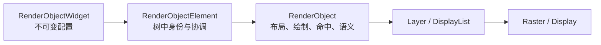
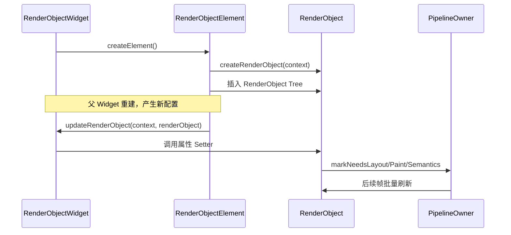
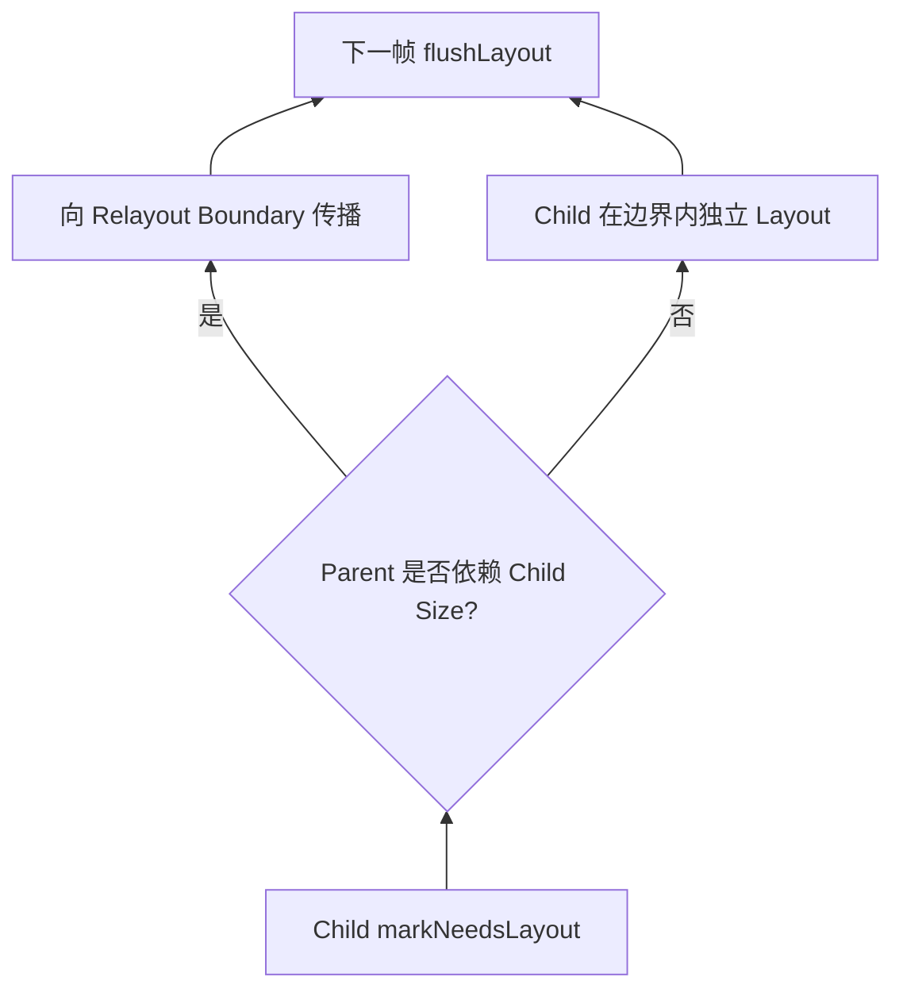
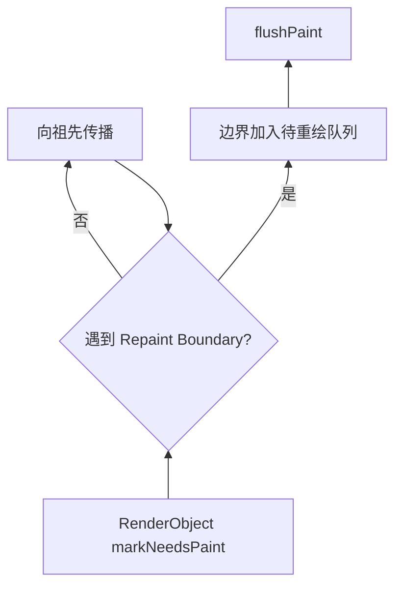
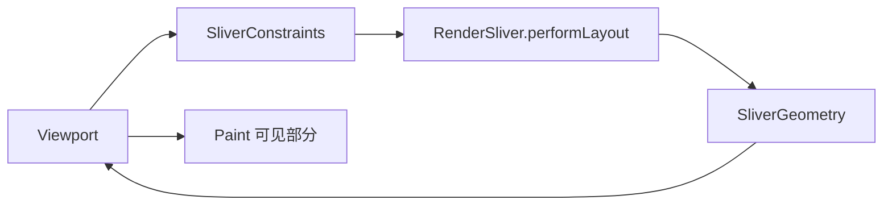

# Flutter 自定义渲染：从 RenderBox 到 RenderSliver

> 本文解决一个工程问题：当标准 Widget 和 CustomPainter 已无法自然表达布局协议时，如何创建可复用、可更新、可测试且具备命中与 Semantics 的自定义 RenderObject。

---

## 一、什么时候才需要自定义 RenderObject

Flutter 的标准 Widget 已覆盖绝大多数界面。自定义渲染的价值不是“少写几层 Widget”，而是定义新的布局或渲染协议，例如：

- 子节点尺寸和位置相互依赖，标准 Row、Stack、Flow 难以表达；
- 需要单次布局完成特殊测量，避免多层 Widget 反复协调；
- 数百个轻量图元需要共享一个 RenderObject；
- 需要把父级配置写入子节点 ParentData；
- 需要自定义 Sliver 的滚动范围、Paint 范围和缓存范围；
- 一个基础组件必须同时控制 Layout、Paint、Hit Test 和 Semantics。

不适合直接使用 RenderObject 的场景包括：

- 只是画背景、进度条或简单图形：优先 `CustomPainter`；
- 只是组合现有组件：优先普通 Widget；
- 只是局部状态更新：先设计状态边界；
- 只是追求“性能更高”：先在 Profile 真机证明瓶颈；
- 团队缺乏渲染协议测试能力，且标准组件已能满足需求。

### 核心结论

1. `RenderObjectWidget` 是配置进入 RenderObject Tree 的桥梁，Element 负责创建、更新、插入和移除 RenderObject。
2. `SingleChildRenderObjectWidget` 适合零或一个子节点，`MultiChildRenderObjectWidget` 适合多个子节点；它们仍是不可变 Widget 配置。
3. RenderBox 使用 BoxConstraints/Size 协议：约束向下、尺寸向上、父节点决定子节点位置。
4. RenderSliver 使用 SliverConstraints/SliverGeometry 协议，必须同时描述滚动范围、当前 Paint 范围、Layout 范围、缓存范围和溢出等信息。
5. ParentData 保存“父 RenderObject 如何布局某个子节点”的数据，所有权属于父布局协议，而不是子 Widget 自身。
6. Widget 的 `updateRenderObject()` 应通过 RenderObject Setter 更新属性，Setter 必须比较旧值，并发出最小且正确的脏标记。
7. 影响几何或父子位置的属性调用 `markNeedsLayout()`；只影响像素的属性调用 `markNeedsPaint()`；只影响可访问性描述的属性调用 `markNeedsSemanticsUpdate()`。
8. `markNeedsLayout()`、`markNeedsPaint()` 和 `markNeedsSemanticsUpdate()` 只调度后续流水线工作，不应在 Setter 中直接调用 `performLayout()` 或 `paint()`。
9. 自定义 RenderObject 必须同步实现 Layout、Paint、Hit Test、Semantics、生命周期和调试契约，不能只做到“屏幕上能显示”。
10. 所有内部调用链和受保护 API 都具有版本边界，应锁定 Flutter SDK，通过测试验证目标版本行为。

---

## 二、自定义渲染位于三棵树的哪一层



职责对比如下：

| 对象 | 主要职责 | 是否保存可变渲染状态 |
|---|---|:---:|
| RenderObjectWidget | 声明属性、创建和更新 RenderObject | 否 |
| RenderObjectElement | 管理挂载、子节点与 RenderObject 关系 | 是 |
| RenderObject | 保存约束、尺寸、ParentData、脏状态和渲染结果 | 是 |

Widget 可以频繁重建，RenderObject 在类型和 Key 允许时继续复用。更新不应通过创建全新 RenderObject 完成，而应让 Element 调用 `updateRenderObject()` 修改现有对象。

---

## 三、从 Widget 创建到 RenderObject 更新



### 3.1 创建和更新必须分离

```dart
class StatusBadge extends LeafRenderObjectWidget {
  const StatusBadge({
    super.key,
    required this.color,
    required this.radius,
    required this.semanticLabel,
  });

  final Color color;
  final double radius;
  final String semanticLabel;

  @override
  RenderStatusBadge createRenderObject(BuildContext context) {
    return RenderStatusBadge(
      color: color,
      radius: radius,
      semanticLabel: semanticLabel,
    );
  }

  @override
  void updateRenderObject(
    BuildContext context,
    RenderStatusBadge renderObject,
  ) {
    renderObject
      ..color = color
      ..radius = radius
      ..semanticLabel = semanticLabel;
  }
}
```

`LeafRenderObjectWidget` 适合没有 RenderObject 子节点的组件。需要一个子节点时使用 `SingleChildRenderObjectWidget`，多个子节点则使用 `MultiChildRenderObjectWidget`。

### 3.2 为什么属性更新要走 Setter

Setter 是属性语义与渲染流水线之间的边界：

```dart
set color(Color value) {
  if (_color == value) return;
  _color = value;
  markNeedsPaint();
}
```

如果 Widget 直接改公开字段而不标记脏状态，Framework 不知道需要刷新哪个阶段；如果所有属性都无条件 `markNeedsLayout()`，则会制造不必要的布局成本。

---

## 四、RenderBox 自定义布局协议

RenderBox 适合普通二维盒布局。其核心规则是：

> 父节点向子节点传递 BoxConstraints，子节点选择满足约束的 Size，父节点把子节点 Offset 写入 ParentData。

### 4.1 BoxConstraints 的边界

BoxConstraints 由最小/最大宽高构成：

```text
minWidth ≤ width ≤ maxWidth
minHeight ≤ height ≤ maxHeight
```

RenderBox 必须令最终 `size` 满足当前 `constraints`。即使业务希望固定 200 × 80，也应使用：

```dart
size = constraints.constrain(const Size(200, 80));
```

不能无视父约束直接赋值，否则 Debug 模式可能断言，Release 中也可能出现越界、错误命中和布局不一致。

### 4.2 `performLayout()` 的职责

典型布局过程：

1. 读取自身 constraints；
2. 为每个 Child 构造子约束；
3. 调用 `child.layout()`；
4. 在需要读取子尺寸时设置 `parentUsesSize: true`；
5. 计算并约束自身 size；
6. 将子节点位置写入 ParentData。

### 4.3 Dry Layout

较新的 RenderBox 协议鼓励实现 `computeDryLayout()`，在不修改 RenderObject 状态、不真正布局子树的前提下根据约束预测尺寸。

Dry Layout 可用于父节点测量、Intrinsic 相关路径和调试。若组件无法支持，应按当前 SDK 的公开契约明确处理，而不是在 `computeDryLayout()` 中偷偷调用正常 `layout()` 或修改 ParentData。

---

## 五、完整案例：带子节点的状态徽标

组件需求：

- 左侧绘制状态圆点；
- 右侧承载任意 Child；
- `gap` 改变时重新布局；
- `color` 改变时只重绘；
- `semanticLabel` 改变时只更新 Semantics；
- 点击圆点或 Child 区域都可命中组件。

### 5.1 Widget 层

```dart
class StatusBadge extends SingleChildRenderObjectWidget {
  const StatusBadge({
    super.key,
    required this.color,
    required this.semanticLabel,
    this.radius = 5,
    this.gap = 8,
    super.child,
  })  : assert(radius >= 0),
        assert(gap >= 0);

  final Color color;
  final String semanticLabel;
  final double radius;
  final double gap;

  @override
  RenderStatusBadge createRenderObject(BuildContext context) {
    return RenderStatusBadge(
      color: color,
      semanticLabel: semanticLabel,
      radius: radius,
      gap: gap,
    );
  }

  @override
  void updateRenderObject(
    BuildContext context,
    RenderStatusBadge renderObject,
  ) {
    renderObject
      ..color = color
      ..semanticLabel = semanticLabel
      ..radius = radius
      ..gap = gap;
  }
}
```

### 5.2 RenderObject 属性与脏标记

```dart
class RenderStatusBadge extends RenderBox
    with RenderObjectWithChildMixin<RenderBox> {
  RenderStatusBadge({
    required Color color,
    required String semanticLabel,
    required double radius,
    required double gap,
    RenderBox? child,
  })  : _color = color,
        _semanticLabel = semanticLabel,
        _radius = radius,
        _gap = gap {
    this.child = child;
  }

  Color _color;
  String _semanticLabel;
  double _radius;
  double _gap;

  set color(Color value) {
    if (_color == value) return;
    _color = value;
    markNeedsPaint();
  }

  set semanticLabel(String value) {
    if (_semanticLabel == value) return;
    _semanticLabel = value;
    markNeedsSemanticsUpdate();
  }

  set radius(double value) {
    if (_radius == value) return;
    _radius = value;
    markNeedsLayout();
  }

  set gap(double value) {
    if (_gap == value) return;
    _gap = value;
    markNeedsLayout();
  }
}
```

半径和间距会改变自身尺寸及子位置，因此标记 Layout。颜色只改变像素，标记 Paint。标签只改变无障碍描述，标记 Semantics。

### 5.3 Layout 实现

```dart
// 以下成员继续写在 RenderStatusBadge 类体内。
double get _dotExtent => _radius * 2;

@override
Size computeDryLayout(BoxConstraints constraints) {
  final reservedWidth = child == null ? _dotExtent : _dotExtent + _gap;
  final childConstraints = BoxConstraints(
    minWidth: 0,
    maxWidth: constraints.hasBoundedWidth
        ? math.max(0, constraints.maxWidth - reservedWidth)
        : double.infinity,
    minHeight: 0,
    maxHeight: constraints.maxHeight,
  );
  final childSize = child?.getDryLayout(childConstraints) ?? Size.zero;
  final width = reservedWidth + childSize.width;
  final height = math.max(_dotExtent, childSize.height);
  return constraints.constrain(Size(width, height));
}

@override
void performLayout() {
  final child = this.child;
  Size childSize = Size.zero;

  if (child != null) {
    final reservedWidth = _dotExtent + _gap;
    final childConstraints = BoxConstraints(
      minWidth: 0,
      maxWidth: constraints.hasBoundedWidth
          ? math.max(0, constraints.maxWidth - reservedWidth)
          : double.infinity,
      minHeight: 0,
      maxHeight: constraints.maxHeight,
    );
    child.layout(childConstraints, parentUsesSize: true);
    childSize = child.size;
  }

  final desiredSize = Size(
    _dotExtent + (child == null ? 0 : _gap + childSize.width),
    math.max(_dotExtent, childSize.height),
  );
  size = constraints.constrain(desiredSize);

  if (child != null) {
    final parentData = child.parentData! as BoxParentData;
    parentData.offset = Offset(
      _dotExtent + _gap,
      (size.height - childSize.height) / 2,
    );
  }
}
```

示例需要：

```dart
import 'dart:math' as math;
```

这里还有一个工程边界：当父约束宽度小于圆点和 Gap 时，Child 可用宽度会收缩为 0，但圆点仍可能被最终 `size` 裁切或越界绘制。产品组件应定义紧约束下的策略，例如缩小圆点、隐藏 Child、裁剪或允许视觉溢出。

### 5.4 Paint 与命中测试

```dart
// 以下成员继续写在 RenderStatusBadge 类体内。
@override
void paint(PaintingContext context, Offset offset) {
  final canvas = context.canvas;
  final dotCenter = offset + Offset(_radius, size.height / 2);
  canvas.drawCircle(dotCenter, _radius, Paint()..color = _color);

  final child = this.child;
  if (child != null) {
    final parentData = child.parentData! as BoxParentData;
    context.paintChild(child, offset + parentData.offset);
  }
}

@override
bool hitTestSelf(Offset position) => true;

@override
bool hitTestChildren(BoxHitTestResult result, {required Offset position}) {
  final child = this.child;
  if (child == null) return false;

  final parentData = child.parentData! as BoxParentData;
  return result.addWithPaintOffset(
    offset: parentData.offset,
    position: position,
    hitTest: (result, transformed) {
      return child.hitTest(result, position: transformed);
    },
  );
}
```

`context.paintChild()` 让 Framework 正确处理子节点的重绘边界与 Layer，不能直接调用 `child.paint()`。

### 5.5 Semantics

```dart
// 以下成员继续写在 RenderStatusBadge 类体内。
@override
void describeSemanticsConfiguration(SemanticsConfiguration config) {
  super.describeSemanticsConfiguration(config);
  config.label = _semanticLabel;
  config.isSemanticBoundary = true;
}
```

如果组件可点击，还应由其真实交互所有者提供 Button、Enabled 和 onTap 等语义。不要只添加“可点击”标签，却没有对应 Semantics Action。

> 上述代码展示协议边界。具体 Semantics Setter、Mixins 和诊断 API 可能随 Flutter 版本演进，应在目标 SDK 中编译和测试。

---

## 六、布局代码中最容易犯的错误

### 6.1 忘记约束自身 Size

```dart
// 错误：可能违反父约束。
size = const Size(300, 100);
```

修复：

```dart
size = constraints.constrain(const Size(300, 100));
```

### 6.2 读取 Child Size 却未声明 `parentUsesSize`

```dart
child.layout(childConstraints);
final childWidth = child.size.width;
```

如果父布局依赖 Child Size，应使用：

```dart
child.layout(childConstraints, parentUsesSize: true);
```

这让脏布局传播知道 Child Size 变化可能要求父节点重新布局。

### 6.3 在 Paint 中做 Layout

Paint 阶段不能调用 `child.layout()` 来修正尺寸。Layout 与 Paint 是不同流水线阶段，混用会破坏脏标记和调用顺序。

### 6.4 在 `performLayout()` 修改业务状态

Layout 可能执行多次，也可能在开发工具、父测量和约束变化中发生。它应是渲染计算，不应发网络请求、写 Provider 或触发 `setState()`。

### 6.5 忽略无限约束

`constraints.maxWidth` 或 maxHeight 可能为 infinity。用 infinity 直接参与减法、Offset 或 Size 计算会产生非法结果。自定义布局必须明确支持或拒绝无界场景。

---

## 七、MultiChildRenderObjectWidget：管理多个 RenderBox 子节点

多个子节点的自定义 RenderBox 通常组合：

```dart
class RenderTagFlow extends RenderBox
    with
        ContainerRenderObjectMixin<RenderBox, TagParentData>,
        RenderBoxContainerDefaultsMixin<RenderBox, TagParentData> {
  // Layout、Paint、Hit Test 实现。
}
```

`ContainerRenderObjectMixin` 管理双向子节点链表；`RenderBoxContainerDefaultsMixin` 提供按 ParentData Offset 绘制和命中的默认能力。

### 7.1 Widget 层

```dart
class TagFlow extends MultiChildRenderObjectWidget {
  TagFlow({
    super.key,
    this.spacing = 8,
    this.runSpacing = 8,
    required List<Widget> children,
  }) : super(children: children);

  final double spacing;
  final double runSpacing;

  @override
  RenderTagFlow createRenderObject(BuildContext context) {
    return RenderTagFlow(
      spacing: spacing,
      runSpacing: runSpacing,
    );
  }

  @override
  void updateRenderObject(BuildContext context, RenderTagFlow renderObject) {
    renderObject
      ..spacing = spacing
      ..runSpacing = runSpacing;
  }
}
```

### 7.2 ParentData

```dart
class TagParentData extends ContainerBoxParentData<RenderBox> {
  bool forceNewRun = false;
}
```

`ContainerBoxParentData` 已提供 Offset、previousSibling 和 nextSibling，额外字段保存当前父布局协议所需信息。

### 7.3 `setupParentData()`

```dart
@override
void setupParentData(RenderBox child) {
  if (child.parentData is! TagParentData) {
    child.parentData = TagParentData();
  }
}
```

父 RenderObject 必须确保每个 Child 使用正确 ParentData 类型。否则 Layout/Paint 时强制转换会失败。

### 7.4 流式布局核心

```dart
@override
void performLayout() {
  final maxWidth = constraints.hasBoundedWidth
      ? constraints.maxWidth
      : double.infinity;

  var x = 0.0;
  var y = 0.0;
  var runHeight = 0.0;
  var usedWidth = 0.0;
  RenderBox? child = firstChild;

  while (child != null) {
    final parentData = child.parentData! as TagParentData;
    child.layout(constraints.loosen(), parentUsesSize: true);

    final mustWrap = parentData.forceNewRun ||
        (x > 0 && x + child.size.width > maxWidth);
    if (mustWrap) {
      x = 0;
      y += runHeight + runSpacing;
      runHeight = 0;
    }

    parentData.offset = Offset(x, y);
    x += child.size.width + spacing;
    runHeight = math.max(runHeight, child.size.height);
    usedWidth = math.max(usedWidth, x - spacing);
    child = parentData.nextSibling;
  }

  final desiredHeight = firstChild == null ? 0.0 : y + runHeight;
  size = constraints.constrain(Size(usedWidth, desiredHeight));
}

@override
void paint(PaintingContext context, Offset offset) {
  defaultPaint(context, offset);
}

@override
bool hitTestChildren(BoxHitTestResult result, {required Offset position}) {
  return defaultHitTestChildren(result, position: position);
}
```

这个示例仍需按产品定义处理：

- 单个 Child 宽于最大宽度；
- Text Direction 和从右到左布局；
- Baseline 对齐；
- Overflow 和 Clip；
- Dry Layout 与 Intrinsic；
- Child 数量很大时的惰性需求。

如果 Child 数量随滚动增长到数百或数千，普通 MultiChild RenderBox 不是惰性列表替代品，应考虑 Sliver 协议。

---

## 八、ParentDataWidget：让子 Widget 配置父布局

`Positioned`、`Expanded` 等 Widget 的共同点是：它们不直接负责绘制，而是把布局配置写入 Child RenderObject 的 ParentData，供特定父 RenderObject 使用。

### 8.1 自定义 ParentDataWidget

```dart
class ForceNewRun extends ParentDataWidget<TagParentData> {
  const ForceNewRun({
    super.key,
    required this.force,
    required super.child,
  });

  final bool force;

  @override
  void applyParentData(RenderObject renderObject) {
    final parentData = renderObject.parentData! as TagParentData;
    if (parentData.forceNewRun == force) return;

    parentData.forceNewRun = force;
    final parent = renderObject.parent;
    if (parent is RenderObject) {
      parent.markNeedsLayout();
    }
  }

  @override
  Type get debugTypicalAncestorWidgetClass => TagFlow;
}
```

用法：

```dart
TagFlow(
  children: const [
    Text('Flutter'),
    ForceNewRun(force: true, child: Text('Rendering')),
    Text('RenderObject'),
  ],
)
```

### 8.2 ParentData 所有权

`forceNewRun` 描述的是 TagFlow 如何放置这个 Child，因此由 TagFlow 的 ParentData 协议拥有。它不是 Child 本身的通用属性。

ParentDataWidget 必须放在兼容父组件的正确祖先路径中。Flutter Debug 模式会利用 `debugTypicalAncestorWidgetClass` 提供更清晰错误信息。

### 8.3 ParentData 改变标记哪个阶段

- Offset、Flex、Span、是否换行等影响布局：父节点 `markNeedsLayout()`；
- 只改变绘制层级而不影响几何：可能 `markNeedsPaint()`；
- 改变语义排序或角色：可能 `markNeedsSemanticsUpdate()`；
- 同时影响多个阶段时，按当前 RenderObject 契约选择能覆盖所需工作的正确标记。

---

## 九、RenderObject 属性更新：选择最小正确脏标记

### 9.1 属性分类

| 属性变化 | 典型影响 | 标记 |
|---|---|---|
| width、height、padding、spacing | 自身/Child 几何 | `markNeedsLayout()` |
| color、stroke、decoration | 绘制像素 | `markNeedsPaint()` |
| semantic label、role、state | Semantics Tree | `markNeedsSemanticsUpdate()` |
| transform | 可能 Paint、Compositing 或 Hit Test | 取决于具体实现 |
| child 列表 | Layout、Paint、Semantics | Element/RenderObject 容器协议共同处理 |

### 9.2 Setter 模板

```dart
set spacing(double value) {
  if (_spacing == value) return;
  _spacing = value;
  markNeedsLayout();
}
```

必须先比较旧值。Widget Build 很常见，如果值没变仍然标脏，会让每次父重建都触发无效渲染工作。

### 9.3 不要直接调用流水线方法

错误：

```dart
set gap(double value) {
  _gap = value;
  performLayout();
}
```

Setter 执行时可能不处于 Layout 阶段，也可能没有合法 constraints。正确方式是 `markNeedsLayout()`，由 PipelineOwner 在安全阶段统一刷新。

---

## 十、`markNeedsLayout()`：几何脏标记如何传播

### 10.1 为什么布局脏状态需要传播

Child 尺寸变化可能影响 Parent，Parent 尺寸变化又可能影响更上层。Flutter 通过 Relayout Boundary 限制传播范围。



`parentUsesSize: true` 是父节点声明依赖子尺寸的重要信号。错误声明会让布局失效传播过大或不足。

### 10.2 Layout 后的其他工作

几何改变通常会影响 Paint、Hit Test、Semantics 和 Layer 位置。Framework 会在布局管线中协调相关脏状态，业务不应假设只需手工连续调用所有 mark 方法。

如果某个属性同时影响几何和颜色，Setter 可选择 `markNeedsLayout()` 并根据当前 RenderObject 契约确认 Paint 是否会被正确安排；复杂对象可拆分属性或显式补充 Paint 标记，但不能盲目重复。

### 10.3 `sizedByParent`

某些 RenderBox 的 Size 完全由 Parent Constraints 决定，可使用对应协议把尺寸计算与 Child Layout 分离。此能力和相关方法签名会随 Framework 演进，只有在真正满足“尺寸仅由约束决定”时使用。

---

## 十一、`markNeedsPaint()`：重绘传播与 Repaint Boundary

只影响视觉内容时调用 `markNeedsPaint()`：

```dart
set backgroundColor(Color value) {
  if (_backgroundColor == value) return;
  _backgroundColor = value;
  markNeedsPaint();
}
```

### 11.1 传播边界



重绘边界可以避免稳定相邻区域重复 Paint，但会增加 Layer 和合成成本。自定义 RenderObject 是否声明 `isRepaintBoundary` 应依据内容更新模式和实测数据，而不是为了“优化”默认返回 true。

### 11.2 Paint 中不能修改 Layout 状态

Paint 应消费已确定的 `size` 和 ParentData。若 Paint 发现尺寸不够，说明布局协议需要修改，而不是在 Paint 阶段更改 Size。

---

## 十二、`markNeedsSemanticsUpdate()`：像素之外的渲染契约

Semantics 描述屏幕阅读器和可访问性服务看到的节点、标签、状态与操作。

```dart
set checked(bool value) {
  if (_checked == value) return;
  _checked = value;
  markNeedsPaint();
  markNeedsSemanticsUpdate();
}
```

这个状态同时改变勾选视觉和可访问性状态，因此需要 Paint 与 Semantics 更新。

### 12.1 常见遗漏

- 颜色改变代表错误/成功状态，但 Semantics Label 未更新；
- 自定义按钮能点击，却没有 onTap Semantics Action；
- Visual Transform 后语义区域仍在旧位置；
- Child 被隐藏或裁剪，语义节点仍不合理保留；
- 只调用 `markNeedsPaint()`，辅助技术读到旧状态。

### 12.2 Semantics Boundary

是否把子树合并成一个语义节点取决于用户任务。复杂组件可以：

- 自身作为一个可操作整体；
- 保留 Child 的独立语义；
- 自定义 Semantics Fragment 或节点组合。

具体 Semantics API 属于高变动区域，目标 SDK 的源码和测试是最终依据。

---

## 十三、命中测试与 Paint 顺序必须一致

RenderBox 默认命中入口会检查位置是否在 `size` 内，再依次测试 Child 和自身。自定义容器通常要保证：

- Paint 在上层的 Child 优先命中；
- ParentData Offset 用于坐标转换；
- Transform 使用逆矩阵映射输入；
- Clip 的视觉范围与交互范围符合产品语义；
- `hitTestSelf()` 只在自身确实可交互时返回 true。

### 13.1 多子节点反向命中

后绘制的 Child 通常位于视觉上层，命中测试应按相反的 Child 顺序查找最上层目标。`RenderBoxContainerDefaultsMixin.defaultHitTestChildren()` 已遵循典型 Offset ParentData 协议。

如果自定义 Paint 顺序与默认顺序不同，必须同步修改 Hit Test，否则会出现点击穿透或命中下层节点。

---

## 十四、生命周期与资源管理

RenderObject 具有 attach、detach、dispose 等生命周期。持有以下资源时必须管理：

- Animation/Listenable 监听；
- Stream 或平台事件订阅；
- LayerHandle 或图形资源；
- TextPainter、图片或缓存对象；
- Gesture/Pointer 路由；
- Semantics 或系统句柄。

### 14.1 Listenable 示例

```dart
class RenderPulse extends RenderBox {
  RenderPulse(Animation<double> animation) : _animation = animation;

  Animation<double> _animation;

  set animation(Animation<double> value) {
    if (identical(_animation, value)) return;
    if (attached) _animation.removeListener(markNeedsPaint);
    _animation = value;
    if (attached) _animation.addListener(markNeedsPaint);
    markNeedsPaint();
  }

  @override
  void attach(PipelineOwner owner) {
    super.attach(owner);
    _animation.addListener(markNeedsPaint);
  }

  @override
  void detach() {
    _animation.removeListener(markNeedsPaint);
    super.detach();
  }
}
```

`detach()` 后对象可能再次 attach，因此可重连的监听通常在 attach/detach 管理；永久资源清理由 `dispose()` 处理。具体父类生命周期契约需按当前 SDK 验证。

### 14.2 避免重复监听

Setter、attach 和 detach 必须共同保证：

- attached 时旧对象移除、新对象添加；
- detached 时不保留活动监听；
- 重复设置相同对象不重复订阅；
- dispose 后不再回调已释放 RenderObject。

---

## 十五、RenderSliver：为什么不能照搬 RenderBox

滚动视口不能先布局所有内容再简单平移。Sliver 协议只处理当前 Viewport 和 Cache 区域相关内容，并用 SliverGeometry 描述本 Sliver 对滚动系统的贡献。



### 15.1 SliverConstraints 常见信息

- `axisDirection` / `growthDirection`：轴和增长方向；
- `scrollOffset`：当前 Sliver 已被滚过的距离；
- `precedingScrollExtent`：前面 Sliver 的滚动范围；
- `overlap`：与前方内容的重叠；
- `remainingPaintExtent`：当前还可绘制的范围；
- `crossAxisExtent`：交叉轴可用尺寸；
- `viewportMainAxisExtent`：Viewport 主轴尺寸；
- `remainingCacheExtent`：缓存区域剩余范围；
- `cacheOrigin`：缓存区域相对 Paint 起点的位置。

字段和语义应以目标 Flutter SDK 为准，尤其要测试反向滚动、横向轴和 GrowthDirection。

### 15.2 SliverGeometry 常见信息

| 字段 | 含义 |
|---|---|
| `scrollExtent` | 本 Sliver 对总滚动范围的贡献 |
| `paintExtent` | 当前帧实际可绘制范围 |
| `layoutExtent` | 对 Viewport 布局占用的范围 |
| `maxPaintExtent` | 最大可能绘制范围 |
| `cacheExtent` | 当前布局的缓存范围 |
| `paintOrigin` | Paint 起点调整 |
| `hitTestExtent` | 可命中的主轴范围 |
| `hasVisualOverflow` | 是否可能有视觉溢出 |

这些字段彼此必须一致。错误 Geometry 会导致滚动条长度错误、内容跳动、过度布局、命中异常或 Viewport 断言。

---

## 十六、RenderSliver 单子节点骨架

如果自定义 Sliver 只承载一个 RenderBox Child，可以从 `RenderSliverSingleBoxAdapter` 开始，而不是直接管理多 Child 回收。

```dart
class RenderFixedExtentSliver extends RenderSliverSingleBoxAdapter {
  RenderFixedExtentSliver({
    required double extent,
    RenderBox? child,
  }) : _extent = extent {
    this.child = child;
  }

  double _extent;

  set extent(double value) {
    if (_extent == value) return;
    _extent = value;
    markNeedsLayout();
  }

  @override
  void performLayout() {
    final child = this.child;
    if (child == null) {
      geometry = SliverGeometry.zero;
      return;
    }

    child.layout(
      constraints.asBoxConstraints(
        minExtent: _extent,
        maxExtent: _extent,
      ),
      parentUsesSize: true,
    );

    final paintedExtent = calculatePaintOffset(
      constraints,
      from: 0,
      to: _extent,
    );
    final cachedExtent = calculateCacheOffset(
      constraints,
      from: 0,
      to: _extent,
    );

    geometry = SliverGeometry(
      scrollExtent: _extent,
      paintExtent: paintedExtent,
      layoutExtent: paintedExtent,
      maxPaintExtent: _extent,
      cacheExtent: cachedExtent,
      hitTestExtent: paintedExtent,
      hasVisualOverflow:
          _extent > constraints.remainingPaintExtent ||
          constraints.scrollOffset > 0,
    );

    setChildParentData(child, constraints, geometry!);
  }
}
```

这个骨架依赖当前 Flutter SDK 中 `RenderSliverSingleBoxAdapter`、`asBoxConstraints()` 和 `setChildParentData()` 契约。用于项目之前必须编译并覆盖：

- Vertical/Horizontal；
- AxisDirection 正反向；
- GrowthDirection 正反向；
- ScrollOffset 位于开头、中间和末尾；
- Overscroll、Overlap、Cache 区域；
- Child 为空或 extent 为 0；
- Hit Test 与 Paint Transform。

### 16.1 为什么不能把 `paintExtent` 写成固定 extent

Sliver 可能只有部分区域位于 Viewport 内。`paintExtent` 必须限制在当前允许的 Paint 范围，通常使用 `calculatePaintOffset()`，否则可能过度绘制或违反 Viewport 断言。

### 16.2 多子节点 Sliver 更复杂

惰性多子节点 Sliver 还要处理：

- Child 创建与回收；
- 索引和 Scroll Offset 映射；
- Cache 区域预布局；
- KeepAlive；
- Child 顺序与遗漏检测；
- Scroll Extent 估算；
- 校正 `scrollOffsetCorrection`；
- 快速跳转和反向增长。

除非标准 `SliverList`、`SliverGrid`、`SliverPrototypeExtentList` 等无法满足协议，不应从零实现惰性 Sliver 容器。

---

## 十七、SingleChild 与 MultiChild 如何选择

| 需求 | 基类/方案 | 说明 |
|---|---|---|
| 无 Child 的绘制对象 | LeafRenderObjectWidget + RenderBox | 图元、背景、轻量控件 |
| 一个 Child | SingleChildRenderObjectWidget | 装饰、特殊约束、变换 |
| 少量固定 Child | MultiChildRenderObjectWidget | 自定义平面布局 |
| 大量滚动 Child | SliverMultiBoxAdaptor 体系 | 惰性创建与回收 |
| 只需自定义 Paint | CustomPaint/CustomPainter | 不自行承担布局协议 |
| 只需组合现有 Widget | Stateless/StatefulWidget | 维护成本最低 |

“Child 数量现在只有一个”不一定意味着永远选择 SingleChild。应根据组件公开协议和未来稳定需求决定，但不要为假想扩展提前引入 MultiChild 复杂度。

---

## 十八、性能边界：自定义 RenderObject 不天然更快

### 18.1 可能收益

- 减少多层 RenderObject 协调；
- 单次遍历完成专用布局；
- 合并大量轻量图元绘制；
- 更精确控制 Relayout/Repaint Boundary；
- Sliver 只创建和布局可见/缓存 Child。

### 18.2 可能代价

- Layout 算法 O(n²) 或重复测量；
- 所有图元合并后局部变化导致整体 Paint；
- 命中测试线性扫描大量节点；
- Semantics Tree 缺失或每帧重建；
- 过大的 Repaint Boundary 和 Raster Cache；
- 自定义 Sliver 错误布局过多缓存 Child；
- 团队调试和升级成本显著增加。

### 18.3 测量方法

在 Profile/Release 真机比较标准实现和自定义实现：

- Build、Layout、Paint 时间；
- Child 数量和布局次数；
- UI/Raster P50、P95、P99；
- Layer、内存和缓存；
- Hit Test 延迟；
- Semantics 节点数量；
- 滚动范围、跳转和快速滑动正确性；
- Flutter 升级后的回归成本。

只有在相同功能和正确性下持续改善关键指标，才说明抽象值得保留。

---

## 十九、调试与诊断能力

### 19.1 `debugPaintSizeEnabled`

可视化 RenderBox 边界、Padding、Baseline 等信息，适合定位尺寸与 Offset 错误。具体启用方式随调试入口变化，应以当前 Flutter 文档为准。

### 19.2 `toStringDeep()` 与 Render Tree

Inspector 和 RenderObject 的诊断树可检查：

- constraints 与 size；
- ParentData Offset；
- needsLayout/needsPaint；
- Relayout/Repaint Boundary；
- Child 顺序；
- Sliver Geometry。

### 19.3 增加诊断属性

```dart
@override
void debugFillProperties(DiagnosticPropertiesBuilder properties) {
  super.debugFillProperties(properties);
  properties
    ..add(ColorProperty('color', _color))
    ..add(DoubleProperty('radius', _radius))
    ..add(DoubleProperty('gap', _gap))
    ..add(StringProperty('semanticLabel', _semanticLabel));
}
```

高质量诊断信息能显著降低复杂布局的排查成本。

### 19.4 Debug 断言

使用断言验证：

- 参数非负；
- Size 满足 Constraints；
- ParentData 类型正确；
- Child 链表无环；
- Sliver Geometry 合法；
- Matrix 可逆；
- 生命周期没有重复监听。

断言不替代生产错误处理，但能在开发期尽早暴露协议违规。

---

## 二十、测试策略

### 20.1 Widget/Layout 测试

覆盖：

- Tight、Loose 和 Unbounded Constraints；
- Child 为空、最小和超大尺寸；
- 属性更新后 Size/Offset 是否改变；
- 只改 Color 时是否保持 Size；
- RTL、Text Scale、不同设备像素比；
- Overflow 和 Clip 策略。

### 20.2 Paint/Golden 测试

- 不同状态和主题；
- Transform、Clip 和边缘抗锯齿；
- Child 覆盖顺序；
- 极端尺寸；
- 平台字体和 Golden 环境固定。

### 20.3 Hit Test 测试

- 自身区域；
- Child Offset 后区域；
- Child 重叠时最上层优先；
- Transform 后坐标；
- Clip 外是否命中；
- 空白区域策略。

### 20.4 Semantics 测试

- Label、Value、State；
- Tap/Increase/Decrease Action；
- Child 语义是否合并或保留；
- 属性变化后是否刷新；
- TalkBack/VoiceOver 真机焦点顺序。

### 20.5 Sliver 测试

- 0、1 和大量 Child；
- 开头、中间、末尾 Scroll Offset；
- 正向、反向、横向；
- Overscroll 与不同 Viewport；
- Cache Extent；
- 快速滚动和 JumpTo；
- KeepAlive 与 Child 回收；
- Scroll Extent 和滚动条正确性。

---

## 二十一、常见错误与修复

### 21.1 错误：所有 Setter 都调用 `markNeedsLayout()`

**问题：** 颜色或标签变化也触发 Layout，扩大流水线成本。

**修复：** 按几何、像素和语义分类，选择最小正确标记。

### 21.2 错误：`updateRenderObject()` 创建新对象

**问题：** 破坏 Element 对现有 RenderObject 的复用与生命周期。

**修复：** 只通过 Setter 更新传入的 RenderObject。

### 21.3 错误：父节点读取 Child Size 却未设置 `parentUsesSize`

**问题：** Child Size 变化可能无法正确让父节点重新 Layout。

**修复：** 在确实依赖 Child Size 时设置 true，不依赖时保持 false 以限制传播。

### 21.4 错误：直接调用 `child.paint()`

**问题：** 绕过 PaintingContext 对 Repaint Boundary 和 Layer 的管理。

**修复：** 使用 `context.paintChild()`。

### 21.5 错误：只实现 Paint，不实现 Hit Test 和 Semantics

**问题：** 视觉可见但不可交互、不可访问。

**修复：** 从同一 Geometry 和业务模型派生命中与语义。

### 21.6 错误：把多子 RenderBox 当成无限列表

**问题：** 所有 Child 同时存在和布局，数据增长后成本线性扩大。

**修复：** 大量滚动内容使用成熟 Sliver 惰性体系。

### 21.7 错误：SliverGeometry 只填写 `scrollExtent`

**问题：** Viewport 不知道当前可绘制、布局和命中的范围。

**修复：** 根据 Constraints 一致计算 paintExtent、layoutExtent、cacheExtent、maxPaintExtent 等字段。

---

## 二十二、架构与维护建议

### 22.1 抽出纯 Geometry

复杂组件可把布局算法抽成不可变结果：

```text
Inputs + Constraints
  → Pure Geometry Calculation
  → Size + Child Offsets + Paint Bounds + Hit Regions
```

收益包括：

- 无需挂载 Render Tree 即可单元测试；
- Layout、Paint、Hit Test 和 Semantics 共用结果；
- 缓存和失效条件更清晰；
- 更容易比较算法复杂度。

### 22.2 区分配置与缓存

- Widget 保存不可变公开配置；
- RenderObject 保存当前属性和生命周期状态；
- Geometry 缓存由数据版本和 Constraints 决定；
- Paint 缓存由颜色、路径、字体等输入决定；
- 不把 BuildContext 长期保存到 RenderObject。

### 22.3 控制公开协议

自定义 RenderObject 一旦被多个业务依赖，ParentData、布局边界、Hit Test 和 Semantics 都成为组件契约。修改前应提供测试、迁移和版本说明，而不是把它当普通内部 Widget 随意改动。

---

## 二十三、源码阅读入口

下列符号可串起自定义渲染主链路。内部方法会随 Flutter 版本变化，阅读时应锁定 SDK 和提交范围。

| 主题 | 建议关注的符号 |
|---|---|
| Widget 桥接 | `RenderObjectWidget`、`SingleChildRenderObjectWidget`、`MultiChildRenderObjectWidget` |
| Element 协调 | `RenderObjectElement`、`SingleChildRenderObjectElement`、`MultiChildRenderObjectElement` |
| 创建更新 | `createRenderObject`、`updateRenderObject`、`didUnmountRenderObject` |
| RenderBox | `RenderBox`、`BoxConstraints`、`BoxParentData` |
| 多子容器 | `ContainerRenderObjectMixin`、`RenderBoxContainerDefaultsMixin` |
| ParentData | `ParentDataWidget`、`ParentDataElement` |
| 布局脏标记 | `markNeedsLayout`、Relayout Boundary、`PipelineOwner.flushLayout` |
| 绘制脏标记 | `markNeedsPaint`、Repaint Boundary、`PipelineOwner.flushPaint` |
| Semantics | `markNeedsSemanticsUpdate`、`describeSemanticsConfiguration` |
| Sliver | `RenderSliver`、`SliverConstraints`、`SliverGeometry` |
| 惰性 Sliver | `RenderSliverMultiBoxAdaptor` 与 Child Manager 协议 |

推荐调用链：

```text
父 Widget rebuild
  → RenderObjectElement.update
  → Widget.updateRenderObject
  → RenderObject Setter
  → markNeedsLayout / Paint / Semantics
  → PipelineOwner 对应 flush 阶段
  → Layout / Paint / Semantics Tree 更新
```

---

## 二十四、总结

1. 自定义 RenderObject 用于定义新布局或渲染协议，不是普通 Widget 组合的默认替代。
2. SingleChildRenderObjectWidget 和 MultiChildRenderObjectWidget 负责不可变配置，Element 负责协调，RenderObject 保存可变渲染状态。
3. RenderBox 必须遵守 Constraints → Size → ParentData Offset 协议，并处理 Tight、Loose 和 Unbounded 边界。
4. 多子 RenderBox 需要正确维护 ParentData、Child 链、Paint 顺序和反向 Hit Test。
5. ParentDataWidget 让 Child 配置特定父布局，变化后应标记父 RenderObject 的正确阶段。
6. RenderObject Setter 必须先比较旧值，再发出最小正确脏标记。
7. `markNeedsLayout()`、`markNeedsPaint()` 和 `markNeedsSemanticsUpdate()` 分别对应几何、像素和可访问性变化。
8. RenderSliver 用 SliverGeometry 向 Viewport 报告滚动、Paint、Layout、Cache 和 Hit Test 范围，不能照搬 RenderBox。
9. 自定义渲染还必须管理监听生命周期、命中测试、Semantics、诊断和版本升级。
10. 是否值得使用应通过正确性测试与 Profile/Release 真机指标共同证明。

> 自定义渲染的技术门槛不在画出像素，而在长期遵守 Framework 的布局、绘制、命中、语义与生命周期协议。

---

## 二十五、问答复盘

### Q1：什么时候应该用 CustomPainter，什么时候应该用 RenderObject？

**答：** 只需要自定义绘制时优先 CustomPainter；需要定义 Child 约束、尺寸、ParentData、命中或 Sliver 协议时才使用 RenderObject。

### Q2：`SingleChildRenderObjectWidget` 自己是否保存 Child 的尺寸？

**答：** 不保存。Widget 只是配置，实际 Child RenderObject、Constraints、Size 和 ParentData 由 Element/RenderObject Tree 管理。

### Q3：为什么读取 Child Size 时要设置 `parentUsesSize: true`？

**答：** 它声明父布局依赖 Child Size，使 Child 尺寸变化能够正确传播到父节点；不依赖时设为 false 有助于限制 Relayout 范围。

### Q4：颜色变化为什么不应调用 `markNeedsLayout()`？

**答：** 颜色通常不影响几何，只需 `markNeedsPaint()`。调用 Layout 虽可能最终更新画面，但会增加不必要的约束和尺寸计算。

### Q5：ParentDataWidget 的数据为什么由父 RenderObject 解释？

**答：** ParentData 描述父节点如何放置和管理 Child，例如 Offset、Flex 或是否换行。这些含义属于特定父布局协议，而不是 Child 的通用属性。

### Q6：`markNeedsSemanticsUpdate()` 能否用 `markNeedsPaint()` 代替？

**答：** 不能。Paint 更新像素，Semantics 更新辅助技术使用的语义树。状态同时影响视觉和无障碍时应分别标记。

### Q7：为什么多子容器的 Hit Test 通常按 Paint 的反向顺序？

**答：** 后绘制的 Child 位于视觉上层，应优先获得输入。顺序不一致会让用户点到被遮挡的下层节点。

### Q8：RenderSliver 的 `scrollExtent` 和 `paintExtent` 有什么区别？

**答：** scrollExtent 是对总滚动范围的贡献，paintExtent 是当前帧位于可绘制区域内的部分。一个很长的 Sliver 可以有巨大 scrollExtent，但当前 paintExtent 只覆盖 Viewport 附近。

### Q9：自定义 RenderObject 是否天然比多层 Widget 快？

**答：** 不天然。它可能减少协调，也可能引入 O(n²) Layout、整体重绘、线性命中和维护成本。必须在功能等价条件下测量。

### Q10：如何验证 RenderObject 属性更新标记正确？

**答：** 分别修改几何、绘制和语义属性，测试 Size/Offset、Paint 输出和 Semantics 是否更新，再用 Timeline/调试标记确认没有多余 Layout 或 Paint。

---

## 二十六、延伸知识

- **RenderObject 生命周期**：attach、detach、redepthChildren、dispose 与 PipelineOwner。
- **高级 RenderBox**：Baseline、Intrinsic、Dry Layout、Transform 与 LayerHandle。
- **Sliver 协议**：Viewport、GrowthDirection、KeepAlive 与 Child 回收。
- **ParentData**：FlexParentData、StackParentData、SliverMultiBoxAdaptorParentData。
- **命中测试**：BoxHitTestResult、SliverHitTestResult、Gesture Arena。
- **Semantics**：SemanticsConfiguration、Fragment、Merge/Exclude 与自定义 Action。
