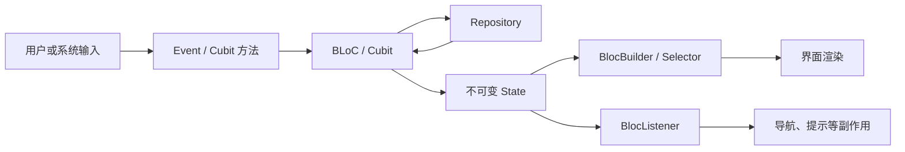
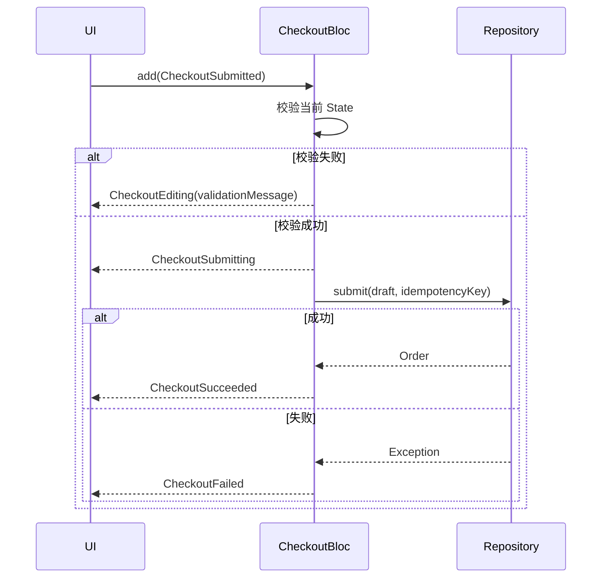
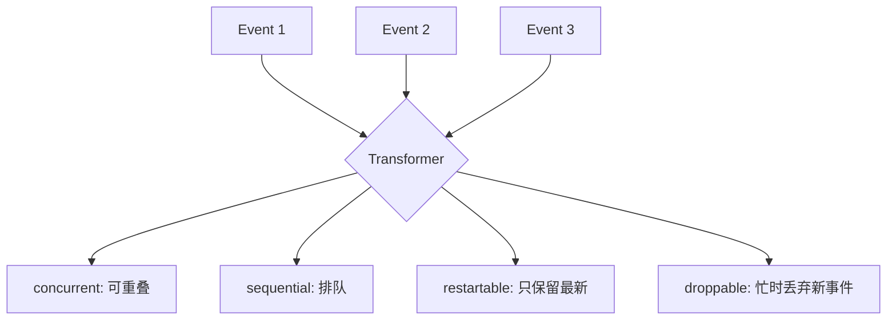

# Flutter BLoC 与响应式架构：事件、状态、并发与副作用

> 本文中的 BLoC 既指 Business Logic Component 架构思想，也讨论 `bloc` 与 `flutter_bloc` Package 的工程用法。重点不是记忆 Widget API，而是建立一条可验证的链路：输入如何变成 Event，业务逻辑如何产生 State，并发事件如何调度，UI 如何渲染状态与处理一次性副作用。

---

## 一、为什么需要显式的状态转换边界

以订单提交页为例，页面需要处理：

- 商品与地址校验；
- 优惠券变化后重新计价；
- 提交期间禁止重复点击；
- 网络超时、库存不足和支付失败；
- 成功后导航到订单详情；
- 页面退出时取消订阅和未完成任务；
- 保留可重试的表单数据。

如果 Widget 同时执行请求、修改多个布尔值、弹提示并导航，很快会出现非法组合，例如 `isLoading == true` 且 `order != null` 且 `error != null`。BLoC 的价值是把输入、业务决策和可渲染状态放在明确边界内。



### 核心结论

1. Cubit 通过方法接收输入，BLoC 通过 Event 接收输入；两者都向外发布 State。
2. Event 表达“发生了什么”，State 表达“当前可观察事实”，不要用 Event 充当长期状态。
3. `BlocBuilder` 负责声明式 UI，`BlocListener` 负责一次性副作用，`BlocSelector` 负责细粒度选择。
4. BLoC 的 `emit` 发布新状态，但不自动保证状态设计正确；应使用不可变对象和合法状态机避免布尔变量组合爆炸。
5. 同一 Event 类型的异步处理可能并发执行。搜索、保存、刷新和提交需要主动选择并发策略。
6. `concurrent`、`sequential`、`restartable`、`droppable` 解决的是事件处理调度，不等同于数据库事务、HTTP 幂等或底层请求取消。
7. BLoC 应依赖 Repository 抽象，不应持有 `BuildContext`、直接导航或弹 SnackBar。
8. `BlocProvider` 的位置决定 BLoC 生命周期；由 Provider 创建的实例通常由其释放，外部已有实例应明确所有权。
9. 响应式架构不意味着所有东西都是 Stream。Widget 局部控制器和短生命周期视觉状态仍可留在 Widget 内。
10. 性能优化应测量重建范围和帧耗时，不能仅凭“用了 BlocSelector”得出更快的结论。

---

## 二、版本边界与 Package 分工

常见依赖包括：

- `bloc`：提供 `Bloc`、`Cubit`、状态流转和事件处理核心；
- `flutter_bloc`：提供 `BlocProvider`、`BlocBuilder`、`BlocListener` 等 Flutter 集成；
- `bloc_concurrency`：提供常用 Event Transformer；
- `bloc_test`：提供状态序列测试辅助能力。

事件默认并发行为、Observer 回调签名、Widget 参数和测试辅助 API 可能随主版本变化。本文说明的是现代 `on<Event>` 注册模型和稳定概念；落地时应以项目 `pubspec.lock` 对应版本文档为准。

---

## 三、Cubit 与 BLoC 如何选择

### 3.1 Cubit：方法就是输入协议

```dart
class CounterCubit extends Cubit<int> {
  CounterCubit() : super(0);

  void increment() => emit(state + 1);
}
```

Cubit 的优点是代码少、调用直接，适合：

- 输入来源单一；
- 状态转换简单；
- 不需要复杂事件调度；
- 方法名已经足以表达业务意图。

### 3.2 BLoC：Event 是显式输入协议

```dart
sealed class CheckoutEvent {
  const CheckoutEvent();
}

final class CheckoutStarted extends CheckoutEvent {
  const CheckoutStarted();
}

final class CouponChanged extends CheckoutEvent {
  const CouponChanged(this.code);
  final String code;
}
```

BLoC 更适合：

- 多个输入源需要汇合；
- 需要审计“发生过哪些事件”；
- 不同事件需要不同并发策略；
- 状态转换本身接近状态机；
- 团队需要统一的输入协议和可追踪性。

### 3.3 不要按项目大小机械选择

Cubit 不是“小项目版 BLoC”，BLoC 也不是天然更高级。一个大型应用可以大量使用 Cubit；一个搜索框也可能因为防抖、取消和多来源输入而适合 BLoC。选择依据应是输入与转换复杂度，而不是代码行数。

---

## 四、Event、State 与业务命令

### 4.1 Event 描述已经发生的输入

好的 Event 名称通常使用过去式：

```dart
final class CheckoutSubmitted extends CheckoutEvent {
  const CheckoutSubmitted();
}

final class ShippingAddressChanged extends CheckoutEvent {
  const ShippingAddressChanged(this.addressId);
  final String addressId;
}
```

Event 不应携带 `BuildContext`、Widget 或导航回调。它应是可测试、可记录的业务输入。

### 4.2 State 描述当前事实

用多个布尔值建模：

```dart
class CheckoutState {
  final bool isLoading;
  final bool isSuccess;
  final bool hasError;
}
```

会产生多个没有业务意义的组合。更清晰的做法是使用 Sealed State：

```dart
sealed class CheckoutState {
  const CheckoutState();
}

final class CheckoutEditing extends CheckoutState {
  const CheckoutEditing({
    required this.draft,
    this.validationMessage,
  });

  final CheckoutDraft draft;
  final String? validationMessage;
}

final class CheckoutSubmitting extends CheckoutState {
  const CheckoutSubmitting(this.draft);
  final CheckoutDraft draft;
}

final class CheckoutSucceeded extends CheckoutState {
  const CheckoutSucceeded(this.orderId);
  final String orderId;
}

final class CheckoutFailed extends CheckoutState {
  const CheckoutFailed({required this.draft, required this.failure});
  final CheckoutDraft draft;
  final CheckoutFailure failure;
}
```

状态类型直接约束合法组合，也让 Dart 的模式匹配帮助检查分支完整性。

### 4.3 状态必须可比较且不可变

`BlocBuilder` 默认会收到每次 State 变化。`buildWhen`、Selector 和测试断言通常依赖相等性。项目可使用手写值相等、代码生成或 `Equatable`，但必须避免原地修改集合：

```dart
// 错误：旧状态和新状态引用同一个可变 List。
state.items.add(item);
emit(state);

// 正确：创建新集合和新 State。
emit(state.copyWith(items: [...state.items, item]));
```

---

## 五、BLoC 的事件处理链路

```dart
class CheckoutBloc extends Bloc<CheckoutEvent, CheckoutState> {
  CheckoutBloc({required CheckoutRepository repository})
      : _repository = repository,
        super(CheckoutEditing(draft: CheckoutDraft.empty())) {
    on<ShippingAddressChanged>(_onAddressChanged);
    on<CheckoutSubmitted>(
      _onSubmitted,
      transformer: droppable(),
    );
  }

  final CheckoutRepository _repository;

  void _onAddressChanged(
    ShippingAddressChanged event,
    Emitter<CheckoutState> emit,
  ) {
    final current = state;
    if (current is! CheckoutEditing) return;

    emit(
      CheckoutEditing(
        draft: current.draft.copyWith(addressId: event.addressId),
      ),
    );
  }

  Future<void> _onSubmitted(
    CheckoutSubmitted event,
    Emitter<CheckoutState> emit,
  ) async {
    final current = state;
    if (current is! CheckoutEditing) return;

    final validation = current.draft.validate();
    if (validation != null) {
      emit(
        CheckoutEditing(
          draft: current.draft,
          validationMessage: validation,
        ),
      );
      return;
    }

    emit(CheckoutSubmitting(current.draft));

    try {
      final order = await _repository.submit(
        current.draft,
        idempotencyKey: current.draft.submissionId,
      );
      emit(CheckoutSucceeded(order.id));
    } on InventoryException catch (error) {
      emit(
        CheckoutFailed(
          draft: current.draft,
          failure: CheckoutFailure.inventory(error.message),
        ),
      );
    } catch (error, stackTrace) {
      addError(error, stackTrace);
      emit(
        CheckoutFailed(
          draft: current.draft,
          failure: const CheckoutFailure.unknown(),
        ),
      );
    }
  }
}
```



`droppable()` 可以忽略处理期间的重复提交事件，但服务端仍应使用幂等键。客户端调度不能替代端到端幂等。

---

## 六、BlocProvider 与生命周期

### 6.1 创建并拥有 BLoC

```dart
BlocProvider(
  create: (context) => CheckoutBloc(
    repository: context.read<CheckoutRepository>(),
  ),
  child: const CheckoutPage(),
)
```

由 `create` 创建的 BLoC 通常由 `BlocProvider` 在作用域移除时关闭。它默认是否 Lazy Create、可用配置和精确行为应以当前 `flutter_bloc` 版本为准。

### 6.2 暴露已有实例

```dart
BlocProvider.value(
  value: existingCheckoutBloc,
  child: const CheckoutSummaryPage(),
)
```

`.value` 用于传递外部已有实例，通常不会替外部所有者关闭它。不要用 `.value` 在 build 中临时创建新 BLoC，否则容易泄漏；也不要把同一个短生命周期 BLoC 无意共享到多个路由。

### 6.3 Scope 决定状态寿命

| Scope | 适合状态 | 常见释放时机 |
|---|---|---|
| App | 会话、全局连接状态 | 应用对象图销毁 |
| Feature | 功能共享筛选、业务流程 | 离开功能域 |
| Route | 表单、详情、分页 | 路由移除 |
| Component | 可复用复杂组件状态 | 组件卸载 |

页面 BLoC 放到 App 根部会延长资源和陈旧状态寿命；放得过低则可能因局部重建而重复创建。应根据状态所有权确定 Scope，而不是为了“方便读取”一律放到根节点。

### 6.4 close 中释放自有资源

```dart
class ConnectivityCubit extends Cubit<ConnectionState> {
  ConnectivityCubit(ConnectivityService service)
      : _subscription = service.states.listen((value) {}),
        super(const ConnectionState.unknown());

  final StreamSubscription<ConnectionState> _subscription;

  @override
  Future<void> close() async {
    await _subscription.cancel();
    return super.close();
  }
}
```

示例只强调所有权：实际监听回调应安全调用 `emit`，并处理订阅错误。BLoC 创建的订阅、定时器和取消令牌都应在 `close()` 中释放。

---

## 七、BlocBuilder：State 到 UI

```dart
BlocBuilder<CheckoutBloc, CheckoutState>(
  builder: (context, state) {
    return switch (state) {
      CheckoutEditing(:final draft, :final validationMessage) =>
        CheckoutForm(
          draft: draft,
          validationMessage: validationMessage,
        ),
      CheckoutSubmitting(:final draft) => CheckoutForm(
          draft: draft,
          isSubmitting: true,
        ),
      CheckoutSucceeded() => const CheckoutCompletedView(),
      CheckoutFailed(:final draft) => CheckoutForm(draft: draft),
    };
  },
)
```

Builder 必须尽量保持纯粹：同一 State 应产生同一 UI 描述。不要在 builder 中发请求、添加 Event、导航或弹提示，否则重建可能重复执行副作用。

### 7.1 buildWhen 的边界

```dart
BlocBuilder<CartBloc, CartState>(
  buildWhen: (previous, current) =>
      previous.items != current.items,
  builder: (context, state) => CartList(items: state.items),
)
```

`buildWhen` 是性能过滤器，不是业务正确性机制。即使跳过构建，BLoC 的 State 已经变化。条件遗漏可能让 UI 长期显示旧数据，使用前必须有明确的状态字段边界。

---

## 八、BlocListener：State 到一次性副作用

导航、对话框、SnackBar、埋点等不是持久 UI，使用 Listener：

```dart
BlocListener<CheckoutBloc, CheckoutState>(
  listenWhen: (previous, current) =>
      current is CheckoutSucceeded || current is CheckoutFailed,
  listener: (context, state) {
    switch (state) {
      case CheckoutSucceeded(:final orderId):
        Navigator.of(context).pushReplacementNamed(
          '/orders/$orderId',
        );
      case CheckoutFailed(:final failure):
        ScaffoldMessenger.of(context).showSnackBar(
          SnackBar(content: Text(failure.userMessage)),
        );
      default:
        break;
    }
  },
  child: const CheckoutBody(),
)
```

### 8.1 UI State 与副作用分离

“提交失败”可能同时有两种需求：

- 页面需要持续显示错误面板：错误属于 State；
- 失败发生时只弹一次提示：提示属于副作用。

可以让同一个失败 State 同时驱动 Builder 和 Listener，但要防止页面重挂后重复消费。对必须严格消费一次的事件，可设计带唯一 `operationId` 的效果状态、独立 Effect Stream，或在导航层集中处理。不要简单放一个 `showSnackBar` 布尔值并依赖随后立刻重置，这容易制造额外状态和竞态。

`BlocConsumer` 可组合 Builder 与 Listener，但职责较复杂时分开写通常更清晰。

---

## 九、BlocSelector：缩小订阅粒度

```dart
BlocSelector<CartBloc, CartState, int>(
  selector: (state) => state.items.length,
  builder: (context, itemCount) {
    return CartBadge(count: itemCount);
  },
)
```

只有选择结果发生变化时，Builder 才需要重建。选择结果应不可变并具有可靠相等性。

也可使用 `context.select` 完成相似目标。不要把整个 State 选出来，也不要在 selector 中执行昂贵计算或副作用。复杂派生值更适合在 BLoC 或领域层预先计算并测试。

---

## 十、Event Transformer 与并发语义

现代 BLoC 的 Event Handler 可能异步执行。若短时间添加多个同类型事件，必须明确新事件与正在执行任务的关系。



### 10.1 concurrent：允许重叠

适合相互独立、完成顺序不影响正确性的操作，例如加载互不相关的缩略图。

风险是后发请求可能先完成，旧请求随后覆盖新 State。不能只因为吞吐更高就默认使用。

### 10.2 sequential：严格排队

```dart
on<CartQuantityChanged>(
  _onQuantityChanged,
  transformer: sequential(),
);
```

适合顺序影响结果的操作，例如按次序应用编辑命令。代价是慢任务会阻塞后续事件，队列还可能持续增长。高频输入应先合并或防抖。

### 10.3 restartable：新事件替换旧处理

```dart
on<SearchQueryChanged>(
  _onQueryChanged,
  transformer: restartable(),
);
```

适合搜索建议、筛选查询等“只关心最新输入”的场景。

> `restartable` 取消的是前一个事件 Handler 的继续消费语义，不应据此假设底层 HTTP 请求必然中止。真正取消网络请求仍需 Repository 和客户端支持取消令牌。

### 10.4 droppable：忙时忽略新事件

```dart
on<CheckoutSubmitted>(
  _onSubmitted,
  transformer: droppable(),
);
```

适合处理期间不接受重复触发的提交按钮。它不适合“最后一次输入必须生效”的场景，因为忙时的新事件会被丢弃。

### 10.5 Transformer 通常按 Event Handler 生效

不同 Event 类型注册在不同 Handler 上时，它们之间未必共享同一队列。若 `ProfileSaved` 和 `AvatarUploaded` 都修改同一聚合状态，只分别配置 `sequential()` 仍可能相互并发。

需要跨事件类型严格排序时，可以：

- 统一成同一父 Event Handler 并谨慎分派；
- 将共享写入串行化到 Repository/Domain Service；
- 使用事务、版本号或乐观锁保证数据层一致性。

不要把 Event Transformer 当作全局事务调度器。

---

## 十一、搜索场景：防抖、restartable 与取消

```dart
EventTransformer<E> debounceRestartable<E>(Duration duration) {
  return (events, mapper) {
    return restartable<E>().call(
      events.debounce(duration),
      mapper,
    );
  };
}
```

上例依赖项目选用的 Stream 扩展 Package，具体 API 需按依赖版本调整。核心顺序是先防抖，再只处理最新事件。

完整工程还需要：

1. 标准化关键词并忽略空白；
2. 最小查询长度；
3. Repository 缓存相同查询；
4. 客户端取消旧请求；
5. 区分取消与真实错误；
6. 防止旧结果提交；
7. 页面关闭时释放定时器和请求。

即使 Handler 被替换，服务端仍可能已经处理旧请求。对有副作用的写请求不能盲目使用 restartable。

---

## 十二、响应式架构中的 Repository 边界

BLoC 负责应用状态转换，Repository 负责数据访问策略：

```dart
abstract interface class OrderRepository {
  Future<Order> submit(
    CheckoutDraft draft, {
    required String idempotencyKey,
  });

  Stream<OrderStatus> watchStatus(String orderId);
}
```

Repository 应处理或协调：

- 网络与本地数据源；
- DTO 到领域模型转换；
- 缓存与一致性；
- 请求取消和超时；
- 错误分类；
- 幂等、重试与鉴权刷新。

BLoC 不应拼接 HTTP URL、解析 JSON 或直接操作数据库。否则事件测试会被基础设施细节污染，也很难在不同环境替换实现。

### 12.1 Stream 订阅方式

可以通过 `emit.forEach` 等当前版本支持的 API 将 Stream 映射为 State，也可以手动持有订阅。无论哪种方式，都要说明：

- Stream Error 如何转换；
- Stream 完成后 State 是什么；
- 新订阅是否替换旧订阅；
- BLoC close 时是否取消；
- 单订阅流能否被多处监听。

---

## 十三、错误、重试与状态恢复

不要把原始 Exception 直接显示给用户。Repository 或领域层应映射成稳定失败类型：

```dart
sealed class CheckoutFailure {
  const CheckoutFailure();

  const factory CheckoutFailure.inventory(String message) =
      InventoryFailure;
  const factory CheckoutFailure.network() = NetworkFailure;
  const factory CheckoutFailure.unknown() = UnknownCheckoutFailure;
}
```

重试策略需要区分：

- 查询请求可按网络错误进行有限指数退避；
- 写请求只有在幂等语义明确时才能自动重试；
- 参数错误、权限错误通常不应自动重试；
- 用户取消不应计入故障告警；
- 重试期间要允许页面退出并终止后续任务。

失败 State 应保留可恢复所需的输入，例如 Checkout Draft，而不是只留下错误字符串。

---

## 十四、测试：验证状态序列与并发边界

### 14.1 Cubit/BLoC 单元测试

```dart
blocTest<CheckoutBloc, CheckoutState>(
  '提交成功时依次输出 submitting 和 succeeded',
  build: () => CheckoutBloc(
    repository: FakeCheckoutRepository.success(orderId: 'o-1'),
  ),
  seed: () => CheckoutEditing(
    draft: CheckoutDraft.valid(submissionId: 'request-1'),
  ),
  act: (bloc) => bloc.add(const CheckoutSubmitted()),
  expect: () => [
    isA<CheckoutSubmitting>(),
    isA<CheckoutSucceeded>().having(
      (state) => state.orderId,
      'orderId',
      'o-1',
    ),
  ],
  verify: (bloc) {
    // 同时验证 Repository 调用次数与幂等键。
  },
);
```

`blocTest` 的精确参数以当前版本为准。除状态序列外，还应测试：

- 无效输入不调用 Repository；
- 重复提交只执行一次；
- 搜索旧结果不覆盖新结果；
- 关闭 BLoC 后订阅被取消；
- 不同错误映射到正确失败类型；
- 重试次数、退避和幂等键符合预期。

### 14.2 Widget 测试

通过 `BlocProvider.value` 注入测试实例，验证 State 到 UI 的映射，以及 Listener 是否触发导航或提示。测试结束时由测试代码关闭自己创建的 BLoC，避免把所有权误交给 `.value`。

### 14.3 并发测试不能只等待固定时间

固定 `Future.delayed` 容易产生不稳定测试。更可靠的 Fake Repository 应暴露可控 Completer，让测试明确决定每个请求的完成顺序，从而验证 concurrent、restartable 或 droppable 的行为。

---

## 十五、可观测性与调试

`BlocObserver` 可以集中观察创建、Event、Transition、Error 和关闭。具体回调签名随 `bloc` 版本变化。

生产观测应遵守：

- Event 和 State 日志脱敏；
- 高频输入采样或聚合；
- 使用业务操作 ID 关联请求、Event 与 State；
- 错误保留 StackTrace；
- Observer 不修改业务状态；
- 不在日志中序列化图片、长列表或完整响应。

Transition 日志能解释状态如何变化，但不能单独定位掉帧。应将时间戳与 DevTools Timeline、网络 Trace 和目标设备指标关联。

---

## 十六、性能：控制重建与状态粒度

常见问题不是 BLoC 太多，而是一个巨大 State 高频变化，导致大范围 Widget 反复构建。

### 16.1 优化方向

- 将生命周期和变化频率不同的状态拆开；
- 使用 `BlocSelector` 或 `context.select` 订阅稳定投影；
- 保持 State 不可变并实现正确相等性；
- 避免 State 携带持续增长的日志和巨大原始数据；
- 高频 Event 做防抖、合并或限流；
- 不在 Builder 中进行同步重计算、JSON 解析或 IO；
- 列表项只订阅自身真正需要的数据。

### 16.2 测量方法

1. 在目标真机使用 Profile 模式复现真实操作；
2. 用 DevTools Timeline 区分 Build、Layout、Paint 和 Raster 开销；
3. 开启 Widget rebuild profiling 观察 Builder 重建范围；
4. 对 Observer 日志采样，统计 Event 频率和 Handler 耗时；
5. 检查 60 Hz 设备约 16.7 ms、120 Hz 设备约 8.3 ms 的帧预算；
6. 优化前后使用相同设备、数据和交互进行对照。

Debug 模式的日志和断言开销不能作为发布性能依据。减少重建也不必然减少 Raster 时间，应依据瓶颈所在阶段优化。

---

## 十七、常见误区与修复

### 17.1 在 BlocBuilder 中 add Event

Builder 可能多次执行，导致重复请求甚至重建循环。初始加载可在 BLoC 创建后显式添加一次 Event，或由清晰的路由生命周期触发。

### 17.2 BLoC 持有 BuildContext

这会让业务层依赖 Widget 生命周期并难以测试。BLoC 只发布 State；导航、Dialog 和本地化文案由 UI Listener 处理。

### 17.3 所有事件都使用 sequential

虽然看似安全，但慢请求会阻塞无关事件并形成长队列。应按事件语义分别选择 Transformer，并在数据层处理共享一致性。

### 17.4 对搜索使用 droppable

忙时会丢掉用户最后输入，最终结果可能对应旧关键词。搜索通常更适合防抖加 restartable。

### 17.5 对订单提交只使用 droppable

它只能减少客户端重复 Handler，不能阻止多设备、重试或网络层重复提交。服务端仍需幂等键和一致性约束。

### 17.6 State 中混入一次性命令

把 `navigateTo = '/success'` 当持久状态，页面重挂时可能再次导航。应使用 Listener 处理状态迁移，必要时引入明确的 Effect 通道和消费协议。

### 17.7 忽略 close

BLoC 自己创建的 StreamSubscription、Timer 和取消令牌必须释放。依赖注入进来的共享 Repository 通常不应由页面 BLoC 擅自关闭。

### 17.8 为所有局部状态创建 BLoC

动画、焦点、输入控制器和单个组件的展开状态通常留在 Widget 更合适。过度抽象会增加事件、类型和测试维护成本。

---

## 十八、BLoC、Cubit、Riverpod 与 Provider 的工程选择

| 方案 | 输入模型 | 并发表达 | 主要优势 | 主要成本 |
|---|---|---|---|---|
| Cubit | 方法调用 | 业务代码自行控制 | 简洁、状态转换集中 | 输入历史不如 Event 显式 |
| BLoC | Event | Event Transformer | 事件协议、调度和追踪清晰 | 类型与样板代码更多 |
| Riverpod | Provider/Notifier 方法 | Provider 生命周期与业务控制 | 依赖图、组合和 Override 强 | 需理解 Provider 生命周期 |
| Provider | 对象方法与 Listenable | 通常自行控制 | 上手直接、贴近 Widget Tree | 复杂异步调度约束较少 |

框架不能替代状态设计。团队应先确定状态所有权、生命周期、并发和副作用，再选择最能稳定表达这些约束的工具。迁移现有项目时应按功能域渐进替换，并在边界层保持单一事实源，避免两套框架双向同步同一状态。

---

## 十九、工程落地清单

1. 先画出输入、状态、Repository 和副作用链路。
2. 简单方法协议使用 Cubit，复杂事件与调度使用 BLoC。
3. 用 Sealed State 或等价状态机排除非法状态组合。
4. Event 不携带 Context，BLoC 不执行导航和弹窗。
5. Builder 只渲染，Listener 处理一次性副作用，Selector 控制粒度。
6. 为每类异步 Event 明确 concurrent、sequential、restartable 或 droppable。
7. 把请求取消、重试、幂等和数据一致性落实到 Repository 与服务端。
8. 根据 Scope 创建 BLoC，并在 close 中释放自有资源。
9. 测试状态序列、调用次数、异常和乱序完成，而不只测试成功路径。
10. 在目标设备 Profile 模式测量后再进行重建优化。

---

## 总结

BLoC 的核心不是“Event 进、State 出”的口号，而是建立可审计的状态转换边界。Cubit 用方法表达输入，BLoC 用 Event 表达输入；两者都应依赖清晰的 Repository，并发布不可变、合法且可渲染的 State。

工程中最容易被忽略的是异步并发：`concurrent` 允许重叠，`sequential` 保证同一处理队列顺序，`restartable` 只关心最新处理，`droppable` 忙时忽略新输入。它们只解决 Handler 调度，不能替代请求取消、事务或服务端幂等。UI 侧则应坚持 Builder 渲染、Listener 副作用、Selector 缩小订阅，并通过生命周期管理、测试和 Profile 数据验证架构是否真正可靠。

---

## 问答复盘

### Q1：Cubit 和 BLoC 的本质区别是什么？

**答：** Cubit 通过方法接收输入，BLoC 通过 Event 接收输入。两者都发布 State；是否需要显式事件协议和事件调度，是主要选择依据。

### Q2：为什么不建议用多个布尔值表示 Loading、Success 和 Error？

**答：** 多个布尔值会产生非法组合。Sealed State 或判别联合能让每个状态只表达一种合法事实，并帮助编译器检查 UI 分支。

### Q3：BlocBuilder 和 BlocListener 可以互换吗？

**答：** 不可以。Builder 用于可重复的声明式 UI，Listener 用于导航、提示等一次性副作用。在 Builder 中执行副作用可能因重建而重复触发。

### Q4：搜索输入应该使用 droppable 还是 restartable？

**答：** 通常使用防抖加 restartable，因为最后一次输入必须生效。droppable 会在忙时丢掉新事件，可能留下旧查询结果。

### Q5：restartable 是否一定会取消已经发送的 HTTP 请求？

**答：** 不一定。它控制 Event Handler 的消费语义；底层请求是否停止取决于客户端和 Repository 是否支持并连接取消机制。

### Q6：订单提交使用 droppable 后，为什么还需要服务端幂等？

**答：** droppable 只防止当前 BLoC 忙时处理新事件，无法覆盖网络重试、多设备或进程重启。端到端重复写入仍需幂等键和服务端约束。

### Q7：两个不同 Event Handler 都配置 sequential，是否保证彼此严格串行？

**答：** 不能简单保证。Transformer 通常作用于各自 Handler 的事件流；共享数据的一致性应通过统一调度或数据层事务、版本控制解决。

### Q8：BlocSelector 为什么要求选择结果不可变？

**答：** Selector 依赖前后结果的相等性判断变化。原地修改可变对象可能保持相同引用，使 UI 错过应有重建。

### Q9：页面退出后仍收到 Stream 数据，应检查什么？

**答：** 检查 BLoC Scope 是否过高、Provider 是否负责关闭实例、`close()` 是否取消自有订阅，以及 Repository 是否仍持有回调或共享连接。

### Q10：如何验证事件并发策略真的正确？

**答：** 使用可控 Completer 构造不同请求完成顺序，断言最终 State、Repository 调用次数和取消行为；不要只依赖固定延迟或正常网络顺序。

---

## 延伸知识

- UI 状态机、Sealed Class 与不可变数据；
- Reactive Streams、背压、节流与防抖；
- HTTP 取消、幂等键、乐观锁与事务边界；
- Repository、Use Case 与分层架构；
- BlocObserver、分布式 Trace 与状态调试；
- Golden Test、Widget Test 与异步并发测试。
