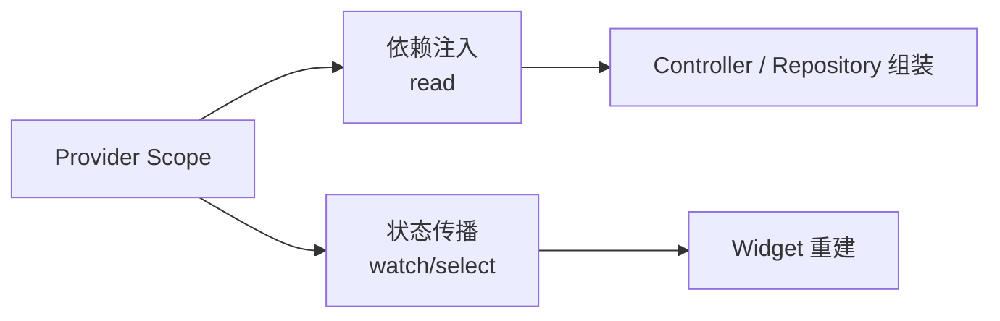
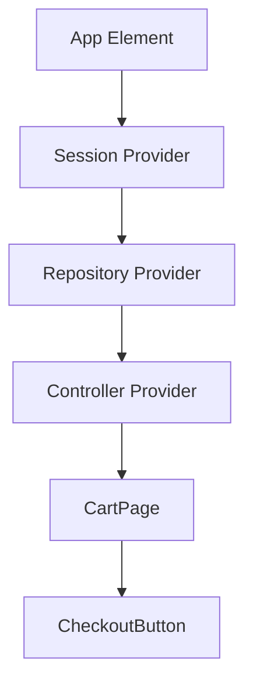
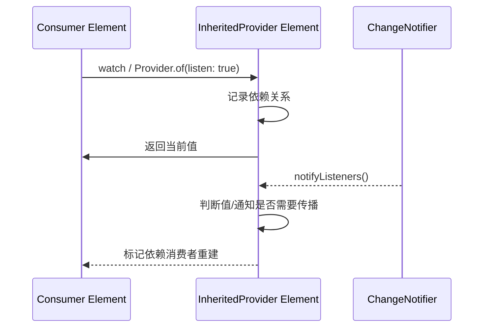
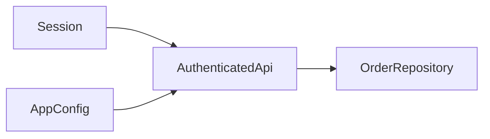
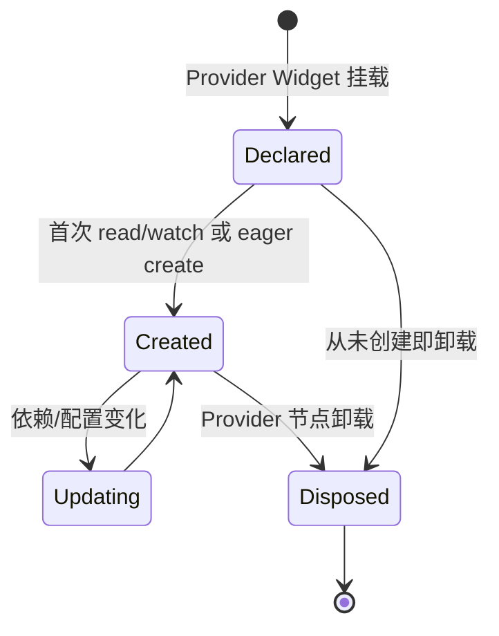
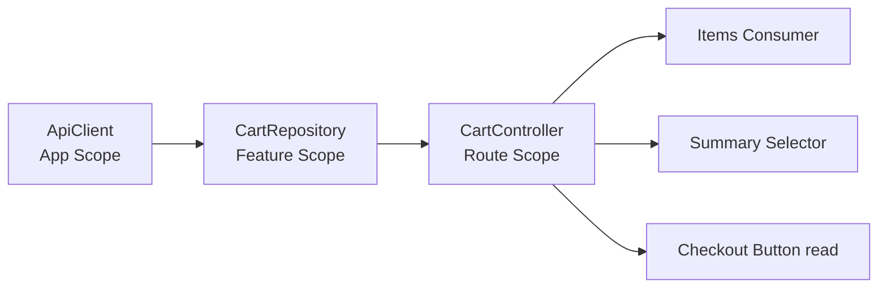

# Flutter Provider：从 InheritedWidget 原理到生命周期与性能

> 本文讨论 `provider` Package，而不是泛指“数据提供者”。重点是 Provider 如何利用 Element Tree 建立作用域和依赖，`read/watch/select` 为什么产生不同重建行为，以及对象创建、异步订阅和释放究竟由谁负责。

---

## 一、Provider 解决的不是“把状态变全局”

一个购物车页面可能依赖：

- 全应用共享的登录会话；
- 当前页面使用的 CartController；
- CartController 依赖的 CartRepository；
- Repository 依赖的 ApiClient；
- 购物车商品列表、总价、提交状态和错误；
- 页面局部的展开状态、滚动位置和输入焦点。

如果把这些都放进根节点 Provider：

- 页面退出后局部对象可能继续存活；
- 高频购物车状态可能扩大整个应用的订阅范围；
- Controller 与 Repository 的资源所有权变得模糊；
- 测试需要构造一个巨大的全局 Provider 图；
- Ephemeral State 被错误提升成 Application State。

Provider 的真正价值是：

1. 在 Widget Tree 中定义对象或状态的 Scope；
2. 让后代通过类型查找最近的匹配值；
3. 根据监听方式建立 Element 依赖；
4. 将对象创建、更新和销毁绑定到对应 Provider 节点生命周期；
5. 用 Selector 等机制控制消费者重建粒度。

### 核心结论

1. Provider 建立在 Flutter Inherited 依赖传播机制之上，Package 通过 `InheritedProvider` 等内部组件封装创建、监听、更新和释放逻辑。
2. Provider Scope 由 Widget Tree 位置决定；同一类型存在多个 Provider 时，后代通常读取距离最近的祖先。
3. `context.read<T>()` 只获取当前值，不注册依赖；`watch<T>()` 监听整个值；`select<T, R>()` 只监听投影结果 R。
4. `MultiProvider` 主要减少嵌套语法，不会让运行时的 Provider 层级和生命周期边界消失。
5. `ChangeNotifierProvider(create:)` 通常拥有并自动 dispose 创建的 Notifier；`.value` 用于暴露外部已有实例，不应让 Provider 错误接管所有权。
6. Provider 默认通常采用 Lazy Create：对象在首次读取时创建，而不是 Provider Widget 一挂载就必然创建；可通过版本支持的 `lazy` 配置改变。
7. FutureProvider 和 StreamProvider 将异步结果暴露给子树，但 Loading、Error、刷新和并发语义仍需业务建模，不能只依赖 nullable 值。
8. ProxyProvider 用于根据其他 Provider 派生或重组依赖，`update` 可能重复执行，必须保持幂等并明确旧实例复用与资源释放。
9. Provider 不等于 ChangeNotifier；Provider 可以暴露不可变配置、Repository、ValueNotifier、Stream 结果或其他对象。
10. Provider 也不等于完整架构。状态所有权、单一事实源、异步竞态、错误、缓存和副作用仍由业务设计负责。

---

## 二、先区分 Provider 的两种角色

### 2.1 依赖注入

```dart
Provider<CartRepository>(
  create: (context) => RemoteCartRepository(
    api: context.read<CartApi>(),
  ),
  child: const CartPage(),
)
```

这里 Repository 主要作为依赖被查找，不一定发生变化，也不要求消费者重建。

### 2.2 状态监听

```dart
ChangeNotifierProvider<CartController>(
  create: (context) => CartController(
    repository: context.read<CartRepository>(),
  )..load(),
  child: const CartPage(),
)
```

CartController 发出通知后，监听它的消费者可能重建。

### 2.3 两者不能混为一谈



一个对象可以同时被注入和监听，但每个消费者都应明确自己需要：

- 只调用命令；
- 监听全部状态；
- 只监听一个派生字段。

业务对象不应主动保存 BuildContext 并随处 `read()`。更可测试的方式仍是构造函数注入，Provider 只在 Composition Root 或 Widget Scope 负责组装。

---

## 三、Provider 原理：从祖先查找到依赖注册

### 3.1 Element Tree 是查找基础

Provider 把值放在 Widget Tree 的某个位置。后代使用 Context 查找最近的对应 Provider，而 BuildContext 本质上由 Element 实现。



CheckoutButton 能读取 Controller，是因为其 Element 位于 Controller Provider 的后代范围内。

### 3.2 监听读取

职责级链路：



内部类名、判断和监听策略会随 provider 版本变化。稳定契约是：监听读取会让当前 Context 对上层 Provider 建立依赖，Provider 更新时相应 Element 被标记重建。

### 3.3 非监听读取

`read()` 查找当前值但不建立重建依赖。因此适合事件回调：

```dart
FilledButton(
  onPressed: () {
    context.read<CartController>().checkout();
  },
  child: const Text('Checkout'),
)
```

按钮不需要因为购物车任意状态变化而重建，只需要在点击时获得 Controller 并发送命令。

### 3.4 为什么刚创建 Provider 的 Context 读不到它

错误：

```dart
@override
Widget build(BuildContext context) {
  return Provider<CartController>(
    create: (_) => CartController(),
    child: Text(context.watch<CartController>().title),
  );
}
```

传入 `build()` 的 Context 位于新 Provider 的父级，不能向下查找刚返回的 Provider。

修复方式之一是抽取子 Widget：

```dart
@override
Widget build(BuildContext context) {
  return Provider<CartController>(
    create: (_) => CartController(),
    child: const CartTitle(),
  );
}

class CartTitle extends StatelessWidget {
  const CartTitle({super.key});

  @override
  Widget build(BuildContext context) {
    return Text(context.watch<CartController>().title);
  }
}
```

也可以使用 Builder 创建 Provider 下方的新 Context。关键不是 API，而是 Context 的树位置。

---

## 四、Provider Scope 与同类型覆盖

同一类型可以在不同子树提供不同实例：

```dart
Column(
  children: [
    Provider<Currency>.value(
      value: const Currency('CNY'),
      child: const ChinaPricePanel(),
    ),
    Provider<Currency>.value(
      value: const Currency('USD'),
      child: const GlobalPricePanel(),
    ),
  ],
)
```

每个 Panel 读取最近祖先的 Currency。

### 4.1 Scope 是生命周期设计

| Scope | 适合对象 | 退出后是否应释放 |
|---|---|---|
| App Root | Session、AppConfig、共享基础服务 | 通常随应用对象图 |
| Feature | Repository、业务协调器、功能缓存 | 离开功能域时视需求释放 |
| Route/Page | 页面 Controller、表单状态、订阅 | 页面移除时通常释放 |
| Component | 局部编辑器、短生命周期 Notifier | 组件卸载时释放 |

Provider 放得越高，对象存活越久，潜在消费者越多。放得过低则会重复创建、丢失共享状态或导致页面切换后缓存失效。

### 4.2 类型冲突

如果同一层级需要两个相同基础类型，例如两个 String 或两个 ApiClient，仅靠泛型类型查找无法表达语义。应使用语义类型：

```dart
final class ApiBaseUrl {
  const ApiBaseUrl(this.value);
  final Uri value;
}

final class AssetBaseUrl {
  const AssetBaseUrl(this.value);
  final Uri value;
}
```

不要依赖 Provider 顺序来区分两个没有语义的 String。

---

## 五、MultiProvider：扁平语法，不是扁平运行时

嵌套写法：

```dart
Provider<ApiClient>(
  create: (_) => ApiClient(),
  child: Provider<CartRepository>(
    create: (context) => RemoteCartRepository(
      api: context.read<ApiClient>(),
    ),
    child: ChangeNotifierProvider<CartController>(
      create: (context) => CartController(
        repository: context.read<CartRepository>(),
      ),
      child: const CartPage(),
    ),
  ),
)
```

MultiProvider 写法：

```dart
MultiProvider(
  providers: [
    Provider<ApiClient>(
      create: (_) => ApiClient(),
      dispose: (_, client) => client.close(),
    ),
    Provider<CartRepository>(
      create: (context) => RemoteCartRepository(
        api: context.read<ApiClient>(),
      ),
    ),
    ChangeNotifierProvider<CartController>(
      create: (context) => CartController(
        repository: context.read<CartRepository>(),
      )..load(),
    ),
  ],
  child: const CartPage(),
)
```

### 5.1 顺序仍然重要

后面的 Provider 可以读取前面已经位于其祖先位置的 Provider。反向依赖会查找失败。

### 5.2 MultiProvider 不消除节点

概念上它仍构造嵌套 Provider：

```text
Provider<ApiClient>
  → Provider<CartRepository>
    → ChangeNotifierProvider<CartController>
      → CartPage
```

因此：

- Scope 顺序仍存在；
- 每个 Provider 仍有独立创建和销毁；
- Context 位置规则不变；
- 不能用 MultiProvider 解决循环依赖。

### 5.3 避免超大根 MultiProvider

所有功能对象都放在 App 根部，会把 Composition Root 变成无边界 Service Registry。可按 Feature 封装：

```dart
class CartScope extends StatelessWidget {
  const CartScope({super.key, required this.child});

  final Widget child;

  @override
  Widget build(BuildContext context) {
    return MultiProvider(
      providers: [
        Provider<CartRepository>(
          create: (context) => RemoteCartRepository(
            api: context.read<ApiClient>(),
          ),
        ),
        ChangeNotifierProvider<CartController>(
          create: (context) => CartController(
            repository: context.read<CartRepository>(),
          ),
        ),
      ],
      child: child,
    );
  }
}
```

---

## 六、ChangeNotifierProvider：监听可变通知对象

`ChangeNotifier` 提供命令式可变状态和 `notifyListeners()` 广播。

### 6.1 一个可验证的状态模型

```dart
@immutable
class CartState {
  const CartState({
    this.items = const <CartItem>[],
    this.isRefreshing = false,
    this.errorMessage,
  });

  final List<CartItem> items;
  final bool isRefreshing;
  final String? errorMessage;

  int get totalQuantity =>
      items.fold(0, (total, item) => total + item.quantity);

  CartState copyWith({
    List<CartItem>? items,
    bool? isRefreshing,
    String? errorMessage,
    bool clearError = false,
  }) {
    return CartState(
      items: items ?? this.items,
      isRefreshing: isRefreshing ?? this.isRefreshing,
      errorMessage: clearError ? null : errorMessage ?? this.errorMessage,
    );
  }
}
```

ChangeNotifier 保存一个不可变快照，可以降低 Widget 直接修改内部集合的风险：

```dart
class CartController extends ChangeNotifier {
  CartController({required CartRepository repository})
      : _repository = repository;

  final CartRepository _repository;
  CartState _state = const CartState();
  int _requestGeneration = 0;

  CartState get state => _state;

  Future<void> refresh() async {
    final generation = ++_requestGeneration;
    _setState(_state.copyWith(isRefreshing: true, clearError: true));

    try {
      final items = await _repository.fetchCart();
      if (generation != _requestGeneration) return;
      _setState(CartState(items: List.unmodifiable(items)));
    } catch (error) {
      if (generation != _requestGeneration) return;
      _setState(_state.copyWith(
        isRefreshing: false,
        errorMessage: 'Cart refresh failed',
      ));
    }
  }

  void _setState(CartState next) {
    if (identical(_state, next)) return;
    _state = next;
    notifyListeners();
  }

  @override
  void dispose() {
    _requestGeneration++;
    super.dispose();
  }
}
```

`dispose()` 中增加代次只会让已返回结果失效，不会取消底层网络。若 Repository 支持 Cancellation Token，还应传播真正取消信号。

### 6.2 `create` 构造函数与所有权

```dart
ChangeNotifierProvider(
  create: (context) => CartController(
    repository: context.read<CartRepository>(),
  ),
  child: const CartPage(),
)
```

Provider 创建 Controller，因此通常负责在节点卸载时调用 `dispose()`。

### 6.3 `.value` 构造函数

```dart
final controller = widget.controller;

return ChangeNotifierProvider<CartController>.value(
  value: controller,
  child: const CartPageBody(),
);
```

`.value` 用于暴露外部已有实例，Provider 通常不会把它当作自己创建的对象处理。外部所有者必须负责释放。

错误：

```dart
// 错误倾向：在 build 中创建新对象并交给 .value。
ChangeNotifierProvider.value(
  value: CartController(repository: repository),
  child: const CartPage(),
)
```

Build 可多次执行，新对象可能反复创建，所有权和 dispose 不清晰。新对象应使用 `create:`。

### 6.4 列表复用场景

当已有 Notifier 与某个业务 Item 同生命周期，并被列表节点暴露时可使用 `.value`，但必须用稳定 Key 保证 Widget/Element 身份，并由更上层明确管理 Notifier Map 与淘汰。

不要因为“列表里要用 .value”就永久缓存每个 Item Controller。

---

## 七、`notifyListeners()` 的边界

ChangeNotifier 的通知是同步广播。调用后，Provider 相关监听逻辑会让消费者进入后续重建流程。

### 7.1 通知不是状态

`notifyListeners()` 不携带具体变化字段，所有监听者只能重新读取 Controller。因此：

- Controller 应先完成状态赋值，再通知；
- 一次业务事务尽量只发布一次一致快照；
- 不要公开可变 List，让外部修改后忘记通知；
- 不要用通知次数表达业务事件数量。

### 7.2 批量更新

错误：

```dart
void replaceItems(List<CartItem> items) {
  _items.clear();
  notifyListeners();
  _items.addAll(items);
  notifyListeners();
}
```

消费者会观察到中间空状态。应一次提交最终快照：

```dart
void replaceItems(List<CartItem> items) {
  _state = _state.copyWith(items: List.unmodifiable(items));
  notifyListeners();
}
```

### 7.3 不要在 Build 中同步修改被监听状态

Widget Build 应是声明式读取。Build 期间同步调用 Controller 更新，可能造成树中不同消费者观察到不一致时刻或触发 Framework 断言。

初始化加载优先放在 Provider `create`、State `initState` 的受控入口，或由路由/协调器显式触发，而不是在 Consumer Builder 中无条件调用。

---

## 八、`read`、`watch`、`select` 的订阅语义

### 8.1 `read`

```dart
onPressed: () => context.read<CartController>().checkout(),
```

用途：

- 发送命令；
- 初始化另一个对象；
- 事件回调中读取当前依赖；
- 不希望当前 Widget 因该 Provider 更新而重建。

风险：在 Build 中用 read 读取会变化且影响 UI 的值，界面不会自动刷新。

### 8.2 `watch`

```dart
@override
Widget build(BuildContext context) {
  final controller = context.watch<CartController>();
  return Text('${controller.state.totalQuantity}');
}
```

Controller 任意 `notifyListeners()` 都可能让该 Widget 重建，即使 totalQuantity 没变。

### 8.3 `select`

```dart
@override
Widget build(BuildContext context) {
  final quantity = context.select<CartController, int>(
    (controller) => controller.state.totalQuantity,
  );
  return Text('$quantity');
}
```

只有选择结果根据 provider 当前相等性策略被判定变化时，该消费者才需要重建。

### 8.4 对比

| API | 注册依赖 | 适用场景 | 常见错误 |
|---|:---:|---|---|
| `read<T>()` | 否 | 命令和一次性读取 | 用它渲染动态 UI |
| `watch<T>()` | 是，整个 T | 小对象或确实需要全部变化 | 页面顶层监听大 Controller |
| `select<T, R>()` | 是，投影 R | 细粒度派生值 | 每次返回新集合导致持续变化 |

### 8.5 Selector 返回值稳定性

错误倾向：

```dart
final names = context.select<CartController, List<String>>(
  (controller) => controller.state.items
      .map((item) => item.name)
      .toList(),
);
```

每次选择都创建新 List。即使内容相同，默认比较通常不能把两个普通 List 视为相等。

改进方式：

- 选择稳定的标量、枚举、ID 或不可变值对象；
- 在 Controller State 中提供结构共享的不可变投影；
- 使用 `Selector` 的版本能力配置自定义比较；
- 不要为了 Selector 重复保存可推导事实，除非测量证明值得缓存。

---

## 九、Consumer 与 Selector Widget

### 9.1 Consumer 缩小 Builder 区域

```dart
class CartPage extends StatelessWidget {
  const CartPage({super.key});

  @override
  Widget build(BuildContext context) {
    return Scaffold(
      appBar: AppBar(title: const Text('Cart')),
      body: Consumer<CartController>(
        builder: (context, controller, child) {
          return CartList(items: controller.state.items);
        },
      ),
    );
  }
}
```

Consumer 本身不是性能魔法。它的价值是把依赖注册放到更小的 Element 边界。

### 9.2 `child` 参数

```dart
Consumer<CartController>(
  child: const CheckoutIcon(),
  builder: (context, controller, child) {
    return Row(
      children: [
        child!,
        Text('${controller.state.totalQuantity}'),
      ],
    );
  },
)
```

稳定 Child 不会因为 Builder 再次执行而重新创建配置，但是否还有 Layout/Paint 取决于父结构和实际属性变化。

### 9.3 Selector Widget

```dart
Selector<CartController, bool>(
  selector: (_, controller) => controller.state.isRefreshing,
  builder: (_, refreshing, child) {
    return refreshing
        ? const CircularProgressIndicator()
        : child!;
  },
  child: const CheckoutButton(),
)
```

`context.select` 和 Selector Widget 解决的是同一类细粒度订阅问题，选择应以可读性和局部结构为准。

---

## 十、FutureProvider：Future 结果不是完整异步状态机

FutureProvider 适合把一个 Future 的最新结果暴露给子树，例如启动配置或页面初始数据。

具体构造参数在 provider 不同版本间有调整，以下使用 nullable 初始值表达“尚未完成”，项目应以锁定版本 API 为准：

```dart
FutureProvider<AppConfig?>(
  initialData: null,
  create: (context) => context.read<ConfigRepository>().load(),
  catchError: (context, error) => null,
  child: const AppShell(),
)
```

消费者：

```dart
final config = context.watch<AppConfig?>();
if (config == null) {
  return const SplashScreen();
}
return HomePage(config: config);
```

### 10.1 nullable 值的歧义

`null` 可能表示：

- 仍在加载；
- 加载失败；
- 合法结果本身为空；
- Provider 未创建；
- 已被新 Scope 替换。

生产业务更适合提供明确状态：

```dart
sealed class ConfigState {
  const ConfigState();
}

final class ConfigLoading extends ConfigState {
  const ConfigLoading();
}

final class ConfigReady extends ConfigState {
  const ConfigReady(this.config);
  final AppConfig config;
}

final class ConfigFailed extends ConfigState {
  const ConfigFailed(this.message);
  final String message;
}
```

FutureProvider 可以暴露 `ConfigState`，但重试、刷新、取消和缓存通常更适合由 Controller/Repository 管理。

### 10.2 Future 创建时机

Provider 的 Lazy 行为会影响 Future 何时开始。若首屏必须立即触发，可使用当前版本支持的 `lazy: false`，或在明确 Composition Root 中主动读取。

不要依赖“声明了 FutureProvider，所以网络请求一定在 App Build 当下开始”。

### 10.3 Future 不可真正取消

Dart Future 本身没有统一取消语义。Provider 节点卸载可以忽略后续结果，但底层 I/O 是否停止取决于 Repository/客户端是否支持取消。

---

## 十一、StreamProvider：订阅、最新值与断线语义

StreamProvider 监听 Stream，并将最新事件暴露给子树：

```dart
StreamProvider<ConnectionStatus>(
  initialData: ConnectionStatus.connecting,
  create: (context) => context.read<SocketService>().statusStream,
  catchError: (_, error) => ConnectionStatus.disconnected,
  child: const ConnectionBanner(),
)
```

### 11.1 生命周期

Provider 创建的 Stream 订阅通常随 Provider 节点生命周期取消。需要区分：

- 取消订阅；
- 关闭 StreamController；
- 关闭 WebSocket/数据库观察；
- 释放创建 Stream 的 Service。

取消一个消费者订阅不一定关闭共享 Service。资源所有权应由创建者明确管理。

### 11.2 Broadcast 与 Single-subscription

Provider 通常只建立自己的订阅，但同一 Stream 是否还能被其他地方监听取决于 Stream 类型。不要把 Single-subscription Stream 同时交给多个独立消费者。

### 11.3 错误与完成

Stream 的错误、Done 和“业务断线状态”不是同一概念：

- Error 是事件通道错误；
- Done 表示流结束；
- Disconnected 可能是仍会重连的业务状态；
- Last Value 可能仍需保留显示。

如果 UI 需要重连、退避、最后成功时间和离线缓存，应让 SocketController 暴露完整状态，而不是只映射一个枚举。

---

## 十二、ProxyProvider：表达依赖派生关系

ProxyProvider 在依赖的 Provider 更新时重新计算输出。



### 12.1 不可变派生对象

```dart
ProxyProvider2<Session, AppConfig, AuthenticatedApi>(
  update: (context, session, config, previous) {
    return AuthenticatedApi(
      baseUrl: config.apiBaseUrl,
      accessToken: session.accessToken,
    );
  },
)
```

Session 或 Config 变化时，update 可能返回新 Api。

### 12.2 复用旧对象

若对象持有连接池、缓存或订阅，每次创建新实例可能昂贵：

```dart
ProxyProvider2<Session, AppConfig, AuthenticatedApi>(
  update: (context, session, config, previous) {
    final api = previous ?? AuthenticatedApi();
    api.configure(
      baseUrl: config.apiBaseUrl,
      accessToken: session.accessToken,
    );
    return api;
  },
  dispose: (_, api) => api.close(),
)
```

这种可变重配置必须保证：

- update 幂等；
- 配置切换期间没有请求使用半更新状态；
- Token 变化不会让旧请求错误重试；
- close 只由真正所有者调用；
- 测试覆盖 Session 切换和登出。

### 12.3 ChangeNotifierProxyProvider

当输出是 ChangeNotifier，可使用相应专用类型，使通知与 dispose 语义更明确。不要在每次 update 中无条件创建全新 Notifier，否则旧状态、监听与资源会反复丢失。

Provider 版本对 ProxyProvider 构造、update 参数和 nullable previous 的签名可能不同，示例应在项目锁定版本编译。

### 12.4 ProxyProvider 不能解决循环依赖

```text
SessionController → ApiClient
ApiClient → SessionController
```

这种循环通常说明职责混合。可以拆出 TokenProvider、AuthEventSink 或接口，使依赖方向单向，而不是靠 Provider 顺序绕过。

---

## 十三、Provider 生命周期与 Lazy Create

### 13.1 创建

常见 `create:` Provider 默认惰性创建：只有第一次读取或监听时才执行 create。具体默认和例外应以当前 provider 版本为准。



### 13.2 `lazy: false`

适合：

- 必须立即启动的轻量监听；
- 需要在后代读取前完成同步初始化；
- 明确属于当前 Scope 的预加载。

不适合：

- 把所有 Service 都在 App 启动时创建；
- 用 eager 掩盖依赖顺序错误；
- 启动重型同步工作；
- 无论用户是否进入功能都建立网络和数据库订阅。

### 13.3 销毁

使用 `create:` 创建并由 Provider 拥有的对象，应在 Provider 移除时执行对应 dispose 回调。对于 ChangeNotifierProvider，Package 会处理 Notifier 的 dispose；普通 Provider 的自定义资源可提供 dispose。

`.value` 暴露的外部对象通常由外部释放。切勿让两个 Scope 都认为自己拥有同一资源。

### 13.4 路由与 Provider Scope

Provider 放在 Route 内部时，Route Pop 后通常卸载并释放；放在 Navigator 上方时，多个 Route 共享且存活更久。

Add-to-App 或缓存 FlutterEngine 场景中，即使原生页面消失，Dart Root Provider 也可能继续存活。生命周期必须以实际 Engine/Widget Tree 为准，不能只看原生 Activity/UIViewController。

---

## 十四、异步竞态：Provider 不会自动解决旧结果覆盖

搜索页面连续输入：

```text
request("fl")      慢
request("flutter") 快
```

后发请求先返回，旧请求随后返回。如果 Controller 不做代次或取消，旧结果会覆盖新结果。

```dart
class SearchController extends ChangeNotifier {
  SearchController(this.repository);

  final SearchRepository repository;
  int _generation = 0;
  SearchState state = const SearchIdle();

  Future<void> search(String query) async {
    final generation = ++_generation;
    state = SearchLoading(query);
    notifyListeners();

    try {
      final results = await repository.search(query);
      if (generation != _generation) return;
      state = SearchLoaded(query, List.unmodifiable(results));
    } catch (error) {
      if (generation != _generation) return;
      state = SearchFailed(query, 'Search failed');
    }
    notifyListeners();
  }

  @override
  void dispose() {
    _generation++;
    super.dispose();
  }
}
```

还应处理：

- Debounce；
- 真正取消底层请求；
- Query 为空；
- 页面离开；
- 账号或筛选条件变化；
- 缓存与网络结果合并；
- 重试是否属于当前代次。

Provider 只管理对象作用域和通知，不会为业务异步流程定义正确性。

---

## 十五、一次性副作用不要直接当状态反复消费

导航、Toast、埋点和打开系统页面属于 Effect。若把 `checkoutSucceeded = true` 放在持久状态中，每次 Widget 重建都可能重复执行。

不推荐：

```dart
final succeeded = context.select<CartController, bool>(
  (controller) => controller.state.checkoutSucceeded,
);
if (succeeded) {
  Navigator.of(context).pushNamed('/success');
}
```

Build 中产生副作用也违反声明式约束。

可选方案：

- Controller 暴露一次性 Effect Stream，由页面订阅并在 dispose 取消；
- 命令 Future 返回结果，由发起事件的回调处理导航；
- 状态携带递增 Effect ID，并由协调层记录已消费 ID；
- 使用专门架构组件处理 Side Effect。

任何方案都要定义去重、失败、页面销毁和并发行为。

---

## 十六、性能：重建范围由依赖位置和选择结果共同决定

### 16.1 页面顶层 watch

```dart
@override
Widget build(BuildContext context) {
  final controller = context.watch<CartController>();
  return CartPageLayout(state: controller.state);
}
```

Controller 任意通知都让整个 CartPage Element 重建。它不一定已经慢，但扩大了潜在影响范围。

### 16.2 按职责拆分订阅

```dart
Column(
  children: const [
    CartItemsSection(),
    CartSummarySection(),
    CheckoutSection(),
  ],
)
```

每个小组件只 select 所需字段：

```dart
final total = context.select<CartController, Money>(
  (controller) => controller.state.total,
);
```

### 16.3 不要过度 Selector 化

每个 Text 都创建独立 Selector 会增加代码和依赖比较成本。优化顺序应是：

1. Profile 模式确认 Build 成本；
2. 找到高频通知和大范围消费者；
3. 先拆状态职责和 Widget 边界；
4. 再使用 select/Selector 缩小投影；
5. 验证 UI Frame、Build 次数和维护成本。

### 16.4 ChangeNotifier 粒度

一个 AppStateNotifier 同时包含 Session、Theme、Cart、Messages 和 Feature Flags，会让通知语义粗糙。应按所有权、生命周期和更新频率拆分，而不是为了 Provider 数量少而合并。

反过来，一个字段一个 Notifier 也会制造依赖图碎片。合理边界通常是稳定业务能力或一致状态事务。

---

## 十七、Provider 与不可变状态

ChangeNotifier 自身可变，不等于其公开 State 必须可变。推荐：

```text
Mutable Controller
  owns
Immutable State Snapshot
  consumed by
Widget Selectors
```

收益：

- 单次通知对应一致快照；
- Selector 更容易比较稳定值；
- 测试可直接断言状态序列；
- 外部无法绕过 Controller 修改集合；
- 异步代次更容易推理。

代价：

- 快照和集合复制；
- 需要结构共享或不可变集合策略；
- 大状态对象更新可能扩大比较。

是否采用代码生成或不可变集合库取决于项目规模、编译成本和团队习惯。Provider 本身不限制状态模型。

---

## 十八、错误处理与安全边界

### 18.1 不要向 UI 暴露原始异常文本

网络、数据库或平台异常可能包含 URL、路径、Token 片段或服务端内部信息。Controller 应记录受控诊断，并映射为可信 UI 错误类型。

```dart
enum CartFailureKind {
  offline,
  unauthorized,
  unavailable,
  unknown,
}
```

### 18.2 ProviderNotFoundException

常见原因：

- Context 位于 Provider 上方；
- Provider 在另一个 Route/Navigator Scope；
- 泛型类型不一致；
- Hot Reload 后新增根 Provider，树未完整重启；
- 测试未包裹依赖 Scope；
- 同类型 Provider 被错误覆盖。

修复应从树位置和 Scope 入手，而不是捕获异常并静默创建默认业务对象。

### 18.3 不提供危险默认值

```dart
// 不推荐：缺失真实会话时伪造匿名 Session，可能掩盖权限错误。
final session = maybeSession ?? Session.anonymous();
```

安全敏感依赖缺失应明确失败或进入受控未认证状态，不能让 Provider 缺失悄悄改变权限语义。

---

## 十九、Provider 测试

### 19.1 Controller 单元测试

Provider 不应成为测试业务状态转换的前置条件：

```dart
test('refresh ignores stale response', () async {
  final repository = FakeCartRepository();
  final controller = CartController(repository: repository);

  final first = controller.refresh();
  final second = controller.refresh();

  repository.completeSecond(<CartItem>[newItem]);
  repository.completeFirst(<CartItem>[oldItem]);

  await Future.wait([first, second]);
  expect(controller.state.items, <CartItem>[newItem]);

  controller.dispose();
});
```

Fake API 细节由项目实现。关键是 Controller 使用构造函数依赖，可脱离 BuildContext 测试。

### 19.2 Widget 测试覆盖 Scope

```dart
await tester.pumpWidget(
  MaterialApp(
    home: ChangeNotifierProvider<CartController>.value(
      value: controller,
      child: const CartPage(),
    ),
  ),
);
```

测试创建的 Controller 由测试负责 dispose，因为 `.value` 表达外部所有权。

### 19.3 验证重建粒度

可以让候选子组件记录 Build 次数，修改 Controller 中无关字段，验证使用 select 的组件没有重建。不要把 Build 次数测试写得过度依赖 Framework 内部细节；重点验证公开行为和明显回归。

### 19.4 生命周期测试

覆盖：

- Provider 挂载后是否 Lazy Create；
- 首次读取后是否创建一次；
- Route Pop 后是否 dispose；
- `.value` 是否由外部释放；
- ProxyProvider 依赖变化是否复用/替换正确；
- Stream 订阅是否取消；
- 异步结果在卸载后是否被忽略。

### 19.5 替换依赖

Provider 测试通常直接用测试 Scope 覆盖同一类型：

```dart
MultiProvider(
  providers: [
    Provider<CartRepository>.value(value: fakeRepository),
    ChangeNotifierProvider(
      create: (context) => CartController(
        repository: context.read<CartRepository>(),
      ),
    ),
  ],
  child: const CartPage(),
)
```

这不是 Riverpod 的 Provider Override 机制，而是通过 Widget Tree Scope 注入测试实例。

---

## 二十、常见误区与修复

### 20.1 所有状态都放在根 Provider

**问题：** 生命周期过长、消费者过多、清理困难。

**修复：** 根据最近共同所有者和业务 Scope 下沉到 Feature、Route 或 Component。

### 20.2 在 Build 中使用 read 渲染动态值

**问题：** 值变化后 Widget 不重建。

**修复：** 使用 watch/select，或把动态区域放入 Consumer/Selector。

### 20.3 在事件回调中使用 watch

**问题：** 回调只需要命令，却让整个 Widget 注册不必要依赖，某些调用位置还不满足监听契约。

**修复：** 回调使用 read，UI 渲染单独 watch/select。

### 20.4 在 Build 中用 `.value` 创建新 ChangeNotifier

**问题：** 对象反复创建且 dispose 所有权不清晰。

**修复：** 新对象使用 `create:`；`.value` 只暴露外部已有实例。

### 20.5 `notifyListeners()` 调用越多越及时

**问题：** 消费者观察中间状态，增加调度和重建。

**修复：** 一次事务生成一致快照后通知一次。

### 20.6 Selector 每次返回新 List

**问题：** 引用比较持续变化，失去过滤作用。

**修复：** 选择稳定值对象、标量或结构共享集合，并验证相等策略。

### 20.7 FutureProvider 自动解决 Loading/Error/Retry

**问题：** nullable 最新值无法完整表达异步状态与并发。

**修复：** 使用显式状态模型或 Controller 管理刷新、失败、重试、取消与旧数据。

### 20.8 ProxyProvider update 中每次创建新 Notifier

**问题：** 状态、订阅和资源反复丢失。

**修复：** 使用专用 ChangeNotifierProxyProvider，合理复用 previous，并明确依赖切换语义。

---

## 二十一、Provider、Riverpod 与 BLoC 如何选择

| 方案 | 优势 | 主要约束 | 适合场景 |
|---|---|---|---|
| Provider + ChangeNotifier | 贴近 Flutter、简单成熟 | 依赖 Context，通知粒度需治理 | 中小型功能、Widget Scope 状态 |
| Riverpod | 独立容器、依赖图、Override、生命周期能力丰富 | 概念和代码组织更多 | 复杂依赖组合、异步与测试治理 |
| Cubit/BLoC | 事件/状态流清晰，工具和可观测性成熟 | 样板与架构约束更强 | 大团队、复杂状态转换与审计 |
| 原生 ValueNotifier/InheritedWidget | 依赖少、控制直接 | 组合和生命周期需自建 | 基础组件、局部轻量状态 |

选择前先回答：

- 状态所有者是谁？
- 生命周期多长？
- 是否需要异步组合和取消？
- 是否需要事件审计？
- 团队是否需要代码生成和统一架构？
- 测试是否需要脱离 Widget Tree？
- 是否存在多 Scope 或运行时 Override？

Provider 不是“低级版 Riverpod”，Riverpod 也不是所有 Provider 项目的必要升级。应基于复杂度和团队成本选择。

---

## 二十二、工程落地步骤

### 22.1 先画状态与依赖图



标注每个对象：

- 创建者；
- 所有者；
- Dispose 责任；
- 读取方式；
- 更新频率；
- 测试替代方式。

### 22.2 定义状态快照

先设计合法状态、派生值、错误与异步竞态，再选择 ChangeNotifier/FutureProvider/StreamProvider。

### 22.3 建立 Feature Scope

不要直接扩充全局 MultiProvider。为功能建立 CartScope、ProfileScope 等明确边界。

### 22.4 约束读取规则

- Build 渲染：watch/select；
- 事件发送：read；
- 细粒度值：select/Selector；
- 业务对象依赖：构造函数注入；
- 禁止领域对象保存 BuildContext。

### 22.5 建立验证

- Controller 状态转换测试；
- Provider 生命周期测试；
- Widget 行为与 Semantics 测试；
- Profile 模式 Build/Frame 验证；
- 内存与订阅释放测试；
- 登录切换、Route Pop 和 Engine 复用场景。

---

## 二十三、源码阅读入口

provider 是独立 Package，内部实现会随版本变化。阅读时应记录 `provider` 版本、Flutter SDK 和 Package 提交。

| 主题 | 建议关注的入口 |
|---|---|
| 基础 Provider | `Provider<T>`、`InheritedProvider<T>` |
| 查找与监听 | `Provider.of`、BuildContext read/watch/select Extension |
| 通知对象 | `ListenableProvider`、`ChangeNotifierProvider` |
| 多 Provider | `MultiProvider`、`SingleChildWidget` 组合 |
| 异步 | `FutureProvider`、`StreamProvider` |
| 依赖派生 | `ProxyProvider`、`ChangeNotifierProxyProvider` |
| 生命周期 | create、update、dispose、lazy 相关 Delegate |
| 选择器 | `Selector`、`Selector0...` 与相等判断 |

推荐调用链：

```text
context.watch<T>()
  → Provider.of<T>(listen: true)
  → 查找 InheritedProvider Element
  → 注册 Element 依赖
  → ChangeNotifier / Stream / Value 更新
  → InheritedProvider 判断并通知
  → Consumer Element rebuild
```

不要让业务依赖 Provider 内部类。稳定边界是公开 Widget、Context Extension 和对象生命周期契约。

---

## 二十四、总结

1. Provider 是基于 Widget/Element Tree 的 Scope、依赖查找和生命周期工具，不是把状态全局化的理由。
2. Provider 可同时用于依赖注入和状态监听，但消费者应区分 read、watch 和 select。
3. MultiProvider 只扁平化语法，运行时 Provider 顺序、层级和销毁边界仍存在。
4. ChangeNotifierProvider(create:) 通常拥有新对象并 dispose；`.value` 暴露外部对象，所有权仍在外部。
5. ChangeNotifier 应发布一致状态快照，避免公开可变集合和多次中间通知。
6. FutureProvider/StreamProvider 管理异步值传播和订阅，但不自动定义 Loading、Error、Retry、取消与竞态。
7. ProxyProvider 表达派生依赖，update 必须可重复执行，并明确 previous 复用和资源释放。
8. Provider 默认 Lazy 行为影响对象和异步任务何时开始，Scope 位置决定何时释放。
9. select/Selector 可缩小重建，但返回值稳定性和比较成本必须纳入设计。
10. Provider 之外仍要治理状态所有权、单一事实源、副作用、错误、安全、缓存和性能。

> Provider 的工程质量不取决于 Provider 数量，而取决于每个 Scope 是否有明确所有者、生命周期、订阅语义和可验证的状态边界。

---

## 二十五、问答复盘

### Q1：Provider 为什么能够让后代读取祖先对象？

**答：** Provider 把值放入 Widget/Element Tree，并基于 Inherited 依赖机制按类型查找最近祖先。监听读取还会登记当前 Element 的依赖关系。

### Q2：`read`、`watch` 和 `select` 的核心区别是什么？

**答：** read 不订阅，适合发送命令；watch 订阅整个对象；select 订阅投影结果，只有投影变化时才需要重建消费者。

### Q3：MultiProvider 是否减少了运行时 Provider 层级？

**答：** 没有。它主要减少嵌套语法，内部仍按顺序建立 Provider Scope，因此依赖顺序、Context 位置和生命周期不变。

### Q4：为什么新建 ChangeNotifier 应使用 `create` 而不是 `.value`？

**答：** `create` 明确由 Provider 创建和释放；`.value` 表达实例已由外部拥有。用 `.value` 在 Build 中新建对象会造成重复创建和所有权模糊。

### Q5：调用 `notifyListeners()` 后是否立即重建所有 Widget？

**答：** 通知是同步发出的，但 Provider 只影响已经监听该对象或选择结果的消费者，实际 Build 由 Framework 调度；read 消费者不会因此重建。

### Q6：Selector 返回一个内容相同的新 List，能否避免重建？

**答：** 通常不能依赖这一点。普通 List 默认按引用相等，新实例会被视为变化。应选择稳定值或使用明确相等策略，并测量比较成本。

### Q7：FutureProvider 是否能自动取消页面退出后的网络请求？

**答：** 不能作通用保证。Provider 可停止关心结果，但 Dart Future 没有统一取消；底层请求是否终止取决于 Repository 和客户端的取消能力。

### Q8：ProxyProvider 为什么不能在每次 update 时无条件新建 ChangeNotifier？

**答：** update 可能频繁执行，新建会丢失状态和订阅并制造资源抖动。应使用 ChangeNotifierProxyProvider、复用 previous，并定义依赖切换语义。

### Q9：Provider 放在 App 根部和页面内部有什么主要区别？

**答：** 根部 Scope 存活更久、消费者范围更大；页面 Scope 随 Route 卸载通常自动释放。位置决定共享范围和资源生命周期。

### Q10：使用 Provider 后，旧请求是否还可能覆盖新搜索结果？

**答：** 仍然可能。Provider 不提供业务并发控制，Controller 必须使用代次、取消或请求身份校验，确保只有当前查询结果可以提交。

---

## 二十六、延伸知识

- **Riverpod**：ProviderContainer、Ref、autoDispose、family、Override 与 Observer。
- **BLoC/Cubit**：事件、状态流、Transformer 与副作用边界。
- **InheritedWidget**：依赖注册、InheritedNotifier、InheritedModel 与 Context。
- **状态性能**：Selector、不可变快照、结构共享和状态归一化。
- **异步状态**：取消、竞态、缓存、刷新、分页与错误恢复。
- **Provider 测试**：生命周期、Scope 覆盖、重建粒度与内存释放。
